# 微软 Power BI 和 Python:两个超级大国的结合

> 原文:[https://realpython.com/power-bi-python/](https://realpython.com/power-bi-python/)

[Microsoft Power BI](https://powerbi.microsoft.com/en-us/) 是一款交互式数据分析和可视化工具，用于**商业智能** (BI)，您现在可以使用 Python 编写脚本。通过结合这两种技术，您可以扩展 Power BI 的[数据摄取](https://dataintegrationinfo.com/what-is-data-ingestion/)、转换、[增强](https://en.wikipedia.org/wiki/Data_augmentation)和可视化功能。此外，您还可以将 Python 众多的**数据科学**和**机器学习**库附带的复杂算法用于增强 BI。

**在本教程中，您将学习如何:**

*   **安装**和**配置**Python 和 Power BI 环境
*   使用 Python 来**导入**和**转换**数据
*   使用 Python 制作定制可视化效果
*   重用您现有的 **Python 源代码**
*   理解在 Power BI 中使用 Python 的限制

无论您是 Power BI、Python 还是两者的新手，您都将学习如何一起使用它们。然而，如果你了解一些 Python 基础知识和 [SQL](https://realpython.com/python-sql-libraries/) 将有助于从本教程中充分受益。此外，熟悉[熊猫](https://realpython.com/pandas-python-explore-dataset/)和 [Matplotlib](https://realpython.com/python-matplotlib-guide/) 库将是一个加号。但是如果你不知道他们，不要担心，因为你会在工作中学到你需要的一切。

虽然 Power BI 在整个商业领域都有潜力，但在本教程中，您将重点关注销售数据。单击以下链接下载将在本教程中使用的样本数据集和 Python 脚本:

**源代码:** [点击此处获取免费的源代码和数据集](https://realpython.com/bonus/power-bi-python-code/)，您将使用它们将 Python 和 Power BI 结合起来，获得超强的商业洞察力。

## 准备您的环境

要学习本教程，你需要 **Windows 8.1 或更高版本**。如果你目前使用的是 macOS 或 Linux 发行版，那么你可以获得一个免费的**虚拟机**和一个 [Windows 11 开发环境](https://developer.microsoft.com/en-us/windows/downloads/virtual-machines/)的评估版，你可以通过开源 [VirtualBox](https://www.virtualbox.org/) 或一个商业替代品运行它。

**注意:**Windows 映像大约重 20 千兆字节，因此下载和安装可能需要很长时间。请注意，在虚拟机中运行另一个操作系统将需要大量的计算机内存。

在本节中，您将安装和配置运行 Python 和 Power BI 所需的所有工具。结束时，您将准备好将 Python 代码集成到您的 Power BI 报告中！

[*Remove ads*](/account/join/)

### *安装微软 Power BI 桌面*

 *Microsoft Power BI 是各种工具和服务的集合，其中一些需要 Microsoft 帐户、订阅计划和互联网连接。幸运的是，在本教程中，您将使用 **Microsoft Power BI Desktop** ，它完全免费，不需要 Microsoft 帐户，可以像传统的 office 套件一样离线工作。

有几种方法可以在您的计算机上获得并安装 Microsoft Power BI Desktop。推荐的方法，也可以说是最方便的方法，是使用[微软商店](https://en.wikipedia.org/wiki/Microsoft_Store)，可从开始菜单或其基于网络的店面访问:

[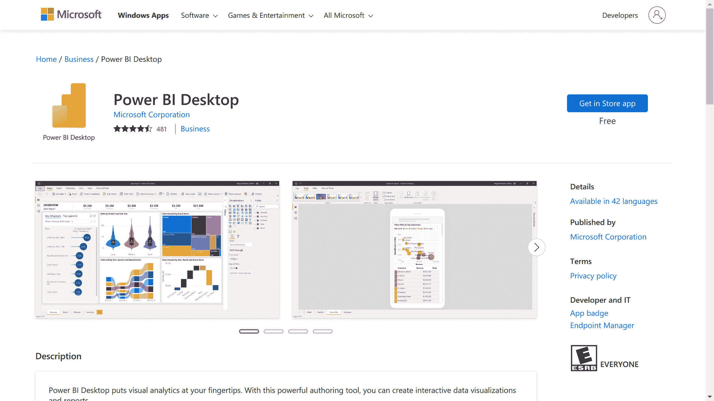](https://files.realpython.com/media/pbi_ms_store.50ee4a8a6c08.png)

<figcaption class="figure-caption text-center">Power BI Desktop in Microsoft Store</figcaption>

通过从微软商店安装 Power BI Desktop】，您将确保自动快速更新到最新的 Power BI 版本，而无需以系统管理员身份登录。然而，如果这种方法对你不起作用，那么你总是可以尝试[从微软下载中心下载安装程序](https://www.microsoft.com/en-us/download/details.aspx?id=58494)并手动运行它。可执行文件的大小大约为 400 兆字节。

安装 Power BI 桌面应用程序后，启动它，您将看到一个类似于下面的欢迎屏幕:

[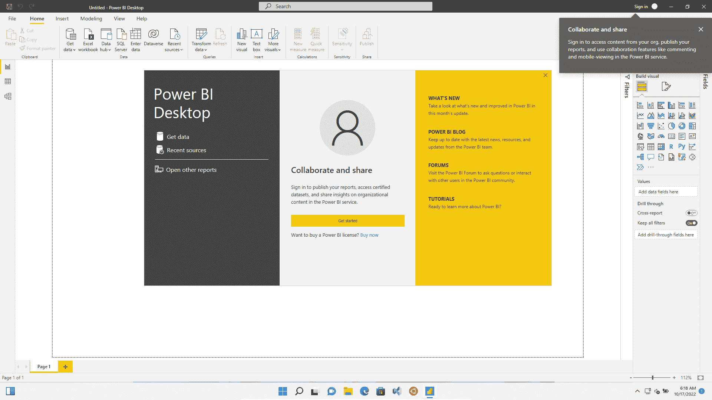](https://files.realpython.com/media/pbi_welcome_screen.0589e9f939e7.png)

<figcaption class="figure-caption text-center">The Welcome Screen in Power BI Desktop</figcaption>

如果 Power BI 桌面用户界面一开始令人生畏，请不要担心。在学习教程的过程中，您将了解一些基本知识。

### 安装微软 Visual Studio 代码

Microsoft Power BI Desktop 只提供基本的代码编辑功能，这是可以理解的，因为它主要是一个数据分析工具。它没有针对 Python 的智能上下文建议、自动完成或语法突出显示，而这些在处理代码时都是非常宝贵的。因此，除了在 Power BI 中编写最简单的 Python 脚本之外，您真的应该使用外部的[代码编辑器](https://realpython.com/python-ides-code-editors-guide/)来编写任何东西。

如果您已经使用了像 [PyCharm](https://realpython.com/pycharm-guide/) 这样的 IDE，或者如果您的工作流中不需要任何花哨的代码编辑特性，请随意跳过这一步。否则，考虑安装 [Visual Studio Code](https://realpython.com/python-development-visual-studio-code/) ，这是一个免费的、现代的、非常受欢迎的代码编辑器。因为它是由微软制造的，所以您可以在微软商店中快速找到它:

[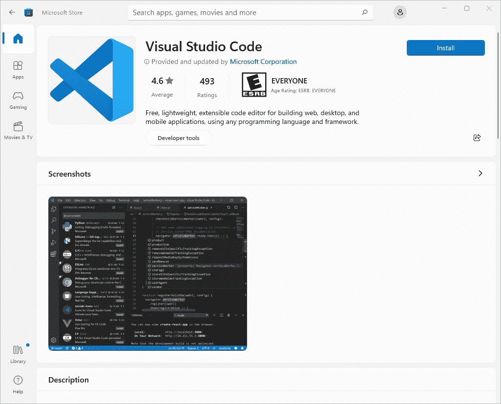](https://files.realpython.com/media/vscode_ms_store.8211ffaf570f.png)

<figcaption class="figure-caption text-center">Visual Studio Code in Microsoft Store</figcaption>

微软 Visual Studio Code，或者有些人喜欢称之为 **VS Code** ，是一个通用代码编辑器，通过扩展支持许多编程语言。它不理解 Python 的开箱即用。但是当你用 Python 源代码打开一个现有文件或者创建一个新文件，并选择 Python 作为 VS 代码中的语言时，它会提示你安装[推荐的 Python 扩展集](https://marketplace.visualstudio.com/items?itemName=ms-python.python):

[](https://files.realpython.com/media/vscode_extensions.2824af0d2009.png)

<figcaption class="figure-caption text-center">Visual Studio Code Extensions for Python</figcaption>

在您确认并继续之后，VS 代码会要求您指定 Python 解释器的路径。在大多数情况下，它会自动为你检测到一个。如果你还没有在你的电脑上安装 Python，那么看看下一部分，在那里你也将接触到 pandas 和 Matplotlib。

### 安装 Python、pandas 和 Matplotlib

现在是时候安装 Python 了，还有 Power BI Desktop 所需的几个库，以使您的 Python 脚本在这个数据分析工具中工作。

如果您是一名数据分析师，那么您可能已经在使用 [Anaconda](https://www.anaconda.com/) ，这是一个流行的 Python 发行版，捆绑了数百个科学库和一个定制的包管理器。数据分析师倾向于选择 Anaconda，而不是标准的 Python 发行版，因为它使他们的环境设置更加方便。具有讽刺意味的是，使用 Power BI Desktop 设置 Anaconda 比使用标准 Python 更麻烦，而且微软甚至不推荐这样做:

> 需要额外准备环境的发行版(例如 Conda)可能会遇到执行失败的问题。我们建议使用 https://www.python.org/的官方 Python 发行版来避免相关问题。([来源](https://learn.microsoft.com/en-us/power-bi/connect-data/desktop-python-scripts#using-custom-python-distributions))

Anaconda 通常使用几代以前的 Python 版本，这是如果您想保持领先地位，那么更喜欢标准发行版的另一个原因。也就是说，您将在下一节中找到一些关于如何使用 Anaconda 和 Power BI Desktop 的帮助。

如果你之前没有在电脑上安装过 Python，那么你最好的选择是再次使用微软商店。找到最新的 Python 版本并继续安装:

[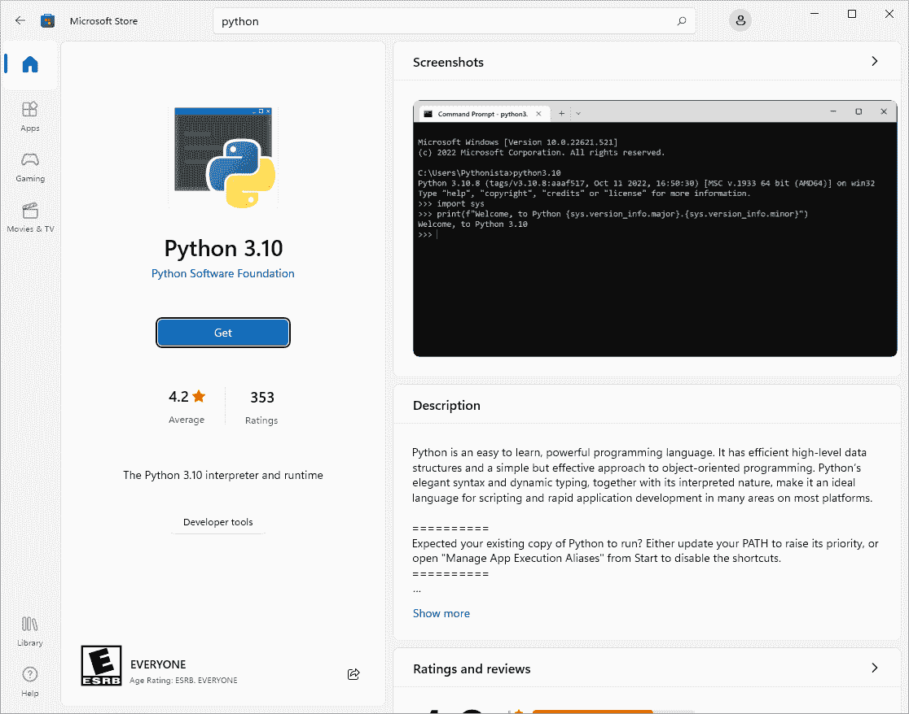](https://files.realpython.com/media/python_ms_store.5389cc523763.png)

<figcaption class="figure-caption text-center">Python in Microsoft Store</figcaption>

安装完成后，您将在开始菜单中看到几个新条目。它还将使`python`命令在命令提示符下立即可用，以及用于安装第三方 Python 包的 [`pip`](https://realpython.com/what-is-pip/) 。

**注意:**在本教程中，你将使用 [Windows 终端](https://realpython.com/python-coding-setup-windows/#discovering-the-windows-terminal)，它默认安装在 Windows 11 上。如果你使用的是 Windows 10 或更低版本，那么花一分钟时间从微软商店[手动安装 Windows 终端](https://realpython.com/python-coding-setup-windows/#installing-windows-terminal)。简单来说，Windows 终端是一个通用容器，可以托管多个 shell，比如 [PowerShell](https://en.wikipedia.org/wiki/PowerShell) 。

Power BI Desktop 要求您的 Python 安装有两个额外的库， **pandas** 和 **Matplotlib** ，除非您使用过 Anaconda，否则它们不会作为标准提供。然而，将第三方包安装到全局或系统范围的 Python 解释器中被认为是一种不好的做法。此外，由于 Windows 上的权限限制，您将无法从 Power BI 运行系统解释程序。相反，您需要一个 Python 虚拟环境。

虚拟环境是一个包含全局 Python 解释器副本的文件夹，你可以随意摆弄。您可以在其中安装额外的库，而不用担心破坏其他可能也依赖于 Python 的程序。在任何时候，您都可以安全地删除包含您的虚拟环境的文件夹，并且之后 Python 仍然在您的计算机上。

PowerShell 默认禁止运行脚本，包括那些用于管理 Python 虚拟环境的脚本，因为有一个[受限执行策略](https://learn.microsoft.com/en-us/powershell/module/microsoft.powershell.core/about/about_execution_policies?view=powershell-7.2#restricted)。在激活虚拟环境之前，需要进行一些初始设置。进入你的开始菜单，找到 Windows 终端，点击右键，选择*以管理员身份运行*，点击*是*确认。接下来，键入以下命令来提升您的**执行策略**:

```py
PS> Set-ExecutionPolicy RemoteSigned
```

确保您以系统管理员的身份运行该命令，以防出现任何错误。

[RemoteSigned](https://learn.microsoft.com/en-us/powershell/module/microsoft.powershell.core/about/about_execution_policies?view=powershell-7.2#remotesigned) 策略将允许您运行本地脚本以及从互联网下载的脚本，只要它们由可信机构签名。这个配置只需要做一次，所以现在可以关闭窗口了。然而，[在 Windows](https://realpython.com/python-coding-setup-windows/) 上设置 Python 编码环境还有更多的事情要做，所以如果你感兴趣的话，请随意查看指南。

现在，是时候为您的虚拟环境选择一个父文件夹了。例如，它可能在您的工作区中，用于 Power BI 报告。但是，如果您不确定将它放在哪里，那么您可以使用 Windows 用户的桌面文件夹，这样可以很快找到它。在这种情况下，右击桌面上的任意位置，选择*在终端*中打开选项。这将打开 Windows 终端，将您的桌面作为当前工作目录。

接下来，使用 Python 的`venv`模块在本地文件夹中创建一个新的虚拟环境。您可以将文件夹命名为`powerbi-python`,以提醒自己以后的用途:

```py
PS> python -m venv powerbi-python
```

几秒钟后，你的桌面上会出现一个新文件夹，里面有 Python 解释器的副本。现在，您可以通过运行激活脚本来激活虚拟环境，然后安装 Power BI 所需的两个库。当桌面仍是您的当前工作目录时，键入以下两个命令:

```py
PS> .\powerbi-python\Scripts\activate
(powerbi-python) PS> python -m pip install pandas matplotlib
```

激活它之后，您应该在提示中看到您的虚拟环境的名称`powerbi-python`。否则，您将在全局 Python 解释器中安装第三方包，这是您首先想要避免的。

好了，你差不多准备好了。如果您想在您的环境中添加更多的库，您可以重复激活虚拟环境和使用`pip`安装其他第三方包这两个步骤。接下来，您将告诉 Power BI 在您的虚拟环境中哪里可以找到 Python。

[*Remove ads*](/account/join/)

### *为 Python 配置 Power BI Desktop】*

 *返回到 Power BI Desktop，或者，如果您已经关闭了它，请再次启动它。点击窗口右上角的 X 图标退出欢迎屏幕，从*文件*菜单中选择*选项和设置*。然后，进入*选项*，它旁边有一个齿轮图标:

[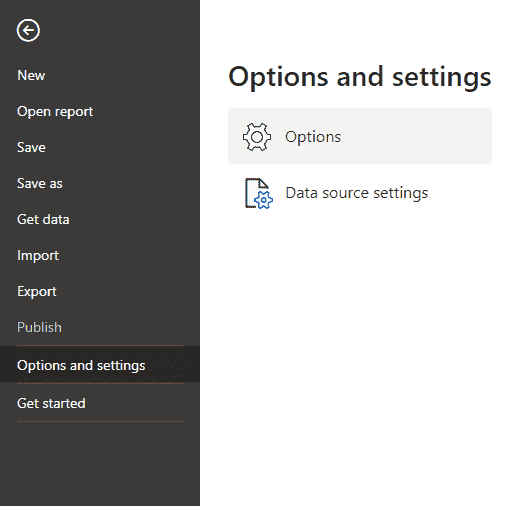](https://files.realpython.com/media/pbi_options_settings.6cce85c7d133.png)

<figcaption class="figure-caption text-center">Options and Settings in Power BI Desktop</figcaption>

这将显示按类别分组的许多配置选项。点击左侧栏中标有 *Python 脚本*的组，点击下图所示的*浏览*按钮，设置 **Python 主目录**:

[](https://files.realpython.com/media/powerbi_python_path2.379d9232b52f.png)

<figcaption class="figure-caption text-center">Python Options in Power BI Desktop</figcaption>

您必须在虚拟环境中指定到`Scripts`子文件夹的路径，该子文件夹包含`python.exe`可执行文件。如果您将虚拟环境放在桌面文件夹中，那么您的路径应该如下所示:

```py
C:\Users\User\Desktop\powerbi-python\Scripts
```

将`User`替换为您的用户名。如果指定的路径无效并且不包含虚拟环境，那么您将得到一个合适的错误消息。


如果你的电脑上有 Anaconda 或者它的精简版 [Miniconda](https://docs.conda.io/en/latest/miniconda.html) 版本，那么 Power BI Desktop 应该会自动检测到它。不幸的是，为了让它正常工作，您需要从开始菜单启动 **Anaconda 提示符**，并首先手动创建一个包含两个必需库的独立环境:

```py
(base) C:\Users\User> conda create --name powerbi-python pandas matplotlib
```

这类似于用常规的 Python 发行版建立一个虚拟环境，并使用`pip`来安装第三方包。

接下来，您会想要列出您的 [conda 环境](https://docs.conda.io/projects/conda/en/latest/user-guide/concepts/environments.html)，并记下到您新创建的`powerbi-python`环境的路径:

```py
(base) C:\Users\User> conda env list
# conda environments:
#
base                  *  C:\Users\User\anaconda3
powerbi-python           C:\Users\User\anaconda3\envs\powerbi-python
```

复制相应的路径并将其粘贴到 Power BI 的配置中，以设置 Python 主文件夹选项。注意，对于 conda 环境，您不需要指定任何子文件夹，因为 Python 可执行文件就位于环境的父文件夹中。

虽然仍然在 *Python 脚本*选项中，你会在下面找到另一个有趣的配置。它允许您指定默认的 Python IDE 或代码编辑器，Power BI 应该在您编写代码片段时为您启动这些编辑器。您可以保留与文件扩展名`.py`相关联的操作系统默认程序，也可以指定您选择的特定 Python IDE:

[](https://files.realpython.com/media/powerbi_ide2.3e4bb8953582.png)

<figcaption class="figure-caption text-center">Python IDE Options in Power BI Desktop</figcaption>

要指定您最喜欢的 Python IDE，请从第一个下拉列表中选择 *Other* ,并浏览到您的代码编辑器的可执行文件，如下所示:

```py
C:\Users\User\AppData\Local\Programs\Microsoft VS Code\Code.exe
```

和以前一样，您计算机上的正确路径可能不同。关于使用带有 Power BI 的外部 Python IDE 的更多细节，请查看在线文档。

恭喜你！这就是 Python 的 Power BI Desktop 的配置。最重要的设置是 Python 虚拟环境的路径，它应该包含 pandas 和 Matplotlib 库。在下一节中，您将看到 Power BI 和 Python 的实际应用。

## 在 Power BI 中运行 Python

在 Power BI Desktop 中有三种运行 Python 代码的方式，它们与数据分析师的典型工作流程相集成。具体来说，您可以使用 Python 作为一个**数据源**来加载或生成报表中的数据集。您还可以使用 Python 在 Power BI 中对任何数据集执行清理和其他**转换**。最后，您可以利用 Python 的绘图库创建**数据可视化**。现在您将体验所有这些应用程序！

### 数据来源:导入一个`pandas.DataFrame`

假设您必须从 Power BI 不支持的专有或遗留系统中获取数据。也许你的数据存储在一个过时的或不太流行的文件格式中。在任何情况下，您都可以编写一个 Python 脚本，通过一个或多个 [`pandas.DataFrame`](https://realpython.com/pandas-dataframe/) 对象将双方粘在一起。

一个**数据帧**是一种表格数据存储格式，很像关系数据库中的电子表格或表格。它是二维的，由行和列组成，其中每一列通常都有一个关联的数据类型，比如数字或日期。Power BI 可以从保存有熊猫数据帧的 [Python 变量](https://realpython.com/python-variables/)中抓取数据，并且可以将带有数据帧的变量注入到你的脚本中。

在本教程中，您将使用 Python 从 [SQLite](https://en.wikipedia.org/wiki/SQLite) 加载虚假销售数据，SQLite 是一个广泛使用的基于文件的数据库引擎。请注意，在 Power BI Desktop 中直接获取这些数据在技术上是可行的，但前提是安装合适的 SQLite 驱动程序并使用 [ODBC](https://en.wikipedia.org/wiki/Open_Database_Connectivity) 连接器。另一方面，Python 支持 SQLite，所以选择它可能更方便。

在开始编写代码之前，探索一下您的数据集，对您将要处理的内容有所了解会有所帮助。这将是一个由存储在`car_sales.db`文件中的**二手车经销商**数据组成的单一表格。请记住，您可以通过单击下面的链接下载此样本数据集:

**源代码:** [点击此处获取免费的源代码和数据集](https://realpython.com/bonus/power-bi-python-code/)，您将使用它们将 Python 和 Power BI 结合起来，获得超强的商业洞察力。

表格中有**千条记录**和**十一列**，分别代表售出的汽车、它们的购买者以及相应的销售明细。您可以通过使用下面的代码片段将这个样本数据库加载到 pandas 数据帧中，并对 [Jupyter 笔记本](https://realpython.com/jupyter-notebook-introduction/)中的几条记录进行采样，来快速可视化这个样本数据库:

```py
import sqlite3
import pandas as pd

with sqlite3.connect(r"C:\Users\User\Desktop\car_sales.db") as connection:
    df = pd.read_sql_query("SELECT * FROM sales", connection)

df.sample(15)
```

请注意，`car_sales.db`文件的路径在您的计算机上可能不同。如果你不能使用 Jupyter Notebook，那么试着安装一个像 [SQLite Browser](https://github.com/sqlitebrowser/sqlitebrowser) 这样的工具，把文件加载进去。无论哪种方式，样本数据都应该表示为类似于下表的表格:

[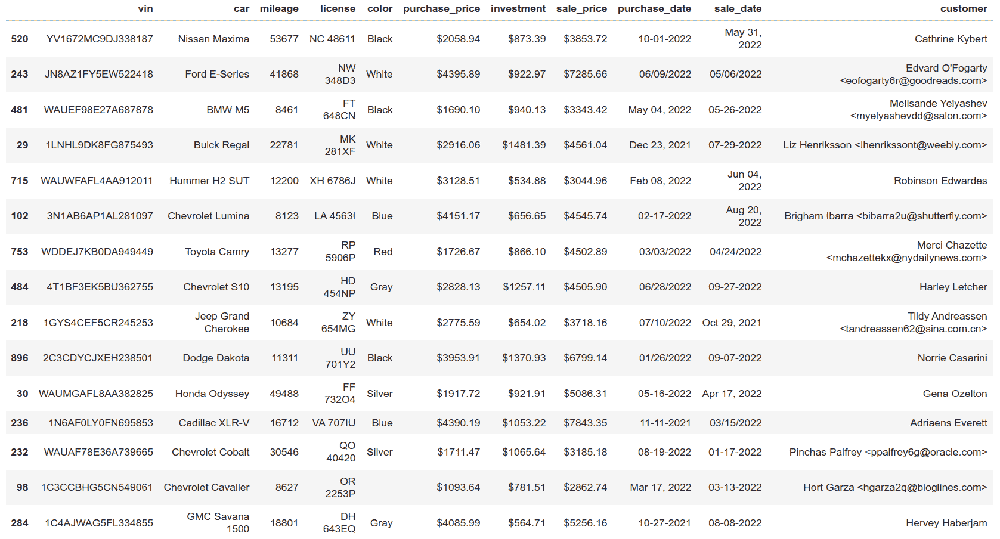](https://files.realpython.com/media/pbi_sample_dataset.3d693f3e1773.png)

<figcaption class="figure-caption text-center">Used Car Sales Dataset</figcaption>

一眼就可以看出，由于底层数据的几个问题，该表需要清理。然而，您将在稍后的 [Power Query](https://learn.microsoft.com/en-us/power-query/) 编辑器中，在[数据转换](#power-query-editor-transform-and-augment-data)阶段处理它们中的大部分。现在，专注于将数据加载到 Power BI 中。

只要您还没有关闭 Power BI 中的欢迎屏幕，您就可以点击左边带有圆柱图标的链接 *Get data* 。或者，您可以在报告的主视图上单击*从另一个来源获取数据*，因为为数不多的快捷图标中没有一个包含 Python。最后，如果没有帮助，那么使用顶部的菜单，选择*主页**获取数据**更多……*，如下所示:

[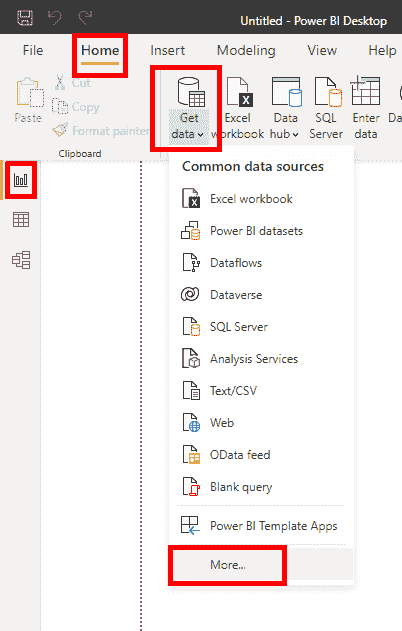](https://files.realpython.com/media/pbi_add_data_menu2.b70aeb845ea7.png)

<figcaption class="figure-caption text-center">Get Data Menu in Power BI Desktop</figcaption>

这样做将显示一个弹出窗口，其中选择了几个数据源的 Power BI 连接器[，包括一个 **Python 脚本**，您可以通过在搜索框中键入 *python* 来找到它:](https://learn.microsoft.com/en-us/power-bi/connect-data/power-bi-data-sources)

[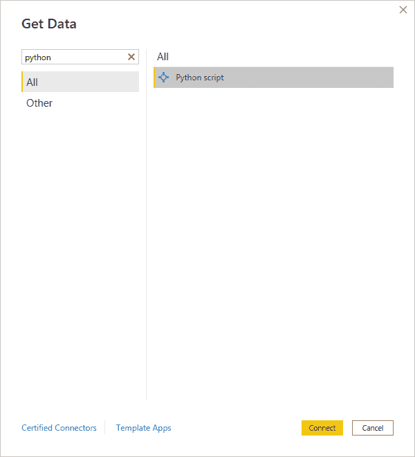](https://files.realpython.com/media/pbi_get_data_popup.16e4ada52196.png)

<figcaption class="figure-caption text-center">Get Data Pop-Up Window in Power BI Desktop</figcaption>

选中后点击底部的*连接*按钮确认。之后，您将看到 Python 脚本的一个空白编辑器窗口，您可以在其中键入一个简短的代码片段来将记录加载到 pandas 数据帧中:

[](https://files.realpython.com/media/pbi_python_script_popup.0a03dbcf1846.png)

<figcaption class="figure-caption text-center">Python Editor in Power BI Desktop</figcaption>

请注意，Power BI 内置的编辑器中缺少语法突出显示或智能代码建议。正如您之前了解到的，最好使用外部代码编辑器，比如 VS Code，来测试一切是否按预期运行，然后将您的 Python 代码粘贴到 Power BI。

在继续之前，您可以仔细检查 Power BI 是否使用了正确的虚拟环境，安装了 pandas 和 Matplotlib，方法是阅读编辑器下方的文本。

虽然附加的 SQLite 数据库中只有一个表，但它目前以[非规范化的形式](https://en.wikipedia.org/wiki/Database_normalization)保存，这使得关联的数据变得冗余，容易出现各种异常。将单独的实体，如**汽车**、**销售**和**客户**提取到单独的数据框架中，将是朝着正确方向纠正这种情况的良好的第一步。

幸运的是，您的 Python 脚本可以生成任意多的数据帧，Power BI 将允许您选择在最终报告中包含哪些数据帧。例如，您可以通过以下方式使用列子集来提取这三个实体:

```py
import sqlite3
import pandas as pd

with sqlite3.connect(r"C:\Users\User\Desktop\car_sales.db") as connection:
    df = pd.read_sql_query("SELECT * FROM sales", connection)

cars = df[
    [
        "vin",
        "car",
        "mileage",
        "license",
        "color",
        "purchase_date",
        "purchase_price",
        "investment",
    ]
]
customers = df[["vin", "customer"]]
sales = df[["vin", "sale_price", "sale_date"]]
```

首先，通过为`car_sales.db`文件指定一个合适的路径来连接到 SQLite 数据库，这个路径在您的计算机上可能看起来不同。接下来，运行一个 **SQL 查询**，选择`sales`表中的所有行，并将它们放入一个名为`df`的新的 pandas 数据帧中。最后，通过挑选特定的列，创建三个额外的数据框架。[车辆识别号(VIN)](https://en.wikipedia.org/wiki/Vehicle_identification_number) 作为**主键**绑定相关记录。

**注意:**在 Python 代码中习惯将`pandas`缩写为`pd`。通常，你还会看到变量名`df`用于一般的、短暂的数据帧。但是，作为一般规则，请为变量选择有意义和描述性的名称，以使代码更具可读性。

当您点击 *OK* 并等待几秒钟时，Power BI 将为您呈现 Python 脚本生成的四个数据帧的可视化表示。假设没有语法错误，并且您指定了数据库的正确文件路径，您应该会看到以下窗口:

[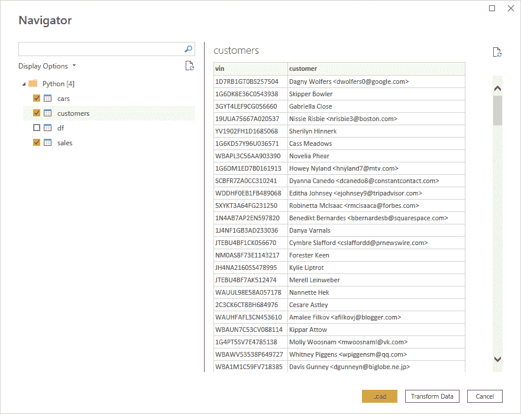](https://files.realpython.com/media/pbi_navigator.84e323e91704.png)

<figcaption class="figure-caption text-center">Processed DataFrames in Power Query Editor</figcaption>

结果表名对应于您的 Python 变量。当你点击一个，你会看到一个包含数据的快速预览。上面的屏幕截图显示了 *customers* 表，它只包含两列。

在左边的层级树中选择*汽车*、*客户*和*销售*，同时去掉 *df* ，因为你不需要那个。现在，您可以通过将选定的数据框架加载到报表中来完成数据导入。然而，您将想要点击一个标记为*转换数据*的按钮来使用 Power BI 中的熊猫执行[数据清理。](https://realpython.com/python-data-cleaning-numpy-pandas/)

**注意:**有关本节主题的更多详细信息，请查看微软关于如何在 Power BI Desktop 中[运行 Python 脚本的文档。](https://learn.microsoft.com/en-us/power-bi/connect-data/desktop-python-scripts)

在下一节中，您将学习如何使用 Python 来清理、转换和扩充您在 Power BI 中使用的数据。

[*Remove ads*](/account/join/)

### *超级查询编辑器:转换和扩充数据*

 *如果您遵循了本教程中的步骤，那么您应该已经在 **Power Query Editor** 中结束，它显示了您之前选择的三个数据帧。在这个视图中，它们被称为*查询*。但是，如果您已经将数据加载到 Power BI 报告中，而没有应用任何转换，那么不必担心！您可以随时调出同一个编辑器。

点击左侧功能区中间的表格图标，导航至**数据**透视图，然后从*主页*菜单中选择*转换数据*:

[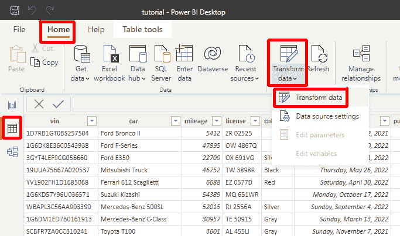](https://files.realpython.com/media/pbi_transform_data.f8bc0ea8b28a.png)

<figcaption class="figure-caption text-center">Transform Data Menu in Power BI Desktop</figcaption>

或者，您可以在窗口最右侧的数据视图中右键单击其中一个*字段*，并选择*编辑查询*以获得相同的效果。一旦 Power Query Editor 窗口再次出现，它将在左侧包含您的数据帧或*查询*，在右侧包含当前所选数据帧的*应用步骤*，中间是行和列:

[](https://files.realpython.com/media/pbi_power_query_editor.ec4fbaa6f7b8.png)

<figcaption class="figure-caption text-center">Power Query Editor Window</figcaption>

步骤代表了针对*查询*以类似流水线的方式从上到下应用的一系列数据转换。每一步都表示为一个[幂查询 M](https://learn.microsoft.com/en-us/powerquery-m/) 公式。名为 *Source* 的第一步是调用 Python 脚本，该脚本基于 SQLite 数据库生成四个数据帧。另外两步找出相关的数据帧，然后转换列类型。

**注意:**通过点击 *Source* 步骤旁边的齿轮图标，您将显示数据摄取脚本的原始 Python 源代码。您可以使用该特性来访问和编辑嵌入到 Power BI 报告中的 Python 代码，即使是在将其保存为`.pbix`文件之后。

您可以在管道中插入自定义步骤，以便对数据转换进行更精细的控制。Power BI Desktop 提供了大量内置转换，您可以在 Power Query Editor 的顶部菜单中找到这些转换。但是在本教程中，您将探索**运行 Python 脚本**转换，这是在 Power BI 中运行 Python 代码的第二种模式:

[](https://files.realpython.com/media/pbi_transfomr_python2.3caaa09512c8.png)

<figcaption class="figure-caption text-center">Run Python Script in Power Query Editor</figcaption>

从概念上讲，它的工作方式与数据接收几乎相同，但也有一些不同。首先，您可以对 Power BI 本机支持的任何数据源使用这种转换，因此这可能是 Python 在您的报告中的唯一用途。其次，您在脚本中得到一个名为`dataset`的**隐式全局变量**，它保存管道中数据的当前状态，表示为 pandas DataFrame。

**注意:**和以前一样，您的脚本可以生成多个数据帧，但是您只能选择一个在转换管道中进行进一步处理。您也可以决定就地修改数据集，而不创建任何新的数据框。

Pandas 允许您使用[正则表达式](https://realpython.com/regex-python/)从现有列中提取值到新列中。例如，您的表中的一些客户的姓名旁边有一个用尖括号(`<>`)括起来的电子邮件地址，它实际上应该属于一个单独的列。

选择*客户*查询，然后选择最后一个*变更类型*步骤，并为应用的步骤添加一个*运行 Python 脚本*转换。当弹出窗口出现时，在其中键入以下代码片段:

```py
# 'dataset' holds the input data for this script
dataset = dataset.assign(
    full_name=dataset["customer"].str.extract(r"([^<]+)"),
    email=dataset["customer"].str.extract(r"<([^>]+)>")
).drop(columns=["customer"])
```

Power BI 将隐式的`dataset`变量注入到您的脚本中，以引用`customers`数据帧，因此您可以访问它的方法并用转换后的数据覆盖它。或者，您可以为结果数据帧定义一个新变量。在转换过程中，您分配两个新的列，`full_name`和`email`，然后删除包含这两个信息的原始的`customer`列。

点击 *OK* 并等待几秒钟后，您将看到一个表格，其中包含您的脚本生成的数据帧:

[](https://files.realpython.com/media/pbi_choose_table.58c666d982ba.png)

<figcaption class="figure-caption text-center">DataFrames Produced by the Python Script</figcaption>

只有一个名为`dataset`的数据帧，因为您为新的数据帧重用了 Power BI 提供的隐式全局变量。继续点击*值*列中的黄色*表*链接，选择您的数据框架。这将生成应用步骤的新输出:

[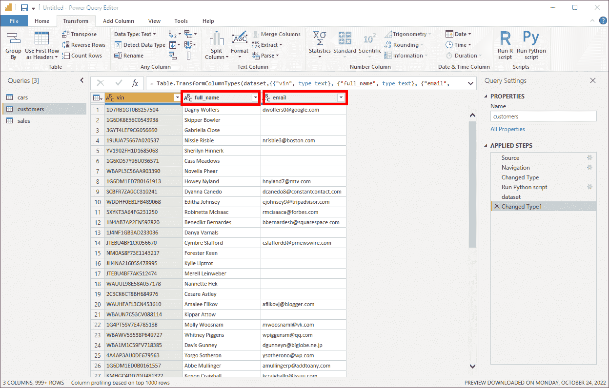](https://files.realpython.com/media/pbi_transformed2.8fab81c07899.png)

<figcaption class="figure-caption text-center">Dataset Transformed With Python</figcaption>

突然，在您的*客户*表中出现了两个新列。现在，您可以立即找到没有提供电子邮件地址的客户。如果您愿意，您可以添加更多的转换步骤，例如，将`full_name`列拆分为`first_name`和`last_name`，假设没有超过两个名称的边缘案例。

确保选择了最后一个步骤，并将另一个*运行 Python 脚本*插入到应用的步骤中。相应的 Python 代码应该如下所示:

```py
# 'dataset' holds the input data for this script
dataset[
    ["first_name", "last_name"]
] = dataset["full_name"].str.split(n=1, expand=True)
dataset.drop(columns=["full_name"], inplace=True)
```

与上一步不同的是，`dataset`变量引用了一个有三列的数据帧，`vin`、`full_name`和`email`，因为您在管道的更下面。另外，请注意`inplace=True`参数，它从现有的 DataFrame 中删除了`full_name`列，而不是返回一个新的对象。

您会注意到，Power BI 为应用的步骤给出了通用名称，并在相同步骤的多个实例中为它们附加了连续的数字。幸运的是，您可以通过右键单击一个步骤并从上下文菜单中选择 *Rename* 来为这些步骤提供更具描述性的名称:

[](https://files.realpython.com/media/pbi_rename_step.6907491610b8.png)

<figcaption class="figure-caption text-center">Rename an Applied Step in Power Query Editor</figcaption>

通过编辑*属性…* ，您还可以用几句话描述给定步骤试图完成的内容。

使用 Power BI 中的 **pandas 和 Python** 可以做更多的事情来转换数据集！例如，您可以:

*   匿名敏感的个人信息，如信用卡号码
*   从数据集中识别和提取新实体
*   拒绝缺少交易细节的汽车销售
*   删除重复的销售记录
*   根据车辆识别号合成汽车的型号年份
*   统一不一致的购销日期格式

这些只是一些想法。虽然本教程没有足够的空间来涵盖所有内容，但是非常欢迎您自己进行实验并查看额外的资料。注意，在 Power BI 中使用 Python 转换数据的成功将取决于您对 pandas 的了解，Power BI 在幕后使用 pandas。要提高您的技能，请在 Real Python 查看数据科学学习路径的 [pandas。](https://realpython.com/learning-paths/pandas-data-science/)

当您完成数据集的转换后，您可以通过从*主页*功能区中选择*关闭&应用*或在*文件*菜单中选择其别名来关闭 Power Query 编辑器:

[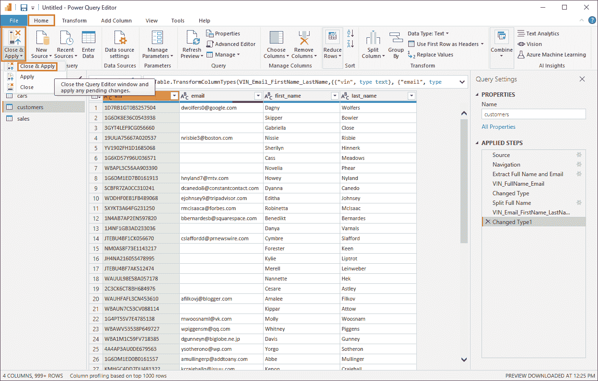](https://files.realpython.com/media/pbi_apply_changes.15c90f15a7ce.png)

<figcaption class="figure-caption text-center">Apply Pending Changes in the Datasets</figcaption>

这将跨数据集应用所有转换步骤，并返回到 Power BI Desktop 的主窗口。

**注意:**关于本节主题的更多细节，请查看微软关于如何在 Power Query Editor 中[使用 Python 的文档。](https://learn.microsoft.com/en-us/power-bi/connect-data/desktop-python-in-query-editor)

接下来，您将学习如何使用 Python 来生成定制的数据可视化。

[*Remove ads*](/account/join/)

### *视觉效果:绘制数据的静态图像*

 *到目前为止，您已经导入并转换了数据。Python 在 Power BI Desktop 中的第三个也是最后一个应用是绘制数据的**可视化表示**。当创建可视化时，您可以使用任何受[支持的 Python 库](https://learn.microsoft.com/en-us/power-bi/connect-data/service-python-packages-support#python-packages-that-are-supported-in-power-bi)，只要您已经将它们安装在 Power BI 使用的虚拟环境中。然而，Matplotlib 是绘图的基础，这些库无论如何都要委托给它。

除非 Power BI 已经在转换数据集后将您带到了*报告*透视图，否则现在通过单击左侧功能区上的图表图标导航到那里。您应该会看到一个空白的报告画布，您将在其中放置您的图表和其他交互式组件，共同命名为*视觉效果*:

[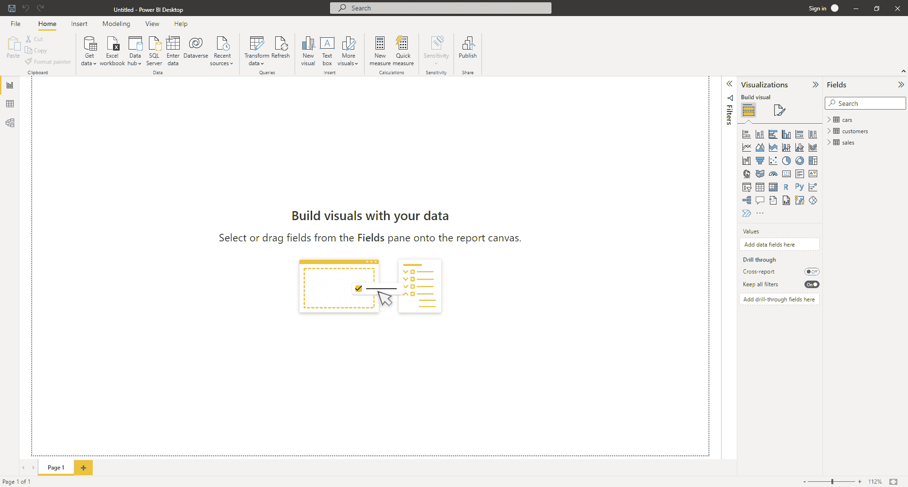](https://files.realpython.com/media/pbi_report_blank.86a4e099cd2f.png)

<figcaption class="figure-caption text-center">Blank Report Canvas in Power BI Desktop</figcaption>

在右侧的*可视化*面板中，您会看到许多与可用视觉效果相对应的图标。找到 *Python 可视化工具*的图标，点击它将可视化工具添加到报告画布中。第一次将 Python 或 [R](https://en.wikipedia.org/wiki/R_(programming_language)) 可视化添加到 Power BI 报告时，它会要求您**启用脚本可视化**:

[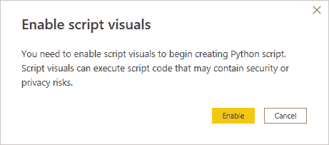](https://files.realpython.com/media/pbi_enable_script_visuals.9fd923ec6202.png)

<figcaption class="figure-caption text-center">Enable Script Visuals Pop-Up Window in Power BI Desktop</figcaption>

事实上，在每次 Power BI 会话中，它都会一直问你同样的问题，因为这没有全局设置。当您打开一个包含使用脚本可视化的已保存报告的文件时，您可以选择在启用它之前检查嵌入的 Python 代码。为什么？简而言之，Power BI 关心您的隐私，因为如果脚本来自不可信的来源，任何脚本都可能泄漏或损坏您的数据。

在右侧的*字段*工具栏中展开您的*汽车*表，并将它的`color`和`vin`列拖放到您的视图的*值*上:

[](https://files.realpython.com/media/pbi_visual_values.e45190a232dd.png)

<figcaption class="figure-caption text-center">Drag and Drop Data Fields Onto a Visual</figcaption>

这些将成为 Python 脚本中 Power BI 提供的隐式`dataset` DataFrame 的 *only* 列。将这些数据字段添加到 visual 的值中会启用窗口底部的 **Python 脚本编辑器**。有点令人惊讶的是，这一个确实提供了基本的语法突出显示:

[](https://files.realpython.com/media/pbi_python_script_editor.31b9c46c869f.png)

<figcaption class="figure-caption text-center">Python Script Editor of a Power BI Visual</figcaption>

但是，如果您已经将 Power BI 配置为使用外部代码编辑器，那么单击小斜箭头图标(`↗`)将启动它并打开脚本的整个框架。您可以暂时忽略它的内容，因为您将在接下来的部分中探索它。不幸的是，当您完成编辑后，您必须手动将脚本中自动生成的`# Prolog`和`# Epilog`注释之间的部分复制并粘贴回 Power BI。

**注意:**不要忽略 Python 脚本编辑器中的黄色警告栏，它提醒你有重复值的行将被删除。如果您只拖动`color`列，那么您将得到与少数几种独特颜色相对应的少数记录。但是，添加`vin`列通过让颜色在整个表中重复来防止这种情况，这在执行聚合时很有用。

为了演示 Python 可视化在 Power BI 中的基本用法，您可以绘制一个**条形图**,显示涂有给定颜色的汽车数量:

```py
# The following code to create a dataframe and remove duplicated
# rows is always executed and acts as a preamble for your script:

# dataset = pandas.DataFrame(color, vin)
# dataset = dataset.drop_duplicates()

# Paste or type your script code here:
import matplotlib.pyplot as plt

plt.style.use("seaborn")

series = dataset[dataset["color"] != ""]["color"].value_counts()
series.plot(kind="bar", color=series.index, edgecolor="black")

plt.show()
```

你首先启用 Matplotlib 的主题，它模仿了 [seaborn](https://seaborn.pydata.org/) 库，与默认的相比，它有一个稍微更吸引人的[外观和感觉](https://en.wikipedia.org/wiki/Look_and_feel)。接下来，您排除缺少颜色的记录，并计算每个唯一颜色组中剩余的颜色。这将产生一个 [`pandas.Series`](https://pandas.pydata.org/docs/reference/api/pandas.Series.html) 对象，您可以使用它的由颜色名称组成的索引对其进行绘图和颜色编码。最后你调用`plt.show()`渲染剧情。

要首次触发此代码，您必须单击 Python 脚本编辑器中的播放图标，因为您尚未在报告中显示任何数据。如果你得到一个关于没有创建图像的错误，那么检查你是否在脚本的末尾调用了`plt.show()`。Matplotlib 有必要在[默认后端](https://matplotlib.org/stable/users/explain/backends.html#what-is-a-backend)上渲染绘图，这意味着将渲染的 PNG 图像写入磁盘上的文件，Power BI 可以加载并显示该文件。

只要一切顺利，您的空白报告应该会增加一些颜色:

[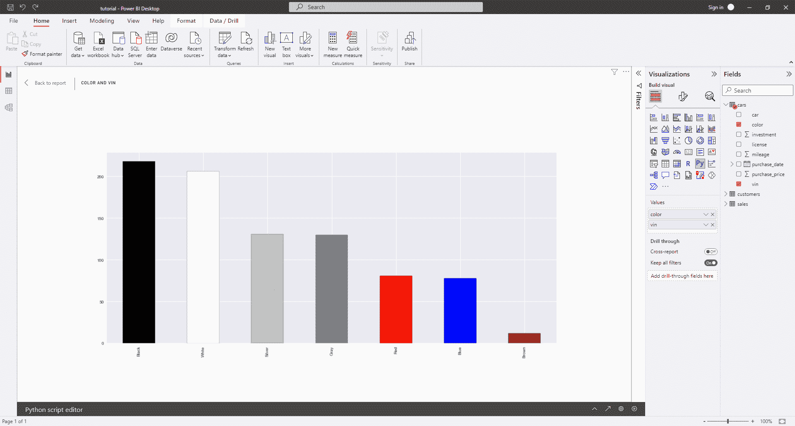](https://files.realpython.com/media/pbi_python_visual.a398db07a45e.png)

<figcaption class="figure-caption text-center">Distribution of Car Colors in the Whole Dataset</figcaption>

您可以移动和调整视觉效果以使其变大或更改其比例。或者，您可以通过点击视觉上的相关图标进入*聚焦模式*，这将扩展它以适应可用空间。

Python 视觉效果**自动更新**以响应数据、过滤和高亮显示的变化，就像其他 Power BI 视觉效果一样。然而，渲染图像本身是**静态的**，所以你不能以任何方式与它交互来交叉过滤其他视觉效果。为了测试过滤是如何工作的，在你的汽车的*购买日期*数据字段旁边添加一个*切片器*:

[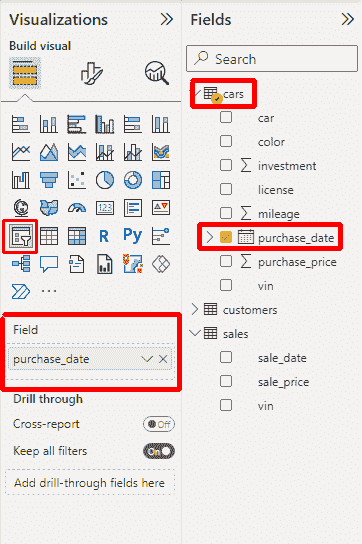](https://files.realpython.com/media/pbi_slicer.fce7fc65d502.png)

<figcaption class="figure-caption text-center">Slice the Dataset by Car Purchase Date</figcaption>

它将在您的报告中创建一个交互式滑块小部件，让您调整购车日期的范围。每当您调整这些日期时，Power BI 将重新运行您的 Python 脚本，以生成新的数据静态呈现，这无疑需要一些时间来更新:

[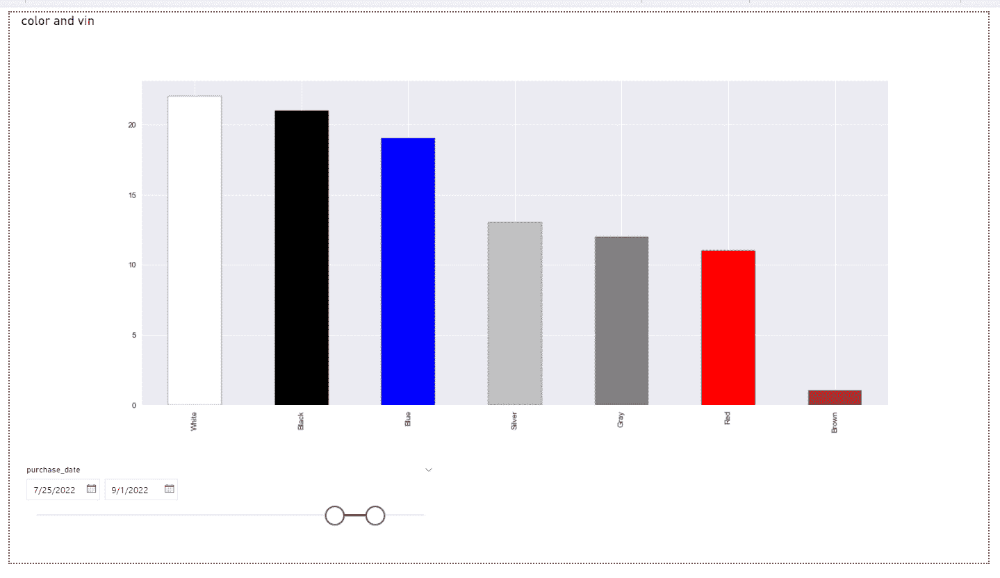](https://files.realpython.com/media/pbi_slicer_slider.280c5229398a.png)

<figcaption class="figure-caption text-center">Distribution of Car Colors in a Range of Purchase Dates</figcaption>

请注意，视觉上的颜色分布略有变化。除了对数据进行切片，您还可以在 Power BI 中定义一个过滤器，例如，只显示特定品牌的汽车颜色，这由 VIN 前缀决定。

**注意:**有关本节主题的更多细节，请查看微软关于如何使用 Python 创建 Power BI 视觉效果的[文档。](https://learn.microsoft.com/en-us/power-bi/connect-data/desktop-python-visuals)

Power BI 中的 Python 视觉效果仅仅是静态图像，分辨率限制在 72 DPI。它们不是交互式的，并且需要一些时间来更新。然而，尽管有这些限制，它们可以丰富 Power BI 中现有的视觉效果。

既然您已经有了在 Power BI Desktop 中使用 Python 的实践经验，那么是时候深入研究了。在下一节中，您将通过深入了解这两种工具的集成是如何工作的。

[*Remove ads*](/account/join/)

## *了解 Power BI 和 Python 的集成*

 *知道如何操作工具能给你带来有价值的技能。然而，工具内部的知识才是让你变得熟练的真正力量。请继续阅读，了解 Power BI Desktop 如何与 Python 和其他脚本语言集成。

### 截取电力毕的临时文件

Power BI 控制着处理报表数据的整个过程，因此它负责运行 Python 代码并与它双向交互。特别是，Power BI 需要为脚本提供一个要转换或可视化的数据帧，并且需要从该脚本加载数据帧或可视化。

促进外国程序之间的这种接口的最直接的机制是什么？

如果你想一想，那么你可能会意识到你一直在使用那个机制。例如，当您在 Microsoft Excel 或其他软件中制作电子表格时，您将它保存在其他程序可以读取的`.xlsx`文件中，前提是它们理解该特定的数据格式。这可能不是跨应用程序共享数据的最有效的方式，但它非常可靠。

Power BI 使用类似的方法，利用**文件系统**与 Python 脚本通信。然而，它是以自动化和稍微结构化的方式来实现的。每次 Power BI 想要执行一个 Python 脚本时，它会在用户文件夹中创建一个具有唯一伪随机名称的临时文件夹，如下所示:

```py
C:\Users\User\PythonScriptWrapper_a6a7009b-1938-471b-b9e4-a1668a38458a
│
├── cars.csv
├── customers.csv
├── df.csv
├── sales.csv
├── input_df_738f5a98-23e4-4873-b00e-0c5780220bb9.csv
└── PythonScriptWrapper.PY
```

该文件夹包含一个包装器脚本，其中包含您的 Python 代码。它还可能包含一个带有输入数据集的 [CSV 文件](https://realpython.com/python-interview-problem-parsing-csv-files/)，如果相关步骤不是管道中的第一个步骤，脚本会将该文件加载到`dataset`变量中。执行后，包装器脚本自动将数据帧转储到以相应全局变量命名的 CSV 文件中。Power BI 将让您选择这些表进行进一步的处理。

文件夹及其内容只是临时的，这意味着当不再需要它们时，它们会消失而不留任何痕迹。当脚本完成执行时，Power BI 会删除它们。

包装器脚本包含胶水代码，负责 Power BI 和 Python 之间的数据序列化和反序列化。这里有一个例子:

```py
# Prolog - Auto Generated #
import os, pandas, matplotlib
matplotlib.use('Agg')
import matplotlib.pyplot

import sys
sys.tracebacklimit = 0

os.chdir(u'C:/Users/User/PythonScriptWrapper_a6a7009b-1938-471b-b9e4-a1668a38458a')
dataset = pandas.read_csv('input_df_738f5a98-23e4-4873-b00e-0c5780220bb9.csv') 
matplotlib.pyplot.show = lambda args=None,kw=None: ()
POWERBI_GET_USED_VARIABLES = dir
# Original Script. Please update your script content here and once completed copy below section back to the original editing window 'dataset' holds the input data for this script

# ...

# Epilog - Auto Generated #
os.chdir(u'C:/Users/User/PythonScriptWrapper_a6a7009b-1938-471b-b9e4-a1668a38458a')
for key in POWERBI_GET_USED_VARIABLES():
 if (type(globals()[key]) is pandas.DataFrame):
  (globals()[key]).to_csv(key + '.csv', index = False)
```

突出显示的行是可选的，只会出现在管道的中间或终端步骤中，这些步骤会转换一些现有的数据集。另一方面，对应于第一步的数据摄取脚本不会包含任何要反序列化的输入数据帧，因此 Power BI 不会生成这个隐式变量。

包装器脚本由三部分组成，用 [Python 注释](https://realpython.com/python-comments-guide/)分隔:

1.  **Prolog:** 将输入 CSV 反序列化为 DataFrame，以及其他管道
2.  **Body:** 您的原始代码来自 Power BI Desktop 中的 Python 脚本编辑器
3.  **结尾:**将一个或多个数据帧序列化为 CSV 文件

如您所见，在 Power BI 中使用 Python 时，由于额外的[数据整理](https://en.wikipedia.org/wiki/Marshalling_(computer_science))成本，会产生大量的输入/输出开销。要转换一段数据，必须对其进行四次序列化和反序列化，顺序如下:

1.  电源 BI 至 CSV
2.  CSV 到 Python
3.  Python 到 CSV
4.  CSV 至 Power BI

读写文件是昂贵的操作，不能与在同一程序中直接访问共享内存相比。因此，如果您有大型数据集，并且**性能**对您至关重要，那么您应该更喜欢 Power BI 的内置转换和[数据分析表达式(DAX)](https://learn.microsoft.com/en-us/power-bi/transform-model/desktop-quickstart-learn-dax-basics) 公式语言，而不是 Python。同时，如果您有一些想要在 Power BI 中重用的现有代码，使用 Python 可能是您唯一的选择。

使用 Python 绘制 Power BI 视觉效果的包装器脚本看起来非常相似:

```py
# Prolog - Auto Generated #
import os, uuid, matplotlib
matplotlib.use('Agg')
import matplotlib.pyplot
import pandas

import sys
sys.tracebacklimit = 0

os.chdir(u'C:/Users/User/PythonScriptWrapper_0fe352b7-79cf-477a-9e9d-80203fde2a54')
dataset = pandas.read_csv('input_df_84e90f47-2386-45a9-90d4-77efca6d4942.csv')

matplotlib.pyplot.figure(figsize=(4.03029540114132,3.76640651225243), dpi=72)
matplotlib.pyplot.show = lambda args=None,kw=None: matplotlib.pyplot.savefig(str(uuid.uuid1()))
# Original Script. Please update your script content here and once completed copy below section back to the original editing window #
# The following code to create a dataframe and remove duplicated rows is always executed and acts as a preamble for your script:

# dataset = pandas.DataFrame(car)
# dataset = dataset.drop_duplicates()

# Paste or type your script code here:

# ...

# Epilog - Auto Generated #
os.chdir(u'C:/Users/User/PythonScriptWrapper_0fe352b7-79cf-477a-9e9d-80203fde2a54')
```

生成的代码覆盖了 Matplotlib 的`plt.show()`方法，因此绘制数据会将渲染图保存为分辨率为 72 DPI 的 **PNG 图像**。图像的宽度和高度将取决于您在 Power BI 中的视觉尺寸。输入数据帧可能包含完整数据集的过滤或切片子集。

这就是 Power BI Desktop 与 Python 脚本集成的方式。接下来，您将了解 Power BI 在报告中存储 Python 代码和数据的位置。

[*Remove ads*](/account/join/)

### *在 Power BI 报告中查找和编辑 Python 脚本*

 *当您将 Power BI 报告保存为`.pbix`文件时，所有相关的 Python 脚本都以**压缩二进制形式**保留在您的报告中。如果你想的话，你可以在之后编辑这些脚本来更新一些数据集或视觉效果。然而，在 Power BI Desktop 中找到相关的 Python 代码可能很棘手。

要显示一个 **Python 可视化工具**的源代码，当在报告画布上查看它时，单击可视化工具本身。这将在窗口底部显示熟悉的 Python 脚本编辑器，让您可以立即对代码进行更改。当您与其他视觉效果和过滤器交互时，或者当您在 Python 脚本编辑器中单击播放图标时，Power BI 将运行这个新代码。

找到数据摄取或**转换**脚本的 Python 代码更具挑战性。首先，您必须通过从*数据*透视图的菜单中选择*转换数据*来打开 Power Query 编辑器，就像您执行[数据转换](#power-query-editor-transform-and-augment-data)时所做的那样。一旦到了那里，定位一个对应于运行一段 Python 代码的*应用步骤*。它通常被命名为 *Source* 或 *Run Python script* ，除非你重命名了那个步骤。

然后，点击相应步骤旁边的齿轮图标，或者从上下文菜单中选择*编辑设置*选项，以显示您的原始 Python 代码。点击 *OK* 编辑并确认更新后的代码后，您必须指出选择哪个结果表进行进一步处理。当您这样做时，您可能会在 Power BI 中看到以下警告:

[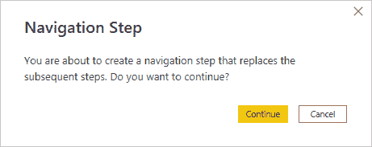](https://files.realpython.com/media/pbi_replace_steps.b9dc70a6b07f.png)

<figcaption class="figure-caption text-center">Replace the Subsequent Steps Pop-Up Window</figcaption>

当您刚刚编辑的步骤下面有后续步骤时，您会看到此警告。在这种情况下，您的更改可能会影响其余的*应用步骤*管道。所以，如果你现在点击*继续*，那么 Power BI 将删除下面的步骤。但是，如果您改变主意，想要放弃待定的更改，那么您仍然可以关闭超级查询编辑器窗口而不应用它们。

当您在 Power Query Editor 中对您的 Python 脚本之一进行更改并应用它时，Power BI 将尝试通过在整个管道中再次推送来刷新相应的数据集。换句话说，您必须能够访问您的原始数据源，比如 SQLite 数据库，否则您会得到一个错误。

**注意:**除了脚本之外，Power BI 还在`.pbix`文件中保存您摄取和转换的数据集。因此，除非您编辑与数据相关的 Python 脚本，否则您可以在打开报表后立即开始与报表进行交互。

至此，您知道了在 Power BI 中使用 Python 可以实现什么，以及 T2 如何在较低的层次上集成它们。在本教程的最后一节中，您将进一步了解这种集成带来的一些限制，这可能有助于您做出明智的决定，决定何时在 Power BI 中使用 Python。

## 考虑到 Python 在 Power BI 中的局限性

在本节中，您将了解在 Power BI Desktop 中使用 Python 的局限性。不过，最严格的限制是关于 Power BI 视觉效果，而不是与数据相关的脚本。

### 超时和数据大小限制

根据[官方文档](https://learn.microsoft.com/en-us/power-bi/connect-data/desktop-python-scripts#prepare-a-python-script)，您在 Power Query Editor 中定义的数据摄取和转换脚本运行时间不能超过**三十分钟**，否则它们将超时并出错。然而，Python 视觉效果中的脚本被[限制](https://learn.microsoft.com/en-us/power-bi/connect-data/desktop-python-visuals#known-limitations)只能执行**五分钟**。如果您正在处理非常大的数据集，那么这可能是一个问题。

此外，Power BI visuals 中的 Python 脚本受到额外的**数据大小限制**。最重要的包括以下内容:

*   只能绘制数据集中前 150，000 行或更少的行。
*   输入数据集不能大于 250 兆字节。
*   长度超过 32，766 个字符的字符串将被截断。

运行 Python 脚本时，Power BI 中的时间和内存是有限的。然而，实际的 Python 代码执行也会产生成本，您现在将了解到这一点。

### 数据整理开销

正如您之前所了解的，Power BI Desktop 通过交换 CSV 文件的方式与 Python 进行通信。因此，您的 Python 脚本必须从一个文本文件中加载数据集，而不是直接操作数据集，Power BI 会在每次运行时创建该文本文件。稍后，脚本将结果保存到另一个文本或图像文件中，供 Power BI 读取。

当处理较大的数据集时，这种冗余的数据整理会导致一个显著的性能瓶颈。这可能是 Python 集成在 Power BI Desktop 中的最大缺点。如果糟糕的性能变得明显，那么您应该考虑使用 Power BI 的内置转换或 Python 上的[数据分析表达式(DAX)](https://learn.microsoft.com/en-us/power-bi/transform-model/desktop-quickstart-learn-dax-basics) 公式语言。

或者，您可以尝试通过将多个步骤合并到一个 Python 脚本中来减少数据序列化的数量，该脚本可以批量执行繁重的工作。因此，如果您在本教程开始时使用的示例是一个非常大的数据集，而不是在 Power Query 编辑器中执行多个步骤，那么您最好尝试将它们合并到第一个加载脚本中。

[*Remove ads*](/account/join/)

### *非交互式 Python 视觉效果*

 *使用 Python 代码进行渲染的数据可视化是**静态图像**，不能与之交互来过滤数据集。但是，Power BI 将触发 Python 视觉效果的更新，以响应与其他视觉效果的交互。此外，由于前面提到的数据封送处理开销以及需要运行 Python 代码来呈现它们，Python 视觉效果的显示时间会稍长一些。

### 其他轻微滋扰

在 Power BI 中使用 Python 还有其他一些不太重要的限制。例如，如果需要他人安装和配置 Python，您就不能轻易与他人共享您的 Power BI 报告。报告中所有数据集的[隐私级别](https://learn.microsoft.com/en-us/power-bi/enterprise/desktop-privacy-levels)必须设置为公共，Python 脚本才能在 [Power BI 服务](https://learn.microsoft.com/en-us/power-bi/fundamentals/power-bi-service-overview)中正确工作。Power BI 中有有限数量的[支持的 Python 库](https://learn.microsoft.com/en-us/power-bi/connect-data/service-python-packages-support#python-packages-that-are-supported-in-power-bi)。这样的例子不胜枚举。

要更全面地了解 Python 在 Power BI 中的局限性，请查看如何[准备 Python 脚本](https://learn.microsoft.com/en-us/power-bi/connect-data/desktop-python-scripts#prepare-a-python-script)以及微软文档中 Python 可视化的[已知局限性](https://learn.microsoft.com/en-us/power-bi/connect-data/desktop-python-visuals#known-limitations)。

## 结论

即使您以前没有使用过 Python 或 Power BI，现在也可以在您的数据分析工作流中结合使用这两种工具。您使用 Python 成功地将数据从 SQLite 数据库加载到 Power BI 报告中，并利用 pandas 库来转换和扩充您的数据集。最后，您通过用 Python 的 Matplotlib 绘制数据，在 Power BI 中可视化了数据。

**在本教程中，您学习了如何:**

*   **安装**和**配置**Python 和 Power BI 环境
*   使用 Python 来**导入**和**转换**数据
*   使用 Python 制作定制可视化效果
*   重用您现有的 Python 源代码
*   理解在 Power BI 中使用 Python 的限制

现在，您已经掌握了利用 Power BI 和 Python 这两项强大技术来转变数据驱动型业务决策方式的知识！

**源代码:** [点击此处获取免费的源代码和数据集](https://realpython.com/bonus/power-bi-python-code/)，您将使用它们将 Python 和 Power BI 结合起来，获得超强的商业洞察力。*******