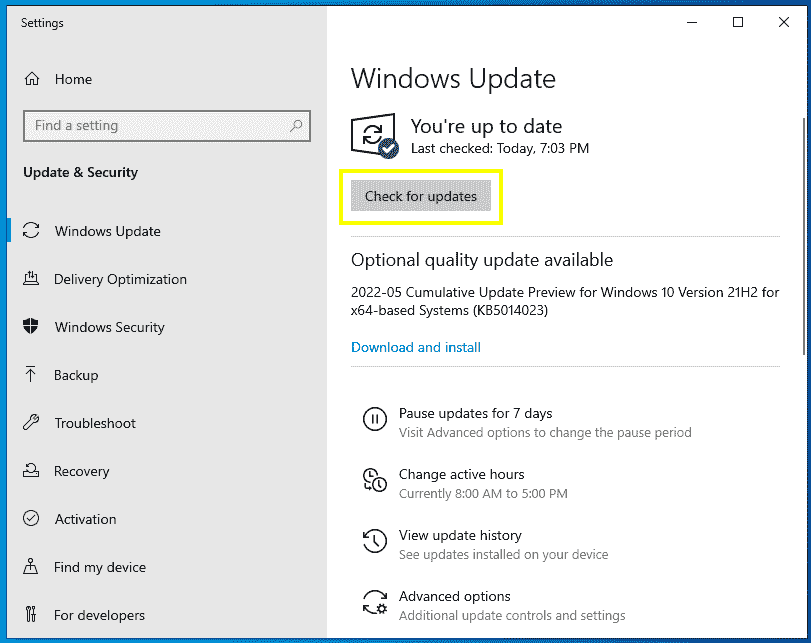
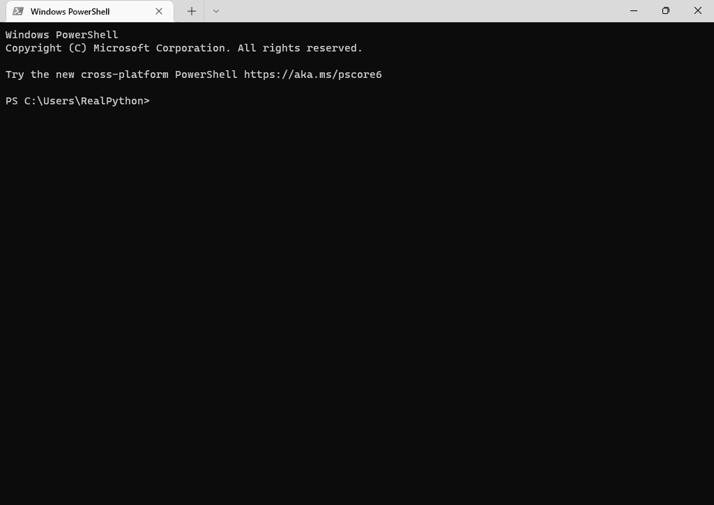
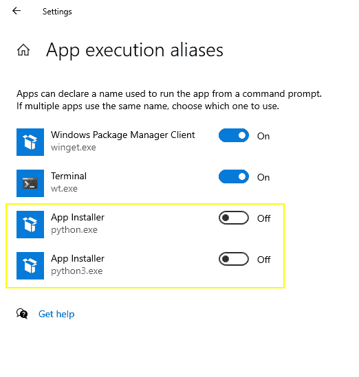
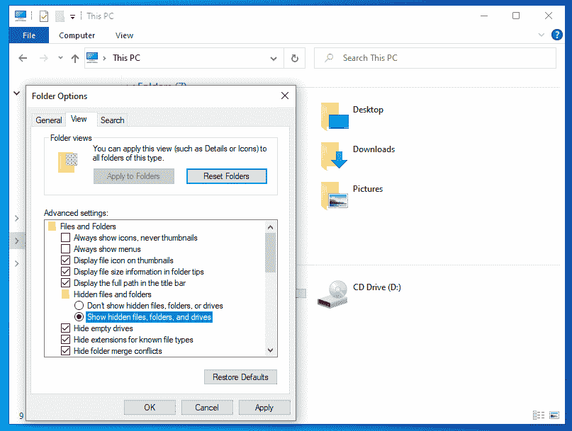
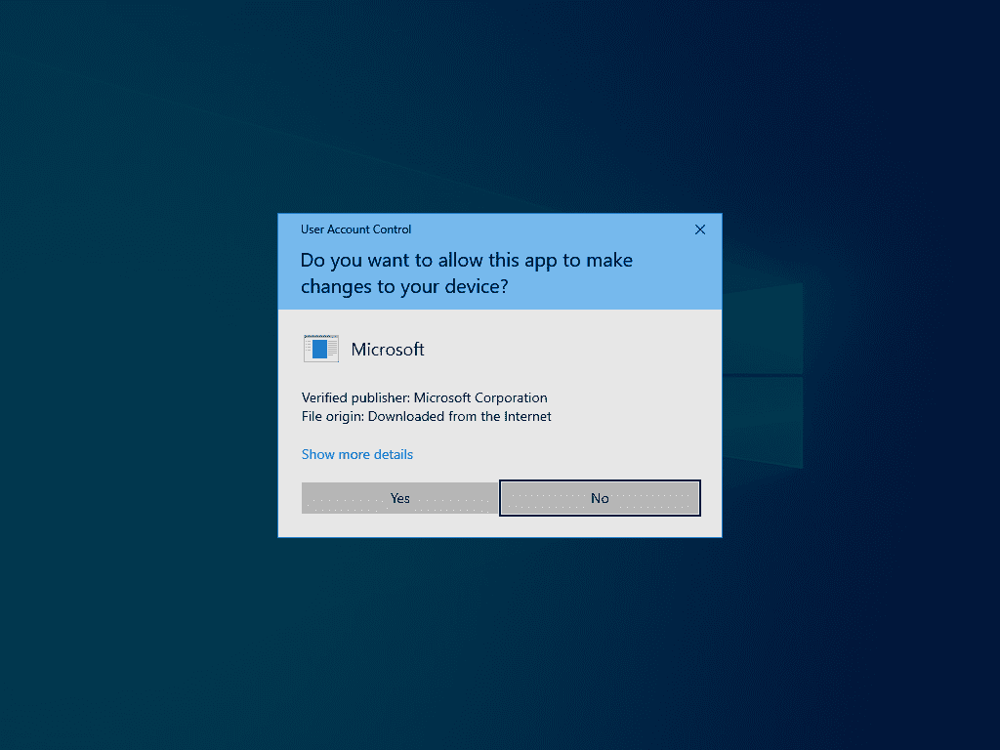
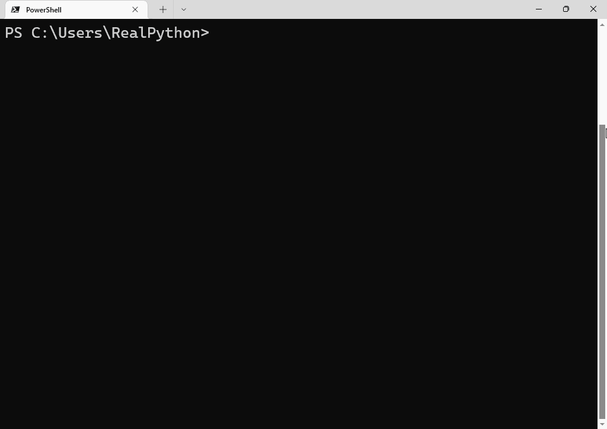
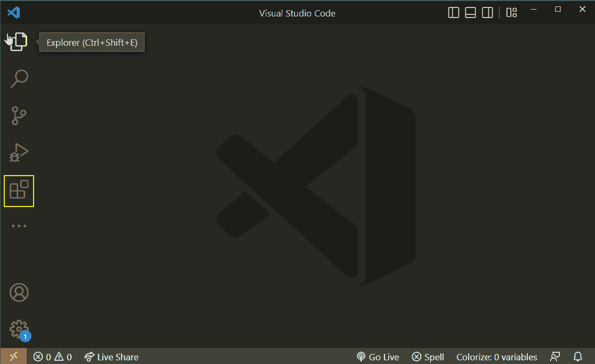

# Windows 上的 Python 编码环境:安装指南

> 原文:[https://realpython.com/python-coding-setup-windows/](https://realpython.com/python-coding-setup-windows/)

你有兴趣在一台 **Windows 机器**上写 **Python 代码**吗？也许你是一个终身的 Windows 用户，开始使用 Python 编程，或者你刚刚开始从 macOS 或 Linux 中脱离出来。在本教程中，您将在 Windows 10 上完成一个简单易用且灵活的 Python 编码设置。

**注意:**这里的大部分步骤在 Windows 11 上同样适用。

**要为 Python 编码设置您的 Windows 机器，您将:**

*   **清理和更新**新的 Windows 安装
*   使用**包管理器**批量安装关键软件
*   使用内置的`ssh-keygen`生成 **SSH 密钥**并连接到你的 GitHub 账户
*   搭建一个**开发环境**，包括 **PowerShell 内核**、 **pyenv for Windows** 、 **Python** 、 **VS 代码**
*   检查脚本和工具来**自动化设置和安装**过程

在这个过程中，您将了解到各种推荐的工具，这些工具用于一个完整的、免费的、大部分开源的 Windows Python 编码设置。您不会了解所有可能的工具，但是您将带着一个对大多数情况足够灵活的设置离开。

如果你是初级到中级 Pythonista，或者你只是想在 Windows 机器上进行设置，而不必考虑所有不同的选项，那么本教程就是为你准备的。

**免费奖励:** ，它向您展示 Python 3 的基础知识，如使用数据类型、字典、列表和 Python 函数。

也许你急着去准备。如果是这种情况，那么您将在关于[快速跟踪您的设置](#fast-tracking-your-windows-python-coding-setup)的部分中找到您需要的东西，在那里您将研究一个 PowerShell 脚本来几乎完全自动化这个过程。如果你需要快速起床跑步，就跳到那边去。也就是说，浏览一下[的第一部分](#setting-up-your-basic-python-coding-environment-in-windows)会给你一个很好的清单，确保你不会遇到任何错误。

## 在 Windows 中设置您的基本 Python 编码环境

假设你正坐在一个全新的 Windows 系统前。在本节中，您将经历在这种情况下应该执行的最初步骤。您将获得一个初始命令行环境设置，通过包管理器安装软件，并为 Python 编码设置配置必要的 Windows 设置。

**注意:**如果你打算跟着做，你将在整个过程中多次重启电脑。在附近有另一个设备是值得的，不仅是为了保持本教程打开，而且是为了一般的查询、故障排除，以及在等待更新或安装时继续阅读其他真正的 Python 教程的能力。

除了安装您需要的东西，您还将学习如何避开一些可能碍事的微软内置程序。第一步是确保您的 Windows 安装是最新的。

[*Remove ads*](/account/join/)

### *更新您的 Windows 安装*

 *首先，如果你的机器是新的或者你已经禁用了更新，那么你需要**确保你的 Windows 安装是最新的**。如果你想使用 [Windows 子系统 for Linux (WSL)](https://en.wikipedia.org/wiki/Windows_Subsystem_for_Linux) 并拥有 Windows 10，更新就显得尤为重要。这也是对可怕的 Windows [自动重启](https://lolnein.com/2018/01/26/updateandrestart/)的一种保护。

安装 Windows 更新可能需要一两个小时，但相对来说是不需要动脑的。因此，如果您从这里开始，请在等待更新完成的同时安排一些其他任务。

要开始更新过程，进入**开始菜单**并搜索 *Windows 更新*。到达后，提示 Windows 搜索、下载并安装它能找到的任何更新:

[](https://files.realpython.com/media/win-10-setup-10-check-for-updates-button_-_Copy.33c5d4db0630.png)

一旦安装了所有的更新，你可能会被提示重新启动计算机。它让你做多少次，你就做多少次。

你可能需要**重复更新过程**两到三次。一旦安装了第一批更新，并且重新启动了系统，如果你返回到更新屏幕，它可能会说系统是最新的。但是，如果您等待一段时间，然后再次检查更新，它可能会找到更多的安装。

安装完所有更新后，就可以在 Windows Python 编码设置中对命令行环境进行初始设置了。

### 发现 Windows 终端

如果你一直使用 Windows，那么你可能习惯于通过自己的应用程序使用**命令提示符**和 **PowerShell** 。以这种方式打开它们可能会让你认为它们是独立的程序。但是，当您从“开始”菜单运行这些程序时，有两个进程正在运行。一个进程执行命令，另一个进程发送你的输入，*显示*输出。

打开命令提示符时看到的窗口是显示进程。命令提示符的核心在后台，等待窗口发送的输入。这样，窗口就充当了终端的某种主机。

有关命令解释器和接口之间的差异的更多信息，请查看关于`subprocess`模块的文章中的[对 shell](https://realpython.com/python-subprocess/#introduction-to-the-shell-and-text-based-programs-with-subprocess) 的介绍部分。

Windows 已经创建了一个新的、开源的 [**Windows 终端**](https://github.com/microsoft/terminal) 作为通用的控制台主机。它充当多个 Shell 的接口，允许您启动命令提示符、PowerShell 和任何其他 shell，这些 shell 可能作为同一主机中的不同选项卡提供:

[](https://files.realpython.com/media/win-10-setup_windows_terminal.a53e3d57c1ea.png)

在新的 Windows 终端出现之前，许多人依赖其他主机(也称为模拟器)来管理不同的 shell 会话，如标签、水平和垂直分割。一个流行的选择是 ConEmu。ConEmu 比 Windows 终端拥有更多的功能。然而，Windows 终端正在迎头赶上，并拥有一些 ConEmu 没有的功能，如 Unicode emoji 支持。

**注意:**本教程不要求您使用 Windows 终端，但建议您使用。似乎在 UNIX 世界中，人们使用命令行更加普遍，这部分是因为终端模拟器的良好特性。

Windows 终端还有一个优势，就是有开源社区和微软的支持。Windows 终端正在以惊人的速度改进和增加功能。至关重要的是，对于本教程来说，Windows 终端比 ConEmu 更容易安装，所以如果您正在学习，请转到下一节安装 Windows 终端。

### 安装 Windows 终端

对于本教程的设置，您应该**从微软商店** 安装[终端应用程序，可从开始菜单访问。从微软商店安装它有几个好处。一个优点是它确保更新自动到来。另一个优点是安装起来没有痛苦。其他来源似乎](https://apps.microsoft.com/store/detail/windows-terminal/9N0DX20HK701)[打破](https://github.com/mkevenaar/chocolatey-packages/issues/124)相对频繁，大概是因为 Windows 终端发展非常迅速。

Windows 终端是唯一一个不需要安装软件包管理器的应用程序，你将在本教程的后面部分看到。也就是说，希望很快你就能在一个包管理器下管理你所有的软件。

一旦你在微软商店安装了 Windows 终端，你应该可以在*终端*下的开始菜单中找到它。如果，不管什么原因，你不能从微软商店安装它，试试 GitHub 仓库里的[发布页面](https://github.com/microsoft/terminal/releases/)。

当您启动 Windows 终端时，它应该会自动启动一个新的 PowerShell 选项卡:

[](https://files.realpython.com/media/win-10-setup-14-windows-powershell_-_cropped.f114376b1071.png)

正确工作后，你将切换齿轮来执行一些常规的窗户调整。

[*Remove ads*](/account/join/)

### *配置常规 Windows 设置*

 *有一些通用的 Windows 设置，你会想要设置，以保持你的理智检查。本节包含一些典型设置，Windows 用户在安装 Windows 时通常会立即更改这些设置。大多数设置都是可选的。确保你做了列出的第一个，接下来。

#### 应用执行别名

应用程序执行别名是 Windows 的一种特殊别名。比如你在命令行输入`python`，Windows 会自动询问你是否要安装 Python 的微软商店版本。

应用程序执行别名是一个使事情更容易开始的功能，但它们会干扰其他程序。例如，当您[安装 pyenv for Windows](#installing-python-with-pyenv-for-windows) 并安装几个 Python 版本时，应用程序执行别名将通过不允许您访问这些 Python 版本来进行干扰。

您可以从“开始”菜单中搜索应用程序执行别名控制面板。该条目名为*管理应用执行别名*。下面是控制面板屏幕截图:

[](https://files.realpython.com/media/win-10-setup-75-app-execution-alias.2667fc1df46d.png)

您通常可以关闭所有这些，因为您已经有了`Path`环境变量来确保应用程序在命令行上可用。在教程的后面[会有更多关于环境变量的内容。必须禁用的是与 Python 相关的。](#configuring-environment-variables)

这一小节中的其余设置是可选的，但是对于生活质量是推荐的。

#### Windows 更新

让 Windows 保持最新是值得的，这不仅是为了安全，也是为了更新所有的开发工具，如 Windows 终端和 WSL。你想避免的一个 Windows 怪癖是自动重启。为此，您可以使用*高级 Windows 更新选项*控制面板禁用重启设备的选项:

[](https://files.realpython.com/media/win-10-setup-11-advanced-options-cropped.f8ebcac892c3.png)

在这里，您需要禁用在安装新的更新后尽快重启设备的选项。这个设置通常会导致可怕的 Windows 自动重启。

不过，禁用自动重启功能仍然不是无懈可击的。为了安全起见，你需要每隔几天或者至少每周重启一次 Windows。如果有一件事 UNIX 系统似乎更擅长，那就是能够长时间不重启。

#### Windows 资源管理器

为了使非开发人员更容易使用 Windows 资源管理器，它隐藏了一些您可能想看到的信息，因此您应该启用以下功能:

*   显示文件扩展名
*   显示隐藏文件
*   显示受保护的操作系统文件
*   在标题栏中显示完整路径

您可以从文件浏览器中访问这些选项，您可以使用 `Win` + `E` 打开文件浏览器，点击左上角的*文件*选项卡，选择*更改文件夹和搜索选项*。在*视图*选项卡下，您可以找到这些设置:

[](https://files.realpython.com/media/win-10-setup-43-explorer_settings.66b8e45bee43.png)

调整这些设置后，您将能够看到以前隐藏的文件和文件扩展名。

[*Remove ads*](/account/join/)

## *在 Windows 中管理软件*

 *大多数 Windows 用户在安装软件时的默认选项是访问网站，下载并运行可执行文件。可执行文件通常是扩展名为`.msi`的 [Windows Installer 包](https://en.wikipedia.org/wiki/Windows_Installer)。然后你会看到一个[用户账户控制](https://docs.microsoft.com/en-us/windows/security/identity-protection/user-account-control/how-user-account-control-works) (UAC)屏幕，询问你是否允许更改你的设备:

[](https://files.realpython.com/media/win-10-setup-23-UAC_-_Copy.820d325c85cd.png)

如果这还不够，你必须阅读许可协议，点击 *OK* 很多次，然后关闭安装程序。一定有更好的办法！

在基于 UNIX 的系统上，你会得到一些叫做[包管理器](https://en.wikipedia.org/wiki/Package_manager)的好东西，比如[自制软件](https://brew.sh/)、[、`apt`、](https://en.wikipedia.org/wiki/APT_(software))[、`dnf`、](https://docs.fedoraproject.org/en-US/quick-docs/dnf/)[、`pacman`、](https://wiki.archlinux.org/title/pacman)。为什么 Windows 不能有那些？嗯，Windows 的确有一些软件包管理器可供选择，其中最受欢迎的是 [Chocolatey](https://chocolatey.org/) 。

Windows 包管理器不像基于 UNIX 的包管理器那样先进。然而，对于喜欢做事的人来说，这是朝着正确方向迈出的一大步。

微软正在开发它的包管理器， [`winget`](https://docs.microsoft.com/en-us/windows/package-manager/winget/) 。虽然它很好，而且变得越来越好，但它仍然不是最受欢迎的 Windows 软件包管理器，也没有 Chocolatey 那么多的软件包可供选择。

在安装 Chocolatey 之前，您需要先做几件事。

### 放松您的执行策略

要安装 Chocolatey，您需要首先以管理员身份打开 Windows 终端或您选择的终端程序。

**注意:**要以管理员身份启动程序，可以在开始菜单中搜索 app，然后右键点击，选择*以管理员身份运行*。

作为管理员运行一个程序**也被称为运行该程序的一个**提升的**实例。它也可以被称为用提升的特权运行程序。**

打开管理员终端会话后，您应该会看到一个 PowerShell 选项卡。

为了能够毫不费力地安装 Chocolatey，并且对于教程后面的自动化脚本[,您需要将您的](#running-a-setup-script)[执行策略](https://docs.microsoft.com/en-us/powershell/module/microsoft.powershell.core/about/about_execution_policies)设置为没有默认的严格。

执行策略设置您的系统对运行来自其他来源的脚本的严格程度。对于本教程，您需要将其设置为`RemoteSigned`:

```
PS> Set-ExecutionPolicy RemoteSigned
Execution Policy Change
The execution policy helps protect you from scripts that you don't trust.
...
Do you want to change the execution policy?
[Y] Yes [N] No [S] Suspend [?] Help (default is "Y"): y` 
```

您可能看不到该警告，因为可能已经设置了执行策略。要仔细检查您的设置，您可以运行`Get-ExecutionPolicy`。一旦有了正确的执行策略，就可以下载并运行安装 Chocolatey 的脚本了。

### 安装巧克力

要运行 Chocolatey 安装脚本并运行您将在教程稍后的[中看到的自动安装脚本，您可以向脚本的托管版本发出请求。](#running-a-setup-script)

**注意:**您总是被告知在运行远程脚本之前检查它们的源代码，因为恶意的参与者可以利用这种技术。

例如，如果有人入侵了`community.chocolatey.org/install.ps1` URL 并用恶意脚本替换它，这可能会对您的机器造成严重破坏。所以，要小心检查来源没有被破坏。

要运行安装脚本的托管版本，您可以运行以下命令:

```
PS> iwr -useb community.chocolatey.org/install.ps1 | iex` 
```

`iwr`是`Invoke-WebRequest`的别名，`-useb`表示使用基本解析，从`community.chocolatey.org/install.ps1`下载并解析脚本。这样做的结果是脚本文本，然后通过[管道将](https://realpython.com/python-subprocess/#introduction-to-pipes) ( `|`)传输到`iex`，T5 是运行脚本的`Invoke-Expression`的别名。该脚本安装 Chocolatey。

一旦安装完成，您应该能够从同一个提示符调用`choco`。但是，在安装后，该命令并不总是在同一个提示符下可用。在这种情况下，您可以重新启动终端，确保它仍然处于管理员模式，以适应教程中将要出现的内容。如果还是失败，请重新启动系统以刷新环境。

[*Remove ads*](/account/join/)

### *使用巧克力*

 *安装了 Chocolatey 后，您就可以用简单的命令管理几乎所有的软件了。请记住，要安装、升级和卸载软件，您需要以管理员身份启动终端会话。

注意:作为管理员启动整个程序可能有点麻烦。通常，你只想以管理员的身份运行一些命令，所以不得不在管理员模式下启动整个*程序*感觉有点大材小用。

在 UNIX 环境中，有一个方便的 [`sudo`](https://www.sudo.ws/) 命令，您可以将其添加到任何命令的前面，以提升的权限运行该特定命令。如果这个命令在 Windows 上可用的话，它将是安装包的理想选择。

幸运的是，您可以安装一个名为 [gsudo](https://github.com/gerardog/gsudo) 的包，它几乎可以实现这一功能。你仍然需要点击 UAC 屏幕，但是你不需要打开一个全新的程序实例来安装。

然而，安装 gsudo 并不是遵循本教程所必需的。

尝试启动一个提升的终端会话，然后从[在线包搜索](https://community.chocolatey.org/packages)中安装您选择的包。下面用开源文件归档器 [7zip](https://www.7-zip.org/) 演示了安装命令:

```
PS> choco install 7zip
7zip.install v22.0 [Approved]
7zip.install package files install completed. Performing other installation steps.
The package 7zip.install wants to run 'chocolateyInstall.ps1'.
Note: If you don't run this script, the installation will fail.
Note: To confirm automatically next time, use '-y' or consider:
choco feature enable -n allowGlobalConfirmation
Do you want to run the script?([Y]es/[A]ll - yes to all/[N]o/[P]rint):` 
```

在确认提示符下，键入`Y`并按回车键。然后，Chocolatey 将安装该软件包。如果您想禁用双重检查的行为，那么您可以发送以下命令:

```
PS> choco feature enable -n allowGlobalConfirmation` 
```

现在安装过程不会提示你烦人的*你确定吗？*提示类型。也就是说，您也可以通过添加`-y`标志为每个安装命令传递这个选项。

如果您想从命令行搜索可用的包，那么您可以使用`choco search [keyword]`命令。要查看已安装软件包的列表，可以使用带有`--local-only`标志的`choco list`命令。最后，升级和卸载也有`choco upgrade`和`choco uninstall`命令:

```
PS> choco upgrade [package-name]
PS> choco upgrade all # keyword to try upgrade all packages
PS> choco uninstall [package-name]` 
```

请注意，升级所有软件包可能需要一段时间。

现在你已经准备好开始使用 Chocolatey 了，只需安装一小组软件来帮助你清理和卸载任何可能已经预装在你系统上的[膨胀软件](https://en.wikipedia.org/wiki/Software_bloat#Bloatware)。

### 解除你的机器和卸载软件

一旦你有了你的包管理器，你可能想做的第一件事就是清理它。这一部分是可选的，对于您的系统来说可能不是必需的。

如果你已经从微软镜像安装了 Windows，那么可能没有什么需要删除的。如果你的电脑是预装的，那么它可能会被一堆膨胀软件所填充。

例如，制造商通常包括第三方防病毒软件，但可能不会停用 Windows Defender。安装多个防病毒软件可能会导致奇怪的问题，并显著影响您电脑的性能。此外，Windows Defender 或 [Microsoft Defender](https://en.wikipedia.org/wiki/Microsoft_Defender) 是安全的，因此如果您出于任何特殊原因不需要额外的防病毒软件，您可以放心，内置的防病毒软件足以保护您的安全。

为了在预装系统上进行完美安装，有些人甚至会完全重置 Windows 安装。通过搜索*复位*，可通过开始菜单使用该选项。然而，这个核心选项可能会成为一个麻烦，因为您的机器可能需要特殊的驱动程序，而 Windows 安装过程无法访问这些驱动程序。

同样不可避免的是，在某些时候，你会安装一些你不想要的东西。也许这是 Chocolatey 上没有的一个包，或者你只是忘了使用 Chocolatey。或者，令你惊恐的是，你点击了一个可疑的链接并安装了一些持续的间谍软件。

要清理和删除程序，你可能需要一个像样的卸载程序，理想情况下，它可以让你批量卸载，还可以做额外的工作，清理有时留下的文件和文件夹。

间谍软件、恶意软件和广告软件特别擅长留下服务，一旦你卸载了它们，它们就会自动重新安装。

或者 BCU，是一个神奇的开源卸载程序，它会找出各种各样的程序并清除它们:

```
PS> choco install bulk-crap-uninstaller` 
```

一旦它安装并打开，它将允许您选择多个程序，并尽可能自动卸载和清理过程:

[](https://files.realpython.com/media/2022-07-04_19_06_07-Window.04cfbf56077a.png)

BCU 将检测哪些卸载过程不能自动化，并卸载那些第一。然后，它会让你知道，所有其余的程序都可以卸载，无需你的干预。

在主要的卸载过程后，BCU 将执行深度清理，显示您可能想要删除的剩余文件、服务和注册表项。

**注意:**删除注册表项时要小心，因为这会影响其他程序！

其他免费选项也是可用的，比如 [Geek 卸载程序](https://community.chocolatey.org/packages/GeekUninstaller)，如果你只是想卸载一两个程序，它通常会更快。

**注意:**如果您看到一些程序已经安装在您的系统上，但有 Chocolatey 软件包可用，那么卸载它们并使用 Chocolatey 重新安装它们可能是值得的。一旦所有程序都在同一个包管理器下，更新和卸载它们就更容易管理了。

有些程序很难卸载，因为它们深深地嵌入了 Windows。如果你想尽量减少他们的出现，那么你可能也想和 Winaero Tweaker 玩玩:

```
PS> choco install winaero-tweaker` 
```

Winaero Tweaker 是一个实用程序，允许您更改一系列设置，这些设置要么无法通过设置应用程序访问，要么很难更改。例如，它可以禁用 [Cortana](https://en.wikipedia.org/wiki/Cortana_(virtual_assistant)) 和 [OneDrive](https://www.microsoft.com/microsoft-365/onedrive/online-cloud-storage) ，如果你不打算使用它们的话。

**注意:**安装完浏览器和其他软件后，您可能想要打开*默认应用*控制面板，也可以从开始菜单中搜索，并将您喜欢的应用设置为默认应用。

一个常见的变化是从 Edge 更改默认浏览器。Windows 将做最后一次尝试来说服你使用 Edge，但如果你更喜欢另一种浏览器，请大胆尝试！

一旦你完成了一般的清理，是时候深入研究和探索 Windows 命令行体验了。

[*Remove ads*](/account/join/)

## *导航 Windows 命令行*

 *经典的 Windows 命令行体验与命令提示符相关，也称为`cmd.exe`:

[](https://files.realpython.com/media/command_prompt.a97034040ae7.png)

但是时代在发展，现在你会想要使用 [PowerShell Core](https://github.com/PowerShell/PowerShell) ，这是一个跨平台、面向对象的 Shell，它能做的远不止命令提示符。

PowerShell 是由微软设计的，由布鲁斯·帕耶特掌舵，是一个强大且相对容易理解的工具，可以帮助管理 Windows 机器的各个方面。它是一个外壳、一个脚本环境和一个自动化工具。它可以用于任何事情，从个人脚本到 [DevOps](https://en.wikipedia.org/wiki/DevOps) 。

PowerShell 确实因为奇怪和冗长而名声不好，但它是一个引人注目的系统，可以完成很多工作。只是需要一点时间去适应。

在 Windows 10 上，默认安装了 *Windows* PowerShell。然而，更新的 PowerShell *内核*却没有。Windows PowerShell 从版本 6 开始成为 PowerShell Core，也就是这个时候它成为了一个跨平台的 Shell 和[开源](https://github.com/PowerShell/PowerShell)来引导。

由于 PowerShell Core 在默认情况下不附带 Windows 10，所以您会希望安装它。

### 安装 PowerShell 核心

现在您可以安装最新版本的 PowerShell Core with Chocolatey 了:

```
PS> choco install powershell-core` 
```

一旦完成，您现在应该能够调用`pwsh`来启动 PowerShell 核心会话。如果不起作用，尝试命令`refreshenv`，如果失败，重启终端会话:

[](https://files.realpython.com/media/win-10-setup-Powershell.adead2d055be.png)

请注意，当您升级 PowerShell Core 时，您会希望从另一个 shell 进行**更新，比如仍然可用的旧 Windows PowerShell，或者命令提示符。**试图更换正在使用的 PowerShell 核心可能会有问题**。因此，当您升级它时，请确保所有 PowerShell 核心实例都已关闭。**

**注意:**在本教程中，您并不一定需要 PowerShell Core，因为 Windows PowerShell 将适用于您将在此介绍的内容。也就是说，您还不如使用最新的、功能最全的版本。毕竟，业界对 PowerShell 技能的需求越来越大！

现在您已经安装了最新版本的 PowerShell Core，您将能够使用它来完成所有典型的基于 Shell 的任务。

### 掌握 PowerShell 基础知识

PowerShell Core 有很多功能，但你并不需要全部；见鬼，你甚至不需要它的一部分。以下是导航和管理文件系统的一些最常用命令:

| 别名 | 完整的 PowerShell 命令 | 说明 | Bash 等价物 |
| --- | --- | --- | --- |
| `ls` | `Get-ChildItem` | 列出当前工作目录的内容 | `ls` |
| `cd` | `Set-Location` | 更改您当前的工作目录 | `cd` |
| `rm` | `Remove-Item` | 删除项目 | `rm` |
| `rm -recurse -fo` | `Remove-Item -Recurse -Force` | 递归删除文件夹 | `rm -rf` |
| `mkdir` | `New-Item -ItemType Directory` | 创建新目录 | `mkdir` |
| `ni` | `New-Item -ItemType File` | 创建新文件 | `touch` |
| `cat` | `Get-Content` | 将文件内容打印到屏幕上 | `cat` |

您会发现它与典型的 [POSIX](https://en.wikipedia.org/wiki/POSIX) shell 没有太大的不同，就像您在 Linux 或 macOS 等基于 UNIX 的系统上看到的那样。

如果你对 PowerShell 感到困惑，这种困惑通常源于 PowerShell 像 Python 一样非常[面向对象](https://realpython.com/python3-object-oriented-programming/)，而大多数 Shell 是纯基于文本的。一旦你开始理解这种变化，它就会变得更有意义。

如果你有兴趣了解更多关于 PowerShell 的知识，Bruce Payette 自己写了[Windows PowerShell in Action](https://realpython.com/asins/1633430294/)。尽管这本书使用了 Windows PowerShell，但对于一般的介绍来说还是很棒的。

现在您已经熟悉了命令行，有些事情您可能想给自己起个别名来定制您的体验，使它更适合您的工作流。

[*Remove ads*](/account/join/)

### *定制您的 PowerShell 体验*

 *您在某个时候想要做的一项任务是配置您的 PowerShell 配置文件。这个概要文件不是必需的，但是它是一个可以利用的很好的工具。您的概要文件是一个 PowerShell 脚本，用于配置您的命令行环境——它相当于一个 Bash [`.bashrc`](https://www.gnu.org/software/bash/manual/html_node/Bash-Startup-Files.html) 文件。

每当您启动新的 PowerShell 会话时，配置文件脚本都会运行。如果你有多台机器，那么它是一个很好的备份文档，可以在所有机器之间共享。该配置文件对于初始化新机器也非常有用。这样，您可以从一开始就获得所有的快捷方式和自定义功能。

**注意:** Windows PowerShell 有自己的配置文件位置，不会受到 PowerShell 核心配置文件的影响。

首先，您需要创建配置文件，因为在安装 PowerShell Core 时，默认情况下不会创建它:

```
PS> ni -Force $PROFILE` 
```

该命令使用`ni`命令，它是`New-Item`的别名。它使用了`$PROFILE` PowerShell 变量，该变量指向 PowerShell 查找配置文件的路径。使用`-Force`标志是因为 PowerShell 可能需要在这个过程中创建一些目录。

**注意:** [PowerShell 变量](https://docs.microsoft.com/en-us/powershell/module/microsoft.powershell.core/about/about_variables)前面有美元符号`$`。

一旦创建了个人资料，您就可以用 [Windows 记事本](https://en.wikipedia.org/wiki/Windows_Notepad)打开它:

```
PS> notepad $PROFILE` 
```

一旦它打开，添加任何您想要的 PowerShell 命令。例如，您可以为经常使用的程序设置[别名](https://docs.microsoft.com/en-us/powershell/module/microsoft.powershell.utility/set-alias):

```
# Microsoft.PowerShell_profile.ps1

Set-Alias n notepad` 
```

在这种情况下，`n`将成为命令`notepad`的别名。所以如果你想打开记事本，现在你只需输入`n`。请注意，您对配置文件所做的任何更改只有在您启动的下一个会话中才会显现出来。

您还可以将[功能](https://docs.microsoft.com/en-us/powershell/scripting/learn/ps101/09-functions)添加到您的个人资料中:

```
# Microsoft.PowerShell_profile.ps1

function grep {
  $input | out-string -stream | select-string $args
}` 
```

如果你来自 UNIX 背景，那么 [`grep`](https://man7.org/linux/man-pages/man1/grep.1.html) 可能是一个受欢迎的 Windows 实用程序！这是一种过滤多行输出的方法。例如，如果您正在列出一个大型目录，并且希望只显示包含特定字符串的行，那么您可以像这样使用该实用程序:

```
PS> ls large-directory | grep python` 
```

这个命令列出了一个大目录的内容，并且只显示包含字符串`python`的行。

**注意:**另一个工作方式略有不同的后起之秀是 [Scoop](https://scoop.sh/#/) 。Scoop 主要关注命令行工具。

Scoop 是移植 UNIX 命令行工具的一个很好的来源，比如 [`grep`](https://man7.org/linux/man-pages/man1/grep.1.html) 、 [`less`](https://man7.org/linux/man-pages/man1/less.1.html) 、 [`cowsay`](https://en.wikipedia.org/wiki/Cowsay) 等等。因此，如果您来自 UNIX 背景，并且错过了某些命令行工具，Scoop 值得一试。

PowerShell 还有一个模块系统来扩展和定制您的命令行体验，在下一节中，您将获得一些关于安装方便的模块的建议。

[*Remove ads*](/account/join/)

### *发现 PowerShell 模块*

 *PowerShell 拥有丰富的可选模块生态系统，您可以安装这些模块来进一步增强您的命令行体验。以下是一些非常有用但完全可选的方法:

*   ZLocation :这个模块可以帮助你非常快速地导航到常用的文件夹。
*   哦，我的豪华版:这个模块使得定制你的 PowerShell 提示符变得很容易，看起来很棒，还可以添加一些额外的功能。
*   [PSFzf](https://github.com/kelleyma49/PSFzf) :这个模块将搜索工具 [fzf](https://github.com/junegunn/fzf) 的功能封装在 PowerShell 内部。你需要先安装 fzf，用`choco install fzf`就可以了。
*   posh-git :这个模块允许进一步定制你的提示，但是会给你的 [Git](https://realpython.com/python-git-github-intro/) 命令带来[制表符补全](https://realpython.com/python-idle/#code-completion-and-call-tips)。

你可以用 [`Install-Module`](https://docs.microsoft.com/en-us/powershell/module/powershellget/install-module) 命令安装这些模块，尽管每个链接都有更多关于如何正确安装和设置的信息。

您已经为您的 PowerShell 会话设置了一些定制，但是有些东西需要在更深的层次上进行配置。在下一节中，您将讨论环境变量。

## 配置环境变量

**环境变量是通用的键-值对**，在操作系统的许多级别上都可用。它们通常包含有关如何运行程序或在哪里找到资源的信息。例如，如果设置或不设置某些环境变量，Python 会以不同的方式运行。

虽然在设置机器的过程中，您不需要在自己的配置方面做太多工作，但在进行故障诊断时，这总是迟早会发生的事情。所以在这个话题上了解自己的方式是值得的。

### 使用 PowerShell 发现环境变量

PowerShell 可以访问环境变量和许多相关的功能。如果你有兴趣深入了解，微软在 PowerShell 文档中有一个页面专门讨论这些变量。

要查看当前 PowerShell 会话可用的所有环境变量，您可以导航到一个名为`ENV`的伪驱动器，就像它是一个类似`C`或`D`的驱动器一样:

```
PS> cd ENV:
PS> pwd # alias for Get-Location

Path
----
Env:\

PS> ls

Name                           Value
----                           -----
ALLUSERSPROFILE                C:\ProgramData
ANSICON                        166x32766 (166x66)
ANSICON_DEF                    7
APPDATA                        C:\Users\RealPython\AppData\Roaming
AZ_ENABLED                     False
ChocolateyInstall              C:\ProgramData\chocolatey
...` 
```

一旦导航到`ENV:`伪驱动器，就可以调用`ls`来列出当前 PowerShell 会话可用的所有环境变量。

**注意:** PowerShell 和一般的 Windows 一样，**不区分大小写**。所以像`$PROFILE`这样的路径或变量也可以用`$profile`来访问。`ENV`可以通过`env`进入。这也适用于文件名和路径。

还有一个用于环境变量的**图形用户界面(GUI)** 控制面板，这将在本节的后面部分介绍。

环境变量不同于像`$PROFILE`这样的变量，因为环境变量通常可用于您的[用户空间](https://en.wikipedia.org/wiki/User_space_and_kernel_space)中的所有程序，而`$PROFILE`是 PowerShell 专用的变量。

这个`Env:Path`变量特别容易出错，如果你不明白发生了什么，它会令人沮丧。

### 理解`Path`环境变量

您应该熟悉的环境变量之一是 [`Path`环境变量](https://en.wikipedia.org/wiki/PATH_(variable))。`Path`是一个变量，包含可执行文件所在目录的路径列表。`Path`由你的系统保存，作为一种让程序总是在手边的方式。

例如，无论何时从命令行调用`choco`或`python`，都可以看到`Path`环境变量的运行。您知道目标可执行文件可能不在当前工作目录中，但 Windows 仍然可以启动它。

例如，Chocolatey 在`Path`中添加了一个目录，其中放置了您可能希望从命令行调用的可执行文件。它添加到`Path`环境变量的目录是`C:\ProgramData\chocolatey\bin`，在这个目录中，您至少可以找到`choco.exe`。有了这个设置，当你从命令行调用`choco`时，Windows 将在`Path`环境变量的每个路径中搜索包含`choco`可执行文件的文件夹。

要查看您的`Path`变量中有哪些路径，您可以从 PowerShell 中调用以下命令:

```
PS> (cat ENV:Path) -Split ";"` 
```

`cat`是`Get-Content`的别名，返回`Path`变量内容的字符串对象。您可以将该对象放在括号中，以调用 [`-Split`](https://docs.microsoft.com/en-us/powershell/module/microsoft.powershell.core/about/about_split?view=powershell-7.2) 操作符来查看单独一行上的每条路径。

运行上一个命令后显示的列表是您的系统在评估要运行哪个程序时将查找的位置列表。一旦安装了 Python，就需要添加 Python 可执行文件的位置，这样就可以从任何地方调用`python`。

**注意:**注意`Path`中任何给定的可执行文件都有多个可能的选择。例如，如果您在`Path`的两个不同地方有一个`python.exe`，那么运行的将总是第一个*的*。

有了一些环境变量和`Path`变量的知识，您现在可以学习如何在必要时对它们进行修改。

[*Remove ads*](/account/join/)

### *设置和更改环境变量*

 *有多种方法可以改变环境变量——最常见的是使用 GUI 控制面板。

打开开始菜单，搜索*编辑系统环境变量*，打开*系统属性*窗口。在*高级*选项卡中，点击按钮*环境变量*。在那里，您将看到*用户*和*系统*变量，您可以编辑这些变量:

[https://player.vimeo.com/video/729132627?background=1](https://player.vimeo.com/video/729132627?background=1)

如果您是计算机的唯一用户，那么您可以只设置用户变量。如果希望计算机上的所有用户都可以访问该变量，请设置系统变量。

您还可以使用[在提升的 PowerShell 提示符下设置环境变量。NET API 方法](https://docs.microsoft.com/en-us/dotnet/api/system.environment.setenvironmentvariable?view=net-6.0)，像这样:

```
PS> [Environment]::SetEnvironmentVariable("TEST", "VALUE", "User")` 
```

该命令设置一个带有关键字`"TEST"`的环境变量，其值为`"VALUE"`，作用域为`"User"`。范围可以是`"User"`、`"Process"`或`"Machine"`。如果希望环境变量对所有用户都可用，可以使用`"Machine"`，而`"User"`只对当前用户可用。`"Process"`作用域将只为当前 PowerShell 会话和会话的子进程设置一个变量。

您可以使用下面的命令使用 pure PowerShell 创建**临时**环境变量:

```
PS> $ENV:TEST = "VALUE"` 
```

但是 PowerShell 会话上下文之外的程序将无法访问该变量。此外，如果您不将此声明也添加到您的个人资料中，那么它将不会在您的下一次 PowerShell 会话中可用。

如果您需要更改`Path`变量，还有一些事情需要记住。

### 更改`Path`环境变量

因为`Path`环境变量是许多路径的列表，所以在修改它的时候需要小心，不要用一个路径覆盖整个`Path`。

通常情况下，如果您打算在 PowerShell 中将它作为一个临时环境变量，那么您将需要使用字符串连接将新值追加到。

```
PS> $env:Path = "$env:Path;C:\new\path"` 
```

也许更改`Path`环境变量最简单的方法是使用 GUI 控制面板，它让每个`Path`条目都在自己的行上，这样更容易避免出错。

为了使对环境变量的任何更改生效，您通常需要重新启动 shell 会话。Chocolatey 附带了一个实用程序脚本，允许您刷新环境:

```
PS> refreshenv` 
```

请注意，如果您在同一个会话中安装了 Chocolatey，这将不起作用。也就是说，有时即使有那个脚本，也需要重启。

既然您已经知道了如何进行一些`Path`故障排除，并且对新的命令行设置相对满意，那么是时候安装 Python 和 pyenv for Windows 了。

[*Remove ads*](/account/join/)

## *在 Windows 中设置核心 Python 编码软件*

 *现在是时候开始使用几个不同的 Python 版本了。尽管使用最新版本的 Python 是一个好主意，但是遇到无法使用最新最好版本的项目并不罕见。甚至还有程序还在运行 Python 2，毕竟！所以最好准备好安装任意数量的 Python 版本，并且能够在它们之间轻松切换。

### 使用 pyenv for Windows 安装 Python

[pyenv for Windows](https://github.com/pyenv-win/pyenv-win) 是最初的 [pyenv](https://realpython.com/intro-to-pyenv/) 的一个端口，它只运行在基于 UNIX 的系统上。Windows 版本不像 UNIX 版本那样功能齐全，但仍然功能齐全。

使用 Chocolatey，安装 pyenv for Windows 就像安装任何其他软件包一样:

```
PS> choco install pyenv-win` 
```

安装 pyenv for Windows 后，您将需要更新可供安装的 Python 版本的本地索引，这需要几分钟时间。更新完成后，您需要安装几个版本的 Python:

```
PS> pyenv update
:: [Info] :: Mirror: https://www.python.org/ftp/python
:: [Info] :: Scanned 172 pages and found 563 installers.
PS> pyenv install --quiet 3.10.5 3.9.12
:: [Info] :: Mirror: https://www.python.org/ftp/python
:: [Downloading] :: 3.10.5 ...
...
:: [Installing] :: 3.10.5 ...
:: [Downloading] :: 3.9.12 ...
...
:: [Installing] :: 3.9.12 ...` 
```

由于有了`--quiet`标志，`install`命令将安装两个 Python 版本，而无需您的手动干预。

您可以使用`pyenv global`命令在 Python 版本之间切换，然后使用【T1 for version】标志检查 Python 的活动版本:

```
PS> pyenv global 3.10.5
PS> python -V
Python 3.10.5
PS> pyenv global 3.9.12
PS> python -V
Python 3.9.12` 
```

正如您所看到的，在不同的 Python 版本之间切换只是一个命令的问题。

**注意:**记住，你需要禁用 Python 相关的[应用执行别名](#app-execution-aliases)，pyenv for Windows 才能正常工作。必须禁用它们，因为 Windows 的应用执行别名和 pyenv 都会拦截`python`命令。应用程序执行别名似乎优先，因此将在 pyenv for Windows 获得机会之前阻止`python`命令。

如果您有一个项目需要特定版本的 Python，您有几个选项来处理它。您可以使用`pyenv local`命令，该命令将在当前工作目录中创建一个文件，以确保您在该目录中始终运行该版本的 Python。

或者您可以创建一个[虚拟环境](https://realpython.com/python-virtual-environments-a-primer/)，并激活该版本:

```
PS> pyenv global 3.9.12
PS> python -V
Python 3.9.12
PS> python -m venv venv

PS> pyenv global 3.10.5
PS> python -V
Python 3.10.5

PS> venv/Scripts/activate
(venv) PS> python -V
Python 3.9.12` 
```

如果您创建了一个 Python 虚拟环境，并激活了特定版本的 Python，那么该虚拟环境将继续指向该版本的 Python。

关于 pyenv 更深入的信息，请查看上面的[专用教程](https://realpython.com/intro-to-pyenv/)。请注意，由于该教程是针对 UNIX 版本的，有些功能可能无法像在 Windows 上那样工作。在这种情况下，请查看用于 Windows 存储库的[pyenv](https://github.com/pyenv-win/pyenv-win)。

现在您已经有了 Python，您将需要一种与其他程序员协作的方式。

### 在 Windows 上安装 Git

Git 是程序员中最受欢迎和最受支持的 T2 版本控制系统 T3。如果您以前从未使用过版本控制系统，它会管理对项目的更改，允许您回滚到您开始使用版本控制时代码所处的任何状态。

Git 与**库**一起工作。存储库基本上是一个带有跟踪历史的文件夹。 [GitHub](https://github.com/) 是一个允许你**托管**你的仓库的网站。一旦存储库被托管，许多人可以在任何地方同时处理这个项目。您可以脱机工作，然后在连接到互联网后同步回主存储库。

Git 很容易与 Chocolatey 一起安装:

```
PS> choco install git` 
```

就是这样！现在，您应该能够从 PowerShell 提示符下调用`git`。如果这不起作用，你得到一个消息说这个命令不能被识别，尝试`refreshenv`。如果失败了，那么您可以重新启动 PowerShell 会话或者重启机器。

Git 和 PowerShell 一样，也在用户的 home 文件夹中搜索一个[配置文件](https://en.wikipedia.org/wiki/Configuration_file)。您可以在根主路径中手动创建它，或者使用一些内置的 Git 命令:

```
PS> git config --global user.name "John Doe"
PS> git config --global user.email john.doe@domain.com` 
```

也就是说，如果您试图[提交](https://realpython.com/python-git-github-intro/#committing-changes)，Git 将提示您添加这些信息，这将创建`.gitconfig`文件。

Git 启动并运行后，您将希望能够从命令行连接 GitHub，但是为此，您需要设置您的 **SSH** 密钥。

[*Remove ads*](/account/join/)

### *使用 SSH 连接 GitHub*

 *连接 GitHub 的方式是使用 SSH，或者说[安全 Shell](https://en.wikipedia.org/wiki/Secure_Shell) 。为此，您需要创建一些 SSH 密钥。您将在本节中遵循的过程将生成两个密钥，一个私钥和一个公钥。你将把公开的上传到你的 GitHub 账户。

打开一个 PowerShell 会话，并确保您有默认安装的 [Open-SSH](https://www.openssh.com/) :

```
PS> ssh
usage: ssh [-46AaCfGgKkMNnqsTtVvXxYy] [-B bind_interface]
 [-b bind_address] [-c cipher_spec] [-D [bind_address:]port]
 [-E log_file] [-e escape_char] [-F configfile] [-I pkcs11]
 [-i identity_file] [-J [user@]host[:port]] [-L address]
 [-l login_name] [-m mac_spec] [-O ctl_cmd] [-o option] [-p port]
 [-Q query_option] [-R address] [-S ctl_path] [-W host:port]
 [-w local_tun[:remote_tun]] destination [command]` 
```

如果您没有看到类似的输出，请按照 [Windows 文档](https://docs.microsoft.com/en-us/windows-server/administration/openssh/openssh_install_firstuse)上的说明安装 Open-SSH。你也可以从一个[巧克力包](https://community.chocolatey.org/packages/openssh/8.0.0.1)中安装它。

您将首先使用`ssh-keygen`创建您的密钥，在每个提示符下按 enter 键以使用默认选项:

```
PS> ssh-keygen -C john.doe@domain.com
Generating public/private rsa key pair.
Enter file in which to save the key (C:\Users\Real Python/.ssh.id_rsa):
Created directory 'c:\Users|Real Python/.ssh'.
Enter passphrase (empty for no passphrase):
Enter same passphrase again:
Your identification has been saved in C:\Users\Real Python/.ssh/id_rsa.
Your public key has been saved in C:\Users\Real Python/.ssh/id_rsa.pub.
The key fingerprint is:
SHA256:aaaaaaaaaaaaaaaaaaaaaaaaaaaaaaaaaaaaaaaaaaa jondoe@domain.com
The key's randomart image is:
+---[RSA 3072]----+
| E+===+*++.o.    |
|..=+=o+O+ o.o    |
|o+o++.B.o oo     |
|o+o*oo o o .     |
| o+o.   S .      |
|  o              |
|                 |
|                 |
|                 |
+----[SHA256]-----+` 
```

如果你想要额外的保护，你可以添加一个密码短语，但这很方便，你不必每次将你的作品推送到 GitHub 时都输入密码。生成密钥后，输出公钥的内容，以便您可以选择它并将其复制到剪贴板:

```
PS> cat ~/.ssh/id_rsa.pub` 
```

最后这个`cat`命令的输出是您需要复制到您的 GitHub 帐户中的内容。

要将密钥复制到你的 GitHub 帐户，你首先必须确保你已经注册了一个帐户。一旦你注册并登录，如果你去你的 GitHub 设置，你应该找到选项*管理你的 SSH 和 GPG 键*。在那里，您应该能够看到粘贴 SSH 密钥的位置。

之后，您可以测试连接:

```
PS> ssh -T git@github.com
Hi John Doe! You've successfully authenticated, but GitHub doesn't provide shell access.` 
```

如果您得到这个成功的认证消息，那么您就可以从命令行使用 GitHub 了。

既然您已经启动并运行了，是时候设置您的代码编辑器了。

### 设置 VS 代码

VS Code 是一个令人惊讶的可扩展的免费、开源的通用编辑器。它也是[最受欢迎的](https://insights.stackoverflow.com/survey/2021#section-most-popular-technologies-integrated-development-environment)。它可以用于许多语言，但是在本节中，您将为 Python 设置它。

可以用 Chocolatey 安装 VS 代码:

```
PS> choco install vscode` 
```

请记住从提升的 PowerShell 提示符运行安装命令。

VS 代码有一个丰富的扩展生态系统来帮助你的生产力。微软官方的 [Python](https://marketplace.visualstudio.com/items?itemName=ms-python.python) 扩展通常是默认安装的，但如果不是，你应该确保安装它。

要安装扩展，请单击活动栏中的扩展图标:

[](https://files.realpython.com/media/2022-07-12_11_01_02-Visual_Studio_Code.6ebb0e5c321f.png)

然后使用搜索框搜索上面链接的 Python 扩展。

Python 扩展将为您提供用于 Python 的 [IntelliSense](https://code.visualstudio.com/docs/editor/intellisense) ，这是您的编辑器为您提供自动完成建议的一种方式，并将在详细的工具提示中为您提供大量信息。

如果您计划使用 WSL，另一个扩展是 [WSL 连接器](https://code.visualstudio.com/docs/remote/wsl)，它将允许您编辑文件，就像在 Linux 上运行一样。

设置[设置同步](https://code.visualstudio.com/docs/editor/settings-sync)也是值得的，因为这将把你的 VS 代码设置和你的扩展列表链接到你的 GitHub 或微软账户，负责备份并使其在新机器上快速设置。

设置好 VS 代码后，您就可以测试您的设置了，以确保它能够正常工作。

### 测试您的设置

恭喜你，你可以走了。在本节中，您将快速测试您的设置，以确保一切正常工作。

在下面的代码片段中，您将测试创建一个文件夹、创建一个虚拟环境、安装一个包、初始化一个 Git 存储库，并确保 VS 代码与该设置相集成:

```
PS> mkdir test

 Directory: C:\Users\RealPython

Mode                 LastWriteTime         Length Name
----                 -------------         ------ ----
d----            27/06/22    18:19                test

PS> cd test
PS> pyenv versions
* 3.10.5 (set by C:\Users\RealPython\.pyenv\pyenv-win\version)
 3.9.12

PS> python -m venv venv
PS> venv\Scripts\activate
(venv) PS> python -m pip install requests
Collecting requests
...
Successfully installed certifi charset-normalizer idna requests urllib3

(venv) PS> git init
Initialized empty Git repository in C:/Users/RealPython/test/.git/

(venv) PS> ni test.py

 Directory: C:\Users\RealPython\test

Mode                 LastWriteTime         Length Name
----                 -------------         ------ ----
-a---            27/06/22    18:25              0 test.py

(venv) PS> code .` 
```

现在打开了 VS 代码，在右下角，您应该能够看到您所处的 Python 环境:

[https://player.vimeo.com/video/729155332?background=1](https://player.vimeo.com/video/729155332?background=1)

如果没有显示`venv`并且 IntelliSense 没有工作，那么您可以使用`Ctrl`+`Shift`+`P`调用命令面板，并搜索*Python:Select Interpreter*命令。选择指向虚拟环境路径的选项。选择虚拟环境后，VS 代码应该在 VS 代码窗口的底部显示为 *3.10.5 ('venv':venv)* 。

您还应该能够看到 VS Code 的 Git 集成正在工作。如果您更改了一个文件或添加了一个新文件，那么您将在编辑器窗口和文件资源管理器中看到该更改的指示。

干得好！现在，您在 Windows 上有了一个强大而灵活的设置。虽然使用软件包管理器比手动下载和执行安装程序要有效得多，但也许您正在寻找一种更快的方法。

## 快速跟踪您的 Windows Python 编码设置

也许这对你来说有点慢，或者你只是想开始自动化这个过程。有一些工具可以在工业规模上实现自动化安装，比如 [Boxstarter](https://boxstarter.org/) 和 [Ansible](https://www.ansible.com/) ，但是这一部分更多的是针对那些想看看你自己能做什么的修补者。

在本节中，您将快速跟踪您的最小设置，跳过任何额外的步骤，并尽可能快地开始开发。

### 配置存储库

当第一次尝试自动化一个新的安装时，您通常会遇到将脚本放到新机器上运行它们的问题。文件同步服务可以工作，但它们通常需要很长时间来进行初始同步。

这个问题的一个很好的解决方案是拥有一个包含配置文件和脚本的存储库。有时其他片段也可能包含在其中——有点像编码人员的个人食谱。

在这里，您可以保存您的 PowerShell 配置文件、Git 配置文件、其他配置文件以及您可能需要的任何脚本或注释。一旦你在 GitHub 上托管了文件，你就可以获得它们的原始链接并使用 PowerShell 下载它们:

[](https://files.realpython.com/media/Github_raw_button.53b59120c681.png)

要获得 raw 链接，导航到您想要在 GitHub 中使用的文件，当您查看文件内容时，您应该能够看到一个按钮，上面写着 *Raw* 。此按钮会将您带到一个如下所示的 URL:

```
https://raw.githubusercontent.com/[USER]/[REPO]/[COMMIT_SHA_OR_BRANCH]/path/to/file` 
```

现在，您可以使用这个 URL 获取内容，并从您的新机器上运行它。你也可以用一个 [GitHub Gist](https://gist.github.com/) 托管单个文件。

更进一步，为了避免必须键入整个链接，您可以通过 URL 缩写器传递它，例如 [bitly](https://bitly.com/) ，这将缩短链接:

```
https://bit.ly/xxxxxxx` 
```

现在是时候进行主要的设置了。有了这个简短的链接，您所要做的就是禁用与 Python 相关的应用程序执行别名，启动提升的 PowerShell 会话，并运行以下命令:

```
PS> Set-ExecutionPolicy RemoteSigned -Force
PS> iwr -useb bit.ly/xxxxxxx | iex` 
```

然后一切都会为您处理好，您可以在安装过程中跑跑腿。既然您已经选择了托管安装脚本的平台，那么您将需要实际的脚本！

### 运行设置脚本

在这一节中，您将研究一个示例安装脚本，该脚本将安装一些您可能需要用 Python 编码的最小依赖项，特别是如果您想为 GitHub 上的开源项目做贡献的话。

运行该脚本的先决条件是:

1.  将您的[执行策略设置为`RemoteSigned`](#loosening-your-execution-policy)
2.  禁用 Python 相关的[应用执行别名](#app-execution-aliases)

完成这两项任务后，您就可以展开下面的可折叠框并运行脚本了:


```
# setup.ps1

Write-Output "Downloading and installing Chocolatey"
Invoke-WebRequest -useb community.chocolatey.org/install.ps1 | Invoke-Expression

Write-Output "Configuring Chocolatey"
choco feature enable -n allowGlobalConfirmation

Write-Output "Installing Chocolatey Packages"
choco install powershell-core
choco install vscode
choco install git --package-parameters="/NoAutoCrlf /NoShellIntegration"
choco install pyenv-win

# The Google Chrome package often gets out of sync because it updates so
# frequently. Ignoring checksums is a way to force install it.
choco install googlechrome --ignore-checksums
# Google Chrome auto-updates so you can pin it to prevent Chocolatey from
# trying to upgrade it and inadvertently downgrading it.
# You could also add VS Code here if you like.
choco pin add -n googlechrome

refreshenv

# The refreshenv command usually doesn't work on first install.
# This is a way to make sure that the Path gets updated for the following
# operations that require Path to be refreshed.
# Source: https://stackoverflow.com/a/22670892/10445017
foreach ($level in "Machine", "User") {
    [Environment]::GetEnvironmentVariables($level).GetEnumerator() |
    ForEach-Object {
        if ($_.Name -match 'Path$') {
            $combined_path = (Get-Content "Env:$($_.Name)") + ";$($_.Value)"
            $_.Value = (
                ($combined_path -split ';' | Select-Object -unique) -join ';'
            )
        }
        $_
    } | Set-Content -Path { "Env:$($_.Name)" }
}

Write-Output "Setting up pyenv and installing Python"
pyenv update
pyenv install --quiet 3.10.5 3.9.12
pyenv global 3.10.5

Write-Output "Generating SSH key"
ssh-keygen -C john.doe@domain.com -P '""' -f "$HOME/.ssh/id_rsa"
cat $HOME/.ssh/id_rsa.pub | clip

Write-Output "Your SSH key has been copied to the clipboard"` 
```

该脚本将尝试安装 Chocolatey，安装本教程中提到的关键软件，用 pyenv 安装几个 Python 版本，生成您的 SSH 密钥并呈现给您，以便您可以转到 GitHub 并将其添加到您的帐户中。

如果你要使用它，一定要定制你想要安装的软件，并在你的电子邮件中把它放在`ssh-keygen`行。

确保 Python 应用程序执行别名被禁用，获取 GitHub 上托管的文件的原始内容的缩短链接，如[上一节](#configuration-repository)所述，并在提升的 PowerShell 会话中运行以下命令:

```
PS> Set-ExecutionPolicy RemoteSigned -Force
PS> iwr -useb bit.ly/xxxxxxx | iex` 
```

有了这个，你应该准备好并渴望去！剩下唯一可选的步骤是[配置一般的 Windows 设置](#configuring-general-windows-settings)，也许是[解屏蔽](#debloating-your-machine-and-uninstallating-software)并在此过程中设置你的配置文件。

## 结论

现在，您已经设置了 Windows 机器，可以使用 Python 进行一些开发了。您已经探索了一些现代工具来管理您的软件和不同的 Python 版本。不仅如此，您还参加了 PowerShell 速成班，了解了如何开始自动化安装。

**在本教程中，您已经成功:**

*   **清理和更新**新的 Windows 安装
*   使用**巧克力**批量安装关键软件
*   使用内置的`ssh-keygen`生成 **SSH 密钥**并连接到你的 **GitHub** 账户
*   搭建一个**开发环境**，包括 **PowerShell 内核**、 **pyenv for Windows** 、 **Python** 、 **VS 代码**
*   编写一个脚本来尽可能自动化流程。

有了这个 Windows 设置，您就可以开始用 Python 编码了。既然你也连接到 GitHub，你也准备好为开源项目做贡献了。欢迎在评论中分享你一直在做的事情！

**免费奖励:** ，它向您展示 Python 3 的基础知识，如使用数据类型、字典、列表和 Python 函数。

## 其他漂亮的 Windows 软件

现在，您已经为 Python 编码设置好了所有的窗口，您可能想让您的生活更加轻松。这里有一些很棒的 Windows 实用程序可以帮助你做到这一点:

*   [Everything](https://www.voidtools.com/) :一个伟大的搜索工具，它利用了 Windows 专用的文件索引工具。它可以作为一个通用的文件查找工具和应用程序启动器。好快啊！
*   [Linux 的 Windows 子系统](https://docs.microsoft.com/en-us/windows/wsl/install):如果你想在 Windows 中拥有一个几乎完全成熟的 Linux 体验，看看 WSL 吧。这不是巧克力包装。
*   Autohotkey:一个简单易用且非常流行的自动化工具，仅适用于 Windows。有些人坚持用窗户只是为了 AHK！

安装了这些实用程序后，您就可以应对任何编码挑战了。**********