# 用 Tkinter 进行 Python GUI 编程

> 原文：<https://realpython.com/python-gui-tkinter/>

Python 有很多 [GUI 框架](http://wiki.python.org/moin/GuiProgramming)，但是 [Tkinter](https://wiki.python.org/moin/TkInter) 是唯一内置到 Python 标准库中的框架。Tkinter 有几个优点。它是**跨平台**，所以同样的代码可以在 Windows、macOS 和 Linux 上运行。视觉元素是使用本地操作系统元素呈现的，因此用 Tkinter 构建的应用程序看起来就像它们属于运行它们的平台。

尽管 Tkinter 被认为是事实上的 Python GUI 框架，但它也不是没有批评。一个值得注意的批评是用 Tkinter 构建的 GUI 看起来过时了。如果你想要一个闪亮、现代的界面，那么 Tkinter 可能不是你要找的。

然而，与其他框架相比，Tkinter 是轻量级的，使用起来相对容易。这使得它成为用 Python 构建 GUI 应用程序的一个令人信服的选择，特别是对于不需要现代光泽的应用程序，当务之急是快速构建功能性的和跨平台的应用程序。

**在本教程中，您将学习如何:**

*   使用一个 **Hello，World** 应用程序开始使用 Tkinter
*   使用**小部件**，例如按钮和文本框
*   使用**几何图形管理器**控制您的应用布局
*   通过将按钮点击与 Python 函数相关联，使您的应用程序**具有交互性**

**注:**本教程改编自 [*Python 基础知识:Python 实用入门 3*](https://realpython.com/products/python-basics-book/) 的“图形用户界面”一章。

该书使用 Python 内置的 [IDLE](https://realpython.com/python-idle/) 编辑器来创建和编辑 Python 文件，并与 Python shell 进行交互。在本教程中，对 IDLE 的引用已经被删除，取而代之的是更通用的语言。

本教程中的大部分内容保持不变，从您选择的编辑器和环境中运行示例代码应该没有问题。

一旦您通过完成每一节末尾的练习掌握了这些技能，您就可以通过构建两个应用程序将所有内容联系起来。第一个是**温度转换器**，第二个是**文本编辑器**。是时候开始学习如何用 Tkinter 构建一个应用程序了！

**免费奖励:** [掌握 Python 的 5 个想法](https://realpython.com/bonus/python-mastery-course/)，这是一个面向 Python 开发者的免费课程，向您展示将 Python 技能提升到下一个水平所需的路线图和心态。

***参加测验:****通过我们的交互式“使用 Tkinter 进行 Python GUI 编程”测验来测试您的知识。完成后，您将收到一个分数，以便您可以跟踪一段时间内的学习进度:*

*[参加测验](/quizzes/python-gui-programming-with-tkinter/)*

 *## 用 Tkinter 构建您的第一个 Python GUI 应用程序

Tkinter GUI 的基本元素是**窗口**。窗口是所有其他 GUI 元素所在的容器。这些其他 GUI 元素，比如文本框、标签和按钮，被称为**小部件**。窗口中包含小部件。

首先，创建一个包含单个小部件的窗口。启动一个新的 [Python shell](https://realpython.com/interacting-with-python/#using-the-python-interpreter-interactively) 会话，然后继续！

**注意:**本教程中的代码示例都已经在 Windows、macOS 和 Ubuntu Linux 20.04 上用 Python 3.10 版进行了测试。

如果你已经从 python.org 的[用官方安装程序为](https://python.org)[的 Windows](https://www.python.org/downloads/windows/) 和[的 macOS](https://www.python.org/downloads/mac-osx/) 安装了 Python ，那么运行示例代码应该没有问题。您可以放心地跳过本笔记的其余部分，继续学习教程！

如果你还没有用官方安装程序安装 Python，或者你的系统还没有官方发行版，那么这里有一些开始使用的技巧。

**带有自制软件的 macOS 上的 Python:**

在 [Homebrew](https://github.com/Homebrew/homebrew-core/pull/34424) 上可用的用于 macOS 的 Python 发行版没有捆绑 Tkinter 所需的 [Tcl/Tk](https://www.tcl.tk/) 依赖项。而是使用默认的系统版本。此版本可能已过时，并阻止您导入 Tkinter 模块。为了避免这个问题，使用[官方 macOS 安装程序](https://www.python.org/downloads/mac-osx/)。

**Ubuntu Linux 20.04:**

为了节省内存空间，Ubuntu Linux 20.04 上预装的 Python 解释器的默认版本不支持 Tkinter。但是，如果您想继续使用与您的操作系统捆绑在一起的 Python 解释器，请安装以下软件包:

```py
$ sudo apt-get install python3-tk
```

这将安装 Python GUI Tkinter 模块。

**其他 Linux 版本:**

如果您无法在自己的 Linux 上安装 Python，那么您可以从源代码中用正确版本的 Tcl/Tk 构建 Python。为了一步一步地完成这个过程，请查看 [Python 3 安装&安装指南](https://realpython.com/installing-python/#compiling-python-from-source)。你也可以尝试使用 [pyenv](https://realpython.com/intro-to-pyenv/) 来管理多个 Python 版本。

打开 Python shell 后，您需要做的第一件事是导入 Python GUI Tkinter 模块:

>>>

```py
>>> import tkinter as tk
```

一个**窗口**是 Tkinter 的`Tk`类的一个实例。继续创建一个新窗口，并将其分配给[变量](https://realpython.com/python-variables/) `window`:

>>>

```py
>>> window = tk.Tk()
```

当您执行上述代码时，屏幕上会弹出一个新窗口。它的外观取决于您的操作系统:

[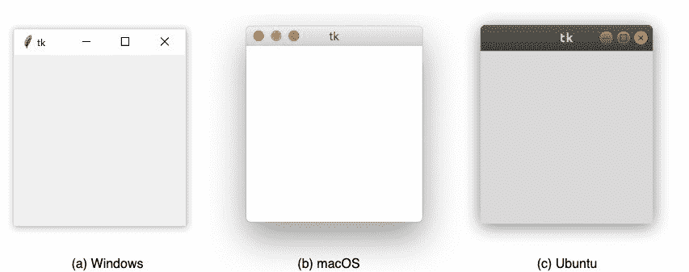](https://files.realpython.com/media/17_4_tk_window.662fec42e4f9.jpg)

在本教程的其余部分，你会看到 Windows 屏幕截图。

[*Remove ads*](/account/join/)

### *添加微件*

 *现在您有了一个窗口，您可以添加一个小部件。使用`tk.Label`类给窗口添加一些文本。用文本`"Hello, Tkinter"`创建一个`Label`小部件，并将其分配给一个名为`greeting`的变量:

>>>

```py
>>> greeting = tk.Label(text="Hello, Tkinter")
```

您之前创建的窗口不会改变。您刚刚创建了一个`Label`小部件，但是还没有将它添加到窗口中。有几种方法可以将小部件添加到窗口中。现在，您可以使用`Label`小部件的`.pack()`方法:

>>>

```py
>>> greeting.pack()
```

窗口现在看起来像这样:

[](https://files.realpython.com/media/17_4_tk_hello_win10.724293a495ad.jpg)

当您将一个小部件打包到一个窗口中时，Tkinter 会将窗口调整到尽可能小的大小，同时仍然完全包含该小部件。现在执行以下命令:

>>>

```py
>>> window.mainloop()
```

似乎什么也没发生，但是请注意，shell 中没有出现新的提示。

`window.mainloop()`告诉 Python 运行 Tkinter **事件循环**。这个方法监听事件，比如按钮点击或按键，并且[阻止](https://en.wikipedia.org/wiki/Blocking_(computing))任何跟随它的代码运行，直到你关闭调用这个方法的窗口。继续并关闭您创建的窗口，您将看到 shell 中显示一个新的提示。

**警告:**当您在 Python REPL 中使用 Tkinter 时，会在执行每一行时应用对 windows 的更新。这是*而不是*从 Python 文件执行 Tkinter 程序的情况！

如果在 Python 文件中的程序末尾没有包含`window.mainloop()`，那么 Tkinter 应用程序将永远不会运行，也不会显示任何内容。或者，您可以在 Python REPL 中通过在每个步骤后调用`window.update()`来逐步构建您的用户界面，以反映变更。

用 Tkinter 创建一个窗口只需要几行代码。但是空白窗口不是很有用！在下一节中，您将了解 Tkinter 中可用的一些小部件，以及如何定制它们来满足您的应用程序的需求。

### 检查你的理解能力

展开下面的代码块，检查您的理解情况:


编写一个完整的 Python 脚本，用文本`"Python rocks!"`创建一个 Tkinter 窗口。

窗口应该是这样的:

[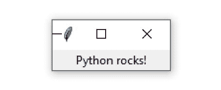](https://files.realpython.com/media/tk_check_undersanding_1.b2fa6d154791.jpg)

现在试试这个练习。

您可以展开下面的代码块来查看解决方案:


这里有一个可能的解决方案:

```py
import tkinter as tk

window = tk.Tk()
label = tk.Label(text="Python rocks!")
label.pack()

window.mainloop()
```

请记住，您的代码可能看起来不同。

当你准备好了，你可以进入下一部分。

## 使用微件

小部件是 Python GUI 框架 Tkinter 的基础。它们是用户与你的程序交互的元素。Tkinter 中的每个**小部件**都是由一个类定义的。以下是一些可用的小部件:

| 小部件类 | 描述 |
| --- | --- |
| `Label` | 用于在屏幕上显示文本的小部件 |
| `Button` | 可以包含文本并可以在单击时执行操作的按钮 |
| `Entry` | 只允许单行文本的文本输入小部件 |
| `Text` | 允许多行文本输入的文本输入小部件 |
| `Frame` | 用于分组相关部件或在部件之间提供填充的矩形区域 |

在接下来的小节中，您将看到如何使用其中的每一个，但是请记住，Tkinter 有比这里列出的更多的小部件。当你考虑到一整套全新的**主题窗口小部件**时，窗口小部件的选择变得更加复杂。在本教程的剩余部分，你将只使用 Tkinter 的**经典部件**。

如果您想了解关于这两种小部件类型的更多信息，您可以展开下面的可折叠部分:


值得注意的是，Tkinter 中目前有两大类小部件:

1.  **经典 widgets:`tkinter`包中的**，例如`tkinter.Label`
2.  **主题控件:`ttk`子模块中可用的**，例如`tkinter.ttk.Label`

Tkinter 的经典窗口小部件是高度可定制和简单明了的，但在今天的大多数平台上，它们往往显得过时或有些陌生。如果您想利用给定操作系统的用户熟悉的具有本机[外观和感觉](https://en.wikipedia.org/wiki/Look_and_feel)的小部件，那么您可能想要查看主题小部件。

大多数主题部件都是传统部件的替代物，但是看起来更现代。你也可以使用一些全新的小部件，比如[进度条](https://tkdocs.com/tutorial/morewidgets.html#progressbar)，这是 Tkinter 之前没有的。同时，您需要继续使用一些没有主题替代的经典小部件。

**注意:`tkinter.ttk`模块中的**主题小部件默认使用操作系统的本地外观。然而，你可以改变他们的[主题](https://en.wikipedia.org/wiki/Theme_(computing))来定制视觉外观，比如亮暗模式。主题是可重用的样式定义的集合，您可以将其视为 Tkinter 的[级联样式表(CSS)](https://en.wikipedia.org/wiki/CSS) 。

使新的小部件主题化意味着将它们的大部分风格信息提取到单独的对象中。一方面，这种关注点的[分离](https://en.wikipedia.org/wiki/Separation_of_concerns)是库设计中期望的属性，但另一方面，它引入了一个额外的抽象层，这使得主题化的小部件比传统的小部件更难设计。

在 Tkinter 中使用常规和主题小部件时，通常会为 Tkinter 包和模块声明以下别名:

>>>

```py
>>> import tkinter as tk
>>> import tkinter.ttk as ttk
```

像这样的别名允许你显式地引用`tk.Label`或`ttk.Label`，例如，根据你的需要在一个程序中:

>>>

```py
>>> tk.Label()
<tkinter.Label object .!label>

>>> ttk.Label()
<tkinter.ttk.Label object .!label2>
```

然而，有时您可能会发现使用通配符导入(`*`)来自动覆盖所有带有主题的遗留小部件会更方便，比如:

>>>

```py
>>> from tkinter import *
>>> from tkinter.ttk import *

>>> Label()
<tkinter.ttk.Label object .!label>

>>> Text()
<tkinter.Text object .!text>
```

现在，您不必在小部件的类名前面加上相应的 Python 模块。只要有主题窗口小部件，你就会一直创建它，否则你就会退回到经典窗口小部件。上述两个 import 语句必须按照指定的顺序放置才能生效。因此，通配符导入被认为是一种不好的做法，除非有意识地使用，否则通常应该避免。

要查看 Tkinter 小部件的完整列表，请查看 [TkDocs](https://tkdocs.com/tutorial/index.html) 教程中的[基本小部件](https://tkdocs.com/tutorial/widgets.html)和[更多小部件](https://tkdocs.com/tutorial/morewidgets.html)。尽管它描述了 Tcl/Tk 8.5 中引入的主题小部件，但其中的大部分信息也应该适用于经典小部件。

**有趣的事实:** Tkinter 字面上代表“Tk 接口”，因为它是一个 Python [绑定](https://en.wikipedia.org/wiki/Language_binding)或者是一个编程接口到 [Tcl](https://en.wikipedia.org/wiki/Tcl) 脚本语言中的 [Tk](https://en.wikipedia.org/wiki/Tk_(software)) 库。

现在，仔细看看`Label`小部件。

[*Remove ads*](/account/join/)

### *用`Label`小工具显示文本和图像*

 ***`Label`** 控件用于显示**文本**或**图像**。用户不能编辑由`Label`小部件显示的文本。这只是为了展示的目的。正如您在本教程开头的例子中看到的，您可以通过实例化`Label`类并向`text`参数传递一个[字符串](https://realpython.com/python-strings/)来创建一个`Label`小部件:

```py
label = tk.Label(text="Hello, Tkinter")
```

`Label`小工具使用默认系统文本颜色和默认系统文本背景颜色显示文本。它们通常分别是黑色和白色，但是如果您在操作系统中更改了这些设置，您可能会看到不同的颜色。

您可以使用`foreground`和`background`参数控制`Label`文本和背景颜色:

```py
label = tk.Label(
    text="Hello, Tkinter",
    foreground="white",  # Set the text color to white
    background="black"  # Set the background color to black
)
```

有许多有效的颜色名称，包括:

*   `"red"`
*   `"orange"`
*   `"yellow"`
*   `"green"`
*   `"blue"`
*   `"purple"`

许多 [HTML 颜色名称](https://htmlcolorcodes.com/color-names/)都使用 Tkinter。要获得完整的参考，包括当前系统主题控制的特定于 macOS 和 Windows 的系统颜色，请查看[颜色手册页](https://www.tcl.tk/man/tcl/TkCmd/colors.html)。

您也可以使用[十六进制 RGB 值](https://en.wikipedia.org/wiki/Web_colors#Hex_triplet)指定颜色:

```py
label = tk.Label(text="Hello, Tkinter", background="#34A2FE")
```

这将标签背景设置为漂亮的浅蓝色。十六进制的 RGB 值比命名的颜色更神秘，但也更灵活。幸运的是，有[工具](https://htmlcolorcodes.com/)可以让获取十六进制颜色代码变得相对容易。

如果你不想一直键入`foreground`和`background`，那么你可以使用简写的`fg`和`bg`参数来设置前景和背景颜色:

```py
label = tk.Label(text="Hello, Tkinter", fg="white", bg="black")
```

您也可以使用`width`和`height`参数控制标签的宽度和高度:

```py
label = tk.Label(
    text="Hello, Tkinter",
    fg="white",
    bg="black",
    width=10,
    height=10
)
```

以下是该标签在窗口中的外观:

[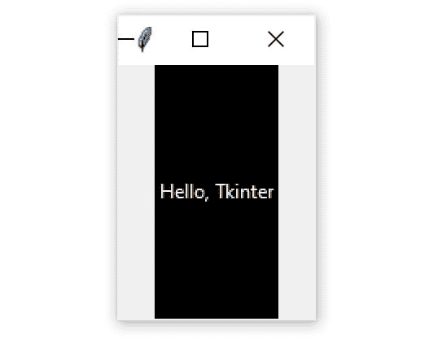](https://files.realpython.com/media/17_5_tk_label.ce0f9500e539.jpg)

虽然窗口的宽度和高度都被设置为`10`，但是窗口中的标签并不是方形的，这似乎有点奇怪。这是因为宽度和高度是以**文本单位**测量的。在默认系统字体中，一个水平文本单位由字符`0`或数字零的宽度决定。类似地，一个垂直文本单位由字符`0`的高度决定。

**注意:**对于宽度和高度的测量，Tkinter 使用文本单位，而不是英寸、厘米或像素，以确保应用程序跨平台的一致行为。

用字符的宽度来度量单位意味着小部件的大小是相对于用户机器上的默认字体而言的。这确保了无论应用程序在哪里运行，文本都能恰当地适合标签和按钮。

标签对于显示一些文本很有用，但是它们不能帮助你从用户那里得到输入。接下来您将了解的三个小部件都用于获取用户输入。

[*Remove ads*](/account/join/)

### *显示带有`Button`小部件的可点击按钮*

 ***`Button`** 小部件用来显示**可点击按钮**。您可以将它们配置为在被点击时调用一个函数。您将在下一节讲述如何通过点击按钮来调用函数。现在，让我们看看如何创建和设计一个按钮。

`Button`和`Label`小部件有很多相似之处。在很多方面，按钮只是一个你可以点击的标签！用于创建和样式化`Label`的相同关键字参数将适用于`Button`小部件。例如，下面的代码创建一个蓝色背景黄色文本的按钮。它还将宽度和高度分别设置为`25`和`5`文本单位:

```py
button = tk.Button(
    text="Click me!",
    width=25,
    height=5,
    bg="blue",
    fg="yellow",
)
```

下面是该按钮在窗口中的外观:

[](https://files.realpython.com/media/17_5_tk_button.ce3900b68c42.jpg)

相当漂亮！您可以使用接下来的两个小部件来收集用户输入的文本。

### 使用`Entry`小部件获取用户输入

当您需要从用户那里获取一些文本时，比如姓名或电子邮件地址，使用一个 **`Entry`** 小部件。它将显示一个**小文本框**，用户可以在其中键入一些文本。创建和设计`Entry`小部件的工作方式与`Label`和`Button`小部件非常相似。例如，下面的代码创建了一个小部件，它具有蓝色背景、一些黄色文本和宽度为`50`的文本单位:

```py
entry = tk.Entry(fg="yellow", bg="blue", width=50)
```

然而，关于`Entry`小部件有趣的一点不是如何设计它们的样式。而是如何使用它们从用户那里获得**输入。您可以使用`Entry`小部件执行三个主要操作:**

1.  **用`.get()`检索文本**
2.  **用`.delete()`删除文本**
3.  **用`.insert()`插入文本**

理解`Entry`小部件的最好方法是创建一个并与之交互。打开一个 Python shell，按照本节中的示例进行操作。首先，导入`tkinter`并创建一个新窗口:

>>>

```py
>>> import tkinter as tk
>>> window = tk.Tk()
```

现在创建一个`Label`和一个`Entry`小部件:

>>>

```py
>>> label = tk.Label(text="Name")
>>> entry = tk.Entry()
```

`Label`描述了什么样的文本应该放在`Entry`小部件中。它没有在`Entry`上强加任何类型的要求，但是它告诉用户你的程序期望他们在那里放什么。您需要`.pack()`将小部件放到窗口中，以便它们可见:

>>>

```py
>>> label.pack()
>>> entry.pack()
```

看起来是这样的:

[](https://files.realpython.com/media/17_5_tk_entry.80eef52739f8.jpg)

请注意，Tkinter 会自动将标签置于窗口中`Entry`小部件的中央。这是`.pack()`的一个特性，您将在后面的章节中了解更多。

用鼠标在`Entry`小部件内点击并输入`Real Python`:

[](https://files.realpython.com/media/17_5_tk_entry_1.35bce0b5e439.jpg)

现在您已经在`Entry`小部件中输入了一些文本，但是这些文本还没有发送到您的程序中。您可以使用`.get()`来检索文本，并将其分配给一个名为`name`的变量:

>>>

```py
>>> name = entry.get()
>>> name
'Real Python'
```

您也可以删除文本。这个`.delete()`方法接受一个整数参数，告诉 Python 要删除哪个字符。例如，下面的代码块显示了`.delete(0)`如何从`Entry`中删除第一个字符:

>>>

```py
>>> entry.delete(0)
```

小部件中剩余的文本现在是`eal Python`:

[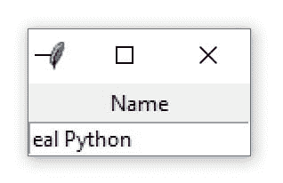](https://files.realpython.com/media/17_5_tk_entry_2.31c04085cc0e.jpg)

注意，就像 Python [字符串对象](https://realpython.com/python-strings/)一样，`Entry`小部件中的文本从`0`开始索引。

如果您需要从一个`Entry`中删除几个字符，那么将第二个整数参数传递给`.delete()`,指示删除应该停止的字符的索引。例如，以下代码删除了`Entry`中的前四个字母:

>>>

```py
>>> entry.delete(0, 4)
```

剩下的文本现在读作`Python`:

[](https://files.realpython.com/media/17_5_tk_entry_3.5d0e4ae44f1a.jpg)

`Entry.delete()`的工作原理和[切弦](https://realpython.com/python-strings/#string-slicing)一样。第一个参数决定了起始索引，删除会一直继续，但*不会*包括作为第二个参数传递的索引。使用特殊常量`tk.END`作为`.delete()`的第二个参数，删除`Entry`中的所有文本:

>>>

```py
>>> entry.delete(0, tk.END)
```

您现在会看到一个空白文本框:

[](https://files.realpython.com/media/17_5_tk_entry.80eef52739f8.jpg)

另一方面，您也可以将文本插入到`Entry`小部件中:

>>>

```py
>>> entry.insert(0, "Python")
```

窗口现在看起来像这样:

[](https://files.realpython.com/media/17_5_tk_entry_3.5d0e4ae44f1a.jpg)

第一个参数告诉`.insert()`在哪里插入文本。如果`Entry`中没有文本，那么新的文本将总是被插入到小部件的开头，不管您作为第一个参数传递什么值。例如，像上面所做的那样，用`100`而不是`0`作为第一个参数调用`.insert()`，将会生成相同的输出。

如果`Entry`已经包含一些文本，那么`.insert()`将在指定位置插入新文本，并将所有现有文本向右移动:

>>>

```py
>>> entry.insert(0, "Real ")
```

小部件文本现在显示为`Real Python`:

[](https://files.realpython.com/media/17_5_tk_entry_1.35bce0b5e439.jpg)

小工具很适合从用户那里获取少量文本，但是因为它们只显示在一行中，所以它们不适合收集大量文本。这就是`Text`小部件的用武之地！

[*Remove ads*](/account/join/)

### *使用`Text`小部件获取多行用户输入*

 ***`Text`** 小工具用于输入文本，就像`Entry`小工具一样。不同之处在于`Text`小部件可能包含**多行文本**。使用`Text`小部件，用户可以输入一整段甚至几页的文本！就像使用`Entry`小部件一样，您可以使用`Text`小部件执行三个主要操作:

1.  **用`.get()`检索文本**
2.  **用`.delete()`删除文本**
3.  **插入文本**和`.insert()`

尽管方法名与`Entry`方法相同，但它们的工作方式略有不同。是时候动手创建一个`Text`小部件，看看它能做什么了。

**注意:**上一节的窗口是否仍然打开着？

如果是这样，您可以通过执行以下命令来关闭它:

>>>

```py
>>> window.destroy()
```

也可以通过点击*关闭*按钮手动关闭。

在 Python shell 中，创建一个新的空白窗口，并在其中装入一个`Text()`小部件:

>>>

```py
>>> window = tk.Tk()
>>> text_box = tk.Text()
>>> text_box.pack()
```

默认情况下，文本框比`Entry`小部件大得多。下面是上面创建的窗口的样子:

[](https://files.realpython.com/media/17_5_tk_text_box.5f015dd1a394.jpg)

单击窗口内的任意位置激活文本框。键入单词`Hello`。然后按下 `Enter` ，在第二行输入`World`。窗口现在应该看起来像这样:

[](https://files.realpython.com/media/17_5_tk_text_box_1.e9709c22033e.jpg)

就像使用`Entry`小部件一样，您可以使用`.get()`从`Text`小部件中检索文本。然而，不带参数调用`.get()`不会像调用`Entry`小部件那样返回文本框中的完整文本。它引发一个[异常](https://realpython.com/python-exceptions/):

>>>

```py
>>> text_box.get()
Traceback (most recent call last):
  ...
TypeError: get() missing 1 required positional argument: 'index1'
```

`Text.get()`至少需要一个参数。用单个索引调用`.get()`返回单个字符。要检索几个字符，需要传递一个**开始索引**和一个**结束索引**。`Text`小部件中的索引与`Entry`小部件中的不同。由于`Text`窗口小部件可以有几行文本，所以一个索引必须包含两条信息:

1.  **一个字符的行号**
2.  字符在那一行上的位置

行号以`1`开头，字符位置以`0`开头。要创建一个索引，需要创建一个形式为`"<line>.<char>"`的字符串，用行号替换`<line>`，用字符号替换`<char>`。例如，`"1.0"`代表第一行的第一个字符，`"2.3"`代表第二行的第四个字符。

使用索引`"1.0"`从您之前创建的文本框中获取第一个字母:

>>>

```py
>>> text_box.get("1.0")
'H'
```

单词`Hello`有五个字母，`o`的字符数是`4`，因为字符数从`0`开始，单词`Hello`从文本框的第一个位置开始。就像 Python 字符串切片一样，为了从文本框中获取整个单词`Hello`，结束索引必须比要读取的最后一个字符的索引大 1。

因此，要从文本框中获取单词`Hello`，使用`"1.0"`作为第一个索引，使用`"1.5"`作为第二个索引:

>>>

```py
>>> text_box.get("1.0", "1.5")
'Hello'
```

要在文本框的第二行找到单词`World`，请将每个索引中的行号更改为`2`:

>>>

```py
>>> text_box.get("2.0", "2.5")
'World'
```

要获取文本框中的所有文本，请在`"1.0"`中设置起始索引，并对第二个索引使用特殊的`tk.END`常量:

>>>

```py
>>> text_box.get("1.0", tk.END)
'Hello\nWorld\n'
```

请注意，`.get()`返回的文本包含任何换行符。从这个例子中还可以看到，`Text`小部件中的每一行末尾都有一个换行符，包括文本框中的最后一行文本。

`.delete()`用于从文本框中删除字符。它的工作原理就像`.delete()`对于`Entry`小部件一样。使用`.delete()`有两种方法:

1.  用一个**单参数**
2.  用**两个自变量**

使用单参数版本，您将待删除的单个字符的索引传递给`.delete()`。例如，以下代码从文本框中删除第一个字符`H`:

>>>

```py
>>> text_box.delete("1.0")
```

窗口中的第一行文本现在显示为`ello`:

[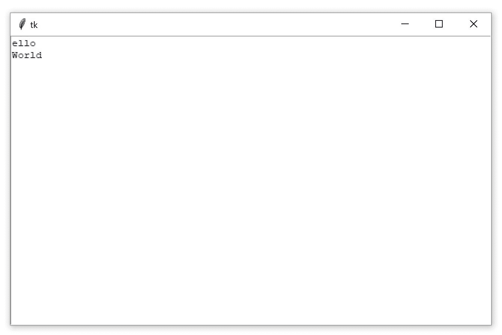](https://files.realpython.com/media/17_5_tk_text_box_2.985554457108.jpg)

对于双参数版本，您传递两个索引来删除从第一个索引开始到第二个索引的字符范围，但不包括第二个索引。

例如，要删除文本框第一行剩余的`ello`，请使用索引`"1.0"`和`"1.4"`:

>>>

```py
>>> text_box.delete("1.0", "1.4")
```

注意，文本从第一行开始就消失了。这就在第二行的单词`World`后面留下了一个空行:

[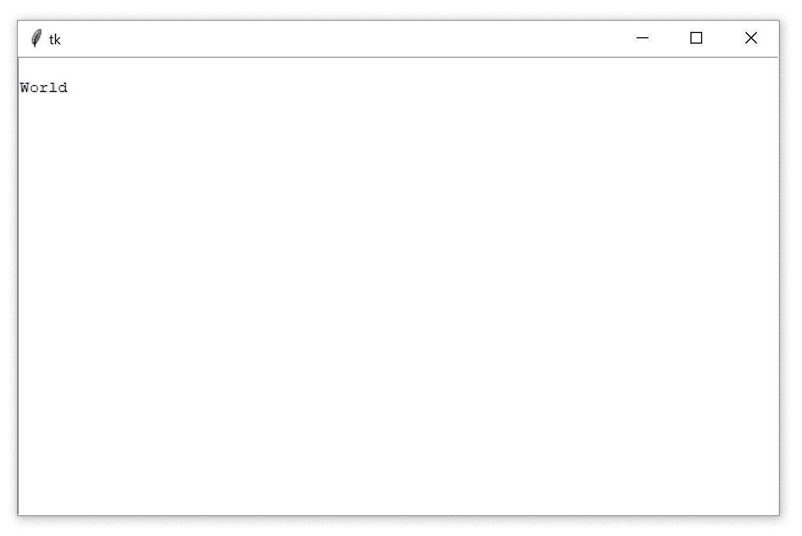](https://files.realpython.com/media/17_5_tk_text_box_3.67faf1fda71e.jpg)

即使看不到，第一行还是有个人物。是换行符！您可以使用`.get()`验证这一点:

>>>

```py
>>> text_box.get("1.0")
'\n'
```

如果删除该字符，文本框的其余内容将上移一行:

>>>

```py
>>> text_box.delete("1.0")
```

现在，`World`位于文本框的第一行:

[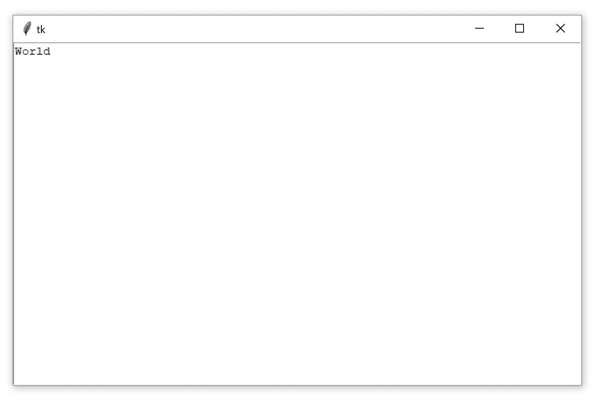](https://files.realpython.com/media/17_5_tk_text_box_4.01e407c75ef8.jpg)

尝试清除文本框中的其余文本。将`"1.0"`设置为开始索引，并将`tk.END`用于第二个索引:

>>>

```py
>>> text_box.delete("1.0", tk.END)
```

文本框现在是空的:

[](https://files.realpython.com/media/17_5_tk_text_box.5f015dd1a394.jpg)

您可以使用`.insert()`将文本插入文本框:

>>>

```py
>>> text_box.insert("1.0", "Hello")
```

这将在文本框的开头插入单词`Hello`，使用与`.get()`相同的`"<line>.<column>"`格式来指定插入位置:

[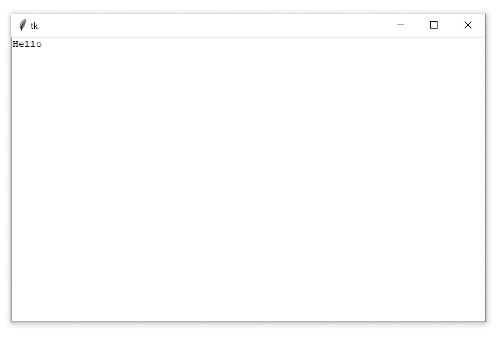](https://files.realpython.com/media/17_5_tk_text_box_5.c3837f3994aa.jpg)

看看如果你试图在第二行插入单词`World`会发生什么:

>>>

```py
>>> text_box.insert("2.0", "World")
```

不是在第二行插入文本，而是在第一行的末尾插入文本:

[](https://files.realpython.com/media/17_5_tk_text_box_6.d7d7b727dfdc.jpg)

如果您想在新行上插入文本，那么您需要在要插入的字符串中手动插入一个换行符:

>>>

```py
>>> text_box.insert("2.0", "\nWorld")
```

现在`World`在文本框的第二行:

[](https://files.realpython.com/media/17_5_tk_text_box_1.e9709c22033e.jpg)

`.insert()`会做两件事之一:

1.  **在指定位置插入文本**，如果该位置或其后已经有文本。
2.  **如果字符数大于文本框中最后一个字符的索引，则将文本**追加到指定行。

试图跟踪最后一个字符的索引通常是不切实际的。在`Text`小部件末尾插入文本的最佳方式是将`tk.END`传递给`.insert()`的第一个参数:

>>>

```py
>>> text_box.insert(tk.END, "Put me at the end!")
```

如果您想将文本放在新的一行，请不要忘记在文本的开头包含换行符(`\n`):

>>>

```py
>>> text_box.insert(tk.END, "\nPut me on a new line!")
```

`Label`、`Button`、`Entry`和`Text`小部件只是 Tkinter 中可用的几个小部件。还有其他几个，包括复选框、单选按钮、滚动条和进度条的小部件。有关所有可用小部件的更多信息，请参见[附加资源](#additional-resources)部分的附加小部件列表。

[*Remove ads*](/account/join/)

### *使用`Frame`小部件将小部件分配给框架*

 *在本教程中，您将只使用五个小部件:

1.  `Label`
2.  `Button`
3.  `Entry`
4.  `Text`
5.  `Frame`

这是到目前为止你已经看到的四个插件和`Frame`插件。 **`Frame`** 小部件对于组织应用程序中小部件的**布局很重要。**

在您详细了解小部件的视觉呈现之前，请仔细看看`Frame`小部件是如何工作的，以及如何为它们分配其他小部件。以下脚本创建一个空白的`Frame`小部件，并将其分配给主应用程序窗口:

```py
import tkinter as tk

window = tk.Tk()
frame = tk.Frame()
frame.pack()

window.mainloop()
```

`frame.pack()`将框架装入窗口，使窗口尽可能小以包含框架。当您运行上面的脚本时，您会得到一些非常无趣的输出:

[](https://files.realpython.com/media/17_5_tk_blank_frame_win10.82f9561c0d36.jpg)

一个空的`Frame`窗口小部件实际上是不可见的。框架最好被认为是其他部件的**容器**。您可以通过设置小部件的`master`属性将小部件分配给框架:

```py
frame = tk.Frame()
label = tk.Label(master=frame)
```

为了感受一下这是如何工作的，编写一个脚本来创建两个名为`frame_a`和`frame_b`的`Frame`小部件。在这个脚本中，`frame_a`包含一个带有文本`"I'm in Frame A"`的标签，`frame_b`包含标签`"I'm in Frame B"`。有一种方法可以做到这一点:

```py
import tkinter as tk

window = tk.Tk()

frame_a = tk.Frame()
frame_b = tk.Frame()

label_a = tk.Label(master=frame_a, text="I'm in Frame A")
label_a.pack()

label_b = tk.Label(master=frame_b, text="I'm in Frame B")
label_b.pack()

frame_a.pack()
frame_b.pack()

window.mainloop()
```

注意`frame_a`是在`frame_b`之前装入窗口的。打开的窗口显示`frame_b`标签上方的`frame_a`标签:

[](https://files.realpython.com/media/17_5_tk_two_frames_win10.457151c8c834.jpg)

现在看看当您交换`frame_a.pack()`和`frame_b.pack()`的顺序时会发生什么:

```py
import tkinter as tk

window = tk.Tk()

frame_a = tk.Frame()
label_a = tk.Label(master=frame_a, text="I'm in Frame A")
label_a.pack()

frame_b = tk.Frame()
label_b = tk.Label(master=frame_b, text="I'm in Frame B")
label_b.pack()

# Swap the order of `frame_a` and `frame_b`
frame_b.pack() frame_a.pack() 
window.mainloop()
```

输出如下所示:

[](https://files.realpython.com/media/17_5_tk_two_frames_swapped_win10.d9fb1d7ddc83.jpg)

现在`label_b`在上面。由于`label_b`被分配给`frame_b`，所以`frame_b`被定位到哪里，它就移动到哪里。

您已经了解的所有四种小部件类型— `Label`、`Button`、`Entry`和`Text`—都有一个在实例化它们时设置的`master`属性。这样，您可以控制将小部件分配给哪个`Frame`。小部件非常适合以逻辑方式组织其他小部件。相关的窗口小部件可以被分配到同一个框架中，这样，如果框架在窗口中移动，那么相关的窗口小部件就保持在一起。

**注意:**如果在创建新的小部件实例时省略了`master`参数，那么默认情况下，它将被放置在顶层窗口中。

除了对你的小部件进行逻辑分组，`Frame`小部件还可以给你的应用程序的**视觉呈现**添加一点亮点。继续阅读，了解如何为`Frame`小部件创建各种边框。

[*Remove ads*](/account/join/)

### *用浮雕调整框架外观*

 *`Frame`小部件可以配置一个`relief`属性，在框架周围创建一个边框。您可以将`relief`设置为以下任意值:

*   **`tk.FLAT` :** 无边框效果(默认值)
*   **`tk.SUNKEN` :** 产生凹陷效果
*   **`tk.RAISED` :** 产生凸起效果
*   **`tk.GROOVE` :** 创建凹槽边框效果
*   **`tk.RIDGE` :** 产生脊状效果

要应用边框效果，必须将`borderwidth`属性设置为大于`1`的值。该属性以像素为单位调整边框的宽度。感受每种效果的最佳方式是自己去看。下面的脚本将五个`Frame`小部件打包到一个窗口中，每个小部件的`relief`参数都有不同的值:

```py
 1import tkinter as tk
 2
 3border_effects = {
 4    "flat": tk.FLAT,
 5    "sunken": tk.SUNKEN,
 6    "raised": tk.RAISED,
 7    "groove": tk.GROOVE,
 8    "ridge": tk.RIDGE,
 9}
10
11window = tk.Tk()
12
13for relief_name, relief in border_effects.items():
14    frame = tk.Frame(master=window, relief=relief, borderwidth=5)
15    frame.pack(side=tk.LEFT)
16    label = tk.Label(master=frame, text=relief_name)
17    label.pack()
18
19window.mainloop()
```

以下是该脚本的详细内容:

*   **第 3 行到第 9 行**创建一个[字典](https://realpython.com/python-dicts/)，其关键字是 Tkinter 中可用的不同浮雕效果的名称。这些值是相应的 Tkinter 对象。这个字典被分配给`border_effects`变量。

*   **第 13 行**开始一个 [`for`循环](https://realpython.com/python-for-loop/)来循环遍历`border_effects`字典中的每个条目。

*   **第 14 行**创建一个新的`Frame`小部件，并将其分配给`window`对象。将`relief`属性设置为`border_effects`字典中相应的浮雕，将`border`属性设置为`5`，效果可见。

*   **15 号线**使用`.pack()`将`Frame`打包到窗口中。`side`关键字参数告诉 Tkinter 在哪个方向打包`frame`对象。在下一节中，您将看到更多关于这是如何工作的内容。

*   **第 16 行和第 17 行**创建一个`Label`小部件来显示浮雕的名称，并将其打包到您刚刚创建的`frame`对象中。

上述脚本生成的窗口如下所示:

[](https://files.realpython.com/media/17_5_tk_frame_reliefs_win10.31d7bc5f4fe6.jpg)

在此图像中，您可以看到以下效果:

*   **`tk.FLAT`** 创建看似平面的帧。
*   **`tk.SUNKEN`** 添加边框，使框架看起来像凹进了窗口。
*   **`tk.RAISED`** 给框架一个边框，让它看起来突出于屏幕。
*   **`tk.GROOVE`** 在原本平坦的框架周围添加一个看起来像凹槽的边框。
*   **`tk.RIDGE`** 给人一种边框边缘凸起的感觉。

这些效果给你的 Python GUI Tkinter 应用程序增加了一点视觉吸引力。

### 了解小部件命名约定

当你创建一个小部件时，你可以给它起任何你喜欢的名字，只要它是一个**有效的 Python 标识符**。在分配给小部件实例的变量名中包含小部件类的名称通常是一个好主意。例如，如果使用一个`Label`小部件来显示用户名，那么您可以将这个小部件命名为`label_user_name`。一个用于收集用户年龄的`Entry`小部件可能被称为`entry_age`。

**注意:**有时候，你可以定义一个新的小部件，而不用把它赋给一个变量。您将在同一行代码中直接调用它的`.pack()`方法:

>>>

```py
>>> tk.Label(text="Hello, Tkinter").pack()
```

当您以后不打算引用小部件的实例时，这可能会有所帮助。由于自动[内存管理](https://realpython.com/python-memory-management/)，Python 通常会[垃圾收集](https://docs.python.org/3/glossary.html#term-garbage-collection)这种未分配的对象，但是 Tkinter 通过在内部注册每个新的小部件来防止这种情况。

当您在变量名中包含小部件类名时，您可以帮助自己和任何需要阅读您的代码的人理解变量名所指的小部件类型。然而，使用 widget 类的全名会导致很长的变量名，所以您可能希望采用一种简称来引用每种 widget 类型。在本教程的其余部分，您将使用以下简写前缀来命名小部件:

| 小部件类 | 变量名前缀 | 例子 |
| --- | --- | --- |
| `Label` | `lbl` | `lbl_name` |
| `Button` | `btn` | `btn_submit` |
| `Entry` | `ent` | `ent_age` |
| `Text` | `txt` | `txt_notes` |
| `Frame` | `frm` | `frm_address` |

在本节中，您学习了如何创建窗口、使用小部件以及使用框架。此时，您可以创建一些显示消息的普通窗口，但是您还没有创建一个完整的应用程序。在下一节中，您将学习如何使用 Tkinter 强大的几何图形管理器来控制应用程序的布局。

### 检查你的理解能力

展开下面的代码块，做一个练习来检查您的理解:


编写一个完整的脚本，显示一个 40 个文本单位宽、白底黑字的`Entry`小部件。使用`.insert()`在小部件中显示文本`What is your name?`。

输出窗口应该如下所示:

[](https://files.realpython.com/media/tk_check_understanding_2.be35a125aad2.jpg)

现在试试这个练习。

您可以展开下面的代码块来查看解决方案:


有几种方法可以解决这个问题。这里有一个解决方案，使用`bg`和`fg`参数来设置`Entry`小部件的背景和前景色:

```py
import tkinter as tk

window = tk.Tk()

entry = tk.Entry(width=40, bg="white", fg="black")
entry.pack()

entry.insert(0, "What is your name?")

window.mainloop()
```

这个解决方案很棒，因为它明确地为`Entry`小部件设置了背景和前景色。

在大多数系统中，`Entry`小部件的默认背景色是白色，默认前景色是黑色。因此，您可能能够生成省略了`bg`和`fg`参数的同一个窗口:

```py
import tkinter as tk

window = tk.Tk()

entry = tk.Entry(width=40)
entry.pack()

entry.insert(0, "What is your name?")

window.mainloop()
```

请记住，您的代码可能看起来不同。

当你准备好了，你可以进入下一部分。

[*Remove ads*](/account/join/)

## *用几何图形管理器控制布局*

 *到目前为止，您已经使用`.pack()`向窗口和`Frame`窗口添加了小部件，但是您还没有了解这个方法到底是做什么的。让我们把事情弄清楚！Tkinter 中的应用布局由**几何图形管理器**控制。虽然`.pack()`是几何管理者的一个例子，但它不是唯一的一个。Tkinter 还有另外两个:

*   `.place()`
*   `.grid()`

应用程序中的每个窗口或`Frame`只能使用一个几何管理器。但是，不同的框架可以使用不同的几何管理器，即使它们使用另一个几何管理器被指定给框架或窗口。先来仔细看看`.pack()`。

### `.pack()`几何图形管理器

`.pack()`几何图形管理器使用**打包算法**将小部件以指定的顺序放置在`Frame`或窗口中。对于给定的小部件，打包算法有两个主要步骤:

1.  计算一个名为 **parcel** 的矩形区域，其高度(或宽度)刚好足以容纳小部件，并用空白空间填充窗口中剩余的宽度(或高度)。
2.  除非指定了不同的位置，否则将微件置于宗地中心。

很强大，但是很难想象。感受`.pack()`的最好方法是看一些例子。看看当你把三个`.pack()`小部件变成一个`Frame`时会发生什么:

```py
import tkinter as tk

window = tk.Tk()

frame1 = tk.Frame(master=window, width=100, height=100, bg="red")
frame1.pack()

frame2 = tk.Frame(master=window, width=50, height=50, bg="yellow")
frame2.pack()

frame3 = tk.Frame(master=window, width=25, height=25, bg="blue")
frame3.pack()

window.mainloop()
```

默认情况下，`.pack()`将每个`Frame`放置在前一个`Frame`的下方，按照它们被分配到窗口的顺序:

[](https://files.realpython.com/media/17_6_tk_pack_vertical_win10.2c0e13c90511.jpg)

每个`Frame`被放置在最高的可用位置。所以，红色的`Frame`放在窗口的顶部。然后黄色的`Frame`放在红色的下面，蓝色的`Frame`放在黄色的下面。

有三个不可见的包裹，每个包裹包含三个`Frame`部件中的一个。每个包裹和窗户一样宽，和它所装的`Frame`一样高。因为在为每个`Frame,`调用`.pack()`时没有指定**锚点**，所以它们都在它们的包裹内居中。这就是为什么每个`Frame`都在窗口中央的原因。

`.pack()`接受一些关键字参数，以便更精确地配置小部件的位置。例如，您可以设置 **`fill`** 关键字参数来指定帧应该填充的**方向**。选项有`tk.X`填充水平方向、`tk.Y`填充垂直方向、`tk.BOTH`填充两个方向。下面是如何堆叠三个框架，使每个框架水平填充整个窗口:

```py
import tkinter as tk

window = tk.Tk()

frame1 = tk.Frame(master=window, height=100, bg="red")
frame1.pack(fill=tk.X)

frame2 = tk.Frame(master=window, height=50, bg="yellow")
frame2.pack(fill=tk.X)

frame3 = tk.Frame(master=window, height=25, bg="blue")
frame3.pack(fill=tk.X)

window.mainloop()
```

注意，`width`没有在任何`Frame`小部件上设置。`width`不再必要，因为每一帧都设置`.pack()`为水平填充，覆盖你可能设置的任何宽度。

该脚本生成的窗口如下所示:

[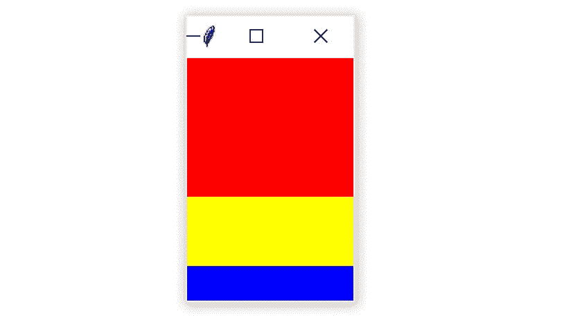](https://files.realpython.com/media/17_6_tk_pack_vertical_full_width_win10.ffff0f85671e.jpg)

用`.pack()`填充窗口的一个好处是，填充对窗口大小的响应**。尝试扩大前一个脚本生成的窗口，看看这是如何工作的。当您加宽窗口时，三个`Frame`小部件的宽度会增加以填满窗口:**

[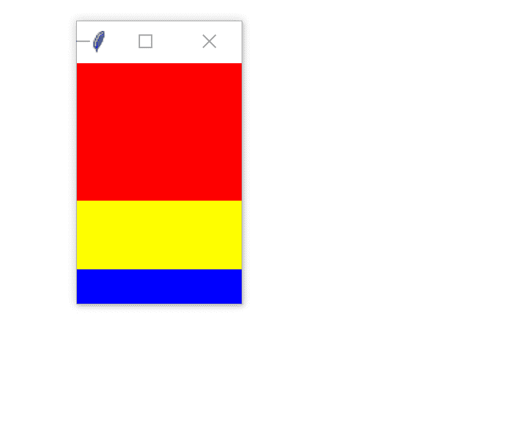](https://files.realpython.com/media/tk_horizontal_fill_responsive.76c441ecf737.gif)

不过，请注意，`Frame`小部件不会在垂直方向上扩展。

`.pack()`的 **`side`** 关键字参数指定小工具应放置在窗口的哪一侧。以下是可用的选项:

*   `tk.TOP`
*   `tk.BOTTOM`
*   `tk.LEFT`
*   `tk.RIGHT`

如果你不设置`side`，那么`.pack()`将自动使用`tk.TOP`并在窗口顶部放置新的窗口小部件，或者在窗口的最顶端没有被小部件占据的部分。例如，以下脚本从左到右并排放置三个框架，并扩展每个框架以垂直填充窗口:

```py
import tkinter as tk

window = tk.Tk()

frame1 = tk.Frame(master=window, width=200, height=100, bg="red")
frame1.pack(fill=tk.Y, side=tk.LEFT)

frame2 = tk.Frame(master=window, width=100, bg="yellow")
frame2.pack(fill=tk.Y, side=tk.LEFT)

frame3 = tk.Frame(master=window, width=50, bg="blue")
frame3.pack(fill=tk.Y, side=tk.LEFT)

window.mainloop()
```

这一次，您必须在至少一个框架上指定`height`关键字参数，以强制窗口具有一定的高度。

生成的窗口如下所示:

[](https://files.realpython.com/media/17_6_tk_pack_horizontal_full_height_win10.639bb8a42f2a.jpg)

就像您设置`fill=tk.X`在水平调整窗口大小时使框架响应一样，您可以设置`fill=tk.Y`在垂直调整窗口大小时使框架响应:

[](https://files.realpython.com/media/tk_vertical_fill_responsive.0bd13c880f26.gif)

为了使布局真正具有响应性，您可以使用`width`和`height`属性来设置框架的初始大小。然后，将`.pack()`的`fill`关键字参数设置为`tk.BOTH`，将`expand`关键字参数设置为`True`:

```py
import tkinter as tk

window = tk.Tk()

frame1 = tk.Frame(master=window, width=200, height=100, bg="red")
frame1.pack(fill=tk.BOTH, side=tk.LEFT, expand=True)

frame2 = tk.Frame(master=window, width=100, bg="yellow")
frame2.pack(fill=tk.BOTH, side=tk.LEFT, expand=True)

frame3 = tk.Frame(master=window, width=50, bg="blue")
frame3.pack(fill=tk.BOTH, side=tk.LEFT, expand=True)

window.mainloop()
```

当您运行上面的脚本时，您将看到一个窗口，该窗口最初看起来与您在前面的示例中生成的窗口相同。不同之处在于，现在您可以随意调整窗口大小，框架会相应地扩展并填充窗口:

[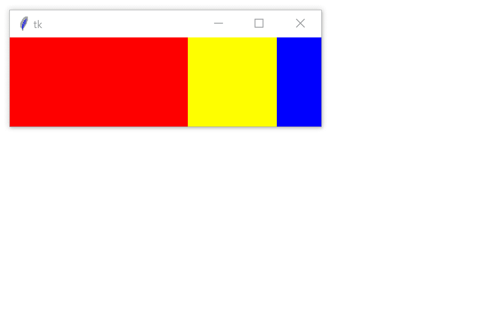](https://files.realpython.com/media/tk_full_responsive.57f1ff6e53ab.gif)

相当酷！

[*Remove ads*](/account/join/)

### *`.place()`几何图形管理器*

 *你可以使用`.place()`来控制窗口中的**精确位置**或者`Frame`。您必须提供两个关键字参数，`x`和`y`，它们指定小部件左上角的 x 和 y 坐标。`x`和`y`都是以像素为单位，而不是文本单位。

记住**原点**，其中`x`和`y`都是`0`，是`Frame`或窗口的左上角。因此，您可以将`.place()`的`y`参数视为距离窗口顶部的像素数，将`x`参数视为距离窗口左边缘的像素数。

下面是一个关于`.place()`几何图形管理器如何工作的例子:

```py
 1import tkinter as tk
 2
 3window = tk.Tk()
 4
 5frame = tk.Frame(master=window, width=150, height=150)
 6frame.pack()
 7
 8label1 = tk.Label(master=frame, text="I'm at (0, 0)", bg="red")
 9label1.place(x=0, y=0)
10
11label2 = tk.Label(master=frame, text="I'm at (75, 75)", bg="yellow")
12label2.place(x=75, y=75)
13
14window.mainloop()
```

下面是这段代码的工作原理:

*   **第 5 行和第 6 行**创建一个名为`frame`的新的`Frame`小部件，测量`150`像素宽和`150`像素高，并用`.pack()`将其打包到窗口中。
*   **第 8 行和第 9 行**创建一个名为`label1`的红色背景的新`Label`，并将其放置在`frame1`的位置(0，0)。
*   **第 11 行和第 12 行**创建第二个`Label`，名为`label2`，背景为黄色，并将其放置在`frame1`的位置(75，75)。

下面是代码生成的窗口:

[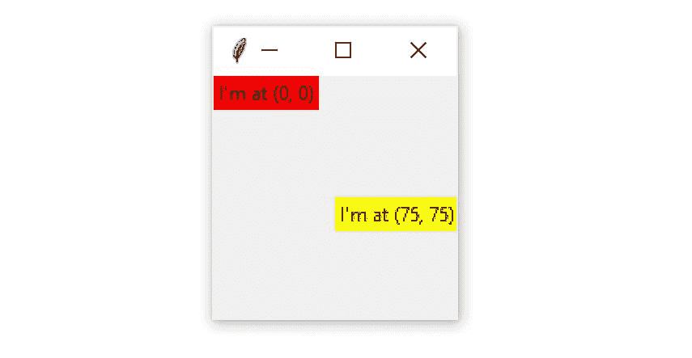](https://files.realpython.com/media/17_6_tk_place_win10.676b862a7edd.jpg)

请注意，如果您在使用不同字体大小和样式的不同操作系统上运行此代码，那么第二个标签可能会被窗口边缘部分遮挡。这就是为什么`.place()`不常使用的原因。除此之外，它还有两个主要缺点:

1.  使用`.place()`很难管理布局。如果您的应用程序有很多小部件，这一点尤其正确。
2.  用`.place()`创建的布局没有响应。它们不会随着窗口大小的改变而改变。

跨平台 GUI 开发的一个主要挑战是让布局无论在哪个平台上看起来都好看，而对于做出响应性和跨平台的布局来说,`.place()`不是一个好的选择。

这并不是说你不应该使用`.place()`！在某些情况下，这可能正是你所需要的。例如，如果您正在为地图创建 GUI 界面，那么`.place()`可能是确保小部件在地图上以正确的距离放置的最佳选择。

`.pack()`通常是比`.place()`更好的选择，但即使是`.pack()`也有一些缺点。窗口小部件的位置取决于调用`.pack()`的顺序，因此在没有完全理解控制布局的代码的情况下，很难修改现有的应用程序。`.grid()`几何图形管理器解决了很多这样的问题，你将在下一节看到。

### `.grid()`几何图形管理器

您可能最常使用的几何管理器是`.grid()`，它以一种更容易理解和维护的格式提供了`.pack()`的所有功能。

`.grid()`的工作原理是将一个窗口或`Frame`分割成行和列。通过调用`.grid()`并将行和列索引分别传递给`row`和`column`关键字参数，可以指定小部件的位置。行索引和列索引都从`0`开始，因此`1`的行索引和`2`的列索引告诉`.grid()`将小部件放在第二行的第三列。

以下脚本创建了一个 3 × 3 的框架网格，其中包含了`Label`小部件:

```py
import tkinter as tk

window = tk.Tk()

for i in range(3):
    for j in range(3):
        frame = tk.Frame(
            master=window,
            relief=tk.RAISED,
            borderwidth=1
        )
        frame.grid(row=i, column=j)
        label = tk.Label(master=frame, text=f"Row {i}\nColumn {j}")
        label.pack()

window.mainloop()
```

下面是生成的窗口的样子:

[](https://files.realpython.com/media/17_6_tk_grid_win10.57eb680e5e6e.jpg)

在本例中，您使用了两个几何体管理器。每个框架通过`.grid()`几何图形管理器连接到`window`:

```py
import tkinter as tk

window = tk.Tk()

for i in range(3):
    for j in range(3):
        frame = tk.Frame(
            master=window,
            relief=tk.RAISED,
            borderwidth=1
        )
 frame.grid(row=i, column=j)        label = tk.Label(master=frame, text=f"Row {i}\nColumn {j}")
        label.pack()

window.mainloop()
```

每个`label`通过`.pack()`连接到其主`Frame`:

```py
import tkinter as tk

window = tk.Tk()

for i in range(3):
    for j in range(3):
        frame = tk.Frame(
            master=window,
            relief=tk.RAISED,
            borderwidth=1
        )
        frame.grid(row=i, column=j)
        label = tk.Label(master=frame, text=f"Row {i}\nColumn {j}")
 label.pack() 
window.mainloop()
```

这里要意识到的重要一点是，即使在每个`Frame`对象上调用了`.grid()`，几何管理器也适用于`window`对象。类似地，每个`frame`的布局由`.pack()`几何图形管理器控制。

上例中的框架紧密相邻放置。要在每个框架周围添加一些空间，可以设置网格中每个单元格的填充。**填充**只是一些空白空间，围绕着一个小部件，在视觉上把它的内容分开。

两种类型的衬垫是**外部**和**内部衬垫**。外部填充在网格单元的外部增加了一些空间。它由`.grid()`的两个关键字参数控制:

1.  **`padx`** 在水平方向添加填充。
2.  **`pady`** 在垂直方向添加填充。

`padx`和`pady`都是以像素度量的，而不是文本单位，因此将它们设置为相同的值将在两个方向上创建相同的填充量。尝试在前面示例中的框架外部添加一些填充:

```py
import tkinter as tk

window = tk.Tk()

for i in range(3):
    for j in range(3):
        frame = tk.Frame(
            master=window,
            relief=tk.RAISED,
            borderwidth=1
        )
 frame.grid(row=i, column=j, padx=5, pady=5)        label = tk.Label(master=frame, text=f"Row {i}\nColumn {j}")
        label.pack()

window.mainloop()
```

这是生成的窗口:

[](https://files.realpython.com/media/17_6_tk_grid_with_ext_padding_win10.20856fb630e9.jpg)

`.pack()`也有`padx`和`pady`参数。以下代码与前面的代码几乎相同，除了您在每个标签周围的`x`和`y`方向添加了五个像素的额外填充:

```py
import tkinter as tk

window = tk.Tk()

for i in range(3):
    for j in range(3):
        frame = tk.Frame(
            master=window,
            relief=tk.RAISED,
            borderwidth=1
        )
        frame.grid(row=i, column=j, padx=5, pady=5)
        label = tk.Label(master=frame, text=f"Row {i}\nColumn {j}")
 label.pack(padx=5, pady=5) 
window.mainloop()
```

在`Label`小部件周围的额外填充给网格中的每个单元格在`Frame`边框和标签中的文本之间留有一点空间:

[](https://files.realpython.com/media/17_6_tk_grid_with_ext_and_int_padding_win10.9b58ecc7853a.jpg)

看起来很不错！但是，如果你尝试向任何方向扩展窗口，你会发现布局没有很好的响应:

[](https://files.realpython.com/media/tk_grid_unresponsive.c9f491987957.gif)

当窗口扩展时，整个网格停留在左上角。

通过在`window`对象上使用`.columnconfigure()`和`.rowconfigure()`，你可以调整网格的行和列在窗口调整大小时的增长方式。记住，网格是附属于`window`的，即使你在每个`Frame`小部件上调用`.grid()`。`.columnconfigure()`和`.rowconfigure()`都有三个基本参数:

1.  **Index:** 要配置的网格列或行的索引，或者同时配置多行或多列的索引列表
2.  **Weight:** 一个名为`weight`的关键字参数，它确定该列或行相对于其他列和行应该如何响应窗口大小调整
3.  **最小尺寸:**一个名为`minsize`的关键字参数，以像素为单位设置行高或列宽的最小尺寸

默认情况下，`weight`被设置为`0`，这意味着当窗口调整大小时，列或行不会扩展。如果每一列或每一行都被赋予一个`1`的权重，那么它们都以相同的速度增长。如果一列的权重为`1`，另一列的权重为`2`，那么第二列的膨胀速度是第一列的两倍。调整前面的脚本以更好地处理窗口大小调整:

```py
import tkinter as tk

window = tk.Tk()

for i in range(3):
 window.columnconfigure(i, weight=1, minsize=75) window.rowconfigure(i, weight=1, minsize=50) 
    for j in range(0, 3):
        frame = tk.Frame(
            master=window,
            relief=tk.RAISED,
            borderwidth=1
        )
        frame.grid(row=i, column=j, padx=5, pady=5)
        label = tk.Label(master=frame, text=f"Row {i}\nColumn {j}")
        label.pack(padx=5, pady=5)

window.mainloop()
```

`.columnconfigure()`和`.rowconfigure()`被放置在外部`for`回路的主体中。您可以在`for`循环之外显式配置每一列和每一行，但是这需要编写额外的六行代码。

在循环的每次迭代中，第`i`列和行被配置为具有权重`1`。这确保了无论何时调整窗口大小时，行和列都以相同的速率扩展。每列的`minsize`参数被设置为`75`，每行的`50`。这确保了`Label`小部件总是显示它的文本而不截断任何字符，即使窗口非常小。

结果是网格布局随着窗口大小的调整而平滑地扩展和收缩:

[](https://files.realpython.com/media/tk_grid_responsive.02edef27aff4.gif)

亲自尝试一下，感受一下它是如何工作的！摆弄一下`weight`和`minsize`参数，看看它们如何影响网格。

默认情况下，小部件在其网格单元中居中。例如，下面的代码创建了两个`Label`小部件，并将它们放在一个一列两行的网格中:

```py
import tkinter as tk

window = tk.Tk()
window.columnconfigure(0, minsize=250)
window.rowconfigure([0, 1], minsize=100)

label1 = tk.Label(text="A")
label1.grid(row=0, column=0)

label2 = tk.Label(text="B")
label2.grid(row=1, column=0)

window.mainloop()
```

每个网格单元的宽度为`250`像素，高度为`100`像素。标签放置在每个单元格的中央，如下图所示:

[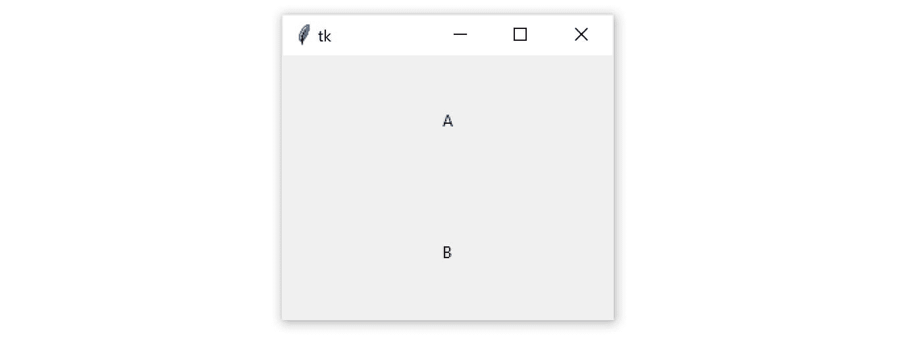](https://files.realpython.com/media/17_6_tk_grid_col_and_row_size_win10.c6e03e9483bd.jpg)

您可以使用`sticky`参数更改网格单元内每个标签的位置，该参数接受包含一个或多个以下字母的字符串:

*   **`"n"`或`"N"`** 向单元格中上部对齐
*   **`"e"`或`"E"`** 向单元格的右中央对齐
*   **`"s"`或`"S"`** 向单元格的下中部对齐
*   **`"w"`或`"W"`** 向单元格的左侧居中对齐

字母`"n"`、`"s"`、`"e"`和`"w"`来自北、南、东、西四个主要方向。在前面的代码中，将两个标签上的`sticky`设置为`"n"`会将每个标签定位在其网格单元的顶部中心:

```py
import tkinter as tk

window = tk.Tk()
window.columnconfigure(0, minsize=250)
window.rowconfigure([0, 1], minsize=100)

label1 = tk.Label(text="A")
label1.grid(row=0, column=0, sticky="n") 
label2 = tk.Label(text="B")
label2.grid(row=1, column=0, sticky="n") 
window.mainloop()
```

以下是输出结果:

[](https://files.realpython.com/media/17_6_tk_grid_stickty_n_win10.3d0cfb33e19f.jpg)

您可以在单个字符串中组合多个字母，以将每个标签放置在其网格单元格的角上:

```py
import tkinter as tk

window = tk.Tk()
window.columnconfigure(0, minsize=250)
window.rowconfigure([0, 1], minsize=100)

label1 = tk.Label(text="A")
label1.grid(row=0, column=0, sticky="ne") 
label2 = tk.Label(text="B")
label2.grid(row=1, column=0, sticky="sw") 
window.mainloop()
```

在这个例子中，`label1`的`sticky`参数被设置为`"ne"`，这将标签放置在其网格单元的右上角。通过`"sw"`到`sticky`，使`label2`位于左下角。这是它在窗口中的样子:

[](https://files.realpython.com/media/17_6_tk_grid_sticky_corners_win10.67d522344ba9.jpg)

当用`sticky`定位一个小部件时，小部件本身的大小刚好可以容纳任何文本和其他内容。它不会填满整个网格单元。为了填充网格，您可以指定`"ns"`强制小部件在垂直方向填充单元格，或者指定`"ew"`在水平方向填充单元格。要填充整个单元格，将`sticky`设置为`"nsew"`。以下示例说明了这些选项中的每一个:

```py
import tkinter as tk

window = tk.Tk()

window.rowconfigure(0, minsize=50)
window.columnconfigure([0, 1, 2, 3], minsize=50)

label1 = tk.Label(text="1", bg="black", fg="white")
label2 = tk.Label(text="2", bg="black", fg="white")
label3 = tk.Label(text="3", bg="black", fg="white")
label4 = tk.Label(text="4", bg="black", fg="white")

label1.grid(row=0, column=0)
label2.grid(row=0, column=1, sticky="ew")
label3.grid(row=0, column=2, sticky="ns")
label4.grid(row=0, column=3, sticky="nsew")

window.mainloop()
```

下面是输出的样子:

[](https://files.realpython.com/media/17_6_tk_grid_sticky_fill_win10.beea5d30319e.jpg)

上面的例子说明了`.grid()`几何图形管理器的`sticky`参数可以用来实现与`.pack()`几何图形管理器的`fill`参数相同的效果。下表总结了`sticky`和`fill`参数之间的对应关系:

| `.grid()` | `.pack()` |
| --- | --- |
| `sticky="ns"` | `fill=tk.Y` |
| `sticky="ew"` | `fill=tk.X` |
| `sticky="nsew"` | `fill=tk.BOTH` |

`.grid()`是一个强大的几何图形管理器。它通常比`.pack()`更容易理解，也比`.place()`更灵活。当你创建新的 Tkinter 应用时，你应该考虑使用`.grid()`作为你的主要几何管理器。

**注意:** `.grid()`提供了比你在这里看到的更多的灵活性。例如，您可以将单元格配置为跨越多行和多列。更多信息，请查看 [TkDocs 教程](https://tkdocs.com/tutorial/index.html)的[网格几何管理器章节](https://tkdocs.com/tutorial/grid.html)。

现在您已经掌握了 Python GUI 框架 Tkinter 的几何管理器的基础，下一步是将动作分配给按钮，使您的应用程序变得生动。

[*Remove ads*](/account/join/)

### *检查你的理解能力*

 *展开下面的代码块，做一个练习来检查您的理解:


下面是用 Tkinter 制作的地址条目表单的图像:

[](https://files.realpython.com/media/17_6_tk_exercise2_win10.43ba39ae6134.jpg)

编写一个完整的脚本来重新创建窗口。你可以使用任何你喜欢的几何图形管理器。

您可以展开下面的代码块来查看解决方案:


有许多不同的方法来解决这个问题。如果您的解决方案生成的窗口与练习语句中的窗口相同，那么恭喜您！您已经成功完成了练习！下面，你可以看看两个使用`.grid()`几何图形管理器的解决方案。

一种解决方案是用每个字段所需的设置创建一个`Label`和`Entry`小部件:

```py
import tkinter as tk

# Create a new window with the title "Address Entry Form"
window = tk.Tk()
window.title("Address Entry Form")

# Create a new frame `frm_form` to contain the Label
# and Entry widgets for entering address information
frm_form = tk.Frame(relief=tk.SUNKEN, borderwidth=3)
# Pack the frame into the window
frm_form.pack()

# Create the Label and Entry widgets for "First Name"
lbl_first_name = tk.Label(master=frm_form, text="First Name:")
ent_first_name = tk.Entry(master=frm_form, width=50)
# Use the grid geometry manager to place the Label and
# Entry widgets in the first and second columns of the
# first row of the grid
lbl_first_name.grid(row=0, column=0, sticky="e")
ent_first_name.grid(row=0, column=1)

# Create the Label and Entry widgets for "Last Name"
lbl_last_name = tk.Label(master=frm_form, text="Last Name:")
ent_last_name = tk.Entry(master=frm_form, width=50)
# Place the widgets in the second row of the grid
lbl_last_name.grid(row=1, column=0, sticky="e")
ent_last_name.grid(row=1, column=1)

# Create the Label and Entry widgets for "Address Line 1"
lbl_address1 = tk.Label(master=frm_form, text="Address Line 1:")
ent_address1 = tk.Entry(master=frm_form, width=50)
# Place the widgets in the third row of the grid
lbl_address1.grid(row=2, column=0, sticky="e")
ent_address1.grid(row=2, column=1)

# Create the Label and Entry widgets for "Address Line 2"
lbl_address2 = tk.Label(master=frm_form, text="Address Line 2:")
ent_address2 = tk.Entry(master=frm_form, width=50)
# Place the widgets in the fourth row of the grid
lbl_address2.grid(row=3, column=0, sticky=tk.E)
ent_address2.grid(row=3, column=1)

# Create the Label and Entry widgets for "City"
lbl_city = tk.Label(master=frm_form, text="City:")
ent_city = tk.Entry(master=frm_form, width=50)
# Place the widgets in the fifth row of the grid
lbl_city.grid(row=4, column=0, sticky=tk.E)
ent_city.grid(row=4, column=1)

# Create the Label and Entry widgets for "State/Province"
lbl_state = tk.Label(master=frm_form, text="State/Province:")
ent_state = tk.Entry(master=frm_form, width=50)
# Place the widgets in the sixth row of the grid
lbl_state.grid(row=5, column=0, sticky=tk.E)
ent_state.grid(row=5, column=1)

# Create the Label and Entry widgets for "Postal Code"
lbl_postal_code = tk.Label(master=frm_form, text="Postal Code:")
ent_postal_code = tk.Entry(master=frm_form, width=50)
# Place the widgets in the seventh row of the grid
lbl_postal_code.grid(row=6, column=0, sticky=tk.E)
ent_postal_code.grid(row=6, column=1)

# Create the Label and Entry widgets for "Country"
lbl_country = tk.Label(master=frm_form, text="Country:")
ent_country = tk.Entry(master=frm_form, width=50)
# Place the widgets in the eight row of the grid
lbl_country.grid(row=7, column=0, sticky=tk.E)
ent_country.grid(row=7, column=1)

# Create a new frame `frm_buttons` to contain the
# Submit and Clear buttons. This frame fills the
# whole window in the horizontal direction and has
# 5 pixels of horizontal and vertical padding.
frm_buttons = tk.Frame()
frm_buttons.pack(fill=tk.X, ipadx=5, ipady=5)

# Create the "Submit" button and pack it to the
# right side of `frm_buttons`
btn_submit = tk.Button(master=frm_buttons, text="Submit")
btn_submit.pack(side=tk.RIGHT, padx=10, ipadx=10)

# Create the "Clear" button and pack it to the
# right side of `frm_buttons`
btn_clear = tk.Button(master=frm_buttons, text="Clear")
btn_clear.pack(side=tk.RIGHT, ipadx=10)

# Start the application
window.mainloop()
```

这个解决方案没什么问题。有点长，但是一切都很露骨。如果你想改变一些东西，那么很清楚地看到具体在哪里这样做。

也就是说，通过认识到每个`Entry`具有相同的宽度，并且对于每个`Label`您所需要的只是文本，可以大大缩短解决方案:

```py
import tkinter as tk

# Create a new window with the title "Address Entry Form"
window = tk.Tk()
window.title("Address Entry Form")

# Create a new frame `frm_form` to contain the Label
# and Entry widgets for entering address information
frm_form = tk.Frame(relief=tk.SUNKEN, borderwidth=3)
# Pack the frame into the window
frm_form.pack()

# List of field labels
labels = [
    "First Name:",
    "Last Name:",
    "Address Line 1:",
    "Address Line 2:",
    "City:",
    "State/Province:",
    "Postal Code:",
    "Country:",
]

# Loop over the list of field labels
for idx, text in enumerate(labels):
    # Create a Label widget with the text from the labels list
    label = tk.Label(master=frm_form, text=text)
    # Create an Entry widget
    entry = tk.Entry(master=frm_form, width=50)
    # Use the grid geometry manager to place the Label and
    # Entry widgets in the row whose index is idx
    label.grid(row=idx, column=0, sticky="e")
    entry.grid(row=idx, column=1)

# Create a new frame `frm_buttons` to contain the
# Submit and Clear buttons. This frame fills the
# whole window in the horizontal direction and has
# 5 pixels of horizontal and vertical padding.
frm_buttons = tk.Frame()
frm_buttons.pack(fill=tk.X, ipadx=5, ipady=5)

# Create the "Submit" button and pack it to the
# right side of `frm_buttons`
btn_submit = tk.Button(master=frm_buttons, text="Submit")
btn_submit.pack(side=tk.RIGHT, padx=10, ipadx=10)

# Create the "Clear" button and pack it to the
# right side of `frm_buttons`
btn_clear = tk.Button(master=frm_buttons, text="Clear")
btn_clear.pack(side=tk.RIGHT, ipadx=10)

# Start the application
window.mainloop()
```

在这个解决方案中，一个[列表](https://realpython.com/python-lists-tuples/#python-lists)用于存储表单中每个标签的字符串。它们按照每个表单域应该出现的顺序存储。然后， [`enumerate()`](https://realpython.com/python-enumerate/) 从`labels`列表中的每个值获取索引和字符串。

当你准备好了，你可以进入下一部分。

## 让您的应用程序具有交互性

到目前为止，您已经非常了解如何使用 Tkinter 创建一个窗口，添加一些小部件，以及控制应用程序布局。这很好，但是应用程序不应该只是看起来很好——它们实际上需要做一些事情！在本节中，您将学习如何通过在特定的**事件**发生时执行动作来激活您的应用程序。

### 使用事件和事件处理程序

创建 Tkinter 应用程序时，必须调用`window.mainloop()`来启动**事件循环**。在事件循环期间，您的应用程序检查事件是否已经发生。如果是，那么它将执行一些代码作为响应。

Tkinter 为您提供了事件循环，因此您不必自己编写任何检查事件的代码。但是，您必须编写将被执行以响应事件的代码。在 Tkinter 中，为应用程序中使用的事件编写名为**事件处理程序**的函数。

**注意:**一个**事件**是在事件循环期间发生的任何可能触发应用程序中某些行为的动作，比如当一个键或鼠标按钮被按下时。

当一个事件发生时，一个**事件对象**被发出，这意味着一个代表该事件的类的实例被创建。您不需要担心自己实例化这些类。Tkinter 将自动为您创建事件类的实例。

为了更好地理解 Tkinter 的事件循环是如何工作的，您将编写自己的事件循环。这样，您可以看到 Tkinter 的事件循环如何适合您的应用程序，以及哪些部分需要您自己编写。

假设有一个包含事件对象的名为`events`的列表。每当程序中发生一个事件时，一个新的事件对象会自动追加到`events`中。您不需要实现这种更新机制。在这个概念性的例子中，它会自动发生。使用无限循环，您可以不断地检查`events`中是否有任何事件对象:

```py
# Assume that this list gets updated automatically
events = []

# Run the event loop
while True:
    # If the event list is empty, then no events have occurred
    # and you can skip to the next iteration of the loop
    if events == []:
        continue

    # If execution reaches this point, then there is at least one
    # event object in the event list
    event = events[0]
```

现在，您创建的事件循环不会对`event`做任何事情。让我们改变这一点。假设您的应用程序需要响应按键。您需要检查`event`是否是由用户按下键盘上的一个键生成的，如果是，则将`event`传递给按键的事件处理函数。

假设`event`有一个设置为字符串`"keypress"`的`.type`属性(如果该事件是一个按键事件对象)和一个包含被按下按键的字符的`.char`属性。创建一个新的`handle_keypress()`函数并更新你的事件循环代码:

```py
events = []

# Create an event handler def handle_keypress(event):
 """Print the character associated to the key pressed""" print(event.char) 
while True:
    if events == []:
        continue

    event = events[0]

    # If event is a keypress event object
    if event.type == "keypress":
        # Call the keypress event handler
        handle_keypress(event)
```

当您调用`window.mainloop()`时，类似上面的循环会自动运行。这个方法负责循环的两个部分:

1.  它维护一个已经发生的事件的**列表。**
2.  每当一个新事件被添加到列表中时，它就运行一个**事件处理程序**。

更新您的事件循环以使用`window.mainloop()`而不是您自己的事件循环:

```py
import tkinter as tk 
# Create a window object window = tk.Tk() 
# Create an event handler
def handle_keypress(event):
    """Print the character associated to the key pressed"""
    print(event.char)

# Run the event loop window.mainloop()
```

为你做了很多，但是上面的代码缺少了一些东西。Tkinter 怎么知道什么时候用`handle_keypress()`？Tkinter 小部件有一个名为`.bind()`的方法就是为了这个目的。

[*Remove ads*](/account/join/)

### *使用`.bind()`*

 *要在小部件上发生事件时调用事件处理程序，请使用`.bind()`。事件处理程序被称为**绑定**到事件，因为它在每次事件发生时被调用。您将继续上一节的按键示例，并使用`.bind()`将`handle_keypress()`绑定到按键事件:

```py
import tkinter as tk

window = tk.Tk()

def handle_keypress(event):
    """Print the character associated to the key pressed"""
    print(event.char)

# Bind keypress event to handle_keypress() window.bind("<Key>", handle_keypress) 
window.mainloop()
```

这里，使用`window.bind()`将`handle_keypress()`事件处理程序绑定到一个`"<Key>"`事件。当应用程序运行时，只要按下一个键，你的程序就会打印出所按下的键的字符。

**注意:**上述程序的输出是*而不是*打印在 Tkinter 应用程序窗口中。它被打印到[标准输出流(stdout)](https://en.wikipedia.org/wiki/Standard_streams#Standard_output_(stdout)) 。

如果你在空闲状态下运行程序，那么你会在交互窗口中看到输出。如果您从终端运行程序，那么您应该在终端上看到输出。

`.bind()`总是需要至少两个参数:

1.  一个由形式为`"<event_name>"`的字符串表示的**事件**，其中`event_name`可以是 Tkinter 的任何事件
2.  一个**事件处理程序**,它是事件发生时要调用的函数的名称

事件处理程序被绑定到调用`.bind()`的小部件上。当调用事件处理程序时，事件对象被传递给事件处理程序函数。

在上面的例子中，事件处理程序被绑定到窗口本身，但是您可以将事件处理程序绑定到应用程序中的任何小部件。例如，您可以将一个事件处理程序绑定到一个`Button`小部件，每当按钮被按下时，它就会执行一些操作:

```py
def handle_click(event):
    print("The button was clicked!")

button = tk.Button(text="Click me!")

button.bind("<Button-1>", handle_click)
```

在这个例子中，`button`小部件上的`"<Button-1>"`事件被绑定到`handle_click`事件处理程序。当鼠标在小部件上时，只要按下鼠标左键，就会发生`"<Button-1>"`事件。鼠标点击还有其他事件，包括鼠标中键的`"<Button-2>"`和鼠标右键的`"<Button-3>"`。

**注:**常用事件列表请参见 [Tkinter 8.5 参考](https://web.archive.org/web/20190524140835/https://infohost.nmt.edu/tcc/help/pubs/tkinter/web/index.html)的[事件类型](https://web.archive.org/web/20190512164300/http://infohost.nmt.edu/tcc/help/pubs/tkinter/web/event-types.html)部分。

您可以使用`.bind()`将任何事件处理程序绑定到任何类型的小部件，但是有一种更直接的方法可以使用`Button`小部件的`command`属性将事件处理程序绑定到按钮点击。

### 使用`command`

每个`Button`小部件都有一个`command`属性，您可以将其分配给一个函数。每当按下按钮时，该功能就被执行。

看一个例子。首先，您将创建一个窗口，其中有一个保存数值的`Label`小部件。你将在标签的左右两边放置按钮。左键用于减少`Label`中的数值，右键用于增加数值。以下是窗口的代码:

```py
 1import tkinter as tk
 2
 3window = tk.Tk()
 4
 5window.rowconfigure(0, minsize=50, weight=1)
 6window.columnconfigure([0, 1, 2], minsize=50, weight=1)
 7
 8btn_decrease = tk.Button(master=window, text="-")
 9btn_decrease.grid(row=0, column=0, sticky="nsew")
10
11lbl_value = tk.Label(master=window, text="0")
12lbl_value.grid(row=0, column=1)
13
14btn_increase = tk.Button(master=window, text="+")
15btn_increase.grid(row=0, column=2, sticky="nsew")
16
17window.mainloop()
```

窗口看起来像这样:

[](https://files.realpython.com/media/17_7_tk_counter_window_win10.5aca78b398e7.jpg)

定义好应用程序布局后，您可以通过给按钮一些命令来赋予它生命。从左边的按钮开始。当按下此按钮时，标签中的值应减少 1。为了做到这一点，你首先需要得到两个问题的答案:

1.  如何获取`Label`中的文本？
2.  如何更新`Label`中的文字？

`Label`小工具不像`Entry`和`Text`小工具那样有`.get()`。但是，您可以通过使用字典样式的下标符号访问`text`属性来从标签中检索文本:

```py
label = tk.Label(text="Hello")

# Retrieve a label's text
text = label["text"]

# Set new text for the label
label["text"] = "Good bye"
```

现在您已经知道如何获取和设置标签的文本，编写一个将`lbl_value`中的值增加 1 的`increase()`函数:

```py
 1import tkinter as tk
 2
 3def increase():
 4    value = int(lbl_value["text"])
 5    lbl_value["text"] = f"{value + 1}"
 6
 7# ...
```

`increase()`从`lbl_value`获取文本并用`int()`将其转换成整数。然后，它将这个值增加 1，并将标签的`text`属性设置为这个新值。

您还需要`decrease()`将`value_label`中的值减一:

```py
 5# ...
 6
 7def decrease():
 8    value = int(lbl_value["text"])
 9    lbl_value["text"] = f"{value - 1}"
10
11# ...
```

将`increase()`和`decrease()`放在代码中的`import`语句之后。

要将按钮连接到功能，请将功能分配给按钮的`command`属性。您可以在实例化按钮时做到这一点。例如，将实例化按钮的两行代码更新为:

```py
14# ...
15
16btn_decrease = tk.Button(master=window, text="-", command=decrease) 17btn_decrease.grid(row=0, column=0, sticky="nsew")
18
19lbl_value = tk.Label(master=window, text="0")
20lbl_value.grid(row=0, column=1)
21
22btn_increase = tk.Button(master=window, text="+", command=increase) 23btn_increase.grid(row=0, column=2, sticky="nsew")
24
25window.mainloop()
```

这就是将按钮绑定到`increase()`和`decrease()`并使程序正常运行所需做的全部工作。尝试保存您的更改并运行应用程序！点按窗口中央的按钮来增大和减小值:

[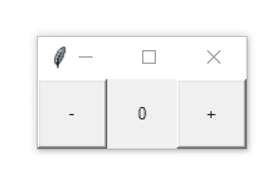](https://files.realpython.com/media/tk_counter_app.dccc1ac46c32.gif)

以下是完整的应用程序代码供您参考:


```py
import tkinter as tk

def increase():
    value = int(lbl_value["text"])
    lbl_value["text"] = f"{value + 1}"

def decrease():
    value = int(lbl_value["text"])
    lbl_value["text"] = f"{value - 1}"

window = tk.Tk()

window.rowconfigure(0, minsize=50, weight=1)
window.columnconfigure([0, 1, 2], minsize=50, weight=1)

btn_decrease = tk.Button(master=window, text="-", command=decrease)
btn_decrease.grid(row=0, column=0, sticky="nsew")

lbl_value = tk.Label(master=window, text="0")
lbl_value.grid(row=0, column=1)

btn_increase = tk.Button(master=window, text="+", command=increase)
btn_increase.grid(row=0, column=2, sticky="nsew")

window.mainloop()
```

这个应用程序不是特别有用，但是你在这里学到的技能适用于你将要制作的每个应用程序:

*   使用**小部件**创建用户界面的组件。
*   使用**几何图形管理器**控制应用的布局。
*   编写与各种组件交互的**事件处理程序**来捕获和转换用户输入。

在接下来的两节中，您将构建更有用的应用程序。首先，您将构建一个温度转换器，将温度值从华氏温度转换为摄氏温度。之后，您将构建一个可以打开、编辑和保存文本文件的文本编辑器！

### 检查你的理解能力

展开下面的代码块，做一个练习来检查您的理解:


写一个模拟滚动六面骰子的程序。应该有一个带有文本`Roll`的按钮。当用户点击按钮时，应该显示一个从`1`到`6`的随机整数。

**提示:**您可以使用 [`random`](https://realpython.com/python-random/#the-random-module) 模块中的`randint()`生成一个随机数。如果你不熟悉`random`模块，那么查看[在 Python 中生成随机数据(指南)](https://realpython.com/python-random/)了解更多信息。

应用程序窗口应该如下所示:

[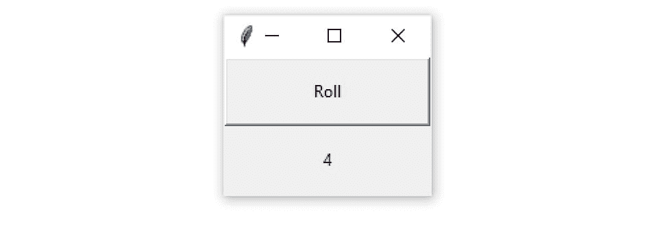](https://files.realpython.com/media/17_7_tk_exercise2_win10.924c5d1dfb03.jpg)

现在试试这个练习。

您可以展开下面的代码块来查看解决方案:


这里有一个可能的解决方案:

```py
import random
import tkinter as tk

def roll():
    lbl_result["text"] = str(random.randint(1, 6))

window = tk.Tk()
window.columnconfigure(0, minsize=150)
window.rowconfigure([0, 1], minsize=50)

btn_roll = tk.Button(text="Roll", command=roll)
lbl_result = tk.Label()

btn_roll.grid(row=0, column=0, sticky="nsew")
lbl_result.grid(row=1, column=0)

window.mainloop()
```

请记住，您的代码可能看起来不同。

当你准备好了，你可以进入下一部分。

## 构建温度转换器(示例应用程序)

在本节中，您将构建一个**温度转换器应用程序**，它允许用户以华氏度为单位输入温度，并按下按钮将该温度转换为摄氏度。您将一步一步地浏览代码。您还可以在本节末尾找到完整的源代码，以供参考。

**注意:**为了充分利用这一部分，请跟随一个 [Python shell](https://realpython.com/interacting-with-python/) 。

在你开始编码之前，你首先要设计应用程序。你需要三个要素:

1.  **`Entry` :** 一个名为`ent_temperature`的控件，用于输入华氏温度值
2.  **`Label` :** 显示摄氏温度结果的名为`lbl_result`的小部件
3.  **`Button` :** 一个名为`btn_convert`的小部件，它从`Entry`小部件中读取值，将其从华氏温度转换为摄氏温度，并将`Label`小部件的文本设置为单击时的结果

您可以将它们排列在一个网格中，每个小部件占一行一列。这让你得到一个最低限度工作的应用程序，但它不是非常用户友好的。所有东西都需要有**标签**。

您将直接在包含华氏符号(℧)的`ent_temperature`小部件的右侧放置一个标签，以便用户知道值`ent_temperature`应该是华氏温度。为此，将标签文本设置为`"\N{DEGREE FAHRENHEIT}"`，它使用 Python 命名的 [Unicode 字符支持](https://realpython.com/python-encodings-guide/)来显示华氏符号。

您可以通过将文本设置为值`"\N{RIGHTWARDS BLACK ARROW}"`来给`btn_convert`增加一点魅力，它会显示一个指向右边的黑色箭头。您还将确保`lbl_result`的标签文本`"\N{DEGREE CELSIUS}"`后面总是有摄氏符号(℃)，以表明结果是以摄氏度为单位的。这是最终窗口的样子:

[](https://files.realpython.com/media/17_8_tk_temp_converter_win10.8e1ebad492b9.jpg)

现在你已经知道了你需要什么样的小部件，以及这个窗口看起来会是什么样子，你可以开始编写代码了！首先，导入`tkinter`并创建一个新窗口:

```py
 1import tkinter as tk
 2
 3window = tk.Tk()
 4window.title("Temperature Converter")
 5window.resizable(width=False, height=False)
```

`window.title()`设置一个现有窗口的标题，而`window.resizable()`的两个参数都设置为`False`使窗口具有固定的大小。当您最终运行该应用程序时，窗口的标题栏中将会显示文本*温度转换器*。接下来，创建标签为`lbl_temp`的`ent_temperature`小部件，并将二者分配给名为`frm_entry`的`Frame`小部件:

```py
 5# ...
 6
 7frm_entry = tk.Frame(master=window)
 8ent_temperature = tk.Entry(master=frm_entry, width=10)
 9lbl_temp = tk.Label(master=frm_entry, text="\N{DEGREE FAHRENHEIT}")
```

用户将在`ent_temperature`中输入华氏温度值，`lbl_temp`用于给`ent_temperature`标注华氏温度符号。`frm_entry`集装箱将`ent_temperature`和`lbl_temp`组合在一起。

您希望将`lbl_temp`直接放在`ent_temperature`的右边。您可以使用具有一行两列的`.grid()`几何图形管理器在`frm_entry`中对它们进行布局:

```py
 9# ...
10
11ent_temperature.grid(row=0, column=0, sticky="e")
12lbl_temp.grid(row=0, column=1, sticky="w")
```

您已经为`ent_temperature`将`sticky`参数设置为`"e"`,这样它总是贴在它的网格单元的最右边。您还可以将`lbl_temp`的`sticky`设置为`"w"`，使其保持在网格单元的最左边。这确保了`lbl_temp`总是直接位于`ent_temperature`的右侧。

现在，使`btn_convert`和`lbl_result`转换输入到`ent_temperature`中的温度并显示结果:

```py
12# ...
13
14btn_convert = tk.Button(
15    master=window,
16    text="\N{RIGHTWARDS BLACK ARROW}"
17)
18lbl_result = tk.Label(master=window, text="\N{DEGREE CELSIUS}")
```

和`frm_entry`一样，`btn_convert`和`lbl_result`都被分配给`window`。这三个小部件共同构成了主应用程序网格中的三个单元。现在使用`.grid()`继续并布置它们:

```py
18# ...
19
20frm_entry.grid(row=0, column=0, padx=10)
21btn_convert.grid(row=0, column=1, pady=10)
22lbl_result.grid(row=0, column=2, padx=10)
```

最后，运行应用程序:

```py
22# ...
23
24window.mainloop()
```

看起来棒极了！但是这个按钮还不能做任何事情。在脚本文件的顶部，就在`import`行的下面，添加一个名为`fahrenheit_to_celsius()`的函数:

```py
 1import tkinter as tk
 2
 3def fahrenheit_to_celsius():
 4    """Convert the value for Fahrenheit to Celsius and insert the
 5 result into lbl_result.
 6 """
 7    fahrenheit = ent_temperature.get()
 8    celsius = (5 / 9) * (float(fahrenheit) - 32)
 9    lbl_result["text"] = f"{round(celsius, 2)}  \N{DEGREE CELSIUS}"
10
11# ...
```

该函数从`ent_temperature`中读取数值，将其从华氏温度转换为摄氏温度，然后在`lbl_result`中显示结果。

现在转到定义`btn_convert`的那一行，将其`command`参数设置为`fahrenheit_to_celsius`:

```py
20# ...
21
22btn_convert = tk.Button(
23    master=window,
24    text="\N{RIGHTWARDS BLACK ARROW}",
25    command=fahrenheit_to_celsius  # <--- Add this line 26)
27
28# ...
```

就是这样！您只用了 26 行代码就创建了一个功能齐全的温度转换器应用程序！很酷，对吧？

您可以展开下面的代码块来查看完整的脚本:


以下是完整的脚本供您参考:

```py
import tkinter as tk

def fahrenheit_to_celsius():
    """Convert the value for Fahrenheit to Celsius and insert the
 result into lbl_result.
 """
    fahrenheit = ent_temperature.get()
    celsius = (5 / 9) * (float(fahrenheit) - 32)
    lbl_result["text"] = f"{round(celsius, 2)}  \N{DEGREE CELSIUS}"

# Set up the window
window = tk.Tk()
window.title("Temperature Converter")
window.resizable(width=False, height=False)

# Create the Fahrenheit entry frame with an Entry
# widget and label in it
frm_entry = tk.Frame(master=window)
ent_temperature = tk.Entry(master=frm_entry, width=10)
lbl_temp = tk.Label(master=frm_entry, text="\N{DEGREE FAHRENHEIT}")

# Layout the temperature Entry and Label in frm_entry
# using the .grid() geometry manager
ent_temperature.grid(row=0, column=0, sticky="e")
lbl_temp.grid(row=0, column=1, sticky="w")

# Create the conversion Button and result display Label
btn_convert = tk.Button(
    master=window,
    text="\N{RIGHTWARDS BLACK ARROW}",
    command=fahrenheit_to_celsius
)
lbl_result = tk.Label(master=window, text="\N{DEGREE CELSIUS}")

# Set up the layout using the .grid() geometry manager
frm_entry.grid(row=0, column=0, padx=10)
btn_convert.grid(row=0, column=1, pady=10)
lbl_result.grid(row=0, column=2, padx=10)

# Run the application
window.mainloop()
```

是时候让事情更上一层楼了！请继续阅读，了解如何构建文本编辑器。

## 构建文本编辑器(示例应用程序)

在本节中，您将构建一个能够创建、打开、编辑和保存文本文件的**文本编辑器应用程序**。该应用程序有三个基本要素:

1.  名为`btn_open`的`Button`小部件，用于打开文件进行编辑
2.  用于保存文件的名为`btn_save`的`Button`小部件
3.  名为`txt_edit`的`TextBox`小部件，用于创建和编辑文本文件

这三个小部件的排列方式是，两个按钮在窗口的左侧，文本框在右侧。整个窗口的最小高度应该是 800 像素，`txt_edit`的最小宽度应该是 800 像素。整个布局应该是响应性的，这样如果窗口被调整大小，那么`txt_edit`也被调整大小。然而，容纳按钮的框架的宽度不应该改变。

这是窗户外观的草图:

[](https://files.realpython.com/media/rsz_17_9_tk_sketch4c44ff377f03.06ff19dd59cf.jpg)

您可以使用`.grid()`几何图形管理器实现所需的布局。布局包含单行和两列:

1.  **按钮左边的窄栏**
2.  **文本框右侧的宽栏**

要设置窗口和`txt_edit`的最小尺寸，您可以将窗口方法`.rowconfigure()`和`.columnconfigure()`的`minsize`参数设置为`800`。为了处理调整大小，您可以将这些方法的`weight`参数设置为`1`。

为了将两个按钮放在同一列中，您需要创建一个名为`frm_buttons`的`Frame`小部件。根据草图，这两个按钮应该垂直堆叠在这个框架内，顶部是`btn_open`。你可以用`.grid()`或`.pack()`几何图形管理器来完成。现在，您将坚持使用`.grid()`，因为它更容易使用。

既然有了计划，就可以开始编写应用程序了。第一步是创建您需要的所有小部件:

```py
 1import tkinter as tk
 2
 3window = tk.Tk()
 4window.title("Simple Text Editor")
 5
 6window.rowconfigure(0, minsize=800, weight=1)
 7window.columnconfigure(1, minsize=800, weight=1)
 8
 9txt_edit = tk.Text(window)
10frm_buttons = tk.Frame(window, relief=tk.RAISED, bd=2)
11btn_open = tk.Button(frm_buttons, text="Open")
12btn_save = tk.Button(frm_buttons, text="Save As...")
```

下面是这段代码的分类:

*   **1 号线**进口`tkinter`。
*   第 3 行和第 4 行创建一个标题为`"Simple Text Editor"`的新窗口。
*   **第 6 行和第 7 行**设置行和列配置。
*   第 9 行到第 12 行创建文本框、框架、打开和保存按钮所需的四个部件。

仔细看看第 6 行。`.rowconfigure()`的`minsize`参数设置为`800`，`weight`设置为`1`:

```py
window.rowconfigure(0, minsize=800, weight=1)
```

第一个参数是`0`，它将第一行的高度设置为`800`像素，并确保行的高度与窗口的高度成比例增长。应用程序布局中只有一行，因此这些设置适用于整个窗口。

让我们再仔细看看第 7 行。这里，您使用`.columnconfigure()`将索引为`1`的列的`width`和`weight`属性分别设置为`800`和`1`:

```py
window.columnconfigure(1, minsize=800, weight=1)
```

记住，行和列的索引是从零开始的，所以这些设置只适用于第二列。通过只配置第二列，当调整窗口大小时，文本框将自然地扩展和收缩，而包含按钮的列将保持固定的宽度。

现在，您可以处理应用程序布局了。首先，使用`.grid()`几何管理器将两个按钮分配给`frm_buttons`帧:

```py
12# ...
13
14btn_open.grid(row=0, column=0, sticky="ew", padx=5, pady=5)
15btn_save.grid(row=1, column=0, sticky="ew", padx=5)
```

这两行代码**在`frm_buttons`帧中创建了一个具有两行一列的网格**，因为`btn_open`和`btn_save`都将其`master`属性设置为`frm_buttons`。`btn_open`放在第一行，`btn_save`放在第二行，这样`btn_open`就出现在布局图中`btn_save`的上方，就像你在草图中计划的那样。

`btn_open`和`btn_save`都将它们的`sticky`属性设置为`"ew"`，这迫使按钮的**向两个方向水平扩展**并填充整个框架。这确保了两个按钮大小相同。

通过将`padx`和`pady`参数设置为`5`，在每个按钮周围放置五个像素的**填充**。只有`btn_open`有垂直填充。因为它在顶部，垂直填充从窗口顶部向下偏移按钮一点，并确保它和`btn_save`之间有一个小间隙。

现在`frm_buttons`已经布置好了，可以开始为窗口的其余部分设置网格布局了:

```py
15# ...
16
17frm_buttons.grid(row=0, column=0, sticky="ns")
18txt_edit.grid(row=0, column=1, sticky="nsew")
```

这两行代码**为`window`创建了一个一行两列的网格**。您将`frm_buttons`放在第一列，将`txt_edit`放在第二列，这样`frm_buttons`就会出现在窗口布局中`txt_edit`的左边。

`frm_buttons`的`sticky`参数设置为`"ns"`，强制整个框架**垂直扩展**并填充其列的整个高度。`txt_edit`填充其整个网格单元，因为您将其`sticky`参数设置为`"nsew"`，这迫使其**向每个方向**扩展。

现在应用程序布局已经完成，将`window.mainloop()`添加到程序底部，保存并运行文件:

```py
18# ...
19
20window.mainloop()
```

将显示以下窗口:

[](https://files.realpython.com/media/17_9_tk_text_editor_win10.9182347f4b5d.jpg)

看起来棒极了！但是它现在还不能做任何事情，所以您需要开始编写按钮的命令。`btn_open`需要显示一个**文件打开对话框**，允许用户选择一个文件。然后需要[打开文件](https://realpython.com/working-with-files-in-python/)并将`txt_edit`的文本设置为文件的内容。这里有一个`open_file()`函数可以做到这一点:

```py
 1import tkinter as tk
 2
 3def open_file():
 4    """Open a file for editing."""
 5    filepath = askopenfilename(
 6        filetypes=[("Text Files", "*.txt"), ("All Files", "*.*")]
 7    )
 8    if not filepath:
 9        return
10    txt_edit.delete("1.0", tk.END)
11    with open(filepath, mode="r", encoding="utf-8") as input_file:
12        text = input_file.read()
13        txt_edit.insert(tk.END, text)
14    window.title(f"Simple Text Editor - {filepath}")
15
16# ...
```

下面是这个函数的分解:

*   **第 5 行到第 7 行**使用`tkinter.filedialog`模块的`askopenfilename()`对话框显示一个文件打开对话框，并将选择的文件路径保存到`filepath`。
*   **第 8 行和第 9 行**检查用户是否关闭对话框或点击*取消*按钮。如果是，那么`filepath`将是`None`，并且函数将`return`而不执行任何代码来读取文件和设置`txt_edit`的文本。
*   **第 10 行**使用`.delete()`清除`txt_edit`的当前内容。
*   **第 11 行和第 12 行**在将`text`存储为字符串之前，打开所选文件及其内容`.read()`。
*   **第 13 行**使用`.insert()`将字符串`text`分配给`txt_edit`。
*   **第 14 行**设置窗口的标题，使其包含打开文件的路径。

现在你可以更新程序，这样每当点击时`btn_open`就会调用`open_file()`。你需要做一些事情来更新程序。首先，通过将下面的导入添加到程序的顶部，从`tkinter.filedialog`导入`askopenfilename()`:

```py
 1import tkinter as tk
 2from tkinter.filedialog import askopenfilename 3
 4# ...
```

接下来，将`btn_opn`的`command`属性设置为`open_file`:

```py
 1import tkinter as tk
 2from tkinter.filedialog import askopenfilename
 3
 4def open_file():
 5    """Open a file for editing."""
 6    filepath = askopenfilename(
 7        filetypes=[("Text Files", "*.txt"), ("All Files", "*.*")]
 8    )
 9    if not filepath:
10        return
11    txt_edit.delete("1.0", tk.END)
12    with open(filepath, mode="r", encoding="utf-8") as input_file:
13        text = input_file.read()
14        txt_edit.insert(tk.END, text)
15    window.title(f"Simple Text Editor - {filepath}")
16
17window = tk.Tk()
18window.title("Simple Text Editor")
19
20window.rowconfigure(0, minsize=800, weight=1)
21window.columnconfigure(1, minsize=800, weight=1)
22
23txt_edit = tk.Text(window)
24frm_buttons = tk.Frame(window, relief=tk.RAISED, bd=2)
25btn_open = tk.Button(frm_buttons, text="Open", command=open_file) 26btn_save = tk.Button(frm_buttons, text="Save As...")
27
28# ...
```

保存文件并运行它以检查一切是否正常。然后尝试打开一个文本文件！

随着`btn_open`的运行，是时候为`btn_save`运行函数了。这需要打开一个**保存文件对话框**，以便用户可以选择他们想要保存文件的位置。为此，您将使用`tkinter.filedialog`模块中的`asksaveasfilename()`对话框。该函数还需要提取当前在`txt_edit`中的文本，并将其写入选定位置的文件中。这里有一个函数可以做到这一点:

```py
15# ...
16
17def save_file():
18    """Save the current file as a new file."""
19    filepath = asksaveasfilename(
20        defaultextension=".txt",
21        filetypes=[("Text Files", "*.txt"), ("All Files", "*.*")],
22    )
23    if not filepath:
24        return
25    with open(filepath, mode="w", encoding="utf-8") as output_file:
26        text = txt_edit.get("1.0", tk.END)
27        output_file.write(text)
28    window.title(f"Simple Text Editor - {filepath}")
29
30# ...
```

下面是这段代码的工作原理:

*   **第 19 行到第 22 行**使用`asksaveasfilename()`对话框从用户处获取所需的保存位置。选择的文件路径存储在`filepath`变量中。
*   **第 23 和 24 行**检查用户是否关闭对话框或点击*取消*按钮。如果是，那么`filepath`将是`None`，并且函数将返回，而不执行任何代码来将文本保存到文件中。
*   在选定的文件路径创建一个新文件。
*   **第 26 行**用`.get()`方法从`txt_edit`中提取文本并赋给变量`text`。
*   第 27 行将`text`写入输出文件。
*   **第 28 行**更新窗口标题，这样新的文件路径显示在窗口标题中。

现在你可以更新程序，这样当它被点击时,`btn_save`会调用`save_file()`。同样，为了更新程序，您需要做一些事情。首先，通过更新脚本顶部的导入，从`tkinter.filedialog`导入`asksaveasfilename()`，如下所示:

```py
 1import tkinter as tk
 2from tkinter.filedialog import askopenfilename, asksaveasfilename 3
 4# ...
```

最后，将`btn_save`的`command`属性设置为`save_file`:

```py
28# ...
29
30window = tk.Tk()
31window.title("Simple Text Editor")
32
33window.rowconfigure(0, minsize=800, weight=1)
34window.columnconfigure(1, minsize=800, weight=1)
35
36txt_edit = tk.Text(window)
37frm_buttons = tk.Frame(window, relief=tk.RAISED, bd=2)
38btn_open = tk.Button(frm_buttons, text="Open", command=open_file)
39btn_save = tk.Button(frm_buttons, text="Save As...", command=save_file) 40
41btn_open.grid(row=0, column=0, sticky="ew", padx=5, pady=5)
42btn_save.grid(row=1, column=0, sticky="ew", padx=5)
43
44frm_buttons.grid(row=0, column=0, sticky="ns")
45txt_edit.grid(row=0, column=1, sticky="nsew")
46
47window.mainloop()
```

保存文件并运行它。您现在已经有了一个最小但功能齐全的文本编辑器！

您可以展开下面的代码块来查看完整的脚本:


以下是完整的脚本供您参考:

```py
import tkinter as tk
from tkinter.filedialog import askopenfilename, asksaveasfilename

def open_file():
    """Open a file for editing."""
    filepath = askopenfilename(
        filetypes=[("Text Files", "*.txt"), ("All Files", "*.*")]
    )
    if not filepath:
        return
    txt_edit.delete("1.0", tk.END)
    with open(filepath, mode="r", encoding="utf-8") as input_file:
        text = input_file.read()
        txt_edit.insert(tk.END, text)
    window.title(f"Simple Text Editor - {filepath}")

def save_file():
    """Save the current file as a new file."""
    filepath = asksaveasfilename(
        defaultextension=".txt",
        filetypes=[("Text Files", "*.txt"), ("All Files", "*.*")],
    )
    if not filepath:
        return
    with open(filepath, mode="w", encoding="utf-8") as output_file:
        text = txt_edit.get("1.0", tk.END)
        output_file.write(text)
    window.title(f"Simple Text Editor - {filepath}")

window = tk.Tk()
window.title("Simple Text Editor")

window.rowconfigure(0, minsize=800, weight=1)
window.columnconfigure(1, minsize=800, weight=1)

txt_edit = tk.Text(window)
frm_buttons = tk.Frame(window, relief=tk.RAISED, bd=2)
btn_open = tk.Button(frm_buttons, text="Open", command=open_file)
btn_save = tk.Button(frm_buttons, text="Save As...", command=save_file)

btn_open.grid(row=0, column=0, sticky="ew", padx=5, pady=5)
btn_save.grid(row=1, column=0, sticky="ew", padx=5)

frm_buttons.grid(row=0, column=0, sticky="ns")
txt_edit.grid(row=0, column=1, sticky="nsew")

window.mainloop()
```

现在，您已经用 Python 构建了两个 GUI 应用程序，并应用了您在本教程中学到的许多技能。这是一个不小的成就，所以花些时间为你所做的感到高兴。您现在已经准备好自己处理一些应用程序了！

## 结论

在本教程中，您学习了如何开始 Python GUI 编程。对于 Python GUI 框架来说，Tkinter 是一个令人信服的选择，因为它内置于 Python 标准库中，并且使用该框架制作应用程序相对来说不太费力。

在本教程中，您已经学习了几个重要的 Tkinter 概念:

*   如何使用**小工具**
*   如何用**几何图形管理器**控制你的应用布局
*   如何让您的应用程序**具有交互性**
*   如何使用五个基本的 Tkinter**widget**:`Label`、`Button`、`Entry`、`Text`、`Frame`

现在您已经掌握了使用 Tkinter 进行 Python GUI 编程的基础，下一步是构建一些您自己的应用程序。你会创造什么？在下面的评论中分享你有趣的项目吧！

## 额外资源

在本教程中，您仅仅触及了使用 Tkinter 创建 Python GUI 应用程序的基础。还有许多其他主题没有在这里介绍。在本节中，您将找到一些可帮助您继续旅程的最佳资源。

**t 内部引用**

这里有一些官方资源可供参考:

*   [官方 Python Tkinter 参考文档](https://docs.python.org/3/library/tkinter.html)以中等深度介绍了 Python 的 Tkinter 模块。它是为更高级的 Python 开发人员编写的，并不是初学者的最佳资源。
*   Tkinter 8.5 参考:Python 的 GUI 是一个广泛的参考，涵盖了 Tkinter 模块的大部分。它是详尽的，但它是以参考风格编写的，没有评论或例子。
*   [Tk 命令](https://www.tcl.tk/man/tcl/TkCmd/contents.htm)参考是 Tk 库中命令的权威指南。它是为 Tcl 语言编写的，但它回答了许多关于为什么 Tkinter 中的事情会这样工作的问题。

**附加部件**

在本教程中，您学习了`Label`、`Button`、`Entry`、`Text`和`Frame`小部件。Tkinter 中还有其他几个小部件，它们对于构建真实世界的应用程序都是必不可少的。以下是一些继续学习小部件的资源:

*   TkDocs Tkinter 教程是一个相当全面的 Tk 指南，Tkinter 使用的底层代码库。用 Python、Ruby、Perl 和 Tcl 给出了例子。除了这两个部分中介绍的以外，您还可以找到几个小部件示例:
    *   [基本小部件](https://tkdocs.com/tutorial/widgets.html)涵盖了与本教程相同的小部件，还增加了一些。
    *   [更多小部件](https://tkdocs.com/tutorial/morewidgets.html)包括几个附加的小部件。
*   官方 Python 文档涵盖了额外的小部件:
    *   [ttk 主题微件](https://docs.python.org/3/library/tkinter.ttk.html)涵盖了 tk 主题微件集。
    *   [滚动文本部件](https://docs.python.org/3/library/tkinter.scrolledtext.html)详细描述了一个与垂直滚动条结合的`Text`部件。

**应用分布**

一旦你用 Tkinter 创建了一个应用程序，你可能想把它分发给你的同事和朋友。这里有一些教程可以帮助你完成这个过程:

*   [使用 PyInstaller 轻松发布 Python 应用](https://realpython.com/pyinstaller-python/)
*   [4 次尝试将 Python 打包成可执行文件](https://tryexceptpass.org/article/package-python-as-executable/)
*   [用 PyOxidizer 构建独立的 Python 应用](https://gregoryszorc.com/blog/2019/06/24/building-standalone-python-applications-with-pyoxidizer/)

**其他 GUI 框架**

Tkinter 不是 Python GUI 框架的唯一选择。如果 Tkinter 不能满足您项目的需求，那么这里有一些其他的框架可以考虑:

*   [如何用 wxPython 构建 Python GUI 应用](https://realpython.com/python-gui-with-wxpython/)
*   [Python 和 PyQt:构建 GUI 桌面计算器](https://realpython.com/python-pyqt-gui-calculator/)
*   [使用 Kivy Python 框架构建移动应用](https://realpython.com/mobile-app-kivy-python/)
*   PySimpleGUI:用 Python 创建 GUI 的简单方法

***参加测验:****通过我们的交互式“使用 Tkinter 进行 Python GUI 编程”测验来测试您的知识。完成后，您将收到一个分数，以便您可以跟踪一段时间内的学习进度:*

*[参加测验](/quizzes/python-gui-programming-with-tkinter/)************