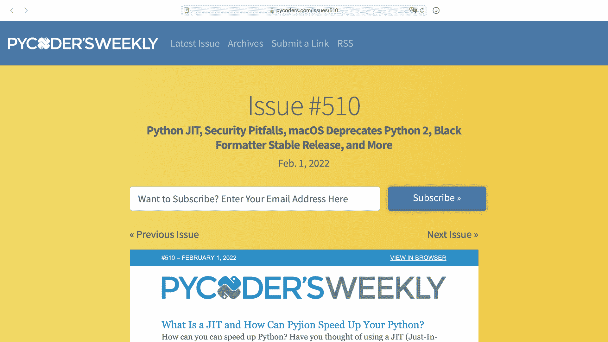
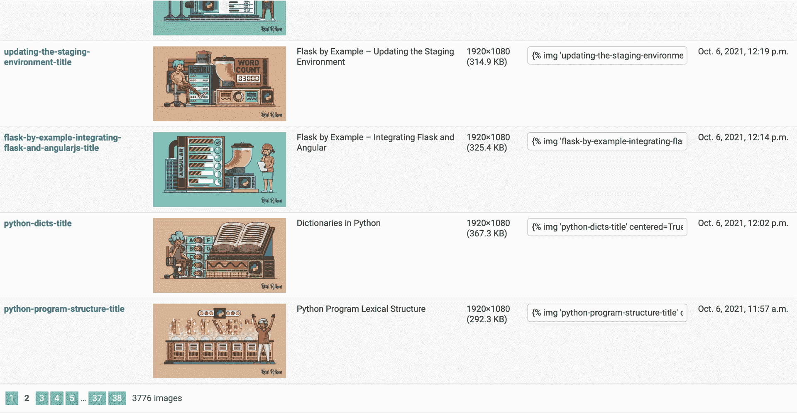
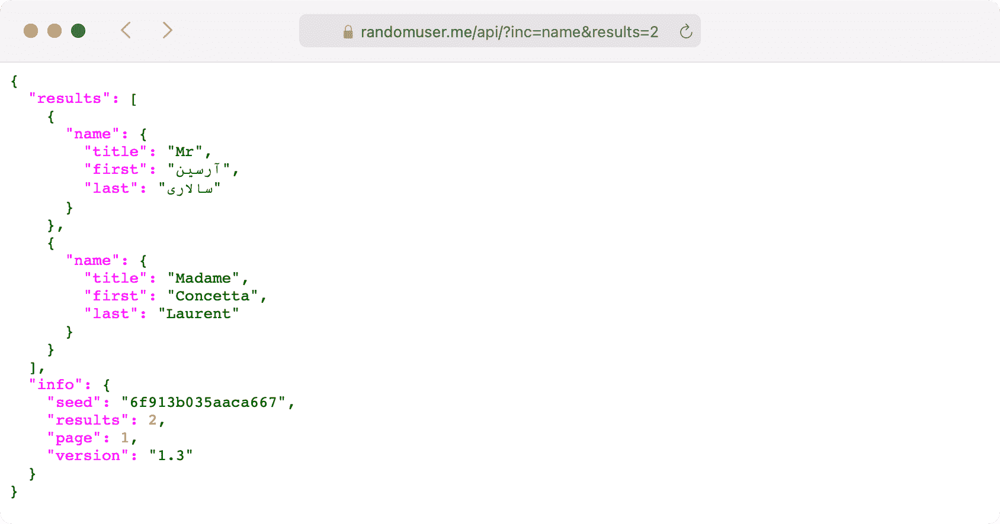
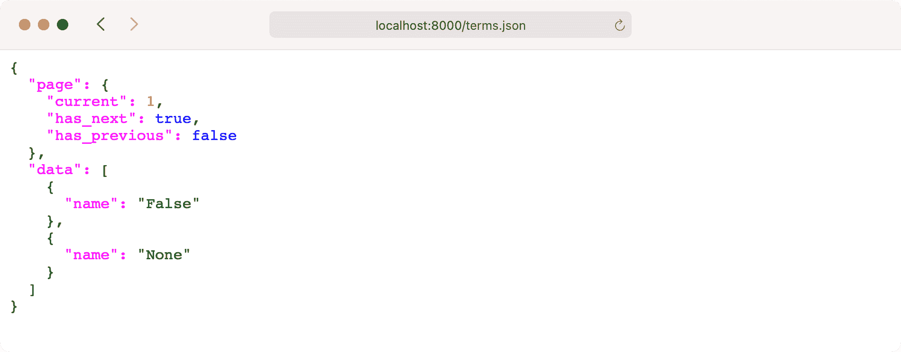
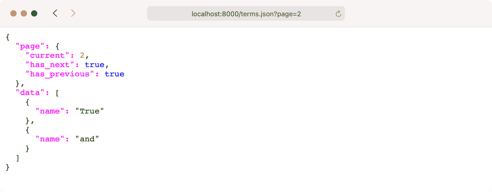
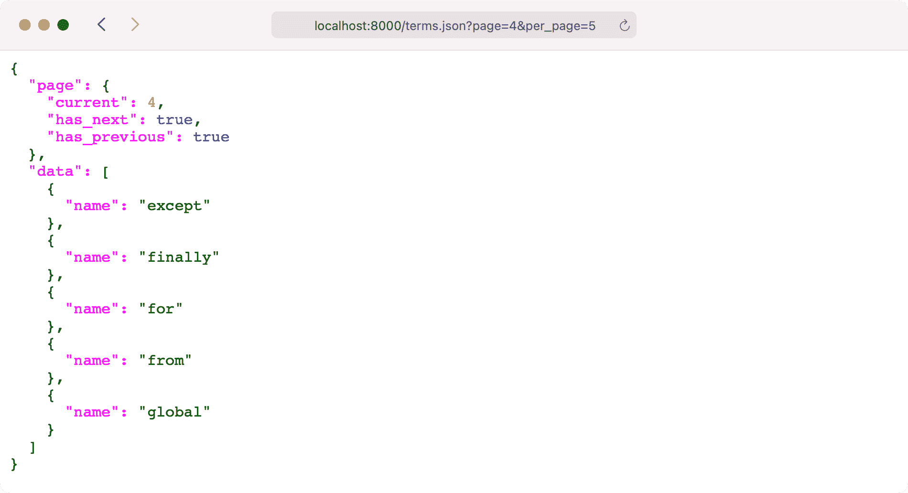

# 一个用户友好的 Django 应用程序的分页

> 原文:[https://realython . com/django-page/](https://realpython.com/django-pagination/)

通过将内容分散到多个页面，而不是一次提供所有内容，您可以显著改善 Django web 应用程序的用户体验。这种做法被称为**分页**。要实现分页，您必须考虑页数、每页的项目以及页面的顺序。

但是如果你在你的网络项目中使用 Django，你很幸运！Django 内置了分页功能。只需几个配置步骤，您就可以向用户提供分页的内容。

**在本教程中，您将学习如何:**

*   决定何时使用 Django 的分页器
*   在**基于类的视图**中实现分页
*   在**基于功能的视图**中实现分页
*   将**分页元素**添加到模板
*   使用**分页的 URL**直接浏览页面
*   将 Django 分页与 **JavaScript 调用**结合起来

本教程面向具有基本 Django 经验的中级 Python 程序员。理想情况下，您已经完成了一些入门教程，或者创建了自己的较小的 Django 项目。为了更好地体验本教程，您应该知道什么是模型、视图和模板，以及如何创建它们。如果你需要复习，那么看看如何用 Django 构建一个作品集应用的教程。

**获取源代码:** [单击此处获取您将用于实现 Django 分页的源代码](https://realpython.com/bonus/django-pagination-source-code/)。

## 野外分页

在尝试用 Django 构建自己的分页流之前，有必要四处看看分页的运行情况。分页在较大的网站上非常常见，以至于你在浏览互联网时很可能以这样或那样的形式经历过。

[*Remove ads*](/account/join/)

### *什么是分页*

 *分页描述了将网站内容分布在多个连续页面上，而不是在单个页面上提供的做法。如果您访问购物网站、博客或档案馆，您很可能会遇到分页的内容。

在 [GitHub](https://realpython.com/python-git-github-intro/) 上，你会在 [Django 的拉取请求](https://github.com/django/django/pulls?q=)页面上找到分页的内容。当您到达页面底部时，您可以导航到其他页面:


想象一下，如果所有页码都显示出来，页面底部会有多拥挤。更重要的是，考虑一下如果所有的问题都一次显示，而不是分散在 615 页上，加载页面需要多长时间。

你甚至可以说没有必要有页码。谁能知道哪一期在哪一页？出于这个原因，一些网站完全抛弃了页码，给你一个压缩形式的分页。

PyCoder 的每周简讯用*上一页*和*下一页*按钮对其档案进行分页。这种分页使您可以方便地浏览所有时事通讯:

[](https://files.realpython.com/media/django-pagination_example_pycoders-weekly.8ade2116237d.png)

在 *Subscribe* 按钮下面，您可以看到用于导航到上一期和下一期的分页控件。多亏了这种分页技术，你可以从一期时事通讯跳到另一期，而不是一期一期地从档案中选择。

当您的 [Django admin](https://realpython.com/customize-django-admin-python/) 接口中有超过 100 个对象时，您也可以看到分页在起作用。要访问更多内容，您必须单击另一个页码:

[](https://files.realpython.com/media/django-pagination_example_django-admin.8ab6cabab559.png)

Django 管理员没有显示所有 3776 个项目的列表，而是将内容分成 38 页。再次想象一下，如果所有的内容都呈现在一个巨大的表格中，Django 管理界面将会是多么的强大！

但是分页不仅仅用在网站的前端设计中。将 **API 响应**的内容分页也很常见。[随机用户 API](https://randomuser.me/) 是众多[REST API](https://realpython.com/api-integration-in-python/)中的一个，它为您提供了对响应进行分页的选项:

[](https://files.realpython.com/media/django-pagination-example-api.d53b6cf601d2.png)

通过添加一个`results=2`参数，您告诉随机用户 API，您只希望每个响应有两个结果。使用`page`参数，您可以导航到这些分页响应的特定页面。

**注:**你有什么有趣的使用分页的网站或者 API 的例子吗？在下面的评论中分享给社区吧！

一旦您知道什么是分页，您可能会在网上冲浪时经常注意到它。考虑在项目中实现分页时，有必要仔细研究一下什么时候使用分页，什么时候不使用分页。

### 何时使用分页

分页是将内容分成小块的好方法。上面的例子强调了这在互联网上是一种常见的做法。这是理所当然的，因为对内容进行分页有很多好处:

*   一次发送较少的内容会加快页面加载速度。
*   设置内容子集可以清理网站的用户界面。
*   你的内容更容易掌握。
*   你的访问者不必没完没了地滚动才能到达你网站的页脚。
*   当您没有一次发送所有数据时，您会减少服务器的请求负载。
*   您减少了从数据库中检索的项目数量。

分页有助于构建网站的内容，并且可以提高网站的性能。尽管如此，对内容进行分页并不总是最好的选择。有些情况下，最好不要对内容进行分页。请继续阅读，了解何时不使用分页会更好。

[*Remove ads*](/account/join/)

### *何时不使用分页*

 *使用分页有很多好处。但并不总是最好的选择。根据您的用例，您可能想决定不在您的用户界面中使用分页。您应该考虑分页的潜在缺点:

*   你打断了用户的连续阅读。
*   你的用户必须浏览结果。
*   查看更多内容需要加载新的页面。
*   如果页面太多，那么浏览起来会变得笨拙。
*   这会降低用户的速度，所以阅读需要更多的时间。
*   在分页数据中查找特定内容可能会更加困难。
*   在页面之间来回比较信息很麻烦。

有了一长串的好处和同样长的缺点，您可能想知道什么时候应该使用分页。通常，这取决于您想要提供的内容数量和用户体验。

这里有两个问题，你可以问自己，以帮助决定是否应该使用分页:

1.  你的网站上有足够的内容来证明分页的合理性吗？
2.  分页能改善你的网站的用户体验吗？

如果您仍然犹豫不决，那么用 Django 实现分页的便利可能是一个令人信服的理由。在下一节中，您将了解 Django 的内置`Paginator`类是如何工作的。

## Django 的内置分页器

Django 内置了一个 [`Paginator`类](https://docs.djangoproject.com/en/4.0/ref/paginator/)，可以随时使用。也许您有一个正在进行的项目，并且您希望以您的应用程序为基础，在下面的部分中尝试分页实现。没问题！但是，如果您想了解本教程中的分步代码示例，那么您可以从 Real Python materials repository 下载 Django Python wiki 项目的源代码:

**获取源代码:** [单击此处获取您将用于实现 Django 分页的源代码](https://realpython.com/bonus/django-pagination-source-code/)。

这个 wiki 项目包含一个名为`terms`的应用。目前，该应用程序的唯一目的是显示所有的 [Python 关键字](https://realpython.com/python-keywords/)。在下一节中，您将对这个示例项目有一个简短的概述，它将作为本教程中分页的基础。如果您想在不使用提供的示例项目的情况下学习 Django 分页的一般概念，那么您可以跳到[在 Django Shell](#exploring-the-django-paginator-in-the-django-shell) 中探索 Django 分页器。

### 准备您的示例 Django 项目

本教程中的分页示例将适用于任何 Django 项目。但是出于本教程的目的，您将在 Python wiki 中工作。为了让您能够密切关注，值得从上面的链接下载 Python wiki Django 示例项目。要设置 Python wiki 项目，首先要遵循附带的`README.md`文件中的说明。

Python wiki 示例项目包含一个名为`terms`的应用程序，它包含一个`Keyword`模型:

```py
 1# terms/models.py
 2
 3from django.db import models
 4
 5class Keyword(models.Model):
 6    name = models.CharField(max_length=30)
 7
 8    def __str__(self):
 9        return self.name
```

`Keyword`模型仅由`name`字符字段组成。默认情况下，主键为`1`的`Keyword`实例的[字符串表示为`Keyword object (1)`。添加`.__str__()`方法时，显示的是`Keyword`的名称。](https://realpython.com/operator-function-overloading/#printing-your-objects-prettily-using-str)

Python wiki 项目已经包含了**迁移**文件。要使用您的数据库，您必须运行项目的[迁移](https://realpython.com/django-migrations-a-primer/)。从下面选择您的操作系统，并相应地使用特定于平台的命令:

*   [*视窗*](#windows-1)
**   [**Linux + macOS**](#linux-macos-1)*

```py
(venv) C:\> python manage.py migrate
```

```py
(venv) $ python manage.py migrate
```

在应用了所有迁移之后，您的数据库包含了 Django 项目所需的表。有了数据库表，您就可以开始添加内容了。要用所有 [Python 关键字](https://docs.python.org/3.10/reference/lexical_analysis.html#keywords)的列表填充项目的数据库，进入 Django 项目的文件夹并启动 **Django shell** :

*   [*视窗*](#windows-2)
**   [**Linux + macOS**](#linux-macos-2)*

```py
(venv) C:\> python manage.py shell
```

```py
(venv) $ python manage.py shell
```

使用 [Django shell](https://docs.djangoproject.com/en/4.0/ref/django-admin/#shell) 是与您的 Django 项目进行交互的一种很好的方式。您可以方便地尝试代码片段并连接到后端，而无需前端。在这里，您以编程方式向数据库添加项目:

>>>

```py
 1>>> import keyword
 2>>> from terms.models import Keyword
 3>>> for kw in keyword.kwlist:
 4...     k = Keyword(name=kw)
 5...     k.save()
 6...
```

首先，在第 1 行中导入 Python 内置的 [`keyword`模块](https://docs.python.org/3/library/keyword.html)。之后，您从`terms`应用程序导入`Keyword`模型。在第 3 行，您遍历 Python 的关键字列表。最后，使用关键字 string 创建一个`Keyword`类实例，并将其保存到数据库中。

**注意:**上面代码块中的**变量**名称相似，很难读懂。这对于在[交互式解释器](https://realpython.com/interacting-with-python/)中的较小任务来说是可以接受的。当你想写持久的 Python 代码时，考虑更好的[变量名](https://realpython.com/python-variables/)是个好主意。

要验证您的数据库是否包含 Python 关键字，请在 Django shell 中列出它们:

>>>

```py
>>> from terms.models import Keyword
>>> Keyword.objects.all()
<QuerySet [<Keyword: False>, <Keyword: None>, <Keyword: True>, ... ]>
```

当您从您的`terms`应用程序导入`Keyword`模型时，您可以列出您的**数据库**中的所有项目。数据库条目都是 35 个 Python 关键字，按照它们被添加到数据库的顺序排列。

您的 Python wiki 项目还包含一个基于类的视图,在一个页面上显示所有的关键字:

```py
# terms/views.py

from django.views.generic import ListView
from terms.models import Keyword

class AllKeywordsView(ListView):
    model = Keyword
    template_name = "terms/base.html"
```

该视图返回`Keyword`模型的所有数据库条目。作为 Django 的泛型`ListView`的子类，它需要一个名为`keyword_list.html`的模板。然而，通过将`.template_name`属性设置为`"terms/base.html"`，您告诉 Django 去寻找基础模板。您将在本教程中发现的其他 Django 模板将扩展上面显示的`base.html`模板。

**注意:**如果您想密切关注，请确保您没有跳过上述填充数据库的步骤。

一旦样例项目就绪，就可以运行 Django 的内置 web 服务器了:

*   [*视窗*](#windows-3)
**   [**Linux + macOS**](#linux-macos-3)*

```py
(venv) C:\> python manage.py runserver
```

```py
(venv) $ python manage.py runserver
```

当您的开发 web 服务器正在运行时，请访问`http://localhost:8000/all`。该页面在一个连续的列表中显示所有 Python 关键字。稍后，您将在 Django 的`Paginator`类的帮助下创建视图来对这个列表进行分页。继续阅读，了解 Django 分页器是如何工作的。

[*Remove ads*](/account/join/)

### *探索 Django Shell 中的 Django 分页器*

 *在详细查看 Django 分页器之前，请确保已经填充了数据库并进入了 Django shell，如前一节所示。

Django shell 非常适合在不添加代码的情况下尝试命令。如果您还没有，请从导入`Keyword`模型开始:

>>>

```py
>>> from terms.models import Keyword
>>> from django.core.paginator import Paginator
>>> keywords = Keyword.objects.all().order_by("name")
>>> paginator = Paginator(keywords, per_page=2)
```

首先，导入`Paginator`类。然后为 Django 查询集创建一个名为`keywords`的变量。因为您没有过滤查询集，`keywords`将包含您在上一节中列出的所有 Python 关键字。记住 Django 的`QuerySets`很懒:

> 创建`QuerySet`的行为不涉及任何数据库活动。您可以整天将过滤器堆叠在一起，Django 不会真正运行查询，直到对`QuerySet`求值。([来源](https://docs.djangoproject.com/en/4.0/topics/db/queries/#querysets-are-lazy)

在上面的示例中，您为数据库表中的所有项目创建了一个查询集。因此，当您在某个时候用 Django 的分页器访问数据库时，您请求的是数据库内容的子集。这样，当您需要从数据库中提供大量数据时，分页可以极大地提高 Django 应用程序的速度。

**注意:**分页只有在数据库主动处理时才有意义。如果只在后端进行内存分页，那么并不能解决查询数据库的瓶颈。

内置的 Django `Paginator`类通知请求哪个页面以及从数据库中获取多少行。根据你使用的数据库管理系统的不同，它会翻译成稍微不同的 SQL 方言。

严格地说，数据库进行分页，Django 只请求一个页码和偏移量。Python 和 MySQL 数据库教程向您介绍了构建数据库密集型应用程序的最佳实践。

向**查询集**添加一些排序也很重要。当你按`name`对你的 Python 关键词排序时，你将按字母顺序接收它们。否则，您可能会在`keywords`列表中得到不一致的结果。

当初始化您的`Paginator`类时，您将`keywords`作为第一个**参数**传入。作为第二个参数，您必须添加一个[整数](https://realpython.com/python-numbers/)，它定义了您希望在一个页面上显示多少个项目。在这种情况下，是两个。这意味着您希望每页显示两个项目。

Django `Paginator`类接受四个参数。其中两个是必需的:

| 争吵 | 需要 | 说明 |
| --- | --- | --- |
| `object_list` | 981 号房 | 通常是一个 [Django QuerySet](https://docs.djangoproject.com/en/4.0/ref/models/querysets/) ，但是它可以是任何具有`.count()`或`.__len__()`方法的可切片对象，比如一个[列表或一个元组](https://realpython.com/python-lists-tuples/)。 |
| `per_page` | 981 号房 | 定义要在每页上显示的项目数。 |
| `orphans` |  | 声明您在最后一页上允许的最小项目数。如果最后一页有相同或更少的项目，那么它们将被添加到上一页。默认值是`0`，这意味着您可以拥有最后一页，其项目数介于 1 和您为`per_page`设置的值之间。 |
| `allow_empty_first_page` |  | 具有默认值`True`。如果`object_list`为空，那么你将得到一个空页面。将`allow_empty_first_page`设置为`False`以引发`EmptyPage`错误。 |

一旦你创建了你的`Paginator`，那么你就可以访问它的**属性**。回到 Django shell 来看看分页器的运行情况:

>>>

```py
>>> paginator.count
35
>>> paginator.num_pages
18
>>> paginator.page_range
range(1, 19)
>>> paginator.ELLIPSIS
"…"
```

您的`Paginator`类的`.count`属性是您传入的`object_list`的[长度](https://realpython.com/len-python-function/)。请记住，您希望分页器每页显示两个项目。前十七页每一页包含两个项目。最后一页将只包含一个项目。这样总共有 18 页，如`paginator.num_pages`所示。

由于遍历页面是一项常见的任务，Django `Paginator`类为您提供了直接作为属性的`.page_range`迭代器。

在最后一行，您使用了`.ELLIPSIS`属性。当您没有在前端向用户显示整个页面范围时，这个属性就派上了用场。在本教程后面的一个例子中，您将看到它的实际应用。

Django `Paginator`类有四个属性:

| 属性 | 说明 |
| --- | --- |
| `.ELLIPSIS` | 不显示整个页面范围时显示的[字符串](https://realpython.com/python-strings/)。默认值是省略号(`…`)。 |
| `.count` | 所有页面上的项目总数。这是你的`object_list`的长度。 |
| `.num_pages` | 总页数。 |
| `.page_range` | 页码的范围迭代器。注意这个迭代器是从 1 开始的，因此从第一页开始。 |

除了属性之外，`Paginator`类还包含三个**方法**。其中两个乍一看非常相似。从`.get_page()`方法开始:

>>>

```py
>>> paginator.get_page(4)
<Page 4 of 18>
>>> paginator.get_page(19)
<Page 18 of 18>
>>> paginator.get_page(0)
<Page 18 of 18>
```

使用`.get_page()`，可以直接进入`Paginator`的页面。注意，Django 分页器中的页面是从 1 开始索引的，而不是从 0 开始。当您传入页面范围之外的数字时，`.get_page()`会返回最后一页。

现在用`.page()`方法做同样的尝试:

>>>

```py
>>> paginator.page(4)
<Page 4 of 18>
>>> paginator.page(19)
Traceback (most recent call last):
  ...
django.core.paginator.EmptyPage: That page contains no results
>>> paginator.page(0)
Traceback (most recent call last):
  ...
django.core.paginator.EmptyPage: That page number is less than 1
```

就像使用`.get_page()`一样，您可以使用`.page()`方法直接访问页面。请记住，页面索引是从 1 开始的，而不是从 0 开始。与`.get_page()`的关键区别在于，如果你传入一个超出页面范围的数字，那么`.page()`会引发一个`EmptyPage`错误。所以当用户请求一个不存在的页面时，使用`.page()`可以让你更加严格。您可以[在后端捕获异常](https://realpython.com/python-exceptions/)并向用户返回一条消息。

**注意:**当您将`allow_empty_first_page`设置为`False`并且您的`object_list`为空时，那么`.get_page()`也会引发一个`EmptyPage`错误。

使用`.get_page()`和`.page()`可以直接进入页面。除了这两种方法，Django 的`Paginator`包含第三种方法，称为`.get_elided_page_range()`:

>>>

```py
>>> paginator.get_elided_page_range()
<generator object Paginator.get_elided_page_range at 0x1046c3e60>
>>> list(paginator.get_elided_page_range())
[1, 2, 3, 4, "…", 17, 18]
```

`.get_elided_page_range()`方法返回一个**生成器对象**。当您将该生成器对象传递给一个`list()`函数时，您将显示`.get_elided_page_range()`产生的值。

首先，不要传入任何参数。默认情况下，`.get_elided_page_range()`使用`number=1`、`on_each_side=3`和`on_ends=2`作为参数。生成的列表显示页面`1`及其以下三个邻居:`2`、`3`和`4`。之后，`.ELLIPSIS`字符串显示为隐藏所有页面，直到最后两个页面。

第`1`页之前没有页面，所以只省略其后的页面。这就是为什么页面范围中间的数字更好地展示了`.get_elided_page_range()`的功能:

>>>

```py
>>> list(paginator.get_elided_page_range(8))
[1, 2, "…", 5, 6, 7, 8, 9, 10, 11, '…', 17, 18]
>>> list(paginator.get_elided_page_range(8, on_each_side=1))
[1, 2, "…", 7, 8, 9, "…", 17, 18]
>>> list(paginator.get_elided_page_range(8, on_each_side=1, on_ends=0))
["…", 7, 8, 9, "…"]
```

注意在`8`的每一边，现在有三个邻居加上一个省略号(`…`)和第一页或最后两页。当您将`on_each_side`设置为`1`时，则`7`和`9`是唯一显示的邻居。这些是紧接在页面`8`之前和之后的页面。最后，将`on_ends`设置为`0`，第一页和最后一页也被省略。

为了更好地理解`.get_elided_page_range()`是如何工作的，请用一些注释重新查看上面的输出:

| 争论 | 注释输出 |
| --- | --- |
| `number=8` | T2】 |
|  |  |
| `number=8`
T1】 | T2】 |
|  |  |
| `number=8`
`on_each_side=1`
T2】 | T2】 |
|  |  |

在 Django shell 中试用 Django 的`Paginator`类让您对分页是如何工作的有了第一印象。通过学习 Django 的`Paginator`的属性和方法，你已经开始尝试了。现在是时候开始在 Django 视图中实现分页工作流了。

[*Remove ads*](/account/join/)

### *在视图中使用 Django 分页器*

 *在 Django shell 中研究 Django 分页器是理解 Django 分页器行为的一个很好的方式。然而，在你的 Django 视图中使用分页将会揭示 Django 分页器在构建你的内容时是多么的强大。

Django 有两种视图:**基于类的视图**和**基于函数的视图**。两者都接受 web 请求并返回 web 响应。基于类的视图对于[通用视图](https://docs.djangoproject.com/en/3.2/ref/class-based-views/)来说是一个很好的选择，比如显示数据库项目列表。

当[准备你的 Django 项目样本](#preparing-your-sample-django-project)时，你已经了解了`AllKeywordsView`。这种基于类的视图在一个页面上返回所有的关键字，没有对它们进行分页。但是在 Django 中，您可以通过向视图类添加`.paginate_by`属性来对基于类的视图进行分页:

```py
 1# terms/views.py
 2
 3from django.views.generic import ListView
 4from terms.models import Keyword
 5
 6class KeywordListView(ListView):
 7    paginate_by = 5 8    model = Keyword
```

当您在第 7 行向视图类添加`.paginate_by`属性时，您限制了每个页面显示的对象数量。在这种情况下，您将在每页显示五个对象。

Django 还为视图响应的`.context`添加了`.paginator`和`.page_obj`属性。此外，`ListView`期望一个模板，其名称由小写的模型名称组成，后跟一个`_list`后缀。否则，您必须在类中定义一个`.template_name`属性。在下一节中，您将使用一个名为`keyword_list.html`的模板，因此没有必要将`.template_name`属性添加到`KeywordListView`中。

在基于类的视图中，添加`.paginator`、`.page_obj`和`.context`属性是在幕后进行的。当你写一个基于函数的视图时，你必须自己添加它们。更新您的`views.py`文件，并排查看两个视图:

```py
 1# terms/views.py
 2
 3from django.core.paginator import Paginator
 4from django.shortcuts import render
 5 6from terms.models import Keyword
 7
 8# ...
 9
10def listing(request, page):
11    keywords = Keyword.objects.all().order_by("name")
12    paginator = Paginator(keywords, per_page=2) 13    page_object = paginator.get_page(page) 14    context = {"page_obj": page_object} 15    return render(request, "terms/keyword_list.html", context)
```

这个基于函数的视图几乎和上面基于类的视图完全一样。但是你必须明确地定义变量。

在第 3 行，您导入`Paginator`供自己使用。您在第 12 行用您的`keywords`列表和设置为`2`的`per_page`参数实例化了`Paginator`类。

到目前为止，`listing()`包含了与`KeywordListView`相同的功能。在第 13 行，您增强了`listing()`视图。你用`paginator.get_page()`创造`page_object`。您传递的`page`变量可以作为一个 **URL 参数**使用。[在本教程](#implementing-pagination-url-parameters)的后面，您将学习如何通过在 URL 定义中实现`page`参数来利用它。

最后，在第 15 行，用`request`、想要呈现的模板和`context`字典调用`render()`函数。`context`字典包含以`"page_obj"`为关键字的`page_obj`值。您可以用不同的方式命名这个键，但是当您调用它`page_obj`时，您可以使用您的基于类的视图所期望的同一个`keyword_list.html`模板。

`KeywordListView`和`listing()`都需要模板来渲染它们的`context`。在本教程的后面部分，您将创建这个模板和访问视图的 URL。在此之前，请在`views.py`停留一会儿，研究一下分页 API 端点是如何工作的。

### 用分页数据响应

设计 API 时，将响应分页也是一种常见的做法。当用 Django 创建 API 时，可以使用像 [Django REST 框架](https://realpython.com/django-rest-framework-quick-start/)这样的框架。但是你不需要外部框架来构建一个 API。在本节中，您将创建一个没有 Django REST 框架的 Django API 端点*。*

API 视图的函数体类似于您在上一节中创建的`listing()`视图。为了增加趣味，您将实现更多的功能，以便您的用户可以用他们的 GET 请求定制 API 响应:

```py
 1# terms/views.py
 2
 3from django.core.paginator import Paginator
 4from django.http import JsonResponse
 5
 6from terms.models import Keyword
 7
 8# ...
 9
10def listing_api(request):
11    page_number = request.GET.get("page", 1)
12    per_page = request.GET.get("per_page", 2)
13    startswith = request.GET.get("startswith", "")
14    keywords = Keyword.objects.filter(
15        name__startswith=startswith
16    )
17    paginator = Paginator(keywords, per_page)
18    page_obj = paginator.get_page(page_number)
19    data = [{"name": kw.name} for kw in page_obj.object_list]
20
21    payload = {
22        "page": {
23            "current": page_obj.number,
24            "has_next": page_obj.has_next(),
25            "has_previous": page_obj.has_previous(),
26        },
27        "data": data
28    }
29    return JsonResponse(payload)
```

有一些事情正在发生，所以请详细研究最重要的几行:

*   **第 4 行**导入`JsonResponse`，将是`listing_api`的返回类型。
*   **第 10 行**定义了名为`listing_api`的视图函数，该函数接收`request`。
*   **第 11 行**将`page_number`设置为`page`获取参数的值或默认为`1`。
*   **第 12 行**将`per_page`设置为`per_page`获取参数的值或默认为`2`。
*   **第 13 行**将`startswith`设置为`startswith` GET 参数的值或者默认为空字符串。
*   **第 14 行**创建`keywords`，它是一个`QuerySet`，包含所有关键字或者以`startswith`包含的字母开头的关键字。
*   **第 17 行和第 18 行**创建了`Paginator`和一个`Page`实例。
*   **第 19 行**创建一个包含 Python 关键字名称的字典列表。
*   **第 121 行**用你想发送给用户的数据定义了`payload` [字典](https://realpython.com/python-dicts/)。
*   **第 29 行**返回`payload`作为 [JSON 编码的](https://realpython.com/python-json/)响应。

使用`listing_api()`，您创建了一个基于函数的视图作为灵活的 API 端点。当用户向`listing_api()`发送一个没有任何 GET 参数的请求时，`JsonResponse`会用第一页和你的前两个关键字来响应。当用户提供参数时，您还可以灵活地向用户返回细粒度的数据。

Django JSON API 端点唯一缺少的是它所连接的 URL。是时候解决了！

[*Remove ads*](/account/join/)

### *实现分页 URL 参数*

 *在前面的小节中，您创建了三个响应分页数据的视图:一个`KeywordListView`类，一个`listing()`基于函数的视图，以及一个名为`listing_api()`的 API 端点。要访问您的视图，您必须创建三个**URL**:

```py
 1# terms/urls.py
 2
 3from django.urls import path
 4from . import views
 5
 6urlpatterns = [
 7    # ...
 8    path(
 9        "terms",
10        views.KeywordListView.as_view(),
11        name="terms"
12    ),
13    path(
14        "terms/<int:page>",
15        views.listing,
16        name="terms-by-page"
17    ),
18    path(
19        "terms.json",
20        views.listing_api,
21        name="terms-api"
22    ),
23]
```

您将每个相应视图的路径添加到`urlpatterns`列表中。乍一看，只有`listing`包含页面引用似乎有些奇怪。其他视图不是也可以处理分页数据吗？

记住只有你的`listing()`函数接受一个`page`参数。这就是为什么你只在第 14 行用`<int:page>`作为 **URL 模式**来引用一个页码。`KeywordListView`和`listing_api()`都将单独使用 GET 参数。您将通过 web 请求访问分页数据，而不需要任何特殊的 URL 模式。

`terms` URL 和`terms-by-page` URL 都依赖于模板，您将在下一节探索这些模板。另一方面，您的`terms-api`视图用一个`JSONResponse`响应，并准备好使用。要访问您的 API 端点，您必须首先启动 Django **开发服务器**，如果它还没有运行的话:

*   [*视窗*](#windows-4)
**   [**Linux + macOS**](#linux-macos-4)*

```py
(venv) C:\> python manage.py runserver
```

```py
(venv) $ python manage.py runserver
```

当 Django 开发服务器正在运行时，您可以打开浏览器，进入`http://localhost:8000/terms.json`:

[](https://files.realpython.com/media/django-pagination-json-api-1.838a0cb6f4c6.png)

当您在没有添加任何 GET 参数的情况下访问`http://localhost:8000/terms.json`时，您将收到第一页的数据。返回的 JSON 对象包含关于当前页面的信息，并指定是否有上一页或下一页。对象包含前两个关键字的列表，`False`和`None`。

**注意:**您的浏览器可能会将 JSON 响应显示为无格式文本。您可以为您的浏览器安装一个 JSON 格式化程序扩展来很好地呈现 JSON 响应。

既然你知道在第一页之后还有一页，你可以通过访问`http://localhost:8000/terms.json?page=2`:

[](https://files.realpython.com/media/django-pagination-json-api-2.eac72d4afa08.png)

当您将`?page=2`添加到 URL 时，您将附加一个名为`page`的 GET 参数，其值为`2`。在服务器端，您的`listing_api`视图检查任何参数，并识别出您特别要求第二页。您返回的 JSON 对象包含第二页的关键字，并告诉您在这一页之前还有一页，在这一页之后还有另一页。

您可以将 GET 参数与一个&符号(`&`)结合使用。带有多个 GET 参数的 URL 可能看起来像`http://localhost:8000/terms.json?page=4&per_page=5`:

[](https://files.realpython.com/media/django-pagination-json-api-3.9a04cc0c3ef5.png)

这次您将`page` GET 参数和`per_page` GET 参数链接起来。作为回报，您将获得数据集第四页上的五个关键词。

在您的`listing_api()`视图中，您还添加了基于首字母查找关键字的功能。前往`http://localhost:8000/terms.json?startswith=i`查看该功能的运行情况:

[](https://files.realpython.com/media/django-pagination-json-api-4.3383b04db8be.png)

通过发送值为`i`的`startswith` GET 参数，您将寻找所有以字母 *i* 开头的关键字。注意`has_next`是`true`。这意味着有更多的页面包含以字母 *i* 开头的关键词。您可以发出另一个请求，并传递`page=2` GET 参数来访问更多的关键字。

另一种方法是添加一个类似于`99`的大数值的`per_page`参数。这将确保您在一次返回中获得所有匹配的关键字。

继续为您的 API 端点尝试不同的 URL 模式。一旦您看到了足够多的原始 JSON 数据，就可以进入下一节，创建一些带有分页导航变体的 HTML 模板。

[*Remove ads*](/account/join/)

## *Django 模板中的分页*

 *到目前为止，你大部分时间都花在了后端上。在本节中，您将找到进入**前端**的方法，探索各种分页示例。您将在每个部分尝试不同的分页构建块。最后，您将把学到的所有内容组合到一个分页小部件中。

首先，在`terms/templates/terms/`目录中创建一个新的**模板**，命名为`keyword_list.html`:

```py
<!-- terms/templates/terms/keyword_list.html -->




    <pre>{{kw}}</pre>

```

当你命名你的 Django 模板`keyword_list.html`时，你的`KeywordListView`和你的`listing`都能找到这个模板。当您在浏览器中输入一个 URL 时，Django 将解析该 URL 并提供匹配的视图。当您的 Django 开发服务器正在运行时，您可以尝试不同的 URL 来查看运行中的`keyword_list.html`模板。

**注意:**本教程重点介绍在 Django 模板中实现分页。如果你想更新关于 Django 的**模板引擎**的知识，那么学习[内置标签和过滤器](https://realpython.com/django-templates-tags-filters/)是一个很好的起点。之后，您可以探索在 Django 模板中实现[定制标签和过滤器](https://realpython.com/django-template-custom-tags-filters/)。

在你的`urls.py`文件中，你给`KeywordListView`起名叫`terms`。您可以使用如下 URL 模式访问`terms`:

*   `http://localhost:8000/terms`
*   `http://localhost:8000/terms?page=2`
*   `http://localhost:8000/terms?page=7`

在您的`urls.py`文件中，您将您的`listing()`视图命名为`terms-by-page`。您可以使用如下 URL 模式访问`terms-by-page`:

*   `http://localhost:8000/terms/1`
*   `http://localhost:8000/terms/2`
*   `http://localhost:8000/terms/18`

这两种视图提供相同的模板和分页内容。然而，`terms`显示五个关键字，而`terms-by-page`显示两个。这是意料之中的，因为您在`KeywordListView`中定义的`.paginate_by`属性不同于在`listing()`视图中定义的`per_page`变量:

[https://player.vimeo.com/video/676375076?background=1](https://player.vimeo.com/video/676375076?background=1)

到目前为止，您只能通过手动更改 URL 来控制分页。是时候增强你的`keyword_list.html`并改善你网站的用户体验了。在接下来的几节中，您将探索添加到用户界面中的不同分页示例。

### 当前页面

本示例显示您当前所在的页面。调整`keyword_list.html`显示当前页码:

```py
 1<!-- terms/templates/terms/keyword_list.html -->
 2
 3
 4
 5
 6    <pre>{{kw}}</pre>
 7
 8
 9 10    <p>Current Page: <b>{{page_obj.number}}</b></p> 11
```

在第 10 行，您正在访问您的`page_obj`的`.number`属性。当你转到`http://localhost:8000/terms/2`时，模板变量的值将是`2`:

[https://player.vimeo.com/video/678134729?background=1](https://player.vimeo.com/video/678134729?background=1)

很高兴知道你在哪一页。但是如果没有正确的导航，仍然很难进入另一个页面。在下一节中，您将通过链接到所有可用页面来添加导航。

### 所有页面

在这个例子中，你将所有页面显示为可点击的**超链接**。您将跳转到另一个页面，而无需手动输入 URL。Django 分页器跟踪所有对你可用的页面。您可以通过迭代`page_obj.paginator.page_range`来访问页码:

```py
 1<!-- terms/templates/terms/keyword_list.html -->
 2
 3
 4
 5
 6    <pre>{{kw}}</pre>
 7
 8
 9 10     11        <a 12            href="" 13            class="current" 14        > 15            {{page_number}} 16        </a> 17     18
```

在第 10 行，您循环了所有可用的页码。然后在第 15 行显示每个`page_number`。每个页码都显示为一个链接，用于导航到所单击的页面。如果`page_number`是当前页面，那么向它添加一个 CSS 类，使它看起来不同于其他页面。前往`http://localhost:8000/terms/1`查看您的*所有页面*分页区的运行情况:

[https://player.vimeo.com/video/678140546?background=1](https://player.vimeo.com/video/678140546?background=1)

当您单击不同的页码时，可以导航到相应的页面。您仍然可以找到当前页面，因为它在页码列表中的样式不同。当前页码没有被正方形包围，并且不可点按。

[*Remove ads*](/account/join/)

### *省略页面*

 *如果页面不太多，显示所有页面可能是有意义的。但是页面越多，分页区域就越混乱。这时`.get_elided_page_range()`可以帮忙了:

```py
 1<!-- terms/templates/terms/keyword_list.html -->
 2
 3
 4
 5
 6    <pre>{{kw}}</pre>
 7
 8
 9 10     11         12            {{page_number}} 13         14            <a 15                href="" 16                class="current" 17            > 18                {{page_number}} 19            </a> 20         21     22
```

您现在不是遍历所有页面，而是遍历第 10 行的省略页面列表。在这个例子中，该列表包括数字 *1* 到 *4* ，一个省略号、 *17* 和 *18* 。当您到达列表中的省略号时，您不想创建超链接。这就是为什么你把它放到第 11 到 13 行的一个 [`if`语句](https://realpython.com/python-conditional-statements/)中。编号的页面应该是超链接，所以在第 14 到 19 行用一个`a`标记将它们包装起来。

访问`http://localhost:8000/terms/1`查看您的省略页面`Paginator`的外观:

[https://player.vimeo.com/video/678134987?background=1](https://player.vimeo.com/video/678134987?background=1)

省略页面分页器看起来没有显示所有页面的分页器那么杂乱。注意，当你访问`http://localhost:8000/terms`时，你根本看不到省略号，因为你每页显示五个关键词。在第一页上，你显示接下来的三页和最后的两页。唯一被省略的一页是第五页。Django 不是只显示一页的省略号，而是显示页码。

不过，在模板中使用`.get_elided_page_range()`有一个警告。当你访问`http://localhost:8000/terms/7`时，你会看到一个被省略的页面:

[https://player.vimeo.com/video/687108578?background=1](https://player.vimeo.com/video/687108578?background=1)

无论您在哪个页面，省略的页面范围保持不变。您可以在`page_obj.paginator.get_elided_page_range`循环中找到结束于省略页面的原因。不是返回当前页面的省略页面列表，`.get_elided_page_range()`总是返回默认值`1`的省略页面列表。要解决这个问题，您需要在后端调整您的省略页面配置:

```py
 1# terms/views.py
 2
 3# ...
 4
 5def listing(request, page):
 6    keywords = Keyword.objects.all().order_by("name")
 7    paginator = Paginator(keywords, per_page=2)
 8    page_object = paginator.get_page(page)
 9    page_object.adjusted_elided_pages = paginator.get_elided_page_range(page) 10    context = {"page_obj": page_object}
11    return render(request, "terms/keyword_list.html", context)
```

在第 9 行，您将`adjusted_elided_pages`添加到`page_object`。每次调用`listing`视图时，您都会基于当前页面创建一个调整后的消隐页面生成器。为了反映前端的变化，您需要调整`keyword_list.html`中的省略页面循环:

```py
 1<!-- terms/templates/terms/keyword_list.html -->
 2
 3
 4
 5
 6    <pre>{{kw}}</pre>
 7
 8
 9
10     11        
12            {{page_number}}
13        
14            <a
15                href=""
16                class="current"
17            >
18                {{page_number}}
19            </a>
20        
21    
22
```

随着第 10 行的变化，您正在访问定制的`page_obj.adjusted_elided_pages`生成器，它考虑您当前所在的页面。访问`http://localhost:8000/terms/1`并测试您调整后的省略页面分页器:

[https://player.vimeo.com/video/685480145?background=1](https://player.vimeo.com/video/685480145?background=1)

现在你可以点击所有的页面，省略的页面会相应地调整。通过对上面的`views.py`文件进行调整，您可以为您的用户提供一个强大的分页小部件。一种常见的方法是将省略的页面小部件与上一页和下一页的链接结合起来。

### 上一个和下一个

省略页面的分页小部件通常与指向上一页和下一页的链接结合在一起。但是，您甚至可以摆脱根本不显示页码的分页:

```py
 1<!-- terms/templates/terms/keyword_list.html -->
 2
 3
 4
 5
 6    <pre>{{kw}}</pre>
 7
 8
 9 10     11        <a href=""> 12            Previous Page 13        </a> 14     15     16        <a href=""> 17            Next Page 18        </a> 19     20
```

在本例中，您没有遍历任何页面。您在第 10 到 14 行使用`page_obj.has_previous`来检查当前页面是否有前一页。如果有上一页，那么在第 11 行显示为一个链接。请注意，您甚至没有提供实际的页码，而是使用了`page_obj`的`.previous_page_number`属性。

在第 15 行到第 19 行中，您采用了相反的方法。您检查第 15 行中带有`page_obj.has_next`的下一页。如果有下一页，那么在第 16 行显示链接。

转到`http://localhost:8000/terms/1`并导航到一些上一页和下一页:

[https://player.vimeo.com/video/678135049?background=1](https://player.vimeo.com/video/678135049?background=1)

请注意当您到达第一页时，*上一页*链接是如何消失的。一旦你上了最后一页，就没有*下一页*链接。

[*Remove ads*](/account/join/)

### *第一个和最后一个*

 *使用 Django 分页器，您还可以让您的访问者快速浏览第一页或最后一页。前一个示例中的代码仅在突出显示的行中做了轻微的调整:

```py
 1<!-- terms/templates/terms/keyword_list.html -->
 2
 3
 4
 5
 6    <pre>{{kw}}</pre>
 7
 8
 9
10    
11        <a href=""> 12            First Page 13        </a> 14    
15    
16        <a href=""> 17            Last Page 18        </a> 19    
20
```

您在第 10 行和第 15 行的`if`语句中实现的逻辑与上一个示例中的相同。当你在第一页时，没有链接到上一页。当你在最后一页时，就没有进一步导航的选项了。

您可以在突出显示的行中发现差异。在第 11 行，您直接链接到页面`1`。这是第一页。在第 16 行，您使用`page_obj.paginator.num_pages`来获取分页器的长度。`.num_pages`的值是`18`，你的最后一页。

转到`http://localhost:8000/terms/1`并使用分页链接从第一页跳到最后一页:

[https://player.vimeo.com/video/678135097?background=1](https://player.vimeo.com/video/678135097?background=1)

从第一个跳到最后一个，或者相反，在某些情况下可能会很方便。但是你通常想让你的用户有机会访问中间的页面。

### 组合示例

在上面的例子中，您探索了在前端实现分页的不同方法。它们都提供一些导航。但它们仍然缺乏一些功能来提供令人满意的用户体验。

如果您将分页小部件结合在一起，那么您可以创建一个用户会喜欢的导航元素:

```py
 1<!-- terms/templates/terms/keyword_list.html -->
 2
 3
 4
 5
 6    <pre>{{kw}}</pre>
 7
 8 9 10     11        <a href=""> 12            ◀️◀️ 13        </a> 14        <a href=""> 15            ◀️ 16        </a> 17     18 19    <a>{{page_obj.number}} of {{page_obj.paginator.num_pages}}</a> 20 21     22        <a href=""> 23            ▶️ 24        </a> 25        <a href=""> 26            ▶️▶️ 27        </a> 28     29 30    <hr> 31 32     33        <a 34            href="" 35            class="current" 36        > 37            {{page_number}} 38        </a> 39     40
```

这里，您使用向左箭头(`◀️`)表示上一页和第一页，使用向右箭头(`▶️`)表示下一页和最后一页。除此之外，您已经研究过的示例没有任何变化:

*   第 10 行检查是否有上一页。
*   第 11 到 13 行提供了到第一页的链接。
*   第 14 到 16 行提供了到上一页的链接。
*   **第 19 行**显示当前页面以及总共有多少页。
*   第 21 行检查是否有下一页。
*   第 22 到 24 行提供了到下一页的链接。
*   第 25 到 27 行提供了到最后一页的链接。
*   第 32 到 39 行创建所有可用页面的列表。

前往`http://localhost:8000/terms/1`查看这个丰富的分页小部件的运行情况:

[https://player.vimeo.com/video/678135177?background=1](https://player.vimeo.com/video/678135177?background=1)

所有这些例子仅仅是为你自己的用户界面构建模块。也许您想出了不同的解决方案来为您的 web 项目创建灵活的分页。如果你这样做了，请不要犹豫，在下面的评论中与真正的 Python 社区分享你的代码。

## 动态 JavaScript 分页

分页有助于您组织内容并以块的形式提供数据，从而获得更好的用户体验。但是有些情况下，上述分页解决方案可能不适合您的需要。例如，您可能希望动态提供内容，而不加载新页面。

在这一节中，您将了解内容分页的替代方法。您将使用 [JavaScript](https://realpython.com/python-vs-javascript/) 来控制您的分页，并利用您之前创建的 API 端点来相应地提供数据。

[*Remove ads*](/account/join/)

### *仿分页*

 *当您按下*上一个*或*下一个*按钮时，您可以通过动态加载内容来实现另一种分页功能。结果看起来像标准的分页，但是当您单击分页链接时，不会加载新的页面。相反，您执行一个 **AJAX** 调用。

AJAX 代表[异步 JavaScript 和 XML](https://developer.mozilla.org/en-US/docs/Web/Guide/AJAX) 。虽然 X 代表 [XML](https://realpython.com/python-xml-parser/) ，但是现在更常见的是使用 JSON 响应。

**注意:**您将使用 JavaScript 的[获取 API](https://developer.mozilla.org/en-US/docs/Web/API/Fetch_API/Using_Fetch) 来异步加载内容。这不会加载新页面。这意味着你不能使用浏览器的*后退*按钮去之前加载的页面，重新加载一个页面会重置你的滚动位置。

尽管加载数据的方式不同，但结果看起来几乎是一样的:

[https://player.vimeo.com/video/678144195?background=1](https://player.vimeo.com/video/678144195?background=1)

要创建一个动态前端，需要使用 **JavaScript** 。如果你很好奇，想尝试一下 JavaScript，那么你可以遵循下面可折叠部分的步骤:


在`terms/templates/terms/`目录下创建一个新模板，文件名为`faux_pagination.html`。创建文件后，您可以复制并粘贴以下内容:

```py
<!-- terms/templates/terms/faux_pagination.html -->




<div id="keywords"></div>



<p>
    Current Page: <b id="current"></b>
</p>

<nav>
    <a href="#" id="prev">
        Previous Page
    </a>
    <a href="#" id="next">
        Next Page
    </a>
</nav>

<script> async  function  getData(url,  page,  paginateBy)  { const  urlWithParams  =  url  +  "?"  +  new  URLSearchParams({ page:  page, per_page:  paginateBy }) const  response  =  await  fetch(urlWithParams); return  response.json(); } class  FauxPaginator  { constructor(perPage)  { this.perPage  =  perPage this.pageIndex  =  1 this.container  =  document.querySelector("#keywords") this.elements  =  document.querySelectorAll("pre") this.label  =  document.querySelector("#current") this.prev  =  document.querySelector("#prev") this.next  =  document.querySelector("#next") this.prev.addEventListener("click",  this.onPrevClick.bind(this)) this.next.addEventListener("click",  this.onNextClick.bind(this)) this.goToPage() } onPrevClick(event)  { event.preventDefault() this.pageIndex-- this.goToPage() } onNextClick(event)  { event.preventDefault() this.pageIndex++ this.goToPage() } addElement(keyword)  { const  pre  =  document.createElement("pre") pre.append(keyword) this.container.append(pre) } goToPage()  { getData("",  this.pageIndex,  this.perPage) .then(response  =>  { this.container.innerHTML  =  ''; response.data.forEach((el)  =>  { this.addElement(el.name) }); this.label.innerText  =  this.pageIndex const  firstPage  =  this.pageIndex  ===  1 const  lastPage  =  !response.page.has_next this.prev.style.display  =  firstPage  ?  "none"  :  "inline-block" this.next.style.display  =  lastPage  ?  "none"  :  "inline-block" }); } } new  FauxPaginator(3); </script>

```

该模板将关键字加载到您的`terms`应用程序的`terms-api`视图中。JavaScript 代码还动态地显示和隐藏用户界面的元素。

创建模板后，添加一个新的路由来访问仿分页示例:

```py
# terms/urls.py

from django.urls import path
from . import views

urlpatterns = [
    # ...
    path(
        "faux",
        views.AllKeywordsView.as_view(
            template_name="terms/faux_pagination.html"
        ),
    ),
]
```

当您向`.as_view()`方法提供`template_name`时，您告诉 Django 您想要将`AllKeywordsView`呈现到`terms/faux_pagination.html`模板中。这样，您可以使用相同的视图，并在不同的模板中显示它。

现在您可以访问`http://localhost:8000/faux`来看看您的 JavaScript 支持的仿分页的运行情况。

当您不控制发送到前端的数据时，在您的网站上实现仿分页功能是有意义的。当您使用外部 API 时，通常就是这种情况。

### 加载更多内容

有时候你不想给用户在页面之间来回切换的控制权。然后，当他们想要查看更多内容时，您可以让他们选择加载更多内容:

[https://player.vimeo.com/video/676420393?background=1](https://player.vimeo.com/video/676420393?background=1)

借助 *Load more* 功能，您可以引导用户更深入地了解您的数据，而无需一次显示所有内容。一个显著的例子是在 [GitHub 的 pull 请求](https://github.com/django/django/pull/15387)上加载隐藏的评论。当您希望在项目中实现此功能时，可以复制下面的源代码:


在`terms/templates/terms/`目录下创建一个新模板，文件名为`load_more.html`。创建文件后，您可以复制并粘贴以下内容:

```py
<!-- terms/templates/terms/load_more.html -->




<div id="keywords"></div>



<nav>
    <a href="#" id="next">
        Load more
    </a>
</nav>

<script> async  function  getData(url,  page,  paginateBy)  { const  urlWithParams  =  url  +  "?"  +  new  URLSearchParams({ page:  page, per_page:  paginateBy }) const  response  =  await  fetch(urlWithParams); return  response.json(); } class  LoadMorePaginator  { constructor(perPage)  { this.perPage  =  perPage this.pageIndex  =  1 this.container  =  document.querySelector("#keywords") this.next  =  document.querySelector("#next") this.next.addEventListener("click",  this.onNextClick.bind(this)) this.loadMore() } onNextClick(event)  { event.preventDefault() this.pageIndex++ this.loadMore() } addElement(keyword)  { const  pre  =  document.createElement("pre") pre.append(keyword) this.container.append(pre) } loadMore()  { getData("",  this.pageIndex,  this.perPage) .then(response  =>  { response.data.forEach((el)  =>  { this.addElement(el.name) }); this.next.style.display  =  !response.page.has_next  ?  "none"  :  "inline-block" }); } } new  LoadMorePaginator(6); </script>

```

该模板将关键字加载到您的`terms`应用程序的`terms-api`视图中。JavaScript 代码还隐藏了 *Load more* 链接。

创建模板后，添加一条新路线来访问 *Load more* 示例:

```py
# terms/urls.py

from django.urls import path
from . import views

urlpatterns = [
    # ...
    path(
        "load_more",
        views.AllKeywordsView.as_view(
            template_name="terms/load_more.html"
        ),
    ),
]
```

当您向`.as_view()`方法提供`template_name`时，您告诉 Django 您想要将`AllKeywordsView`呈现到`terms/load_more.html`模板中。这样，您可以使用相同的视图，并在不同的模板中显示它。

现在你可以访问`http://localhost:8000/load_more`来动态地加载更多的内容到你的页面，一点一点地点击。

当把所有内容都放在一个页面上是有意义的，但你不想一次提供所有内容时， *Load more* 方法可能是一个聪明的解决方案。例如，也许您正在一个不断增长的表格中展示您的数据。

随着*加载更多的*，你的用户必须主动点击来加载更多的内容。如果你想创造一个更加无缝的体验，那么你可以在用户到达页面底部时自动加载更多的内容。

### 无限滚动

一些网页设计师认为点击会给他们的用户带来摩擦。一旦用户到达页面底部，他们应该看到更多内容，而不是点击*加载更多*:

[https://player.vimeo.com/video/676420434?background=1](https://player.vimeo.com/video/676420434?background=1)

这个概念通常被称为**无限滚动**，因为它看起来好像内容永远不会结束。*无限滚动*类似于*加载更多的*实现。但是您没有添加链接，而是等待 JavaScript 事件来触发该功能。

当您想要在项目中实现此功能时，可以复制下面的源代码:


在`terms/templates/terms/`目录下创建一个新模板，文件名为`infinite_scrolling.html`。创建文件后，您可以复制并粘贴以下内容:

```py
<!-- terms/templates/terms/infinite_scrolling.html -->




<div id="keywords"></div>



<style> #loading  { transition:  opacity  1s  ease-out; opacity:  1; } </style>

<div id="loading">Loading...</div>

<script> async  function  getData(url,  page,  paginateBy)  { const  urlWithParams  =  url  +  "?"  +  new  URLSearchParams({ page:  page, per_page:  paginateBy }) const  response  =  await  fetch(urlWithParams); return  response.json(); } class  ScrollMorePaginator  { constructor(perPage)  { this.perPage  =  perPage this.pageIndex  =  1 this.lastPage  =  false this.container  =  document.querySelector("#keywords") this.elements  =  document.querySelectorAll("pre") this.loader  =  document.querySelector("#loading") this.options  =  { root:  null, rootMargin:  "0px", threshold:  0.25 } this.loadMore() this.watchIntersection() } onIntersect()  { if  (!this.lastPage)  { this.pageIndex++ this.loadMore() } } addElement(keyword)  { const  pre  =  document.createElement("pre") pre.append(keyword) this.container.append(pre) } watchIntersection()  { document.addEventListener("DOMContentLoaded",  ()  =>  { const  observer  =  new  IntersectionObserver(this.onIntersect.bind(this), this.options); observer.observe(this.loader); }) } loadMore()  { getData("",  this.pageIndex,  this.perPage) .then(response  =>  { response.data.forEach((el)  =>  { this.addElement(el.name) }); this.loader.style.opacity  =  !response.page.has_next  ?  "0"  :  "1" this.lastPage  =  !response.page.has_next }); } } new  ScrollMorePaginator(6); </script>

```

该模板将关键字加载到您的`terms`应用程序的`terms-api`视图中。然而，使用添加到模板中的`script`标签内的 JavaScript 代码，您不会一次请求所有的关键字。相反，当你到达页面底部时，你加载你的关键字块。当没有更多的东西要加载时，JavaScript 代码还隐藏了加载元素的*。*

创建模板后，添加一条新路线来访问*无限滚动*示例:

```py
# terms/urls.py

from django.urls import path
from . import views

urlpatterns = [
    # ...
    path(
        "infinite_scrolling",
        views.AllKeywordsView.as_view(
            template_name="terms/infinite_scrolling.html"
        ),
    ),
]
```

当您向`.as_view()`方法提供`template_name`时，您告诉 Django 您想要将`AllKeywordsView`呈现到`terms/infinite_scrolling.html`模板中。这样，您可以使用相同的视图，并在不同的模板中显示它。

现在，您可以访问`http://localhost:8000/infinite_scrolling`，通过滚动方便地将更多内容动态加载到您的页面上。

在你的网站上添加无限滚动功能可以创造无缝的体验。当你有一个正在进行的图像馈送时，这种方法很方便，比如在 [Instagram](https://www.instagram.com/realpython) 上。

[*Remove ads*](/account/join/)

### *搜索*

 *为了进一步扩展分页主题，您甚至可以将执行**搜索**视为对数据进行分页的一种方式。不是显示所有内容，而是让用户决定他们想看什么，然后搜索它:

[https://player.vimeo.com/video/676420419?background=1](https://player.vimeo.com/video/676420419?background=1)

当您想要在项目中实现此功能时，可以复制下面的源代码:


在`terms/templates/terms/`目录下创建一个新模板，文件名为`search.html`。创建文件后，您可以复制并粘贴以下内容:

```py
<!-- terms/templates/terms/search.html -->




<form>
    <label for="searchBox">Search:</label><br>
    <input id="searchBox" type="text" />
</form>
<p>
    <b id="resultsCount">0</b>
    Keywords found.
</p>

<div id="keywords"></div>



<script> async  function  getData(url,  paginateBy,  startsWith)  { const  urlWithParams  =  url  +  "?"  +  new  URLSearchParams({ per_page:  paginateBy, startswith:  startsWith }) const  response  =  await  fetch(urlWithParams); return  response.json(); } class  Search  { constructor(maxResults)  { this.maxResults  =  maxResults this.container  =  document.querySelector("#keywords") this.resultsCount  =  document.querySelector("#resultsCount") this.input  =  document.querySelector("#searchBox") this.input.addEventListener("input",  this.doSearch.bind(this)) } addElement(keyword)  { const  pre  =  document.createElement("pre") pre.append(keyword) this.container.append(pre) } resetSearch()  { this.container.innerHTML  =  ''; this.resultsCount.innerHTML  =  0; } doSearch()  { const  inputVal  =  this.input.value.toLowerCase(); if  (inputVal.length  >  0)  { getData("",  this.maxResults,  inputVal) .then(response  =>  { this.resetSearch(); this.resultsCount.innerHTML  =  response.data.length; response.data.forEach((el)  =>  { this.addElement(el.name) }); }); }  else  { this.resetSearch(); } } } new  Search(99); </script>

```

当您在输入框中输入一个字符时，该模板会将关键字加载到您的`terms`应用程序的`terms-api`视图中。您正在加载的关键字必须以您在输入框中键入的字符开头。为此，您利用了您的`listing-api`视图的`startswith` GET 参数。

创建模板后，添加一条新路线来访问*搜索*示例:

```py
# terms/urls.py

from django.urls import path
from . import views

urlpatterns = [
    # ...
    path(
        "search",
        views.AllKeywordsView.as_view(
            template_name="terms/search.html"
        ),
    ),
]
```

当您向`.as_view()`方法提供`template_name`时，您告诉 Django 您想要将`AllKeywordsView`呈现到`terms/search.html`模板中。这样，您可以使用相同的视图，并在不同的模板中显示它。

现在你可以访问`http://localhost:8000/search`来查看你的模糊搜索。

上面的例子是进一步研究动态分页的起点。因为你没有加载新页面，你的浏览器的*后退*按钮可能不会像预期的那样工作。此外，重新加载页面会将页面或滚动位置重置到开头，除非您在 JavaScript 代码中添加了其他设置。

尽管如此，将动态的、JavaScript 风格的前端与可靠的 Django 后端结合起来，为现代 web 应用程序创建了一个强大的基础。使用 Django 和 Vue.js 建立一个博客是进一步探索前端和后端交互的一个好方法。

## 结论

您可以通过使用 Django 分页器对您的内容进行分页来显著改进您的 Django web 应用程序。对您显示的数据进行子集化可以清理用户界面。你的内容更容易掌握，用户不必无休止地滚动才能到达你网站的页脚。当您没有一次将所有数据发送给用户时，您减少了请求的负载，并且您的页面响应更快。

**在本教程中，您学习了如何:**

*   在**基于类的视图**中实现分页
*   在**基于功能的视图**中实现分页
*   将**分页元素**添加到模板
*   使用**分页的 URL**直接浏览页面
*   使用 **JavaScript** 创建动态分页体验

现在，您已经对何时以及如何使用 Django 的分页器有了深入的了解。通过研究多个分页示例，您了解了分页小部件可以包含什么。如果你想将分页付诸实践，那么建立一个[文件夹](https://realpython.com/get-started-with-django-1/)、一个[日记](https://realpython.com/django-diary-project-python/)，甚至一个[社交网络](https://realpython.com/django-social-network-1/)就提供了一个完美的分页游乐场项目。**********************