# 使用 Python Pillow 库进行图像处理

> 原文:[https://real python . com/image-processing-with-the-python-pillow-library/](https://realpython.com/image-processing-with-the-python-pillow-library/)

当你看一幅图像时，你看到的是其中的物体和人。但是，当您使用 Python 或任何其他语言以编程方式读取图像时，计算机会看到一个数字数组。在本教程中，您将学习如何使用 Python Pillow 库操纵图像和执行基本的图像处理。

Pillow 和它的前身 PIL 是处理图像的原始 Python 库。即使有其他用于图像处理的 Python 库，Pillow 仍然是理解和处理图像的重要工具。

为了操作和处理图像，Pillow 提供了类似于 Photoshop 等图像处理软件中的工具。一些更现代的 Python 图像处理库构建在 Pillow 之上，通常提供更高级的功能。

**在本教程中，您将学习如何:**

*   **用枕头阅读图片**
*   执行**基本图像操作**操作
*   使用枕头进行**图像处理**
*   使用带枕头的 **NumPy** 进行**的进一步加工**
*   **使用 Pillow 制作动画**

本教程概述了通过 Python Pillow 库的一些最常用的方法可以实现的功能。一旦您对使用这些方法有了信心，那么您就可以使用 Pillow 的[文档](https://pillow.readthedocs.io/en/stable/reference/index.html)来探索库中的其余方法。如果您以前从未使用 Python 处理过图像，这是一个直接进入的好机会！

在本教程中，您将使用几个图像，您可以从教程的图像库中下载这些图像:

**获取图像:** [点击此处获取您将使用 Pillow 操作和处理的图像](https://realpython.com/bonus/image-processing-with-the-python-pillow-library-images/)。

有了这些图片，您就可以开始使用 Pillow 了。

## Python Pillow 库的基本图像操作

Python Pillow 库是一个名为 PIL 的老库的分支。PIL 代表 Python 图像库，它是使 Python 能够处理图像的原始库。PIL 于 2011 年停产，仅支持 Python 2。用开发人员自己的话来说，Pillow 是友好的 PIL 分叉，它使库保持活力，并包括对 Python 3 的支持。

Python 中有不止一个处理图像和执行图像处理的模块。如果你想通过操作像素直接处理图像，那么你可以使用 [NumPy](https://numpy.org) 和 [SciPy](https://scipy.org) 。其他流行的图像处理库有 [OpenCV](https://docs.opencv.org/4.x/) 、 [scikit-image](https://scikit-image.org) 和 [Mahotas](https://mahotas.readthedocs.io/en/latest/) 。其中一些库比 Pillow 更快更强大。

然而，枕头仍然是处理图像的重要工具。它提供的图像处理功能类似于 Photoshop 等图像处理软件中的功能。枕头通常是不需要更高级图像处理专业知识的高级图像处理任务的首选。在处理图像时，它也经常用于探索性工作。

Pillow 还具有被 Python 社区广泛使用的优势，并且它没有像其他一些图像处理库那样陡峭的学习曲线。

你需要先安装这个库，然后才能使用它。您可以使用 [`pip`](https://realpython.com/what-is-pip/) 在[虚拟环境](https://realpython.com/python-virtual-environments-a-primer/)中安装枕头:

*   [*视窗*](#windows-1)
**   [**Linux + macOS**](#linux-macos-1)*

```
PS> python -m venv venv
PS> .\venv\Scripts\activate
(venv) PS> python -m pip install Pillow` 
```

```
$ python -m venv venv
$ source venv/bin/activate
(venv) $ python -m pip install Pillow` 
```

现在您已经安装了这个包，您已经准备好开始熟悉 [Python Pillow library](https://pillow.readthedocs.io/en/stable/reference/index.html) 并执行图像的基本操作。

[*Remove ads*](/account/join/)

### *枕头中的`Image`模块和`Image`类*

 *Pillow 中定义的主类是 [`Image`](https://pillow.readthedocs.io/en/stable/reference/Image.html) 类。当您使用 Pillow 读取图像时，图像存储在类型为`Image`的对象中。

对于本节中的代码，您将需要名为`buildings.jpg` ( [image credit](https://pixabay.com/users/memorycatcher-168384/) )的图像文件，您可以在本教程的图像库中找到该文件:

**获取图像:** [点击此处获取您将使用 Pillow 操作和处理的图像](https://realpython.com/bonus/image-processing-with-the-python-pillow-library-images/)。

您可以将此图像文件放在您正在使用的项目文件夹中。

当用 Pillow 探索图像时，最好使用一个[交互式 REPL 环境](https://realpython.com/interacting-with-python/)。首先，您将打开刚刚下载的图像:

>>>

```
>>> from PIL import Image
>>> filename = "buildings.jpg"
>>> with Image.open(filename) as img:
...     img.load()
...

>>> type(img)
<class 'PIL.JpegImagePlugin.JpegImageFile'>

>>> isinstance(img, Image.Image)
True` 
```

你可能会期望从枕头进口，而不是从 PIL。你确实安装了`Pillow`，毕竟不是`PIL`。然而，枕头是 PIL 图书馆的一把叉子。因此，在导入代码时，您仍然需要使用`PIL`。

您调用 [`open()`](https://pillow.readthedocs.io/en/stable/reference/Image.html#PIL.Image.open) 函数从文件中读取图像，并调用 [`.load()`](https://pillow.readthedocs.io/en/stable/reference/Image.html#PIL.Image.Image.load) 将图像读入内存，这样文件现在可以关闭了。您使用一个`with`语句来创建一个上下文管理器，以确保文件一旦不再需要就被关闭。

在这个例子中，对象是一个特定于 JPEG 图像的类型，它是`Image`类的子类，正如您通过调用`isinstance()`所确认的那样。注意，该类和定义该类的模块共享同一个名字`Image`。您可以使用 [`.show()`](https://pillow.readthedocs.io/en/stable/reference/Image.html#PIL.Image.Image.show) 显示图像:

>>>

```
>>> img.show()` 
```

`.show()`方法将图像保存为临时文件，并使用操作系统处理图像的本地软件显示。当您运行上面的代码时，您会看到下面的图像:

[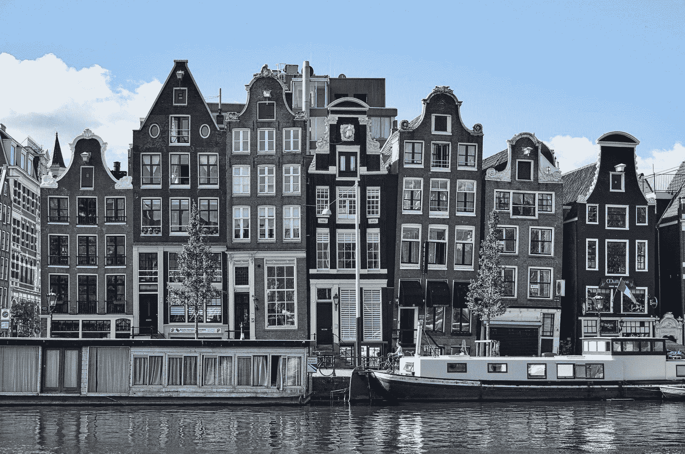](https://files.realpython.com/media/buildings-1.9786ca5e657d.jpg)

在一些系统中，调用`.show()`会阻止 REPL，直到你关闭图像。这取决于您使用的操作系统和默认图像查看软件。

在处理 Python Pillow 库中的图像时，您需要熟悉三个关键属性。您可以使用`Image`类属性 [`.format`](https://pillow.readthedocs.io/en/stable/reference/Image.html#PIL.Image.Image.format) 、 [`.size`](https://pillow.readthedocs.io/en/stable/reference/Image.html#PIL.Image.Image.size) 和 [`.mode`](https://pillow.readthedocs.io/en/stable/reference/Image.html#PIL.Image.Image.mode) 来探索这些:

>>>

```
>>> img.format
'JPEG'

>>> img.size
(1920, 1273)

>>> img.mode
'RGB'` 
```

图像的格式显示了您正在处理的图像的类型。在这种情况下，图像的格式是`'JPEG'`。尺寸以像素为单位显示图像的宽度和高度。这张图的模式是`'RGB'`。稍后您将了解更多关于模式的内容。

通常，您可能需要裁剪图像并调整其大小。`Image`类有两个方法可以用来执行这些操作， [`.crop()`](https://pillow.readthedocs.io/en/stable/reference/Image.html#PIL.Image.Image.crop) 和 [`.resize()`](https://pillow.readthedocs.io/en/stable/reference/Image.html#PIL.Image.Image.resize) :

>>>

```
>>> cropped_img = img.crop((300, 150, 700, 1000))
>>> cropped_img.size
(400, 850)

>>> cropped_img.show()

>>> low_res_img = cropped_img.resize(
...     (cropped_img.width // 4, cropped_img.height // 4)
... )
>>> low_res_img.show()` 
```

`.crop()`的参数必须是一个 4 元组，它定义了要裁剪的区域的左、上、右和下边缘。Pillow 中使用的[坐标系](https://pillow.readthedocs.io/en/stable/handbook/concepts.html#coordinate-system)将坐标(0，0)分配给左上角的像素。这是通常用于二维[阵列](https://realpython.com/python-data-structures/#array-data-structures)的同一坐标系。4 元组表示图像的以下部分:

[](https://files.realpython.com/media/pillow_coordinate_crop2.15af40c34f15.png)

在上面的代码中，`.crop()`返回的新图像的大小为`400x850`像素。裁剪后的图像仅显示原始图片中的一个建筑物:

[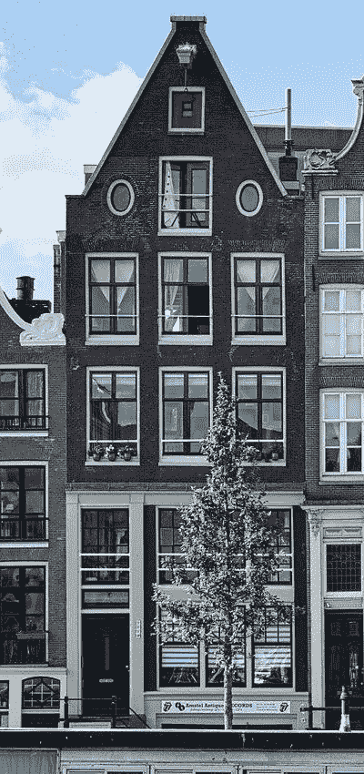](https://files.realpython.com/media/buildings-2.54ff5556683e.jpg)

在上面的代码中，您还使用`.resize()`更改裁剪图像的分辨率，这需要一个元组作为必需的参数。用作参数的元组以像素为单位定义图像的新宽度和高度。

在上面的例子中，您使用[地板除法运算符](https://docs.python.org/3/glossary.html#term-floor-division) ( `//`)和`Image`属性 [`.width`](https://pillow.readthedocs.io/en/stable/reference/Image.html#PIL.Image.Image.width) 和 [`.height`](https://pillow.readthedocs.io/en/stable/reference/Image.html#PIL.Image.Image.height) 将新的宽度和高度设置为其原始值的四分之一。对`show()`的最后一个调用显示了经过裁剪和调整大小的图像:

[](https://files.realpython.com/media/buildings-3.8aaa8fee17fb.jpg)

您可以使用 [`.resize()`](https://pillow.readthedocs.io/en/stable/reference/Image.html?highlight=resize#PIL.Image.Image.resize) 的其他可选参数来控制图像如何被[重新采样](https://en.wikipedia.org/wiki/Image_scaling)。或者，您可以使用 [`.reduce()`](https://pillow.readthedocs.io/en/stable/reference/Image.html#PIL.Image.Image.reduce) 实现类似的缩放:

>>>

```
>>> low_res_img = cropped_img.reduce(4)` 
```

参数决定了缩小图像的因子。如果你更喜欢设置一个最大尺寸而不是比例因子，那么你可以使用 [`.thumbnail()`](https://pillow.readthedocs.io/en/stable/reference/Image.html?highlight=thumbnail#PIL.Image.Image.thumbnail) 。缩略图的大小将小于或等于您设置的大小。

**注意:**`.thumbnail()`方法就地改变`Image`对象，不返回新对象。然而，`.crop()`、`.resize()`、`.reduce()`都返回一个新的`Image`对象。并非 Pillow 库中的所有方法都以相同的方式运行。

一旦您对返回的图像满意，您可以使用 [`.save()`](https://pillow.readthedocs.io/en/stable/reference/Image.html#PIL.Image.Image.save) 将任何`Image`对象保存到文件中:

>>>

```
>>> cropped_img.save("cropped_image.jpg")
>>> low_res_img.save("low_resolution_cropped_image.png")` 
```

调用方法后，它会在项目文件夹中创建图像文件。在这个例子中，一个图像是 JPEG 图像，另一个是 PNG 图像。用作文件名的扩展名会自动确定文件格式，或者您可以将格式指定为附加的可选参数。

[*Remove ads*](/account/join/)

### *基本图像操作*

 *除了裁剪和调整大小之外，您还可以操作图像。另一个常见的需求是旋转或翻转图像。您可以使用 [`.transpose()`](https://pillow.readthedocs.io/en/stable/reference/Image.html#PIL.Image.Image.transpose) 方法进行一些变换。继续进行您在上一节中开始的 REPL 会话:

>>>

```
>>> converted_img = img.transpose(Image.FLIP_TOP_BOTTOM)
>>> converted_img.show()` 
```

这段代码显示了下面的图像:

[](https://files.realpython.com/media/buildings-4.d054549cd56b.jpg)

有七个选项可以作为参数传递给`.transpose()`:

1.  **`Image.FLIP_LEFT_RIGHT` :** 左右翻转图像，产生镜像
2.  **`Image.FLIP_TOP_BOTTOM` :** 上下翻转图像
3.  **`Image.ROTATE_90` :** 将图像逆时针旋转 90 度
4.  **`Image.ROTATE_180` :** 将图像旋转 180 度
5.  **`Image.ROTATE_270` :** 将图像逆时针旋转 270 度，与顺时针旋转 90 度相同
6.  **`Image.TRANSPOSE` :** 使用左上角像素作为原点来转置行和列，转置图像中的左上角像素与原始图像中的相同
7.  **`Image.TRANSVERSE` :** 使用左下角像素作为原点来调换行和列，左下角像素是在原始版本和修改版本之间保持固定的像素

以上所有旋转选项都定义了 90 度的旋转步长。如果需要将图像旋转另一个角度，那么可以使用 [`.rotate()`](https://pillow.readthedocs.io/en/stable/reference/Image.html#PIL.Image.Image.rotate) :

>>>

```
>>> rotated_img = img.rotate(45)
>>> rotated_img.show()` 
```

此方法调用将图像逆时针旋转 45 度，得到以下图像:

[](https://files.realpython.com/media/buildings-5.cc8ddfed27ea.jpg)

返回的`Image`对象与原来的`Image`大小相同。因此，图像的角在此显示中丢失。您可以使用`expand`命名参数来改变这种行为:

>>>

```
>>> rotated_img = img.rotate(45, expand=True)
>>> rotated_img.show()` 
```

此方法返回一个更大的图像，该图像完全包含旋转后的图像:

[](https://files.realpython.com/media/buildings-6.cef4d68b9ba3.jpg)

您可以使用[附加可选参数](https://pillow.readthedocs.io/en/stable/reference/Image.html?highlight=Image.rotate#PIL.Image.Image.rotate)进一步定制旋转。您现在可以更改图像的大小和方向。在下一节中，您将了解 Python Pillow 库中不同类型的图像。

### Python Pillow 库中图像的波段和模式

图像是二维像素阵列，其中每个像素对应一种颜色。每个像素可以由一个或多个值来表示。例如，在 [RGB](https://en.wikipedia.org/wiki/RGB_color_model) 图像中，每个像素由对应于该像素的红色、绿色和蓝色值的三个值表示。

因此，RBG 图像的`Image`对象包含三个波段，每种颜色一个。一个大小为`100x100`像素的 RGB 图像由一个`100x100x3`值数组表示。

[RGBA](https://en.wikipedia.org/wiki/RGBA_color_model) 图像还包括阿尔法值，它包含每个像素的透明度信息。RGBA 图像有四个波段，每种颜色一个波段，第四个波段包含 alpha 值。每个条带的尺寸与图像尺寸相同。因此，大小为`100x100`像素的 RGBA 图像由一个`100x100x4`值数组表示。

图像的模式描述了您正在处理的图像的类型。Pillow 支持大多数标准模式，包括黑白(二进制)、灰度、RGB、RGBA 和 [CMYK](https://en.wikipedia.org/wiki/CMYK_color_model) 。您可以在枕头文档中的[模式](https://pillow.readthedocs.io/en/stable/handbook/concepts.html?highlight=bands#modes)上看到支持模式的完整列表。

您可以使用 [`.getbands()`](https://pillow.readthedocs.io/en/stable/reference/Image.html#PIL.Image.Image.getbands) 方法找出一个`Image`对象中有多少个波段，并且您可以使用 [`.convert()`](https://pillow.readthedocs.io/en/stable/reference/Image.html#PIL.Image.Image.convert) 在模式之间转换。现在，在本教程中，您将使用图像库中名为`strawberry.jpg` ( [image credit](https://pixabay.com/users/geoluro11-15863448/) )的图像:

[](https://files.realpython.com/media/strawberry-1.438a9555d0c2.jpg)

这张图片的模式也是 RGB。您可以将此图像转换为其他模式。此代码使用您在前面几节中启动的相同的 REPL 会话:

>>>

```
>>> filename = "strawberry.jpg"
>>> with Image.open(filename) as img:
...     img.load()
...

>>> cmyk_img = img.convert("CMYK")
>>> gray_img = img.convert("L")  # Grayscale

>>> cmyk_img.show()
>>> gray_img.show()

>>> img.getbands()
('R', 'G', 'B')
>>> cmyk_img.getbands()
('C', 'M', 'Y', 'K')
>>> gray_img.getbands()
('L',)` 
```

您调用两次`.convert()`将 RGB 图像转换为 CMYK 和灰度版本。CMYK 图像看起来与原始图像相似，但使用印刷材料常用的模式进行编码，而不是数字显示。转换为灰度会产生以下输出:

[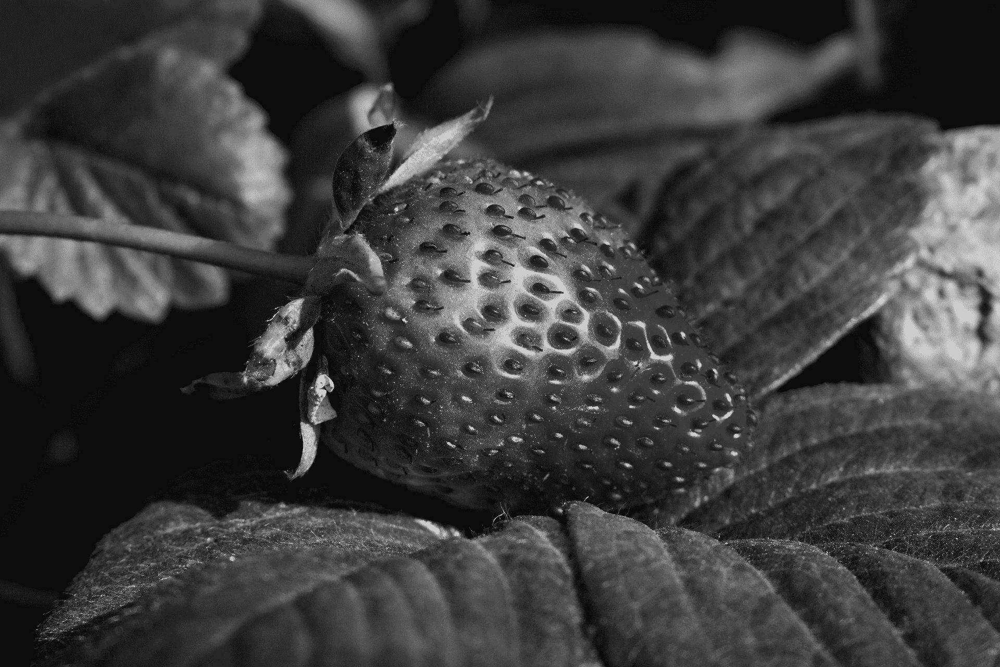](https://files.realpython.com/media/strawberry-2.b692fca6e1fe.jpg)

对`.getbands()`调用的输出确认 RGB 图像中有三个波段，CMYK 图像中有四个波段，灰度图像中有一个波段。

您可以使用 [`.split()`](https://pillow.readthedocs.io/en/stable/reference/Image.html#PIL.Image.Image.split) 将图像分成不同的波段，并使用 [`merge()`](https://pillow.readthedocs.io/en/stable/reference/Image.html#PIL.Image.merge) 将不同的波段组合回一个`Image`对象。当您使用`.split()`时，该方法将所有波段作为单独的`Image`对象返回。您可以通过显示返回的对象之一的字符串表示来确认这一点:

>>>

```
>>> red, green, blue = img.split()
>>> red
<PIL.Image.Image image mode=L size=1920x1281 at 0x7FDD80C9AFA0>
>>> red.mode
'L'` 
```

`.split()`返回的对象的模式是`'L'`，表示这是灰度图像，或者是只显示每个像素的[亮度](https://en.wikipedia.org/wiki/Luminance)值的图像。

现在，您可以使用`merge()`创建三个新的 RGB 图像，分别显示红色、绿色和蓝色通道，这是`Image`模块中的一个功能:

>>>

```
>>> zeroed_band = red.point(lambda _: 0)

>>> red_merge = Image.merge(
...     "RGB", (red, zeroed_band, zeroed_band)
... )

>>> green_merge = Image.merge(
...     "RGB", (zeroed_band, green, zeroed_band)
... )

>>> blue_merge = Image.merge(
...     "RGB", (zeroed_band, zeroed_band, blue)
... )

>>> red_merge.show()
>>> green_merge.show()
>>> blue_merge.show()` 
```

`merge()`中的第一个参数决定了您想要创建的图像的模式。第二个参数包含要合并到单个图像中的各个波段。

存储在变量`red`中的单独的红乐队是具有模式 l 的灰度图像。为了创建仅显示红色通道的图像，您将原始图像的红色带与仅包含零的绿色和蓝色带合并。要创建一个处处包含零的带，可以使用`.point()`方法。

这个方法需要一个函数作为参数。您使用的函数决定了每个点如何变换。在这种情况下，您使用一个 [`lambda`函数](https://realpython.com/python-lambda/)将每个点映射到`0`。

当您将红色波段与包含零的绿色和蓝色波段合并时，您会得到一个名为`red_merge`的 RGB 图像。因此，您创建的 RGB 图像在红色通道中只有非零值，但是因为它仍然是 RGB 图像，所以它将以彩色显示。

您还可以重复类似的过程来获得`green_merge`和`blue_merge`，它们包含原始图像中带有绿色和蓝色通道的 RGB 图像。该代码显示以下三幅图像:

[](https://files.realpython.com/media/strawberry-3.fdd949f3db98.jpg)

红色图像在代表草莓的像素中包含强信号，因为这些像素大部分是红色的。绿色和蓝色通道将这些像素显示为深色，因为它们的值很小。例外的是那些代表草莓表面光反射的像素，因为这些像素几乎是白色的。


在本教程中，当代码中有几个图像输出需要并排显示以便于比较时，这些图像会并排显示，而不是作为单独的图像显示。

这些并排展示是用枕头本身制作的。您可以使用如下所示的功能`tile()`，将多幅图像合并到一个显示屏中:

```
from PIL import Image

def tile(*images, vertical=False):
    width, height = images[0].width, images[0].height
    tiled_size = (
        (width, height * len(images))
        if vertical
        else (width * len(images), height)
    )
    tiled_img = Image.new(images[0].mode, tiled_size)
    row, col = 0, 0
    for image in images:
        tiled_img.paste(image, (row, col))
        if vertical:
            col += height
        else:
            row += width

    return tiled_img` 
```

`tile()`中的第一个参数使用[解包](https://realpython.com/python-kwargs-and-args/#unpacking-with-the-asterisk-operators)操作符(`*`)，因此任意数量的`PIL.Image`类型的对象都可以用作输入参数。如果您想垂直平铺图像而不是水平平铺图像，可以将关键字参数`vertical`设置为`True`。该函数假设所有图像都具有相同的大小。

显示器的整体尺寸是根据图像的尺寸和所用图像的数量计算出来的。然后创建一个新的`Image`对象，其模式与原始图像相同，大小与整体显示相同。

`for`循环将调用该函数时输入的图像粘贴到最终显示中。该函数返回包含所有并排图像的最终`Image`对象。

主文章中显示草莓图像的三个颜色通道的图像是通过调用`tile()`函数获得的，如下所示:

>>>

```
>>> strawberry_channels = tile(red_merge, green_merge, blue_merge)` 
```

在本教程中，这个函数用于生成显示多个图像的所有显示。

[*Remove ads*](/account/join/)

## *Python 中使用 Pillow 的图像处理*

 *您已经学习了如何裁剪和旋转图像、调整图像大小以及从彩色图像中提取色带。但是，到目前为止，您所采取的任何操作都没有对图像的内容进行任何更改。在本节中，您将了解 Python Pillow 库中的图像处理特性。您将使用枕头中的 [`ImageFilter`](https://pillow.readthedocs.io/en/stable/reference/ImageFilter.html?highlight=imagefilter#imagefilter-module) 模块。

### 使用卷积核的图像滤波器

图像处理中使用的一种方法是使用核进行图像卷积。本教程的目的不是给出图像处理理论的详细解释。如果你对图像处理科学感兴趣，你可以使用的最佳资源之一是 Gonzalez 和 Woods 的数字图像处理(T2)。

在本节中，您将学习如何使用卷积核来执行图像处理的基础知识。但是什么是[卷积核](https://en.wikipedia.org/wiki/Kernel_(image_processing))？内核是一个矩阵:

[](https://files.realpython.com/media/kernel-1.3600b296fff0.png)

您可以考虑一个简单的图像来理解使用内核的卷积过程。图像大小为`30x30`像素，包含一条垂直线和一个点。线条宽 4 个像素，点由一个`4x4`像素方块组成。下图被放大以供显示:

[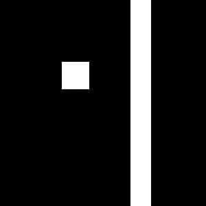](https://files.realpython.com/media/kernel-demo-orig.80786662b59d.jpg)

您可以将内核放在图像上的任何位置，并使用内核中央单元的位置作为参考。下图显示了图像的左上部分:

[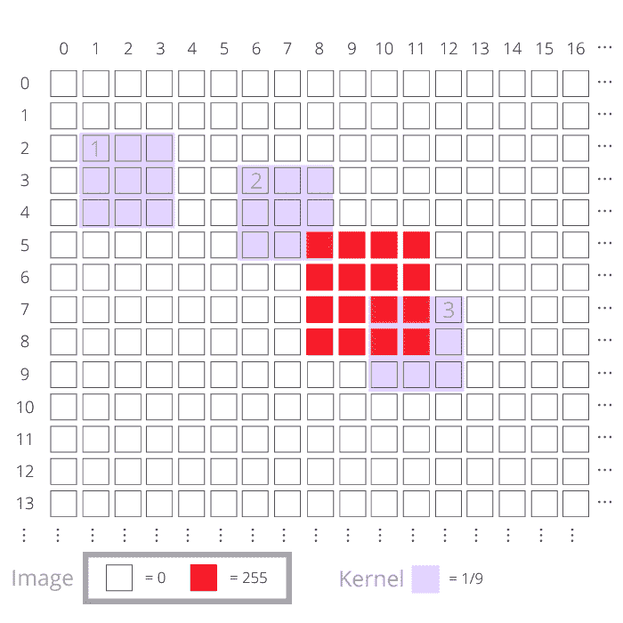](https://files.realpython.com/media/kernel-convolution-diagram.75ac0d309cf6.png)

此图中的元素代表了映像和内核的不同方面:

*   **白色方块**代表图像中值为 **`0`** 的像素。
*   **红色方块**代表图像中值为 **`255`** 的像素。这些构成了上图中的圆点。
*   每个**紫色区域**代表**内核**。这个内核由一个`3x3`区域组成，内核中的每个单元格都有一个值`1/9`。该图显示了标记为 1、2 和 3 的三个不同位置的内核。

作为图像与内核卷积的结果，可以创建新的图像。您可以通过以下步骤了解卷积过程:

1.  **定位内核:**考虑其中一个内核位置，查看由内核的九个单元覆盖的图像像素。
2.  **将内核和像素值相乘:**将内核的每个单元格中的值与图像中相应的像素值相乘。九次乘法你会得到九个值。
3.  **乘法结果相加:**将这九个值相加。结果将是新图像中与内核中心像素具有相同坐标的像素值。
4.  **对所有像素重复:**对图像中的每个像素重复该过程，每次移动内核，使内核的中心单元每次对应不同的图像像素。

在上图中，您可以看到这个过程中的三个内核位置分别标为 1、2 和 3。考虑标记为 1 的**内核位置。这个内核的位置是`(3, 2)`，这是它的中心单元格的位置，因为它在第四行(index = `3`)和第三列(index = `2`)。由内核覆盖的区域中的每个图像像素具有零值。**

因此，步骤 2 中的所有乘法都将为零，它们的加法也将为零。新图像在像素`(3, 2)`处的值为零。

对于所示的其他内核位置，情况有所不同。接下来，考虑位于`(4, 7)`的标记为 2 的**内核。与此重叠的图像像素之一不为零。这个像素值与内核值相乘将得到`255 x (1/9) = 28.33`。剩余的八个乘法仍然是零，因为图像像素是零。因此，新图像中位置`(4, 7)`处的像素值将为`28.33`。**

上面所示的第三内核位置在`(8, 11)`处。有四个非零图像像素与该内核重叠。每一个都有一个值`255`，所以对于这些像素位置中的每一个，乘法结果将再次是`28.33`。这个内核位置的总结果是`28.33 x 4 = 113.33`。新图像将在`(8, 11)`具有该值。

上面的图表和讨论只考虑了三个内核位置。卷积过程对图像中每个可能的核位置重复这个过程。这为新图像中的每个像素位置提供了一个值。

卷积的结果显示在下图的右侧，原始图像显示在左侧:

[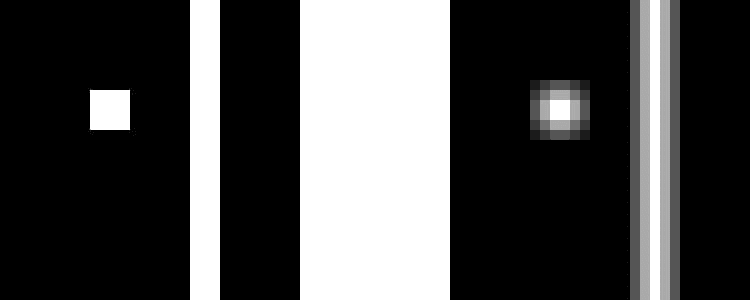](https://files.realpython.com/media/kernel-demo-tiled.2ee004251df4.jpg)

你使用的内核是一个[盒子模糊内核](https://en.wikipedia.org/wiki/Box_blur)。因为有了`1/9`的因子，所以内核的总权重是`1`。卷积的结果是原始图像的模糊版本。还有其他执行不同功能的内核，包括不同的模糊方法、边缘检测、锐化等。

Python Pillow 库有几个内置的内核和函数来执行上述卷积。使用这些过滤器不需要了解通过卷积进行过滤的数学知识，但使用这些工具时了解幕后发生的事情总是有帮助的。

接下来的部分将会看到 Pillow 的 [`ImageFilter`](https://pillow.readthedocs.io/en/stable/reference/ImageFilter.html) 模块中的内核和图像过滤功能。

[*Remove ads*](/account/join/)

### *图像模糊、锐化和平滑*

 *您将返回到使用您在本教程开始时使用的建筑物图像。您可以为此部分启动新的 REPL 会话:

>>>

```
>>> from PIL import Image, ImageFilter
>>> filename = "buildings.jpg"
>>> with Image.open(filename) as img:
...     img.load()
...` 
```

除了`Image`，还从 Pillow 导入了`ImageFilter`模块。您可以使用 [`.filter()`](https://pillow.readthedocs.io/en/stable/reference/Image.html#PIL.Image.Image.filter) 方法对图像进行过滤。这个方法需要一个卷积核作为它的参数，您可以使用 Pillow 中的 [`ImageFilter`](https://pillow.readthedocs.io/en/stable/reference/ImageFilter.html?highlight=imagefilter#module-PIL.ImageFilter) 模块中可用的几个核中的一个。您将学习的第一组滤镜用于处理模糊、锐化和平滑图像。

您可以使用预定义的`ImageFilter.BLUR`滤镜模糊图像:

>>>

```
>>> blur_img = img.filter(ImageFilter.BLUR)
>>> blur_img.show()` 
```

显示的图像是原始图像的模糊版本。您可以使用`.crop()`放大以更详细地观察差异，然后使用`.show()`再次显示图像:

>>>

```
>>> img.crop((300, 300, 500, 500)).show()
>>> blur_img.crop((300, 300, 500, 500)).show()` 
```

两个裁剪的图像显示了两个版本之间的差异:

[](https://files.realpython.com/media/blur-comparison-1.41349dbb4d21.jpg)

您可以使用 [`ImageFilter.BoxBlur()`](https://pillow.readthedocs.io/en/stable/reference/ImageFilter.html#PIL.ImageFilter.BoxBlur) 或 [`ImageFilter.GaussianBlur()`](https://pillow.readthedocs.io/en/stable/reference/ImageFilter.html#PIL.ImageFilter.GaussianBlur) 自定义您需要的模糊类型和模糊量:

>>>

```
>>> img.filter(ImageFilter.BoxBlur(5)).show()
>>> img.filter(ImageFilter.BoxBlur(20)).show()
>>> img.filter(ImageFilter.GaussianBlur(20)).show()` 
```

您可以看到下面三个模糊的图像，显示顺序与上面代码中的顺序相同:

[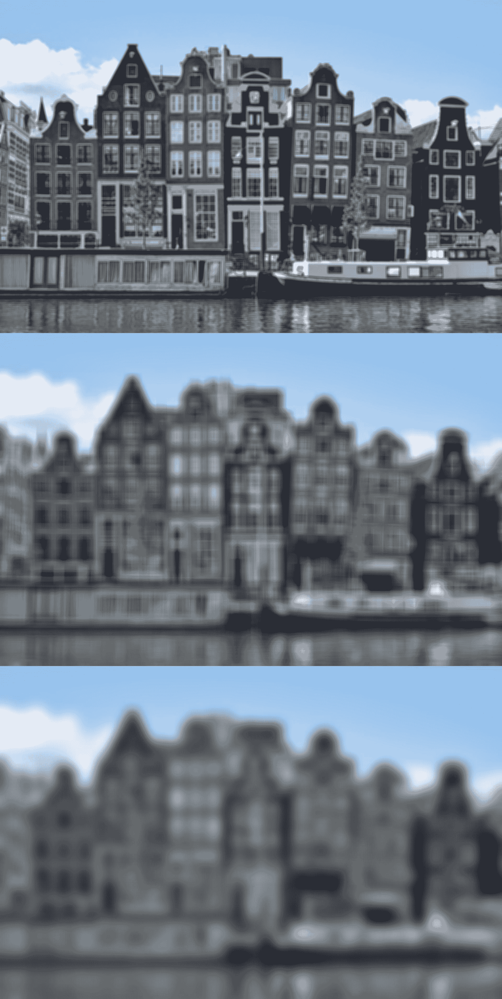](https://files.realpython.com/media/blur-comparison-2.8f9912f06c28.jpg)

`.BoxBlur()`滤波器类似于上一节介绍卷积核中描述的滤波器。参数是长方体模糊滤镜的半径。在前面讨论内核的部分中，你使用的盒子模糊滤镜是一个`3x3`滤镜。这意味着它的半径为`1`，因为滤镜从中心延伸了一个像素。

模糊图像显示，半径为`20`的长方体模糊滤镜生成的图像比半径为`5`的长方体模糊滤镜生成的图像更加模糊。

你也可以使用`.GaussianBlur()`滤镜，它使用了[高斯模糊内核](https://en.wikipedia.org/wiki/Gaussian_blur)。高斯核将更多的权重放在核中心的像素上，而不是边缘的像素上，这导致了比使用方框模糊所获得的更平滑的模糊。由于这个原因，高斯模糊在许多情况下可以给出更好的结果。

如果你想锐化一个图像呢？在这种情况下，您可以使用`ImageFilter.SHARPEN`滤镜并将结果与原始图像进行比较:

>>>

```
>>> sharp_img = img.filter(ImageFilter.SHARPEN)
>>> img.crop((300, 300, 500, 500)).show()
>>> sharp_img.crop((300, 300, 500, 500)).show()` 
```

您正在比较两幅图像的裁剪版本，显示了建筑的一小部分。右边是锐化后的图像:

[](https://files.realpython.com/media/sharpen.58594c98d960.jpg)

也许你需要平滑图像，而不是锐化图像。您可以通过将`ImageFilter.SMOOTH`作为`.filter()`的参数来实现这一点:

>>>

```
>>> smooth_img = img.filter(ImageFilter.SMOOTH)
>>> img.crop((300, 300, 500, 500)).show()
>>> smooth_img.crop((300, 300, 500, 500)).show()` 
```

在下面，你可以看到左边的原始图像和右边的平滑图像:

[](https://files.realpython.com/media/smooth_1.bd93e116a6d5.jpg)

在下一节中，你将看到平滑滤镜的应用，你将在`ImageFilter`模块中了解更多滤镜。这些滤镜作用于图像中对象的边缘。

[*Remove ads*](/account/join/)

### *边缘检测、边缘增强和压花*

 *当你看一幅图像时，确定图像中物体的边缘是相对容易的。算法也可以使用[边缘检测内核](https://en.wikipedia.org/wiki/Edge_detection)自动检测边缘。

Pillow 中的`ImageFilter`模块有一个预定义的内核来实现这一点。在本节中，您将再次使用建筑物的图像，并在应用边缘检测滤镜之前将其转换为灰度。您可以继续上一节中的 REPL 会话:

>>>

```
>>> img_gray = img.convert("L")
>>> edges = img_gray.filter(ImageFilter.FIND_EDGES)
>>> edges.show()` 
```

结果是显示原始图像边缘的图像:

[](https://files.realpython.com/media/edges.9f21fd9a6314.jpg)

该过滤器识别图像中的边缘。在找到边缘之前，您可以通过应用`ImageFilter.SMOOTH`过滤器获得更好的结果:

>>>

```
>>> img_gray_smooth = img_gray.filter(ImageFilter.SMOOTH)
>>> edges_smooth = img_gray_smooth.filter(ImageFilter.FIND_EDGES)
>>> edges_smooth.show()` 
```

您可以看到原始灰度图像和下面两个边缘检测结果的比较。边缘检测前平滑的版本显示在底部:

[](https://files.realpython.com/media/edges-comparison.236023dafb8b.jpg)

您还可以使用`ImageFilter.EDGE_ENHANCE`滤镜增强原始图像的边缘:

>>>

```
>>> edge_enhance = img_gray_smooth.filter(ImageFilter.EDGE_ENHANCE)
>>> edge_enhance.show()` 
```

您使用灰度图像的平滑版本来增强边缘。下面并排显示了原始灰度图像的一部分和边缘增强的图像。右边是边缘增强的图像:

[](https://files.realpython.com/media/edge-enhance.e4a42ad3badb.jpg)

`ImageFilter`中另一个处理物体边缘的预定义过滤器是`ImageFilter.EMBOSS`。您可以将它作为参数传递给`.filter()`,就像您在本节中处理其他过滤器一样:

>>>

```
>>> emboss = img_gray_smooth.filter(ImageFilter.EMBOSS)
>>> emboss.show()` 
```

您正在使用平滑的灰度版本作为此滤镜的起点。您可以看到下面的浮雕图像，它显示了使用图像边缘的不同效果:

[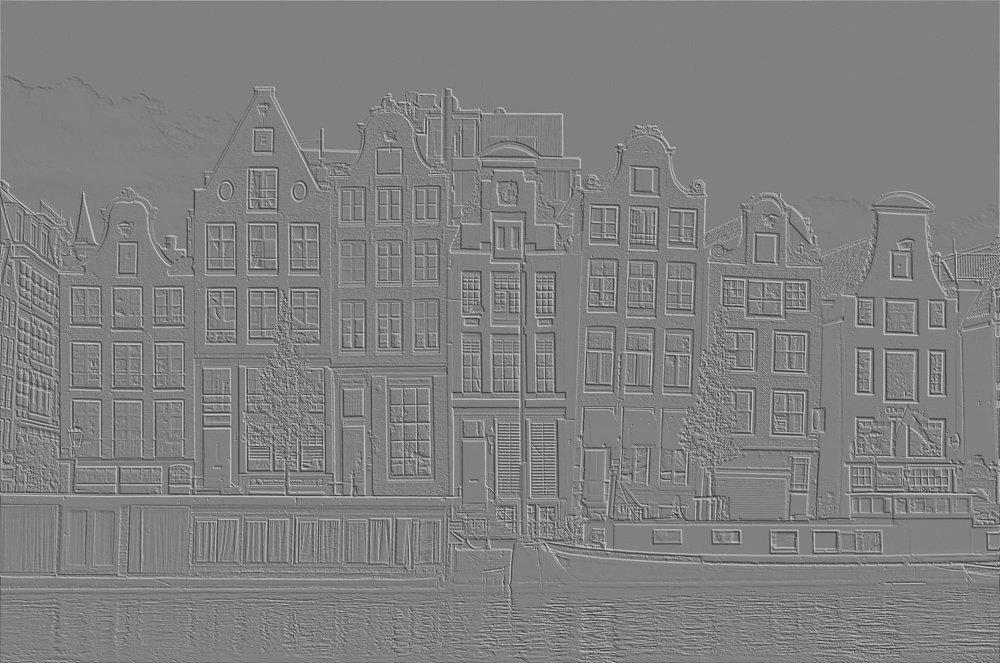](https://files.realpython.com/media/emboss.c6f777d2aa48.jpg)

在本节中，您已经了解了在`ImageFilter`模块中可以应用于图像的几种滤镜。您还可以使用其他滤镜来处理图像。您可以在 [`ImageFilter`文档](https://pillow.readthedocs.io/en/stable/reference/ImageFilter.html?highlight=imagefilter#imagefilter-module)中看到所有可用过滤器的列表。

## 图像分割和叠加:示例

在本节中，您将使用名为`cat.jpg` ( [图像信用](https://pixabay.com/users/mabelamber-1377835/))和`monastery.jpg` ( [图像信用](https://pixabay.com/users/tama66-1032521/))的图像文件，您可以在本教程的图像库中找到它们:

**获取图像:** [点击此处获取您将使用 Pillow 操作和处理的图像](https://realpython.com/bonus/image-processing-with-the-python-pillow-library-images/)。

这是两张图片:

[](https://files.realpython.com/media/cat.8ce1dab25b77.jpg) [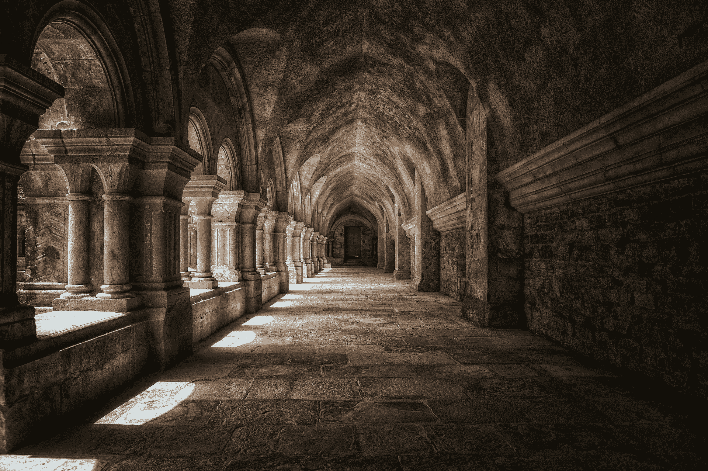](https://files.realpython.com/media/monastery.2bbf243677a0.jpg)

你可以使用 Python Pillow 库从第一张图片中提取猫，并将其放置在修道院庭院的地板上。您将使用许多图像处理技术来实现这一点。

[*Remove ads*](/account/join/)

### *图像阈值处理*

 *你将从`cat.jpg`开始。你需要使用图像分割技术将猫的图片从背景中移除。在这个例子中，你将使用[阈值](https://en.wikipedia.org/wiki/Thresholding_(image_processing))技术分割图像。

首先，您可以将图像裁剪为较小的图像，以移除一些背景。您可以为此项目启动新的 REPL 会话:

>>>

```
>>> from PIL import Image
>>> filename_cat = "cat.jpg"

>>> with Image.open(filename_cat) as img_cat:
...     img_cat.load()
...

>>> img_cat = img_cat.crop((800, 0, 1650, 1281))
>>> img_cat.show()` 
```

裁剪后的图像包含猫和一些背景，这些背景离猫太近，您无法裁剪:

[](https://files.realpython.com/media/cat_1.0ad3b85b3bca.jpg)

彩色图像中的每个像素都由对应于该像素的红色、绿色和蓝色值的三个数字数字表示。阈值处理是将所有像素转换为最大值或最小值的过程，这取决于它们是高于还是低于某个数值。在灰度图像上这样做更容易:

>>>

```
>>> img_cat_gray = img_cat.convert("L")
>>> img_cat_gray.show()
>>> threshold = 100
>>> img_cat_threshold = img_cat_gray.point(
...     lambda x: 255 if x > threshold else 0
... )
>>> img_cat_threshold.show()` 
```

通过调用`.point()`将灰度图像中的每个像素转换为`255`或`0`，可以实现阈值处理。转换取决于灰度图像中的值是大于还是小于阈值。本例中的阈值为`100`。

下图显示了灰度图像和阈值处理的结果:

[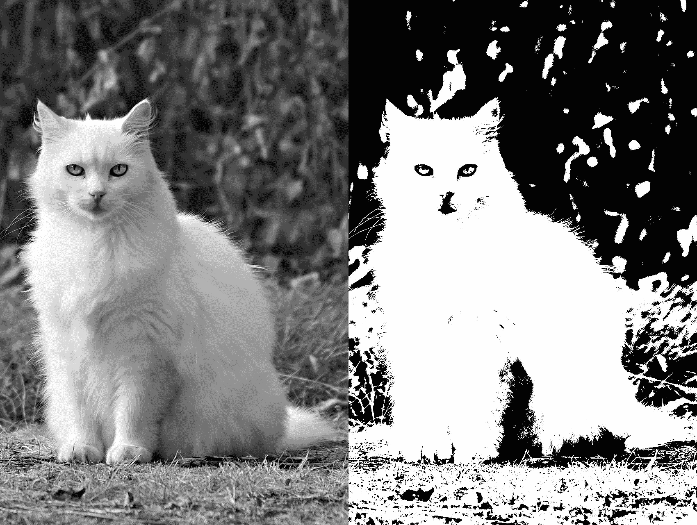](https://files.realpython.com/media/cat_2.55ea108e25c1.jpg)

在本例中，灰度图像中像素值大于`100`的所有点都被转换为白色，所有其他像素都被转换为黑色。您可以通过改变阈值来改变阈值处理的灵敏度。

当要分割的对象不同于背景时，可以使用阈值处理来分割图像。使用具有更高对比度的原始图像版本可以获得更好的效果。在本例中，您可以通过对原始图像的蓝色通道而不是灰度图像设定阈值来获得更高的对比度，因为背景中的主色是棕色和绿色，它们具有较弱的蓝色成分。

您可以像前面一样从彩色图像中提取红色、绿色和蓝色通道:

>>>

```
>>> red, green, blue = img_cat.split()
>>> red.show()
>>> green.show()
>>> blue.show()` 
```

红色、绿色和蓝色通道从左到右显示如下。三者都显示为灰度图像:

[](https://files.realpython.com/media/cat_3.292653f95a87.jpg)

蓝色通道在代表猫的像素和代表背景的像素之间具有较高的对比度。您可以使用蓝色通道图像来设定阈值:

>>>

```
>>> threshold = 57
>>> img_cat_threshold = blue.point(lambda x: 255 if x > threshold else 0)
>>> img_cat_threshold = img_cat_threshold.convert("1")
>>> img_cat_threshold.show()` 
```

在本例中，您使用了阈值`57`。您还可以使用`"1"`作为`.convert()`的参数，将图像转换为二进制模式。二进制图像中的像素只能有`0`或`1`的值。

**注意:**当处理某些依赖于[有损压缩的图像格式时，图像可能会略有不同，这取决于您使用的 JPEG 解码器。不同的操作系统通常带有不同的默认 JPEG 解码器。因此，处理图像时获得的结果可能会因您使用的操作系统和 JPEG 解码器而异。](https://en.wikipedia.org/wiki/Lossy_compression)

如果您的结果与本教程中显示的结果不匹配，您可能需要稍微调整阈值。

阈值处理的结果如下:

[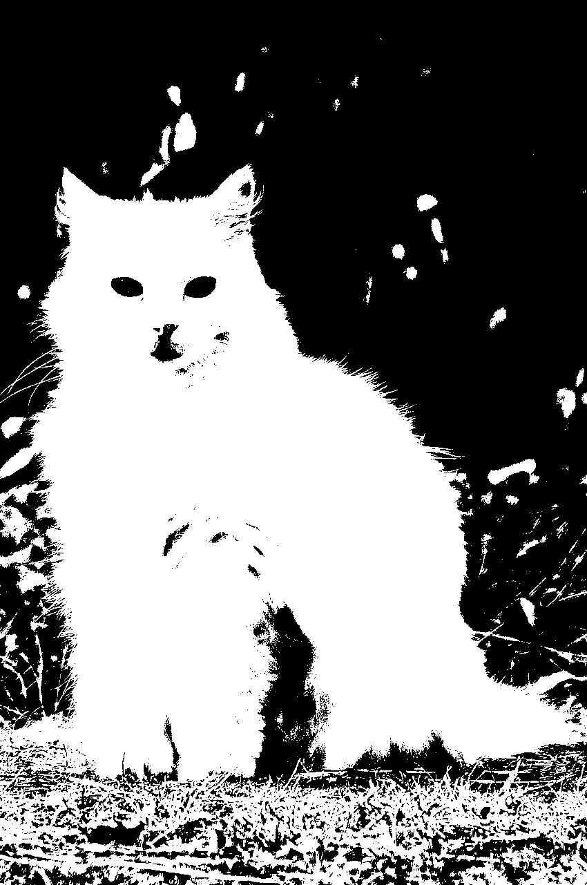](https://files.realpython.com/media/cat_4.00e679b85d99.jpg)

你可以在这张黑白照片中认出这只猫。但是，您希望图像中对应于猫的所有像素都是白色的，而所有其他像素都是黑色的。在这张图像中，在对应于猫的区域仍然有黑色区域，例如眼睛、鼻子和嘴所在的位置，并且在图像的其他地方也仍然有白色像素。

你可以使用称为[腐蚀](https://en.wikipedia.org/wiki/Erosion_(morphology))和[膨胀](https://en.wikipedia.org/wiki/Dilation_(morphology))的图像处理技术来创建一个更好的代表猫的面具。您将在下一节学习这两种技术。

[*Remove ads*](/account/join/)

### *侵蚀和扩张*

 *您可以查看名为`dot_and_hole.jpg`的图像文件，可以从链接到本教程的存储库中下载该文件:

[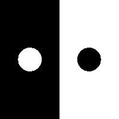](https://files.realpython.com/media/dot_and_hole.7d97ef4056d0.jpg)

这张二进制图像的左手边显示了黑色背景上的一个白点，而右手边显示了实心白色部分中的一个黑洞。

腐蚀是从图像的边界移除白色像素的过程。通过使用`ImageFilter.MinFilter(3)`作为`.filter()`方法的参数，可以在二进制图像中实现这一点。该滤镜将一个像素的值替换为以该像素为中心的`3x3`数组中九个像素的最小值。在二进制图像中，这意味着如果一个像素的任何相邻像素为零，则该像素的值为零。

通过对`dot_and_hole.jpg`图像多次应用`ImageFilter.MinFilter(3)`，可以看到腐蚀的效果。您应该继续与上一节相同的 REPL 会话:

>>>

```
>>> from PIL import ImageFilter
>>> filename = "dot_and_hole.jpg"

>>> with Image.open(filename) as img:
...     img.load()
...

>>> for _ in range(3):
...     img = img.filter(ImageFilter.MinFilter(3))
...

>>> img.show()` 
```

您已经使用`for`循环应用了过滤器三次。该代码给出以下输出:

[](https://files.realpython.com/media/erosion_1.b3c47d6c392f.jpg)

由于侵蚀，圆点缩小了，但洞却扩大了。

膨胀是与侵蚀相反的过程。白色像素被添加到二进制图像的边界。您可以通过使用`ImageFilter.MaxFilter(3)`来实现膨胀，如果一个像素的任何邻居是白色的，它会将该像素转换为白色。

您可以对包含一个点和一个洞的同一图像应用膨胀，您可以再次打开并加载该图像:

>>>

```
>>> with Image.open(filename) as img:
...     img.load()
...

>>> for _ in range(3):
...     img = img.filter(ImageFilter.MaxFilter(3))
...

>>> img.show()` 
```

圆点现在变大了，而洞缩小了:

[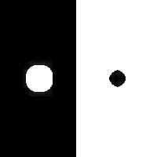](https://files.realpython.com/media/dilation_1.9d05f5743968.jpg)

您可以同时使用腐蚀和膨胀来填充孔洞，并从二值图像中移除小对象。使用带有点和孔的图像，您可以执行十次腐蚀循环来移除点，然后执行十次膨胀循环来将孔恢复到其原始大小:

>>>

```
>>> with Image.open(filename) as img:
...     img.load()
...

>>> for _ in range(10):
...     img = img.filter(ImageFilter.MinFilter(3))
...

>>> img.show()

>>> for _ in range(10):
...     img = img.filter(ImageFilter.MaxFilter(3))
...

>>> img.show()` 
```

第一个`for`循环执行十次腐蚀循环。此阶段的图像如下:

[](https://files.realpython.com/media/erosion_2.9c150c013cf2.jpg)

圆点消失了，洞比原来的图像要大。第二个`for`循环执行十次扩张循环，将孔恢复到其原始尺寸:

[](https://files.realpython.com/media/dilation_2.971cb8e1b28c.jpg)

但是，该点不再出现在图像中。腐蚀和膨胀改变了图像，保留了孔，但去掉了点。腐蚀和扩张的次数取决于图像和你想要达到的效果。通常，你需要通过反复试验来找到正确的组合。

您可以定义函数来执行几个腐蚀和膨胀循环:

>>>

```
>>> def erode(cycles, image):
...     for _ in range(cycles):
...          image = image.filter(ImageFilter.MinFilter(3))
...     return image
...

>>> def dilate(cycles, image):
...     for _ in range(cycles):
...          image = image.filter(ImageFilter.MaxFilter(3))
...     return image
...` 
```

这些函数使得对图像进行腐蚀和膨胀实验变得更加容易。在下一节中，当您继续将猫放入修道院时，您将使用这些函数。

[*Remove ads*](/account/join/)

### *使用阈值的图像分割*

 *您可以在之前获得的阈值图像上使用一系列腐蚀和膨胀来移除不代表猫的蒙版部分，并填充包含猫的区域中的任何间隙。一旦你实验了腐蚀和扩张，你将能够在试错过程中使用有根据的猜测来找到腐蚀和扩张的最佳组合，以实现理想的掩模。

从您之前获得的图像`img_cat_threshold`开始，您可以通过一系列腐蚀来移除原始图像中代表背景的白色像素。您应该继续在与前面部分相同的 REPL 会话中工作:

>>>

```
>>> step_1 = erode(12, img_cat_threshold)
>>> step_1.show()` 
```

被侵蚀的阈值图像不再包含表示图像背景的白色像素:

[](https://files.realpython.com/media/cat_5.3d440b4b88d2.jpg)

然而，剩下的面具比猫的整体轮廓小，里面有洞和缝隙。您可以执行扩张来填充间隙:

>>>

```
>>> step_2 = dilate(58, step_1)
>>> step_2.show()` 
```

58 个膨胀周期填满了面具上的所有洞，给出了下面的图像:

[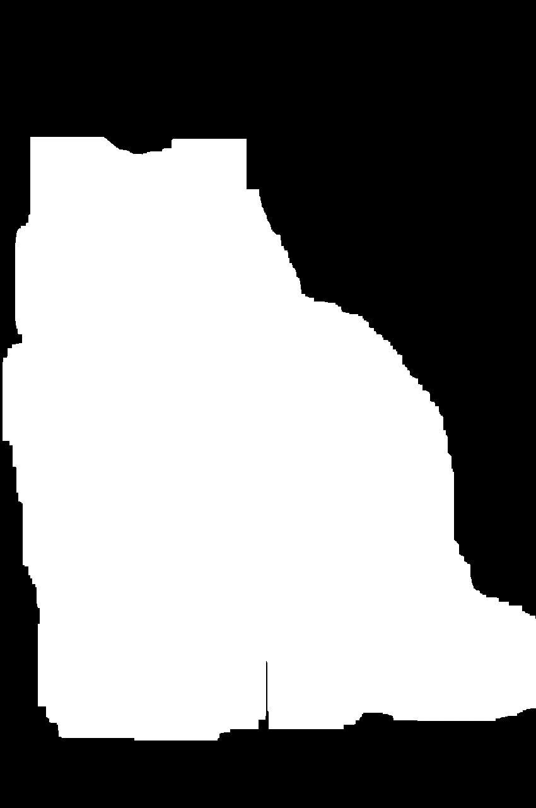](https://files.realpython.com/media/cat_6.177626a1f24d.jpg)

但是，这个面具太大了。因此，你可以用一系列腐蚀来完成这个过程:

>>>

```
>>> cat_mask = erode(45, step_2)
>>> cat_mask.show()` 
```

结果是一个遮罩，您可以使用它来分割猫的图像:

[](https://files.realpython.com/media/cat_7.8272aeccdbb9.jpg)

您可以通过模糊二进制蒙版来避免该蒙版的锐边。你必须先把它从二进制图像转换成灰度图像:

>>>

```
>>> cat_mask = cat_mask.convert("L")
>>> cat_mask = cat_mask.filter(ImageFilter.BoxBlur(20))
>>> cat_mask.show()` 
```

`BoxBlur()`过滤器返回以下掩码:

[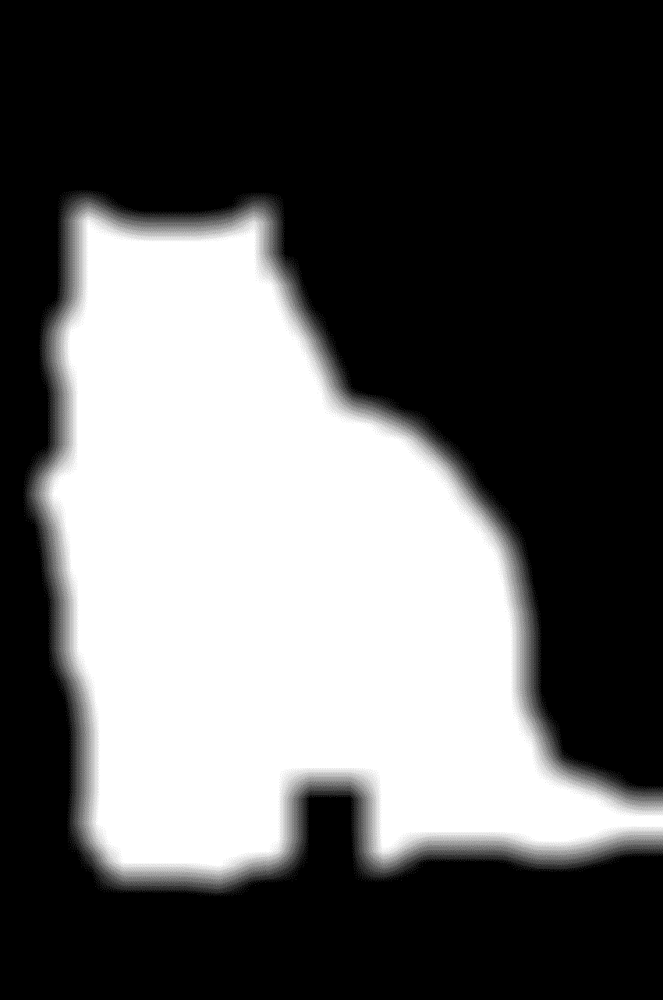](https://files.realpython.com/media/cat_mask.24785c3c5875.jpg)

面具现在看起来像一只猫！现在，您已经准备好从背景中提取猫的图像:

>>>

```
>>> blank = img_cat.point(lambda _: 0)
>>> cat_segmented = Image.composite(img_cat, blank, cat_mask)
>>> cat_segmented.show()` 
```

首先，创建一个与`img_cat`大小相同的空白图像。通过使用`.point()`并将所有值设置为零，从`img_cat`创建一个新的`Image`对象。接下来，使用`PIL.Image`中的 [`composite()`](https://pillow.readthedocs.io/en/stable/reference/Image.html#PIL.Image.composite) 函数创建一个由`img_cat`和`blank`组成的图像，使用`cat_mask`来确定每个图像的哪些部分被使用。合成图像如下所示:

[](https://files.realpython.com/media/cat_segmented.bd613e3f360d.jpg)

您已经分割了猫的图像，并从背景中提取了猫。

[*Remove ads*](/account/join/)

### *使用`Image.paste()`和叠加图像*

 *对于本教程，您可以更进一步，将猫的分段图像粘贴到图像库中的修道院庭院图像中:

>>>

```
>>> filename_monastery = "monastery.jpg"
>>> with Image.open(filename_monastery) as img_monastery:
...     img_monastery.load()

>>> img_monastery.paste(
...     img_cat.resize((img_cat.width // 5, img_cat.height // 5)),
...     (1300, 750),
...     cat_mask.resize((cat_mask.width // 5, cat_mask.height // 5)),
... )

>>> img_monastery.show()` 
```

你已经使用 [`.paste()`](https://pillow.readthedocs.io/en/stable/reference/Image.html#PIL.Image.Image.paste) 将一个图像粘贴到另一个图像上。此方法可以与三个参数一起使用:

*   第一个参数是您想要粘贴的**图像**。您正在使用整数除法运算符(`//`)将图像的大小调整为其大小的五分之一。
*   第二个参数是主图像中要粘贴第二张图片的位置。元组包括主图像中您想要放置要粘贴的图像左上角的坐标。
*   第三个参数提供了如果您不想粘贴整个图像时希望使用的**蒙版**。

您已经使用了从阈值处理、腐蚀和膨胀过程中获得的遮罩来粘贴没有背景的猫。输出如下图所示:

[](https://files.realpython.com/media/cat_monastery.c63df8376d54.jpg)

您已经从一个图像中分割出猫，并将其放入另一个图像中，以显示猫静静地坐在修道院的院子里，而不是在原始图像中它坐的地方。

### 水印的创建

在本例中，您的最后一项任务是将真正的 Python 徽标作为水印添加到图像中。您可以从本教程附带的存储库中获得带有真实 Python 徽标的图像文件:

**获取图像:** [点击此处获取您将使用 Pillow 操作和处理的图像](https://realpython.com/bonus/image-processing-with-the-python-pillow-library-images/)。

您应该继续在同一个 REPL 会话中工作:

>>>

```
>>> logo = "realpython-logo.png"
>>> with Image.open(logo) as img_logo:
...     img_logo.load()
...

>>> img_logo = Image.open(logo)
>>> img_logo.show()` 
```

这是彩色的全尺寸标志:

[](https://files.realpython.com/media/realpython-logo.655da081bdf1.png)

您可以将图像更改为灰度，并使用`.point()`将其转换为黑白图像。您还可以缩小它的大小并将其转换为轮廓图像:

>>>

```
>>> img_logo = img_logo.convert("L")
>>> threshold = 50
>>> img_logo = img_logo.point(lambda x: 255 if x > threshold else 0)
>>> img_logo = img_logo.resize(
...     (img_logo.width // 2, img_logo.height // 2)
... )
>>> img_logo = img_logo.filter(ImageFilter.CONTOUR)
>>> img_logo.show()` 
```

输出显示了真实 Python 徽标的轮廓。轮廓非常适合用作图像上的水印:

[](https://files.realpython.com/media/rp_outline.4bc2662e0345.jpg)

要使用它作为水印，你需要反转颜色，这样背景是黑色的，只有你想保留的轮廓是白色的。您可以再次使用`.point()`来实现这一点:

>>>

```
>>> img_logo = img_logo.point(lambda x: 0 if x == 255 else 255)
>>> img_logo.show()` 
```

您已经转换了值为`255`的像素，并给它们赋值`0`，将它们从白色像素转换为黑色像素。您将剩余的像素设置为白色。反向轮廓标志如下所示:

[](https://files.realpython.com/media/rp_outline_reverse.d533ba81cf09.jpg)

你的最后一步是将这个轮廓粘贴到坐在修道院院子里的猫的图像上。您可以再次使用`.paste()`:

>>>

```
>>> img_monastery.paste(img_logo, (480, 160), img_logo)
>>> img_monastery.show()` 
```

`.paste()`中的第一个参数表示您想要粘贴的图像，第三个参数表示遮罩。在这种情况下，您使用相同的图像作为遮罩，因为该图像是二进制图像。第二个参数提供要粘贴图像的区域的左上角坐标。

该图像现在包含一个真正的 Python 水印:

[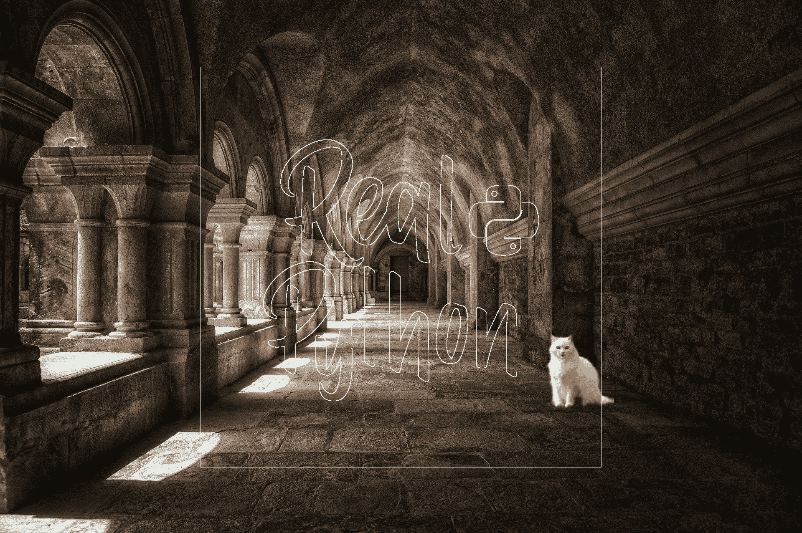](https://files.realpython.com/media/cat_monastery_final.885d2150e50b.jpg)

水印具有矩形轮廓，这是您之前使用的轮廓滤镜的结果。如果您想要移除此轮廓，您可以使用`.crop()`裁剪图像。这是一个你可以自己尝试的练习。

[*Remove ads*](/account/join/)

## *使用 NumPy 和枕头进行图像处理*

 *枕头有广泛的内置功能和过滤器的选择。然而，有时候你需要更进一步，在 Pillow 已经具备的功能之外处理图像。

您可以在 [NumPy](https://numpy.org) 的帮助下进一步处理图像。NumPy 是一个非常流行的用于处理数值数组的 Python 库，是使用 Pillow 的理想工具。你可以在 [NumPy 教程:Python 中数据科学的第一步](https://realpython.com/numpy-tutorial/)中了解更多关于 NumPy 的知识。

将图像转换为 NumPy 数组时，可以直接对数组中的像素执行所需的任何变换。一旦在 NumPy 中完成处理，就可以使用 Pillow 将数组转换回一个`Image`对象。您需要为该部分安装 NumPy:

```
(venv) $ python -m pip install numpy` 
```

现在您已经安装了 NumPy，您已经准备好使用 Pillow 和 NumPy 来发现两个图像之间的差异。

### 使用 NumPy 将图像相减

看看你是否能找出下面两张图片的不同之处:

[](https://files.realpython.com/media/spot_the_difference.45817e5a37c0.jpg)

这个不难！然而，你决定作弊，写一个 Python 程序为你解谜。您可以从本教程附带的存储库中下载图像文件`house_left.jpg`和`house_right.jpg` ( [图像信用](https://pixabay.com/users/creozavr-2567670/)):

**获取图像:** [点击此处获取您将使用 Pillow 操作和处理的图像](https://realpython.com/bonus/image-processing-with-the-python-pillow-library-images/)。

第一步是使用 Pillow 读取图像，并将其转换为 NumPy 数组:

>>>

```
>>> import numpy as np
>>> from PIL import Image

>>> with Image.open("house_left.jpg") as left:
...     left.load()
...
>>> with Image.open("house_right.jpg") as right:
...     right.load()
...

>>> left_array = np.asarray(left)
>>> right_array = np.asarray(right)

>>> type(left_array)
<class 'numpy.ndarray'>
>>> type(right_array)
<class 'numpy.ndarray'>` 
```

由于`left_array`和`right_array`是类型为`numpy.ndarray`的对象，您可以使用 NumPy 中所有可用的工具来操纵它们。您可以从一个数组中减去另一个数组，以显示两个图像之间的像素差异:

>>>

```
>>> difference_array =  right_array - left_array
>>> type(difference_array)
<class 'numpy.ndarray'>` 
```

当您从另一个相同大小的数组中减去一个数组时，结果是另一个与原始数组形状相同的数组。您可以使用 Pillow 中的`Image.fromarray()`将该数组转换为图像:

>>>

```
>>> difference = Image.fromarray(difference_array)
>>> difference.show()` 
```

从一个 NumPy 数组中减去另一个数组并转换成枕头`Image`的结果是下图所示的差值图像:

[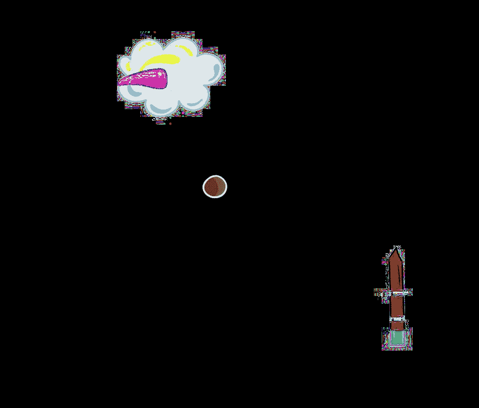](https://files.realpython.com/media/spot_the_difference_result.f737d379d3d8.jpg)

差异图像仅显示原始图像的三个区域。这些区域突出了两幅图像之间的差异。您还可以看到云和栅栏周围的一些噪声，这是由于这些项目周围区域的原始 JPEG 压缩中的微小变化。

### 使用 NumPy 创建图像

您可以更进一步，使用 NumPy 和 Pillow 从头开始创建图像。您可以从创建灰度图像开始。在本例中，您将创建一个包含正方形的简单图像，但您可以用同样的方法创建更复杂的图像:

>>>

```
>>> import numpy as np
>>> from PIL import Image

>>> square = np.zeros((600, 600))
>>> square[200:400, 200:400] = 255

>>> square_img = Image.fromarray(square)
>>> square_img
<PIL.Image.Image image mode=F size=600x600 at 0x7FC7D8541F70>

>>> square_img.show()` 
```

您创建了一个大小为`600x600`的数组，其中处处都包含零。接下来，将数组中心的一组像素的值设置为`255`。

您可以使用行和列来索引 NumPy 数组。在本例中，第一个片层`200:400`，代表行`200`到`399`。逗号后面的第二个片段`200:400`表示从`200`到`399`的列。

您可以使用`Image.fromarray()`将 NumPy 数组转换成类型为`Image`的对象。上面代码的输出如下所示:

[](https://files.realpython.com/media/square_gray.deff7490541e.jpg)

您已经创建了一个包含正方形的灰度图像。当您使用`Image.fromarray()`时，会自动推断图像的模式。在这种情况下，使用模式`"F"`，其对应于具有 32 位浮点像素的图像。如果您愿意，可以将其转换为更简单的 8 位像素灰度图像:

>>>

```
>>> square_img = square_img.convert("L")` 
```

你还可以更进一步，创建一个彩色图像。您可以重复上述过程来创建三个图像，一个对应于红色通道，另一个对应于绿色通道，最后一个对应于蓝色通道:

>>>

```
>>> red = np.zeros((600, 600))
>>> green = np.zeros((600, 600))
>>> blue = np.zeros((600, 600))
>>> red[150:350, 150:350] = 255
>>> green[200:400, 200:400] = 255
>>> blue[250:450, 250:450] = 255

>>> red_img = Image.fromarray(red).convert("L")
>>> green_img = Image.fromarray(green).convert("L")
>>> blue_img = Image.fromarray((blue)).convert("L")` 
```

您从每个 NumPy 数组创建一个`Image`对象，并将图像转换为代表灰度的模式`"L"`。现在，您可以使用`Image.merge()`将这三个单独的图像合并成一个 RGB 图像:

>>>

```
>>> square_img = Image.merge("RGB", (red_img, green_img, blue_img))
>>> square_img
<PIL.Image.Image image mode=RGB size=600x600 at 0x7FC7C817B9D0>

>>> square_img.show()` 
```

`Image.merge()`中的第一个参数是图像输出的模式。第二个参数是包含单个单波段图像的序列。这段代码创建了以下图像:

[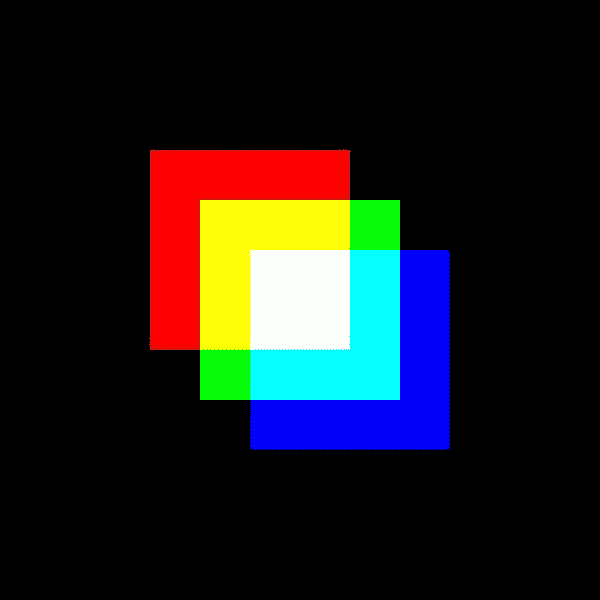](https://files.realpython.com/media/square_color.f9971d72141d.jpg)

您已经将单独的波段组合成一幅 RGB 彩色图像。在下一节中，您将更进一步，使用 NumPy 和 Pillow 创建一个 GIF 动画。

### 制作动画

在上一节中，您创建了一个包含三个不同颜色的重叠方块的彩色图像。在本节中，您将创建一个动画，显示这三个正方形合并成一个白色正方形。您将创建包含三个正方形的图像的多个版本，正方形的位置在连续的图像之间会略有不同:

>>>

```
>>> import numpy as np
>>> from PIL import Image

>>> square_animation = []
>>> for offset in range(0, 100, 2):
...     red = np.zeros((600, 600))
...     green = np.zeros((600, 600))
...     blue = np.zeros((600, 600))
...     red[101 + offset : 301 + offset, 101 + offset : 301 + offset] = 255
...     green[200:400, 200:400] = 255
...     blue[299 - offset : 499 - offset, 299 - offset : 499 - offset] = 255
...     red_img = Image.fromarray(red).convert("L")
...     green_img = Image.fromarray(green).convert("L")
...     blue_img = Image.fromarray((blue)).convert("L")
...     square_animation.append(
...         Image.merge(
...             "RGB",
...             (red_img, green_img, blue_img)
...         )
...     )
...` 
```

您创建一个名为`square_animation`的空列表，用于存储您生成的各种图像。在`for`循环中，您为红色、绿色和蓝色通道创建 NumPy 数组，正如您在上一节中所做的那样。包含绿色层的数组总是相同的，表示图像中心的一个正方形。

红色方块从偏离中心左上角的位置开始。在每一个连续的帧中，红色方块向中心移动，直到它在循环的最后一次迭代中到达中心。蓝色方块最初向右下角移动，然后随着每次迭代向中心移动。

注意，在这个例子中，您正在迭代`range(0, 100, 2)`，这意味着变量`offset`以两步增加。

您之前已经了解到可以使用`Image.save()`将`Image`对象保存到文件中。您可以使用相同的功能保存到包含一系列图像的 GIF 文件。您对序列中的第一幅图像调用`Image.save()`，这是您存储在列表`square_animation`中的第一幅图像:

>>>

```
>>> square_animation[0].save(
...     "animation.gif", save_all=True, append_images=square_animation[1:]
... )` 
```

`.save()`中的第一个参数是您想要保存的文件的文件名。文件名中的扩展名告诉`.save()`它需要输出什么文件格式。您还在`.save()`中包含了两个关键字参数:

*   `save_all=True`确保保存序列中的所有图像，而不仅仅是第一张。
*   `append_images=square_animation[1:]`允许您将序列中的剩余图像附加到 GIF 文件中。

这段代码将`animation.gif`保存到文件中，然后您可以用任何图像软件打开 GIF 文件。默认情况下，GIF 应该是循环的，但是在一些系统中，你需要添加关键字参数`loop=0`到`.save()`来确保 GIF 循环。你得到的动画如下:

[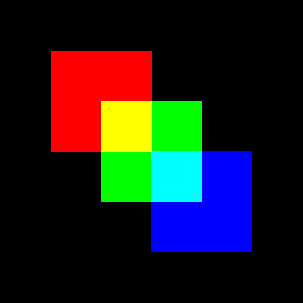](https://files.realpython.com/media/animation_looped.c5622d616183.gif)

三个不同颜色的方块合并成一个白色方块。你能使用不同的形状和不同的颜色创建你自己的动画吗？

## 结论

您已经学习了如何使用 Pillow 处理图像和执行图像处理。如果你喜欢处理图像，你可能想一头扎进图像处理的世界。关于图像处理的理论和实践，还有很多东西需要学习。一个很好的起点是 Gonzalez 和 Woods 的 [*数字图像处理*，这是这个领域的经典教材。](https://realpython.com/asins/9353062985/)

Pillow 并不是 Python 中唯一可以用于图像处理的库。如果您的目标是执行一些基本的处理，那么您在本教程中学到的技术可能就是您所需要的。如果您想更深入地研究更高级的图像处理技术，例如机器学习和计算机视觉应用，那么您可以使用 Pillow 作为进入 OpenCV 和 scikit-image 等其他库的垫脚石。

**在本教程中，您已经学会了如何:**

*   **用枕头阅读图片**
*   执行**基本图像操作**操作
*   使用枕头进行**图像处理**
*   使用带枕头的 **NumPy** 进行**的进一步加工**
*   **使用 Pillow 制作动画**

现在，浏览计算机上图像文件夹中的图像，选择一些可以使用 Pillow 读入的图像，决定如何处理这些图像，然后对它们进行一些图像处理。玩得开心！*************