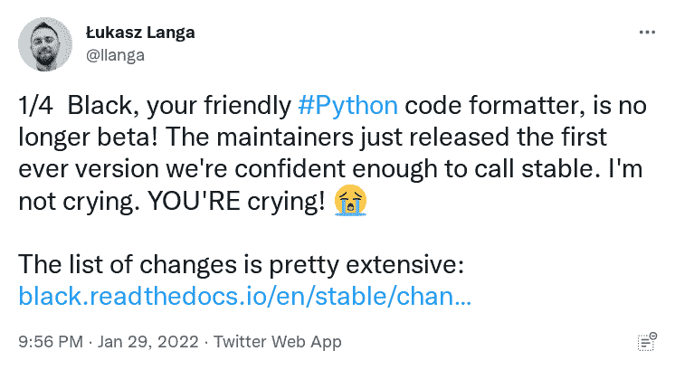
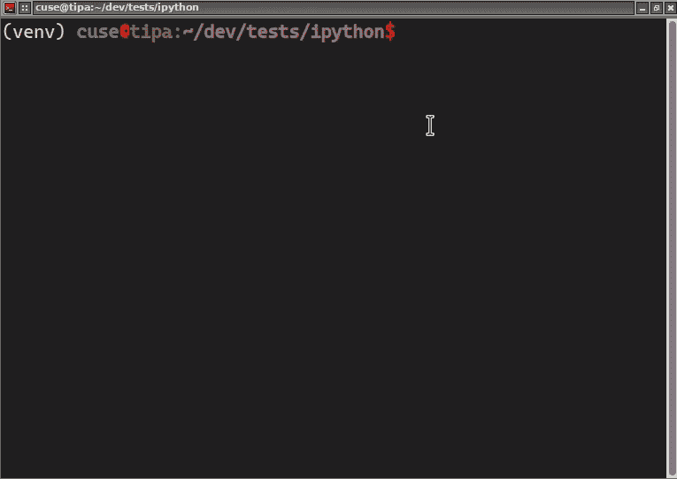
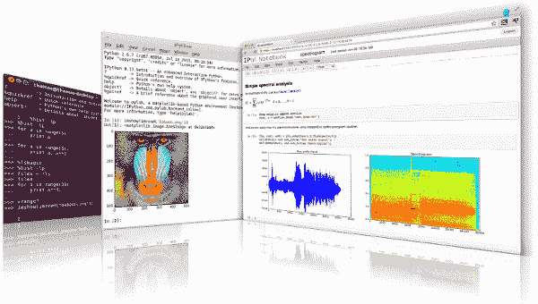

# Python 新闻:2022 年 1 月有什么新消息

> 原文:[https://realpython.com/python-news-january-2022/](https://realpython.com/python-news-january-2022/)

在 2022 年 1 月的**，代码格式化程序**布莱克**看到了它的第一个非测试版本，并发布了一个新的稳定性政策。 **IPython** ，强大的交互式 Python shell，标志着**版本 8.0** 的发布，这是其三年来的第一个主要版本发布。此外， **PEP 665** ，旨在通过指定锁文件的格式使可复制的安装更容易，被拒绝。最后但同样重要的是，Python 中一个 15 年前的**内存泄漏** bug 被修复。**

让我们深入了解过去一个月最大的 **Python 新闻**故事！

**免费奖励:** 并学习 Python 3 的基础知识，如使用数据类型、字典、列表和 Python 函数。

## 不再黑贝塔

固执己见的代码格式器 [Black](https://github.com/psf/black) 的开发者现在有足够的信心称最新版本是稳定的。此次发布首次将 Black 带出测试版:

[](https://files.realpython.com/media/black-stable-release-tweet.065a0058c46f.png)

<figcaption class="figure-caption text-center">[Image source](https://twitter.com/llanga/status/1487530230512295940?t=OOt8LufaUk0ex6iRgcKk9Q&s=19)</figcaption>

代码格式可能是开发人员之间大量冲突的根源。这就是为什么代码格式化程序，或者说 [linters](https://en.wikipedia.org/wiki/Lint_(software)) ，有助于执行风格约定，以保持整个代码库的一致性。Linters 建议更改，而代码格式化程序重写您的代码:

[](https://files.realpython.com/media/ipython-demo-2.e79f3df9cb73.gif)

这使您的代码库更加一致，有助于及早发现错误，并使代码更容易扫描。

YAPF 是格式化程序的一个例子。默认情况下，它带有 [PEP 8](https://www.python.org/dev/peps/pep-0008/) 风格指南，但它并不固执己见，给你很多对其配置的控制。

Black 走得更远:它带有 PEP 8 兼容风格，但总的来说，它是*不*可配置的。不允许配置背后的想法是，通过放弃对风格的控制，您可以解放您的大脑，专注于实际的代码。许多人认为这种限制给了他们更多的自由去成为有创造力的程序员。但是当然，并不是所有人都喜欢放弃这种控制权！

像布莱克这样固执己见的格式化者的一个重要特征是，他们让你的[差异](https://en.wikipedia.org/wiki/Diff)更具信息性。如果你曾经向你的版本控制系统提交过*清理*或*格式化*的提交，你可能已经无意中污染了你的 diff。

使用可配置的格式化程序，或者不使用格式化程序，在项目中途更改或实施样式会使功能代码的更改难以跟踪。这是因为差异会带来风格上的变化和功能上的代码变化，这可能需要很长时间才能理清。

但是，如果您在整个项目中使用黑色，那么您可以确信您的 diff 将只显示功能性的代码更改。

随着 Black 的第一个稳定发布，一个新的[稳定政策](https://black.readthedocs.io/en/stable/the_black_code_style/index.html#stability-policy)也随之而来，它旨在明确你可以从 Black 的稳定发布中期待什么。

稳定性策略主要关注如何处理格式更改。Python 在不断发展，偶尔 Black 对自己的风格做一点小小的改变也是有意义的。稳定性政策将阻止 Black 在给定的日历年内进行此类更改。

稳定性策略保证，在给定的一月中，任何用黑色格式化的代码将在该年的十二月中产生完全相同的输出，而不管黑色的任何内部变化。黑色的版本号也与年份相关联，因此版本 22 对应于 2022 年期间的黑色。当 2023 年到来时，布莱克将发布第 23 版。如果有任何样式的改变，它们将会在 23 版中应用，而不是之前。

黑色已经相当受欢迎，这个新的稳定版本可能会增加它的采用。

[*Remove ads*](/account/join/)

## *IPython 8.0 的发布*

 *在 IPython 7.0 发布三年后，本月发布了 IPython 8.0。这个新版本反映了大量的协作努力，包含了 250 多个拉取请求。主要亮点是默认的黑色格式、改进的回溯和改进的建议。

IPython 是由[费尔南多·佩雷斯](https://twitter.com/fperez_org)在 21 世纪初创建的，据说是在他拖延大学学业的时候。IPython 的核心是一个交互式 shell，可以用来替代 Python 的默认 REPL。它包括诸如语法高亮、[自动建议](https://ipython.readthedocs.io/en/stable/whatsnew/version8.html?highlight=autosuggestion#autosuggestons)和代码完成等便利功能:

[](https://files.realpython.com/media/ipython-demo.647d3f16c414.gif)

IPython 被用作 Jupyter Notebook 的 Python 内核，这是一个以类似文档的格式显示代码执行的程序。科学家和教育工作者经常使用它以更广为人知的格式显示 Python 代码，包括优雅的输出或富文本格式:

[](https://files.realpython.com/media/jupyter-notebook-demo.3cacca5b8f94.png)

<figcaption class="figure-caption text-center">[Image source](https://ipython.org/)</figcaption>

有关 Jupyter 功能的更多信息，请查看[Jupyter 笔记本简介](https://realpython.com/jupyter-notebook-introduction/)。

从开发人员的角度来看，开发最新版本的最重要的工作之一是关注代码库的精简。这一努力得到了回报，将代码库从 348 个文件的 37，500 行代码减少到 294 个文件的 36，100 行代码！

该版本还发布了一个关于[经验教训的总结，其中包含了一些给开发者的智慧之言。](https://labs.quansight.org/blog/2022/01/ipython-8.0-lessons-learned-maintaining-software/)

## PEP 665 -被拒绝

PEP 665 本月被[指导委员会](https://realpython.com/python-news-december-2021/#python-steering-council-elections)否决。这个有点争议的 PEP 旨在使 Python 的可复制安装更加容易。

大多数包管理器都有一个锁文件。Python 生态系统中的一个这样的文件是 [`poetry.lock`文件](https://python-poetry.org/docs/basic-usage#installing-without-poetrylock)，你可以在[诗歌](https://realpython.com/dependency-management-python-poetry/)中找到它。 [Pipenv](https://realpython.com/pipenv-guide/) 也有自己的[锁文件](https://pipenv-fork.readthedocs.io/en/latest/basics.html#pipenv-lock)。

你可以把一个锁文件想象成一个更加详细的 [`requirements.txt`](https://realpython.com/what-is-pip/#using-requirement-files) 文件。它更详细地介绍了用于安装的确切文件、版本甚至安装程序。锁定文件有助于跨环境、大型团队或用户群进行可重复的设置。PEP 665 旨在标准化锁文件格式。

关于更详细的讨论，请查看 PEP 作者、Python 核心开发者 [Brett Cannon](https://twitter.com/brettsky) 的[真实 Python 播客第 93 集](https://realpython.com/podcasts/rpp/93/)。这个播客是在 PEP 被否决之前录制的。

根据批评者的说法，这个 PEP 有所欠缺，因为它要求所有的包都作为[轮](https://pythonwheels.com/)分发，并且留下了一些关于如何准确处理[列表](https://packaging.python.org/en/latest/glossary/#term-Source-Distribution-or-sdist)(源代码分发)包的疑问。有关轮子和目录的更多详细信息，请查看[什么是 Python 轮子，为什么要关注？](https://realpython.com/python-wheels/)

在播客中，Brett Cannon 将 Python 称为“世界的粘合代码”，这要归功于 Python 能够整合来自其他语言的库，如 C、Go 和 Rust。当安装一个依赖于其他语言的包时，Python 有很多工作要做，以确保一切设置正确。这项工作并不总是成功的，这给 Python 社区带来了一些挫折。

编写 PEP 665 是为了解决安装的棘手问题，以及在不同系统上安装略有不同的缺陷。虽然它被否决了，但在这个问题上仍有许多工作要做。一些相关的 pep 有:

*   [PEP 643](https://www.python.org/dev/peps/pep-0643/) -软件包源分发的元数据
*   [PEP 621](https://www.python.org/dev/peps/pep-0621/) -在`pyproject.toml`中存储项目元数据
*   PEP 650 -指定 Python 项目的安装要求

我们在 Real Python 要特别感谢 Brett Cannon，他也是 PEP 621 和 PEP 650 的作者，感谢他在这一领域的持续努力。

至少现在，Python 不会标准化一个锁文件格式，而像 poem 和 Pipenv 这样的工具将继续拥有它们自己的版本。

你想看看标准化的锁文件吗？您在复制安装时遇到过问题吗？我们很想在下面的评论中听到你的意见！

[*Remove ads*](/account/join/)

## *十五岁的 Bug，修复！*

 *维克多·斯丁纳表现出非凡的坚韧，他将一个[15 岁的臭虫](https://bugs.python.org/issue1635741)标记为[“已修复”](https://twitter.com/VictorStinner/status/1486728048988753923?t=GEgYCRCCmy0S8jS-q_qBiQ&s=19)。

这个 bug 是由 [Ben Sizer](https://twitter.com/kylotan) 在 2007 年提出的，显示 Python 在退出时有一个[内存泄漏](https://en.wikipedia.org/wiki/Memory_leak)。也就是说，Python 不会释放它已经使用的所有内存。就像当[处理文件](https://realpython.com/working-with-files-in-python/)时你应该如何关闭文件对象一样，程序应该在不再需要内存时释放内存。

由于这是各种程序相对常见的问题，操作系统通常会在应用程序退出后自行清理。自动清理意味着这个内存泄漏错误的影响相对较小，不会影响大多数用户。然而，对于启动许多 Python 子进程的程序来说，这是一个问题，正如错误报告中发布的演示 C 程序所示:

```
#include  <Python.h> int  main(int  argc,  char  *argv[]) { Py_Initialize();  Py_Finalize(); Py_Initialize();  Py_Finalize(); Py_Initialize();  Py_Finalize(); Py_Initialize();  Py_Finalize(); Py_Initialize();  Py_Finalize(); Py_Initialize();  Py_Finalize(); Py_Initialize();  Py_Finalize(); }` 
```

这个程序多次启动和结束 Python，导致越来越多的未释放引用，这代表了内存泄漏。要了解更多关于内存和内存管理的知识，请查看 Python 中的[内存管理。](https://realpython.com/python-memory-management/)

这些泄密范围很广，来自几个不同的来源。经过了无数次的修改和十五年(！)将 bug 减少到值得将其标记为“已修复”的程度仍然有一些内存泄漏，但现在已经足够好了。谢谢你，维克多·斯坦纳！

## Python 的下一步是什么？

一月份你最喜欢的 Python 新闻是什么？我们错过了什么值得注意的吗？请在评论中告诉我们，我们可能会在下个月的 Python 新闻综述中介绍您。

快乐的蟒蛇！**