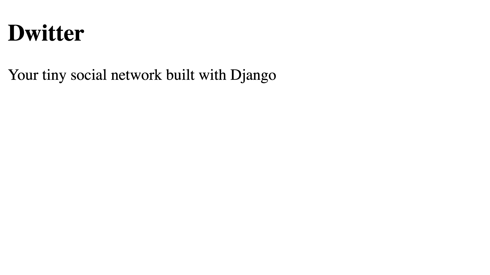
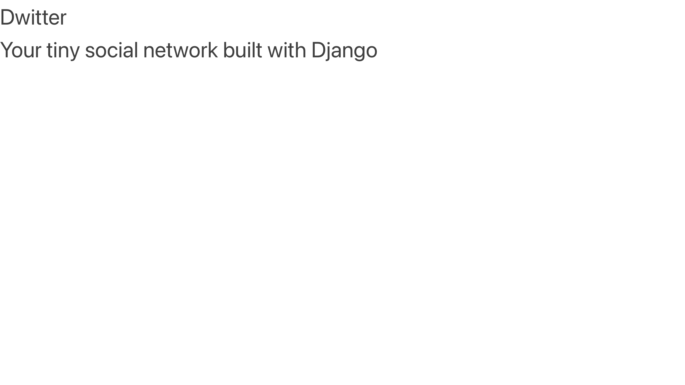
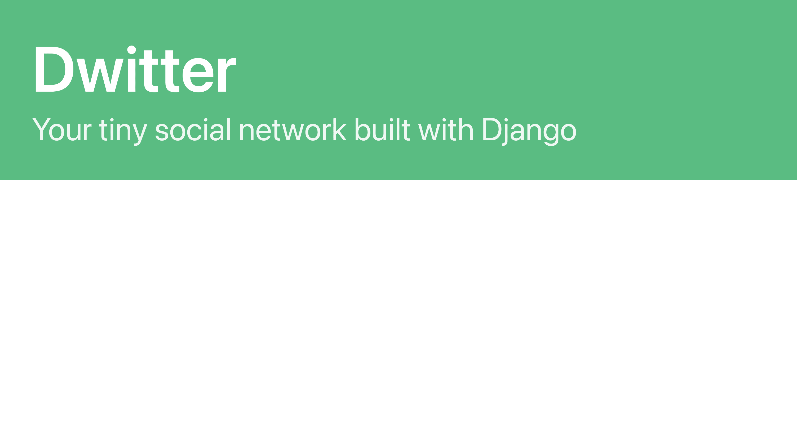
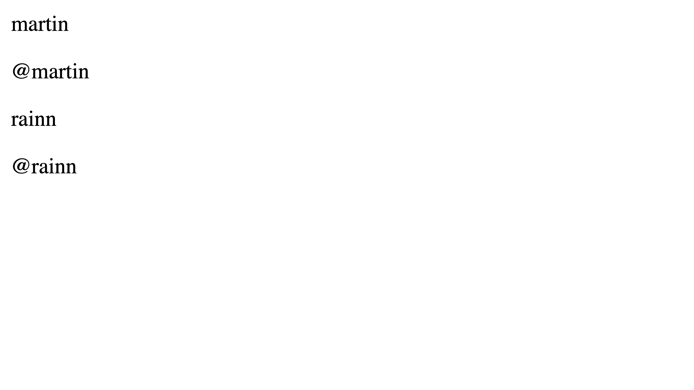
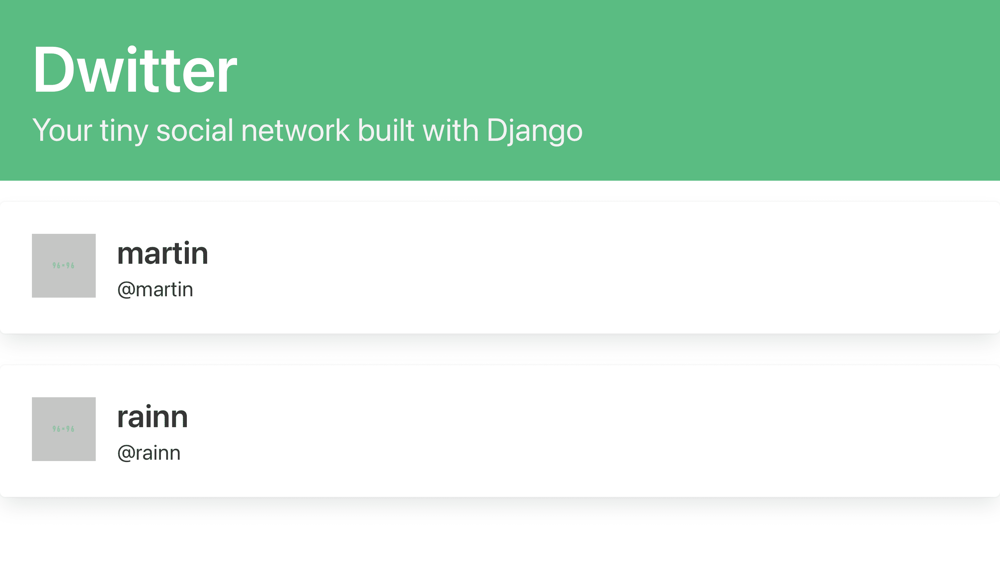
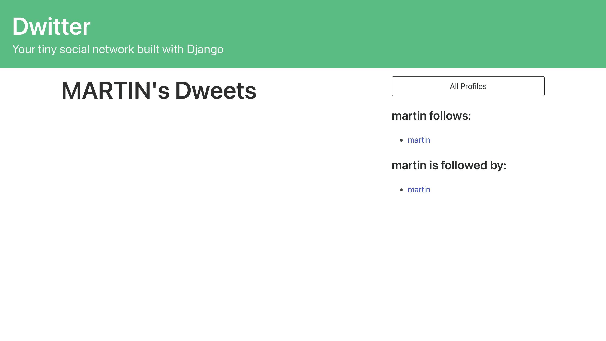

# 与布尔玛一起构建 Django 前端—第 2 部分

> 原文:[https://realpython.com/django-social-front-end-2/](https://realpython.com/django-social-front-end-2/)

在这个由四部分组成的教程系列中，您将与 Django 一起构建一个社交网络，您可以在文件夹中展示这个网络。这个项目将加强你对 Django 模型之间关系的理解，并向你展示如何使用表单，以便用户可以与你的应用程序以及彼此之间进行交互。通过使用布尔玛 CSS 框架，你还可以让你的 Django 前端看起来更好。

在[第一部分](https://realpython.com/django-social-network-1/)中，您扩展了 Django `User`模型，添加了允许用户相互关注和取消关注的个人资料信息。您还了解了如何定制 Django 管理界面，以及如何在开发过程中借助 Django 的错误消息进行故障排除。

在本系列教程的第二部分，您将学习如何:

*   整合**布尔玛 CSS** 和**风格**你的应用
*   使用**模板继承**来减少重复
*   在**文件夹层次结构**中构建 Django 模板
*   构建**路由**和**查看功能**
*   **使用**动态网址**链接应用程序的**个页面

完成这个项目的第二部分后，你将继续这个教程系列的第三部分，在这里你将创建一个向你的社交网络添加内容的后端。您还将添加缺少的模板，以允许您的用户在其仪表板页面上查看基于文本的内容。

你可以点击下面的链接，进入`source_code_start/`文件夹，下载启动项目第二部分所需的代码:

**获取源代码:** [点击此处获取构建 Django 社交网络的源代码](https://realpython.com/bonus/django-social-front-end-2-project-code/)。

## 演示

在这个由四部分组成的教程系列中，您将构建一个小型社交网络，允许用户发布基于文本的简短消息。您的应用程序用户还可以关注其他用户简档以查看这些用户的帖子，或者取消关注他们以停止查看他们基于文本的帖子:

[https://player.vimeo.com/video/643455270?background=1](https://player.vimeo.com/video/643455270?background=1)

在本系列的第二部分中，您将使用模板并学习使用 CSS 框架布尔玛来为您的应用程序提供用户友好的外观。您还将处理一些常见任务，例如为个人用户资料页面设置路由、视图和模板，以及将它们与资料列表页面链接起来:

[https://player.vimeo.com/video/643455162?background=1](https://player.vimeo.com/video/643455162?background=1)

在本系列教程的这一部分结束时，您将能够访问详细信息页面和简档列表页面，并在它们之间导航。您还将添加布尔玛来设计页面样式。

[*Remove ads*](/account/join/)

## *项目概述*

 *在这一节中，您将对本系列教程的第二部分中涉及的主题有一个概述。您还将有机会重温完整的项目实现步骤，以防您需要从本系列的前一部分跳回到上一步，或者如果您想看看前面还有什么。

此时，您应该已经完成了本教程系列的第一部分。如果是的话，那么您已经准备好继续下一步了，这一步的重点是模板和前端样式:

|   |   |
| --- | --- |
| **第四步** | [用布尔玛创建一个基础模板](#step-4-create-a-base-template-with-bulma) |
| **第五步** | [列出所有用户资料](#step-5-list-all-user-profiles-on-the-front-end-of-your-django-app) |
| **第六步** | [访问个人资料页面](#step-6-access-individual-profile-pages) |

完成该系列第二部分的所有步骤后，您可以继续进行第三部分[。](https://realpython.com/django-social-post-3/)

为了让你回忆起来，并对如何构建 Django 社交网络这一系列的四个部分有一个大致的了解，你可以展开下面的可折叠部分:


在本系列的多个独立教程中，您将分多个步骤实现该项目。有很多内容需要讨论，您将一路深入细节:

[**《✅》第一部分:模型与关系**](https://realpython.com/django-social-network-1/)

*   **步骤 1:** 设置基础项目
*   步骤 2: 扩展 Django 用户模型
*   **步骤 3:** 实现一个保存后挂钩

[**📍第二部分:模板和前端造型**T3](https://realpython.com/django-social-front-end-2/)

*   第四步:用布尔玛创建一个基础模板
*   **第 5 步:**列出所有用户资料
*   **第 6 步:**访问个人资料页面

[**⏭第三部分:跟踪和简报**T3】](https://realpython.com/django-social-post-3/)

*   **第 7 步:**关注和取消关注其他个人资料
*   **步骤 8:** 为 Dweets 创建后端逻辑
*   **第九步:**在前端显示 Dweets

[**⏭第四部分:表格和提交材料**](https://realpython.com/django-social-forms-4/)

*   **步骤 10:** 通过 Django 表单提交 Dweets
*   **步骤 11:** 防止重复提交并处理错误
*   **第十二步:**改善前端用户体验

这些步骤中的每一步都将提供任何必要资源的链接。通过一次完成一个步骤，你将有机会停下来，在你想休息一下的时候再回来。

记住了本系列教程的高级结构，您就可以很好地了解自己所处的位置以及将在后面的部分中处理的实现步骤。

在开始下一步之前，快速浏览一下先决条件，浏览一下可能有帮助的其他资源的链接。

## 先决条件

为了成功地完成项目的这一部分，你需要完成关于模型和关系的第一部分，并且你应该确认你的项目正在如那里所描述的那样工作。最好你也能熟悉以下概念:

*   在 Python 中使用[面向对象编程](https://realpython.com/python3-object-oriented-programming/)
*   [建立 Django 基础项目](https://realpython.com/django-setup/)
*   管理[路由和重定向](https://realpython.com/django-redirects/)，[查看功能](https://realpython.com/django-view-authorization/)，模板，模型，以及 Django 中的[迁移](https://realpython.com/django-migrations-a-primer/)
*   使用和[定制 Django 管理界面](https://realpython.com/customize-django-admin-python/)
*   使用类属性读写 [HTML](https://realpython.com/html-css-python/)

请记住，现在您应该已经完成了本系列的第一部分。这第二部分将从你在那一部分结束时停下的地方继续。

**注意:**如果您没有准备好第一部分的工作项目，您将无法继续本系列教程的这一部分。

您也可以通过点击下面的链接并转到`source_code_start/`文件夹来下载启动该项目第二部分所需的代码:

**获取源代码:** [点击此处获取构建 Django 社交网络的源代码](https://realpython.com/bonus/django-social-front-end-2-project-code/)。

关于额外的先决条件和进一步的链接，请查看本系列教程第一部分中提到的关于在 Django 构建基本社交网络的[先决条件](https://realpython.com/django-social-network-1/#prerequisites)。

## 步骤 4:用布尔玛创建一个基础模板

完成本教程系列的前三个步骤(您可以在第一部分中补上)后，您的用户配置文件现在会在您创建新用户时自动创建。用户简档包含用户关注哪些其他简档的信息。

在这一步的最后，你已经建立了模板文件夹结构，并创建了一个使用**布尔玛 CSS 框架**的基本模板，用于现代用户界面。

很有可能，你打算把这个项目展示给其他人，或者把它添加到你的文件夹中。然而，当你没有面向用户的一面时，一个投资组合项目只有一半令人印象深刻。即使你的主要兴趣是后端开发，如果你的项目看起来很好，你的投资组合也会看起来更好。

**注意:**大多数大公司将产品前端和后端的职责划分给不同的开发团队，包括与 Django 合作时。然而，对如何不用太多努力就能让你的网站项目看起来不错有一个基本的理解是很有帮助的。

您将使用 Django 模板构建 web 应用程序的前端，框架通过请求 HTML 页面来呈现这些模板，您的用户将与这些页面进行交互。

[*Remove ads*](/account/join/)

### *创建一个基础模板*

 *首先，您将在`dwitter/`内的专用文件夹中为您的应用程序模板创建一个位置:

```py
dwitter/
│
├── migrations/
│
├── templates/ │
├── __init__.py
├── admin.py
├── apps.py
├── models.py
├── tests.py
└── views.py
```

`templates/`文件夹将保存与您的`dwitter`应用程序相关的所有模板。在这个文件夹中添加一个新文件，命名为`base.html`:

```py
dwitter/
│
├── migrations/
│
├── templates/
│   └── base.html │
├── __init__.py
├── admin.py
├── apps.py
├── models.py
├── tests.py
└── views.py
```

你的`dwitter`应用程序的文件夹结构应该像你上面看到的树形结构，其中`base.html`嵌套在`templates/`中。

你现在可以打开`base.html`并添加基本的 HTML 结构，你的所有模板将通过[模板继承](https://docs.djangoproject.com/en/3.2/ref/templates/language/#template-inheritance)共享该结构:

```py
 1<!-- dwitter/templates/base.html -->
 2
 3<!DOCTYPE html>
 4<html lang="en">
 5<head>
 6    <meta charset="UTF-8">
 7    <meta http-equiv="X-UA-Compatible" content="IE=edge">
 8    <meta name="viewport" content="width=device-width, initial-scale=1.0">
 9    <title>Dwitter</title> 10</head>
11<body>
12    <section> 13        <h1>Dwitter</h1> 14        <p>Your tiny social network built with Django</p> 15    </section> 16    <div>
17         18 19         20    </div>
21</body>
22</html>
```

此 HTML 代码由一个样板 HTML 结构组成，并添加了一些特定于您的应用程序的内容，您希望在所有页面上都看到这些内容:

*   **第 9 行:**你给你的网络应用添加一个标题，它将显示在所有页面的浏览器标签中。
*   **第 12 行到第 15 行:**你添加一个标题和一个副标题。如果愿意，您可以自定义它们。
*   **第 17 到 19 行:**您添加了 [`block`](https://docs.djangoproject.com/en/3.2/ref/templates/builtins/#std:templatetag-block) Django 模板标签，这打开了您的子模板可以将它们的内容注入到基础模板的空间。

请随意将这段代码复制粘贴到您的文件中。理解为什么要使用模板继承以及子模板如何扩展`base.html`的主要概念就足够了。

### 查看您的基础模板

在开发代码时查看代码的结果通常会很有帮助。要让 Django 呈现和显示您的基本模板，您需要设置 URL 路由和查看功能。

在你称为`social`的管理应用中打开你的主`urls.py`文件，然后将指向基本 URL 的请求转发到你的`dwitter`应用:

```py
 1# social/urls.py
 2
 3from django.contrib import admin
 4from django.urls import path, include 5
 6urlpatterns = [
 7    path("", include("dwitter.urls")), 8    path("admin/", admin.site.urls),
 9]
```

在第 4 行，您从`django.urls`导入`include`，然后在第 7 行使用它将所有对基本 URL ( `""`)的请求重定向到您的`dwitter`应用程序的`urls.py`文件。稍后，您将更改该文件中的代码，以进一步分发传入的请求。

**注意:**默认情况下，Django 应用不会自带`urls.py`文件。然而，最好在你的 Django 项目中为每个应用程序创建一个 URL 配置，然后[将它们包含在你的主 URLconf](https://docs.djangoproject.com/en/3.2/topics/http/urls/#including-other-urlconfs) 中。对于每个新的应用程序，你需要创建一个新的`urls.py`文件。

您现在可以创建您的`dwitter`应用程序的`urls.py`文件，这样您就可以继续遵循请求通过您的项目的路径。这个文件应该位于`dwitter/`中其他 Python 文件的旁边:

```py
dwitter/
│
├── migrations/
│
├── templates/
│   └── base.html
│
├── __init__.py
├── admin.py
├── apps.py
├── models.py
├── tests.py
├── urls.py └── views.py
```

创建完`dwitter/urls.py`后，您可以打开文件并添加一些代码。这个文件的基本结构应该类似于`social/urls.py`，但是不需要处理`/admin`路径。捕捉对重定向到该文件的基本 URL 的传入请求，并将其发送到一个名为`dashboard`的新函数:

```py
# dwitter/urls.py

from django.urls import path
from .views import dashboard

app_name = "dwitter"

urlpatterns = [
    path("", dashboard, name="dashboard"),
]
```

在这段代码中，您从应用程序的`views.py`文件中导入一个名为`dashboard`的视图函数。注意，你还没有创建`dashboard()`。此时，当您运行开发服务器时，您会遇到一条有用的错误消息，它会告诉您关于它的所有信息:

```py
File "/<your_path>/dwitter/urls.py", line 2, in <module>
 from .views import dashboard
ImportError: cannot import name 'dashboard' from 'dwitter.views'
(/<your_path>/dwitter/views.py)
```

Django 在您的终端中告诉您，它不能从`dwitter.views`导入名为`dashboard`的东西。这条错误消息让您知道下一步该去哪里。继续在`views.py`中创建`dashboard()`，让 Django 开心，并恢复你的应用程序的功能:

```py
# dwitter/views.py

from django.shortcuts import render

def dashboard(request):
    return render(request, "base.html")
```

使用`dashboard()`，您将传入的请求指向`base.html`,并告诉 Django 呈现该模板。如果您的开发服务器尚未运行，请启动它:

```py
(social) $ python manage.py runserver
```

在`localhost:8000/`导航到您的基本 URL，您应该看到您在基本模板中输入的文本现在呈现在您的浏览器中:

[](https://files.realpython.com/media/ds-main-plain.cbe9b3ac711d.png)

确实有一些文字，但是看起来不怎么样。会有很多人有兴趣加入一个只提供纯 HTML 文本的社交网络吗？

[*Remove ads*](/account/join/)

### *将布尔玛 CSS 添加到你的基础模板*

 *你可以通过添加 **CSS** 来改善你的 HTML 的外观。但是编写自己的 CSS 文件可能需要大量的工作！CSS 框架是一个很好的选择，可以帮助你用更少的努力让你的 web 应用看起来更好。

在本教程中，你将使用 CSS 框架[布尔玛](https://bulma.io)为你处理 CSS 规则。首先，您需要让[布尔玛 CSS 样式表](https://cdn.jsdelivr.net/npm/bulma@0.9.3/css/bulma.min.css)对您的所有模板可用。一个快速的方法是添加一个样式表文件的链接，该文件托管在一个[内容交付网络(CDN)](https://en.wikipedia.org/wiki/Content_delivery_network) 上，链接到基本模板的`<head>`元素:

```py
<!-- dwitter/templates/base.html -->

<!DOCTYPE html>
<html lang="en">
<head>
    <meta charset="UTF-8">
    <meta http-equiv="X-UA-Compatible" content="IE=edge">
    <meta name="viewport" content="width=device-width, initial-scale=1.0">
    <!-- Include the Bulma CSS framework for styling -->
 <link rel="stylesheet" href="https://cdn.jsdelivr.net/npm/bulma@0.9.3/css/bulma.min.css">    <title>Dwitter</title>
</head>
<body>
    <section>
        <h1>Dwitter</h1>
        <p>Your tiny social network built with Django</p>
    </section>
    <div>
        

        
    </div>
</body>
</html>
```

如果您的开发服务器仍在运行，您应该会看到浏览器中显示的文本发生了变化:

[](https://files.realpython.com/media/ds-main-bulma.9b20ba14b9b0.png)

你的页面看起来还没有*那么*不同，但是你可以看到字体家族已经改变了，证明你的应用可以通过 CDN 成功加载布尔玛的样式表。

现在，您可以通过使用该样式表中定义的预制类来继续改善页面的外观。您只需要将 HTML 类添加到您想要改变样式的 HTML 元素中:

```py
<!-- dwitter/templates/base.html -->

<!DOCTYPE html>
<html lang="en">
<head>
    <meta charset="UTF-8">
    <meta http-equiv="X-UA-Compatible" content="IE=edge">
    <meta name="viewport" content="width=device-width, initial-scale=1.0">
    <!-- Include the Bulma CSS framework for styling -->
    <link rel="stylesheet"
          href="https://cdn.jsdelivr.net/npm/bulma@0.9.3/css/bulma.min.css">
    <title>Dwitter</title>
</head>
<body>
 <section class="hero is-small is-success mb-4"> <div class="hero-body"> <h1 class="title is-1">Dwitter</h1> <p class="subtitle is-4"> Your tiny social network built with Django </p> </div>    </section>

 <div class="container"> <div class="columns"> 
            

            

 </div>    </div>
</body>
</html>
```

在上面的代码片段中，您添加了少量额外的 HTML 元素来按照布尔玛建议的结构包装您的内容。此外，您向这些元素添加了预定义的 HTML 类。

这些类与您在`<head>`中链接的布尔玛 CSS 样式表中的 CSS 样式规则相关联。因此，您的浏览器知道如何呈现添加了附加样式的元素:

[](https://files.realpython.com/media/ds-main-styled.2093d08f27ce.png)

看起来比以前好多了！要获得这些样式改进，您不需要定义任何 CSS 样式规则。您只需要实现适当的 HTML 结构，并分配您想要的布尔玛定义的 HTML 类。

在这一系列教程中，你会看到带有布尔玛 CSS 类名的 HTML。如果您目前不想了解这个 CSS 框架的更多信息，可以随意复制粘贴 HTML 代码，或者使用提供的代码作为一个有利的角度，从这里您可以探索布尔玛的更多功能。

**注:** [布尔玛的文献](https://bulma.io/documentation/overview)是出了名的难找。然而，另一项名为[布尔玛搜索](http://bulmasearch.netlify.app/)的服务可以让你更快地找到不同功能的文档页面。

在这一步中，您已经成功地在应用程序中创建了一个新的模板文件夹，并添加了一个基础模板，所有未来的模板都将继承该模板。您已经在`base.html`中添加了一个到布尔玛 CSS 文件的链接，这使得所有子页面都可以访问这个 CSS 框架提供的样式。

您还为您的项目设置了基本路由，确保对您的基本 URL 的请求被重定向到您的`dwitter`应用程序，并创建了`dashboard()`作为当前呈现您的基本模板的占位符视图。

在下一步中，您将创建一个子模板，它将显示所有用户配置文件的列表。

## 第五步:在 Django 应用程序的前端列出所有用户资料

在这一点上，您可以从您的基础模板继承，它通过布尔玛链接到样式支架。在这一步结束时，您将显示一个列出所有用户配置文件的页面，您将使用 CSS 框架以现代方式对其进行样式化。

首先，您将遵循 Django web 框架中的请求流，并编写您需要的代码。

[*Remove ads*](/account/join/)

### *编写路线和代码逻辑*

 *对于您希望使用 Django 生成和显示的每个 web 页面，您可以考虑用户请求流经 web 应用程序的不同部分:

| 主题 | 文件位置 |
| --- | --- |
| 按指定路线发送 | `urls.py` |
| 逻辑 | `views.py` |
| 表现 | `templates/`中的 HTML 文件 |

当你写代码给[查看你的基本模板](#create-a-base-template)时，你已经将所有指向基本 URL 的请求向前路由到你的`dwitter`应用。现在，您将获取发送到`dwitter/urls.py`的`/profile_list`的请求，并从那里接收请求:

```py
# dwitter/urls.py

from django.urls import path
from .views import dashboard, profile_list 
app_name = "dwitter"

urlpatterns = [
    path("", dashboard, name="dashboard"),
 path("profile_list/", profile_list, name="profile_list"), ]
```

通过添加这几行代码，您告诉 Django 您想要将到达`/profile_list`的请求路由到名为`profile_list()`的视图函数。

**注意:**你的 URL slug 和 view 函数的名字不需要*匹配*，但是用相同的名字来保持你的代码更加清晰和易于调试是有意义的。

就像之前一样，您还没有编写`profile_list()`，这意味着如果您现在尝试运行您的 web 应用程序，您的开发服务器将会遇到错误。但是您很清楚下一步该去哪里，所以您打开`dwitter/views.py`并添加`profile_list()`的代码:

```py
 1# dwitter/views.py
 2
 3from django.shortcuts import render
 4from .models import Profile 5
 6def dashboard(request):
 7    return render(request, "base.html")
 8
 9def profile_list(request): 10    profiles = Profile.objects.exclude(user=request.user) 11    return render(request, "dwitter/profile_list.html", {"profiles": profiles})
```

使用这段代码，您将定义视图函数，该函数将处理对`/profile_list` URL slug 的所有请求:

*   **第 4 行:**使用相对路径从`dwitter/models.py`导入`Profile`，其中圆点(`.`代表当前 app 目录。
*   **第 9 行:**你创建`profile_list()`，并把 Django 的`request`对象作为参数。
*   **第 10 行:**您使用 Django 的对象关系映射器(ORM)来[从您的 profile 表中检索对象](https://docs.djangoproject.com/en/3.2/topics/db/queries/#retrieving-objects)，并将它们存储在`profiles`中。您希望获得除您自己的用户配置文件之外的所有用户配置文件，这可以通过 [`.exclude()`](https://docs.djangoproject.com/en/3.2/ref/models/querysets/#exclude) 来实现。
*   **第 11 行:**最后，您返回一个对`render()`的调用，向其传递一个您想要呈现的模板的字符串和一个包含`profiles`的上下文字典。

简而言之，您从数据库中获取除了您自己的用户配置文件之外的所有用户配置文件，并将这些信息发送到路径为`dwitter/profile_list.html`的模板中。但是这个模板还不存在，所以您必须在下一步创建它以避免混淆 Django。

### 编写配置文件列表模板

您需要构建`profile_list.html`以便 Django 可以在用户请求您的 web 应用程序的`/profile_list`端点时呈现模板。

回到`dwitter/templates/`，在那里创建另一个名为`dwitter/`的文件夹。在第二个`dwitter/`文件夹中，您可以创建一个名为`profile_list.html`的新文件:

```py
dwitter/
│
├── migrations/
│
├── templates/
│   │
│   ├── dwitter/ │   │   └── profile_list.html │   │
│   └── base.html
│
...
└── views.py
```

二级`dwitter/`文件夹应该是`dwitter/templates/`的子文件夹，是`base.html`的同级。

**注意:**你创建第二个`dwitter/`文件夹的原因是为了避免将来你可能添加到你的项目中的其他应用程序模板的复杂性。你可以通过探索 [Django 的双文件夹结构](https://www.youtube.com/watch?v=bydSXmg5GR8)来了解更多。

在`dwitter/templates/dwitter/project_list.html`处打开您的新模板，并添加 HTML 以显示有关用户档案的信息:

```py
 1<!-- dwitter/templates/dwitter/profile_list.html -->
 2
 3
 4
 5<div>
 6    <p>{{ profile.user.username }}</p>
 7    <p>@{{ profile.user.username|lower }}</p>
 8</div>
 9
10
```

这段代码混合了 HTML 代码和 Django 模板语法:

*   **第 3 行和第 10 行:**使用一些循环代码逻辑来迭代`profiles`中的项目，这是一个从视图函数发送过来的`QuerySet`对象。
*   **第 6 行:**你显示每个用户的用户名。一旦你收集了更多关于用户的信息，你可以用他们的真实姓名来替换。
*   **第 7 行:**您第二次显示用户名，但是这次您对输出应用了一个[模板过滤器](https://realpython.com/django-templates-tags-filters/)来将其转换为小写。

虽然这个代码片段还不能代表一个合适的 HTML 结构，但是您的浏览器仍然足够智能来正确地呈现它。启动您的开发服务器并导航到`http://localhost:8000/profile_list`以查看您的中间结果:

[](https://files.realpython.com/media/ds-users-raw.bf5ae2f356a8.png)

太好了，您的用户数据如预期显示。然而，它看起来还没有那么好。是时候添加您在`base.html`中设置的脚手架，并添加更多特定于布尔玛的 HTML 结构和类来改善您的个人资料页面的外观和感觉了:

```py
<!-- dwitter/templates/dwitter/profile_list.html -->





<div class="column">



    <div class="block">
      <div class="card">
        <a href="#">
          <div class="card-content">
            <div class="media">
              <div class="media-left">
                <figure class="image is-48x48">
                  
                </figure>
              </div>
              <div class="media-content">
                <p class="title is-4">
                  {{ profile.user.username }}
                </p>
                <p class="subtitle is-6">
                  @{{ profile.user.username|lower }}
                </p>
              </div>
            </div>
          </div>
        </a>
      </div>
    </div>



</div>


```

要进行这些更新，首先要扩展`base.html`并将特定于站点的 HTML 封装到``标签中。这个结构允许 Django 将子模板的内容插入到基础模板的 HTML 结构中。

您还使用了一个[布尔玛卡](https://bulma.io/documentation/components/card/)的 HTML 结构来改进每个用户的个人资料信息在页面上的显示方式。此外，您使用布尔玛`column`类将整个 for-loop 逻辑包装到一个 HTML `<div>`元素中，该类实现了 [CSS flexbox](https://developer.mozilla.org/en-US/docs/Learn/CSS/CSS_layout/Flexbox) 来均匀地排列内容:

[](https://files.realpython.com/media/ds-users-bulma.45a00934644e.png)

看起来比以前好多了！代码逻辑设置正确，布尔玛 CSS 样式应用于 URL 端点后，您已经为 Django web 应用程序创建了第一个合适的前端页面。

在这一步中，您已经将传入的对`/profile_list`的请求路由到一个新的视图函数`profile_list()`。在这个函数中，除了当前用户的配置文件之外，您还从数据库中获取了所有用户的配置文件，并将数据发送到一个新的模板。你已经将新模板放在一个双文件夹结构中，用它扩展了你的基本模板，并通过应用布尔玛定义的 CSS 类使它看起来更好。

[*Remove ads*](/account/join/)

## *第 6 步:访问个人资料页面*

 *此时，您可以以视觉愉悦的方式显示所有用户配置文件。在这一步结束时，您已经为每个用户建立并链接了一个个人资料页面。

您将按照与前面类似的过程为各个概要文件页面构建路线、视图功能和模板。然后你将学习如何从`profiles_list.html`链接到这些页面。

### 建立个人资料页面模板

您将首先构建一个以前只能在 Django 管理界面中看到的页面。稍后，您将添加功能来关注和取消关注此个人资料页面中的个人资料。

回到`dwitter/urls.py`，为您的新端点添加路由:

```py
# dwitter/urls.py

from django.urls import path
from .views import dashboard, profile_list, profile 
app_name = "dwitter"

urlpatterns = [
    path("", dashboard, name="dashboard"),
    path("profile_list/", profile_list, name="profile_list"),
 path("profile/<int:pk>", profile, name="profile"), ]
```

与之前类似，您正在导入一个尚不存在的视图函数。你很快就会创造出`profile()`。在`urlpatterns`的最后一个元素中，您分配一个路径，将用户指向各个个人资料页面。

这里，您使用 Django 的尖括号语法，它允许您捕获路径组件。有了`<int:pk>`，你就表示任何发送到`profile/`的 URL 请求，后面跟一个整数，应该被发送到`dwitter/views.py`中的`profile()`视图函数。同时，您将把这个整数作为一个名为`pk`的参数传递给`profile()`，这允许您从数据库中选择一个特定的概要文件:

```py
# dwitter/views.py

# ...

def profile(request, pk):
    profile = Profile.objects.get(pk=pk)
    return render(request, "dwitter/profile.html", {"profile": profile})
```

`profile()`函数接受 Django 的`request`对象和一个整数`pk`。您在对数据库的调用中使用了`pk`，这允许您通过主键 ID 选择一个特定的概要文件。最后，您返回另一个对`render()`的调用，并指示 Django 将收集到的 profile 对象发送到一个名为`dwitter/profile.html`的模板。

**注意:**在本系列教程中，您将保持模板文件的名称和位置与 [Django 用户管理](https://realpython.com/django-user-management/)教程中使用的结构一致。这样，一旦您准备好探索这个主题，您就有了一个有用的资源来帮助您为这个 Django 项目实现一个合适的面向前端的认证流程。

是时候安抚 Django，创造`dwitter/templates/dwitter/profile.html`了。在您的新模板中，您需要显示每个用户的详细信息。您可以用`{{ profile.user.username|upper }}`显示他们的用户名，就像您之前在`profile_list.html`中所做的一样。

您已经在后端代码逻辑中实现了`follows`字段，这意味着您现在可以显示用户关注的所有配置文件:

```py
 1<!-- dwitter/templates/dwitter/profile.html -->
 2
 3<ul>
 4
 5    <li>{{ following }}</li>
 6
 7</ul>
```

在上面显示的代码片段的第 4 行，您可以看到一个您可能还不熟悉的语法。您正在通过`profile.follows.all`访问用户档案的关注者。这个语法为您提供了一个极好的机会来重温您在本系列教程的第一部分中建立的`Profile`模型[:](https://realpython.com/django-social-network-1/#create-a-profile-model)

*   **`profile`** 是你在上下文字典中传递给`profile()`中的`render()`的变量。它保存您从数据库中提取的关于用户配置文件的信息。
*   **`.follows`** 让您可以访问`ManyRelatedManager`对象，该对象保存当前配置文件遵循的所有用户配置文件。
*   **`.all`** 获取所有这些用户配置文件实例，并允许您对它们进行迭代。

将此代码添加到`profile.html`中，以确认它按预期工作。您可能需要进入 Django 管理界面，在配置文件之间设置一些关注者关系，这样您就可以在配置文件页面上看到它们。


与您添加显示用户关注的所有简档的列表的方式相同，尝试创建第二个列表，显示您所在简档页面的用户关注的所有简档的列表。


当在`Profile`中将`follows`定义为多对多字段时，您可以通过使用`"followed_by"`作为`related_name`关键字参数来完成这项任务:

```py
# dwitter/models.py

class Profile(models.Model):
    user = models.OneToOneField(User, on_delete=models.CASCADE)
    follows = models.ManyToManyField(
        "self",
 related_name="followed_by",        symmetrical=False,
        blank=True
    )

    def __str__(self):
        return self.user.username
```

通过向`related_name`显式传递一个值，您设置了可用于反向引用连接对象的名称:

```py
<!-- dwitter/templates/dwitter/profile.html -->

<ul>

    <li>{{ follower }}</li>

</ul>
```

使用这个代码片段，您可以列出关注该用户的所有用户配置文件。请记住，您将用户对用户的关系设置为不对称的，这意味着用户可以关注其他人的个人资料，而他们不会关注该用户。

当你写下*你的*版本，你希望你的个人资料页面看起来如何时，浏览布尔玛文档。或者，您可以复制粘贴使用布尔玛的[列](https://bulma.io/documentation/columns/)、[块](https://bulma.io/documentation/elements/block/)和[标题](https://bulma.io/documentation/elements/title/)的实现，如下面折叠的代码块所示:


```py
<!-- dwitter/templates/dwitter/profile.html -->





<div class="column">

    <div class="block">
    <h1 class="title is-1">
        {{profile.user.username|upper}}'s Dweets
    </h1>
    </div>

</div>

<div class="column is-one-third">

    <div class="block">
        <a href="#">
            <button class="button is-dark is-outlined is-fullwidth">
                All Profiles
            </button>
        </a>
    </div>

    <div class="block">
        <h3 class="title is-4">
            {{profile.user.username}} follows:
        </h3>
        <div class="content">
            <ul>
            
                <li>
                    <a href="#">
                        {{ following }}
                    </a>
                </li>
            
            </ul>
        </div>
    </div>

    <div class="block">
        <h3 class="title is-4">
            {{profile.user.username}} is followed by:
        </h3>
        <div class="content">
            <ul>
            
                <li>
                    <a href="#">
                        {{ follower }}
                    </a>
                </li>
            
            </ul>
        </div>
    </div>

</div>


```

通过对个人简档模板的这一更改，您可以通过导航到每个用户的简档页面来显示每个用户的关注者及其关注的简档:

[](https://files.realpython.com/media/ds-profile.d7752b7a4bf1.png)

例如，如果您转到`http://127.0.0.1:8000/profile/1`，那么您可以访问本地主机上的一个个人资料页面。这个 URL 向您显示 ID 为`1`的用户配置文件的配置文件页面。

虽然您可以查看每个用户的个人页面，但是如果您想要查看他们的个人资料页面，您目前需要猜测用户个人资料的 ID。这种设置并不理想，所以你将从你的个人资料列表页面链接个人资料页面。

[*Remove ads*](/account/join/)

### *链接个人资料页面*

 *现在您已经设置了个人资料页面，您还需要一种找到它们的方法。为此，您可以为显示在`profile_list.html`中的每个个人资料添加一个链接到个人资料页面。

**注意:**如果你想学习更多关于 Django 中的动态链接和 URL 模板标签的知识，你可以观看关于使用`app_name`、路径名和参数的 [URL 链接的课程。](https://realpython.com/lessons/url-linking/)

如果您已经复制了本教程前面显示的`profile_list.html`的 HTML 代码，那么您会发现每个 profile card 都有一个现有的 link 元素(`<a>`)和一个当前指向英镑符号(`#`)的`href`属性。将英镑符号替换为 Django ``标签，该标签链接到个人资料页面:

```py
<!-- dwitter/templates/dwitter/profile_list.html -->

<!-- ... -->



    <div class="block">
        <div class="card">
 <a href="">                <div class="card-content">
                    <!-- ... More card code -->
                </div>
            </a>
        </div>
    </div>


```

当您以这种方式更新`href`属性时，您链接到在您的`dwitter`应用程序的**名称空间**中名为`profile`的`path()`调用，并将每个配置文件的`.id`值作为参数传递:

*   **``:**Django 中的 URL 模板标签允许你创建到你的 web 应用的不同端点的动态链接。
*   **`'dwitter:profile'` :** 模板标签的这一部分定义了你的应用程序的名称空间(`dwitter`)和你希望你的链接重定向到的路径名(`profile`)。您在`dwitter/urls.py`到`app_name`中定义这些，并将`name`属性定义为`path()`。
*   **`profile.id` :** 动态链接的最后一部分是一个参数，当重定向到定义的路径时，您会传递这个参数。在这种情况下，您将发送当前概要文件的`.id`，这是`profile()`正确解析和呈现`profile.html`相关用户信息的必要参数。

通过这一更改，您已经完成了对`profile_list.html`的设置。您现在可以启动您的开发服务器并访问`/profile_list`。您将看到，您可以单击单个用户个人资料卡来访问其个人资料页面:

[https://player.vimeo.com/video/643455162?background=1](https://player.vimeo.com/video/643455162?background=1)

但是，您还不能导航回配置文件列表。为了完善用户体验，您还将向包含您的个人资料页面视图中的按钮的链接的`href`属性添加一个``标记，以便它链接回个人资料列表:

```py
<!-- dwitter/templates/dwitter/profile.html -->

<div class="block">
 <a href="">        <button class="button is-dark is-outlined is-fullwidth">
            All Profiles
        </button>
    </a>
</div>
```

通过将占位符井号(`#`)替换为``，您已经建立了一个动态链接，允许您从一个概要文件的详细信息页面导航回所有概要文件的列表。


您在*、*和*、*列表中显示了某个档案关注的用户的姓名。但是，这些链接的`href`属性目前仍然指向英镑符号(`#`)。为了改善您的 web 应用程序的用户体验，您可以将列表项目与单个用户个人资料页面相互链接。


您需要分别链接回用户关注的每个人和关注用户的每个人的个人资料页面。因为`profile()`需要一个配置文件 ID 作为参数，所以您需要在设置``标签时提供它:

```py
<!-- dwitter/templates/dwitter/profile.html -->

<!-- ... -->

<ul>

    <li>
 <a href="">            {{ following }}
        </a>
    </li>

</ul>

<!-- ... -->

<ul>

    <li>
 <a href="">            {{ follower }}
        </a>
    </li>

</ul>

<!-- ... -->
```

您给`profile.html`添加了两个``标签。两者遵循相同的结构:

*   **名称空间:**名称空间`'dwitter:profile'`允许 Django 重定向到`views.py`中的`profile()`。
*   **参数:**参数，在这些例子中是`following.id`或`follower.id`，将被传递给`profile()`，后者使用它从数据库中提取用户配置文件。

通过将这些信息添加到`href`属性，您已经将*跟随*和*跟随*列表与用户简档页面链接起来。你的社交网络的用户现在有一种直观的方式在不同的用户档案之间导航。

在此步骤中，您已经为单个用户简档页面创建了路由、视图和模板。您再次使用了由布尔玛 CSS 框架定义的类来将样式应用到您的页面，并且您已经成功地链接了配置文件列表页面，以便您可以从那里访问详细页面并导航回配置文件列表。

## 结论

恭喜你！至此，您已经完成了关于用 Django 构建基本社交网络的教程系列的第二部分。

在本系列教程的第二部分中，您学习了如何:

*   整合**布尔玛 CSS** 到**风格**你的应用
*   使用**模板继承**来减少重复
*   在**文件夹层次结构**中构建 Django 模板
*   构建**路由**和**查看功能**
*   **使用**动态网址**链接应用程序的**个页面

您了解了如何处理使用 Django 显示每个页面所需的不同步骤，包括如何设置路由、视图和模板。您还了解了如何将 CSS 框架中的 CSS 样式应用到您的 Django 应用程序中，从而通过一个看起来令人愉快的界面来改善用户体验。

您可以点击下面的链接，进入`source_code_final/`文件夹，下载您在项目的这一部分结束时应该拥有的代码:

**获取源代码:** [点击此处获取构建 Django 社交网络的源代码](https://realpython.com/bonus/django-social-front-end-2-project-code/)。

[*Remove ads*](/account/join/)

## *Django 基础社交网络的后续步骤*

 *现在您已经完成了本教程系列的第二部分，您可以继续下一部分，在这里您将[在 Django](https://realpython.com/django-social-post-3/) 中构建和处理 POST 请求。

在教程系列的下一部分，您将添加代码逻辑，允许您的用户在 Django 应用程序的前端关注和取消关注个人资料。您还将设置`Dweet`模型，在后端创建 dweets，并构建 dashboard 页面，用户将在这里访问平台上的内容。

请记住，在进行这个项目时，您可以继续参考前面的步骤。例如，参考您在本系列教程第一部分的[项目概述](https://realpython.com/django-social-network-1/#project-overview)中起草的计划，并在您完成其余步骤的过程中更新您的计划可能会有所帮助。

[« Part 1](https://realpython.com/django-social-network-1/)[Part 2](#)[Part 3 »](https://realpython.com/django-social-post-3/)*******