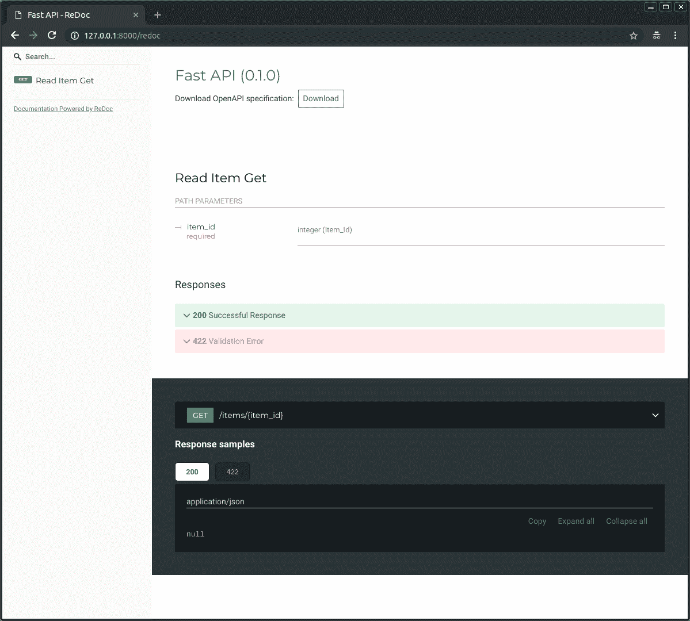
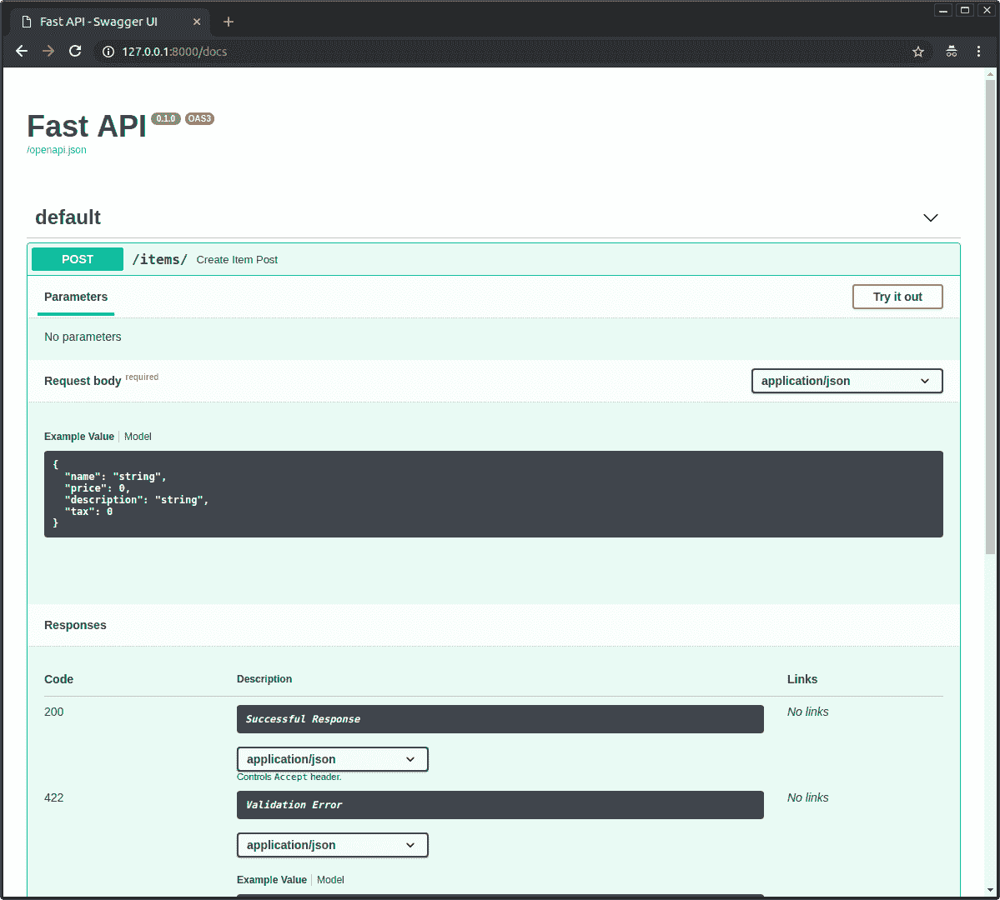
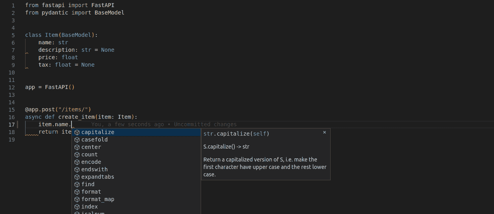
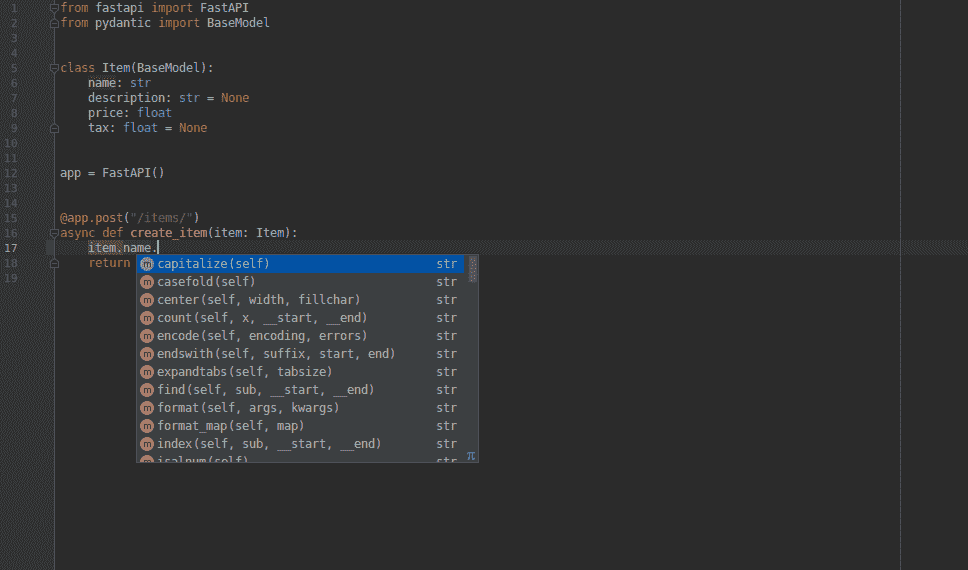

# 使用 FastAPI 构建 Python Web APIs

> 原文：<https://realpython.com/fastapi-python-web-apis/>

*立即观看**本教程有真实 Python 团队创建的相关视频课程。配合文字教程一起看，加深理解:[**Python REST API 搭配 FastAPI**](/courses/python-rest-apis-with-fastapi/)*

 *创建 API，或者说**应用编程接口**，是让你的软件能够被广大用户访问的一个重要部分。在本教程中，您将学习 **FastAPI** 的主要概念，以及如何使用它快速创建默认情况下实现最佳实践的 web APIs。

学完本课程后，您将能够开始创建生产就绪的 web APIs，并且您将具备深入了解和学习更多特定用例所需的知识。

**在本教程中，你将学习如何**:

*   使用**路径参数**获得每个项目的唯一 URL 路径
*   使用 **pydantic** 在您的请求中接收 JSON 数据
*   使用 API 最佳实践，包括**验证**、**序列化**和**文档**
*   继续学习针对**您的用例**的 FastAPI

本教程由 FastAPI 的作者[撰写。它包含从官方文档中精心挑选的片段，避免迷失在技术细节中，同时帮助您尽快上手。](https://realpython.com/team/sramirez/)

为了从本教程中获得最大收益，了解一下[什么是 HTTP 以及它是如何工作的](https://developer.mozilla.org/en-US/docs/Web/HTTP/Overview)、[什么是 JSON](https://realpython.com/python-json/)以及 [Python 类型提示](https://fastapi.tiangolo.com/python-types/)会对你有所帮助。您还将从使用虚拟环境中受益，任何 Python 项目都是如此。

**免费奖励:** [掌握 Python 的 5 个想法](https://realpython.com/bonus/python-mastery-course/)，这是一个面向 Python 开发者的免费课程，向您展示将 Python 技能提升到下一个水平所需的路线图和心态。

## 什么是 FastAPI？

FastAPI 是一个现代的高性能 web 框架，用于基于标准类型提示用 Python 构建 API。它具有以下主要特点:

*   **跑得快**:它提供了非常高的性能，与 **NodeJS** 和 **Go** 不相上下，多亏了 [Starlette](https://www.starlette.io/) 和 [pydantic](https://pydantic-docs.helpmanual.io/) 。
*   **快速编码**:它可以显著提高开发速度。
*   **减少 bug 数量**:减少人为错误的可能性。
*   直观的:它提供了强大的编辑器支持，随处完成，调试时间更少。
*   **简单明了**:它的设计使使用和学习变得简单，因此您可以花更少的时间阅读文档。
*   **Short** :最大限度减少代码重复。
*   **健壮的**:它为生产就绪代码提供自动交互文档。
*   **基于标准**:基于 API 开放标准， [OpenAPI](https://github.com/OAI/OpenAPI-Specification) 和 [JSON Schema](https://json-schema.org/) 。

该框架旨在优化您的开发人员体验，以便您可以编写简单的代码来构建默认情况下具有最佳实践的生产就绪型 API。

[*Remove ads*](/account/join/)

## *Install FastAPI*

 *与任何其他 Python 项目一样，最好从创建虚拟环境开始。如果你不熟悉如何做到这一点，那么你可以看看虚拟环境的初级读本。

第一步，使用 [`pip`](https://realpython.com/what-is-pip/) 安装 FastAPI 和[uvicon](https://www.uvicorn.org/#introduction):

```py
$ python -m pip install fastapi uvicorn[standard]
```

至此，您已经安装了 FastAPI 和 Uvicorn，并准备学习如何使用它们。FastAPI 是您将用来构建 API 的框架，而 Uvicorn 是将使用您构建的 API 来服务请求的服务器。

## 第一步

首先，在本节中，您将创建一个最小的 FastAPI 应用程序，在使用 Uvicorn 的服务器上运行它，然后学习所有的交互部分。这将让你很快了解一切是如何工作的。

### 创建第一个 API

基本的 FastAPI 文件如下所示:

```py
# main.py

from fastapi import FastAPI

app = FastAPI()

@app.get("/")
async def root():
    return {"message": "Hello World"}
```

将上面的代码复制到一个名为`main.py`的文件中，就这样，您就有了一个全功能的 API 应用程序，其中内置了一些最佳实践，比如自动文档和序列化。接下来，您将了解关于这些功能的更多信息。

这段代码定义了你的应用程序，但是如果你直接用`python`调用它，它不会自己运行。要运行它，你需要一个**服务器**程序。在上面的步骤中，你已经安装了[uvicon](https://www.uvicorn.org/)。那将是你的服务器。

### 用 Uvicorn 运行第一个 API 应用程序

使用 Uvicorn 运行实时服务器:

```py
$ uvicorn main:app --reload

INFO:     Uvicorn running on http://127.0.0.1:8000 (Press CTRL+C to quit) INFO:     Started reloader process [28720]
INFO:     Started server process [28722]
INFO:     Waiting for application startup.
INFO:     Application startup complete.
```

输出中突出显示的一行显示了您的应用程序在本地机器中的 URL。由于您使用了`--reload`进行开发，所以当您更新应用程序代码时，服务器会自动重新加载。

### 检查响应

打开您的浏览器至`http://127.0.0.1:8000`，这将使您的浏览器向您的应用程序发送请求。然后，它将发送一个 JSON 响应，内容如下:

```py
{"message":  "Hello World"}
```

该 JSON 消息与您从应用程序中的函数返回的字典相同。FastAPI 负责将 [Python `dict`](https://realpython.com/python-dicts/) 序列化为 JSON 对象，并设置适当的`Content-Type`。

[*Remove ads*](/account/join/)

### *查看交互式 API 文档*

 *现在在浏览器中打开`http://127.0.0.1:8000/docs`。

你会看到 [Swagger UI](https://github.com/swagger-api/swagger-ui) 提供的自动交互 API 文档:

[](https://files.realpython.com/media/fastapi-first-steps-01-swagger-ui-simple.c46a4a9242dd.png)

默认情况下，提供并集成了记录 API 的基于浏览器的用户界面。使用 FastAPI，您不需要做任何其他事情就可以利用它。

### 查看替代交互式 API 文档

现在，在浏览器中转到`http://127.0.0.1:8000/redoc`。

您将看到由 [ReDoc](https://github.com/Redocly/redoc) 提供的替代自动文档:

[](https://files.realpython.com/media/fastapi-first-steps-02-redoc-simple.811f594f1c70.png)

由于 FastAPI 是基于 OpenAPI 之类的标准，所以有许多替代方法来显示 API 文档。默认情况下，FastAPI 提供了这两种选择。

### 第一个 API，循序渐进

现在让我们一步一步地分析这些代码，并理解每一部分的作用。

**第一步**是导入`FastAPI`:

```py
# main.py

from fastapi import FastAPI 
app = FastAPI()

@app.get("/")
async def root():
    return {"message": "Hello World"}
```

`FastAPI`是一个 [Python 类](https://realpython.com/python3-object-oriented-programming/#define-a-class-in-python)，为你的 API 提供所有的功能。

**第二步**是创建一个`FastAPI`实例:

```py
# main.py

from fastapi import FastAPI

app = FastAPI() 
@app.get("/")
async def root():
    return {"message": "Hello World"}
```

这里的`app` [变量](https://realpython.com/python-variables/)将是类`FastAPI`的一个实例。这将是创建 API 的主要交互点。

这个`app`就是您在上面使用`uvicorn`运行实时服务器的命令中提到的那个:

```py
$ uvicorn main:app --reload

INFO:     Uvicorn running on http://127.0.0.1:8000 (Press CTRL+C to quit)
```

在继续第 3 步之前，有必要花点时间熟悉一些术语。**路径**是指从第一个正斜杠字符(`/`)开始的 URL 的最后一部分。因此，在类似于`https://example.com/items/foo`的 URL 中，路径应该是`/items/foo`。

路径通常也被称为**端点**或**路线**，但是在本教程中将使用术语**路径**。当你构建一个 API 时，路径是你分离资源的主要方式。

另一个需要了解的重要术语是**操作**，它用于引用任何 **HTTP 请求方法**:

*   `POST`
*   `GET`
*   `PUT`
*   `DELETE`
*   `OPTIONS`
*   `HEAD`
*   `PATCH`
*   `TRACE`

使用 [HTTP](https://en.wikipedia.org/wiki/Hypertext_Transfer_Protocol) ，您可以使用这些操作中的一个(或多个)与每个路径进行通信。知道了这两个术语的意思，你就可以继续第三步了。

**步骤 3** 是定义一个**路径操作装饰器**:

```py
# main.py

from fastapi import FastAPI

app = FastAPI()

@app.get("/") async def root():
    return {"message": "Hello World"}
```

`@app.get("/")`告诉 FastAPI 下面的函数负责处理使用`get`操作到达路径`/`的请求。这是一个与路径操作相关的**装饰器**，或者路径操作装饰器。如果你想学习更多关于 decorator 的知识，那么看看 Python decorator 的初级读本[。](https://realpython.com/primer-on-python-decorators/)

您也可以使用上面提到的其他操作:

*   `@app.post()`
*   `@app.put()`
*   `@app.delete()`
*   `@app.options()`
*   `@app.head()`
*   `@app.patch()`
*   `@app.trace()`

在每种情况下，您都可以在负责处理这些请求的函数上使用适当的路径操作装饰器。

**提示**:你可以随意使用每个操作(HTTP 方法)。

FastAPI 不强制任何特定的含义。此处提供的信息是一个指南，而不是一个要求。

例如，当使用 GraphQL 时，通常只使用`POST`操作来执行大多数动作[。](https://graphql.org/learn/serving-over-http/)

**步骤 4** 是定义**路径操作函数**，或者路径操作装饰器下面的函数:

```py
# main.py

from fastapi import FastAPI

app = FastAPI()

@app.get("/")
async def root():
    return {"message": "Hello World"}
```

每当 FastAPI 使用一个`GET`操作接收到对指定 URL ( `/`)的请求时，就会调用这个函数。在本例中，它是一个 [`async`功能](https://realpython.com/async-io-python/)。

您也可以将其定义为一个普通函数，而不是使用`async def`:

```py
# main.py

from fastapi import FastAPI

app = FastAPI()

@app.get("/")
def root():
    return {"message": "Hello World"}
```

如果您不知道普通函数和`async`函数之间的区别以及何时使用它们，请查看 FastAPI 文档中的[并发和异步/等待](https://fastapi.tiangolo.com/async/)。

**第五步**是向[返回](https://realpython.com/python-return-statement/)内容:

```py
# main.py

from fastapi import FastAPI

app = FastAPI()

@app.get("/")
async def root():
 return {"message": "Hello World"}
```

可以返回一个[字典](https://realpython.com/python-dicts/)、[列表](https://realpython.com/python-lists-tuples/)，或者作为[字符串](https://realpython.com/python-strings/)、[整数](https://realpython.com/python-numbers/)等的奇异值。您还可以返回 pydantic 模型，稍后您将了解更多。

还有很多其他的对象和模型会被自动转换成 JSON，包括[对象关系映射器](https://en.wikipedia.org/wiki/Object%E2%80%93relational_mapping) (ORMs)等等。试着使用你最喜欢的——它们很可能已经被支持了。

[*Remove ads*](/account/join/)

## *路径参数:按 ID 获取项目*

 *你可以声明路径**参数**或者**变量**，使用与 Python [格式化字符串](https://realpython.com/python-formatted-output/)相同的语法:

```py
# main.py

from fastapi import FastAPI

app = FastAPI()

@app.get("/items/{item_id}") async def read_item(item_id):
    return {"item_id": item_id}
```

路径参数`item_id`的值将作为参数`item_id`传递给函数。

因此，如果您运行此示例并转到`http://127.0.0.1:8000/items/foo`，您将看到以下响应:

```py
{"item_id":"foo"}
```

响应包含`"foo"`，它是在`item_id`路径参数中传递的，然后在字典中返回。

### 类型为的路径参数

您可以使用标准 Python 类型提示在函数中声明路径参数的类型:

```py
# main.py

from fastapi import FastAPI

app = FastAPI()

@app.get("/items/{item_id}")
async def read_item(item_id: int):
    return {"item_id": item_id}
```

在这种情况下，您声明`item_id`是一个`int`。

声明路径参数的类型将为您提供函数内部的编辑器支持，包括错误检查、完成等等。

### 数据转换

如果您运行上面的示例，并将浏览器导航到`http://127.0.0.1:8000/items/3`，那么您将看到以下响应:

```py
{"item_id":3}
```

请注意，您的函数接收并返回的值是`3`，这是一个 Python `int`，而不是一个字符串(`"3"`)。因此，通过类型声明，FastAPI 为您提供了自动的**请求解析**。

### 数据验证

如果你将浏览器指向`http://127.0.0.1:8000/items/foo`，那么你会看到一个漂亮的 HTTP 错误:

```py
{ "detail":  [ { "loc":  [ "path", "item_id" ], "msg":  "value is not a valid integer", "type":  "type_error.integer" } ] }
```

这是因为路径参数`item_id`的值为`"foo"`，它不是一个`int`。

如果你提供了一个`float`而不是一个`int`，同样的错误也会出现，比如你在浏览器中打开了`http://127.0.0.1:8000/items/4.2`。因此，使用相同的 Python 类型提示，FastAPI 既给你**数据解析**又给你**数据验证**。

还要注意，错误清楚地指出了验证没有通过的确切位置。这在开发和调试与 API 交互的代码时非常有用。

[*Remove ads*](/account/join/)

### *文档*

 *当您在`http://127.0.0.1:8000/docs`打开浏览器时，您会看到一个自动的交互式 API 文档:

[](https://files.realpython.com/media/fastapi-path-params-image01.f8af7578f694.png)

同样，通过同样的 Python 类型声明，FastAPI 为您提供了集成了 Swagger UI 的自动化交互式文档。注意，path 参数被声明为一个整数。

因为 FastAPI 构建在 [OpenAPI](https://github.com/OAI/OpenAPI-Specification/blob/master/versions/3.0.2.md) 标准之上，所以它还提供了一个使用 ReDoc 的替代 API 文档，您可以在`http://127.0.0.1:8000/redoc`访问:

[](https://files.realpython.com/media/fastapi-path-params-image02.9e01bff65ca2.png)

还有许多其他兼容的工具，包括许多语言的代码生成工具。

### 用 pydantic 进行数据处理

所有的数据验证都是由 pydantic 在幕后执行的，因此您可以从中获得所有的好处，并且您知道您会得到很好的处理。

您可以对`str`、`float`、`bool`和许多其他复杂数据类型使用相同的类型声明。

### 顺序问题:将固定路径放在第一位

创建路径操作时，你可能会发现有固定路径的情况，比如`/users/me`。假设是为了获取当前用户的数据。您还可以使用路径`/users/{user_id}`通过某个用户 ID 获取特定用户的数据。

因为路径操作是按顺序计算的，所以需要确保在声明`/users/{user_id}`的路径之前声明`/users/me`的路径:

```py
# main.py

from fastapi import FastAPI

app = FastAPI()

@app.get("/users/me") async def read_user_me():
    return {"user_id": "the current user"}

@app.get("/users/{user_id}")
async def read_user(user_id: str):
    return {"user_id": user_id}
```

否则，`/users/{user_id}`的路径也会与`/users/me`匹配，认为它正在接收值为`"me"`的参数`user_id`。

## 请求体:接收 JSON 数据

当您需要将数据从客户机发送到 API 时，您可以将它作为请求体发送。

一个**请求体**是客户端发送给你的 API 的数据。一个**响应体**是你的 API 发送给客户端的数据。您的 API 几乎总是要发送一个响应体。但是客户端不一定需要一直发送请求体。

**注意:**发送数据，你要用`POST`(最常用的方法)、`PUT`、`DELETE`或者`PATCH`。发送带有`GET`请求的主体在规范中有未定义的行为。

然而，FastAPI 支持使用`GET`请求，尽管只是针对非常复杂或极端的用例。不鼓励这样做，当使用`GET`时，Swagger UI 的交互文档不会显示主体的文档，中间的代理可能不支持它。

要声明一个请求体，您可以使用 pydantic 模型及其所有的功能和好处。你将在下面了解更多。

[*Remove ads*](/account/join/)

### *使用 pydantic 声明 JSON 数据模型(数据形状)*

 *首先，您需要从`pydantic`导入`BaseModel`，然后使用它来创建子类，定义您想要接收的**模式**，或者数据形状。

接下来，将数据模型声明为从`BaseModel`继承的类，对所有属性使用标准 Python 类型:

```py
# main.py

from typing import Optional 
from fastapi import FastAPI
from pydantic import BaseModel 
class Item(BaseModel):
 name: str description: Optional[str] = None price: float tax: Optional[float] = None 
app = FastAPI()

@app.post("/items/")
async def create_item(item: Item):
    return item
```

当模型属性有默认值时，它不是必需的。否则，它是必需的。要使属性可选，可以使用 [`None`](https://realpython.com/null-in-python/) 。

例如，上面的模型像这样声明了一个 JSON 对象(或 Python `dict`):

```py
{ "name":  "Foo", "description":  "An optional description", "price":  45.2, "tax":  3.5 }
```

在这种情况下，因为`description`和`tax`是可选的，因为它们有一个默认值`None`，所以这个 JSON 对象也是有效的:

```py
{ "name":  "Foo", "price":  45.2 }
```

省略默认值的 JSON 对象也是有效的。

接下来，将新的 pydantic 模型作为参数添加到路径操作中。声明它的方式与声明路径参数的方式相同:

```py
# main.py

from typing import Optional

from fastapi import FastAPI
from pydantic import BaseModel

class Item(BaseModel):
    name: str
    description: Optional[str] = None
    price: float
    tax: Optional[float] = None

app = FastAPI()

@app.post("/items/")
async def create_item(item: Item):
    return item
```

参数`item`有一个类型提示`Item`，这意味着`item`被声明为类`Item`的一个实例。

通过 Python 类型声明，FastAPI 将:

*   将请求的主体作为 JSON 读取
*   如果需要，转换相应的类型
*   验证数据，如果无效，则返回一个明确的错误
*   在参数`item`中为您提供接收到的数据——因为您将它声明为类型`Item`,所以您还将拥有所有编辑器支持，对所有属性及其类型进行完成和类型检查
*   为您的模型生成 [JSON Schema](https://json-schema.org) 定义，您也可以在任何对您的项目有意义的地方使用这些定义

通过在 pydantic 中使用标准类型提示，FastAPI 可以帮助您轻松地构建默认情况下具备所有这些最佳实践的 API。

### 使用 pydantic 自动记录文件

您的 pydantic 模型的 JSON 模式将是为您的应用程序生成的 OpenAPI 的一部分，并将显示在交互式 API 文档中:

[](https://files.realpython.com/media/fastapi-body-image01.cbf75d4cdb50.png)

您可以看到 API 文档中的属性`Item`正是您用 pydantic 模型声明的属性。

这些 JSON 模式也将在需要它们的每个路径操作中的 API 文档中使用:

[](https://files.realpython.com/media/fastapi-body-image02.e1a560532c37.png)

请注意，所有这些自动文档都是基于*您的*数据，使用您的 pydantic 模型。

[*Remove ads*](/account/join/)

### *编辑器支持、自动完成和类型检查*

 *在你的编辑器中，在你的函数中，你会得到类型提示和补全。如果你收到一个`dict`而不是一个 pydantic 模型，这就不会发生:

[](https://files.realpython.com/media/fastapi-body-image03.2984d2abecb8.png)

这样，您可以触发所有数据的自动完成。

您还可以对不正确的类型操作进行错误检查:

[](https://files.realpython.com/media/fastapi-body-image04.aa1cc274a9a2.png)

在这种情况下，您不能将一个`str`和一个`float`相加，因为编辑器知道这些类型，它可以警告您代码中有错误。这不是偶然的:整个框架都是围绕这个设计构建的。在任何实现之前，它在设计阶段就经过了彻底的测试，以确保它能与所有的编辑器一起工作。甚至对 pydantic 本身也做了一些修改来支持这个特性。

之前的截图都是用 [Visual Studio 代码](https://realpython.com/python-development-visual-studio-code/)拍摄的。但是你可以用 [PyCharm](https://realpython.com/pycharm-guide/) 和大多数其他 Python 编辑器得到同样的编辑器支持:

[](https://files.realpython.com/media/fastapi-body-image05.bb8ddf770d69.png)

如果您使用 PyCharm 作为您的编辑器，那么您可以使用 [pydantic PyCharm 插件](https://github.com/koxudaxi/pydantic-pycharm-plugin/)来改进您的编辑器支持。如果你使用 VS 代码，那么你将通过 [Pylance](https://marketplace.visualstudio.com/items?itemName=ms-python.vscode-pylance) 获得最好的开发者体验。

### 使用 pydantic 模型

在函数内部，您可以直接访问模型对象的所有属性:

```py
# main.py

from typing import Optional

from fastapi import FastAPI
from pydantic import BaseModel

class Item(BaseModel):
    name: str
    description: Optional[str] = None
    price: float
    tax: Optional[float] = None

app = FastAPI()

@app.post("/items/")
async def create_item(item: Item):
    item_dict = item.dict()
    if item.tax:
 price_with_tax = item.price + item.tax        item_dict.update({"price_with_tax": price_with_tax})
    return item_dict
```

参数`item`被声明为类`Item`的实例，FastAPI 将确保您在函数中接收到的*与*完全相同，而不是字典或其他东西。

### 请求体和路径参数

您可以同时声明路径参数和请求体。

FastAPI 将识别与路径参数匹配的函数参数应该从路径中获取，而被声明为 pydantic 模型的函数参数应该从请求体中获取:

```py
# main.py

from typing import Optional

from fastapi import FastAPI
from pydantic import BaseModel

class Item(BaseModel):
    name: str
    description: Optional[str] = None
    price: float
    tax: Optional[float] = None

app = FastAPI()

@app.put("/items/{item_id}")
async def create_item(item_id: int, item: Item):
 return {"item_id": item_id, **item.dict()}
```

这样，您就可以声明路径参数和 JSON 请求体，FastAPI 将为您完成所有的数据验证、序列化和文档。你可以通过在`/docs`访问相同的 API 文档或者使用其他工具来验证它，比如带有图形界面的 [Postman](https://www.postman.com/) 或者命令行中的 [Curl](https://curl.se/docs/httpscripting.html) 。

以类似的方式，您可以声明更复杂的请求体，如列表，以及其他类型的请求数据，如查询参数、cookies、标题、表单输入、文件等等。

[*Remove ads*](/account/join/)

## *了解有关 FastAPI 的更多信息*

 *至此，您已经对 FastAPI 以及如何使用它来创建健壮的、生产就绪的 API 有了很多了解。

但是你可以学习的还有很多:

*   [查询参数](https://fastapi.tiangolo.com/tutorial/query-params/)定制请求
*   [依赖注入](https://fastapi.tiangolo.com/tutorial/dependencies/)处理权限、数据库会话等可重用逻辑
*   [安全实用程序](https://fastapi.tiangolo.com/tutorial/security/)基于标准集成认证和授权
*   [后台任务](https://fastapi.tiangolo.com/tutorial/background-tasks/)用于发送电子邮件通知等简单操作
*   [`async`和`await`](https://fastapi.tiangolo.com/async/) 支持**并发**并提高性能
*   [WebSockets](https://fastapi.tiangolo.com/advanced/websockets/) 用于需要实时通信的高级用例
*   [多个文件中更大的应用程序](https://fastapi.tiangolo.com/tutorial/bigger-applications/)

FastAPI 可以覆盖后端框架所需的大部分用例，甚至是那些严格意义上不是 API 的用例。您可以更深入地研究文档以解决您的特定用例。

FastAPI 基于现代 Python 特性，您也可以通过了解这些特性来充分利用 FastAPI。查看[Python 中的异步特性入门](https://realpython.com/python-async-features/)和[Python 中的异步 IO:完整演练](https://realpython.com/async-io-python/)，了解更多关于异步编程的信息。您还可以查看 [Python 类型检查(指南)](https://realpython.com/python-type-checking/)，从代码中的类型提示中获得所有传统的好处。

## 结论

在本教程中，您了解了 **FastAPI** 以及如何使用它来创建生产就绪的 API，这些 API 在默认情况下具有最佳实践，同时尽可能提供最佳的开发人员体验。您学习了如何:

*   使用**路径参数**获得每个项目的唯一 URL 路径
*   使用 **pydantic** 在您的请求中接收 JSON 数据
*   使用 API 最佳实践，如**验证**、**序列化**和**文档**
*   继续了解针对不同用例的 **FastAPI** 和 **pydantic**

现在，您可以开始为您的项目创建自己的高性能 API 了。如果您想更深入地了解 FastAPI 的世界，那么您可以遵循 FastAPI 文档中的官方[用户指南](https://fastapi.tiangolo.com/tutorial/)。

*立即观看**本教程有真实 Python 团队创建的相关视频课程。配合文字教程一起看，加深理解:[**Python REST API 搭配 FastAPI**](/courses/python-rest-apis-with-fastapi/)*********