# 用 Python 和 Arcade 构建一个平台游戏

> 原文:[https://realpython.com/platformer-python-arcade/](https://realpython.com/platformer-python-arcade/)

对于许多视频游戏玩家来说，编写游戏的诱惑是学习计算机编程的主要原因。然而，构建一个 2D 平台游戏如[矿脉跑者](https://en.wikipedia.org/wiki/Lode_Runner)，[的陷阱！](https://en.wikipedia.org/wiki/Pitfall!)或[超级马里奥兄弟](https://en.wikipedia.org/wiki/Super_Mario_Bros.)没有合适的工具或指导会让你灰心丧气。幸运的是，Python `arcade`库使得许多程序员可以用 Python 创建一个 2D 游戏！

如果你还没有听说过， [`arcade`库](https://arcade.academy/index.html)是一个现代的 Python 框架，用于制作具有引人注目的图形和声音的游戏。`arcade`面向对象，为 Python 3.6 及更高版本而构建，为您提供了一套现代的工具来打造出色的游戏体验，包括平台游戏。

**本教程结束时，你将能够:**

*   安装 **Python `arcade`** 库
*   创建一个基本的 **2D 游戏结构**
*   找到可用的游戏**作品**和其他**资产**
*   使用**平铺的**地图编辑器构建平台地图
*   定义玩家**动作**，游戏**奖励**，以及**障碍**
*   用**键盘**和**操纵杆**输入控制你的玩家
*   播放游戏动作的音效
*   用**视窗**滚动游戏屏幕，让你的玩家保持在视野中
*   添加**标题**、**指令**、**暂停**画面
*   在屏幕上移动**非玩家游戏元素**

本教程假设你对编写 Python 程序有[的基本理解](https://realpython.com/products/python-basics-book/)。你还应该[熟练使用`arcade`库](https://realpython.com/arcade-python-game-framework/)，熟悉[面向对象的 Python](https://realpython.com/learning-paths/object-oriented-programming-oop-python/) ，它在`arcade`中被广泛使用。

您可以通过单击下面的链接下载本教程的所有代码、图像和声音:

**获取源代码:** [点击此处获取您将在本教程中使用](https://realpython.com/bonus/platformer-python-arcade-code/)用 Python Arcade 构建平台游戏的源代码。

## 安装 Python `arcade`

您可以使用 [`pip`](https://realpython.com/what-is-pip/) 安装`arcade`及其依赖项:

```py
$ python -m pip install arcade
```

完整的[安装说明](https://arcade.academy/installation.html)适用于 [Windows](https://arcade.academy/installation_windows.html) 、 [Mac](https://arcade.academy/installation_mac.html) 和 [Linux](https://arcade.academy/installation_linux.html) 。如果你愿意，你甚至可以直接从源代码安装`arcade` [。](https://arcade.academy/installation_from_source.html)

本教程通篇使用 Python 3.9 和`arcade` 2.5.5。

[*Remove ads*](/account/join/)

## *设计游戏*

 *在开始编写任何代码之前，制定一个计划是有益的。既然你的目标是写一个 2D 平台游戏，那么准确定义是什么让一个游戏成为平台游戏将是一个好主意。

### 什么是平台游戏？

平台游戏与其他类型的游戏有几个不同的特征:

*   玩家在游戏场上的各种平台之间跳跃和攀爬。
*   平台通常具有不平坦的地形和不平坦的高度位置。
*   障碍被放置在玩家的路径上，并且必须被克服以达到目标。

这些只是平台游戏的最低要求，您可以根据需要自由添加其他功能，包括:

*   难度不断增加的多个级别
*   整个游戏中的奖励
*   多玩家生活
*   摧毁游戏障碍的能力

本教程中开发的游戏计划包括增加难度和奖励。

### 游戏故事

所有好的游戏都有一些背景故事，即使很简单:

*   矿脉运送者中的矿工必须收集所有的黄金。
*   哈利必须在规定的时间内收集 32 件不同的宝物。
*   马里奥的任务是营救[毒菌公主](https://en.wikipedia.org/wiki/Princess_Toadstool)。

你的游戏受益于一个故事，这个故事将玩家采取的行动与某个总体目标联系起来。

对于本教程来说，游戏故事是关于一个名叫罗兹的太空旅行者，他在一个外星世界迫降。在他们的飞船坠毁前，罗兹被扔了出去，现在需要找到他们的飞船，修好它，然后回家。

为了做到这一点，罗兹必须从他们目前的位置旅行到每一级的出口，这使他们更接近船。一路上，罗兹可以收集硬币，用来修复受损的飞船。由于罗兹被驱逐出飞船，他们没有任何武器，因此必须避免途中的任何危险障碍。

虽然这个故事看起来很傻，但它服务于*告知设计者*你的等级和角色的重要目的。这有助于您在实施功能时做出决策:

*   由于罗兹没有武器，所以没有办法射杀可能出现的敌人。
*   罗兹坠毁在一个外星世界，所以敌人可以在任何地方和任何东西。
*   因为这个星球是外星的，重力可能会不同，这可能会影响罗兹的跳跃和移动能力。
*   罗兹需要修复他们损坏的飞船，这需要收集物品来完成。目前，硬币可用，但其他项目可能会在稍后可用。

在设计游戏的时候，你可以根据自己的喜好让故事变得简单或者复杂。

### 游戏机制

有了粗略的设计，你也可以开始计划如何控制游戏。在游戏场地中移动 Roz 需要一种方法来控制几种不同的移动:

*   `Left` 和 `Right` 在一个平台上移动
*   `Up` 和 `Down` 爬平台间的梯子
*   跳跃收集硬币，避免敌人，或在平台之间移动

传统上，玩家可以使用[四个箭头键](https://en.wikipedia.org/wiki/Arrow_keys)进行定向移动，以及 `Space` 进行跳跃。如果你愿意，你也可以使用诸如 [IJKL](https://en.wikipedia.org/wiki/Arrow_keys#IJKL_keys) 、 [IJKM](https://en.wikipedia.org/wiki/Arrow_keys#IJKM_keys) 或 [WASD](https://en.wikipedia.org/wiki/Arrow_keys#WASD_keys) 这样的键。

你也不仅仅局限于键盘输入。`arcade`库包括对[操纵杆和游戏控制器](https://realpython.com/platformer-python-arcade/#joystick-and-game-controllers)的支持，您将在后面探索。一旦游戏杆连接到你的电脑上，你就可以通过检查游戏杆的 X 轴和 Y 轴的位置来移动 Roz，并通过检查特定的按钮按压来跳跃。

[*Remove ads*](/account/join/)

### *游戏资产*

 *现在你对游戏应该如何运行有了一个想法，你需要对游戏的外观和声音做出一些决定。用于显示乐谱的图像、[精灵](https://en.wikipedia.org/wiki/Sprite_(computer_graphics))、声音甚至文本统称为**资产**。他们在你的球员眼中定义了你的比赛。创建它们可能是一个挑战，比编写实际的游戏代码花费更多的时间。

您可以下载免费或低价的资源在游戏中使用，而不是创建自己的资源。许多艺术家和设计师提供精灵、背景、字体、声音和其他内容供游戏制作者使用。以下是一些音乐、声音和艺术资源，您可以从中搜索有用的内容:

| 来源 | 鬼怪；雪碧 | 艺术品 | 音乐 | 音效 |
| --- | --- | --- | --- | --- |
| [**OpenGameArt.org**](https://opengameart.org) | X | X | X | X |
| [**kenney . nl**T3】](https://kenney.nl) | X | X | X | X |
| [**游戏美术 2D**](https://www.gameart2d.com/) | X | X |  |  |
| [**cc mixter**T3】](http://ccmixter.org) |  |  | X | X |
| [**Freesound**](https://freesound.org/) |  |  | X | X |

对于本教程中概述的游戏，你将使用免费提供的[地图图片](https://opengameart.org/content/platformer-pack-redux-360-assets)和由 [Kenney.nl](https://www.kenney.nl) 创建的精灵。可下载源代码中提供的音效是作者使用 [MuseScore](https://musescore.org/en) 和 [Audacity](https://www.audacityteam.org/) 制作的。

**注意:**如果您决定使用他人拥有或创建的游戏资产，请务必阅读、理解并遵守所有者规定的任何许可要求。许可证可能要求支付费用或添加适当的归属，并可能对您的游戏施加许可限制。如有疑问，咨询法律专业人士。

开始编写代码前的最后一步是决定如何组织和存储所有内容。

## 定义程序结构

因为视频游戏由图形和声音资产以及代码组成，所以组织您的项目非常重要。保持游戏资产和代码的合理组织将允许你对游戏的设计或行为进行有针对性的修改，同时将对游戏其他方面的影响降到最低。

该项目使用以下结构:

```py
arcade_platformer/
|
├── arcade_platformer/
|
├── assets/
|   |
│   ├── images/
|   |   |
│   │   ├── enemies/
|   |   |
│   │   ├── ground/
|   |   |
│   │   ├── HUD/
|   |   |
│   │   ├── items/
|   |   |
│   │   ├── player/
|   |   |
│   │   └── tiles/
|   |
│   └── sounds/
|
└── tests/
```

在项目的根文件夹下有以下子文件夹:

*   **`arcade_platformer`** 掌握着游戏的所有 Python 代码。
*   **`assets`** 由你所有的游戏图像、字体、声音和平铺地图组成。
*   **`tests`** 包含你可以选择编写的任何测试。

虽然还有其他一些游戏决策要做，但这已经足够开始编写代码了。您将从定义基本的`arcade`代码结构开始，您可以在其中构建您的平台游戏！

### 在 Python 中定义游戏结构`arcade`

你的游戏使用了`arcade`完整的面向对象功能。为此，您基于`arcade.Window`定义一个新类，然后覆盖该类中的方法来更新和呈现您的游戏图形。

这是一个游戏成品的基本框架。随着游戏的进行，您将在这个框架上构建:

```py
 1"""
 2Arcade Platformer
 3
 4Demonstrating the capabilities of arcade in a platformer game
 5Supporting the Arcade Platformer article
 6at https://realpython.com/platformer-python-arcade/
 7
 8All game artwork from www.kenney.nl
 9Game sounds and tile maps by author
10"""
11
12import arcade
13
14class Platformer(arcade.Window):
15    def __init__(self):
16        pass
17
18    def setup(self):
19        """Sets up the game for the current level"""
20        pass
21
22    def on_key_press(self, key: int, modifiers: int):
23        """Processes key presses
24
25 Arguments:
26 key {int} -- Which key was pressed
27 modifiers {int} -- Which modifiers were down at the time
28 """
29
30    def on_key_release(self, key: int, modifiers: int):
31        """Processes key releases
32
33 Arguments:
34 key {int} -- Which key was released
35 modifiers {int} -- Which modifiers were down at the time
36 """
37
38    def on_update(self, delta_time: float):
39        """Updates the position of all game objects
40
41 Arguments:
42 delta_time {float} -- How much time since the last call
43 """
44        pass
45
46    def on_draw(self):
47        pass
48
49if __name__ == "__main__":
50    window = Platformer()
51    window.setup()
52    arcade.run()
```

这个基本结构几乎提供了你构建一个 2D 平台游戏所需的一切:

*   **12 号线** [进口](https://realpython.com/python-import/)`arcade`库。

*   第 14 行定义了用来运行整个游戏的类。调用该类的方法来更新游戏状态、处理用户输入以及在屏幕上绘制项目。

*   **第 15 行**定义`.__init__()`，初始化游戏对象。您在这里添加代码来处理只应在游戏首次启动时采取的操作。

*   **第 18 行**定义了`.setup()`，它设置游戏开始玩。您将代码添加到这个方法中，可能需要在整个游戏中重复使用。例如，这是一个成功时初始化新等级或者失败时重置当前等级的好地方。

*   **第 22 行和第 30 行**定义了`.on_key_press()`和`.on_key_release()`，允许你独立处理键盘输入。`arcade`将按键和按键释放分开处理，这有助于避免键盘自动重复的问题。

*   **第 38 行**定义了`.on_update()`，在这里你可以更新你的游戏和游戏中所有物体的状态。这是处理对象之间的碰撞、播放大多数声音效果、更新分数和动画精灵的地方。这个方法是游戏中所有事情发生的地方，所以这里通常有很多代码。

*   **第 46 行**定义了`.on_draw()`，游戏中显示的所有东西都画在这里。与`.on_update()`相比，这种方法通常只包含几行代码。

*   第 49 行到第 52 行定义了游戏的主入口。这是您:

    *   基于第 13 行定义的类创建游戏对象`window`
    *   通过调用`window.setup()`设置游戏
    *   通过调用`arcade.run()`开始游戏循环

这种基本结构对于大多数 Python `arcade`游戏来说都工作得很好。

**注意:**在可下载的资料中，这个基本的代码大纲可以在`arcade_platformer/01_game_skeleton.py`下找到。

随着本教程的深入，您将充实这些方法，并添加新的方法来实现游戏的功能。

[*Remove ads*](/account/join/)

### *添加初始游戏功能*

 *开始游戏的第一件事就是打开游戏窗口。在本节结束时，您的游戏看起来会像这样:

[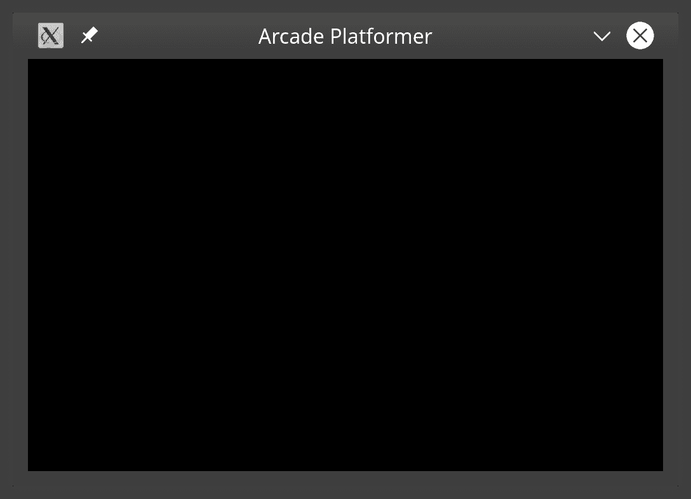](https://files.realpython.com/media/game-first-start.54df3094498b.png)

您可以在`arcade_platformer/02_open_game_window.py`中看到游戏骨骼的变化:

```py
11import arcade
12import pathlib
13
14# Game constants
15# Window dimensions
16SCREEN_WIDTH = 1000
17SCREEN_HEIGHT = 650
18SCREEN_TITLE = "Arcade Platformer"
19
20# Assets path
21ASSETS_PATH = pathlib.Path(__file__).resolve().parent.parent / "assets"
22
23class Platformer(arcade.Window):
24    def __init__(self) -> None:
25        super().__init__(SCREEN_WIDTH, SCREEN_HEIGHT, SCREEN_TITLE)
26
27        # These lists will hold different sets of sprites
28        self.coins = None
29        self.background = None
30        self.walls = None
31        self.ladders = None
32        self.goals = None
33        self.enemies = None
34
35        # One sprite for the player, no more is needed
36        self.player = None
37
38        # We need a physics engine as well
39        self.physics_engine = None
40
41        # Someplace to keep score
42        self.score = 0
43
44        # Which level are we on?
45        self.level = 1
46
47        # Load up our sounds here
48        self.coin_sound = arcade.load_sound(
49            str(ASSETS_PATH / "sounds" / "coin.wav")
50        )
51        self.jump_sound = arcade.load_sound(
52            str(ASSETS_PATH / "sounds" / "jump.wav")
53        )
54        self.victory_sound = arcade.load_sound(
55            str(ASSETS_PATH / "sounds" / "victory.wav")
56        )
```

这里有一个细目分类:

*   **第 11 行和第 12 行**导入你需要的`arcade`和 [`pathlib`](https://realpython.com/python-pathlib/) 库。

*   **第 16 到 18 行**定义了几个游戏窗口常量，用于稍后打开游戏窗口。

*   **第 21 行**保存你的`assets`文件夹的路径，使用当前文件的路径作为基础。因为你将在整个游戏中使用这些资产，知道它们在哪里是至关重要的。使用`pathlib`可以确保您的路径在 Windows、Mac 或 Linux 上正常工作。

*   **第 25 行**使用`super()`和上面第 16 到 18 行定义的常量调用父类的`.__init__()`方法来设置你的游戏窗口。

*   **第 28 到 33 行**定义了六个不同的[精灵列表](https://realpython.com/arcade-python-game-framework/#sprites-and-sprite-lists)来保存游戏中使用的各种精灵。没有必要在这里声明和定义它们，因为它们将在后面的`.setup()`中被完全正确地定义。声明对象属性是像 C++或 Java 这样的语言的延续。每个级别都有一组不同的对象，这些对象被填充在`.setup()`中:

    *   **`coins`** 是罗兹可以在整个游戏中找到的可收集物品。

    *   **`background`** 物体的呈现只是为了视觉上的兴趣，不与任何东西互动。

    *   **`walls`** 是罗兹无法穿越的物体。这些包括真正的墙壁和平台，罗兹可以在上面行走和跳跃。

    *   **`ladders`** 是让 Roz 爬上爬下的物体。

    *   **`goals`** 是 Roz 要移动到下一关必须找到的对象。

    *   **`enemies`** 是罗兹在整个游戏中必须避开的对象。与敌人接触将会结束游戏。

*   **第 36 行**声明了 player 对象，将在`.setup()`中正确定义。

*   第 39 行声明了一个用于管理运动和碰撞的[物理引擎](https://realpython.com/platformer-python-arcade/#what-is-a-physics-engine)。

*   第 42 行定义了一个[变量](https://realpython.com/python-variables/)来跟踪当前得分。

*   第 45 行定义了一个变量来跟踪当前的游戏级别。

*   **第 48 到 56 行**使用前面定义的`ASSETS_PATH`常量来定位和加载用于收集硬币、跳跃和完成每一关的声音文件。

如果你愿意，你可以在这里添加更多，但是记住`.__init__()`只在游戏开始时运行。

**注:**上述声音在可下载资料中提供。你可以使用他们提供的或替换你自己的声音。

罗兹需要能够在游戏世界中行走、跳跃和攀爬。管理何时以及如何发生是物理引擎的工作。

### 什么是物理引擎？

在大多数平台上，用户使用操纵杆或键盘来移动玩家。他们可能会让玩家跳下或带着玩家走下平台。一旦玩家在半空中，用户不需要做任何其他事情来使他们落到更低的平台上。由**物理引擎**控制玩家可以在哪里行走，以及他们跳下或走下平台后如何摔倒。

在游戏中，物理引擎提供了作用于玩家和其他游戏对象的物理力的近似值。这些力可以传递或影响游戏对象的运动，包括跳跃、攀爬、下落和阻挡运动。

Python `arcade`中包含了三个物理引擎:

1.  **`arcade.PhysicsEngineSimple`** 是一个非常基本的引擎，处理单个玩家精灵和一系列墙壁精灵的移动和交互。这对于自上而下的游戏很有用，因为重力不是一个因素。

2.  **`arcade.PhysicsEnginePlatformer`** 是为平台游戏量身定制的更复杂的引擎。除了基本的移动，它还提供了一种重力，将物体拉到屏幕底部。它还为玩家提供了一种跳跃和攀爬梯子的方式。

3.  **`arcade.PymunkPhysicsEngine`** 建立在[花栗鼠](http://www.pymunk.org/en/latest/)之上，这是一个使用[花栗鼠](http://chipmunk-physics.net/)库的 2D 物理库。Pymunk 使极其真实的物理计算可用于`arcade`应用。

在本教程中，您将使用`arcade.PhysicsEnginePlatformer`。

为了正确设置`arcade.PhysicsEnginePlatformer`，你必须提供玩家精灵以及两个精灵列表，包含玩家与之互动的墙壁和梯子。因为墙和梯子根据等级而变化，所以在等级建立之前，你不能正式定义物理引擎，这发生在`.setup()`中。

说到等级，你是如何定义的呢？和大多数事情一样，完成工作的方法不止一种。

## 构建游戏关卡

当视频游戏还分布在软盘上时，很难存储一个游戏所需的所有游戏级别数据。许多游戏制造商诉诸于编写代码来创建关卡。虽然这种方法节省了磁盘空间，但是使用**命令式**代码来生成游戏关卡会限制你以后修改或增加关卡的能力。

随着存储空间变得越来越便宜，游戏通过将更多的资产存储在数据文件中而获益，这些数据文件由代码读取和处理。现在可以在不改变游戏代码的情况下创建和修改游戏关卡，这使得艺术家和游戏设计师无需理解底层代码就可以做出贡献。关卡设计的这种**声明式**方法允许在设计和开发游戏时有更大的灵活性。

声明式游戏级别设计的缺点是不仅需要定义数据，还需要存储数据。幸运的是，有一个工具可以做到这两点，而且它与`arcade`配合得非常好。

[Tiled](https://www.mapeditor.org/) 是一个开源的 2D 游戏关卡编辑器，可以生成 Python `arcade`可以读取和使用的文件。Tiled 允许你创建一个名为 [tileset](https://doc.mapeditor.org/en/stable/manual/editing-tilesets/) 的图像集合，用来创建一个 [tile map](https://doc.mapeditor.org/en/stable/manual/introduction/#creating-a-new-map) 来定义你游戏的每一关。您可以使用平铺为自上而下、等轴测和侧滚游戏创建平铺地图，包括游戏的关卡:

[](https://files.realpython.com/media/tiled-level-one.968f21a84108.png)

Tiled 附带了一套[很棒的文档](https://doc.mapeditor.org/en/stable/)和[很棒的介绍教程](https://doc.mapeditor.org/en/stable/manual/introduction/#getting-started)。为了让你开始，并希望激起你更多的欲望，接下来你将通过创建你的第一个地图水平的步骤。

[*Remove ads*](/account/join/)

### *下载并开始平铺*

 *在运行 Tiled 之前，你需要[下载它](https://thorbjorn.itch.io/tiled)。撰写本文时的当前版本是 Tiled 版本 1.4.3，该版本可用于各种格式的 Windows、Mac 和 Linux。下载时，考虑通过捐赠来支持它的持续维护。

下载完切片后，您可以首次启动它。您将看到以下窗口:

[](https://files.realpython.com/media/tiled-first-start.cdf8ec9acdf3.png)

点击*新建地图*为你的第一关创建地图。将出现以下对话框:

[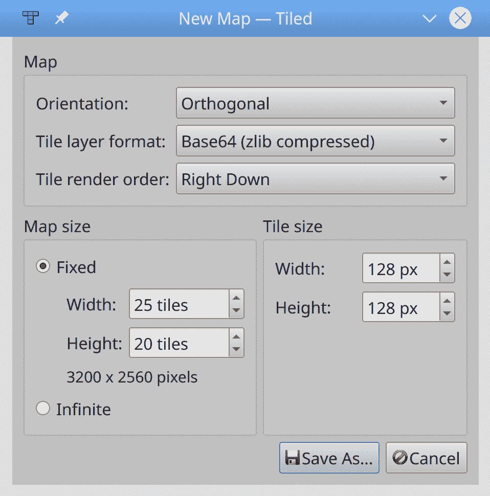](https://files.realpython.com/media/tiled-new-map.2d6a776098a0.png)

这些默认的磁贴地图属性对于平台游戏来说很棒，代表了`arcade`游戏的最佳选项。以下是您可以选择的其他选项的快速分类:

*   **方向**指定如何显示和编辑地图。
    *   *正交*地图是正方形的，用于自上而下和平台游戏。`arcade`与正交贴图配合使用效果最佳。
    *   等角图地图将视点转换成游戏领域的非直角，提供了 2D 世界的伪 3D 视图。*交错*等距地图指定地图的顶边是视图的顶边。
    *   *六边形*地图对每个地图拼贴使用六边形而不是正方形(尽管拼贴在编辑器中显示正方形)。
*   **切片图层格式**指定地图在磁盘上的存储方式。使用 [zlib](https://zlib.net/) 进行压缩有助于节省磁盘空间。
*   **图块渲染顺序**指定图块如何存储在文件中，并最终如何由游戏引擎渲染。
*   **地图大小**设置要存储的地图的大小，以图块为单位。将贴图指定为 *Infinite* 会告诉 Tiled 根据所做的编辑来确定最终大小。
*   **图块尺寸**以像素为单位指定每个图块的尺寸。如果您使用来自外部来源的图稿，请将其设定为该组中拼贴的大小。本教程提供的插图使用了 128 × 128 像素的方形精灵。这意味着每个区块由大约 16，000 个像素组成，如果需要，它们可以存储在磁盘和内存中，从而提高游戏性能。

点击*另存为*保存关卡。既然这是游戏资产，那就存为`arcade_platformer/assets/platform_level_01.tmx`。

切片地图由放置在特定地图图层上的一组切片组成。要开始为某个级别定义切片贴图，必须首先定义要使用的切片集以及它们出现的图层。

### 创建 Tileset

用于创建关卡的图块包含在图块集中。tileset 与 tile map 相关联，并提供定义级别所需的所有 sprite 图像。

使用位于平铺窗口右下角的 *Tilesets* 视图定义 tileset 并与之交互:

[](https://files.realpython.com/media/tiled-tileset.a16251f8b11c.png)

点击 *New Tileset* 按钮定义该级别的 Tileset。Tiled 显示一个对话框，询问有关要创建的新 tileset 的一些信息:

[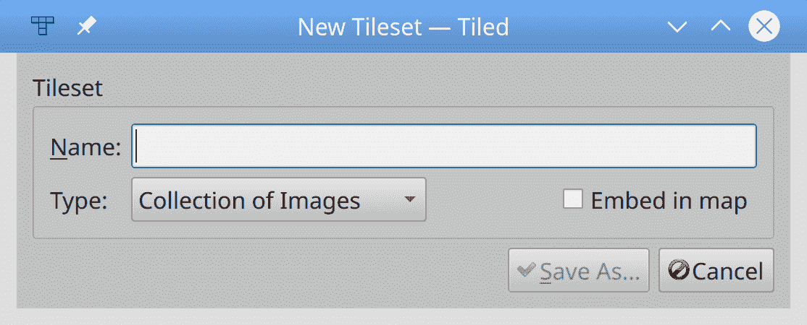](https://files.realpython.com/media/tiled-new-tileset.02c5883cc2d8.png)

对于新的 tileset，您有以下选项:

*   **名称**是您的 tileset 的名称。把这个叫做`arcade_platformer`。
*   **Type** 指定如何定义 tileset:
    *   *图像集合*表示每个图块都包含在磁盘上一个单独的图像中。您应该选择此选项，因为`arcade`最适合单独的图块图像。
    *   *基于拼贴设置图像*表示所有的拼贴被组合成一个单独的大图像，拼贴需要对其进行处理以定位每个单独的图像。仅当您正在使用的资产需要时，才选择此选项。
*   **嵌入贴图**告诉 Tiled 将 tileset 存储在贴图中。保持此项未选中，因为您将在多个切片地图中将切片集作为单独的资源保存和使用。

点击*另存为*，另存为`assets/arcade_platformer.tsx`。要在未来的图块地图上重复使用该图块集，选择*地图* → *添加外部图块集*将其包括在内。

### 定义 Tileset

您的新 tileset 最初是空的，所以您需要用 tiles 填充它。您可以通过定位图块图像并将其添加到集合中来实现这一点。每个图像的尺寸应该与您在创建拼贴贴图时定义的*拼贴尺寸*相同。

此示例假设您已经下载了本教程的游戏资源。您可以通过单击下面的链接来完成此操作:

**获取源代码:** [点击此处获取您将在本教程中使用](https://realpython.com/bonus/platformer-python-arcade-code/)用 Python Arcade 构建平台游戏的源代码。

或者，你可以下载[平台包 Redux (360 资产)](https://opengameart.org/content/platformer-pack-redux-360-assets)，将`PNG`文件夹的内容移动到你的`arcade-platformer/assets/images`文件夹。请记住，您的平铺地图位于`arcade-platformer/assets`下，因为这在以后会很重要。

在工具栏上，点击蓝色加号(`+`)或选择*图块设置* → *添加图块*开始该过程。您将看到以下对话框:

[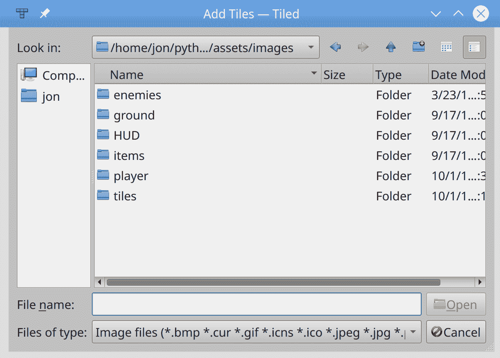](https://files.realpython.com/media/tiled-add-new-tiles.a2f04014b24b.png)

从这里，导航到下面列出的文件夹，将指定的资源添加到您的 tileset:

| 文件夹 | 文件 |
| --- | --- |
| `arcade-platformer/asseimg/ground/Grass` | 所有文件 |
|  |  |
| `arcade-platformer/asseimg/HUD` | `hudHeart_empty.png` |
|  | `hudHeart_full.png` |
|  | `hudHeart_half.png` |
|  | `hudX.png` |
|  |  |
| `arcade-platformer/asseimg/items` | `coinBronze.png` |
|  | `coinGold.png` |
|  | `coinSilver.png` |
|  | `flagGreen_down.png` |
|  | `flagGreen1.png` |
|  | `flagGreen2.png` |
|  |  |
| `arcade-platformer/asseimg/tiles` | `doorOpen_mid.png` |
|  | `doorOpen_top.png` |
|  | `grass.png` |
|  | `ladderMid.png` |
|  | `ladderTop.png` |
|  | `signExit.png` |
|  | `signLeft.png` |
|  | `signRight.png` |
|  | `torch1.png` |
|  | `torch2.png` |
|  | `water.png` |
|  | `waterTop_high.png` |
|  | `waterTop_low.png` |

添加完文件后，您的 tileset 应该如下所示:

[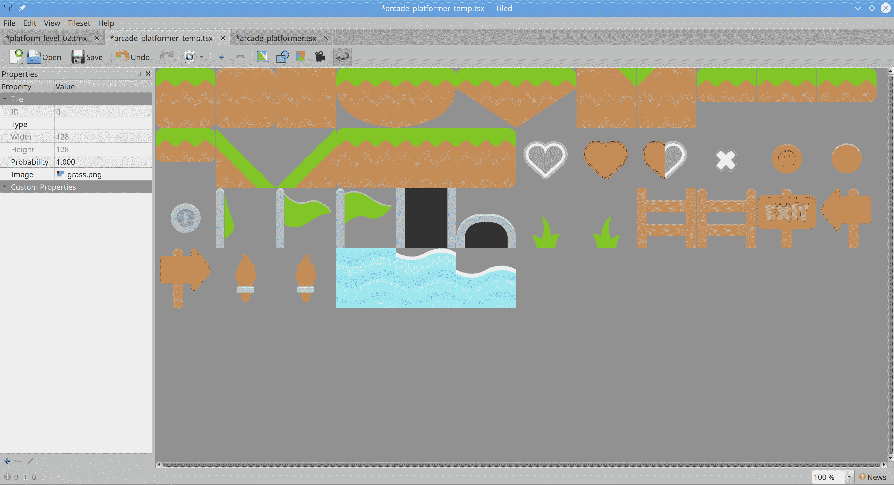](https://files.realpython.com/media/tiled-tileset-complete.bc9f5d88f7a0.png)

如果您没有看到所有的图块，请单击工具栏上的*动态换行图块*按钮来显示所有图块。

使用菜单中的 `Ctrl` + `S` 或*文件* → *保存*保存您的新图块集，并返回到您的图块地图。您将在平铺界面的右下角看到新的平铺集，准备用于定义您的平铺地图！

[*Remove ads*](/account/join/)

### *定义地图图层*

 *一个级别中的每个项目都有特定的用途:

*   地面和墙壁决定了玩家可以移动的位置和方式。
*   硬币和其他可收集的项目得分和解锁成就。
*   梯子允许玩家爬上新的平台，但不会阻碍移动。
*   背景项目提供视觉兴趣，并可能提供信息。
*   敌人为玩家提供了躲避的障碍。
*   目标提供了一个在这个水平上移动的理由。

这些不同的项目类型在`arcade`中需要不同的处理。因此，在平铺中定义它们时，将它们分开是有意义的。平铺允许你通过使用**地图图层**来做到这一点。通过将不同的项目类型放置在不同的地图图层上并分别处理每个图层，可以不同地跟踪和处理每种类型的精灵。

要定义一个层，首先打开平铺屏幕右上角的*层*视图:

[](https://files.realpython.com/media/tiled-layers-view.90a518e148da.png)

已经设置并选择了默认层。点击图层，将该图层重命名为`ground`，然后在左侧的*属性*视图中更改`Name`。或者，您可以双击名称直接在*图层*面板中编辑:

[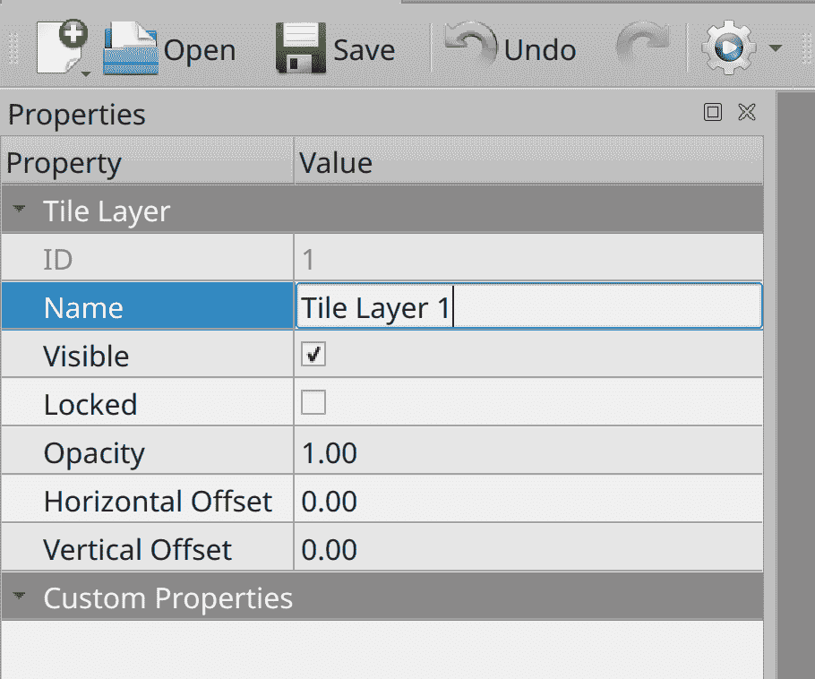](https://files.realpython.com/media/tiled-change-layer-name.4be8cb3e94db.png)

这一层将包含您的地面瓷砖，包括玩家不能走过的墙壁。

创建新图层不仅需要定义图层名称，还需要定义图层类型。平铺提供四种类型的图层:

1.  **图块层**允许您将图块从图块集中放置到地图上。放置仅限于网格位置，并且必须按照定义放置瓷砖。
2.  **对象层**允许你在地图上放置**对象**，例如收藏品或触发器。对象可以是来自图块地图的图块或自由绘制的形状，并且它们可以是可见的或不可见的。每个对象都可以自由定位、缩放和旋转。
3.  **图像层**允许您将图像放置在地图上，用作背景或前景图像。
4.  **图层组**允许您将图层分组，以便于地图管理。

在本教程中，您将使用对象图层在地图上放置硬币，并使用切片图层放置其他东西。

要创建新的平铺层，在*层*视图中点击*新建层*，然后选择*平铺层*:

[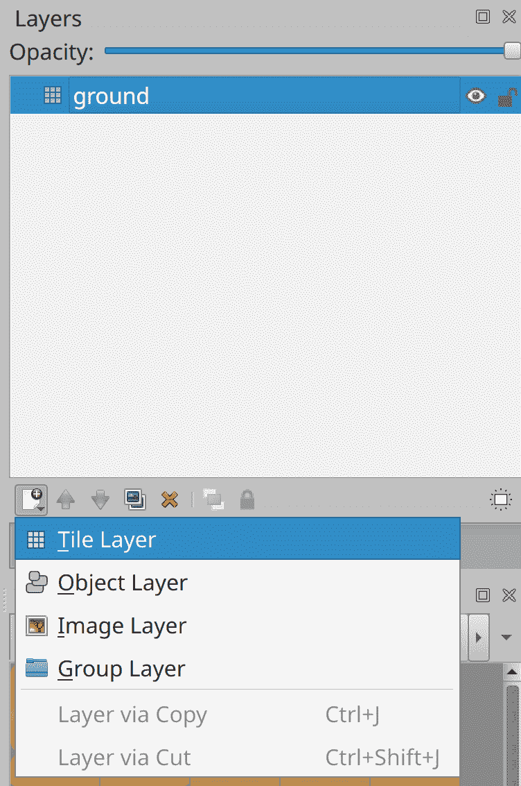](https://files.realpython.com/media/tiled-create-new-tile-layer.fa0f746dd2fe.png)

创建三个名为`ladders`、`background`和`goal`的新图块层。

接下来，创建一个名为`coins`的新对象层来保存你的收藏品:

[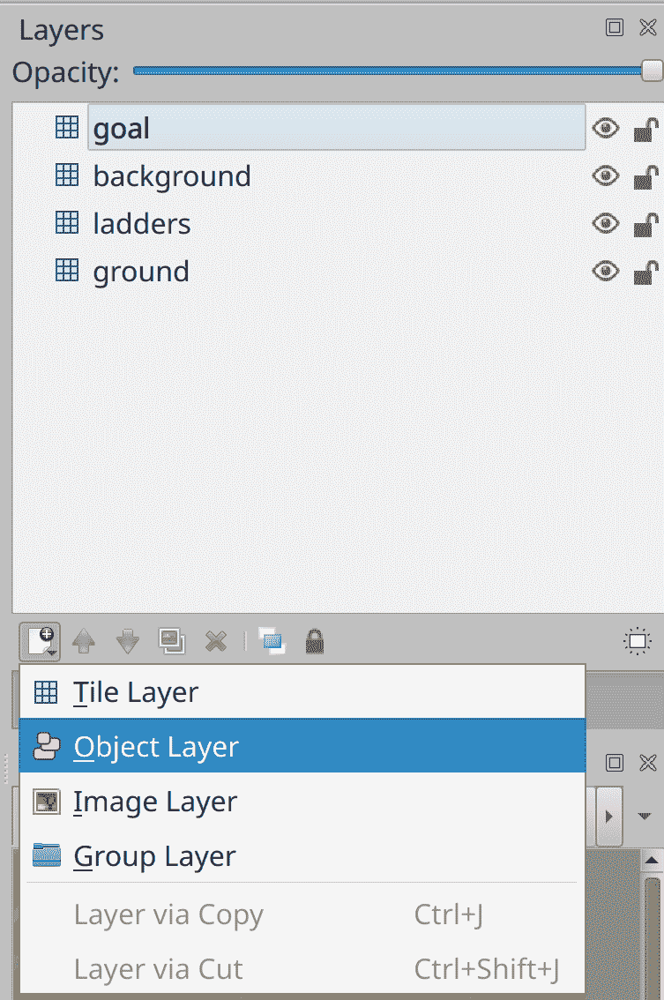](https://files.realpython.com/media/tiled-create-new-object-layer.65edd4d74a59.png)

您可以使用层视图底部的箭头按钮以任何您喜欢的顺序排列层。现在你可以开始布置你的关卡了！

### 设计关卡

在《经典游戏设计一书中，作者兼游戏开发者 Franz Lanzinger 为经典游戏设计定义了八条规则。以下是前三条规则:

1.  保持简单。
2.  立即开始游戏。
3.  由易到难渐变难度。

同样，资深游戏开发者史蒂夫·古德温在他的书《完美游戏开发》中谈到了平衡游戏。他强调好的游戏平衡从第一关开始，这“应该是第一个开发的，也是最后一个完成的。”

有了这些想法，这里有一些设计平台关卡的指导方针:

1.  游戏的第一关应该向用户介绍基本的游戏功能和控制。
2.  让最初的障碍变得容易克服。
3.  使第一批收藏品不可能错过，以后的更难得到。
4.  在用户学会如何在世界中导航之前，不要引入需要技巧来克服的障碍。
5.  在用户学会克服障碍之前，不要引入敌人。

下面是根据这些指导方针设计的第一级的详细介绍。在可下载的资料中，可以在`assets/platform_level_01.tmx`下找到完整的关卡设计:

[](https://files.realpython.com/media/tiled-level-one.968f21a84108.png)

玩家从左边开始，然后向右边前进，如指向右边的箭头所示。当玩家向右移动时，他们发现一枚铜币，这将增加他们的分数。第二枚铜币稍后被发现悬挂在更高的空中，这向玩家表明硬币可能在任何地方。然后玩家找到一枚金币，它有不同的点值。

然后，玩家爬上一个斜坡，这表明他们上方有更多的世界。山顶上是最后的金币，他们必须跳下去才能拿到。山的另一边是出口，也有标记。

这个简单的关卡有助于向用户展示如何移动和跳跃。说明世界上有值得收藏的物品价值点。它还显示信息性或装饰性的项目，玩家不会与之互动，如箭头标志、出口标志和草丛。最后，它向他们展示目标是什么样的。

完成第一关的艰苦设计后，你现在可以用瓷砖来建造它了。

[*Remove ads*](/account/join/)

### *建造一个关卡*

 *在你放置硬币和目标之前，你需要知道如何到达那里。所以首先要定义的是地面的位置。在平铺模式下选择你的平铺地图，选择`ground`层进行构建。

**注意:**在你的磁贴地图上放置磁贴时，确保你选择了正确的图层。否则，`arcade`将无法妥善处理您的物品。

从您的图块集中，选择`grassCenter`图块。然后，单击单幅图块地图底行的任意网格，将该单幅图块放置到位:

[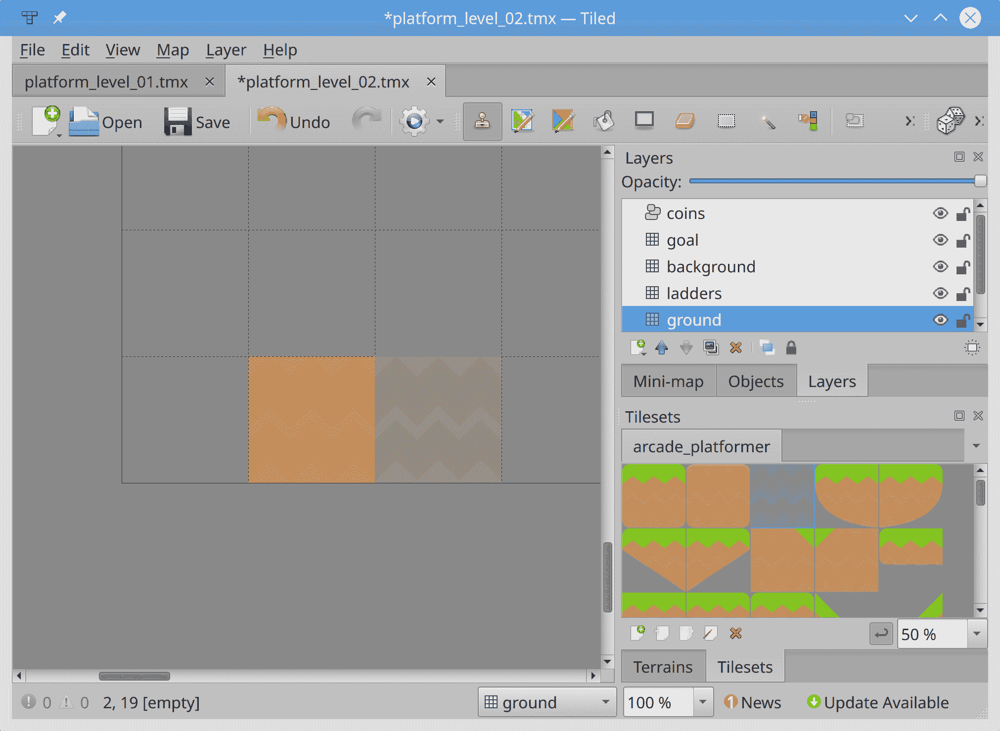](https://files.realpython.com/media/tiled-set-first-tile.cb9c5a87e0db.png)

使用第一个 tileset，您可以拖动底部的行，将所有内容设置为`grassCenter`。然后，选择`grassMid`图块，绘制穿过第二行的绿色关卡顶部:

[](https://files.realpython.com/media/tiled-place-grass.67cffa8b2fe0.png)

继续使用草砖来建造一个两瓦高的山丘，从地球的一半开始。在右边留出四块瓷砖的空间，为玩家提供下山的空间以及出口标志和出口入口。

接下来，切换到`goal`层，将出口处的图块从最右边开始放置:

[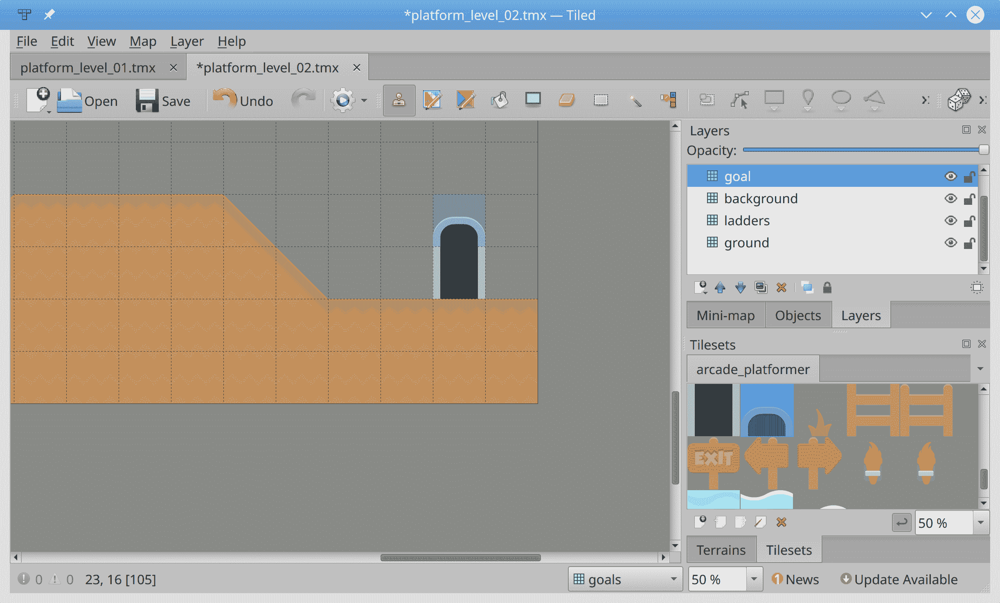](https://files.realpython.com/media/tiled-placing-goal.77876549ee7a.png)

有了基本的平台和目标，就可以放置一些背景物品了。切换到`background`层，在左侧放置一个箭头来指引玩家去哪里，并在入口旁边放置一个出口标志。您也可以在地图上的任何位置放置草簇:

[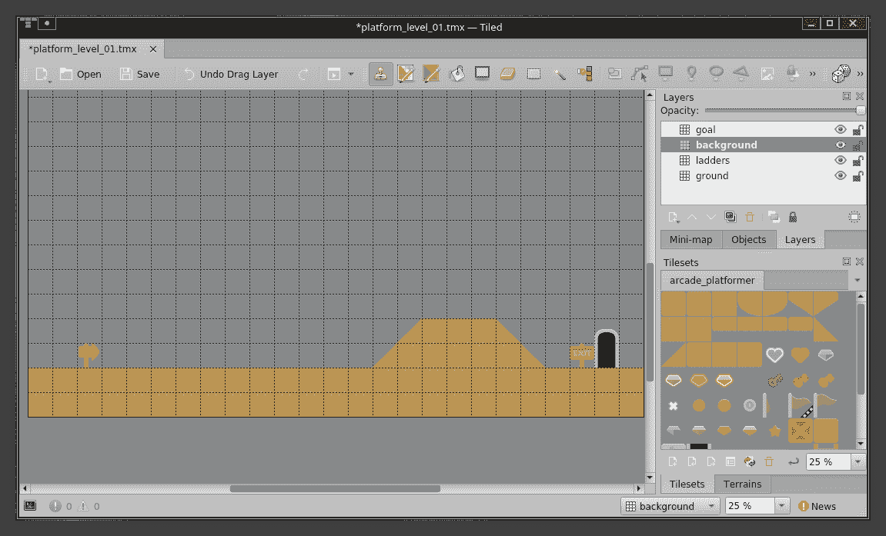](https://files.realpython.com/media/tiled-placing-background-items.363485459932.png)

现在，您可以定义放置硬币的位置。切换到你的`coins`层这样做。请记住，这是一个对象层，所以你不仅限于将硬币放在网格上。选择青铜硬币，并把它靠近开始箭头。将第二枚铜币放在右边稍远一点、稍高一点的地方:

[](https://files.realpython.com/media/tiled-placing-bronze-coins-2.16d910ae672e.png)

用两枚金币重复这一过程，一枚放在山前，一枚放在山顶，离山顶至少三块瓷砖:

[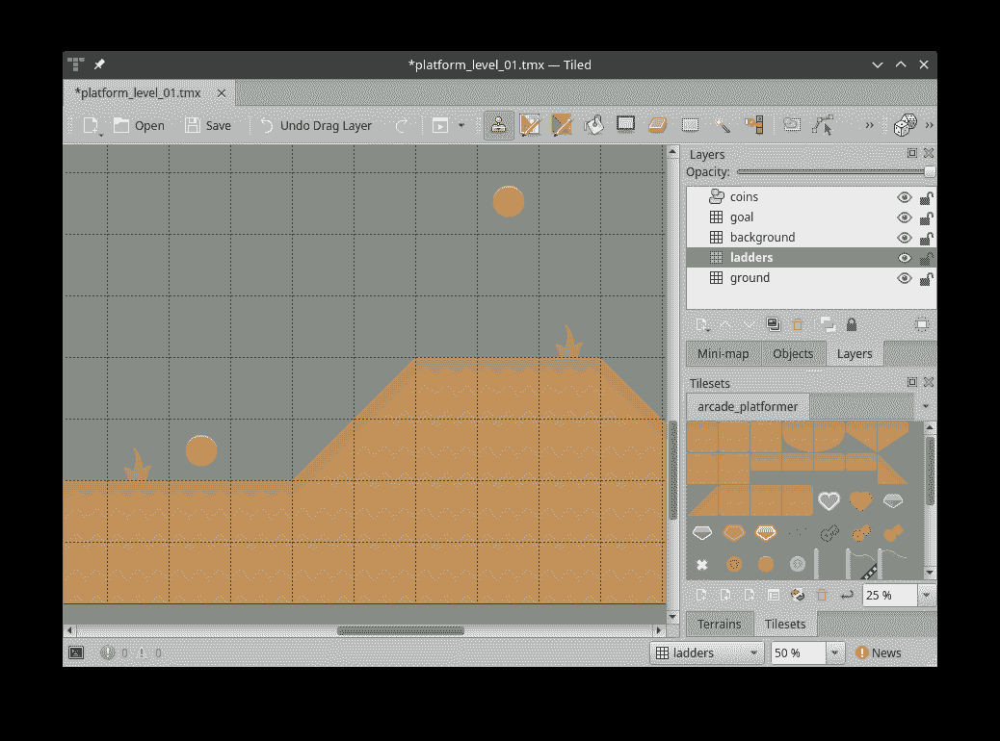](https://files.realpython.com/media/tiled-placing-gold-coins-2.4610a6e9e933.png)

当玩家收集硬币时，不同的硬币应该获得不同的分值。有几种方法可以做到这一点，但在本教程中，您将设置一个自定义属性来跟踪每个硬币的点值。

### 定义自定义属性

使用对象层的好处之一是能够在该层的对象上设置**自定义属性**。自定义属性由您定义，代表您希望的任何值。在这种情况下，您将使用它们来指定图层上每个硬币的点数。

选中*硬币*图层，按 `S` 开始选择对象。然后右键单击您放置的第一枚铜币，并从上下文菜单中选择*对象属性*查看其属性:

[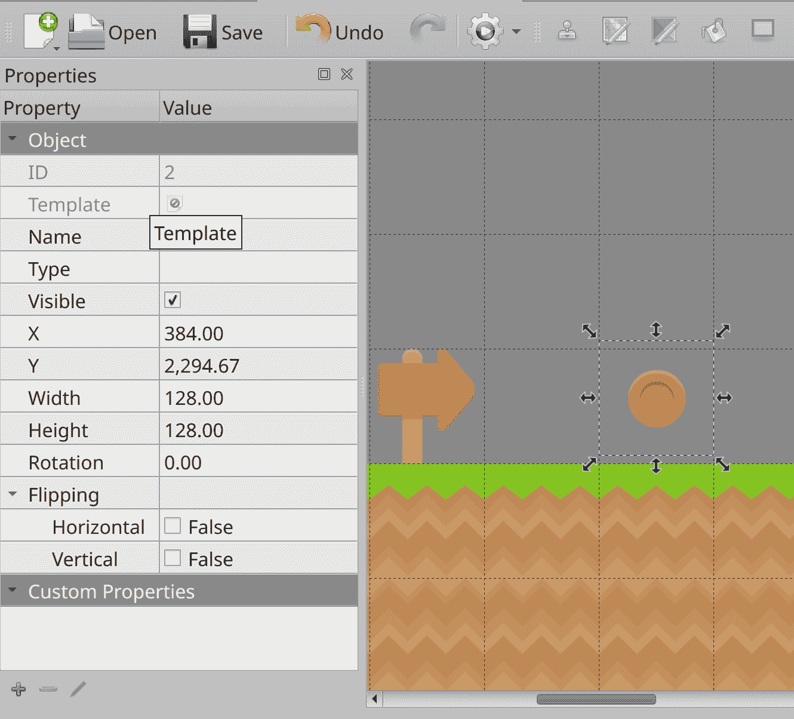](https://files.realpython.com/media/tiled-object-properties.1b3512ac419d.png)

预定义的对象属性显示在*对象属性*视图的顶部，而自定义属性显示在下方。目前没有自定义属性，因此您需要添加一个。点击*对象属性*视图底部的蓝色加号，添加一个新的自定义属性:

[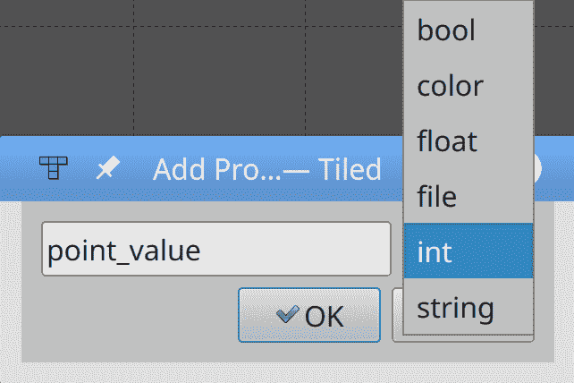](https://files.realpython.com/media/tiled-add-custom-property.2dbfc6971658.png)

您可以定义自定义特性的名称和类型。在这种情况下，您将属性设置为`int`，将名称设置为`point_value`。

**注意:**虽然自定义属性名`points`似乎是更好的选择，但是`arcade`在确定碰撞时在内部使用该属性名来定义精灵的形状。

定义自定义属性后，您可以在*对象属性*视图中设置其值:

[](https://files.realpython.com/media/tiled-set-property-value.924b2013967a.png)

对关卡中的每枚硬币执行相同的步骤，将铜币的值设置为`10`，金币的值设置为`20`。不要忘记保存关卡，因为接下来你将学习如何将它读入`arcade`。

[*Remove ads*](/account/join/)

### *阅读游戏关卡*

 *用 Tiled 定义游戏关卡很棒，但是除非你能把它读入`arcade`，否则用处不大。幸运的是，`arcade`原生支持读取平铺的平铺地图和处理图层。完成后，您的游戏将如下所示:

[](https://files.realpython.com/media/game-first-level-with-roz-2.9abdca4304bf.png)

读取你的游戏等级完全在`.setup()`中处理。这个代码可以在文件`arcade_platformer/03_read_level_one.py`中找到。

**注意:**如果您在文章进行过程中输入代码，代码块中显示的行号可能与代码中的行号不匹配。

在可能的情况下，添加了额外的上下文，使您能够找到正确的行来添加新代码。

首先，添加几个常量:

```py
# Game constants
# Window dimensions
SCREEN_WIDTH = 1000
SCREEN_HEIGHT = 650
SCREEN_TITLE = "Arcade Platformer"

# Scaling constants MAP_SCALING = 1.0 
# Player constants GRAVITY = 1.0 PLAYER_START_X = 65 PLAYER_START_Y = 256
```

这些常量定义了地图的比例因子，以及玩家的起始位置和世界中重力的强度。这些常量用于定义`.setup()`中的液位:

```py
def setup(self) -> None:
    """Sets up the game for the current level"""

    # Get the current map based on the level
    map_name = f"platform_level_{self.level:02}.tmx"
    map_path = ASSETS_PATH / map_name

    # What are the names of the layers?
    wall_layer = "ground"
    coin_layer = "coins"
    goal_layer = "goal"
    background_layer = "background"
    ladders_layer = "ladders"

    # Load the current map
    game_map = arcade.tilemap.read_tmx(str(map_path))

    # Load the layers
    self.background = arcade.tilemap.process_layer(
        game_map, layer_name=background_layer, scaling=MAP_SCALING
    )
    self.goals = arcade.tilemap.process_layer(
        game_map, layer_name=goal_layer, scaling=MAP_SCALING
    )
    self.walls = arcade.tilemap.process_layer(
        game_map, layer_name=wall_layer, scaling=MAP_SCALING
    )
    self.ladders = arcade.tilemap.process_layer(
        game_map, layer_name=ladders_layer, scaling=MAP_SCALING
    )
    self.coins = arcade.tilemap.process_layer(
        game_map, layer_name=coin_layer, scaling=MAP_SCALING
    )

    # Set the background color
    background_color = arcade.color.FRESH_AIR
    if game_map.background_color:
        background_color = game_map.background_color
    arcade.set_background_color(background_color)

    # Create the player sprite if they're not already set up
    if not self.player:
        self.player = self.create_player_sprite()

    # Move the player sprite back to the beginning
    self.player.center_x = PLAYER_START_X
    self.player.center_y = PLAYER_START_Y
    self.player.change_x = 0
    self.player.change_y = 0

    # Load the physics engine for this map
    self.physics_engine = arcade.PhysicsEnginePlatformer(
        player_sprite=self.player,
        platforms=self.walls,
        gravity_constant=GRAVITY,
        ladders=self.ladders,
    )
```

首先，使用当前级别构建当前平铺地图的名称。格式字符串`{self.level:02}`产生一个两位数的级别编号，并允许您定义多达 99 个不同的地图级别。

接下来，使用`pathlib`语法，定义地图的完整路径。这使得`arcade`能够正确定位你所有的游戏资源。

接下来，定义您的层的名称，您将很快使用它。确保这些名称与您在切片中定义的图层名称相匹配。

现在打开切片地图，以便处理之前命名的图层。函数`arcade.tilemap.process_layer()`有许多参数，但您将只提供其中的三个:

1.  `game_map`，包含待加工的层
2.  要读取和处理的图层的名称
3.  应用于拼贴的任何缩放

`arcade.tilemap.process_layer()`返回一个用代表层中瓷砖的`Sprite`对象填充的`SpriteList`。为图块定义的任何自定义属性，例如`coins`层中图块的`point_value`，都与`Sprite`一起存储在名为`.properties`的字典中。稍后您将看到如何访问它们。

您还可以设置级别的背景颜色。您可以使用*贴图* → *贴图属性*并定义*背景颜色*属性来定义自己的平铺背景颜色。如果背景颜色未设置为平铺，则使用预定义的`.FRESH_AIR`颜色。

接下来，检查是否已经创建了一个播放器。如果您调用`.setup()`来重新开始该级别或移动到下一个级别，可能会出现这种情况。如果没有，就调用一个方法来创建 player sprite(稍后会详细介绍)。如果有一个玩家，你就把他放到位置上，确保他不动。

最后，您可以定义要使用的物理引擎，传入以下参数:

1.  玩家精灵
2.  一个`SpriteList`包含墙壁
3.  定义重力的常数
4.  一个`SpriteList`包含梯子

墙壁决定了玩家可以移动的位置和跳跃的时间，梯子支持攀爬。重力常数控制着玩家下落的快慢。

当然，现在运行这段代码是行不通的，因为您仍然需要定义播放器。

[*Remove ads*](/account/join/)

## *定义玩家*

 *到目前为止，你的游戏缺少了一个玩家:

[](https://files.realpython.com/media/game-first-level-with-roz-2.9abdca4304bf.png)

在`.setup()`中，你调用了一个叫做`.create_player_sprite()`的方法来定义玩家，如果它还不存在的话。您用单独的方法创建播放器 sprite 有两个主要原因:

1.  它将播放器中的任何变化与`.setup()`中的其他代码隔离开来。
2.  它有助于简化游戏设置代码。

在任何游戏中，精灵都可以是静态的或动画的**。静态精灵不会随着游戏的进行而改变它们的外观，例如代表你的地面瓷砖、背景物品和硬币的精灵。相比之下，动画精灵会随着游戏的进行而改变它们的外观。为了增加一些视觉趣味，您将使您的播放器精灵动画。**

在 Python `arcade`中，你通过为每个动画序列定义一系列图像来创建一个动画精灵，这些图像被称为**纹理**，比如攀爬或行走。随着游戏的进行，`arcade`从动画序列的列表中选择下一个纹理进行显示。当到达列表的末尾时，`arcade`又从头开始。通过仔细挑选纹理，您可以在动画精灵中创建运动的幻觉:

[](https://files.realpython.com/media/platformer-animated-textures.339248eade01.png)

因为您的播放器精灵执行许多不同的活动，所以您为以下每一项提供纹理列表:

*   站立，面向左右两边
*   向左向右走
*   爬上爬下梯子

您可以为每个活动提供任意数量的纹理。如果你不想要一个动作动画，你可以提供一个单一的纹理。

文件`arcade_platformer/04_define_player.py`包含了`.create_player_sprite()`的定义，它定义了动画播放器精灵。将这个方法放在您的`.setup()`下面的`Platformer`类中:

```py
def create_player_sprite(self) -> arcade.AnimatedWalkingSprite:
    """Creates the animated player sprite

 Returns:
 The properly set up player sprite
 """
    # Where are the player images stored?
    texture_path = ASSETS_PATH / "images" / "player"

    # Set up the appropriate textures
    walking_paths = [
        texture_path / f"alienGreen_walk{x}.png" for x in (1, 2)
    ]
    climbing_paths = [
        texture_path / f"alienGreen_climb{x}.png" for x in (1, 2)
    ]
    standing_path = texture_path / "alienGreen_stand.png"

    # Load them all now
    walking_right_textures = [
        arcade.load_texture(texture) for texture in walking_paths
    ]
    walking_left_textures = [
        arcade.load_texture(texture, mirrored=True)
        for texture in walking_paths
    ]

    walking_up_textures = [
        arcade.load_texture(texture) for texture in climbing_paths
    ]
    walking_down_textures = [
        arcade.load_texture(texture) for texture in climbing_paths
    ]

    standing_right_textures = [arcade.load_texture(standing_path)]

    standing_left_textures = [
        arcade.load_texture(standing_path, mirrored=True)
    ]

    # Create the sprite
    player = arcade.AnimatedWalkingSprite()

    # Add the proper textures
    player.stand_left_textures = standing_left_textures
    player.stand_right_textures = standing_right_textures
    player.walk_left_textures = walking_left_textures
    player.walk_right_textures = walking_right_textures
    player.walk_up_textures = walking_up_textures
    player.walk_down_textures = walking_down_textures

    # Set the player defaults
    player.center_x = PLAYER_START_X
    player.center_y = PLAYER_START_Y
    player.state = arcade.FACE_RIGHT

    # Set the initial texture
    player.texture = player.stand_right_textures[0]

    return player
```

对于您的游戏，当罗兹行走和攀爬时，您可以设置他们的动画，而不是当他们只是静止不动时。每个动画都有两个独立的图像，您的首要任务是找到这些图像。您可以通过单击下面的链接下载本教程中使用的所有资源和源代码:

**获取源代码:** [点击此处获取您将在本教程中使用](https://realpython.com/bonus/platformer-python-arcade-code/)用 Python Arcade 构建平台游戏的源代码。

或者，您可以创建一个名为`asseimg/player`的文件夹来存储用于绘制 Roz 的纹理。然后，在您之前下载的`Platformer Pack Redux (360 Assets)`档案中，找到`PNG/Players/128x256/Green`文件夹，并将那里的所有图像复制到您的新`asseimg/player`文件夹中。

这个包含玩家纹理的新路径在`texture_path`中定义。使用这个路径，你使用[列表理解](https://realpython.com/list-comprehension-python/)和 [f 字符串格式化](https://realpython.com/python-f-strings/)来创建每个纹理资源的完整路径名。

有了这些路径，你就可以使用更多的列表理解，用`arcade.load_texture()`创建一个纹理列表。因为 Roz 可以左右行走，所以为每个方向定义不同的列表。图像显示 Roz 指向右边，所以当定义 Roz 面向左边行走或站立的纹理时，使用`mirrored`参数。向上或向下移动看起来是一样的，所以这些列表的定义是一样的。

即使只有一个站立纹理，你仍然需要把它放在一个列表中，这样`arcade`就可以正确地处理`AnimatedSprite`。

所有真正困难的工作现在都完成了。您创建实际的`AnimatedWalkingSprite`，指定要使用的纹理列表。接下来，设置 Roz 的初始位置和方向，以及要显示的第一个纹理。最后，在方法的末尾返回完整构造的 sprite。

现在你有了一个初始地图和一个玩家精灵。如果运行此代码，您应该会看到以下内容:

[](https://files.realpython.com/media/platformer-black-screen.33aa000b02b2.png)

这可不太有趣。这是因为虽然你已经创造了一切，你目前没有更新或绘制任何东西。是时候解决了！

[*Remove ads*](/account/join/)

### *更新和绘图*

 *更新游戏状态发生在`.on_update()`中，大约每秒钟`arcade`调用 60 次。此方法处理下列操作和事件:

*   移动玩家和敌人精灵
*   检测与敌人或收藏品的碰撞
*   更新分数
*   动画精灵

简而言之，让你的游戏可玩的一切都发生在`.on_update()`。更新完所有内容后，`arcade`调用`.on_draw()`将所有内容呈现到屏幕上。

这种游戏逻辑与游戏显示的分离意味着您可以自由地添加或修改游戏中的特性，而不会影响显示游戏的代码。其实因为游戏逻辑大部分发生在`.on_update()`里，所以你的`.on_draw()`方法往往很短。

您可以在可下载的资料中找到下面`arcade_platformer/05_update_and_draw.py`中的所有代码。将`.on_draw()`添加到您的`Platformer`类中:

```py
def on_draw(self) -> None:
    arcade.start_render()

    # Draw all the sprites
    self.background.draw()
    self.walls.draw()
    self.coins.draw()
    self.goals.draw()
    self.ladders.draw()
    self.player.draw()
```

在强制调用`arcade.start_render()`之后，你调用所有精灵列表中的`.draw()`，然后是玩家精灵。请注意绘制项目的顺序。你应该从出现在最后面的精灵开始，然后继续向前。现在，当您运行代码时，它应该看起来像这样:

[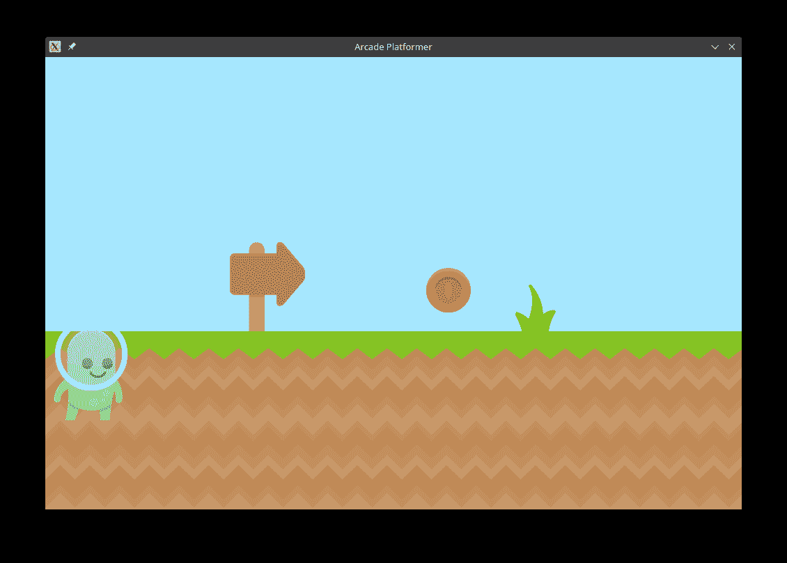](https://files.realpython.com/media/platformer-initial-screen-2.98284807b2b1.png)

唯一缺少的是正确放置玩家精灵。为什么？因为动画精灵需要更新以选择合适的纹理显示和屏幕上合适的位置，而你还没有更新任何东西。看起来是这样的:

```py
def on_update(self, delta_time: float) -> None:
    """Updates the position of all game objects

 Arguments:
 delta_time {float} -- How much time since the last call
 """

    # Update the player animation
    self.player.update_animation(delta_time)

    # Update player movement based on the physics engine
    self.physics_engine.update()

    # Restrict user movement so they can't walk off screen
    if self.player.left < 0:
        self.player.left = 0

    # Check if we've picked up a coin
    coins_hit = arcade.check_for_collision_with_list(
        sprite=self.player, sprite_list=self.coins
    )

    for coin in coins_hit:
        # Add the coin score to our score
        self.score += int(coin.properties["point_value"])

        # Play the coin sound
        arcade.play_sound(self.coin_sound)

        # Remove the coin
        coin.remove_from_sprite_lists()

    # Now check if we're at the ending goal
    goals_hit = arcade.check_for_collision_with_list(
        sprite=self.player, sprite_list=self.goals
    )

    if goals_hit:
        # Play the victory sound
        self.victory_sound.play()

        # Set up the next level
        self.level += 1
        self.setup()
```

为了确保你的游戏以[恒定速度](https://realpython.com/pygame-a-primer/#game-speed)运行，无论实际帧速率如何，`.on_update()`都采用一个名为`delta_time`的单一 [`float`](https://realpython.com/python-numbers/#floating-point-numbers) 参数，该参数指示自上次更新以来的时间。

首先要做的是动画播放器精灵。根据玩家的动作，`.update_animation()`自动选择正确的纹理来使用。

接下来，你更新所有可以移动的物体的移动。既然你在`.setup()`中定义了一个物理引擎，让它处理运动是有意义的。然而，物理引擎会让玩家跑出游戏地图的左侧，所以你也需要采取措施来防止这种情况。

**重要:**确保你在`PhysicsEnginePlatformer.update()`之前打电话给`AnimatedSprite.update_animation()`。通过首先更新精灵，您可以确保物理引擎将作用于当前精灵设置，而不是前一帧的精灵设置。

现在玩家已经移动了，你检查他们是否与硬币相撞。如果是这样，这算作收集硬币，所以您使用您在 Tiled 中定义的`point_value`自定义属性来增加玩家的分数。然后你放一个声音，并把硬币从游戏场上拿走。

你还要检查玩家是否达到了最终目标。如果是这样，你播放胜利的声音，增加等级，并再次调用`.setup()`来加载下一张地图并重置其中的玩家。

但是用户如何达到最终目标呢？物理引擎将确保 Roz 不会从地板上摔下来，并且可以跳跃，但它实际上不知道将 Roz 移动到哪里或何时跳跃。这是用户应该决定的事情，你需要为他们提供一种方法来做这件事。

### 移动玩家精灵

在电脑游戏的早期，唯一可用的输入设备是键盘。即使在今天，许多游戏——包括这个——仍然提供键盘控制。

使用键盘移动播放器可以通过多种方式完成。有许多不同的流行键盘排列，包括:

*   [箭头键](https://en.wikipedia.org/wiki/Arrow_keys)
*   [IJKM 键](https://en.wikipedia.org/wiki/Arrow_keys#IJKM_keys)
*   [IJKL 键](https://en.wikipedia.org/wiki/Arrow_keys#IJKL_keys)
*   [左手控制的 WASD 键](https://en.wikipedia.org/wiki/Arrow_keys#WASD_keys)

当然还有[很多其他键盘排列](https://en.wikipedia.org/wiki/Arrow_keys#Alternative_keys)可以选择。

因为你需要允许 Roz 向四个方向移动和跳跃，所以在这个游戏中，你将使用箭头键和 IJKL 键移动，使用空格键跳跃:

[https://player.vimeo.com/video/530532458?background=1](https://player.vimeo.com/video/530532458?background=1)

`arcade`中的所有键盘输入都由`.on_key_press()`和`.on_key_release()`处理。你可以在`arcade_platformer/06_keyboard_movement.py`中找到通过键盘让 Roz 移动的代码。

首先，您需要两个新常数:

```py
23# Player constants
24GRAVITY = 1.0
25PLAYER_START_X = 65
26PLAYER_START_Y = 256
27PLAYER_MOVE_SPEED = 10 28PLAYER_JUMP_SPEED = 20
```

这些常数控制 Roz 移动的速度。`PLAYER_MOVE_SPEED`控制他们在梯子上向左、向右和上下移动。`PLAYER_JUMP_SPEED`表示 Roz 能跳多高。通过将这些值设置为常量，您可以在测试期间调整它们以适应正确的游戏。

您在`.on_key_press()`中使用这些常量:

```py
def on_key_press(self, key: int, modifiers: int) -> None:
    """Arguments:
 key -- Which key was pressed
 modifiers -- Which modifiers were down at the time
 """

    # Check for player left or right movement
    if key in [arcade.key.LEFT, arcade.key.J]:
        self.player.change_x = -PLAYER_MOVE_SPEED
    elif key in [arcade.key.RIGHT, arcade.key.L]:
        self.player.change_x = PLAYER_MOVE_SPEED

    # Check if player can climb up or down
    elif key in [arcade.key.UP, arcade.key.I]:
        if self.physics_engine.is_on_ladder():
            self.player.change_y = PLAYER_MOVE_SPEED
    elif key in [arcade.key.DOWN, arcade.key.K]:
        if self.physics_engine.is_on_ladder():
            self.player.change_y = -PLAYER_MOVE_SPEED

    # Check if player can jump
    elif key == arcade.key.SPACE:
        if self.physics_engine.can_jump():
            self.player.change_y = PLAYER_JUMP_SPEED
            # Play the jump sound
            arcade.play_sound(self.jump_sound)
```

该代码有三个主要部分:

1.  您通过检查 IJKL 排列中的 `Left` 和 `Right` 箭头以及 `J` 和 `L` 键来处理水平移动。然后适当地设置`.change_x`属性。

2.  您可以通过检查 `Up` 和 `Down` 箭头以及 `I` 和 `K` 键来处理垂直移动。然而，由于 Roz 只能在梯子上上下移动，所以在上下移动之前，您需要使用`.is_on_ladder()`来验证。

3.  你可以通过 `Space` 键来控制跳跃。为了防止 Roz 在半空中跳跃，您使用`.can_jump()`检查 Roz *是否能*跳跃，只有 Roz 站在墙上时，T1 才返回`True`。如果是这样，你把播放器上移，播放跳跃声。

当你释放一个键，罗兹应该停止移动。您在`.on_key_release()`中进行了设置:

```py
def on_key_release(self, key: int, modifiers: int) -> None:
    """Arguments:
 key -- The key which was released
 modifiers -- Which modifiers were down at the time
 """

    # Check for player left or right movement
    if key in [
        arcade.key.LEFT,
        arcade.key.J,
        arcade.key.RIGHT,
        arcade.key.L,
    ]:
        self.player.change_x = 0

    # Check if player can climb up or down
    elif key in [
        arcade.key.UP,
        arcade.key.I,
        arcade.key.DOWN,
        arcade.key.K,
    ]:
        if self.physics_engine.is_on_ladder():
            self.player.change_y = 0
```

这段代码遵循与`.on_key_press()`相似的模式:

1.  您检查是否有任何水平移动键被释放。如果是，那么 Roz 的`change_x`被设置为 0。
2.  你检查垂直移动键是否被释放。同样，因为 Roz 需要在梯子上上下移动，所以您也需要在这里检查`.is_on_ladder()`。如果没有，玩家可以跳起来，然后按下并释放 `Up` ，让罗兹悬在半空中！

请注意，您不需要检查是否释放了跳转键。

好了，现在你可以移动罗兹了，但是为什么罗兹只是向右走出窗户？你需要一种方法来保持 Roz 在游戏世界中移动时可见，这就是视口的作用。

[*Remove ads*](/account/join/)

## *滚动视窗*

 *早期的视频游戏将游戏限制在一个窗口中，对玩家来说，这个窗口就是整个世界。然而，现代视频游戏世界可能太大，以至于无法在一个小小的游戏窗口中显示。大多数游戏都实现了滚动视图，向玩家展示游戏世界的一部分。在 Python `arcade`中，这种滚动视图被称为**视口**。它本质上是一个矩形，定义了你在游戏窗口中显示游戏世界的哪一部分:

[https://player.vimeo.com/video/530532574?background=1](https://player.vimeo.com/video/530532574?background=1)

您可以在`arcade_platformer/07_scrolling_view.py`下的可下载资料中找到这段代码。

要实现滚动视图，需要根据 Roz 的当前位置定义视口。当 Roz 接近游戏窗口的任何边缘时，你在行进的方向上移动视口，这样 Roz 在屏幕上保持舒适。您还可以确保视口不会滚动到可见世界之外。为此，您需要了解一些事情:

*   在视窗滚动之前，Roz 可以移动到游戏窗口边缘多近？这被称为**边距**，并且对于每个窗口边缘它可以是不同的。
*   当前视口现在在哪里？
*   你的游戏地图有多宽？
*   罗兹现在在哪里？

首先，在代码顶部将边距定义为常量:

```py
# Player constants
GRAVITY = 1.0
PLAYER_START_X = 65
PLAYER_START_Y = 256
PLAYER_MOVE_SPEED = 10
PLAYER_JUMP_SPEED = 20

# Viewport margins
# How close do we have to be to scroll the viewport?
LEFT_VIEWPORT_MARGIN = 50 RIGHT_VIEWPORT_MARGIN = 300 TOP_VIEWPORT_MARGIN = 150 BOTTOM_VIEWPORT_MARGIN = 150
```

注意`LEFT_VIEWPORT_MARGIN`和`RIGHT_VIEWPORT_MARGIN`的区别。这使得罗兹更接近左边缘，而不是右边缘。这样，当 Roz 向右移动时，用户有更多的时间看到障碍物并做出反应。

视口是一个矩形，宽度和高度与游戏窗口相同，分别是常量`SCREEN_WIDTH`和`SCREEN_HEIGHT`。因此，要完整地描述视口，只需要知道左下角的位置。通过改变这个角，视口将对 Roz 的移动做出反应。你在你的游戏对象中跟踪这个角，并在`.setup()`中定义它，就在你将罗兹移动到关卡的开始之后:

```py
# Move the player sprite back to the beginning
self.player.center_x = PLAYER_START_X
self.player.center_y = PLAYER_START_Y
self.player.change_x = 0
self.player.change_y = 0

# Reset the viewport self.view_left = 0 self.view_bottom = 0
```

对于本教程，由于每个级别都从同一个地方开始，所以视口的左下角也总是从同一个地方开始。

您可以通过将游戏地图中包含的方块数量乘以每个方块的宽度来计算游戏地图的宽度。在您阅读每张地图并在`.setup()`中设置背景颜色后，您可以计算这个值:

```py
# Set the background color
background_color = arcade.color.FRESH_AIR
if game_map.background_color:
    background_color = game_map.background_color
arcade.set_background_color(background_color)

# Find the edge of the map to control viewport scrolling
self.map_width = (
 game_map.map_size.width - 1 ) * game_map.tile_size.width
```

从`game_map.map_size.width`中减去`1`校正平铺使用的平铺索引。

最后，通过检查`self.player`中的任何位置属性，您可以随时知道 Roz 的位置。

以下是如何使用所有这些信息来滚动`.update()`中的视窗:

1.  更新 Roz 的位置后，计算它们是否在四条边中任何一条边的边距内。
2.  如果是这样，您将视口向该方向移动 Roz 在边距内的量。

您可以将这段代码放在`Platformer`类的一个单独的方法中，以便于更新:

```py
def scroll_viewport(self) -> None:
    """Scrolls the viewport when the player gets close to the edges"""
    # Scroll left
    # Find the current left boundary
    left_boundary = self.view_left + LEFT_VIEWPORT_MARGIN

    # Are we to the left of this boundary? Then we should scroll left.
    if self.player.left < left_boundary:
        self.view_left -= left_boundary - self.player.left
        # But don't scroll past the left edge of the map
        if self.view_left < 0:
            self.view_left = 0

    # Scroll right
    # Find the current right boundary
    right_boundary = self.view_left + SCREEN_WIDTH - RIGHT_VIEWPORT_MARGIN

    # Are we to the right of this boundary? Then we should scroll right.
    if self.player.right > right_boundary:
        self.view_left += self.player.right - right_boundary
        # Don't scroll past the right edge of the map
        if self.view_left > self.map_width - SCREEN_WIDTH:
            self.view_left = self.map_width - SCREEN_WIDTH

    # Scroll up
    top_boundary = self.view_bottom + SCREEN_HEIGHT - TOP_VIEWPORT_MARGIN
    if self.player.top > top_boundary:
        self.view_bottom += self.player.top - top_boundary

    # Scroll down
    bottom_boundary = self.view_bottom + BOTTOM_VIEWPORT_MARGIN
    if self.player.bottom < bottom_boundary:
        self.view_bottom -= bottom_boundary - self.player.bottom

    # Only scroll to integers. Otherwise we end up with pixels that
    # don't line up on the screen.
    self.view_bottom = int(self.view_bottom)
    self.view_left = int(self.view_left)

    # Do the scrolling
    arcade.set_viewport(
        left=self.view_left,
        right=SCREEN_WIDTH + self.view_left,
        bottom=self.view_bottom,
        top=SCREEN_HEIGHT + self.view_bottom,
    )
```

这段代码可能看起来有点混乱，所以看一个具体的例子可能是有用的，比如当 Roz 向右移动并且您需要滚动视口时会发生什么。下面是您将浏览的代码:

```py
# Scroll right
# Find the current right boundary
right_boundary = self.view_left + SCREEN_WIDTH - RIGHT_VIEWPORT_MARGIN

# Are we right of this boundary? Then we should scroll right.
if self.player.right > right_boundary:
    self.view_left += self.player.right - right_boundary
    # Don't scroll past the right edge of the map
    if self.view_left > self.map_width - SCREEN_WIDTH:
        self.view_left = self.map_width - SCREEN_WIDTH
```

以下是一些关键变量的示例值:

*   Roz 向右移动，将他们的`self.player.right`属性设置为`710`。
*   视口还没变，所以`self.view_left`目前是`0`。
*   常数`SCREEN_WIDTH`为`1000`。
*   常数`RIGHT_VIEWPORT_MARGIN`为`300`。

首先，计算`right_boundary`的值，该值确定 Roz 是否在视窗右边缘的边距内:

*   可视视口的右边是`self.view_left + SCREEN_WIDTH`，也就是`1000`。
*   从这里减去`RIGHT_VIEWPORT_MARGIN`得到`700`的`right_boundary`。

接下来，检查 Roz 是否已经超过了`right_boundary`。因为`self.player.right > right_boundary`是`True`，你需要移动视窗，所以你计算移动多远:

*   将`self.player.right - right_boundary`计算为`10`，这是 Roz 移动到右边距的距离。
*   由于视口矩形是从左侧测量的，因此将其添加到`self.view_left`中，使其成为`10`。

但是，您不希望将视口移出世界的边缘。如果视口一直向右滚动，其左边缘将是小于地图宽度的全屏宽度:

*   检查`self.view_left > self.map_width - SCREEN_WIDTH`是否。
*   如果是这样，只需将`self.view_left`设置为该值来限制视窗移动。

对左边界执行相同的步骤。顶部和底部边缘也被检查以更新`self.view_bottom`。两个视图变量都更新后，最后要做的是使用`arcade.set_viewport()`设置视口。

因为您将这段代码放在一个单独的方法中，所以在`.on_update()`的末尾调用它:

```py
if goals_hit:
    # Play the victory sound
    self.victory_sound.play()

    # Set up the next level
    self.level += 1
    self.setup()

# Set the viewport, scrolling if necessary
self.scroll_viewport()
```

有了这个，你的游戏视图应该随着罗兹向左、向右、向上或向下移动，永远不要让他们离开屏幕！

就这样，你有了一个平台！现在是时候添加一些额外的东西了！

## 添加额外功能

除了增加越来越复杂的平台，还有一些额外的功能可以让你的游戏脱颖而出。本教程将涵盖其中一些，包括:

*   维护屏幕上的分数
*   使用操纵杆或游戏控制器控制 Roz
*   添加标题、结束游戏、帮助和暂停屏幕
*   自动移动敌人和平台

因为您已经在滚动视图中看到了它的运行，所以让我们从在屏幕上添加跑步得分开始。

### 屏幕得分

你已经在`self.score`中记录了玩家的分数，这意味着你需要做的就是把它画在屏幕上。你可以在`.on_draw()`中使用`arcade.draw_text()`来处理这个问题:

[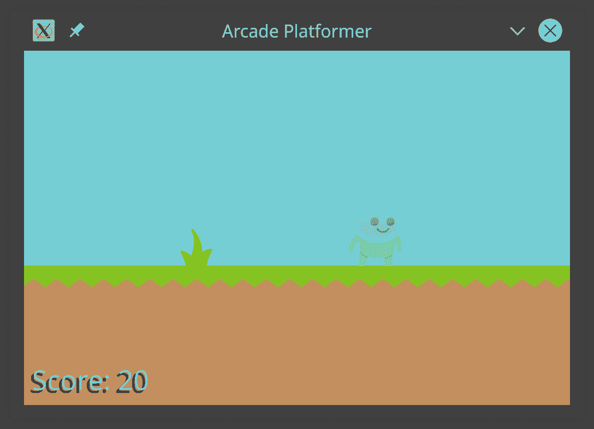](https://files.realpython.com/media/platform-on-screen-score.e3ee466982ff.png)

你可以在`arcade_platformer/08_on_screen_score.py`中找到这段代码。

得出分数的代码出现在`.on_draw()`的底部，就在`self.player.draw()`调用之后。你最后画出分数，这样它总是比其他任何东西都清晰可见:

```py
def on_draw(self) -> None:
    arcade.start_render()

    # Draw all the sprites
    self.background.draw()
    self.walls.draw()
    self.coins.draw()
    self.goals.draw()
    self.ladders.draw()
    self.player.draw()

 # Draw the score in the lower left score_text = f"Score: {self.score}"   # First a black background for a shadow effect arcade.draw_text( score_text, start_x=10 + self.view_left, start_y=10 + self.view_bottom, color=arcade.csscolor.BLACK, font_size=40, ) # Now in white, slightly shifted arcade.draw_text( score_text, start_x=15 + self.view_left, start_y=15 + self.view_bottom, color=arcade.csscolor.WHITE, font_size=40, )
```

首先，构建显示当前分数的字符串。这是后续调用`arcade.draw_text()`时将显示的内容。然后，您在屏幕上绘制实际的文本，并传入以下参数:

*   要绘制的文本
*   `start_x`和`start_y`坐标表示开始绘制文本的位置
*   `color`绘制文本
*   `font_size`在积分中使用

通过将`start_x`和`start_y`参数基于视窗属性`self.view_left`和`self.view_bottom`，您可以确保乐谱总是显示在窗口中的相同位置，即使视窗移动时也是如此。

您第二次绘制相同的文本，但是稍微移动了一下，颜色变浅，以提供一些对比。

有更多的选项可以与`arcade.draw_text()`一起使用，包括指定粗体或斜体文本以及使用游戏特定的字体。查看[文档](https://arcade.academy/arcade.html#arcade.draw_text)来定制你喜欢的文本。

### 操纵杆和游戏控制器

平台游戏非常适合操纵杆和游戏控制器。控制面板、控制杆和无数的按钮给了你很多机会来最终控制屏幕上的角色。添加操纵杆控制有助于您的游戏脱颖而出。

与键盘控制不同，没有特定的操纵杆方法可以覆盖。相反，`arcade`提供了一个设置操纵杆的函数，并公开了来自`pyglet`的变量和方法来读取实际操纵杆和按钮的状态。您在游戏中使用以下子集:

*   **`arcade.get_joysticks()`** 返回连接到系统的操纵杆列表。如果该列表为空，则不存在操纵杆。
*   **`joystick.x`** 和 **`joystick.y`** 分别返回操纵杆在水平和垂直方向偏转的状态。这些`float`值的范围从-1.0 到 1.0，需要转换成对你的游戏有用的值。
*   **`joystick.buttons`** 返回一列指定控制器上所有按钮状态的[布尔值](https://realpython.com/python-boolean/)。如果按钮被按下，其值将为`True`。

关于可用操纵杆变量和方法的完整列表，请查看 [`pyglet`文档](https://pyglet-current.readthedocs.io/en/latest/api/pyglet/input/pyglet.input.Joystick.html)。

这方面的代码可以在`arcade_platformer/09_joystick_control.py`中找到。

在你的玩家可以使用游戏杆之前，你需要验证游戏的`.__init__()`方法中是否连接了一个游戏杆。加载游戏声音后会出现以下代码:

```py
# Check if a joystick is connected
joysticks = arcade.get_joysticks()

if joysticks:
    # If so, get the first one
    self.joystick = joysticks[0]
    self.joystick.open()
else:
    # If not, flag it so we won't use it
    print("There are no Joysticks")
    self.joystick = None
```

首先，使用`arcade.get_joysticks()`枚举所有连接的操纵杆。如果找到，第一个保存为`self.joystick`。否则，你就设定`self.joystick = None`。

检测并定义了操纵杆后，您可以读取它来为 Roz 提供控制。在任何其他检查之前，在`.on_update()`的顶部执行此操作:

```py
def on_update(self, delta_time: float) -> None:
    """Updates the position of all game objects

 Arguments:
 delta_time {float} -- How much time since the last call
 """

 # First, check for joystick movement if self.joystick: # Check if we're in the dead zone if abs(self.joystick.x) > DEAD_ZONE: self.player.change_x = self.joystick.x * PLAYER_MOVE_SPEED else: self.player.change_x = 0   if abs(self.joystick.y) > DEAD_ZONE: if self.physics_engine.is_on_ladder(): self.player.change_y = self.joystick.y * PLAYER_MOVE_SPEED else: self.player.change_y = 0   # Did the user press the jump button? if self.joystick.buttons[0]: if self.physics_engine.can_jump(): self.player.change_y = PLAYER_JUMP_SPEED # Play the jump sound arcade.play_sound(self.jump_sound) 
    # Update the player animation
    self.player.update_animation(delta_time)
```

在阅读游戏杆之前，首先要确保游戏杆已连接。

所有静止的操纵杆都围绕中心值或零值波动。因为`joystick.x`和`joystick.y`返回`float`值，这些波动可能导致返回值稍微高于或低于零，这将转化为 Roz 在没有任何操纵杆输入的情况下非常轻微地移动。

为了解决这个问题，游戏设计者定义了一个操纵杆**死区**来包含这些小波动。该死区内对`joystick.x`或`joystick.y`的任何更改都会被忽略。您可以通过首先在代码顶部定义一个常量`DEAD_ZONE`来实现一个死区:

```py
# Viewport margins
# How close do we have to be to scroll the viewport?
LEFT_VIEWPORT_MARGIN = 50
RIGHT_VIEWPORT_MARGIN = 300
TOP_VIEWPORT_MARGIN = 150
BOTTOM_VIEWPORT_MARGIN = 150

# Joystick control DEAD_ZONE = 0.1
```

现在你可以检查操纵杆是否移动超过`DEAD_ZONE`。如果不是，你忽略操纵杆输入。否则，你用操纵杆值乘以`PLAYER_MOVE_SPEED`来移动 Roz。这使得玩家可以根据操纵杆的推动程度来更快或更慢地移动 Roz。记住，在你允许罗兹上下移动之前，你仍然必须检查他是否在梯子上。

接下来，你处理跳跃。如果操纵杆上的第一个按钮被按下，也就是我游戏手柄上的 `A` 按钮，你会将其解释为跳转命令，并让 Roz 以与 `Space` 相同的方式跳转。

就是这样！现在你可以使用任何操作系统支持的操纵杆来控制 Roz！

### 标题和其他屏幕

一个没有介绍就开始的游戏会让你的用户感觉被抛弃了。除非他们已经知道该做什么，否则在没有标题屏幕或基本说明的情况下直接从 1 级开始游戏会令人不安。你可以在`arcade`中使用**视图**来解决这个问题。

在`arcade`中的一个视图代表了你想向用户展示的任何东西，无论是静态文本、关卡间的过场动画，还是真实的游戏本身。视图是基于类`arcade.View`的，可以用来向用户显示信息，也可以让他们玩你的游戏:

[https://player.vimeo.com/video/530532600?background=1](https://player.vimeo.com/video/530532600?background=1)

对于这个游戏，您将定义三个独立的视图:

1.  **标题视图**允许用户开始游戏或查看帮助屏幕。
2.  **指令视图**向用户显示背景故事和基本控件。
3.  **暂停视图**在用户暂停游戏时显示。

为了使一切无缝，你首先需要把你的游戏转换成一个视图，所以你现在要做的就是这个！

#### `PlatformerView`

修改现有游戏以无缝使用视图需要三个单独的代码更改。您可以在`arcade_platformer/10_view_conversion.py`的可下载资料中找到这些变化。您可以通过单击下面的链接下载本教程中使用的所有材料和代码:

**获取源代码:** [点击此处获取您将在本教程中使用](https://realpython.com/bonus/platformer-python-arcade-code/)用 Python Arcade 构建平台游戏的源代码。

第一个是对您的`Platformer`类的一行修改:

```py
class PlatformerView(arcade.View):
    def __init__(self) -> None:
 super().__init__()
```

为了保持命名的一致性，您可以更改类名和基类名。从功能上来说，`PlatformerView`类包含了与最初的`Platformer`类相同的方法。

第二个变化是在`.__init__()`中，这里不再传入常量`SCREEN_WIDTH`、`SCREEN_HEIGHT`或`SCREEN_TITLE`。这是因为您的`PlatformerView`类现在是基于`arcade.View`的，它不使用这些常量。您的`super()`调用也会发生变化以反映这一点。

为什么不再需要那些常量了？视图不是窗口，所以没有必要传入那些`arcade.Window`参数。那么你在哪里定义游戏窗口的大小和外观呢？

这发生在最后的更改中，在文件的底部，在`__main__`部分:

```py
if __name__ == "__main__":
 window = arcade.Window( width=SCREEN_WIDTH, height=SCREEN_HEIGHT, title=SCREEN_TITLE ) platform_view = PlatformerView() platform_view.setup() window.show_view(platform_view)    arcade.run()
```

您显式地创建一个`arcade.Window`来显示您的视图。然后创建`PlatformerView`对象，调用`.setup()`，并使用`window.show_view(platformer_view)`来显示它。一旦它是可见的，你像以前一样运行你的游戏。

这些改变应该不会对游戏的功能造成影响，所以测试之后，你就可以添加一个标题视图了。

#### 标题视图

任何游戏的标题视图都应该稍微展示一下游戏，并允许玩家在闲暇时开始游戏。虽然动画标题页是可能的，但在本教程中，您将创建一个带有简单菜单的静态标题视图，以允许用户开始游戏或查看帮助屏幕:

[https://player.vimeo.com/video/530532600?background=1](https://player.vimeo.com/video/530532600?background=1)

这方面的代码可以在`arcade_platformer/11_title_view.py`找到。

创建标题视图首先要为它定义一个新类:

```py
class TitleView(arcade.View):
    """Displays a title screen and prompts the user to begin the game.
 Provides a way to show instructions and start the game.
 """

    def __init__(self) -> None:
        super().__init__()

        # Find the title image in the images folder
        title_image_path = ASSETS_PATH / "images" / "title_image.png"

        # Load our title image
        self.title_image = arcade.load_texture(title_image_path)

        # Set our display timer
        self.display_timer = 3.0

        # Are we showing the instructions?
        self.show_instructions = False
```

标题视图显示一个简单的静态图像。

**注意:**此处使用的标题图像仅在可下载材料中提供。你可以使用它提供的或替换你自己的。

您使用`self.display_timer`和`self.show_instructions`属性让一组指令在屏幕上闪烁。这在您在`TitleView`类中创建的`.on_update()`中处理:

```py
def on_update(self, delta_time: float) -> None:
    """Manages the timer to toggle the instructions

 Arguments:
 delta_time -- time passed since last update
 """

    # First, count down the time
    self.display_timer -= delta_time

    # If the timer has run out, we toggle the instructions
    if self.display_timer < 0:

        # Toggle whether to show the instructions
        self.show_instructions = not self.show_instructions

        # And reset the timer so the instructions flash slowly
        self.display_timer = 1.0
```

回想一下，`delta_time`参数告诉您自从最后一次调用`.on_update()`以来已经过去了多长时间。每次`.on_update()`被调用，你就从`self.display_timer`中减去`delta_time`。当它超过零时，你触发`self.show_instructions`并重置计时器。

那么这是如何控制指令何时显示的呢？这一切都发生在`.on_draw()`:

```py
def on_draw(self) -> None:
    # Start the rendering loop
    arcade.start_render()

    # Draw a rectangle filled with our title image
    arcade.draw_texture_rectangle(
        center_x=SCREEN_WIDTH / 2,
        center_y=SCREEN_HEIGHT / 2,
        width=SCREEN_WIDTH,
        height=SCREEN_HEIGHT,
        texture=self.title_image,
    )

    # Should we show our instructions?
    if self.show_instructions:
        arcade.draw_text(
            "Enter to Start | I for Instructions",
            start_x=100,
            start_y=220,
            color=arcade.color.INDIGO,
            font_size=40,
        )
```

绘制背景图像后，检查是否设置了`self.show_instructions`。如果是这样，您使用`arcade.draw_text()`绘制说明文本。否则，你什么也画不出来。由于`.on_update()`每秒切换一次`self.show_instructions`的值，这使得文本在屏幕上闪烁。

指令要求玩家打 `Enter` 或者 `I` ，所以需要提供一个`.on_key_press()`的方法:

```py
def on_key_press(self, key: int, modifiers: int) -> None:
    """Resume the game when the user presses ESC again

 Arguments:
 key -- Which key was pressed
 modifiers -- What modifiers were active
 """
    if key == arcade.key.RETURN:
        game_view = PlatformerView()
        game_view.setup()
        self.window.show_view(game_view)
    elif key == arcade.key.I:
        instructions_view = InstructionsView()
        self.window.show_view(instructions_view)
```

如果用户按下 `Enter` ，你创建一个名为`game_view`的`PlatformerView`对象，调用`game_view.setup()`，显示该视图开始游戏。如果用户按下 `I` ，你创建一个`InstructionsView`对象(下面会详细介绍)并显示它。

最后，您希望标题屏幕是用户看到的第一样东西，所以您也更新了您的`__main__`部分:

```py
if __name__ == "__main__":
    window = arcade.Window(
        width=SCREEN_WIDTH, height=SCREEN_HEIGHT, title=SCREEN_TITLE
    )
 title_view = TitleView() window.show_view(title_view)    arcade.run()
```

那么，指令视图是怎么回事？

#### 说明视图

向用户显示游戏说明可以像完整游戏一样复杂，也可以像标题屏幕一样简单:

[https://player.vimeo.com/video/530532487?background=1](https://player.vimeo.com/video/530532487?background=1)

在这种情况下，您的说明视图与标题屏幕非常相似:

*   显示带有游戏说明的预生成图像。
*   允许玩家按下 `Enter` 开始游戏。
*   如果玩家按下 `Esc` ，则返回标题画面。

因为没有计时器，所以只需要实现三个方法:

1.  **`.__init__()`** 加载指令图像
2.  **`.on_draw()`** 画出图像
3.  **`.on_key_press()`** 处理用户输入

你可以在`arcade_platformer/12_instructions_view.py`下找到这个代码:

```py
class InstructionsView(arcade.View):
    """Show instructions to the player"""

    def __init__(self) -> None:
        """Create instructions screen"""
        super().__init__()

        # Find the instructions image in the image folder
        instructions_image_path = (
            ASSETS_PATH / "images" / "instructions_image.png"
        )

        # Load our title image
        self.instructions_image = arcade.load_texture(instructions_image_path)

    def on_draw(self) -> None:
        # Start the rendering loop
        arcade.start_render()

        # Draw a rectangle filled with the instructions image
        arcade.draw_texture_rectangle(
            center_x=SCREEN_WIDTH / 2,
            center_y=SCREEN_HEIGHT / 2,
            width=SCREEN_WIDTH,
            height=SCREEN_HEIGHT,
            texture=self.instructions_image,
        )

    def on_key_press(self, key: int, modifiers: int) -> None:
        """Start the game when the user presses Enter

 Arguments:
 key -- Which key was pressed
 modifiers -- What modifiers were active
 """
        if key == arcade.key.RETURN:
            game_view = PlatformerView()
            game_view.setup()
            self.window.show_view(game_view)

        elif key == arcade.key.ESCAPE:
            title_view = TitleView()
            self.window.show_view(title_view)
```

这样，你就可以向你的玩家显示标题屏幕和说明，并允许他们在屏幕之间移动。

但是如果有人在玩你的游戏，电话响了怎么办？让我们看看如何使用视图来实现暂停特性。

#### 暂停视图

实现暂停功能需要您编写两个新特性:

1.  暂停和取消暂停游戏的按键
2.  一种指示游戏暂停的方式

当用户暂停时，他们会看到类似这样的内容:

[https://player.vimeo.com/video/530532547?background=1](https://player.vimeo.com/video/530532547?background=1)

你可以在`arcade_platformer/13_pause_view.py`中找到这段代码。

您在`PlatformerView.on_keypress()`中添加按键，就在检查跳转键之后:

```py
# Check if we can jump
elif key == arcade.key.SPACE:
    if self.physics_engine.can_jump():
        self.player.change_y = PLAYER_JUMP_SPEED
        # Play the jump sound
        arcade.play_sound(self.jump_sound)

# Did the user want to pause? elif key == arcade.key.ESCAPE:
 # Pass the current view to preserve this view's state pause = PauseView(self) self.window.show_view(pause)
```

当玩家点击 `Esc` 时，游戏会创建一个新的`PauseView`对象并显示出来。由于`PlatformerView`不再主动显示，它不能处理任何方法调用，如`.on_update()`或`.on_draw()`。这有效地停止了游戏的运行。

需要注意的一点是创建新的`PauseView`对象的那一行。这里你传入了`self`，它是对当前`PlatformerView`对象的引用。记住这一点，因为它以后会很重要。

现在您可以创建新的`PauseView`类。这个类非常类似于您已经实现的`TitleView`和`InstructionView`类。最大的区别是视图显示的内容。`PauseView`显示的不是完全覆盖游戏屏幕的图形，而是覆盖着半透明层的活动游戏屏幕。在这一层上绘制的文本表示游戏暂停，而背景向用户显示游戏暂停的位置。

定义暂停视图从定义类及其`.__init__()`方法开始:

```py
class PauseView(arcade.View):
    """Shown when the game is paused"""

    def __init__(self, game_view: arcade.View) -> None:
        """Create the pause screen"""
        # Initialize the parent
        super().__init__()

        # Store a reference to the underlying view
        self.game_view = game_view

        # Store a semitransparent color to use as an overlay
        self.fill_color = arcade.make_transparent_color(
            arcade.color.WHITE, transparency=150
        )
```

这里，`.__init__()`接受一个名为`game_view`的参数。这是你在创建`PauseView`对象时传递的对`PlatformerView`游戏的引用。您需要将这个引用存储在`self.game_view`中，因为您以后会用到它。

为了创建半透明层的效果，你也可以创建一个半透明的颜色来填充屏幕:

```py
def on_draw(self) -> None:
    """Draw the underlying screen, blurred, then the Paused text"""

    # First, draw the underlying view
    # This also calls start_render(), so no need to do it again
    self.game_view.on_draw()

    # Now create a filled rect that covers the current viewport
    # We get the viewport size from the game view
    arcade.draw_lrtb_rectangle_filled(
        left=self.game_view.view_left,
        right=self.game_view.view_left + SCREEN_WIDTH,
        top=self.game_view.view_bottom + SCREEN_HEIGHT,
        bottom=self.game_view.view_bottom,
        color=self.fill_color,
    )

    # Now show the Pause text
    arcade.draw_text(
        "PAUSED - ESC TO CONTINUE",
        start_x=self.game_view.view_left + 180,
        start_y=self.game_view.view_bottom + 300,
        color=arcade.color.INDIGO,
        font_size=40,
    )
```

注意，这里使用了保存的对当前`PlatformerView`对象的引用。通过调用`self.game_view.on_draw()`首先显示游戏的当前状态。由于`self.game_view`仍然在内存中并且活跃，这是完全可以接受的。只要`self.game_view.on_update()`没有被调用，你总是会在暂停键被按下的那一刻画出游戏的静态视图。

接下来，绘制一个覆盖整个窗口的矩形，用`.__init__()`中定义的半透明颜色填充。因为这发生在游戏已经画出它的物体之后，看起来好像一场雾降临在游戏上。

为了清楚地表明游戏已经暂停，您最终通过在屏幕上显示一条消息来通知用户这个事实。

取消暂停游戏使用与暂停相同的 `Esc` 按键，因此您必须处理它:

```py
def on_key_press(self, key: int, modifiers: int) -> None:
    """Resume the game when the user presses ESC again

 Arguments:
 key -- Which key was pressed
 modifiers -- What modifiers were active
 """
    if key == arcade.key.ESCAPE:
        self.window.show_view(self.game_view)
```

这是保存`self.game_view`引用的最后一个原因。当玩家再次按下 `Esc` 时，你需要从它停止的地方重新激活游戏。您不需要创建一个新的`PlatformerView`，只需显示您之前保存的已经激活的视图。

使用这些技术，您可以实现任意多的视图。一些扩展的想法包括:

*   游戏结束时的游戏结束视图
*   一个级别结束视图，用于在级别之间转换并允许过场动画
*   如果玩家选择重启关卡，将会显示一个特殊的重启界面
*   一直受欢迎的 [boss 键](https://en.wikipedia.org/wiki/Boss_key)，为工作时玩游戏的玩家提供电子表格覆盖

选择权全在你！

### 移动敌人和平台

让屏幕上的东西自动移动并不像听起来那么困难。不是根据玩家的输入来移动对象，而是根据内部和游戏状态来移动对象。您将实现两种不同的移动:

1.  在封闭区域自由活动的敌人
2.  在设定路径上移动的平台

您将首先探索如何让敌人移动。

#### 敌人的动向

您可以在可下载资料的`arcade_platformer/14_enemies.py`和`assets/platform_level_02.tmx`中找到这一部分的代码。它会告诉你如何让你的游戏像这样:

[https://player.vimeo.com/video/530532447?background=1](https://player.vimeo.com/video/530532447?background=1)

在你能让敌人移动之前，你必须有一个敌人。对于本教程，您将在代码中定义您的敌人，这需要一个敌人类:

```py
class Enemy(arcade.AnimatedWalkingSprite):
    """An enemy sprite with basic walking movement"""

    def __init__(self, pos_x: int, pos_y: int) -> None:
        super().__init__(center_x=pos_x, center_y=pos_y)

        # Where are the player images stored?
        texture_path = ASSETS_PATH / "images" / "enemies"

        # Set up the appropriate textures
        walking_texture_path = [
            texture_path / "slimePurple.png",
            texture_path / "slimePurple_move.png",
        ]
        standing_texture_path = texture_path / "slimePurple.png"

        # Load them all now
        self.walk_left_textures = [
            arcade.load_texture(texture) for texture in walking_texture_path
        ]

        self.walk_right_textures = [
            arcade.load_texture(texture, mirrored=True)
            for texture in walking_texture_path
        ]

        self.stand_left_textures = [
            arcade.load_texture(standing_texture_path, mirrored=True)
        ]
        self.stand_right_textures = [
            arcade.load_texture(standing_texture_path)
        ]

        # Set the enemy defaults
        self.state = arcade.FACE_LEFT
        self.change_x = -PLAYER_MOVE_SPEED // 2

        # Set the initial texture
        self.texture = self.stand_left_textures[0]
```

将敌人定义为一个职业遵循了与 Roz 相似的模式。基于`arcade.AnimatedWalkingSprite`，敌人继承了一些基本的功能。像罗兹一样，你需要采取以下步骤:

*   定义制作动画时要使用的纹理。
*   定义精灵最初应该面向哪个方向。
*   定义它应该移动的速度。

通过让敌人以罗兹一半的速度移动，你可以确保罗兹跑得比敌人快。

现在你需要创建敌人并把它放在屏幕上。因为每个关卡在不同的地方可能有不同的敌人，所以创建一个`PlatformerView`方法来处理这个问题:

```py
def create_enemy_sprites(self) -> arcade.SpriteList:
    """Creates enemy sprites appropriate for the current level

 Returns:
 A Sprite List of enemies"""
    enemies = arcade.SpriteList()

    # Only enemies on level 2
    if self.level == 2:
        enemies.append(Enemy(1464, 320))

    return enemies
```

创建一个`SpriteList`来控制你的敌人，确保你可以用与其他屏幕上的对象相似的方式来管理和更新你的敌人。虽然这个例子显示了一个敌人被放置在一个等级的硬编码位置，但是您也可以编写代码来处理不同等级的多个敌人，或者从数据文件中读取敌人的放置信息。

您在`.setup()`中调用这个方法，就在创建播放器精灵之后和设置视口之前:

```py
# Move the player sprite back to the beginning
self.player.center_x = PLAYER_START_X
self.player.center_y = PLAYER_START_Y
self.player.change_x = 0
self.player.change_y = 0

# Set up our enemies self.enemies = self.create_enemy_sprites() 
# Reset the viewport
self.view_left = 0
self.view_bottom = 0
```

现在你的敌人已经被创造出来了，你可以在更新完`.on_update()`中的玩家后立即更新他们:

```py
# Update the player animation
self.player.update_animation(delta_time)

# Are there enemies? Update them as well
self.enemies.update_animation(delta_time) for enemy in self.enemies:
 enemy.center_x += enemy.change_x walls_hit = arcade.check_for_collision_with_list( sprite=enemy, sprite_list=self.walls ) if walls_hit: enemy.change_x *= -1
```

物理引擎不会自动管理敌人的移动，所以你必须手动处理。你还需要检查是否有撞墙，如果敌人撞上了墙，就逆转敌人的移动。

你还需要检查罗兹是否与你的任何敌人发生过碰撞。在检查罗兹是否捡起了一枚硬币后，执行以下操作:

```py
for coin in coins_hit:
    # Add the coin score to our score
    self.score += int(coin.properties["point_value"])

    # Play the coin sound
    arcade.play_sound(self.coin_sound)

    # Remove the coin
    coin.remove_from_sprite_lists()

# Has Roz collided with an enemy? enemies_hit = arcade.check_for_collision_with_list(
 sprite=self.player, sprite_list=self.enemies )   if enemies_hit:
 self.setup() title_view = TitleView() window.show_view(title_view)
```

这段代码从硬币碰撞检查开始，除了寻找 Roz 和`self.enemies`之间的碰撞。然而，如果你与任何敌人相撞，游戏就结束了，所以唯一需要检查的是是否至少有一个敌人被击中。如果是这样，您调用`.setup()`来重置当前级别并显示一个`TitleView`。如果你已经在视图上创建了一个游戏，这将是创建和显示它的地方。

最后要做的事情是使用与其他精灵列表相同的技术来绘制你的敌人。将以下内容添加到`.on_draw()`:

```py
def on_draw(self) -> None:
    arcade.start_render()

    # Draw all the sprites
    self.background.draw()
    self.walls.draw()
    self.coins.draw()
    self.goals.draw()
    self.ladders.draw()
 self.enemies.draw()    self.player.draw()
```

你可以扩展这个技巧来创造尽可能多的不同类型的敌人。

现在，您已经准备好启动一些平台了！

#### 移动平台

移动平台给你的游戏带来视觉和战略上的兴趣。它们允许你建立需要思想和技巧去克服的世界和障碍:

[https://player.vimeo.com/video/530532499?background=1](https://player.vimeo.com/video/530532499?background=1)

您可以在`arcade_platformer/15_moving_platforms.py`和`assets/platform_level_02.tmx`找到该部分的代码。如果你想自己建造移动平台，你可以在`assets/platform_level_02_start.tmx`找到一个没有现有平台的起点。

由于平台在`arcade`中被视为墙，所以用 Tiled 来声明性地定义它们通常会更快。在平铺中，打开地图并创建一个名为`moving_platforms`的新对象层:

[](https://files.realpython.com/media/tiled-moving-platforms-layer.243445d5fa12.png)

在一个对象层上创建移动平台允许你定义属性`arcade`来移动平台。在本教程中，您将创建一个移动平台。

选中该层后，点击 `T` 添加一个新的图块，并选择将成为新平台的图块。将图块放在您希望它开始或结束的位置附近。看起来完整的单幅图块通常是最佳选择:

[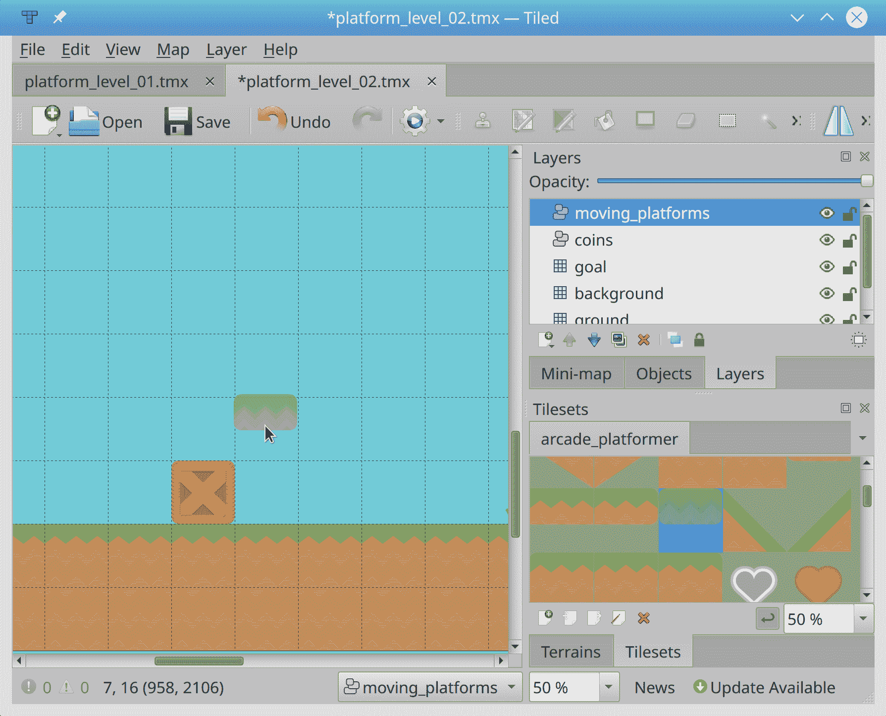](https://files.realpython.com/media/tiled-place-moving-platform-tile.f4dd15ae1e13.png)

一旦放置了移动的牌，点击 `Esc` 停止放置牌。

接下来，您将定义自定义特性来设置移动平台运动的速度和限制。使用以下定义的属性将对水平和垂直移动平台的支持内置到`arcade`中:

1.  **`boundary_left`** 和 **`boundary_right`** 限制平台的水平运动。
2.  **`boundary_top`** 和 **`boundary_bottom`** 限制平台的垂直运动。
3.  **`change_x`** 设定水平速度。
4.  **`change_y`** 设定垂直速度。

由于该平台将 Roz 水平运送到下方的敌人上方，因此只有`boundary_left`、`boundary_right`和`change_x`属性被定义为`float`值:

[](https://files.realpython.com/media/tiled-define-moving-platform-properties.c6d9bf5cb78b.png)

您可以修改这些属性以适应您的关卡设计。如果您定义了所有六个自定义属性，那么您的平台将以对角线模式移动！

设置好平台及其属性后，就该处理新图层了。在`PlatformerView.setup()`中，在处理您的地图图层之后和设置背景颜色之前，添加以下代码:

```py
self.coins = arcade.tilemap.process_layer(
    game_map, layer_name=coin_layer, scaling=MAP_SCALING
)

# Process moving platforms moving_platforms_layer_name = "moving_platforms" moving_platforms = arcade.tilemap.process_layer(
 game_map, layer_name=moving_platforms_layer_name, scaling=MAP_SCALING, ) for sprite in moving_platforms:
 self.walls.append(sprite)
```

因为你的移动平台位于一个对象层，它们必须与你的其他墙壁分开处理。然而，由于你的玩家需要能够站在它们上面，你将它们添加到`self.walls`中，这样物理引擎就可以正确地处理它们。

最后，你需要让你的平台动起来。还是你？

记住你已经做了什么:

*   当您在平铺中定义移动平台时，您可以设置自定义属性来定义其移动。
*   当您处理`moving_platforms`层时，您将其中的所有内容都添加到了`self.walls`中。
*   当您创建`self.physics_engine`时，您将`self.walls`列表作为参数传递。

这都意味着，当你在`.on_update()`中调用`self.physics_engine.update()`时，你所有的平台都会自动移动！任何没有设置自定义属性的墙砖都不会移动。当罗兹站在一个移动的平台上时，物理引擎甚至聪明到可以移动他们:

[https://player.vimeo.com/video/530532499?background=1](https://player.vimeo.com/video/530532499?background=1)

你可以添加任意多的移动平台，来创建任意复杂的世界。

## 结论

Python [`arcade`库](https://arcade.academy/index.html)是一个现代的 Python 框架，非常适合制作具有引人注目的图形和声音的游戏。面向对象，为 Python 3.6 和更高版本而构建，`arcade`为程序员提供了一套现代的工具，用于打造出色的游戏体验，包括平台游戏。`arcade`是开源的，随时欢迎投稿。

**阅读完本教程后，你现在能够:**

*   安装 **Python `arcade`** 库
*   创建一个基本的 **2D 游戏结构**
*   找到可用的游戏**作品**和其他**资产**
*   使用**平铺的**地图编辑器构建平台地图
*   定义玩家**动作**，游戏**奖励**，以及**障碍**
*   用**键盘**和**操纵杆**输入控制你的玩家
*   播放游戏动作的音效
*   用**视窗**滚动游戏屏幕，让你的玩家保持在视野中
*   添加**标题**、**指令**、**暂停**画面
*   在屏幕上移动**非玩家游戏元素**

这个游戏还有很多事要做。以下是一些您可以实现的功能想法:

*   在屏幕上添加游戏。
*   动画屏幕上的硬币。
*   添加 Roz 与敌人碰撞时的动画。
*   检测罗兹何时从地图上消失。
*   给罗兹多重生命。
*   添加高分表。
*   使用`arcade.PymunkPhysicsEngine`来提供更真实的物理交互。

在`arcade`图书馆里也有更多值得探索的东西。有了这些技术，你现在完全有能力去做一些很酷的游戏了！

您可以通过单击下面的链接下载本教程中使用的所有代码、图像和声音:

**获取源代码:** [点击此处获取您将在本教程中使用](https://realpython.com/bonus/platformer-python-arcade-code/)用 Python Arcade 构建平台游戏的源代码。**********