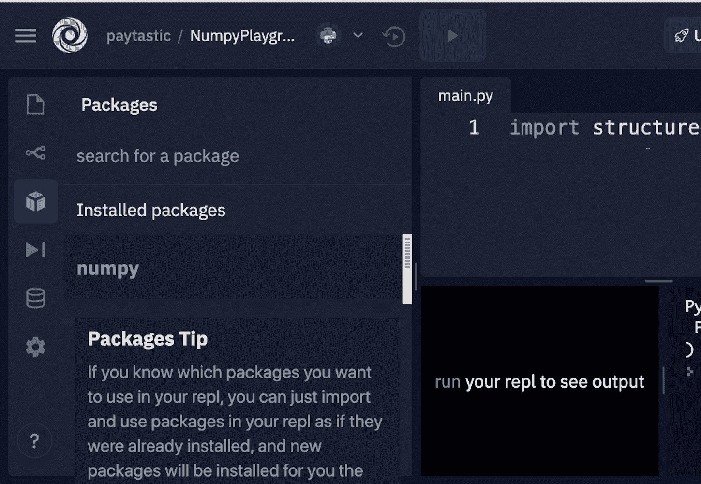
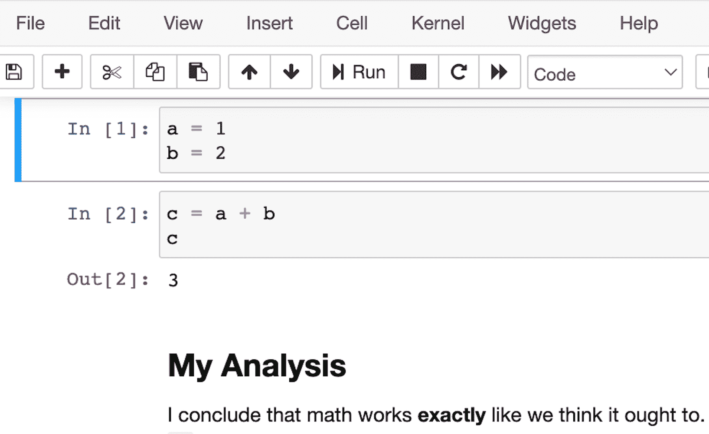
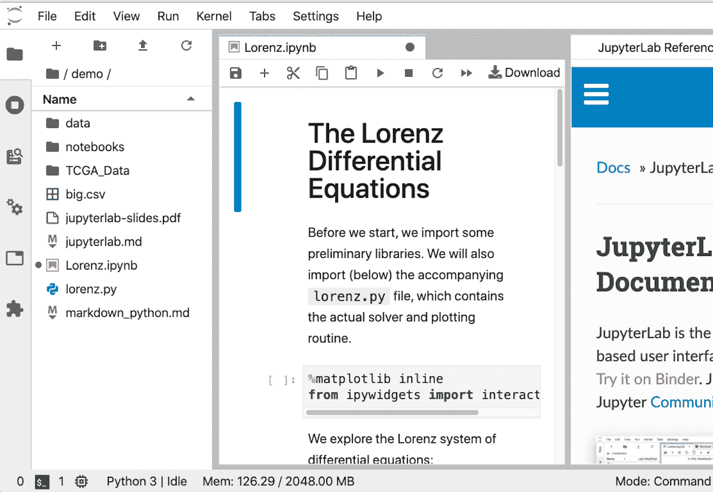

# NumPy 教程:用 Python 学习数据科学的第一步

> 原文：<https://realpython.com/numpy-tutorial/>

NumPy 是一个 Python 库，它提供了一个简单而强大的数据结构: **n 维数组**。这是 Python 数据科学工具包几乎所有功能的基础，学习 NumPy 是任何 Python 数据科学家旅程的第一步。本教程将为您提供使用 NumPy 和依赖它的高级库所需的知识。

在本教程中，你将学习:

*   NumPy 使数据科学中的哪些核心概念成为可能
*   如何使用各种方法创建 NumPy 数组
*   如何操作 NumPy 数组来执行**有用的计算**
*   如何将这些新技能应用于**现实世界的问题**

为了充分利用本 NumPy 教程，您应该熟悉 Python 代码的编写。学习 Python 的[入门](https://realpython.com/learning-paths/python3-introduction/)是确保你掌握基本技能的好方法。如果你熟悉[矩阵数学](https://en.wikipedia.org/wiki/Matrix_(mathematics))，那肯定也会有所帮助。然而，你不需要了解任何关于数据科学的知识。你会在这里学到的。

还有一个 NumPy 代码示例库，您将在本教程中看到。您可以将它作为参考，并使用示例进行实验，看看更改代码会如何改变结果。要下载代码，请单击下面的链接:

**获取示例代码:** [单击此处获取示例代码，您将在本教程中使用](https://realpython.com/bonus/numpy-python-code/)来了解 NumPy。

## 选择 NumPy:好处

既然你已经知道 Python，你可能会问自己是否真的需要学习一个全新的范式来做数据科学。Python 的 [`for`循环](https://realpython.com/python-for-loop/)牛逼！[读写 CSV 文件](https://realpython.com/python-csv/)可以用传统代码完成。然而，有一些令人信服的理由来学习一种新的范式。

以下是 NumPy 可以为您的代码带来的四大好处:

1.  更快的速度: NumPy 使用用 C 编写的算法，这些算法在纳秒而不是秒内完成。
2.  **更少的循环:** NumPy 帮助你[减少循环](https://realpython.com/numpy-array-programming/)并避免陷入迭代索引中。
3.  更清晰的代码:没有循环，你的代码看起来更像你试图计算的方程。
4.  更好的质量:有成千上万的贡献者致力于保持 NumPy 快速、友好和无 bug。

由于这些好处，NumPy 是 Python 数据科学中多维数组的事实上的标准，许多最流行的库都建立在它之上。学习 NumPy 是一种很好的方式，可以在您将知识扩展到更具体的数据科学领域时打下坚实的基础。

[*Remove ads*](/account/join/)

## *安装数字*

 *是时候做好一切准备了，这样您就可以开始学习如何使用 NumPy 了。有几种不同的方法可以做到这一点，按照 [NumPy 网站](https://numpy.org/install/)上的说明做就不会出错。但是下面列出了一些需要注意的额外细节。

您还将安装 Matplotlib。您将在后面的一个示例中使用它来探索其他库如何利用 NumPy。

### 使用 Repl.it 作为在线编辑器

如果你只是想从一些例子开始，跟随本教程，并开始用 NumPy 建立一些肌肉记忆，那么 [Repl.it](https://repl.it/) 是浏览器内编辑的一个很好的选择。您可以注册并在几分钟内启动 Python 环境。在左侧，有一个包裹标签。你想加多少都可以。对于本 NumPy 教程，请使用当前版本的 NumPy 和 Matplotlib。

您可以在界面中的以下位置找到这些包:

[](https://files.realpython.com/media/numpy-tutorial-replit-1000.070229bde757.png)

幸运的是，他们允许你点击安装。

### 用 Anaconda 安装 NumPy】

[Anaconda](https://www.anaconda.com/products/individual) 发行版是一套通用的 Python 数据科学工具，捆绑在**包管理器**周围，帮助管理你的[虚拟环境](https://realpython.com/python-virtual-environments-a-primer/)和项目依赖关系。它是围绕 [`conda`](https://docs.conda.io/en/latest/) 构建的，也就是实际的包管理器。这是 NumPy 项目推荐的方法，特别是如果您在还没有[建立复杂的开发环境](https://realpython.com/python-windows-machine-learning-setup/)的情况下就开始使用 Python 进行数据科学研究。

如果你已经有了一个你喜欢的工作流，它使用了 [`pip`](https://realpython.com/what-is-pip/) 、 [Pipenv](https://realpython.com/pipenv-guide/) 、[诗意](https://realpython.com/effective-python-environment/#poetry)，或者其他一些工具集，那么最好不要把`conda`加入其中。`conda`包仓库与 [PyPI](https://pypi.org/) 是分开的，并且`conda`本身在你的机器上建立了一个独立的包岛，所以管理路径和记住哪个包在哪里可能是一个[噩梦](https://xkcd.com/1987/)。

一旦安装了`conda`,您就可以对您需要的库运行`install`命令:

```py
$ conda install numpy matplotlib
```

这将安装您需要的 NumPy 教程，您将一切就绪。

### 使用`pip`和安装 NumPy

尽管 NumPy 项目建议，如果你想重新开始，就使用`conda`，自己管理你的环境也没什么不好，只要使用好的旧的`pip`，Pipenv，诗歌，或者其他任何你喜欢的[来替代`pip`](https://realpython.com/what-is-pip/#alternatives-to-pip) 。

以下是使用`pip`进行设置的命令:

```py
$ mkdir numpy-tutorial
$ cd numpy-tutorial
$ python3 -m venv .numpy-tutorial-venv
$ source .numpy-tutorial-venv/bin/activate

(.numpy-tutorial-venv)
$ pip install numpy matplotlib
Collecting numpy
 Downloading numpy-1.19.1-cp38-cp38-macosx_10_9_x86_64.whl (15.3 MB)
 |████████████████████████████████| 15.3 MB 2.7 MB/s
Collecting matplotlib
 Downloading matplotlib-3.3.0-1-cp38-cp38-macosx_10_9_x86_64.whl (11.4 MB)
 |████████████████████████████████| 11.4 MB 16.8 MB/s
...
```

在此之后，确保您的虚拟环境被激活，并且您的所有代码都应该按预期运行。

### 使用 IPython、笔记本电脑或 JupyterLab

虽然以上部分应该为您提供了入门所需的一切，但是您还可以选择安装一些工具，以使数据科学的工作对开发人员更加友好。

[IPython](https://ipython.org/install.html) 是一个升级的 Python[read-eval-print loop(REPL)](https://en.wikipedia.org/wiki/Read%E2%80%93eval%E2%80%93print_loop)，它使得在实时解释器会话中编辑代码变得更加简单和漂亮。以下是 IPython REPL 会议的情况:

>>>

```py
In [1]: import numpy as np

In [2]: digits = np.array([
 ...:    [1, 2, 3],
 ...:    [4, 5, 6],
 ...:    [6, 7, 9],
 ...: ])

In [3]: digits
Out[3]:
array([[1, 2, 3],
 [4, 5, 6],
 [6, 7, 9]])
```

它与基本的 Python REPL 有几个不同之处，包括行号、颜色的使用以及数组可视化的质量。还有很多用户体验上的好处，让输入、重新输入和编辑代码变得更加愉快。

您可以独立安装 IPython:

```py
$ pip install ipython
```

或者，如果您等待并安装任何后续工具，那么它们将包含 IPython 的副本。

REPL 的一个稍微有点特色的替代品是一个笔记本电脑。不过，笔记本编写 Python 的风格与标准脚本略有不同。取代传统的 Python 文件，他们给你一系列叫做**单元**的迷你脚本，你可以在同一个 Python 内存会话中以任何你想要的顺序运行和重新运行。

笔记本的一个巧妙之处在于，你可以在单元格之间包含图表和渲染 [Markdown](https://realpython.com/jupyter-notebook-introduction/) 段落，因此它们非常适合在代码内部编写数据分析！

它看起来是这样的:

[](https://files.realpython.com/media/numpy-tutorial-jupyter-notebook-1000.c420ec12baaa.png)

最受欢迎的笔记本产品可能是 [Jupyter 笔记本](https://realpython.com/jupyter-notebook-introduction/)，但[interact](https://nteract.io/)是另一种选择，它包装了 Jupyter 的功能，并试图让它变得更加平易近人和强大。

然而，如果你在看 Jupyter 笔记本，并认为它需要更多类似 IDE 的品质，那么 [JupyterLab](https://jupyterlab.readthedocs.io/en/stable/) 是另一个选择。您可以在基于浏览器的界面中自定义文本编辑器、笔记本、终端和自定义组件。对于来自 [MatLab](https://realpython.com/matlab-vs-python/) 的人来说可能会更舒服。它是最年轻的产品，但它的 1.0 版本早在 2019 年就发布了，所以它应该是稳定的，功能齐全的。

界面看起来是这样的:

[](https://files.realpython.com/media/numpy-tutorial-jupyterlab-1000.d3cbd73c9bb3.png)

无论您选择哪个选项，一旦您安装了它，您就可以运行第一行 NumPy 代码了。是时候举第一个例子了。

[*Remove ads*](/account/join/)

## *Hello NumPy:曲线测试成绩教程*

 *第一个例子介绍了 NumPy 中的一些核心概念，您将在本教程的剩余部分中使用这些概念:

*   使用`numpy.array()`创建数组
*   将完整数组视为单个值，使矢量化计算更具可读性
*   使用内置的 NumPy 函数来修改和聚合数据

这些概念是有效使用 NumPy 的核心。

场景是这样的:你是一名教师，刚刚在最近的一次测试中给你的学生打分。不幸的是，你可能把考试搞得太有挑战性了，大部分学生的表现都比预期的差。为了帮助大家，你要**曲线**每个人的[成绩](https://en.wikipedia.org/wiki/Relative_grading)。

不过，这将是一个相对基本的曲线。你将得到平均分数，并宣布它为 c。此外，你将确保曲线不会意外地损害你学生的成绩，或者帮助学生做得比 100%更好。

将此代码输入您的 REPL:

>>>

```py
 1>>> import numpy as np 2>>> CURVE_CENTER = 80
 3>>> grades = np.array([72, 35, 64, 88, 51, 90, 74, 12]) 4>>> def curve(grades):
 5...     average = grades.mean() 6...     change = CURVE_CENTER - average
 7...     new_grades = grades + change 8...     return np.clip(new_grades, grades, 100) 9...
10>>> curve(grades)
11array([ 91.25,  54.25,  83.25, 100\.  ,  70.25, 100\.  ,  93.25,  31.25])
```

最初的分数根据他们在群体中的位置有所增加，但是没有一个分数超过 100%。

以下是重要的亮点:

*   **第 1 行**使用别名`np`导入 NumPy，这是一个常见的约定，可以节省您的一些击键次数。
*   **第 3 行**创建你的第一个 NumPy **数组**，它是一维的，形状为`(8,)`，数据类型为`int64`。先不要太担心这些细节。在本教程的后面部分，您将更详细地研究它们。
*   **第 5 行**使用 [`.mean()`](https://numpy.org/doc/stable/reference/generated/numpy.ndarray.mean.html#numpy.ndarray.mean) 取所有分数的平均值。数组有一个[方法](https://numpy.org/doc/stable/reference/arrays.ndarray.html#array-methods)的 *lot* 。

在第 7 行，您同时利用了两个重要的概念:

1.  …向量化…
2.  广播

**向量化**是对数组中的每个元素以同样的方式执行同样的操作的过程。这从您的代码中移除了`for`循环，但获得了相同的结果。

**广播**是扩展两个不同形状的数组，并找出如何在它们之间执行矢量化计算的过程。记住，`grades`是形状为`(8,)`的数字数组，`change`是形状为`(1,)`的**标量**或单个数字。在这种情况下，NumPy 将标量添加到数组中的每一项，并返回一个包含结果的新数组。

最后，在第 8 行，您将值限制为一组最小值和最大值。除了数组方法，NumPy 还有大量的[内置函数](https://numpy.org/doc/stable/reference/routines.html)。你不需要把它们都记住——这就是文档的作用。任何时候你遇到困难或者觉得应该有一个更简单的方法来做某件事，看一看文档，看看是否已经有了一个例程来做你所需要的事情。

在这种情况下，您需要一个函数，它接受一个数组并确保值不超过给定的最小值或最大值。`clip()`确实如此。

第 8 行还提供了另一个广播示例。对于`clip()`的第二个参数，您通过了`grades`，确保每个新弯曲的坡度不会低于原始坡度。但是对于第三个参数，您传递了一个值:`100`。NumPy 获取该值，并将其传播给`new_grades`中的每个元素，确保没有一个新的弯曲等级超过满分。

## 进入状态:数组形状和轴

现在，您已经看到了 NumPy 的一些功能，是时候用一些重要的理论来巩固这个基础了。有几个重要的概念需要记住，尤其是在处理高维数组时。

**向量**，一维数组的数字，是最不复杂的跟踪。二维也不错，因为它们类似于电子表格。但是事情在三维空间开始变得棘手，而在四维空间可视化呢？别提了。

[*Remove ads*](/account/join/)

### *掌握形状*

 *使用多维数组时，形状是一个关键概念。在某种程度上，更容易忘记可视化数据的形状，而是遵循一些心理规则，并相信 NumPy 会告诉您正确的形状。

所有数组都有一个名为`.shape`的属性，该属性返回每个维度中的大小的元组。哪个维度是哪个维度并不重要，但关键是传递给函数的数组的形状符合函数的预期。确认您的数据具有正确形状的一个常见方法是[打印](https://realpython.com/python-print/)数据及其形状，直到您确定一切都如您所愿。

下一个例子将展示这个过程。您将创建一个具有复杂形状的数组，检查该数组，并对其重新排序，使其看起来像是:

>>>

```py
In [1]: import numpy as np

In [2]: temperatures = np.array([
 ...:    29.3, 42.1, 18.8, 16.1, 38.0, 12.5,
 ...:    12.6, 49.9, 38.6, 31.3, 9.2, 22.2
 ...: ]).reshape(2, 2, 3)

In [3]: temperatures.shape
Out[3]: (2, 2, 3)

In [4]: temperatures
Out[4]:
array([[[29.3, 42.1, 18.8],
 [16.1, 38\. , 12.5]],

 [[12.6, 49.9, 38.6],
 [31.3,  9.2, 22.2]]])

In [5]: np.swapaxes(temperatures, 1, 2)
Out[5]:
array([[[29.3, 16.1],
 [42.1, 38\. ],
 [18.8, 12.5]],

 [[12.6, 31.3],
 [49.9,  9.2],
 [38.6, 22.2]]])
```

在这里，您使用一个名为`.reshape()`的`numpy.ndarray`方法来形成一个 2 × 2 × 3 的数据块。当您在输入 3 中检查数组的形状时，它正是您告诉它的形状。然而，你可以看到印刷阵列很快变得难以在三维或更多维中可视化。在你和`.swapaxes()`交换了坐标轴之后，哪个维度是哪个维度就变得不那么清晰了。在下一节中，您将看到更多关于轴的内容。

“形状”将在广播部分再次出现。现在，只要记住这些小支票不需要花费任何东西。一旦事情运行顺利，您可以随时删除单元格或删除代码。

### 理解轴

上面的例子表明，不仅要知道数据的形状，还要知道哪些数据在哪个**轴**上，这是多么重要。在 NumPy 数组中，轴是零索引的，并标识哪个维度是哪个维度。例如，二维数组有一个垂直轴(轴 0)和一个水平轴(轴 1)。NumPy 中的许多函数和命令根据您告诉它们处理哪个轴来改变它们的行为。

这个例子将展示在没有`axis`参数的情况下，默认情况下`.max()`的行为，以及当您提供参数时，它如何根据您指定的`axis`来改变功能:

>>>

```py
In [1]: import numpy as np

In [2]: table = np.array([
 ...:    [5, 3, 7, 1],
 ...:    [2, 6, 7 ,9],
 ...:    [1, 1, 1, 1],
 ...:    [4, 3, 2, 0],
 ...: ])

In [3]: table.max()
Out[3]: 9

In [4]: table.max(axis=0)
Out[4]: array([5, 6, 7, 9])

In [5]: table.max(axis=1)
Out[5]: array([7, 9, 1, 4])
```

默认情况下，`.max()`返回整个数组中的最大值，不管有多少维。但是，一旦指定了一个轴，它就会对该轴上的每组值进行计算。例如，使用参数`axis=0`，`.max()`选择`table`中四组垂直值中的最大值，并返回一个已经被**展平**的数组，或者聚合成一维数组。

事实上，NumPy 的许多函数都是这样运行的:如果没有指定轴，那么它们会对整个数据集执行操作。否则，它们以**轴向**方式执行操作。

### 广播

到目前为止，您已经看到了几个较小的广播示例，但是看到的示例越多，这个主题就越有意义。从根本上来说，它是围绕一个规则运行的:如果数组的维度匹配，或者如果其中一个数组的大小为`1`，那么数组可以相互广播。

如果数组在一个轴上的大小匹配，那么元素将被逐个元素地操作，类似于内置的 Python 函数 [`zip()`](https://realpython.com/python-zip-function/) 的工作方式。如果其中一个数组在一个轴上的大小为`1`，那么该值将沿着该轴**传播**，或者根据需要复制多次，以匹配另一个数组中沿着该轴的元素数量。

这里有一个简单的例子。数组`A`具有形状`(4, 1, 8)`，数组`B`具有形状`(1, 6, 8)`。根据上述规则，您可以一起操作这些阵列:

*   在 0 轴，`A`有一个`4`,`B`有一个`1`，所以`B`可以沿着那个轴播出。
*   在轴 1 中，`A`的值为 1，`B`的值为 6，因此`A`可以沿该轴广播。
*   在 axis 2 中，两个数组具有匹配的大小，因此它们可以成功操作。

所有三个轴都成功遵循该规则。

您可以像这样设置阵列:

>>>

```py
In [1]: import numpy as np

In [2]: A = np.arange(32).reshape(4, 1, 8)

In [3]: A
Out[3]:
array([[[ 0,  1,  2,  3,  4,  5,  6,  7]],

 [[ 8,  9, 10, 11, 12, 13, 14, 15]],

 [[16, 17, 18, 19, 20, 21, 22, 23]],

 [[24, 25, 26, 27, 28, 29, 30, 31]]])

In [4]: B = np.arange(48).reshape(1, 6, 8)

In [5]: B
Out[5]:
array([[[ 0,  1,  2,  3,  4,  5,  6,  7],
 [ 8,  9, 10, 11, 12, 13, 14, 15],
 [16, 17, 18, 19, 20, 21, 22, 23],
 [24, 25, 26, 27, 28, 29, 30, 31],
 [32, 33, 34, 35, 36, 37, 38, 39],
 [40, 41, 42, 43, 44, 45, 46, 47]]])
```

`A`有`4`个平面，每个平面有`1`行和`8`列。`B`只有带`6`行和`8`列的`1`平面。当你试图在它们之间进行计算时，看看 NumPy 为你做了什么！

将两个数组相加:

>>>

```py
In [7]: A + B
Out[7]:
array([[[ 0,  2,  4,  6,  8, 10, 12, 14],
 [ 8, 10, 12, 14, 16, 18, 20, 22],
 [16, 18, 20, 22, 24, 26, 28, 30],
 [24, 26, 28, 30, 32, 34, 36, 38],
 [32, 34, 36, 38, 40, 42, 44, 46],
 [40, 42, 44, 46, 48, 50, 52, 54]],

 [[ 8, 10, 12, 14, 16, 18, 20, 22],
 [16, 18, 20, 22, 24, 26, 28, 30],
 [24, 26, 28, 30, 32, 34, 36, 38],
 [32, 34, 36, 38, 40, 42, 44, 46],
 [40, 42, 44, 46, 48, 50, 52, 54],
 [48, 50, 52, 54, 56, 58, 60, 62]],

 [[16, 18, 20, 22, 24, 26, 28, 30],
 [24, 26, 28, 30, 32, 34, 36, 38],
 [32, 34, 36, 38, 40, 42, 44, 46],
 [40, 42, 44, 46, 48, 50, 52, 54],
 [48, 50, 52, 54, 56, 58, 60, 62],
 [56, 58, 60, 62, 64, 66, 68, 70]],

 [[24, 26, 28, 30, 32, 34, 36, 38],
 [32, 34, 36, 38, 40, 42, 44, 46],
 [40, 42, 44, 46, 48, 50, 52, 54],
 [48, 50, 52, 54, 56, 58, 60, 62],
 [56, 58, 60, 62, 64, 66, 68, 70],
 [64, 66, 68, 70, 72, 74, 76, 78]]])
```

广播的工作方式是 NumPy 将`B`中的飞机复制三次，这样你总共有四架，与`A`中的飞机数量相匹配。它还将`A`中的单行复制五次，总共六行，与`B`中的行数相匹配。然后，它将新扩展的`A`数组中的每个元素添加到`B`中相同位置的对应元素中。每个计算的结果都显示在输出的相应位置。

**注意:**这是一个使用 [`arange()`](https://realpython.com/how-to-use-numpy-arange/) 从一个范围创建数组的好方法！

同样，尽管您可以使用“平面”、“行”和“列”这样的词来描述本例中的形状是如何传播以创建匹配的三维形状的，但在更高的维度上，事情会变得更加复杂。很多时候，你必须简单地遵循广播规则，并做大量的打印输出，以确保事情按计划进行。

理解广播是掌握矢量化计算的重要部分，而矢量化计算是编写干净、惯用的 NumPy 代码的方法。

[*Remove ads*](/account/join/)

## *数据科学操作:过滤、排序、聚合*

 *这就结束了这一部分，它理论上很重，但实际的、真实世界的例子却很少。在本节中，您将学习一些真实、有用的数据科学操作示例:过滤、排序和聚合数据。

### 索引

索引使用了许多普通 Python 代码使用的习惯用法。您可以使用正或负索引从数组的前面或后面进行索引。您可以使用冒号(`:`)来指定“其余”或“全部”，甚至可以使用两个冒号来跳过常规 Python 列表中的元素。

区别在于:NumPy 数组在轴之间使用逗号，因此您可以在一组方括号中索引多个轴。一个例子是展示这一点最简单的方法。是时候确认[丢勒的魔方](https://en.wikipedia.org/wiki/Magic_square#Albrecht_D%C3%BCrer's_magic_square)了！

下面的数字方块有一些惊人的特性。如果你把任何行、列或对角线加起来，你会得到同样的数字，34。这也是你将所包含的 3 × 3 网格的四个象限、中心四个正方形、四个角正方形或四个角正方形相加得到的结果。你要证明这一点！

**趣闻:**在最下面一排，数字 15 和 14 在中间，代表着丢勒创建这个正方形的年份。数字 1 和 4 也在那一行，分别代表字母表中的第一个和第四个字母 A 和 D，这是正方形的创造者阿尔布雷特·丢勒的首字母缩写。

在 REPL 中输入以下信息:

>>>

```py
In [1]: import numpy as np

In [2]: square = np.array([
 ...:    [16, 3, 2, 13],
 ...:    [5, 10, 11, 8],
 ...:    [9, 6, 7, 12],
 ...:    [4, 15, 14, 1]
 ...: ])

In [3]: for i in range(4):
 ...:    assert square[:, i].sum() == 34
 ...:    assert square[i, :].sum() == 34
 ...:

In [4]: assert square[:2, :2].sum() == 34

In [5]: assert square[2:, :2].sum() == 34

In [6]: assert square[:2, 2:].sum() == 34

In [7]: assert square[2:, 2:].sum() == 34
```

在`for`循环中，您验证所有的行和所有的列加起来是 34。之后，使用选择性索引，验证每个象限加起来也是 34。

最后要注意的一点是，您可以用`square.sum()`对任何数组求和，从而全局地将它的所有元素相加。这个方法也可以使用一个`axis`参数来进行轴向求和。

### 屏蔽和过滤

基于索引的选择很好，但是如果您想基于更复杂的非一致或非顺序标准来过滤数据，该怎么办呢？这就是**掩模**发挥作用的地方。

掩码是一个与你的数据形状完全相同的数组，但是它保存的不是你的值，而是[布尔值](https://realpython.com/python-boolean/):或者`True`或者`False`。您可以使用这个掩码数组以非线性和复杂的方式索引到数据数组中。它将返回布尔数组中有一个`True`值的所有元素。

这里有一个展示这个过程的例子，首先是慢动作，然后是它通常是如何完成的，都在一行中:

>>>

```py
In [1]: import numpy as np

In [2]: numbers = np.linspace(5, 50, 24, dtype=int).reshape(4, -1)

In [3]: numbers
Out[3]:
array([[ 5, 6,  8, 10, 12, 14],
 [16, 18, 20, 22, 24, 26],
 [28, 30, 32, 34, 36, 38],
 [40, 42, 44, 46, 48, 50]])

In [4]: mask = numbers % 4 == 0

In [5]: mask
Out[5]:
array([[False, False,  True, False,  True, False],
 [ True, False,  True, False,  True, False],
 [ True, False,  True, False,  True, False],
 [ True, False,  True, False,  True, False]])

In [6]: numbers[mask]
Out[6]: array([ 8, 12, 16, 20, 24, 28, 32, 36, 40, 44, 48])

In [7]: by_four = numbers[numbers % 4 == 0]

In [8]: by_four
Out[8]: array([ 8, 12, 16, 20, 24, 28, 32, 36, 40, 44, 48])
```

稍后，您将在 input 2 中看到对新的数组创建技巧的解释，但是现在，请将重点放在示例的核心部分。这些是重要的部分:

*   **输入 4** 通过执行**矢量化布尔运算**来创建遮罩，获取每个元素并检查它是否被 4 整除。这将返回一个具有相同形状的掩码数组，其中包含计算的逐元素结果。
*   **输入 6** 使用这个掩码来索引原始的`numbers`数组。这将导致数组失去其原来的形状，减少到一维，但您仍然可以获得您正在寻找的数据。
*   **Input 7** 提供了一个更传统、惯用的屏蔽选择，您可能会在野外看到，在选择括号内内嵌创建了一个匿名过滤数组。这种语法类似于 R 编程语言中的用法。

回到输入 2，您会遇到三个新概念:

1.  使用 [`np.linspace()`](https://realpython.com/np-linspace-numpy/) 生成一个均匀分布的数组
2.  设置输出的`dtype`
3.  用`-1`重塑数组

[`np.linspace()`](https://numpy.org/doc/stable/reference/generated/numpy.linspace.html) 生成在最小值和最大值之间均匀分布的 *n* 数，这对科学绘图中的均匀分布采样很有用。

由于这个例子中的特殊计算，在`numbers`数组中有[个整数](https://realpython.com/python-numbers/#integers)会更容易。但是因为 5 和 50 之间的空间不能被 24 整除，所以得到的数字将是[浮点数](https://realpython.com/python-numbers/#floating-point-numbers)。您指定一个`int`的`dtype`来强制函数向下舍入并给出整数。稍后您将看到关于数据类型的更详细的讨论。

最后，`array.reshape()`可以把`-1`作为它的维度大小之一。这意味着 NumPy 应该根据其他轴的大小计算出特定轴需要多大。在这种情况下，0 轴上的`24`值和大小为`4`，1 轴的大小为`6`。

这里还有一个展示屏蔽过滤能力的例子。[正态分布](https://en.wikipedia.org/wiki/Normal_distribution)是一种概率分布，其中大约 95.45%的值出现在平均值的两个[标准偏差](https://en.wikipedia.org/wiki/Standard_deviation)内。

你可以通过 NumPy 的`random`模块生成[随机](https://realpython.com/python-random/)值来验证这一点:

>>>

```py
In [1]: import numpy as np

In [2]: from numpy.random import default_rng

In [3]: rng = default_rng()

In [4]: values = rng.standard_normal(10000)

In [5]: values[:5]
Out[5]: array([ .9779210858,  1.8361585253,  -.3641365235,
 -.1311344527, 1.286542056 ])

In [6]: std = values.std()

In [7]: std
Out[7]: .9940375551073492

In [8]: filtered = values[(values > -2 * std) & (values < 2 * std)]

In [9]: filtered.size
Out[9]: 9565

In [10]: values.size
Out[10]: 10000

In [11]: filtered.size / values.size
Out[11]: 0.9565
```

这里您使用了一个看起来可能很奇怪的语法来组合过滤条件:一个**二元`&`操作符**。为什么会这样呢？这是因为 NumPy 将`&`和`|`指定为矢量化的、基于元素的运算符来组合布尔值。如果你尝试做`A and B`，那么你会得到一个警告，告诉你一个数组的真值是多么奇怪，因为`and`是对整个数组的真值进行操作，而不是一个元素接一个元素。

[*Remove ads*](/account/join/)

### *移调、排序和连接*

 *其他操作虽然不像索引或过滤那样常见，但根据您所处的情况，也非常方便。在本节中，您将看到一些例子。

这里是**转置**一个数组:

>>>

```py
In [1]: import numpy as np

In [2]: a = np.array([
 ...:    [1, 2],
 ...:    [3, 4],
 ...:    [5, 6],
 ...: ])

In [3]: a.T
Out[3]:
array([[1, 3, 5],
 [2, 4, 6]])

In [4]: a.transpose()
Out[4]:
array([[1, 3, 5],
 [2, 4, 6]])
```

当你计算一个数组的转置时，每个元素的行和列的索引都会被交换。例如，项目`[0, 2]`变成项目`[2, 0]`。你也可以用`a.T`作为`a.transpose()`的别名。

下面的代码块显示了[排序](https://realpython.com/sorting-algorithms-python/)，但是在下一节关于结构化数据的内容中，您还会看到一种更强大的排序技术:

>>>

```py
In [1]: import numpy as np

In [2]: data = np.array([
 ...:    [7, 1, 4],
 ...:    [8, 6, 5],
 ...:    [1, 2, 3]
 ...: ])

In [3]: np.sort(data)
Out[3]:
array([[1, 4, 7],
 [5, 6, 8],
 [1, 2, 3]])

In [4]: np.sort(data, axis=None)
Out[4]: array([1, 1, 2, 3, 4, 5, 6, 7, 8])

In [5]: np.sort(data, axis=0)
Out[5]:
array([[1, 1, 3],
 [7, 2, 4],
 [8, 6, 5]])
```

省略`axis`参数会自动选择最后一个也是最里面的维度，即本例中的行。使用`None`展平数组并执行全局排序。否则，您可以指定想要的轴。在输出 5 中，数组的每一列仍然有它的所有元素，但是它们在该列中从低到高排序。

最后，这里有一个**串联**的例子。虽然有一个`np.concatenate()`函数，但也有一些[辅助函数](https://numpy.org/doc/stable/reference/generated/numpy.concatenate.html)，它们有时更容易阅读。

以下是一些例子:

>>>

```py
In [1]: import numpy as np

In [2]: a = np.array([
 ...:    [4, 8],
 ...:    [6, 1]
 ...: ])

In [3]: b = np.array([
 ...:    [3, 5],
 ...:    [7, 2],
 ...: ])

In [4]: np.hstack((a, b))
Out[4]:
array([[4, 8, 3, 5],
 [6, 1, 7, 2]])

In [5]: np.vstack((b, a))
Out[5]:
array([[3, 5],
 [7, 2],
 [4, 8],
 [6, 1]])

In [6]: np.concatenate((a, b))
Out[6]:
array([[4, 8],
 [6, 1],
 [3, 5],
 [7, 2]])

In [7]: np.concatenate((a, b), axis=None)
Out[7]: array([4, 8, 6, 1, 3, 5, 7, 2])
```

输入 4 和 5 显示了稍微直观一些的功能`hstack()`和`vstack()`。输入 6 和 7 显示了更通用的`concatenate()`，首先没有`axis`参数，然后有`axis=None`。这种扁平化行为在形式上类似于你刚刚看到的`sort()`。

需要注意的一个重要障碍是，所有这些函数都将数组元组作为它们的第一个参数，而不是您可能期望的可变数量的参数。你能看出来是因为多了一对括号。

### 聚集

在深入一些更高级的主题和例子之前，这次功能之旅的最后一站是**聚合**。你已经看到了很多聚合方法，包括`.sum()`、`.max()`、`.mean()`和`.std()`。你可以参考 NumPy 更大的[函数库](https://numpy.org/doc/stable/reference/routines.html)来了解更多。许多数学、金融和统计函数使用聚合来帮助您减少数据中的维数。

## 实践示例 1:实现 Maclaurin 系列

现在是时候来看看上面几节中介绍的技巧的实际用例了:实现一个等式。

在没有 NumPy 的情况下，将数学方程转换为代码最困难的事情之一是，许多视觉上的相似性都丢失了，这使得在阅读代码时很难分辨出你在看方程的哪一部分。求和被转换成更冗长的`for`循环，极限优化最终看起来像 [`while`循环](https://realpython.com/python-while-loop/)。

使用 NumPy 可以让您更接近从等式到代码的一对一表示。

在下一个例子中，您将对*e*<sup>T5】x</sup>的 [Maclaurin 系列](https://mathworld.wolfram.com/MaclaurinSeries.html)进行编码。Maclaurin 级数是一种用以零为中心的无穷级数求和项来逼近更复杂函数的方法。

对于 *e* <sup>*x*</sup> ，马克劳林级数是如下求和:

[](https://files.realpython.com/media/e-x-maclauren.0d23c5b15404.png)

你把从零开始的项加起来，理论上一直到无穷大。每第 *n* 项将被 *x* 提高到 *n* 再除以 *n* ！，这是[阶乘](https://en.wikipedia.org/wiki/Factorial)运算的符号。

现在是时候把它放到 NumPy 代码中了。创建一个名为`maclaurin.py`的文件:

```py
from math import e, factorial

import numpy as np

fac = np.vectorize(factorial)

def e_x(x, terms=10):
    """Approximates e^x using a given number of terms of
 the Maclaurin series
 """
    n = np.arange(terms)
    return np.sum((x ** n) / fac(n))

if __name__ == "__main__":
    print("Actual:", e ** 3)  # Using e from the standard library

    print("N (terms)\tMaclaurin\tError")

    for n in range(1, 14):
        maclaurin = e_x(3, terms=n)
        print(f"{n}\t\t{maclaurin:.03f}\t\t{e**3 - maclaurin:.03f}")
```

运行此命令时，您应该会看到以下结果:

```py
$ python3 maclaurin.py
Actual: 20.085536923187664
N (terms) Maclaurin Error
1         1.000     19.086
2         4.000     16.086
3         8.500     11.586
4        13.000      7.086
5        16.375      3.711
6        18.400      1.686
7        19.412      0.673
8        19.846      0.239
9        20.009      0.076
10       20.063      0.022
11       20.080      0.006
12       20.084      0.001
13       20.085      0.000
```

随着项数的增加，你的 Maclaurin 值越来越接近实际值，你的误差越来越小。

每一项的计算都需要将`x`乘以`n`的幂，然后除以`n!`，或者是`n`的阶乘。加法、求和以及自乘幂都是 NumPy 可以自动快速向量化的操作，但对于`factorial()`却不是这样。

要在矢量化计算中使用`factorial()`，必须使用 [`np.vectorize()`](https://numpy.org/doc/stable/reference/generated/numpy.vectorize.html) 创建矢量化版本。`np.vectorize()`的文档表明，它只不过是一个将`for`循环应用于给定函数的薄薄的包装器。使用它而不是普通的 Python 代码并没有真正的性能优势，而且可能会有一些开销损失。然而，正如您马上会看到的，可读性的好处是巨大的。

一旦您的矢量化阶乘就绪，计算整个 Maclaurin 级数的实际代码就会短得惊人。也是可读的。最重要的是，它与数学等式几乎是一一对应的:

```py
n = np.arange(terms)
return np.sum((x ** n) / fac(n))
```

这是一个非常重要的想法，值得重复一遍。除了初始化`n`的额外一行之外，代码读起来几乎与原始数学方程完全相同。没有`for`循环，没有临时的`i, j, k`变量。简单明了的数学。

就这样，你在用 NumPy 进行数学编程！为了进行额外的练习，可以试着挑选一个其他的 Maclaurin 系列，并以类似的方式实现它。

[*Remove ads*](/account/join/)

## *优化存储:数据类型*

 *既然您已经有了更多的实践经验，是时候回到理论上来看看数据类型了。在很多 Python 代码中，数据类型并不是核心角色。数字像它们应该的那样工作，字符串做其他事情，布尔值是真还是假，除此之外，你可以创建自己的对象和集合。

不过，在 NumPy 中，还需要介绍一些细节。NumPy 使用 C 代码来优化性能，除非数组中的所有元素都是同一类型，否则它无法做到这一点。这不仅仅意味着相同的 Python 类型。它们必须是相同的底层 C 类型，具有相同的形状和位大小！

### 数值类型:`int`、`bool`、`float`、`complex`、

因为你的大部分数据科学和数值计算都会涉及到数字，所以它们似乎是最好的起点。NumPy 代码中基本上有四种数值类型，每一种都有不同的大小。

下表列出了这些类型的详细信息:

| 名字 | 位数 | Python 类型 | NumPy 型 |
| --- | --- | --- | --- |
| 整数 | Sixty-four | `int` | `np.int_` |
| 布尔运算 | eight | `bool` | `np.bool_` |
| 浮动 | Sixty-four | `float` | `np.float_` |
| 复杂的 | One hundred and twenty-eight | `complex` | `np.complex_` |

这些只是映射到现有 Python 类型的类型。NumPy 也有更小版本的类型，如 8 位、16 位和 32 位整数、32 位单精度浮点数和 64 位单精度复数。文档完整地列出了它们。

要在创建数组时指定类型，可以提供一个`dtype`参数:

>>>

```py
In [1]: import numpy as np

In [2]: a = np.array([1, 3, 5.5, 7.7, 9.2], dtype=np.single)

In [3]: a
Out[3]: array([1\. , 3\. , 5.5, 7.7, 9.2], dtype=float32)

In [4]: b = np.array([1, 3, 5.5, 7.7, 9.2], dtype=np.uint8)

In [5]: b
Out[5]: array([1, 3, 5, 7, 9], dtype=uint8)
```

NumPy 自动将您的平台无关类型`np.single`转换成您的平台支持的任何固定大小的类型。在这种情况下，它使用`np.float32`。如果您提供的值与您提供的`dtype`的形状不匹配，那么 NumPy 要么为您修复它，要么抛出一个错误。

### 字符串类型:大小 Unicode

字符串在 NumPy 代码中的表现有点奇怪，因为 NumPy 需要知道需要多少字节，这在 Python 编程中通常不是一个因素。幸运的是，NumPy 在处理不太复杂的情况方面做得很好:

>>>

```py
In [1]: import numpy as np

In [2]: names = np.array(["bob", "amy", "han"], dtype=str)

In [3]: names
Out[3]: array(['bob', 'amy', 'han'], dtype='<U3')

In [4]: names.itemsize
Out[4]: 12

In [5]: names = np.array(["bob", "amy", "han"])

In [6]: names
Out[6]: array(['bob', 'amy', 'han'], dtype='<U3')

In [7]: more_names = np.array(["bobo", "jehosephat"])

In [8]: np.concatenate((names, more_names))
Out[8]: array(['bob', 'amy', 'han', 'bobo', 'jehosephat'], dtype='<U10')
```

在输入 2 中，您提供了 Python 内置的`str`类型的`dtype`，但是在输出 3 中，它被转换成大小为`3`的**小端** [Unicode](https://realpython.com/python-encodings-guide/) 字符串。当您检查输入 4 中给定项目的大小时，您会看到它们每个都是`12`字节:三个 4 字节的 Unicode 字符。

**注意:**在处理 NumPy 数据类型时，您必须考虑诸如值的字节顺序[之类的事情。在这种情况下，`dtype` `'<U3'`意味着每个值的大小为三个 Unicode 字符，最低有效字节首先存储在内存中，最高有效字节最后存储。`'>U3'`的一个`dtype`将意味着相反的情况。](https://en.wikipedia.org/wiki/Endianness)

例如，NumPy 表示 Unicode 字符“🐍“具有带`'<U1'`的`dtype`的字节`0xF4 0x01 0x00`和带`'>U1'`的`dtype`的`0x00 0x01 0xF4`。通过创建一个充满表情符号的数组，将`dtype`设置为一个或另一个，然后在您的数组上调用`.tobytes()`来尝试一下吧！

如果您想研究 Python 如何处理普通 Python 数据类型的 1 和 0，那么 [struct 库](https://docs.python.org/3/library/struct.html#struct-alignment)的官方文档是另一个很好的资源，它是一个处理原始字节的标准库模块。

当您在 input 8 中将它与一个具有更大条目的数组结合起来创建一个新数组时，NumPy 会很有帮助地计算出新数组的条目需要有多大，并将它们全部增大到大小`<U10`。

但是，当您试图用大于`dtype`容量的值修改其中一个槽时，会发生以下情况:

>>>

```py
In [9]: names[2] = "jamima"

In [10]: names
Out[10]: array(['bob', 'amy', 'jam'], dtype='<U3')
```

它不会像预期的那样工作，反而会截断你的值。如果你已经有了一个数组，那么 NumPy 的自动大小检测就不会为你工作。你得到三个字符，就是这样。其余的在虚空中消失了。

这就是说，一般来说，当你处理字符串时，NumPy 会支持你，但是你应该始终注意元素的大小，并确保在适当的位置修改或更改数组时有足够的空间。

[*Remove ads*](/account/join/)

### *结构化数组*

 *最初，您了解到数组项必须是相同的数据类型，但这并不完全正确。NumPy 有一个[特殊类型的数组](https://numpy.org/doc/stable/user/basics.rec.html)，称为**记录数组**或**结构化数组**，使用它可以指定类型，也可以选择为每列指定一个名称。这使得排序和过滤变得更加强大，感觉类似于在 [Excel](https://realpython.com/openpyxl-excel-spreadsheets-python/) 、[CSV](https://realpython.com/python-csv/)或[关系数据库](https://realpython.com/python-pyqt-database/)中处理数据。

这里有一个简单的例子向他们展示一下:

>>>

```py
In [1]: import numpy as np

In [2]: data = np.array([
 ...:    ("joe", 32, 6),
 ...:    ("mary", 15, 20),
 ...:    ("felipe", 80, 100),
 ...:    ("beyonce", 38, 9001),
 ...: ], dtype=[("name", str, 10), ("age", int), ("power", int)])

In [3]: data[0]
Out[3]: ('joe', 32, 6)

In [4]: data["name"]
Out[4]: array(['joe', 'mary', 'felipe', 'beyonce'], dtype='<U10')

In [5]: data[data["power"] > 9000]["name"]
Out[5]: array(['beyonce'], dtype='<U10')
```

在输入 2 中，您创建了一个数组，除了每一项都是一个具有名称、年龄和能量级别的元组。对于`dtype`，您实际上提供了一个包含每个字段信息的元组列表:`name`是一个 10 个字符的 Unicode 字段，`age`和`power`都是标准的 4 字节或 8 字节整数。

在输入 3 中，您可以看到被称为**记录**的行仍然可以使用索引进行访问。

在输入 4 中，您会看到一个用于访问整个列的新语法，即**字段**。

最后，在输入 5 中，您会看到基于字段和基于字段的选择的基于掩码的过滤的超级强大组合。请注意，阅读下面的 [SQL](https://en.wikipedia.org/wiki/SQL) 查询并没有太大的不同:

```py
SELECT  name  FROM  data WHERE  power  >  9000;
```

在这两种情况下，结果都是功率水平超过`9000`的名字列表。

您甚至可以利用`np.sort()`添加`ORDER BY`功能:

>>>

```py
In [6]: np.sort(data[data["age"] > 20], order="power")["name"]
Out[6]: array(['joe', 'felipe', 'beyonce'], dtype='<U10')
```

这将在检索数据之前按`power`对数据进行排序，从而完善了您对 NumPy 工具的选择，这些工具用于选择、过滤和排序项目，就像在 SQL 中一样！

### 关于数据类型的更多信息

教程的这一部分旨在让您获得足够的知识来使用 NumPy 的数据类型，了解一些事情是如何工作的，并认识一些常见的陷阱。这当然不是一个详尽的指南。关于`ndarrays` 的 [NumPy 文档有更多的资源。](https://numpy.org/doc/stable/reference/arrays.ndarray.html#internal-memory-layout-of-an-ndarray)

还有更多关于 [`dtype`对象](https://numpy.org/doc/stable/reference/arrays.dtypes.html)的信息，包括构造、定制和优化它们的不同方法，以及如何使它们更加健壮以满足您所有的数据处理需求。如果您遇到了麻烦，并且您的数据没有完全按照您的预期加载到数组中，那么这是一个好的开始。

最后，NumPy `recarray`本身就是一个强大的对象，您实际上只是触及了结构化数据集功能的皮毛。阅读 NumPy 提供的 [`recarray`文档](https://numpy.org/doc/stable/reference/generated/numpy.recarray.html)以及其他专用数组[子类](https://numpy.org/doc/stable/reference/arrays.classes.html)的文档绝对值得。

## 展望未来:更强大的库

在下一节中，您将继续学习构建在您上面看到的基础构建块之上的强大工具。这里有几个库，在您迈向完全掌握 Python 数据科学之路的下一步中，您可能想看看它们。

### 熊猫

[pandas](https://pandas.pydata.org/) 是一个库，它采用了结构化数组的概念，并用大量方便的方法、开发人员体验的改进和更好的自动化来构建它。如果你需要从任何地方导入数据，[清理它](https://realpython.com/python-data-cleaning-numpy-pandas/)，重塑它，润色它，然后导出成任何格式，那么熊猫就是你的图书馆。很可能在某个时候，你会在你`import numpy as np`的同时`import pandas as pd`。

熊猫文档有一个快速教程，里面充满了具体的例子，叫做[熊猫 10 分钟](https://pandas.pydata.org/pandas-docs/stable/user_guide/10min.html)。这是一个很好的资源，你可以用它来进行快速的实践。

[*Remove ads*](/account/join/)

### *scikit-learn*

 *如果你的目标更多地在于机器学习的方向，那么 [scikit-learn](https://scikit-learn.org/stable/) 就是下一步。给定足够的数据，您可以在短短几行代码中完成[分类](https://realpython.com/logistic-regression-python/#classification)、[回归](https://realpython.com/linear-regression-in-python/)、[聚类](https://realpython.com/k-means-clustering-python/)等等。

如果您已经熟悉了数学，那么 scikit-learn 文档中有一个很棒的教程列表[来帮助您开始使用 Python。如果没有，那么](https://scikit-learn.org/stable/tutorial/index.html#tutorial-menu)[数据科学数学学习路径](https://realpython.com/learning-paths/math-data-science/)是一个很好的起点。此外，还有一个完整的机器学习的[学习路径。](https://realpython.com/learning-paths/machine-learning-python/)

对你来说，至少理解算法背后的数学基础是很重要的，而不仅仅是输入它们并运行它们。机器学习模型中的偏见是一个巨大的道德、社会和政治问题。

在没有考虑如何解决偏见的情况下向模型扔数据是一种陷入困境并对人们的生活产生负面影响的好方法。做一些研究，学习如何预测哪里可能出现[偏差](https://www.brookings.edu/research/algorithmic-bias-detection-and-mitigation-best-practices-and-policies-to-reduce-consumer-harms/)是朝着正确方向的良好开端。

### Matplotlib

无论你在用你的数据做什么，在某些时候你都需要和其他人交流你的结果，Matplotlib 是实现这一点的主要库之一。有关介绍，请查看使用 Matplotlib 绘制的[。在下一节中，您将获得一些使用 Matplotlib 的实践，但是您将使用它进行图像处理，而不是绘制图形。](https://realpython.com/python-matplotlib-guide/)

## 实践示例 2:用 Matplotlib 处理图像

当你使用 Python 库时，它总是很简洁，它会给你一个基本的 NumPy 数组。在这个例子中，你将体验到它所有的荣耀。

您将使用 Matplotlib 加载图像，认识到 RGB 图像实际上只是由`int8`整数组成的`width × height × 3`数组，操作这些字节，并在完成后再次使用 Matplotlib 保存修改后的图像。

下载此图像以使用:

[](https://files.realpython.com/media/kitty.90952ca484f1.jpg)

<figcaption class="figure-caption text-center">Image: [Ilona Ilyés](https://pixabay.com/users/ilyessuti-3558510/?utm_source=link-attribution&utm_medium=referral&utm_campaign=image&utm_content=2948404)</figcaption>

这是一张 1920 x 1299 像素的可爱小猫的图片。你要改变这些像素的颜色。

创建一个名为`image_mod.py`的 Python 文件，然后设置您的[导入](https://realpython.com/absolute-vs-relative-python-imports/)并加载图像:

```py
 1import numpy as np
 2import matplotlib.image as mpimg
 3
 4img = mpimg.imread("kitty.jpg")
 5print(type(img))
 6print(img.shape)
```

这是一个好的开始。Matplotlib 有自己的处理图像的模块，您将依靠它，因为它使读取和写入图像格式变得简单。

如果运行这段代码，那么你的朋友 NumPy 数组将出现在输出中:

```py
$ python3 image_mod.py
<class 'numpy.ndarray'>
(1299, 1920, 3)
```

这是一个高 1299 像素、宽 1920 像素的图像，有三个通道:红色、绿色和蓝色(RGB)色阶各一个。

想看看当你退出 R 和 G 通道时会发生什么？将此添加到您的脚本中:

```py
 7output = img.copy()  # The original image is read-only!
 8output[:, :, :2] = 0
 9mpimg.imsave("blue.jpg", output)
```

再次运行并检查文件夹。应该有新的形象:

[](https://files.realpython.com/media/blue.b16289750da2.jpg)

你是不是被吓到了？你感觉到力量了吗？图像只是花哨的数组！像素只是数字！

但是现在，是时候做一些更有用的事情了。你要把这个图像转换成灰度。但是，转换为灰度更复杂。将 R、G 和 B 通道平均化，使它们都相同，会给你一个灰度图像。但是人类的大脑很奇怪，这种转换似乎不能很好地处理颜色的亮度。

其实还是自己去看比较好。你可以利用这样一个事实，如果你只输出一个通道而不是三个通道的数组，那么你可以指定一个**颜色图**，在 Matplotlib 世界中称为 [`cmap`](https://matplotlib.org/3.1.0/tutorials/colors/colormaps.html) 。如果您指定了一个`cmap`，那么 Matplotlib 将为您处理线性梯度计算。

删除脚本中的最后三行，替换为:

```py
 7averages = img.mean(axis=2)  # Take the average of each R, G, and B
 8mpimg.imsave("bad-gray.jpg", averages, cmap="gray")
```

这些新线条创建了一个名为`averages`的新数组，它是通过取所有三个通道的平均值沿轴 2 展平的`img`数组的副本。您已经对所有三个通道进行了平均，并输出了 R、G 和 B 值等于该平均值的东西。当 R、G 和 B 都相同时，产生的颜色在灰度上。

最终产生的结果并不可怕:

[](https://files.realpython.com/media/bad-gray.b80663df019b.jpg)

但是你可以使用**光度方法**做得更好。这种技术对三个通道进行加权平均，认为绿色决定了图像的亮度，蓝色可以使图像看起来更暗。您将使用`@`操作符，它是 NumPy 的操作符，用于执行传统的二维数组[点积](https://www.mathsisfun.com/algebra/vectors-dot-product.html)。

再次替换脚本中的最后两行:

```py
 7weights = np.array([0.3, 0.59, 0.11])
 8grayscale = img @ weights
 9mpimg.imsave("good-gray.jpg", grayscale, cmap="gray")
```

这一次，不是做一个平面平均，而是完成一个**点积**，这是三个值的加权组合。由于权重相加为 1，这完全等同于对三个颜色通道进行加权平均。

结果如下:

[](https://files.realpython.com/media/good-gray.03ed6660e679.jpg)

第一个图像有点暗，边缘和阴影更大胆。第二张图片更亮更亮，暗线没有那么粗。现在，您可以使用 Matplotlib 和 NumPy 数组来操作图像了！

[*Remove ads*](/account/join/)

## *结论*

 *无论您的数据存在于多少个维度中，NumPy 都为您提供了处理数据的工具。你可以存储它，重塑它，组合它，过滤它，排序它，你的代码读起来就像你一次只处理一个数字，而不是成百上千个。

**在本教程中，您学习了:**

*   NumPy 使数据科学的**核心概念**成为可能
*   如何使用各种方法创建 NumPy 数组
*   如何操作 NumPy 数组来执行**有用的计算**
*   如何将这些新技能应用于**现实世界的问题**

不要忘记查看贯穿本教程的 NumPy 代码样本库。您可以将它作为参考，并通过示例进行实验，看看更改代码会如何改变结果:

**获取示例代码:** [单击此处获取示例代码，您将在本教程中使用](https://realpython.com/bonus/numpy-python-code/)来了解 NumPy。

现在，您已经为数据科学之旅的下一步做好了准备。无论你是清理数据，训练神经网络，使用强大的情节进行交流，还是从物联网聚合数据，这些活动都是从同一个地方开始的:不起眼的 NumPy 数组。*********