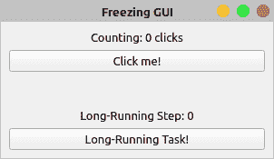
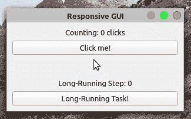
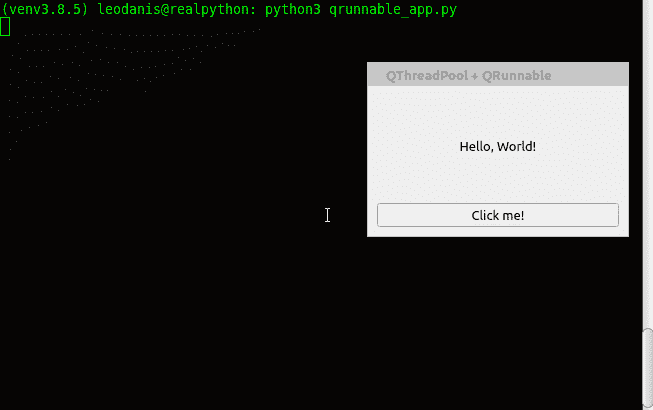
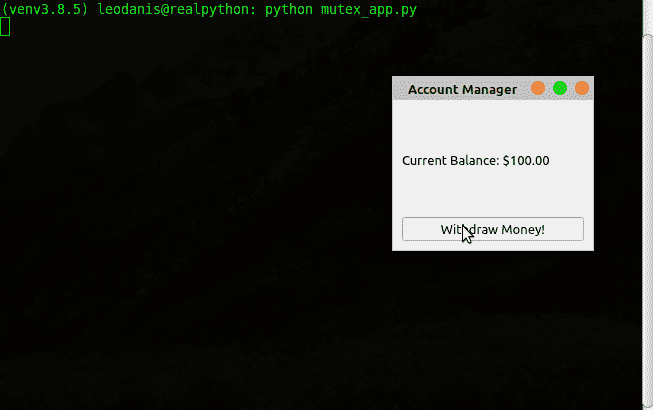

# 使用 PyQt 的 QThread 来防止 GUI 冻结

> 原文:[https://realpython.com/python-pyqt-qthread/](https://realpython.com/python-pyqt-qthread/)

PyQt 图形用户界面(GUI)应用程序有一个执行的**主线程**，它运行[事件循环](https://www.riverbankcomputing.com/static/Docs/PyQt5/api/qtcore/qcoreapplication.html#the-event-loop-and-event-handling)和 GUI。如果你在这个[线程](https://en.wikipedia.org/wiki/Thread_(computing))中启动一个**长时间运行的任务**，那么你的 GUI 将会冻结，直到任务终止。在此期间，用户将无法与应用程序进行交互，从而导致糟糕的用户体验。幸运的是，PyQt 的 **`QThread`** 类允许您解决这个问题。

**在本教程中，您将学习如何:**

*   使用 PyQt 的 **`QThread`** 防止冻结 GUI
*   用`QThreadPool`和`QRunnable`创建**可重用线程**
*   使用信号和插槽管理**线程间通信**
*   通过 PyQt 的锁安全地使用共享资源
*   利用 PyQt 的线程支持，使用**最佳实践**开发 GUI 应用程序

为了更好地理解如何使用 PyQt 的线程，一些以前关于使用 PyQt 和 [Python 多线程编程](https://realpython.com/intro-to-python-threading/)的 [GUI 编程的知识将会有所帮助。](https://realpython.com/python-pyqt-gui-calculator/)

**免费奖励:** [从 Python 基础:Python 3 实用入门](https://realpython.com/bonus/python-basics-sample-free-chapter/)中获取一个示例章节，看看如何通过完整的课程(最新的 Python 3.9)从 Python 初学者过渡到中级。

## 冻结长时间运行任务的 GUI

长时间运行的任务占用 GUI 应用程序的主线程，并导致应用程序冻结，这是 GUI 编程中的一个常见问题，几乎总是会导致糟糕的用户体验。例如，考虑下面的 GUI 应用程序:

[](https://files.realpython.com/media/pyqt-freezing-gui.1a899db536e8.png)

比方说你需要*计数*标签来反映*点击我的总点击次数！*按钮。点击*长时间运行的任务！*按钮将启动一项需要很长时间才能完成的任务。长时间运行的任务可能是文件下载、大型数据库查询或任何其他资源密集型操作。

下面是使用 PyQt 和单线程执行编写该应用程序的第一种方法:

```
import sys
from time import sleep

from PyQt5.QtCore import Qt
from PyQt5.QtWidgets import (
    QApplication,
    QLabel,
    QMainWindow,
    QPushButton,
    QVBoxLayout,
    QWidget,
)

class Window(QMainWindow):
    def __init__(self, parent=None):
        super().__init__(parent)
        self.clicksCount = 0
        self.setupUi()

    def setupUi(self):
        self.setWindowTitle("Freezing GUI")
        self.resize(300, 150)
        self.centralWidget = QWidget()
        self.setCentralWidget(self.centralWidget)
        # Create and connect widgets
        self.clicksLabel = QLabel("Counting: 0 clicks", self)
        self.clicksLabel.setAlignment(Qt.AlignHCenter | Qt.AlignVCenter)
        self.stepLabel = QLabel("Long-Running Step: 0")
        self.stepLabel.setAlignment(Qt.AlignHCenter | Qt.AlignVCenter)
        self.countBtn = QPushButton("Click me!", self)
        self.countBtn.clicked.connect(self.countClicks)
        self.longRunningBtn = QPushButton("Long-Running Task!", self)
        self.longRunningBtn.clicked.connect(self.runLongTask)
        # Set the layout
        layout = QVBoxLayout()
        layout.addWidget(self.clicksLabel)
        layout.addWidget(self.countBtn)
        layout.addStretch()
        layout.addWidget(self.stepLabel)
        layout.addWidget(self.longRunningBtn)
        self.centralWidget.setLayout(layout)

    def countClicks(self):
        self.clicksCount += 1
        self.clicksLabel.setText(f"Counting: {self.clicksCount} clicks")

    def reportProgress(self, n):
        self.stepLabel.setText(f"Long-Running Step: {n}")

    def runLongTask(self):
        """Long-running task in 5 steps."""
        for i in range(5):
            sleep(1)
            self.reportProgress(i + 1)

app = QApplication(sys.argv)
win = Window()
win.show()
sys.exit(app.exec())
```

在这个冻结的 GUI 应用程序中，`.setupUi()`为 GUI 创建所有需要的图形组件。点击*点击我！*按钮调用`.countClicks()`，使得*计数*标签的文本反映按钮点击的次数。

**注意:** PyQt 最初是针对 Python 2 开发的，它有一个`exec`关键字。为了避免 PyQt 早期版本的名称冲突，在`.exec_()`的末尾添加了一个下划线。

尽管 PyQt5 只针对 Python 3，Python 3 没有`exec`关键字，但是该库提供了两种方法来启动应用程序的事件循环:

1.  `.exec_()`
2.  `.exec()`

这两种方法的工作原理是一样的，所以您可以在您的应用程序中使用其中任何一种。

点击*长时间运行的任务！*按钮调用`.runLongTask()`，执行一个需要`5`秒完成的任务。这是一个假设的任务，您使用 [`time.sleep(secs)`](https://realpython.com/python-sleep/) 对其进行编码，该任务在给定的秒数`secs`内暂停调用线程的执行。

在`.runLongTask()`中，您还调用`.reportProgress()`来使*长时间运行的步骤*标签反映操作的进度。

该应用程序是否如您所愿工作？[运行应用程序](https://realpython.com/run-python-scripts/)并检查其行为:

[](https://files.realpython.com/media/pyqt-freezing-gui-animation.03895ab5576e.gif)

当你点击*的时候点击我！*按钮，标签显示点击次数。但是，如果你点击了*长时间运行的任务！*按钮，则应用程序冻结且无响应。按钮不再响应点击，标签也不反映应用程序的状态。

五秒钟后，应用程序的 GUI 再次更新。*计数*标签显示十次点击，反映了 GUI 冻结时发生的五次点击。*长时间运行步骤*标签不能反映你长时间运行操作的进度。它从零跳到五，没有显示中间步骤。

**注意:**即使您的应用程序的 GUI 在长时间运行的任务中冻结，应用程序仍然会注册诸如点击和击键之类的事件。它只是无法处理它们，直到主线程被释放。

应用程序的 GUI 由于主线程被阻塞而冻结。主线程忙于处理一个长时间运行的任务，不会立即响应用户的操作。这是一个令人讨厌的行为，因为用户不能确定应用程序是正常工作还是崩溃了。

幸运的是，您可以使用一些技巧来解决这个问题。一个常用的解决方案是使用一个**工作线程**在应用程序的主线程之外运行您的长期运行任务。

在下面几节中，您将了解如何使用 PyQt 的内置线程支持来解决 GUI 无响应或冻结的问题，并在您的应用程序中提供最佳的用户体验。

[*Remove ads*](/account/join/)

## *多线程:基础知识*

 *有时你可以把你的程序分成几个更小的**子程序**，或者**任务**，你可以在几个线程中运行。这可能会使您的程序更快，或者通过防止程序在执行长时间运行的任务时冻结来帮助您改善用户体验。

一个**线程**是一个独立的执行流。在大多数操作系统中，一个线程是一个[进程](https://en.wikipedia.org/wiki/Process_(computing))的组成部分，进程可以有多个线程并发执行。每个进程代表当前在给定计算机系统中运行的程序或应用程序的一个实例。

您可以根据需要拥有任意多的线程。挑战在于确定要使用的线程的正确数量。如果您使用的是受 [I/O 限制的](https://en.wikipedia.org/wiki/I/O_bound)线程，那么线程的数量将受到可用系统资源的限制。另一方面，如果您正在使用受 [CPU 限制的](https://en.wikipedia.org/wiki/CPU-bound)线程，那么您将受益于线程数量等于或少于系统中 CPU 内核的数量。

构建能够使用不同线程运行多个任务的程序是一种被称为**多线程编程**的编程技术。理想情况下，使用这种技术，几个任务可以同时独立运行。然而，这并不总是可能的。至少有两个因素可以阻止程序并行运行多个线程:

1.  中央处理器( [CPU](https://en.wikipedia.org/wiki/Central_processing_unit)
2.  编程语言

比如你有一个[单核 CPU](https://en.wikipedia.org/wiki/Single-core) 的机器，那么你就不能同时运行多个线程。然而，一些单核 CPU 可以通过允许操作系统[调度](https://en.wikipedia.org/wiki/Scheduling_(computing))多线程之间的处理时间来模拟并行线程执行。这使得您的线程看起来并行运行，即使它们实际上是一次运行一个。

另一方面，如果你有一台[多核 CPU](https://en.wikipedia.org/wiki/Multi-core_processor) 机器或者一台[计算机集群](https://en.wikipedia.org/wiki/Computer_cluster)，那么你可能能够同时运行多个线程。在这种情况下，你的编程语言就成了一个重要的因素。

一些编程语言的内部组件实际上禁止了多线程的实际并行执行。在这些情况下，线程看起来只是并行运行，因为它们利用了任务调度系统。

多线程程序通常比[单线程](https://en.wikipedia.org/wiki/Thread_(computing)#Single_threading)程序更难编写、维护和调试，因为与线程间共享资源、[同步](https://en.wikipedia.org/wiki/Synchronization_(computer_science))数据访问和协调线程执行相关的复杂性。这可能会导致几个问题:

*   [竞争条件](https://en.wikipedia.org/wiki/Race_condition)是指由于事件顺序的不可预测性，应用程序的行为变得不确定。这通常是由于两个或多个线程在没有正确同步的情况下访问共享资源造成的。例如，如果读取和写入操作以错误的顺序执行，从不同线程读取和写入内存可能会导致争用情况。

*   [死锁](https://en.wikipedia.org/wiki/Deadlock)发生在线程无限期等待锁定资源被释放的时候。例如，如果一个线程锁定了一个资源，并且在使用后没有解锁，那么其他线程将无法使用该资源，并将无限期等待。如果线程 A 正在等待线程 B 解锁一个资源，而线程 B 正在等待线程 A 解锁另一个资源，也会发生死锁。两个线程都将永远等待下去。

*   [活锁](https://en.wikipedia.org/wiki/Deadlock#Livelock)是两个或多个线程为了响应对方的动作而重复动作的情况。活锁线程无法在其特定任务上取得进一步进展，因为它们太忙于相互响应。然而，他们没有被封锁或死亡。

*   当一个进程无法获得完成工作所需的资源时，就会发生饥饿。例如，如果有一个进程不能获得 CPU 时间访问权，那么这个进程就渴望 CPU 时间，不能完成它的工作。

当构建多线程应用程序时，您需要小心保护您的资源不被并发写入或状态修改访问。换句话说，您需要防止多个线程同时访问给定的资源。

许多应用程序至少可以从三个方面受益于多线程编程:

1.  利用多核处理器让您的应用速度更快
2.  通过将应用程序划分为更小的子任务来简化应用程序结构
3.  通过将长时间运行的任务卸载到工作线程，使您的应用保持快速响应和最新状态

在 [Python 的 C 实现](https://docs.python.org/3/reference/introduction.html#alternate-implementations)，也称为 **CPython** 中，线程不是并行运行的。CPython 有一个[全局解释器锁(GIL)](https://realpython.com/python-gil/) ，这是一个[锁](https://en.wikipedia.org/wiki/Lock_(computer_science))，基本上一次只允许一个 Python 线程运行。

这可能会对线程化 Python 应用程序的性能产生负面影响，因为线程间的[上下文切换](https://en.wikipedia.org/wiki/Context_switch)会产生开销。但是，Python 中的多线程可以帮助您在处理长时间运行的任务时解决应用程序冻结或无响应的问题。

## PyQt 中的多线程与`QThread`

[Qt](https://doc.qt.io/) ，因此 [PyQt](https://www.riverbankcomputing.com/static/Docs/PyQt5/) ，使用 [`QThread`](https://www.riverbankcomputing.com/static/Docs/PyQt5/api/qtcore/qthread.html#) 提供自己的基础设施来创建多线程应用。PyQt 应用程序可以有两种不同的线程:

1.  主流中泓线
2.  工作线程

应用程序的主线程总是存在的。这是应用程序及其 GUI 运行的地方。另一方面，**工作线程**的存在取决于应用程序的处理需求。例如，如果您的应用程序经常运行需要大量时间才能完成的繁重任务，那么您可能希望使用工作线程来运行这些任务，以避免冻结应用程序的 GUI。

[*Remove ads*](/account/join/)

### *主线程*

 *在 PyQt 应用程序中，执行的主线程也被称为 **GUI 线程**，因为它处理所有的小部件和其他 GUI 组件。当您运行应用程序时，Python 会启动这个线程。在您对`QApplication`对象调用`.exec()`之后，应用程序的[事件循环](https://www.riverbankcomputing.com/static/Docs/PyQt5/api/qtcore/qcoreapplication.html#the-event-loop-and-event-handling)在这个线程中运行。这个线程处理你的窗口、对话框以及与主机操作系统的通信。

默认情况下，发生在应用程序主线程中的任何事件或任务，包括 GUI 本身上的用户事件，都将同步运行**，或者一个接一个地运行任务。因此，如果您在主线程中启动一个长时间运行的任务，那么应用程序需要等待该任务完成，并且 GUI 变得没有响应。**

 **值得注意的是，您必须在 GUI 线程中创建和更新所有的小部件。但是，您可以在工作线程中执行其他长时间运行的任务，并使用它们的结果来为应用程序的 GUI 组件提供信息。这意味着 GUI 组件将充当消费者，从执行实际工作的线程获得信息。

### 工作线程

在 PyQt 应用程序中，您可以根据需要创建任意数量的工作线程。工作线程是执行的辅助线程，可以用来从主线程中卸载长时间运行的任务，并防止 GUI 冻结。

您可以使用`QThread`创建工作线程。每个工作线程可以有自己的事件循环，并支持 PyQt 的[信号和插槽机制](https://www.riverbankcomputing.com/static/Docs/PyQt5/signals_slots.html)与主线程通信。如果你在一个特定的线程中从继承了 [`QObject`](https://doc.qt.io/qt-5/qobject.html) 的任何类中创建一个对象，那么这个对象被称为**属于**，或者对那个线程的有一个**亲缘关系。它的子线程也必须属于同一线程。**

不是一根线本身。它是操作系统线程的包装器。真正的线程对象是在你调用 [`QThread.start()`](https://doc.qt.io/qt-5/qthread.html#start) 时创建的。

`QThread`提供高级应用编程接口( [API](https://en.wikipedia.org/wiki/API) )来管理线程。这个 API 包括信号，例如 [`.started()`](https://www.riverbankcomputing.com/static/Docs/PyQt5/api/qtcore/qthread.html#started) 和 [`.finished()`](https://www.riverbankcomputing.com/static/Docs/PyQt5/api/qtcore/qthread.html#finished) ，这些信号在线程开始和结束时发出。还包括方法和槽，如[`.start()`](https://www.riverbankcomputing.com/static/Docs/PyQt5/api/qtcore/qthread.html#start)[`.wait()`](https://www.riverbankcomputing.com/static/Docs/PyQt5/api/qtcore/qthread.html#wait)[`.exit()`](https://www.riverbankcomputing.com/static/Docs/PyQt5/api/qtcore/qthread.html#exit)[`.quit()`](https://www.riverbankcomputing.com/static/Docs/PyQt5/api/qtcore/qthread.html#quit)[`.isFinished()`](https://www.riverbankcomputing.com/static/Docs/PyQt5/api/qtcore/qthread.html#isFinished)[`.isRunning()`](https://www.riverbankcomputing.com/static/Docs/PyQt5/api/qtcore/qthread.html#isRunning)。

与任何其他线程解决方案一样，使用`QThread`，您必须保护您的数据和资源免受**并发**或同时访问。否则，您将面临许多问题，包括死锁、数据损坏等等。

## 使用`QThread` vs Python 的`threading`

当谈到在 Python 中使用线程的[时，你会发现 Python](https://realpython.com/intro-to-python-threading/) [标准库](https://docs.python.org/3/library/index.html)通过 [`threading`](https://docs.python.org/3/library/threading.html#module-threading) 模块提供了一致且健壮的解决方案。这个模块为用 Python 进行多线程编程提供了一个高级 API。

通常，您会在 Python 应用程序中使用`threading`。但是，如果您正在使用 PyQt 通过 Python 构建 GUI 应用程序，那么您还有另一个选择。PyQt 为多线程提供了一个完整的、完全集成的高级 API。

您可能想知道，我应该在我的 PyQt 应用程序中使用什么，Python 的线程支持还是 PyQt 的线程支持？答案是视情况而定。

例如，如果您正在构建一个 GUI 应用程序，它也有一个 [web 版本](https://realpython.com/python-web-applications/)，那么 Python 的线程可能更有意义，因为您的后端根本不依赖于 PyQt。然而，如果您构建的是简单的 PyQt 应用程序，那么 PyQt 的线程是适合您的。

使用 PyQt 的线程支持有以下好处:

*   与线程相关的类与 PyQt 基础设施的其余部分完全集成。
*   工作线程可以拥有自己的事件循环，从而支持事件处理。
*   **线程间通信**可以使用信号和插槽。

一个经验法则可能是，如果要与库的其余部分交互，使用 PyQt 的线程支持，否则使用 Python 的线程支持。

## 使用`QThread`防止冻结图形用户界面

线程在 GUI 应用程序中的一个常见用途是将长时间运行的任务卸载给工作线程，以便 GUI 保持对用户交互的响应。在 PyQt 中，您使用 [`QThread`](https://doc.qt.io/qt-5/qthread.html) 来创建和管理工作线程。

根据 Qt 的文档，用`QThread`创建工作线程有[两种主要方式:](https://doc.qt.io/qt-5/qthread.html#details)

1.  直接实例化`QThread`并创建一个工人`QObject`，然后使用线程作为参数在工人上调用 [`.moveToThread()`](https://www.riverbankcomputing.com/static/Docs/PyQt5/api/qtcore/qobject.html#moveToThread) 。工作者必须包含执行特定任务所需的所有功能。
2.  子类`QThread`和重新实现`.run()`。`.run()`的实现必须包含执行特定任务所需的所有功能。

实例化`QThread`提供了一个并行事件循环。事件循环允许线程拥有的对象在它们的槽上接收信号，这些槽将在线程内执行。

另一方面，子类化`QThread`允许在没有事件循环的情况下运行并行代码。使用这种方法，您可以通过显式调用 [exec()](https://doc.qt.io/qt-5/qthread.html#exec) 来创建事件循环。

在本教程中，您将使用第一种方法，这需要以下步骤:

1.  通过子类化`QObject`准备一个 worker 对象，并将您的长期运行任务放入其中。
2.  创建 worker 类的新实例。
3.  创建一个新的`QThread`实例。
4.  通过调用`.moveToThread(thread)`，将 worker 对象移动到新创建的线程中。
5.  连接所需的信号和插槽，以保证线程间的通信。
6.  在`QThread`对象上调用`.start()`。

您可以使用以下步骤将冻结的 GUI 应用程序转变为响应性 GUI 应用程序:

```
from PyQt5.QtCore import QObject, QThread, pyqtSignal
# Snip...

# Step 1: Create a worker class
class Worker(QObject):
    finished = pyqtSignal()
    progress = pyqtSignal(int)

    def run(self):
        """Long-running task."""
        for i in range(5):
            sleep(1)
            self.progress.emit(i + 1)
        self.finished.emit()

class Window(QMainWindow):
    # Snip...
    def runLongTask(self):
        # Step 2: Create a QThread object
        self.thread = QThread()
        # Step 3: Create a worker object
        self.worker = Worker()
        # Step 4: Move worker to the thread
        self.worker.moveToThread(self.thread)
        # Step 5: Connect signals and slots
        self.thread.started.connect(self.worker.run)
        self.worker.finished.connect(self.thread.quit)
        self.worker.finished.connect(self.worker.deleteLater)
        self.thread.finished.connect(self.thread.deleteLater)
        self.worker.progress.connect(self.reportProgress)
        # Step 6: Start the thread
        self.thread.start()

        # Final resets
        self.longRunningBtn.setEnabled(False)
        self.thread.finished.connect(
            lambda: self.longRunningBtn.setEnabled(True)
        )
        self.thread.finished.connect(
            lambda: self.stepLabel.setText("Long-Running Step: 0")
        )
```

首先，你做一些必需的[导入](https://realpython.com/python-import/)。然后你运行你之前看到的步骤。

在步骤 1 中，您创建了`QObject`的子类`Worker`。在`Worker`中，你创建了两个信号，`finished`和`progress`。注意，您必须将信号创建为[类属性](https://realpython.com/python3-object-oriented-programming/#class-and-instance-attributes)。

您还创建了一个名为`.runLongTask()`的方法，将所有需要的代码放在其中，以执行您的长期运行任务。在这个例子中，您使用一个 [`for`循环](https://realpython.com/python-for-loop/)来模拟一个长时间运行的任务，这个循环迭代`5`次，每次迭代有一秒钟的延迟。该循环还发出`progress`信号，指示操作的进度。最后，`.runLongTask()`发出`finished`信号，表示加工已经完成。

在步骤 2 到 4 中，您创建了一个`QThread`的实例，它将提供运行这个任务的空间，以及一个`Worker`的实例。您通过调用`worker`上的`.moveToThread()`，使用`thread`作为参数，将您的工人对象移动到线程中。

在步骤 5 中，连接以下信号和插槽:

*   线程的`started`信号发送到工作线程的`.runLongTask()`插槽，以确保当你启动线程时，`.runLongTask()`将被自动调用

*   当`worker`完成工作时，工人的`finished`信号给线程的`.quit()`槽以退出`thread`

*   当工作完成时,`finished`向两个对象中的`.deleteLater()`槽发送信号，以删除工人和线程对象

最后，在步骤 6 中，使用`.start()`启动线程。

一旦线程开始运行，就要进行一些重置，以使应用程序的行为一致。你禁用了*长时间运行的任务！*按钮，防止用户在任务运行时点击它。您还将线程的`finished`信号与启用*长期运行任务的 [`lambda`函数](https://realpython.com/python-lambda/)连接起来！线程结束时的*按钮。您的最终连接重置了*长期运行步骤*标签的文本。

如果您运行此应用程序，您将在屏幕上看到以下窗口:

[](https://files.realpython.com/media/pyqt-responsive-gui-example.32bcb8d1d10d.gif)

因为您将长时间运行的任务卸载到了一个工作线程，所以您的应用程序现在完全响应了。就是这样！您已经成功地使用 PyQt 的`QThread`解决了您在前面章节中看到的 GUI 冻结问题。

[*Remove ads*](/account/join/)

## *重用线程:`QRunnable`和`QThreadPool`*

 *如果您的 GUI 应用程序严重依赖多线程，那么您将面临与创建和销毁线程相关的巨大开销。您还必须考虑在给定的系统上可以启动多少个线程，以便您的应用程序保持高效。幸运的是，PyQt 的线程支持也为您提供了这些问题的解决方案。

每个应用程序都有一个全局**线程池**。你可以通过调用 [`QThreadPool.globalInstance()`](https://doc.qt.io/qt-5/qthreadpool.html#globalInstance) 来获得对它的引用。

**注意:**尽管使用默认线程池是一个相当常见的选择，但是您也可以通过实例化 [`QThreadPool`](https://doc.qt.io/qt-5/qthreadpool.html) 来创建自己的线程池，它提供了一个可重用线程的集合。

全局线程池通常根据当前 CPU 中的内核数量来维护和管理建议的线程数量。它还处理应用程序线程中任务的排队和执行。池中的线程是可重用的，这避免了与创建和销毁线程相关的开销。

要创建任务并在线程池中运行它们，可以使用 [`QRunnable`](https://doc.qt.io/qt-5/qrunnable.html) 。该类表示需要运行的任务或代码段。创建和执行**可运行任务**的过程包括三个步骤:

1.  子类`QRunnable`并用您想要运行的任务的代码重新实现 [`.run()`](https://doc.qt.io/qt-5/qrunnable.html#run) 。
2.  实例化`QRunnable`的子类来创建一个可运行的任务。
3.  调用 [`QThreadPool.start()`](https://doc.qt.io/qt-5/qthreadpool.html#start) 以可运行任务为自变量。

必须包含手头任务所需的代码。对`.start()`的调用在池中的一个可用线程中启动您的任务。如果没有可用的线程，那么`.start()`将任务放入池的运行队列中。当一个线程变得可用时，`.run()`中的代码将在该线程中执行。

下面是一个 GUI 应用程序，展示了如何在代码中实现这一过程:

```
 1import logging
 2import random
 3import sys
 4import time
 5
 6from PyQt5.QtCore import QRunnable, Qt, QThreadPool
 7from PyQt5.QtWidgets import (
 8    QApplication,
 9    QLabel,
10    QMainWindow,
11    QPushButton,
12    QVBoxLayout,
13    QWidget,
14)
15
16logging.basicConfig(format="%(message)s", level=logging.INFO)
17
18# 1\. Subclass QRunnable
19class Runnable(QRunnable):
20    def __init__(self, n):
21        super().__init__()
22        self.n = n
23
24    def run(self):
25        # Your long-running task goes here ...
26        for i in range(5):
27            logging.info(f"Working in thread {self.n}, step {i + 1}/5")
28            time.sleep(random.randint(700, 2500) / 1000)
29
30class Window(QMainWindow):
31    def __init__(self, parent=None):
32        super().__init__(parent)
33        self.setupUi()
34
35    def setupUi(self):
36        self.setWindowTitle("QThreadPool + QRunnable")
37        self.resize(250, 150)
38        self.centralWidget = QWidget()
39        self.setCentralWidget(self.centralWidget)
40        # Create and connect widgets
41        self.label = QLabel("Hello, World!")
42        self.label.setAlignment(Qt.AlignHCenter | Qt.AlignVCenter)
43        countBtn = QPushButton("Click me!")
44        countBtn.clicked.connect(self.runTasks)
45        # Set the layout
46        layout = QVBoxLayout()
47        layout.addWidget(self.label)
48        layout.addWidget(countBtn)
49        self.centralWidget.setLayout(layout)
50
51    def runTasks(self):
52        threadCount = QThreadPool.globalInstance().maxThreadCount()
53        self.label.setText(f"Running {threadCount} Threads")
54        pool = QThreadPool.globalInstance()
55        for i in range(threadCount):
56            # 2\. Instantiate the subclass of QRunnable
57            runnable = Runnable(i)
58            # 3\. Call start()
59            pool.start(runnable)
60
61app = QApplication(sys.argv)
62window = Window()
63window.show()
64sys.exit(app.exec())
```

下面是这段代码的工作原理:

*   **在第 19 行到第 28 行**，你子类化`QRunnable`并用你想要执行的代码重新实现`.run()`。在这种情况下，您使用通常的循环来模拟长时间运行的任务。对 [`logging.info()`](https://realpython.com/python-logging/) 的调用通过在终端屏幕上打印消息来通知您操作的进度。
*   **在第 52 行**，你得到了可用线程的数量。这个数字将取决于您的具体硬件，通常基于您的 CPU 的核心。
*   在第 53 行上，你更新了标签的文本以反映你可以运行多少个线程。
*   **在第 55 行**上，你开始了一个`for`循环，遍历可用的线程。
*   **在第 57 行**，你实例化`Runnable`，传递循环变量`i`作为参数来标识当前线程。然后在线程池上调用`.start()`，使用可运行的任务作为参数。

值得注意的是，本教程中的一些例子使用带有[基本配置](https://realpython.com/python-logging/#basic-configurations)的`logging.info()`将消息打印到屏幕上。您需要这样做，因为 [`print()`不是线程安全函数](https://realpython.com/python-print/#thread-safe-printing)，所以使用它可能会导致输出混乱。幸运的是，`logging`中的函数是线程安全的，所以您可以在多线程应用程序中使用它们。

如果您运行这个应用程序，那么您将得到以下行为:

[](https://files.realpython.com/media/pyqt-qrunnable-example.c7cfe134b404.gif)

当你点击*的时候点击我！*按钮，应用程序启动多达四个线程。在后台终端，应用程序报告每个线程的进度。如果关闭应用程序，线程将继续运行，直到完成各自的任务。

在 Python 中没有办法从外部停止一个`QRunnable`对象。为了解决这个问题，你可以创建一个全局的[布尔变量](https://realpython.com/python-boolean/)，并从你的`QRunnable`子类中系统地检查它，当你的变量变成`True`时终止它们。

使用`QThreadPool`和`QRunnable`的另一个缺点是`QRunnable`不支持信号和插槽，所以线程间的通信可能很有挑战性。

另一方面，`QThreadPool`自动管理一个线程池，并处理那些线程中可运行任务的排队和执行。池中的线程是可重用的，这有助于减少应用程序的开销。

## 与工作线程通信

如果您正在使用 PyQt 进行多线程编程，那么您可能需要在应用程序的主线程和工作线程之间建立**通信**。这允许您获得关于工作线程进度的反馈，并相应地更新 GUI，向您的线程发送数据，允许用户中断执行，等等。

PyQt 的信号和插槽机制在 GUI 应用程序中提供了一种健壮和安全的与工作线程通信的方式。

另一方面，您可能还需要在工作线程之间建立通信，比如共享数据缓冲区或任何其他类型的资源。在这种情况下，您需要确保正确地保护您的数据和资源免受并发访问。

[*Remove ads*](/account/join/)

### *使用信号和插槽*

 *一个[线程安全的](https://en.wikipedia.org/wiki/Thread_safety)对象是一个可以被多个线程并发访问的对象，并且保证处于有效状态。PyQt 的信号和插槽是线程安全的，因此您可以使用它们来建立线程间通信以及在线程间共享数据。

您可以将线程发出的信号连接到该线程或不同线程中的插槽。这意味着您可以在一个线程中执行代码，以响应在同一个线程或另一个线程中发出的信号。这在线程之间建立了一个安全的通信桥梁。

信号也可以包含数据，因此，如果您发出一个包含数据的信号，那么您将在与该信号连接的所有插槽中接收该数据。

在[响应式 GUI](https://realpython.com/python-pyqt-qthread/#using-qthread-to-prevent-freezing-guis) 应用示例中，您使用了信号和插槽机制来建立线程间的通信。例如，您将工作者的`progress`信号连接到应用程序的`.reportProgress()`插槽。`progress`保存一个指示长期运行任务进度的整数值，`.reportProgress()`接收该值作为参数，以便更新*长期运行步骤*标签。

在不同线程中的信号和插槽之间建立连接是 PyQt 中线程间通信的基础。在这一点上，您可以尝试的一个好的练习可能是使用一个 [`QToolBar`](https://doc.qt.io/qt-5/qprogressbar.html) 对象来代替*长期运行的步骤*标签，以使用信号和槽来显示响应式 GUI 应用程序中的操作进度。

### 线程间共享数据

创建多线程应用程序通常需要多个线程能够访问相同的数据或资源。如果多个线程同时访问相同的数据或资源，并且其中至少有一个线程写入或修改这个共享资源，那么您可能会面临崩溃、内存或数据损坏、死锁或其他问题。

至少有[两种方法](https://en.wikipedia.org/wiki/Thread_safety#Implementation_approaches)可以保护您的数据和资源免受并发访问:

1.  **使用以下技巧避免共享状态**:

    *   [不可变对象](https://en.wikipedia.org/wiki/Immutable_object)
    *   [线程本地存储](https://en.wikipedia.org/wiki/Thread-local_storage)
    *   [重入代码](https://en.wikipedia.org/wiki/Reentrant_(subroutine))
2.  **使用以下技术同步对共享状态**的访问:

    *   [原子操作](https://en.wikipedia.org/w/index.php?title=Atomicity_(programming)&redirect=no)
    *   [互斥](https://en.wikipedia.org/wiki/Mutual_exclusion)

如果您需要共享资源，那么您应该使用第二种方法。**原子操作**在单个执行步骤中进行，因此不能被其他线程中断。它们确保在给定时间只有一个线程会修改资源。

**注意:**关于 CPython 如何管理原子操作的参考，请查看[哪些类型的全局值变异是线程安全的？](https://docs.python.org/3/faq/library.html#what-kinds-of-global-value-mutation-are-thread-safe)

注意，其他 Python 实现的行为可能不同，所以如果您使用不同的实现，那么请看一下它的文档，以获得关于原子操作和线程安全的更多细节。

**互斥**是多线程编程中常见的模式。使用[锁](https://en.wikipedia.org/wiki/Lock_(computer_science))保护对数据和资源的访问，这是一种同步机制，通常只允许一个线程在给定时间访问一个资源。

例如，如果线程 A 需要更新一个全局变量，那么它可以获取该变量的锁。这可以防止线程 B 同时访问该变量。一旦线程 A 完成了变量的更新，它就释放锁，线程 B 就可以访问变量了。这是基于**互斥**的原理，它通过让线程在访问数据和资源时相互等待来强制同步访问。

值得一提的是，使用锁的成本很高，并且会降低应用程序的整体性能。线程同步迫使大多数线程等待资源变得可用，因此您将无法再利用并行执行。

PyQt 提供了一些方便的类来保护资源和数据免受并发访问:

*   **[`QMutex`](https://doc.qt.io/qt-5/qmutex.html)** 是一个锁类，允许你管理互斥。您可以锁定给定线程中的互斥体，以获得对共享资源的独占访问。一旦互斥体被解锁，其他线程就可以访问该资源。

*   **[`QReadWriteLock`](https://doc.qt.io/qt-5/qreadwritelock.html)** 类似于`QMutex`但区别于读写访问。使用这种类型的锁，您可以允许多个线程同时对一个共享资源进行只读访问。如果一个线程需要写入资源，那么所有其他线程必须被阻塞，直到写入完成。

*   **[`QSemaphore`](https://doc.qt.io/qt-5/qsemaphore.html)** 是保护一定数量相同资源的`QMutex`的概括。如果一个信号量正在保护 *n* 资源，并且您试图锁定 *n* + 1 资源，那么这个信号量就会被阻塞，阻止线程访问这些资源。

使用 PyQt 的锁类，您可以保护您的数据和资源，并防止许多问题。下一节展示了如何使用`QMutex`来实现这些目的的例子。

### 用`QMutex` 保护共享数据

`QMutex`常用于多线程 PyQt 应用中，防止多个线程并发访问共享数据和资源。在这一节中，您将编写一个 GUI 应用程序，它使用一个`QMutex`对象来保护一个全局变量免受并发写访问。

为了学习如何使用`QMutex`，您将编写一个管理银行账户的例子，两个人可以随时从这个账户中取钱。在这种情况下，您需要保护帐户余额免受并行访问。否则，人们最终提取的钱可能会超过他们在银行的存款。

例如，假设你有一个 100 美元的账户。两个人同时查看可用余额，看到账户有 100 美元。他们每个人都认为他们可以提取 60 美元，并在帐户中留下 40 美元，因此他们继续交易。帐户中的最终余额将是-20 美元，这可能是一个严重的问题。

要编写这个示例，首先要导入所需的模块、函数和类。您还添加了一个基本的`logging`配置并定义了两个全局变量:

```
import logging
import random
import sys
from time import sleep

from PyQt5.QtCore import QMutex, QObject, QThread, pyqtSignal
from PyQt5.QtWidgets import (
    QApplication,
    QLabel,
    QMainWindow,
    QPushButton,
    QVBoxLayout,
    QWidget,
)

logging.basicConfig(format="%(message)s", level=logging.INFO)

balance = 100.00
mutex = QMutex()
```

`balance`是一个全局变量，用于存储银行账户的当前余额。`mutex`是一个`QMutex`对象，您将使用它来保护`balance`免受并行访问。换句话说，有了`mutex`，你可以防止多个线程同时访问`balance`。

下一步是创建一个`QObject`的子类，它保存着管理如何从银行账户中取钱的代码。您将调用这个类`AccountManager`:

```
class AccountManager(QObject):
    finished = pyqtSignal()
    updatedBalance = pyqtSignal()

    def withdraw(self, person, amount):
        logging.info("%s wants to withdraw $%.2f...", person, amount)
        global balance
        mutex.lock()
        if balance - amount >= 0:
            sleep(1)
            balance -= amount
            logging.info("-$%.2f accepted", amount)
        else:
            logging.info("-$%.2f rejected", amount)
        logging.info("===Balance===: $%.2f", balance)
        self.updatedBalance.emit()
        mutex.unlock()
        self.finished.emit()
```

在`AccountManager`中，首先定义两个信号:

1.  **`finished`** 表示该类何时处理其工作。
2.  **`updatedBalance`** 表示`balance`更新的时间。

然后你定义`.withdraw()`。在此方法中，您执行以下操作:

*   显示一条消息，指出想取钱的人
*   使用 [`global`语句](https://realpython.com/python-scope-legb-rule/#the-global-statement)从`.withdraw()`内部使用`balance`
*   调用`mutex`上的`.lock()`来获取锁并保护`balance`不被并行访问
*   检查账户余额是否允许提取手头的金额
*   调用`sleep()`来模拟操作需要一些时间来完成
*   从余额中减去所需的金额
*   显示消息以通知交易是否被接受
*   发出`updatedBalance`信号，通知余额已更新
*   释放锁以允许其他线程访问`balance`
*   发出`finished`信号，通知操作已经完成

该应用程序将显示如下窗口:

[](https://files.realpython.com/media/account-manager-gui.b9050a0da8b2.png)

下面是创建这个 GUI 所需的代码:

```
class Window(QMainWindow):
    def __init__(self, parent=None):
        super().__init__(parent)
        self.setupUi()

    def setupUi(self):
        self.setWindowTitle("Account Manager")
        self.resize(200, 150)
        self.centralWidget = QWidget()
        self.setCentralWidget(self.centralWidget)
        button = QPushButton("Withdraw Money!")
        button.clicked.connect(self.startThreads)
        self.balanceLabel = QLabel(f"Current Balance: ${balance:,.2f}")
        layout = QVBoxLayout()
        layout.addWidget(self.balanceLabel)
        layout.addWidget(button)
        self.centralWidget.setLayout(layout)
```

*当前余额*标签显示账户的可用余额。如果你点击*取钱！*按钮，那么应用程序将模拟两个人同时试图从账户中取钱。您将使用线程模拟这两个人:

```
class Window(QMainWindow):
    # Snip...
    def createThread(self, person, amount):
        thread = QThread()
        worker = AccountManager()
        worker.moveToThread(thread)
        thread.started.connect(lambda: worker.withdraw(person, amount))
        worker.updatedBalance.connect(self.updateBalance)
        worker.finished.connect(thread.quit)
        worker.finished.connect(worker.deleteLater)
        thread.finished.connect(thread.deleteLater)
        return thread
```

这个方法包含为每个人创建一个线程所需的代码。在这个例子中，您将线程的`started`信号与工作线程的`.withdraw()`信号连接起来，因此当线程启动时，这个方法将自动运行。您还可以将工人的`updatedBalance`信号连接到一个叫做`.updateBalance()`的方法。该方法将使用当前账户`balance`更新*当前余额*标签。

以下是`.updateBalance()`的代码:

```
class Window(QMainWindow):
    # Snip...
    def updateBalance(self):
        self.balanceLabel.setText(f"Current Balance: ${balance:,.2f}")
```

任何时候一个人取钱，账户的余额就会减少所要求的金额。该方法更新当前余额标签的文本，以反映账户余额的变化。

要完成应用程序，您需要创建两个人，并为他们每个人启动一个线程:

```
class Window(QMainWindow):
    def __init__(self, parent=None):
        super().__init__(parent)
        self.setupUi()
        self.threads = []

    # Snip...
    def startThreads(self):
        self.threads.clear()
        people = {
            "Alice": random.randint(100, 10000) / 100,
            "Bob": random.randint(100, 10000) / 100,
        }
        self.threads = [
            self.createThread(person, amount)
            for person, amount in people.items()
        ]
        for thread in self.threads:
            thread.start()
```

首先，将`.threads`作为实例属性添加到`Window`的初始化器中。这个变量将保存一个线程列表，以防止线程在`.startThreads()`返回时超出范围。然后定义`.startThreads()`来创建两个人，并为他们每个人创建一个线程。

在`.startThreads()`中，您执行以下操作:

*   清除`.threads`中的线程，如果有的话，清除已经被破坏的线程
*   创建一个包含两个人的字典，`Alice`和`Bob`。每个人将尝试从银行账户中提取随机金额的钱
*   使用[列表理解](https://realpython.com/list-comprehension-python/)和`.createThread()`为每个人创建一个线索
*   在`for`循环中启动线程

有了这最后一段代码，您就差不多完成了。您只需要创建应用程序和窗口，然后运行事件循环:

```
app = QApplication(sys.argv)
window = Window()
window.show()
sys.exit(app.exec())
```

如果您从命令行运行此应用程序，您将获得以下行为:

[](https://files.realpython.com/media/account-manager-example.ed39ea2ca678.gif)

后台终端的输出显示线程工作正常。在本例中使用一个`QMutex`对象允许您保护银行账户余额并同步对它的访问。这可以防止用户提取超过可用余额的金额。

[*Remove ads*](/account/join/)

## *PyQt 中的多线程:最佳实践*

 *在 PyQt 中构建多线程应用程序时，您可以应用一些最佳实践。下面是一个不完整的列表:

*   避免在 PyQt 应用程序的主线程中启动长时间运行的任务。
*   使用`QObject.moveToThread()`和`QThread`对象创建工作线程。
*   如果您需要管理一个工作线程池，请使用`QThreadPool`和`QRunnable`。
*   使用信号和插槽建立安全的线程间通信。
*   使用`QMutex`、`QReadWriteLock`或`QSemaphore`来防止线程同时访问共享数据和资源。
*   在完成一个线程之前，确保解锁或释放`QMutex`、`QReadWriteLock`或`QSemaphore`。
*   在有多个 [`return`语句](https://realpython.com/python-return-statement/)的函数中，解除对所有可能执行路径的锁定。
*   不要试图从工作线程中创建、访问或更新 GUI 组件或小部件。
*   不要试图将具有父子关系的`QObject`移动到不同的线程。

如果您在 PyQt 中使用线程时坚持应用这些最佳实践，那么您的应用程序将更不容易出错，并且更加准确和健壮。您将防止数据损坏、死锁、竞争条件等问题。您还将为您的用户提供更好的体验。

## 结论

在 PyQt 应用程序的主线程中执行长时间运行的任务可能会导致应用程序的 GUI 冻结，变得没有响应。这是 GUI 编程中的一个常见问题，会导致糟糕的用户体验。使用 [PyQt 的`QThread`](https://www.riverbankcomputing.com/static/Docs/PyQt5/api/qtcore/qthread.html#) 创建工作线程来卸载长时间运行的任务可以有效地解决 GUI 应用程序中的这个问题。

**在本教程中，您已经学会了如何:**

*   使用 PyQt 的 **`QThread`** 来防止 GUI 应用程序冻结
*   用 PyQt 的`QThreadPool`和`QRunnable`创建**可重用的`QThread`对象**
*   在 PyQt 中使用信号和插槽进行**线程间通信**
*   通过 PyQt 的锁类安全地使用共享资源

您还了解了一些适用于使用 PyQt 及其内置线程支持进行多线程编程的最佳实践。*******