# 生成性对抗网络:建立你的第一个模型

> 原文:[https://realpython.com/generative-adversarial-networks/](https://realpython.com/generative-adversarial-networks/)

**生成对抗网络** (GANs)是[神经网络](https://en.wikipedia.org/wiki/Artificial_neural_network)，它生成类似于人类生产的材料，如图像、音乐、语音或文本。

近年来，gan 已经成为一个活跃的研究课题。脸书的人工智能研究主任 Yann LeCun 将对抗性训练称为机器学习领域“过去 10 年最有趣的想法”。下面，您将在实现您自己的两个生成模型之前学习 gan 是如何工作的。

在本教程中，您将学习:

*   什么是**生成模型**以及它与**判别模型**有何不同
*   甘是如何构成的和**是如何训练的**
*   如何**使用 [PyTorch](https://pytorch.org/) 建造自己的 GAN**
*   如何**使用 GPU 和 PyTorch 为实际应用训练您的 GAN**

我们开始吧！

**免费奖励:** [掌握 Python 的 5 个想法](https://realpython.com/bonus/python-mastery-course/)，这是一个面向 Python 开发者的免费课程，向您展示将 Python 技能提升到下一个水平所需的路线图和心态。

## 什么是生成性对抗网络？

**生成对抗网络**是机器学习系统，可以学习模仿给定的数据分布。深度学习专家 Ian Goodfellow 和他的同事在 2014 年 [NeurIPS 论文](https://papers.nips.cc/paper/5423-generative-adversarial-nets.pdf)中首次提出了它们。

GANs 由两个神经网络组成，一个被训练来生成数据，另一个被训练来区分假数据和真实数据(因此模型具有“对抗性”的性质)。虽然生成数据的结构的想法并不新鲜，但在图像和视频生成方面，GANs 已经提供了令人印象深刻的结果，例如:

*   使用 [CycleGAN](https://github.com/junyanz/CycleGAN/) 进行风格转换，它可以对图像执行许多令人信服的风格转换
*   生成具有[风格特征](https://en.wikipedia.org/wiki/StyleGAN)的人脸，在[网站上显示此人不存在](https://www.thispersondoesnotexist.com/)

生成数据的结构，包括 gan，被认为是**生成模型**，与更广泛研究的**判别模型**形成对比。在深入研究 GANs 之前，您将看到这两种模型之间的差异。

[*Remove ads*](/account/join/)

## *判别模型与生成模型*

 *如果你研究过神经网络，那么你遇到的大多数应用程序可能都是使用[判别模型](https://en.wikipedia.org/wiki/Discriminative_model)实现的。另一方面，生成敌对网络是被称为[生成模型](https://en.wikipedia.org/wiki/Generative_model)的另一类模型的一部分。

判别模型是那些用于大多数[监督](https://en.wikipedia.org/wiki/Supervised_learning) **分类**或**回归**问题的模型。作为分类问题的一个例子，假设您想要训练一个模型来对从 0 到 9 的手写数字图像进行分类。为此，您可以使用一个带标签的数据集，其中包含手写数字的图像及其相关标签，这些标签指示每个图像代表哪个数字。

在训练过程中，您将使用算法来调整模型的参数。目标将是最小化一个[损失函数](https://en.wikipedia.org/wiki/Loss_function)，以便模型学习给定输入的输出的**概率分布**。在训练阶段之后，您可以使用该模型对新的手写数字图像进行分类，方法是估计输入最可能对应的数字，如下图所示:

[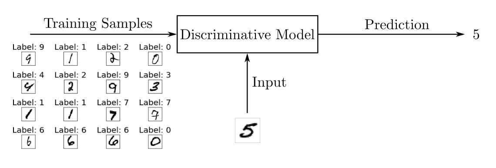](https://files.realpython.com/media/fig_discriminative.9c22a1cd877d.png)

您可以将分类问题的判别模型描绘成使用训练数据来学习类之间的界限的块。然后，他们使用这些边界来区分输入并预测其类别。用数学术语来说，判别模型在给定输入 *x* 的情况下，学习输出 *y* 的条件概率 *P* ( *y* | *x* )。

除了神经网络之外，其他结构也可以用作判别模型，例如[逻辑回归](https://realpython.com/logistic-regression-python/)模型和[支持向量机](https://en.wikipedia.org/wiki/Support_vector_machine) (SVMs)。

然而，像 GANs 这样的生成模型被训练来描述如何根据**概率**模型生成数据集。通过从创成式模型中采样，您能够生成新数据。虽然判别模型用于监督学习，但生成模型通常用于未标记的数据集，可以被视为一种形式的[无监督学习](https://en.wikipedia.org/wiki/Unsupervised_learning)。

使用手写数字的数据集，您可以训练一个生成模型来生成新的数字。在训练阶段，您可以使用某种算法来调整模型的参数，以最小化损失函数，并学习训练集的概率分布。然后，通过训练模型，您可以生成新的样本，如下图所示:

[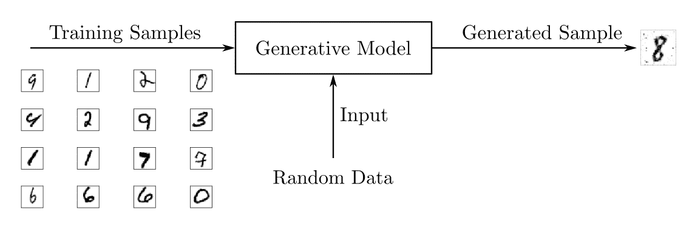](https://files.realpython.com/media/fig_generative.5f01c08f5208.png)

为了输出新的样本，生成模型通常会考虑一个**随机**或随机元素，它会影响模型生成的样本。用于驱动发生器的随机样本是从一个**潜在空间**中获得的，在该潜在空间中，向量代表所产生样本的一种压缩形式。

与判别模型不同，生成模型学习输入数据 *x* 的概率 *P* ( *x* )，通过输入数据的分布，它们能够生成新的数据实例。

**注意:**创成式模型也可用于带标签的数据集。当他们是，他们被训练学习给定输出 *y* 的输入 *x* 的概率 *P* ( *x* | *y* )。它们也可以用于分类任务，但一般来说，判别模型在分类方面表现更好。

你可以在文章[中找到更多关于区别性和生成性分类器的相对优势和劣势的信息:关于区别性和生成性分类器:逻辑回归和朴素贝叶斯的比较](https://papers.nips.cc/paper/2020-on-discriminative-vs-generative-classifiers-a-comparison-of-logistic-regression-and-naive-bayes)。

尽管 GANs 近年来受到了很多关注，但它们并不是唯一可以用作生成模型的架构。除了 GANs，还有各种其他生成模型架构，例如:

*   [玻尔兹曼机器](https://en.wikipedia.org/wiki/Boltzmann_machine)
*   [变型自动编码器](https://en.wikipedia.org/wiki/Autoencoder)
*   [隐马尔可夫模型](https://en.wikipedia.org/wiki/Hidden_Markov_model)
*   预测序列中下一个单词的模型，比如 [GPT-2](https://en.wikipedia.org/wiki/OpenAI#GPT-2)

然而，由于在图像和视频生成方面的令人兴奋的结果，gan 最近引起了公众的极大兴趣。

现在您已经了解了生成模型的基础，您将看到 gan 如何工作以及如何训练它们。

## 生成性对抗网络的架构

生成对抗网络由两个神经网络组成的整体结构组成，一个称为**生成器**，另一个称为**鉴别器**。

生成器的作用是估计真实样本的概率分布，以便提供类似真实数据的生成样本。反过来，鉴别器被训练来估计给定样本来自真实数据而不是由生成器提供的概率。

这些结构被称为生成性对抗网络，因为生成器和鉴别器被训练成相互竞争:生成器试图在愚弄鉴别器方面变得更好，而鉴别器试图在识别生成的样本方面变得更好。

为了理解 GAN 训练如何工作，考虑一个玩具示例，其数据集由二维样本( *x* ₁， *x* ₂)组成， *x* ₁在 0 到 2π的区间内， *x* ₂ = sin( *x* ₁)，如下图所示:

[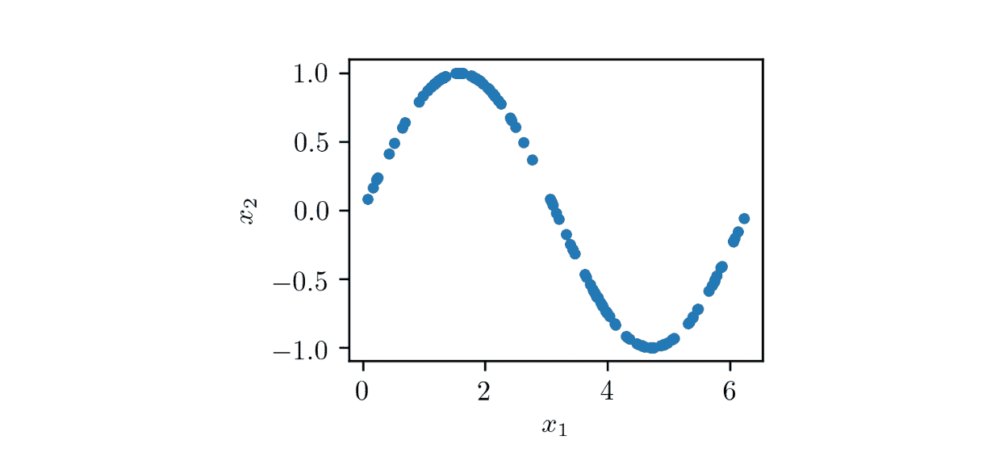](https://files.realpython.com/media/fig_x1x2.f8a39d8ff58a.png)

正如你所看到的，这个数据集由位于正弦曲线上的点( *x* ₁， *x* ₂)组成，具有非常特殊的分布。生成与数据集样本相似的对( *x̃* ₁、 *x̃* ₂)的 GAN 的整体结构如下图所示:

[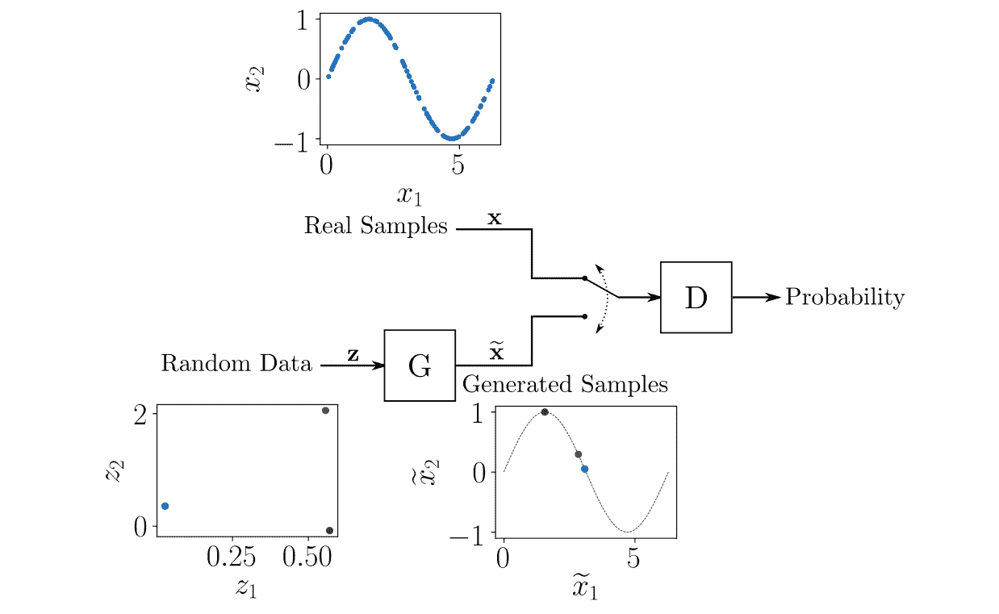](https://files.realpython.com/media/fig_gan.4f0f744c7999.png)

发生器 *G* 由来自潜在空间的[随机数据](https://realpython.com/python-random/)提供，其作用是产生类似真实样本的数据。在本例中，您有一个二维潜在空间，因此生成器被输入随机( *z* ₁， *z* ₂)对，并需要对它们进行转换，以便它们与真实样本相似。

神经网络 *G* 的结构可以是任意的，允许你使用神经网络作为[多层感知器](https://en.wikipedia.org/wiki/Multilayer_perceptron)(MLP)[卷积神经网络](https://en.wikipedia.org/wiki/Convolutional_neural_network) (CNN)，或者任何其他结构，只要输入和输出的维度与潜在空间和真实数据的维度相匹配。

鉴别器 *D* 被输入来自训练数据集的真实样本或者由 *G* 提供的生成样本。它的作用是估计输入属于真实数据集的概率。执行训练使得 *D* 在输入真实样本时输出 1，在输入生成样本时输出 0。

和 *G* 一样，你可以为 *D* 选择任意的神经网络结构，只要它尊重必要的输入和输出维度。在这个例子中，输入是二维的。对于二进制鉴频器，输出可以是范围从 0 到 1 的[标量](https://en.wikipedia.org/wiki/Scalar_(mathematics))。

GAN 训练过程由两人游戏 [minimax](https://realpython.com/python-minimax-nim/) 组成，其中 *D* 用于最小化真实样本和生成样本之间的辨别误差， *G* 用于最大化 *D* 出错的概率。

虽然包含真实数据的数据集没有被标记，但是对 *D* 和 *G* 的训练过程是在监督下进行的。在训练的每一步， *D* 和 *G* 的参数都会更新。其实在[原 GAN 建议](https://papers.nips.cc/paper/5423-generative-adversarial-nets.pdf)中， *D* 的参数更新 *k* 次，而 *G* 的参数每训练一步只更新一次。但是，为了使训练更简单，你可以认为 *k* 等于 1。

为了训练 *D* ，在每次迭代中，你将从训练数据中获取的一些真实样本标记为 1，将 *G* 提供的一些生成样本标记为 0。这样，您可以使用传统的监督训练框架来更新 *D* 的参数，以便最小化损失函数，如以下方案所示:

[](https://files.realpython.com/media/fig_train_discriminator.cd1a1e32764f.png)

对于包含标记的真实样本和生成样本的每批训练数据，您更新 *D* 的参数以最小化损失函数。在 *D* 的参数更新后，你训练 *G* 产生更好的生成样本。 *G* 的输出连接到 *D* ，其参数保持不变，如下图所示:

[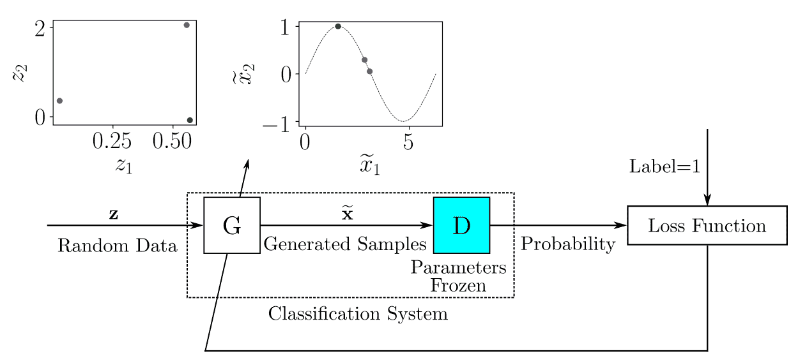](https://files.realpython.com/media/fig_train_generator.7196c4f382ba.png)

你可以把由 *G* 和 *D* 组成的系统想象成一个单一的分类系统，接收随机样本作为输入，输出分类，在这种情况下可以解释为概率。

当 *G* 做得足够好，骗过 *D* 的时候，输出概率应该接近 1。您还可以在这里使用传统的监督训练框架:训练由 *G* 和 *D* 组成的分类系统的数据集将由随机输入样本提供，与每个输入样本相关联的标签将是 1。

在训练过程中，随着参数 *D* 和 *G* 的更新，预计 *G* 给出的生成样本将更接近真实数据，而 *D* 将更难区分真实数据和生成数据。

现在您已经知道了 gan 是如何工作的，您已经准备好使用 **PyTorch** 来实现您自己的 gan 了。

[*Remove ads*](/account/join/)

## *你的第一甘*

 *作为生成性对抗网络的第一个实验，您将实现上一节中描述的示例。

为了运行这个例子，您将使用 [PyTorch](https://pytorch.org/) 库，您可以使用 [Anaconda](https://www.anaconda.com/products/individual) Python 发行版和 [conda](https://docs.conda.io/projects/conda/en/latest/user-guide/getting-started.html) 包和环境管理系统来安装这个库。要了解关于 Anaconda 和 conda 的更多信息，请查看教程[在 Windows 上为机器学习设置 Python](https://realpython.com/python-windows-machine-learning-setup/)。

首先，创建一个 conda 环境并激活它:

```
$ conda create --name gan
$ conda activate gan
```

激活 conda 环境后，您的提示符将显示其名称`gan`。然后，您可以在环境中安装必要的软件包:

```
$ conda install -c pytorch pytorch=1.4.0
$ conda install matplotlib jupyter
```

由于 [PyTorch](https://realpython.com/pytorch-vs-tensorflow/) 是一个非常活跃的开发框架，API 可能会在新版本中发生变化。为了确保示例代码能够运行，您需要安装特定的版本`1.4.0`。

除了 PyTorch 之外，您还将使用 [Matplotlib](https://matplotlib.org/) 来处理绘图，并使用 [Jupyter 笔记本](https://jupyter.org/)在交互式环境中运行代码。这样做不是强制性的，但它有助于机器学习项目的工作。

关于使用 Matplotlib 和 Jupyter 笔记本的复习，请看一下 [Python 使用 Matplotlib 绘图(指南)](https://realpython.com/python-matplotlib-guide/)和 [Jupyter 笔记本:介绍](https://realpython.com/jupyter-notebook-introduction/)。

在打开 Jupyter Notebook 之前，您需要注册 conda `gan`环境，以便您可以使用它作为内核来创建笔记本。为此，在激活了`gan`环境的情况下，运行以下命令:

```
$ python -m ipykernel install --user --name gan
```

现在运行`jupyter notebook`就可以打开 Jupyter 笔记本了。点击*新建*，然后选择*干*，创建一个新的笔记本。

在笔记本中，首先导入必要的库:

```
import torch
from torch import nn

import math
import matplotlib.pyplot as plt
```

在这里，您用`torch`导入 PyTorch 库。您还导入了`nn`,以便能够以一种不太冗长的方式建立神经网络。然后您导入`math`来获得 pi 常量的值，并且您像往常一样导入 Matplotlib 绘图工具作为`plt`。

建立一个**随机生成器种子**是一个很好的实践，这样实验可以在任何机器上完全相同地复制。要在 PyTorch 中实现这一点，请运行以下代码:

```
torch.manual_seed(111)
```

数字`111`代表用于初始化随机数发生器的[随机种子](https://en.wikipedia.org/wiki/Random_seed)，随机数发生器用于初始化神经网络的[权重](https://deepai.org/machine-learning-glossary-and-terms/weight-artificial-neural-network)。尽管实验具有随机性，但只要使用相同的种子，它就必须提供相同的结果。

现在环境已经设置好了，您可以准备训练数据了。

[*Remove ads*](/account/join/)

### *准备训练数据*

 *训练数据由成对的( *x* ₁， *x* ₂)组成，使得 *x* ₂由在从 0 到 2π的区间中对于 *x* ₁的 *x* ₁的正弦值组成。您可以按如下方式实现它:

```
 1train_data_length = 1024
 2train_data = torch.zeros((train_data_length, 2))
 3train_data[:, 0] = 2 * math.pi * torch.rand(train_data_length)
 4train_data[:, 1] = torch.sin(train_data[:, 0])
 5train_labels = torch.zeros(train_data_length)
 6train_set = [
 7    (train_data[i], train_labels[i]) for i in range(train_data_length)
 8]
```

在这里，你用`1024`对( *x* ₁， *x* ₂).)组成一个训练集在**第 2 行**中，你初始化`train_data`，一个具有`1024`行和`2`列维度的张量，都包含零。一个**张量**是一个类似于 [NumPy 数组](https://realpython.com/numpy-array-programming/)的多维数组。

在**第 3 行**中，你用`train_data`的第一列来存储从`0`到`2π`区间的随机值。然后，在**第 4 行**中，你将张量的第二列计算为第一列的正弦。

接下来，您需要一个标签张量，这是 PyTorch 的数据加载器所需要的。由于 GANs 使用无监督学习技术，标签可以是任何东西。毕竟不会用到它们。

在**的第 5 行**，你创建了`train_labels`，一个充满零的张量。最后，在**的第 6 行到第 8 行**中，您将`train_set`创建为一个元组列表，每个元组中的每一行`train_data`和`train_labels`都由 PyTorch 的数据加载器表示。

您可以通过绘制每个点( *x* ₁， *x* ₂):)来检查训练数据

```
plt.plot(train_data[:, 0], train_data[:, 1], ".")
```

输出应该类似于下图:

[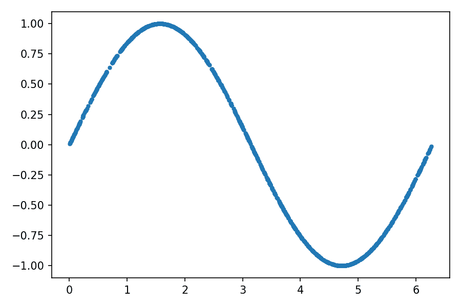](https://files.realpython.com/media/fig_train_sin_mpl.2e194bac5580.png)

使用`train_set`，您可以创建 PyTorch 数据加载器:

```
batch_size = 32
train_loader = torch.utils.data.DataLoader(
    train_set, batch_size=batch_size, shuffle=True
)
```

在这里，您创建一个名为`train_loader`的数据加载器，它将混洗来自`train_set`的数据，并返回一批`32`样本，您将使用这些样本来训练神经网络。

在设置了训练数据之后，您需要为将组成 GAN 的鉴别器和生成器创建神经网络。在下一节中，您将实现鉴别器。

### 实施鉴别器

在 PyTorch 中，神经网络模型由继承自`nn.Module`的类来表示，因此您必须定义一个类来创建鉴别器。关于定义类的更多信息，请看一下 Python 3 中的[面向对象编程(OOP)。](https://realpython.com/python3-object-oriented-programming/)

鉴别器是一个具有二维输入和一维输出的模型。它将从真实数据或生成器接收样本，并提供样本属于真实训练数据的概率。下面的代码显示了如何创建鉴别器:

```
 1class Discriminator(nn.Module):
 2    def __init__(self):
 3        super().__init__()
 4        self.model = nn.Sequential(
 5            nn.Linear(2, 256),
 6            nn.ReLU(),
 7            nn.Dropout(0.3),
 8            nn.Linear(256, 128),
 9            nn.ReLU(),
10            nn.Dropout(0.3),
11            nn.Linear(128, 64),
12            nn.ReLU(),
13            nn.Dropout(0.3),
14            nn.Linear(64, 1),
15            nn.Sigmoid(),
16        )
17
18    def forward(self, x):
19        output = self.model(x)
20        return output
```

您使用`.__init__()`来构建模型。首先，你需要从`nn.Module`调用`super().__init__()`来运行`.__init__()`。你使用的鉴别器是一个 MLP 神经网络，使用`nn.Sequential()`按顺序定义。它具有以下特点:

*   **第 5、6 行:**输入是二维的，第一隐层由激活 [ReLU](https://en.wikipedia.org/wiki/Rectifier_(neural_networks)) 的`256`神经元组成。

*   **第 8、9、11、12 行:**第二和第三隐层分别由`128`和`64`神经元组成，具有 ReLU 激活。

*   **第 14 行和第 15 行:**输出由单个神经元组成，该神经元具有代表概率的[s 形](https://en.wikipedia.org/wiki/Sigmoid_function)激活。

*   **第 7、10、13 行:**在第一、第二、第三个隐藏层之后，你用[掉点](https://en.wikipedia.org/wiki/Dropout_(neural_networks))来避免[过拟合](https://en.wikipedia.org/wiki/Overfitting)。

最后，你用`.forward()`来描述模型的输出是如何计算的。这里，`x`代表模型的输入，是一个二维张量。在这个实现中，输出是通过将输入`x`馈送到您定义的模型而获得的，没有任何其他处理。

声明 discriminator 类后，应该实例化一个`Discriminator`对象:

```
discriminator = Discriminator()
```

`discriminator`代表您定义的神经网络的一个实例，准备接受训练。然而，在实现训练循环之前，您的 GAN 还需要一个生成器。您将在下一节中实现一个。

[*Remove ads*](/account/join/)

### *实现生成器*

 *在生成性对抗网络中，生成器是从潜在空间中获取样本作为其输入并生成类似于训练集中的数据的模型。在这种情况下，这是一个具有二维输入的模型，它将接收随机点( *z* ₁， *z* ₂)，并且二维输出必须提供( *x̃* ₁， *x̃* ₂)类似于来自训练数据的点。

实现类似于您为鉴别器所做的。首先，你必须创建一个继承自`nn.Module`的`Generator`类，定义神经网络架构，然后你需要实例化一个`Generator`对象:

```
 1class Generator(nn.Module):
 2    def __init__(self):
 3        super().__init__()
 4        self.model = nn.Sequential(
 5            nn.Linear(2, 16),
 6            nn.ReLU(),
 7            nn.Linear(16, 32),
 8            nn.ReLU(),
 9            nn.Linear(32, 2),
10        )
11
12    def forward(self, x):
13        output = self.model(x)
14        return output
15
16generator = Generator()
```

这里，`generator`代表生成器神经网络。它由两个带有`16`和`32`神经元的隐藏层和一个输出带有`2`神经元的线性激活层组成，两个隐藏层都带有 ReLU 激活。这样，输出将由一个带有两个元素的向量组成，这两个元素可以是从负无穷大到无穷大范围内的任何值，它们将代表( *x̃* ₁， *x̃* ₂).)

现在您已经为鉴别器和生成器定义了模型，您已经准备好执行训练了！

### 训练模型

在训练模型之前，您需要设置一些在训练过程中使用的参数:

```
 1lr = 0.001
 2num_epochs = 300
 3loss_function = nn.BCELoss()
```

在这里，您可以设置以下参数:

*   **第 1 行**设置学习率(`lr`)，您将使用它来调整网络权重。

*   **第 2 行**设置历元数(`num_epochs`)，其定义了将使用整个训练集执行多少次重复训练。

*   **第 3 行**将变量`loss_function`分配给[二元交叉熵](https://en.wikipedia.org/wiki/Cross_entropy)函数`BCELoss()`，这是您将用来训练模型的损失函数。

二进制交叉熵函数是用于训练鉴别器的合适的损失函数，因为它考虑了二进制分类任务。它也适用于训练发生器，因为它将其输出馈送给鉴别器，后者提供二进制可观察输出。

PyTorch 在`torch.optim`中实现了模型训练的各种权重更新规则。您将使用 [Adam 算法](https://en.wikipedia.org/wiki/Stochastic_gradient_descent#Adam)来训练鉴别器和生成器模型。要使用`torch.optim`创建优化器，请运行以下代码行:

```
 1optimizer_discriminator = torch.optim.Adam(discriminator.parameters(), lr=lr)
 2optimizer_generator = torch.optim.Adam(generator.parameters(), lr=lr)
```

最后，您需要实现一个训练循环，在该循环中，训练样本被提供给模型，并且它们的权重被更新以最小化损失函数:

```
 1for epoch in range(num_epochs):
 2    for n, (real_samples, _) in enumerate(train_loader):
 3        # Data for training the discriminator
 4        real_samples_labels = torch.ones((batch_size, 1))
 5        latent_space_samples = torch.randn((batch_size, 2))
 6        generated_samples = generator(latent_space_samples)
 7        generated_samples_labels = torch.zeros((batch_size, 1))
 8        all_samples = torch.cat((real_samples, generated_samples))
 9        all_samples_labels = torch.cat(
10            (real_samples_labels, generated_samples_labels)
11        )
12
13        # Training the discriminator
14        discriminator.zero_grad()
15        output_discriminator = discriminator(all_samples)
16        loss_discriminator = loss_function(
17            output_discriminator, all_samples_labels)
18        loss_discriminator.backward()
19        optimizer_discriminator.step()
20
21        # Data for training the generator
22        latent_space_samples = torch.randn((batch_size, 2))
23
24        # Training the generator
25        generator.zero_grad()
26        generated_samples = generator(latent_space_samples)
27        output_discriminator_generated = discriminator(generated_samples)
28        loss_generator = loss_function(
29            output_discriminator_generated, real_samples_labels
30        )
31        loss_generator.backward()
32        optimizer_generator.step()
33
34        # Show loss
35        if epoch % 10 == 0 and n == batch_size - 1:
36            print(f"Epoch: {epoch} Loss D.: {loss_discriminator}")
37            print(f"Epoch: {epoch} Loss G.: {loss_generator}")
```

对于 GANs，您可以在每次训练迭代中更新鉴别器和生成器的参数。正如通常对所有神经网络所做的那样，训练过程包括两个循环，一个用于训练时期，另一个用于每个时期的批次。在内部循环中，您开始准备数据来训练鉴别器:

*   **第 2 行:**你从数据加载器中获取当前批次的真实样本，并将其分配给`real_samples`。注意，张量的第一维的元素数量等于`batch_size`。这是 PyTorch 中组织数据的标准方式，张量的每一行代表一批中的一个样本。

*   **第 4 行:**使用`torch.ones()`为真实样本创建值为`1`的标签，然后将标签分配给`real_samples_labels`。

*   **第 5 行和第 6 行:**您通过在`latent_space_samples`中存储随机数据来创建生成的样本，然后您将这些样本馈送给生成器以获得`generated_samples`。

*   **第 7 行:**您使用`torch.zeros()`为生成的样本的标签分配值`0`，然后您将标签存储在`generated_samples_labels`中。

*   **第 8 行到第 11 行:**您连接真实的和生成的样本和标签，并将它们存储在`all_samples`和`all_samples_labels`中，您将使用它们来训练鉴别器。

接下来，在**第 14 行到第 19 行**中，您训练鉴别器:

*   **第 14 行:**在 PyTorch 中，有必要在每个训练步骤清除梯度以避免累积。您可以使用`.zero_grad()`来完成这项工作。

*   **第 15 行:**使用`all_samples`中的训练数据计算鉴频器的输出。

*   **第 16 行和第 17 行:**使用`output_discriminator`中模型的输出和`all_samples_labels`中的标签计算损失函数。

*   **第 18 行:**你用`loss_discriminator.backward()`计算梯度来更新权重。

*   **第 19 行:**您通过调用`optimizer_discriminator.step()`来更新鉴别器权重。

接下来，在**线 22** ，你准备数据来训练发电机。你在`latent_space_samples`中存储随机数据，行数等于`batch_size`。您使用两列，因为您提供二维数据作为生成器的输入。

你在**行 25 到 32** 训练发电机:

*   **第 25 行:**你用`.zero_grad()`清除渐变。

*   **第 26 行:**你用`latent_space_samples`给发电机馈电，把它的输出存储在`generated_samples`里。

*   **第 27 行:**你把发生器的输出输入到鉴别器中，并把它的输出存储在`output_discriminator_generated`中，你将用它作为整个模型的输出。

*   **第 28 到 30 行:**你用`output_discriminator_generated`中存储的分类系统的输出和`real_samples_labels`中的标签计算损失函数，都等于`1`。

*   **第 31 和 32 行:**您计算梯度并更新生成器权重。请记住，当您训练生成器时，您保持了鉴别器权重不变，因为您创建了第一个参数等于`generator.parameters()`的`optimizer_generator`。

最后，在**第 35 到 37 行**上，显示每十个时期结束时鉴频器和发电机损耗函数的值。

由于本例中使用的模型参数很少，因此训练将在几分钟内完成。在下一节中，您将使用经过训练的 GAN 来生成一些样本。

[*Remove ads*](/account/join/)

### *检查由 GAN 生成的样本*

 *生成性对抗网络被设计成生成数据。所以，在训练过程完成后，你可以从潜在空间中获取一些随机样本，并将它们提供给生成器，以获得一些生成的样本:

```
latent_space_samples = torch.randn(100, 2)
generated_samples = generator(latent_space_samples)
```

然后，您可以绘制生成的样本，并检查它们是否与训练数据相似。在绘制`generated_samples`数据之前，您需要使用`.detach()`从 PyTorch 计算图中返回一个张量，然后您将使用它来计算梯度:

```
generated_samples = generated_samples.detach()
plt.plot(generated_samples[:, 0], generated_samples[:, 1], ".")
```

输出应该类似于下图:

[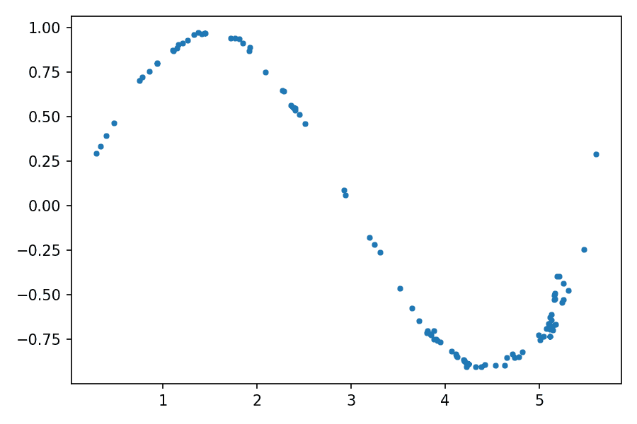](https://files.realpython.com/media/fig_generated_sin_mpl.7040a413a9b2.png)

您可以看到生成数据的分布类似于真实数据的分布。通过使用固定的潜在空间样本张量，并在训练过程中的每个时期结束时将其馈送给生成器，您可以可视化训练的演变:

[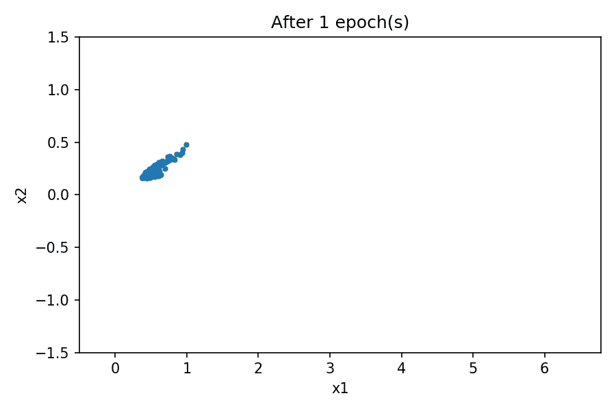](https://files.realpython.com/media/fig_gan_x1x2.69b1d6021da8.gif)

请注意，在训练过程开始时，生成的数据分布与真实数据有很大不同。然而，随着训练的进行，生成器学习真实的数据分布。

现在你已经完成了你的第一个生成性对抗网络的实现，你将经历一个使用图像的更实际的应用。

## 带 GAN 的手写数字生成器

生成式对抗网络还可以生成图像等高维样本。在本例中，您将使用 GAN 来生成手写数字的图像。为此，您将使用手写数字的 [MNIST 数据集](https://en.wikipedia.org/wiki/MNIST_database)来训练模型，该数据集包含在 [`torchvision`](https://pytorch.org/docs/stable/torchvision/index.html) 包中。

首先，您需要在激活的`gan` conda 环境中安装`torchvision`:

```
$ conda install -c pytorch torchvision=0.5.0
```

同样，您使用特定版本的`torchvision`来确保示例代码能够运行，就像您使用`pytorch`一样。设置好环境后，您可以开始实现 Jupyter Notebook 中的模型。打开它，点击*新建*，然后选择*干*，创建一个新的笔记本。

与上一个示例一样，首先导入必要的库:

```
import torch
from torch import nn

import math
import matplotlib.pyplot as plt
import torchvision import torchvision.transforms as transforms
```

除了您之前导入的库之外，您还需要`torchvision`和`transforms`来获取训练数据并执行图像转换。

再次设置随机生成器种子，以便能够复制该实验:

```
torch.manual_seed(111)
```

由于该示例使用训练集中的图像，因此模型需要更复杂，具有更多参数。这使得训练过程更慢，当在 [CPU](https://en.wikipedia.org/wiki/Central_processing_unit) 上运行时，每个历元花费大约两分钟。你需要大约 50 个历元来获得相关的结果，所以使用 CPU 的总训练时间大约是 100 分钟。

为了减少训练时间，您可以使用一个 [GPU](https://en.wikipedia.org/wiki/Graphics_processing_unit) 来训练模型，如果您有可用的话。但是，您需要手动将张量和模型移动到 GPU，以便在训练过程中使用它们。

您可以通过创建一个指向 CPU 或 GPU(如果有的话)的`device`对象来确保您的代码将在任一设置上运行:

```
device = ""
if torch.cuda.is_available():
    device = torch.device("cuda")
else:
    device = torch.device("cpu")
```

稍后，您将使用这个`device`来设置应该在哪里创建张量和模型，如果可用的话，使用 GPU。

现在基本环境设置好了，可以准备训练数据了。

[*Remove ads*](/account/join/)

### *准备训练数据*

 *MNIST 数据集由从 0 到 9 的手写数字的 28 × 28 像素灰度图像组成。要在 PyTorch 中使用它们，您需要执行一些转换。为此，您定义了`transform`，一个在加载数据时使用的函数:

```
transform = transforms.Compose(
    [transforms.ToTensor(), transforms.Normalize((0.5,), (0.5,))]
)
```

该功能有两个部分:

1.  **`transforms.ToTensor()`** 将数据转换成 PyTorch 张量。
2.  **`transforms.Normalize()`** 转换张量系数的范围。

由`transforms.ToTensor()`给出的原始系数的范围是从 0 到 1，由于图像背景是黑色的，当使用这个范围表示时，大多数系数等于 0。

`transforms.Normalize()`通过从原始系数中减去`0.5`并将结果除以`0.5`，将系数的范围更改为-1 到 1。通过这种转换，输入样本中等于 0 的元素数量显著减少，这有助于训练模型。

`transforms.Normalize()`的自变量是二元组`(M₁, ..., Mₙ)`和`(S₁, ..., Sₙ)`，其中`n`代表图像的[通道](https://en.wikipedia.org/wiki/Channel_(digital_image))的数量。MNIST 数据集中的灰度图像只有一个通道，因此元组只有一个值。然后，对于图像的每个通道`i`，`transforms.Normalize()`从系数中减去`Mᵢ`，并将结果除以`Sᵢ`。

现在，您可以使用`torchvision.datasets.MNIST`加载训练数据，并使用`transform`执行转换:

```
train_set = torchvision.datasets.MNIST(
    root=".", train=True, download=True, transform=transform
)
```

参数`download=True`确保第一次运行上述代码时，MNIST 数据集将被下载并存储在当前目录中，如参数`root`所示。

现在您已经创建了`train_set`，您可以像以前一样创建数据加载器:

```
batch_size = 32
train_loader = torch.utils.data.DataLoader(
    train_set, batch_size=batch_size, shuffle=True
)
```

您可以使用 Matplotlib 绘制一些训练数据的样本。为了提高可视化效果，您可以使用`cmap=gray_r`反转彩色地图，并在白色背景上用黑色绘制数字:

```
real_samples, mnist_labels = next(iter(train_loader))
for i in range(16):
    ax = plt.subplot(4, 4, i + 1)
    plt.imshow(real_samples[i].reshape(28, 28), cmap="gray_r")
    plt.xticks([])
    plt.yticks([])
```

输出应该类似于以下内容:

[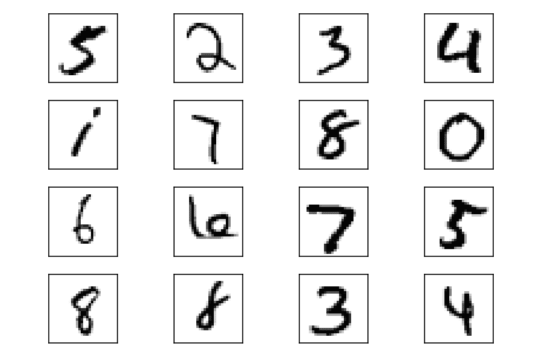](https://files.realpython.com/media/fig_train_mnist_mpl.ddcdc8188b90.png)

如你所见，有不同书写风格的数字。随着 GAN 了解数据的分布，它还会生成不同手写风格的数字。

现在您已经准备好了训练数据，可以实现鉴别器和生成器模型了。

### 实施鉴别器和发生器

在这种情况下，鉴别器是一个 MLP 神经网络，它接收一个 28 × 28 像素的图像，并提供该图像属于真实训练数据的概率。

您可以使用以下代码定义模型:

```
 1class Discriminator(nn.Module):
 2    def __init__(self):
 3        super().__init__()
 4        self.model = nn.Sequential(
 5            nn.Linear(784, 1024),
 6            nn.ReLU(),
 7            nn.Dropout(0.3),
 8            nn.Linear(1024, 512),
 9            nn.ReLU(),
10            nn.Dropout(0.3),
11            nn.Linear(512, 256),
12            nn.ReLU(),
13            nn.Dropout(0.3),
14            nn.Linear(256, 1),
15            nn.Sigmoid(),
16        )
17
18    def forward(self, x):
19        x = x.view(x.size(0), 784)
20        output = self.model(x)
21        return output
```

要将图像系数输入到 MLP 神经网络中，您需要[对](https://en.wikipedia.org/wiki/Vectorization_(mathematics))进行矢量化处理，以便神经网络接收带有`784`系数的矢量。

矢量化发生在`.forward()`的第一行，因为对`x.view()`的调用转换了输入张量的形状。在这种情况下，输入`x`的原始形状是 32 × 1 × 28 × 28，其中 32 是您设置的批量大小。转换后，`x`的形状变成 32 × 784，每一行代表训练集的一幅图像的系数。

要使用 GPU 运行鉴别器模型，必须用`.to()`将其实例化并发送给 GPU。为了在有可用的 GPU 时使用它，您可以将模型发送到您之前创建的`device`对象:

```
discriminator = Discriminator().to(device=device)
```

因为生成器将生成更复杂的数据，所以有必要增加潜在空间输入的维度。在这种情况下，生成器将被提供一个 100 维的输入，并将提供一个具有 784 个系数的输出，这些系数将被组织成一个表示图像的 28 × 28 张量。

以下是完整的发电机型号代码:

```
 1class Generator(nn.Module):
 2    def __init__(self):
 3        super().__init__()
 4        self.model = nn.Sequential(
 5            nn.Linear(100, 256),
 6            nn.ReLU(),
 7            nn.Linear(256, 512),
 8            nn.ReLU(),
 9            nn.Linear(512, 1024),
10            nn.ReLU(),
11            nn.Linear(1024, 784),
12            nn.Tanh(),
13        )
14
15    def forward(self, x):
16        output = self.model(x)
17        output = output.view(x.size(0), 1, 28, 28)
18        return output
19
20generator = Generator().to(device=device)
```

在**第 12 行**中，您使用[双曲正切函数](http://mathworld.wolfram.com/HyperbolicTangent.html) `Tanh()`作为输出层的激活，因为输出系数应该在-1 到 1 的区间内。在**第 20 行**中，您实例化生成器并将其发送到`device`以使用 GPU(如果有可用的 GPU 的话)。

现在您已经定义了模型，您将使用训练数据来训练它们。

[*Remove ads*](/account/join/)

### *训练模型*

 *要训练模型，您需要像在前面的示例中一样定义训练参数和优化器:

```
lr = 0.0001
num_epochs = 50
loss_function = nn.BCELoss()

optimizer_discriminator = torch.optim.Adam(discriminator.parameters(), lr=lr)
optimizer_generator = torch.optim.Adam(generator.parameters(), lr=lr)
```

为了获得更好的结果，可以降低上一个例子中的学习率。您还将时期数设置为`50`以减少训练时间。

训练循环与您在前面的示例中使用的非常相似。在突出显示的行中，您将训练数据发送到`device`以使用 GPU(如果可用的话):

```
 1for epoch in range(num_epochs):
 2    for n, (real_samples, mnist_labels) in enumerate(train_loader):
 3        # Data for training the discriminator
 4        real_samples = real_samples.to(device=device) 5        real_samples_labels = torch.ones((batch_size, 1)).to( 6            device=device 7        ) 8        latent_space_samples = torch.randn((batch_size, 100)).to( 9            device=device 10        ) 11        generated_samples = generator(latent_space_samples)
12        generated_samples_labels = torch.zeros((batch_size, 1)).to( 13            device=device 14        ) 15        all_samples = torch.cat((real_samples, generated_samples))
16        all_samples_labels = torch.cat(
17            (real_samples_labels, generated_samples_labels)
18        )
19
20        # Training the discriminator
21        discriminator.zero_grad()
22        output_discriminator = discriminator(all_samples)
23        loss_discriminator = loss_function(
24            output_discriminator, all_samples_labels
25        )
26        loss_discriminator.backward()
27        optimizer_discriminator.step()
28
29        # Data for training the generator
30        latent_space_samples = torch.randn((batch_size, 100)).to( 31            device=device 32        ) 33
34        # Training the generator
35        generator.zero_grad()
36        generated_samples = generator(latent_space_samples)
37        output_discriminator_generated = discriminator(generated_samples)
38        loss_generator = loss_function(
39            output_discriminator_generated, real_samples_labels
40        )
41        loss_generator.backward()
42        optimizer_generator.step()
43
44        # Show loss
45        if n == batch_size - 1:
46            print(f"Epoch: {epoch} Loss D.: {loss_discriminator}")
47            print(f"Epoch: {epoch} Loss G.: {loss_generator}")
```

有些张量不需要用`device`显式发送到 GPU。第 11 行**中的`generated_samples`就是这种情况，因为`latent_space_samples`和`generator`之前已经发送到 GPU，所以已经发送到可用的 GPU。**

由于本例中的模型更加复杂，因此培训可能需要更多的时间。完成后，您可以通过生成一些手写数字样本来检查结果。

### 检查由 GAN 生成的样本

要生成手写数字，您必须从潜在空间中随机抽取一些样本，并将它们提供给生成器:

```
latent_space_samples = torch.randn(batch_size, 100).to(device=device)
generated_samples = generator(latent_space_samples)
```

为了绘制`generated_samples`，你需要将数据移回 CPU，以防它在 GPU 上运行。为此，您可以简单地调用`.cpu()`。正如您之前所做的，在使用 Matplotlib 绘制数据之前，您还需要调用`.detach()`:

```
generated_samples = generated_samples.cpu().detach()
for i in range(16):
    ax = plt.subplot(4, 4, i + 1)
    plt.imshow(generated_samples[i].reshape(28, 28), cmap="gray_r")
    plt.xticks([])
    plt.yticks([])
```

输出应该是类似于训练数据的数字，如下图所示:

[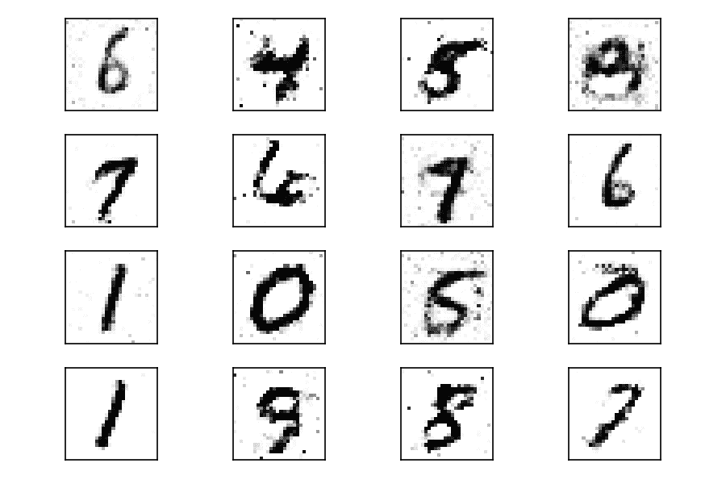](https://files.realpython.com/media/fig_generated_mnist_mpl.ecc483e9dd9d.png)

经过 50 代的训练，产生了几个与真实数字相似的数字。您可以通过考虑更多的训练时期来改善结果。与前面的示例一样，通过使用固定的潜在空间样本张量，并在训练过程中的每个时期结束时将其馈送给生成器，您可以可视化训练的演变:

[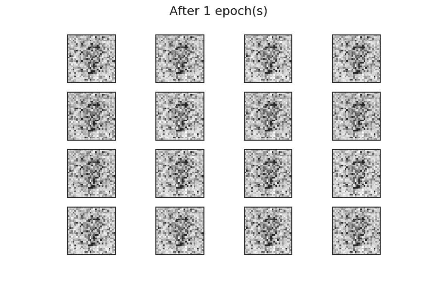](https://files.realpython.com/media/fig_gan_mnist.5d8784a85944.gif)

您可以看到，在训练过程的开始，生成的图像完全是随机的。随着训练的进行，生成器学习真实数据的分布，并且在大约二十个时期，一些生成的数字已经类似于真实数据。

## 结论

恭喜你！你已经学会了如何实现你自己的生成性对抗网络。在深入研究生成手写数字图像的实际应用程序之前，您首先通过一个玩具示例来了解 GAN 结构。

你可以看到，尽管 GANs 很复杂，但是像 PyTorch 这样的机器学习框架通过提供[自动微分](https://en.wikipedia.org/wiki/Automatic_differentiation)和简单的 GPU 设置使实现变得更加简单。

**在本教程中，您学习了:**

*   **区别型**和**生成型**模型有什么区别
*   如何生成对抗网络**结构**和**训练**
*   如何使用 **PyTorch** 和 **GPU** 等工具实现和训练 GAN 模型

gan 是一个非常活跃的研究课题，近年来提出了几个令人兴奋的应用。如果你对这个主题感兴趣，留意技术和科学文献，寻找新的应用想法。

[*Remove ads*](/account/join/)

## *延伸阅读*

 *现在你已经知道了使用生成式对抗网络的基础，你可以开始研究更复杂的应用了。以下书籍是加深你知识的好方法:

*   由 Jakub Langr 和 Vladimir Bok 撰写的[*GANs in Action:Deep Learning with Generative adversive Networks*](https://realpython.com/asins/1617295566/)更详细地涵盖了这个主题，包括最近的应用，如用于执行风格转移的 [CycleGAN](https://github.com/junyanz/CycleGAN/) 。
*   [*《生成性深度学习:教机器画画、写字、作曲、玩*](https://realpython.com/asins/1492041947/) 》作者大卫·福斯特，调查了生成性对抗网络和其他生成模型的实际应用。

值得一提的是，机器学习是一个广泛的主题，除了生成对抗网络之外，还有大量不同的模型结构。有关机器学习的更多信息，请查看以下资源:

*   [在 Windows 上设置 Python 进行机器学习](https://realpython.com/python-windows-machine-learning-setup/)
*   [用 Python 和 Keras 进行实用文本分类](https://realpython.com/python-keras-text-classification/)
*   [使用 Python 进行传统人脸检测](https://realpython.com/traditional-face-detection-python/)
*   [OpenCV+Python 中使用颜色空间的图像分割](https://realpython.com/python-opencv-color-spaces/)
*   [Python 语音识别终极指南](https://realpython.com/python-speech-recognition/)
*   [用协同过滤构建推荐引擎](https://realpython.com/build-recommendation-engine-collaborative-filtering/)

在机器学习的世界里，有太多东西需要学习。继续学习，欢迎在下面留下任何问题或评论！********