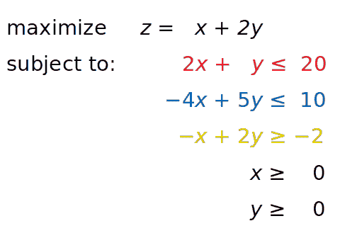
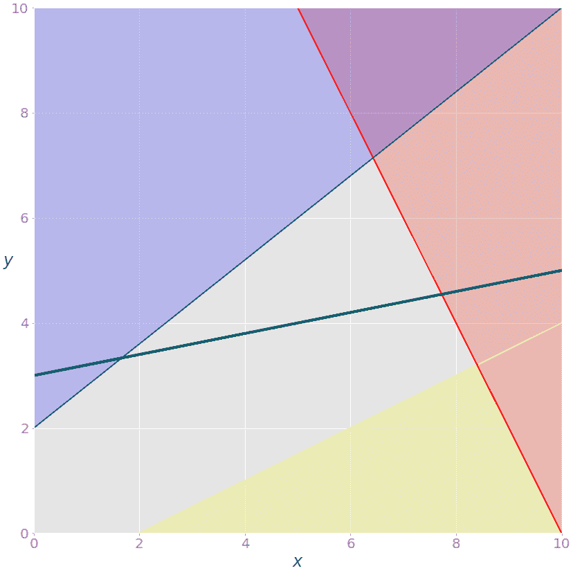
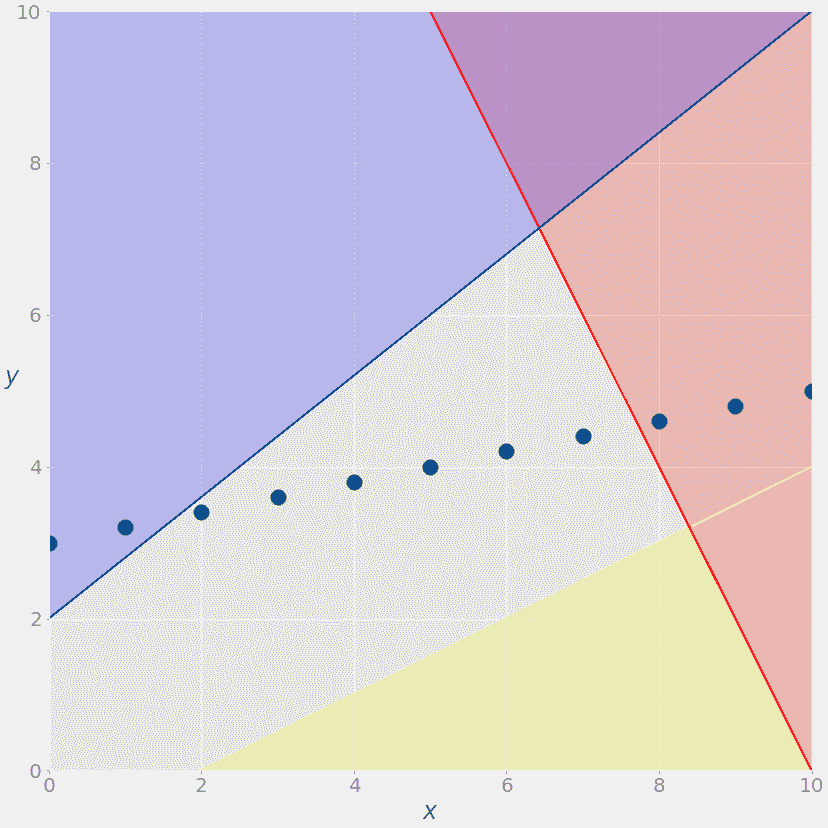
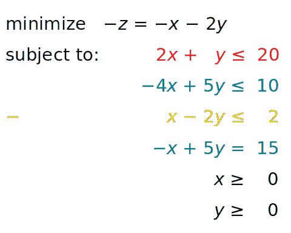
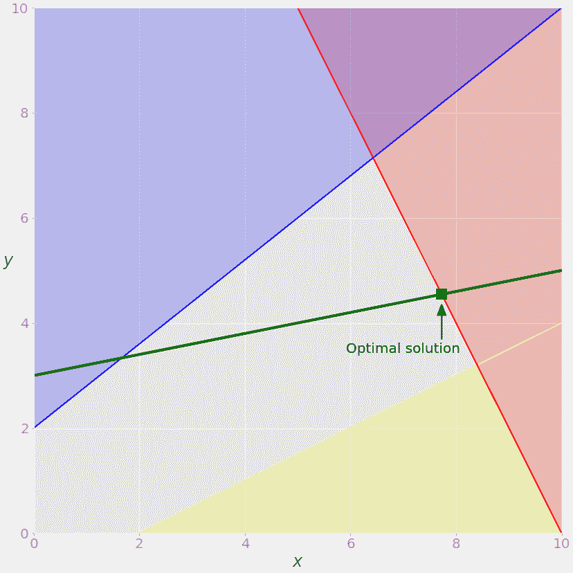
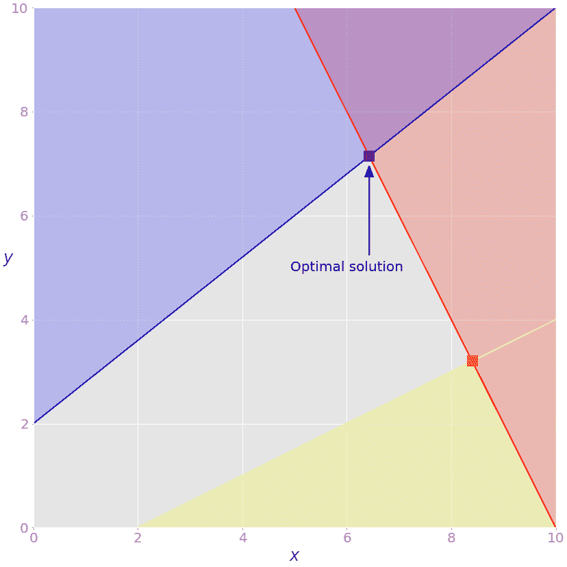
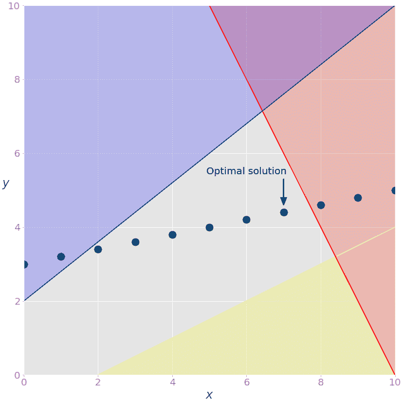

# 动手线性编程:用 Python 优化

> 原文：<https://realpython.com/linear-programming-python/>

[**线性规划**](https://en.wikipedia.org/wiki/Linear_programming) 是在 [**数学规划**](https://en.wikipedia.org/wiki/Mathematical_optimization) 中使用的一套技术，有时称为数学优化，以解决[线性方程组](https://en.wikipedia.org/wiki/System_of_linear_equations)和不等式，同时最大化或最小化一些[线性函数](https://en.wikipedia.org/wiki/Linear_function)。它在科学计算、经济、技术科学、制造、运输、军事、管理、能源等领域都很重要。

Python 生态系统为线性编程提供了几个全面而强大的工具。您可以在简单和复杂的工具之间以及免费和商业工具之间进行选择。这完全取决于你的需求。

在本教程中，您将学习:

*   什么是**线性规划**以及为什么它很重要
*   哪些 **Python 工具**适合线性编程
*   如何用 Python 构建线性规划**模型**
*   如何**用 Python 解决**一个线性规划问题

你将首先学习线性编程的[基础](https://brilliant.org/wiki/linear-programming/)。然后，您将探索如何用 Python 实现线性编程技术。最后，您将查看一些资源和库，以帮助您进一步进行线性编程。

**免费奖励:** [掌握 Python 的 5 个想法](https://realpython.com/bonus/python-mastery-course/)，这是一个面向 Python 开发者的免费课程，向您展示将 Python 技能提升到下一个水平所需的路线图和心态。

## 线性编程解释

在本节中，您将学习线性编程的基础知识和一个相关的学科，混合整数线性编程。在下一节的[中，您将看到一些实用的线性编程示例。稍后，您将使用 Python 解决线性规划和混合整数线性规划问题。](#linear-programming-examples)

[*Remove ads*](/account/join/)

### *什么是线性规划？*

 *假设你有一个线性方程组和不等式组。这种系统通常有许多可能的解决方案。线性规划是一套数学和计算工具，让你找到一个特定的解决方案，这个系统对应的最大值或最小值的一些其他线性函数。

### 什么是混合整数线性规划？

**混合整数线性规划**是线性规划的扩展。它处理至少一个[变量](https://realpython.com/python-variables/)采用离散整数而不是[连续值](https://en.wikipedia.org/wiki/Continuous_or_discrete_variable)的问题。尽管混合整数问题初看起来类似于连续变量问题，但它们在灵活性和精确性方面具有显著优势。

**整数变量**对于正确表示用整数自然表达的数量很重要，比如生产的飞机数量或服务的客户数量。

一种特别重要的整数变量是二进制变量。它只能接受值**零**或**一**，并且在做出是或否的决定时很有用，例如是否应该建立一个工厂或是否应该打开或关闭一台机器。您还可以使用它们来模拟逻辑约束。

### 为什么线性规划很重要？

线性规划是一种基本的优化技术，在科学和数学密集型领域已经使用了几十年。它精确、相对快速，适用于一系列实际应用。

混合整数线性规划允许您克服线性规划的许多限制。可以用[分段线性函数](https://en.wikipedia.org/wiki/Piecewise_linear_function)近似非线性函数，使用[半连续变量](http://lpsolve.sourceforge.net/5.0/semi-cont.htm)，模型逻辑约束等等。这是一个计算密集型工具，但计算机硬件和软件的进步使它每天都更适用。

通常，当人们试图制定和解决一个优化问题时，第一个问题是他们是否可以应用线性规划或混合整数线性规划。

线性规划和混合整数线性规划的一些用例在以下文章中进行了说明:

*   [Gurobi 优化案例研究](https://www.gurobi.com/resources/?category-filter=case-study)
*   [线性规划技术的五个应用领域](https://sciencing.com/five-application-linear-programming-techniques-7789072.html)

随着时间的推移，随着计算机能力的提高、算法的改进以及更用户友好的软件解决方案的出现，线性规划，尤其是混合整数线性规划的重要性不断增加。

### 用 Python 进行线性编程

求解线性规划问题的基本方法称为 [**单纯形法**](https://en.wikipedia.org/wiki/Simplex_algorithm) ，有几种变体。另一种流行的方法是 [**内点法**](https://en.wikipedia.org/wiki/Interior-point_method) 。

混合整数线性规划问题用更复杂、计算量更大的方法来解决，如 [**分支定界法**](https://en.wikipedia.org/wiki/Branch_and_bound) ，它在幕后使用线性规划。这种方法的一些变体是 [**分支切割法**](https://en.wikipedia.org/wiki/Branch_and_cut) ，它涉及到[切割平面](https://en.wikipedia.org/wiki/Cutting-plane_method)的使用，以及 [**分支定价法**](https://en.wikipedia.org/wiki/Branch_and_price) 。

对于线性规划和混合整数线性规划，有几个合适的和众所周知的 Python 工具。其中一些是开源的，而另一些是专有的。你需要一个免费的还是付费的工具取决于你的问题的大小和复杂程度以及对速度和灵活性的需求。

值得一提的是，几乎所有广泛使用的线性编程和混合整数线性编程库都是 Fortran 或 C 或 C++原生的，并且是用它们编写的。这是因为线性规划需要对(通常很大的)矩阵进行计算密集型的工作。这样的库被称为**解算器**。Python 工具只是解算器的包装器。

Python 适合围绕本地库构建包装器，因为它与 C/C++配合得很好。对于本教程，您不需要任何 C/C++(或 Fortran ),但是如果您想了解关于这个很酷的特性的更多信息，请查看以下资源:

*   [构建 Python C 扩展模块](https://realpython.com/build-python-c-extension-module/)
*   [CPython 内部](https://realpython.com/products/cpython-internals-book/)
*   [用 C 或 C++扩展 Python](https://docs.python.org/3/extending/extending.html)

基本上，当您定义和求解一个模型时，您使用 Python 函数或方法来调用一个底层库，该库执行实际的优化工作并将解返回给您的 Python 对象。

几个免费的 Python 库专门用于与线性或混合整数线性编程解算器进行交互:

*   [SciPy 优化和求根](https://docs.scipy.org/doc/scipy/reference/optimize.html)
*   [纸浆](https://www.coin-or.org/PuLP/solvers.html)
*   [Pyomo](https://pyomo.readthedocs.io/en/stable/solving_pyomo_models.html#supported-solvers)
*   [CVXOPT](https://cvxopt.org/userguide/coneprog.html#optional-solvers)

在本教程中，你将使用 [SciPy](https://realpython.com/python-scipy-cluster-optimize/) 和 [PuLP](https://coin-or.github.io/pulp/) 来定义和解决线性规划问题。

[*Remove ads*](/account/join/)

## *线性规划示例*

 *在本节中，您将看到两个线性规划问题的例子:

1.  一个说明什么是线性规划的小问题
2.  一个与资源分配相关的实际问题，它在现实世界中说明了线性规划的概念

在下一节中，您将使用 Python 来解决这两个问题。

### 小线性规划问题

考虑下面的线性规划问题:

[](https://files.realpython.com/media/lp-py-eq-1.4c56e85a1874.png)

你需要找到 *x* 和 *y* 使得红色、蓝色和黄色不等式，以及不等式 *x* ≥ 0 和 *y* ≥ 0 得到满足。同时，你的解必须对应于 *z* 的最大可能值。

你需要找到的独立变量——在这种情况下是 *x* 和*y*——被称为**决策变量**。要被最大化或最小化的决策变量的函数——在本例中为*z*——被称为**目标函数**、**成本函数**，或者仅仅是**目标**。你需要满足的不等式被称为**不等式约束**。您也可以在称为**等式约束**的约束中使用等式。

你可以这样想象这个问题:

[](https://files.realpython.com/media/lp-py-fig-1.00f609c97aec.png)

红线代表函数 2 *x* + *y* = 20，上面的红色区域表示红色不等式*不*满足的地方。同样，蓝线是函数 4 *x* + 5 *y* = 10，蓝色区域是被禁止的，因为它违反了蓝色不等式。黄线是*x*+2*y*= 2，其下方的黄色区域是黄色不等式无效的地方。

如果忽略红色、蓝色和黄色区域，则只剩下灰色区域。灰色区域的每个点都满足所有约束，并且是问题的潜在解决方案。这个区域叫做**可行域**，它的点就是**可行解**。在这种情况下，有无数可行的解决方案。

你要最大化 *z* 。最大 *z* 对应的可行解就是**最优解**。如果你试图*最小化*目标函数，那么最优解将对应于它的可行最小值。

注意 *z* 是线性的。你可以把它想象成三维空间中的一个平面。这就是为什么最优解必须在可行域的一个**顶点**或角上。在这种情况下，最佳解决方案是红线和蓝线的交叉点，稍后你会看到。

有时可行区域的整个边缘，或者甚至整个区域，可以对应于相同的值 *z* 。在这种情况下，你有许多最优解。

现在，您可以用绿色显示的附加等式约束来扩展问题了:

[](https://files.realpython.com/media/lp-py-eq-2.2984ea2b89df.png)

用绿色书写的等式——*x*+5*y*= 15 是新的。这是一个平等约束。您可以通过在之前的图像中添加一条相应的绿线来将其可视化:

[](https://files.realpython.com/media/lp-py-fig-2.3d21c2b24205.png)

现在的解必须满足绿色等式，所以可行域不再是整个灰色区域。它是绿线从与蓝线的交点到与红线的交点穿过灰色区域的部分。后一点就是解决办法。

如果您插入一个要求，即所有的值 *x* 都必须是整数，那么您将得到一个混合整数线性规划问题，并且可行解的集合将再次改变:

[](https://files.realpython.com/media/lp-py-fig-3.c13d0660ce57.png)

你不再有绿线，只有沿线的点，在这些点上 *x* 的值是一个整数。可行的解决方案是灰色背景上的绿点，这种情况下的最佳方案最接近红线。

这三个例子说明了**可行线性规划问题**，因为它们有有界可行域和有限解。

[*Remove ads*](/account/join/)

### *不可行线性规划问题*

 *如果线性规划问题没有解，那么它就是不可行的。这通常发生在没有解决方案能同时满足所有约束的时候。

例如，考虑如果添加约束*x*+*y*≤-1 会发生什么。那么至少一个决策变量( *x* 或 *y* )必须是负的。这与给定的约束 *x* ≥ 0 和 *y* ≥ 0 相冲突。这样的系统没有可行解，所以叫不可行。

另一个示例是添加平行于绿线的第二个等式约束。这两条线没有共同点，所以不会有同时满足两个约束的解决方案。

### 无界线性规划问题

如果一个线性规划问题的可行域无界且解不有限，那么这个问题就是无界的。这意味着至少有一个变量不受约束，可以达到正无穷大或负无穷大，使目标也是无穷大。

例如，假设你把上面的初始问题去掉红色和黄色约束。从一个问题中去掉约束叫做**放松**问题。在这种情况下， *x* 和 *y* 不会被限制在正方向。你可以将它们增加到正无穷大，产生一个无限大的 z 值。

### 资源分配问题

在前面的章节中，您看到了一个抽象的线性编程问题，它与任何现实世界的应用程序都没有关系。在这一小节中，你会发现一个更具体、更实用的优化问题，它与制造业中的资源分配有关。

假设一家工厂生产四种不同的产品，第一种产品的日产量是 *x* ₁，第二种产品的日产量是 *x* ₂，以此类推。目标是确定每种产品的利润最大化日产量，同时牢记以下条件:

1.  第一个、第二个、第三个和第四个产品的单位产品利润分别是 20 美元、12 美元、40 美元和 25 美元。

2.  由于人力的限制，每天生产的总数量不能超过五十台。

3.  对于每单位的第一种产品，消耗三单位的原材料 A。第二种产品的每单位需要两个单位的原料 A 和一个单位的原料 b。第三种产品的每单位需要一个单位的 A 和两个单位的 b。最后，第四种产品的每单位需要三个单位的 b。

4.  由于运输和储存的限制，工厂每天可以消耗一百单位的原材料 A 和九十单位的 B。

数学模型可以这样定义:

[](https://files.realpython.com/media/lp-py-eq-4.0178c4cfe357.png)

目标函数(利润)在条件 1 中定义。人力限制来自条件 2。原材料 A 和 B 的约束条件可以通过对每种产品的原材料需求求和从条件 3 和 4 中推导出来。

最后，产品数量不能为负，因此所有决策变量必须大于或等于零。

与前面的例子不同，您不能方便地将这个例子可视化，因为它有四个决策变量。然而，不管问题的维度如何，原则都是一样的。

## 线性编程 Python 实现

在本教程中，您将使用两个 [Python 包](https://realpython.com/python-modules-packages/)来解决上述线性编程问题:

1.  **[SciPy](https://scipy.org/)** 是用 Python 编写的科学计算通用包。
2.  **[纸浆](https://coin-or.github.io/pulp/)** 是一个用于定义问题和调用外部解算器的 Python 线性编程 API。

SciPy 的设置非常简单。一旦你安装了它，你就拥有了你所需要的一切。它的子包 **[`scipy.optimize`](https://docs.scipy.org/doc/scipy/reference/optimize.html)** 既可以用于线性优化，也可以用于[非线性优化](https://realpython.com/python-scipy-cluster-optimize/)。

纸浆允许你选择解决方案，并以更自然的方式阐述问题。PuLP 使用的默认解算器是[硬币或分支和切割解算器(CBC)](https://github.com/coin-or/Cbc) 。它连接到用于线性松弛的[硬币或线性规划解算器(CLP)](https://github.com/coin-or/Clp) 和用于切割生成的[硬币或切割生成器库(CGL)](https://github.com/coin-or/Cgl) 。

另一个伟大的开源求解器是 [GNU 线性编程工具包(GLPK)](https://www.gnu.org/software/glpk/) 。一些众所周知的非常强大的商业和专有解决方案是 [Gurobi](https://www.gurobi.com/) 、 [CPLEX](https://www.ibm.com/analytics/cplex-optimizer) 和 [XPRESS](https://www.fico.com/en/products/fico-xpress-solver) 。

除了在定义问题时提供灵活性和运行各种解算器的能力之外，与 Pyomo 或 CVXOPT 等需要更多时间和精力来掌握的替代品相比，PuLP 使用起来没有那么复杂。

[*Remove ads*](/account/join/)

### *安装 SciPy 和 PuLP*

 *按照这个教程，你需要安装 SciPy 和纸浆。下面的例子使用了 1.4.1 版的 SciPy 和 2.1 版的 PuLP。

您可以使用 [`pip`](https://realpython.com/what-is-pip/) 安装两者:

```py
$ python -m pip install -U "scipy==1.4.*" "pulp==2.1"
```

您可能需要运行`pulptest`或`sudo pulptest`来启用纸浆的默认解算器，尤其是如果您使用的是 Linux 或 Mac:

```py
$ pulptest
```

或者，您可以下载、安装和使用 GLPK。它是免费的开源软件，可以在 Windows、MacOS 和 Linux 上运行。你会看到如何使用 GLPK(除了 CBC)与纸浆在本教程稍后。

在 Windows 上，你可以[下载档案文件](https://www.gnu.org/software/glpk/#downloading)并运行安装文件。

在 MacOS 上，你可以[使用自制软件](http://arnab-deka.com/posts/2010/02/installing-glpk-on-a-mac/):

```py
$ brew install glpk
```

在 Debian 和 Ubuntu 上，使用`apt`安装`glpk`和`glpk-utils`:

```py
$ sudo apt install glpk glpk-utils
```

在 Fedora 上，使用`dnf`和`glpk-utils`:

```py
$ sudo dnf install glpk-utils
```

你可能还会发现 [conda](https://docs.conda.io/en/latest/) 对安装 GLPK 很有用:

```py
$ conda install -c conda-forge glpk
```

完成安装后，您可以检查 GLPK 的版本:

```py
$ glpsol --version
```

更多信息请参见 GLPK 关于安装 [Windows 可执行文件](https://en.wikibooks.org/wiki/GLPK/Windows_executables)和 [Linux 软件包](https://en.wikibooks.org/wiki/GLPK/Linux_packages)的教程。

### 使用 SciPy

在本节中，您将学习如何使用 SciPy [优化和求根](https://docs.scipy.org/doc/scipy/reference/optimize.html)库进行线性编程。

要用 SciPy 定义和解决优化问题，需要导入 [`scipy.optimize.linprog()`](https://docs.scipy.org/doc/scipy/reference/generated/scipy.optimize.linprog.html) :

>>>

```py
>>> from scipy.optimize import linprog
```

既然已经导入了`linprog()`，就可以开始优化了。

#### 示例 1

让我们先从上面解决线性规划问题:

[](https://files.realpython.com/media/lp-py-eq-2.2984ea2b89df.png)

`linprog()`仅解决最小化(非最大化)问题，不允许大于或等于符号(≥)的不等式约束。要解决这些问题，您需要在开始优化之前修改您的问题:

*   不用最大化 *z* = *x* + *2* y，你可以最小化它的负值(-*z*=*x*-*2*y)。
*   您可以将黄色不等式乘以 1，得到相反的小于或等于号(≤)。

引入这些变化后，您会得到一个新的系统:

[](https://files.realpython.com/media/lp-py-eq-3.65b2e6d529bc.png)

这个系统相当于原来的，将有相同的解决方案。应用这些更改的唯一原因是为了克服与问题表述相关的 SciPy 的局限性。

下一步是定义输入值:

>>>

```py
>>> obj = [-1, -2]
>>> #      ─┬  ─┬
>>> #       │   └┤ Coefficient for y
>>> #       └────┤ Coefficient for x

>>> lhs_ineq = [[ 2,  1],  # Red constraint left side
...             [-4,  5],  # Blue constraint left side
...             [ 1, -2]]  # Yellow constraint left side

>>> rhs_ineq = [20,  # Red constraint right side
...             10,  # Blue constraint right side
...              2]  # Yellow constraint right side

>>> lhs_eq = [[-1, 5]]  # Green constraint left side
>>> rhs_eq = [15]       # Green constraint right side
```

您将来自上述系统的值放入适当的[列表、元组](https://realpython.com/python-lists-tuples/)或 [NumPy 数组](https://numpy.org/doc/1.18/reference/generated/numpy.ndarray.html):

*   **`obj`** 保存着目标函数的系数。
*   **`lhs_ineq`** 保存着来自不等式(红、蓝、黄)约束的左侧系数。
*   **`rhs_ineq`** 保存着来自不等式(红、蓝、黄)约束的右边系数。
*   **`lhs_eq`** 保存着等式(绿色)约束的左侧系数。
*   **`rhs_eq`** 持有等式(绿色)约束的右侧系数。

**注意:**拜托，注意行列顺序！

约束左侧和右侧的行顺序必须相同。每行代表一个约束。

目标函数和约束左侧系数的顺序必须匹配。每一列对应一个决策变量。

下一步是按照与系数相同的顺序定义每个变量的界限。在这种情况下，它们都在零和正无穷大之间:

>>>

```py
>>> bnd = [(0, float("inf")),  # Bounds of x
...        (0, float("inf"))]  # Bounds of y
```

这个语句是多余的，因为默认情况下`linprog()`采用这些边界(零到正无穷大)。

**注:**代替 [`float("inf")`](https://docs.python.org/3/library/functions.html#float) ，可以用 [`math.inf`](https://docs.python.org/3/library/math.html#math.inf) ， [`numpy.inf`](https://numpy.org/devdocs/reference/constants.html#numpy.inf) ，或者`scipy.inf`。

最后，是时候优化解决你感兴趣的问题了。你可以用`linprog()`来做:

>>>

```py
>>> opt = linprog(c=obj, A_ub=lhs_ineq, b_ub=rhs_ineq,
...               A_eq=lhs_eq, b_eq=rhs_eq, bounds=bnd,
...               method="revised simplex")
>>> opt
 con: array([0.])
 fun: -16.818181818181817
 message: 'Optimization terminated successfully.'
 nit: 3
 slack: array([ 0\.        , 18.18181818,  3.36363636])
 status: 0
 success: True
 x: array([7.72727273, 4.54545455])
```

参数`c`指的是目标函数的系数。`A_ub`和`b_ub`分别与不等式约束左侧和右侧的系数相关。同样，`A_eq`和`b_eq`指的是等式约束。您可以使用`bounds`来提供决策变量的下限和上限。

您可以使用参数`method`来定义您想要使用的线性编程方法。有三个选项:

1.  **[`method="interior-point"`](https://docs.scipy.org/doc/scipy/reference/optimize.linprog-interior-point.html)** 点出内点法。该选项是默认设置的。
2.  **[`method="revised simplex"`](https://docs.scipy.org/doc/scipy/reference/optimize.linprog-revised_simplex.html)** 选用修正的两相单纯形法。
3.  **[`method="simplex"`](https://docs.scipy.org/doc/scipy/reference/optimize.linprog-simplex.html)** 选用遗留的两相单纯形法。

`linprog()`返回具有以下属性的数据结构:

*   **`.con`** 是等式约束的残差。

*   **`.fun`** 是目标函数值处于最优(如果找到的话)。

*   **`.message`** 是解决的状态。

*   **`.nit`** 是完成计算所需的迭代次数。

*   **`.slack`** 是松弛变量的值，或者左右两侧约束的值之差。

*   **`.status`** 是一个介于`0`和`4`之间的整数，表示解决方案的状态，如`0`表示找到最佳解决方案。

*   **`.success`** 是一个[布尔](https://realpython.com/python-boolean/)，表示是否已经找到最优解。

*   **`.x`** 是保存决策变量最优值的 NumPy 数组。

您可以分别访问这些值:

>>>

```py
>>> opt.fun
-16.818181818181817

>>> opt.success
True

>>> opt.x
array([7.72727273, 4.54545455])
```

这就是你如何得到优化的结果。您也可以用图形显示它们:

[](https://files.realpython.com/media/lp-py-fig-5.11f20dcc5d6b.png)

如前所述，线性规划问题的最优解位于可行区域的顶点。在这种情况下，可行区域就是蓝线和红线之间的那部分绿线。最佳解决方案是代表绿线和红线交点的绿色方块。

如果您想排除等式(绿色)约束，只需从`linprog()`调用中删除参数`A_eq`和`b_eq`:

>>>

```py
>>> opt = linprog(c=obj, A_ub=lhs_ineq, b_ub=rhs_ineq, bounds=bnd,
...               method="revised simplex")
>>> opt
 con: array([], dtype=float64)
 fun: -20.714285714285715
 message: 'Optimization terminated successfully.'
 nit: 2
 slack: array([0\.        , 0\.        , 9.85714286])
 status: 0
 success: True
 x: array([6.42857143, 7.14285714]))
```

解决方案与前一种情况不同。你可以在图表上看到:

[](https://files.realpython.com/media/lp-py-fig-4.8a846634edca.png)

在本例中，最佳解决方案是红色和蓝色约束相交的可行(灰色)区域的紫色顶点。其他顶点，如黄色顶点，具有更高的目标函数值。

#### 示例 2

您可以使用 SciPy 来解决前面的[部分](#resource-allocation-problem)中提到的资源分配问题:

[](https://files.realpython.com/media/lp-py-eq-4.0178c4cfe357.png)

和前面的例子一样，您需要从上面的问题中提取必要的向量和矩阵，将它们作为参数传递给`.linprog()`，并得到结果:

>>>

```py
>>> obj = [-20, -12, -40, -25]

>>> lhs_ineq = [[1, 1, 1, 1],  # Manpower
...             [3, 2, 1, 0],  # Material A
...             [0, 1, 2, 3]]  # Material B

>>> rhs_ineq = [ 50,  # Manpower
...             100,  # Material A
...              90]  # Material B

>>> opt = linprog(c=obj, A_ub=lhs_ineq, b_ub=rhs_ineq,
...               method="revised simplex")
>>> opt
 con: array([], dtype=float64)
 fun: -1900.0
 message: 'Optimization terminated successfully.'
 nit: 2
 slack: array([ 0., 40.,  0.])
 status: 0
 success: True
 x: array([ 5.,  0., 45.,  0.])
```

结果告诉你最大利润是`1900`，对应 *x* ₁ = 5、 *x* ₃ = 45。在给定的条件下生产第二种和第四种产品是无利可图的。在这里你可以得出几个有趣的结论:

1.  第三种产品带来的单位利润最大，所以工厂会生产最多。

2.  第一个松弛是`0`，表示人力(第一个)约束左右两边的值相同。工厂每天生产`50`件，这是它的全部产能。

3.  第二个松弛是`40`，因为工厂消耗了潜在`100`单位中的 60 单位原材料 A(第一个产品 15 单位，第三个产品 45 单位)。

4.  第三个松弛期是`0`，这意味着工厂消耗了原材料 b 的所有`90`单位。这一总量是为第三个产品消耗的。这就是为什么工厂根本不能生产第二或第四种产品，也不能生产超过`45`单位的第三种产品。它缺少原材料 b。

`opt.status`为`0`,`opt.success`为`True`，表示用最优可行解成功解决了优化问题。

SciPy 的线性编程能力主要对较小的问题有用。对于更大更复杂的问题，您可能会发现其他库更适合，原因如下:

*   SciPy 不能运行各种外部解算器。

*   SciPy 不能处理整数决策变量。

*   SciPy 没有提供促进模型构建的类或函数。您必须定义数组和矩阵，对于大型问题来说，这可能是一项繁琐且容易出错的任务。

*   SciPy 不允许你直接定义最大化问题。你必须把它们转换成最小化问题。

*   SciPy 不允许您直接使用大于或等于符号来定义约束。您必须改用小于或等于。

幸运的是，Python 生态系统为线性编程提供了几种替代解决方案，对于更大的问题非常有用。其中之一是纸浆，您将在下一节中看到它的作用。

[*Remove ads*](/account/join/)

### *使用纸浆*

 *PuLP 有一个比 SciPy 更方便的线性编程 API。你不必在数学上修改你的问题或者使用向量和矩阵。一切都更干净，更不容易出错。

像往常一样，首先导入您需要的内容:

```py
from pulp import LpMaximize, LpProblem, LpStatus, lpSum, LpVariable
```

现在你有纸浆进口，你可以解决你的问题。

#### 示例 1

你现在要用纸浆来解决这个系统:

[](https://files.realpython.com/media/lp-py-eq-2.2984ea2b89df.png)

第一步是初始化一个 [`LpProblem`](https://www.coin-or.org/PuLP/pulp.html#pulp.LpProblem) 的实例来表示你的模型:

```py
# Create the model
model = LpProblem(name="small-problem", sense=LpMaximize)
```

使用`sense`参数选择是执行最小化( [`LpMinimize`](https://www.coin-or.org/PuLP/constants.html#pulp.constants.LpMinimize) 或`1`，这是默认的)还是最大化( [`LpMaximize`](https://www.coin-or.org/PuLP/constants.html#pulp.constants.LpMaximize) 或`-1`)。这个选择会影响你问题的结果。

一旦有了模型，就可以将决策变量定义为 [`LpVariable`](https://www.coin-or.org/PuLP/pulp.html#pulp.LpVariable) 类的实例:

```py
# Initialize the decision variables
x = LpVariable(name="x", lowBound=0)
y = LpVariable(name="y", lowBound=0)
```

您需要用`lowBound=0`提供一个下限，因为默认值是负无穷大。参数`upBound`定义了上限，但是这里可以省略，因为默认为正无穷大。

可选参数`cat`定义了决策变量的类别。如果你正在处理连续变量，那么你可以使用默认值`"Continuous"`。

您可以使用变量`x`和`y`来创建其他表示线性表达式和约束的纸浆对象:

>>>

```py
>>> expression = 2 * x + 4 * y
>>> type(expression)
<class 'pulp.pulp.LpAffineExpression'>

>>> constraint = 2 * x + 4 * y >= 8
>>> type(constraint)
<class 'pulp.pulp.LpConstraint'>
```

当您将一个决策变量乘以一个标量或者构建多个决策变量的线性组合时，您会得到一个代表线性表达式的实例 [`pulp.LpAffineExpression`](https://coin-or.github.io/pulp/technical/pulp.html#pulp.LpAffineExpression) 。

**注意:**你可以增加或减少变量或表达式，也可以将它们乘以常数，因为 PuLP 类实现了一些 [Python 的特殊方法](https://docs.python.org/3/reference/datamodel.html#special-method-names)，这些方法[模拟数字类型](https://docs.python.org/3/reference/datamodel.html#emulating-numeric-types)，如 [`__add__()`](https://docs.python.org/3/reference/datamodel.html#object.__add__) 、 [`__sub__()`](https://docs.python.org/3/reference/datamodel.html#object.__sub__) 和 [`__mul__()`](https://docs.python.org/3/reference/datamodel.html#object.__mul__) 。这些方法用于定制操作员的行为，如`+`、`-`和`*`。

类似地，您可以将线性表达式、变量和标量与操作符`==`、`<=`或`>=`结合起来，以获得[纸浆的实例。LpConstraint](https://coin-or.github.io/pulp/technical/pulp.html#pulp.LpConstraint) 表示模型的线性约束。

**注意:**还可以使用丰富的比较方法 [`.__eq__()`](https://docs.python.org/3/reference/datamodel.html#object.__eq__) 、 [`.__le__()`](https://docs.python.org/3/reference/datamodel.html#object.__le__) 和 [`.__ge__()`](https://docs.python.org/3/reference/datamodel.html#object.__ge__) 来构建约束，这些方法定义了操作符`==`、`<=`和`>=`的行为。

记住这一点，下一步是创建约束和目标函数，并将其分配给模型。你不需要创建列表或矩阵。只需编写 Python 表达式并使用`+=`操作符将它们添加到模型中:

```py
# Add the constraints to the model
model += (2 * x + y <= 20, "red_constraint")
model += (4 * x - 5 * y >= -10, "blue_constraint")
model += (-x + 2 * y >= -2, "yellow_constraint")
model += (-x + 5 * y == 15, "green_constraint")
```

在上面的代码中，您定义了保存约束及其名称的元组。`LpProblem`通过将约束指定为元组，允许您向模型添加约束。第一个元素是一个`LpConstraint`实例。第二个元素是人类可读的约束名称。

设置目标函数非常相似:

```py
# Add the objective function to the model
obj_func = x + 2 * y
model += obj_func
```

或者，您可以使用更短的符号:

```py
# Add the objective function to the model
model += x + 2 * y
```

现在您已经添加了目标函数并定义了模型。

**注意:**您可以使用操作符`+=`向模型添加一个约束或目标，因为它的类`LpProblem`实现了特殊的方法 [`.__iadd__()`](https://docs.python.org/3/reference/datamodel.html#object.__iadd__) ，该方法用于指定`+=`的行为。

对于较大的问题，在列表或其他序列中使用 [`lpSum()`](https://www.coin-or.org/PuLP/pulp.html#pulp.lpSum) 通常比重复使用`+`操作符更方便。例如，您可以使用以下语句将目标函数添加到模型中:

```py
# Add the objective function to the model
model += lpSum([x, 2 * y])
```

它产生的结果与前面的语句相同。

您现在可以看到该模型的完整定义:

>>>

```py
>>> model
small-problem:
MAXIMIZE
1*x + 2*y + 0
SUBJECT TO
red_constraint: 2 x + y <= 20

blue_constraint: 4 x - 5 y >= -10

yellow_constraint: - x + 2 y >= -2

green_constraint: - x + 5 y = 15

VARIABLES
x Continuous
y Continuous
```

模型的字符串表示包含所有相关数据:变量、约束、目标及其名称。

**注意:**字符串表示是通过定义特殊方法 [`.__repr__()`](https://docs.python.org/3/reference/datamodel.html#object.__repr__) 构建的。关于`.__repr__()`的更多细节，请查看[python OOP 字符串转换:`__repr__` vs `__str__`](https://realpython.com/courses/pythonic-oop-string-conversion-__repr__-vs-__str__/) 。

终于，你准备好解决问题了。你可以通过在你的模型对象上调用 [`.solve()`](https://www.coin-or.org/PuLP/pulp.html#pulp.LpProblem.solve) 来实现。如果您想使用默认的求解器(CBC ),那么您不需要传递任何参数:

```py
# Solve the problem
status = model.solve()
```

`.solve()`调用底层解算器，修改`model`对象，并返回解的整数状态，如果找到最优解，将是`1`。其余状态码见 [`LpStatus[]`](https://www.coin-or.org/PuLP/constants.html#pulp.constants.LpStatus) 。

可以得到优化结果作为`model`的属性。函数 [`value()`](https://www.coin-or.org/PuLP/pulp.html#pulp.value) 和相应的方法`.value()`返回属性的实际值:

>>>

```py
>>> print(f"status: {model.status}, {LpStatus[model.status]}")
status: 1, Optimal

>>> print(f"objective: {model.objective.value()}")
objective: 16.8181817

>>> for var in model.variables():
...     print(f"{var.name}: {var.value()}")
...
x: 7.7272727
y: 4.5454545

>>> for name, constraint in model.constraints.items():
...     print(f"{name}: {constraint.value()}")
...
red_constraint: -9.99999993922529e-08
blue_constraint: 18.181818300000003
yellow_constraint: 3.3636362999999996
green_constraint: -2.0000000233721948e-07)
```

`model.objective`保存目标函数的值，`model.constraints`包含松弛变量的值，对象`x`和`y`具有决策变量的最优值。`model.variables()`返回包含决策变量的列表:

>>>

```py
>>> model.variables()
[x, y]
>>> model.variables()[0] is x
True
>>> model.variables()[1] is y
True
```

如您所见，这个列表包含了用`LpVariable`的构造函数创建的确切对象。

结果与你用 SciPy 得到的结果大致相同。

**注意:**小心方法`.solve()`——它改变了对象`x`和`y`的状态！

您可以通过调用`.solver`来查看使用了哪个求解器:

>>>

```py
>>> model.solver
<pulp.apis.coin_api.PULP_CBC_CMD object at 0x7f60aea19e50>
```

输出通知您求解器是 CBC。你没有指定一个解算器，所以纸浆调用默认的。

如果你想运行一个不同的求解器，那么你可以把它指定为一个参数`.solve()`。例如，如果您想使用 GLPK 并且已经安装了它，那么您可以在最后一行使用`solver=GLPK(msg=False)`。请记住，您还需要导入它:

```py
from pulp import GLPK
```

现在您已经导入了 GLPK，您可以在`.solve()`中使用它:

```py
# Create the model
model = LpProblem(name="small-problem", sense=LpMaximize)

# Initialize the decision variables
x = LpVariable(name="x", lowBound=0)
y = LpVariable(name="y", lowBound=0)

# Add the constraints to the model
model += (2 * x + y <= 20, "red_constraint")
model += (4 * x - 5 * y >= -10, "blue_constraint")
model += (-x + 2 * y >= -2, "yellow_constraint")
model += (-x + 5 * y == 15, "green_constraint")

# Add the objective function to the model
model += lpSum([x, 2 * y])

# Solve the problem
status = model.solve(solver=GLPK(msg=False))
```

`msg`参数用于显示解算器的信息。`msg=False`禁止显示该信息。如果您想包含这些信息，只需省略`msg`或设置`msg=True`。

您的模型已定义并求解，因此您可以用与前一种情况相同的方式检查结果:

>>>

```py
>>> print(f"status: {model.status}, {LpStatus[model.status]}")
status: 1, Optimal

>>> print(f"objective: {model.objective.value()}")
objective: 16.81817

>>> for var in model.variables():
...     print(f"{var.name}: {var.value()}")
...
x: 7.72727
y: 4.54545

>>> for name, constraint in model.constraints.items():
...     print(f"{name}: {constraint.value()}")
...
red_constraint: -1.0000000000509601e-05
blue_constraint: 18.181830000000005
yellow_constraint: 3.3636299999999997
green_constraint: -2.000000000279556e-05
```

你在 GLPK 身上得到的结果几乎和你在 SciPy 和 CBC 身上得到的一样。

让我们看看这次使用的是哪个规划求解:

>>>

```py
>>> model.solver
<pulp.apis.glpk_api.GLPK_CMD object at 0x7f60aeb04d50>
```

正如上面用高亮语句`model.solve(solver=GLPK(msg=False))`定义的，求解器是 GLPK。

你也可以用纸浆来解决混合整数线性规划问题。要定义一个整数或二进制变量，只需将`cat="Integer"`或`cat="Binary"`传递给`LpVariable`。其他一切都保持不变:

```py
# Create the model
model = LpProblem(name="small-problem", sense=LpMaximize)

# Initialize the decision variables: x is integer, y is continuous
x = LpVariable(name="x", lowBound=0, cat="Integer") y = LpVariable(name="y", lowBound=0)

# Add the constraints to the model
model += (2 * x + y <= 20, "red_constraint")
model += (4 * x - 5 * y >= -10, "blue_constraint")
model += (-x + 2 * y >= -2, "yellow_constraint")
model += (-x + 5 * y == 15, "green_constraint")

# Add the objective function to the model
model += lpSum([x, 2 * y])

# Solve the problem
status = model.solve()
```

在本例中，您有一个整数变量，并得到与之前不同的结果:

>>>

```py
>>> print(f"status: {model.status}, {LpStatus[model.status]}")
status: 1, Optimal

>>> print(f"objective: {model.objective.value()}")
objective: 15.8

>>> for var in model.variables():
...     print(f"{var.name}: {var.value()}")
...
x: 7.0
y: 4.4

>>> for name, constraint in model.constraints.items():
...     print(f"{name}: {constraint.value()}")
...
red_constraint: -1.5999999999999996
blue_constraint: 16.0
yellow_constraint: 3.8000000000000007
green_constraint: 0.0)

>>> model.solver
<pulp.apis.coin_api.PULP_CBC_CMD at 0x7f0f005c6210>
```

现在`x`是一个整数，如模型中所指定的。(从技术上讲，它保存一个小数点后带零的[浮点](https://realpython.com/python-data-types/#floating-point-numbers)值。)这个事实改变了整个解决方案。让我们在图表上展示一下:

[](https://files.realpython.com/media/lp-py-fig-6.a415a074213b.png)

如你所见，最佳解决方案是灰色背景上最右边的绿点。这是具有最大的`x`和`y`值的可行解，使其具有最大的目标函数值。

GLPK 也有能力解决这些问题。

#### 示例 2

现在你可以用纸浆来解决上面的资源分配问题:

[](https://files.realpython.com/media/lp-py-eq-4.0178c4cfe357.png)

定义和解决问题的方法与前面的示例相同:

```py
# Define the model
model = LpProblem(name="resource-allocation", sense=LpMaximize)

# Define the decision variables
x = {i: LpVariable(name=f"x{i}", lowBound=0) for i in range(1, 5)}

# Add constraints
model += (lpSum(x.values()) <= 50, "manpower")
model += (3 * x[1] + 2 * x[2] + x[3] <= 100, "material_a")
model += (x[2] + 2 * x[3] + 3 * x[4] <= 90, "material_b")

# Set the objective
model += 20 * x[1] + 12 * x[2] + 40 * x[3] + 25 * x[4]

# Solve the optimization problem
status = model.solve()

# Get the results
print(f"status: {model.status}, {LpStatus[model.status]}")
print(f"objective: {model.objective.value()}")

for var in x.values():
    print(f"{var.name}: {var.value()}")

for name, constraint in model.constraints.items():
    print(f"{name}: {constraint.value()}")
```

在这种情况下，您使用[字典](https://realpython.com/python-dicts/) `x`来存储所有决策变量。这种方法很方便，因为字典可以将决策变量的名称或索引存储为键，将相应的`LpVariable`对象存储为值。[列表或`LpVariable`实例的元组](https://realpython.com/courses/lists-tuples-python/)也很有用。

上面的代码产生以下结果:

```py
status: 1, Optimal
objective: 1900.0
x1: 5.0
x2: 0.0
x3: 45.0
x4: 0.0
manpower: 0.0
material_a: -40.0
material_b: 0.0
```

如您所见，该解决方案与使用 SciPy 获得的解决方案一致。最有利可图的解决方案是每天生产`5.0`单位的第一种产品和`45.0`单位的第三种产品。

让我们把这个问题变得更复杂，更有趣。假设工厂由于机械问题无法同时生产第一个和第三个产品。在这种情况下，最有利可图的解决方案是什么？

现在你有了另一个逻辑约束:如果 *x* ₁为正，那么 *x* ₃必须为零，反之亦然。这就是二元决策变量非常有用的地方。您将使用两个二元决策变量， *y* ₁和 *y* ₃，它们将表示是否生成了第一个或第三个产品:

```py
 1model = LpProblem(name="resource-allocation", sense=LpMaximize)
 2
 3# Define the decision variables
 4x = {i: LpVariable(name=f"x{i}", lowBound=0) for i in range(1, 5)}
 5y = {i: LpVariable(name=f"y{i}", cat="Binary") for i in (1, 3)} 6
 7# Add constraints
 8model += (lpSum(x.values()) <= 50, "manpower")
 9model += (3 * x[1] + 2 * x[2] + x[3] <= 100, "material_a")
10model += (x[2] + 2 * x[3] + 3 * x[4] <= 90, "material_b")
11
12M = 100 13model += (x[1] <= y[1] * M, "x1_constraint") 14model += (x[3] <= y[3] * M, "x3_constraint") 15model += (y[1] + y[3] <= 1, "y_constraint") 16
17# Set objective
18model += 20 * x[1] + 12 * x[2] + 40 * x[3] + 25 * x[4]
19
20# Solve the optimization problem
21status = model.solve()
22
23print(f"status: {model.status}, {LpStatus[model.status]}")
24print(f"objective: {model.objective.value()}")
25
26for var in model.variables():
27    print(f"{var.name}: {var.value()}")
28
29for name, constraint in model.constraints.items():
30    print(f"{name}: {constraint.value()}")
```

除了突出显示的行之外，代码与前面的示例非常相似。以下是不同之处:

*   **第 5 行**定义了字典`y`中保存的二元决策变量`y[1]`和`y[3]`。

*   **第 12 行**定义了一个任意大的数`M`。在这种情况下，值`100`足够大，因为每天不能有超过`100`个单位。

*   **第 13 行**说如果`y[1]`是零，那么`x[1]`一定是零，否则可以是任意非负数。

*   **第 14 行**说如果`y[3]`是零，那么`x[3]`一定是零，否则可以是任意非负数。

*   **第 15 行**说`y[1]`或者`y[3]`是零(或者两者都是)，所以`x[1]`或者`x[3]`也必须是零。

解决方案如下:

```py
status: 1, Optimal
objective: 1800.0
x1: 0.0
x2: 0.0
x3: 45.0
x4: 0.0
y1: 0.0
y3: 1.0
manpower: -5.0
material_a: -55.0
material_b: 0.0
x1_constraint: 0.0
x3_constraint: -55.0
y_constraint: 0.0
```

事实证明，最优方法是排除第一种产品，只生产第三种产品。

[*Remove ads*](/account/join/)

## *线性规划资源*

 *线性规划和混合整数线性规划是非常重要的课题。如果你想更多地了解它们——除了你在这里看到的，还有很多东西要学——那么你可以找到大量的资源。以下是一些入门指南:

*   [维基百科线性编程文章](https://en.wikipedia.org/wiki/Linear_programming)
*   [维基百科整数编程文章](https://en.wikipedia.org/wiki/Integer_programming)
*   [麻省理工学院数学编程导论课程](https://ocw.mit.edu/courses/electrical-engineering-and-computer-science/6-251j-introduction-to-mathematical-programming-fall-2009/)
*   [Brilliant.org 线性规划文章](https://brilliant.org/wiki/linear-programming/)
*   [CalcWorkshop 什么是线性规划？](https://calcworkshop.com/systems-equations/linear-programming/)
*   [BYJU 的线性规划文章](https://byjus.com/maths/linear-programming/)

Gurobi Optimization 是一家提供带有 Python API 的快速商业求解器的公司。它还提供了关于线性规划和混合整数线性规划的宝贵资源，包括以下内容:

*   [线性规划(LP)——基础入门](https://www.gurobi.com/resource/lp-basics/)
*   [混合整数编程(MIP)——基础入门](https://www.gurobi.com/resource/mip-basics/)
*   [教程](https://www.gurobi.com/resources/?category-filter=tutorials)
*   [选择数学编程求解器](https://www.gurobi.com/resource/ebook-choosing-a-math-programming-solver/)

如果你有心情学习最优化理论，那么外面有大量的数学书籍。以下是一些受欢迎的选择:

*   [线性规划:基础和扩展](https://realpython.com/asins/1489973761/)
*   [凸优化](https://realpython.com/asins/0521833787/)
*   [数学规划建模](https://realpython.com/asins/B00B8Y6MIG/)
*   工程优化:理论与实践

这只是可用的一部分。线性规划和混合整数线性规划是流行和广泛使用的技术，因此您可以找到无数的资源来帮助加深您的理解。

## 线性规划求解器

就像有很多资源可以帮助你学习线性编程和混合整数线性编程一样，也有很多解算器可以使用 Python 包装器。以下是部分列表:

*   [GLPK](https://www.gnu.org/software/glpk/)
*   [线性规划求解](http://lpsolve.sourceforge.net/5.5/)
*   [中电](https://github.com/coin-or/Clp)
*   [CBC](https://github.com/coin-or/Cbc)
*   [CVXOPT](https://cvxopt.org/)
*   [轨道](https://docs.scipy.org/doc/scipy/reference/optimize.html)轨道
*   [SCIP](https://scip.zib.de/) 与 [PySCIPOpt](https://github.com/SCIP-Interfaces/PySCIPOpt)
*   [古罗比优化器](https://www.gurobi.com/)
*   [复杂](https://www.ibm.com/analytics/cplex-optimizer)
*   [随心所欲](https://www.fico.com/en/products/fico-xpress-solver)
*   莫塞克

其中一些库，如 Gurobi，包含了自己的 Python 包装器。其他的使用外部包装器。例如，你看到你可以用纸浆访问 CBC 和 GLPK。

## 结论

你现在知道什么是线性编程，以及如何使用 Python 来解决线性编程问题。您还了解了 Python 线性编程库只是本机解算器的包装器。当求解器完成它的工作时，包装器返回解状态、决策变量值、松弛变量、目标函数等等。

**在本教程中，您学习了如何:**

*   定义一个代表您的问题的**模型**
*   为**优化**创建一个 Python 程序
*   运行优化程序，找到问题的**解决方案**
*   检索优化的**结果**

您将 SciPy 与它自己的解算器一起使用，将 PuLP 与 CBC 和 GLPK 一起使用，但是您还了解到还有许多其他的线性编程解算器和 Python 包装器。现在，您已经准备好进入线性编程的世界了！

如果你有任何问题或意见，请写在下面的评论区。******