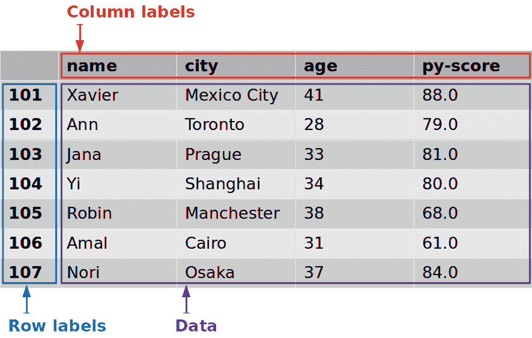
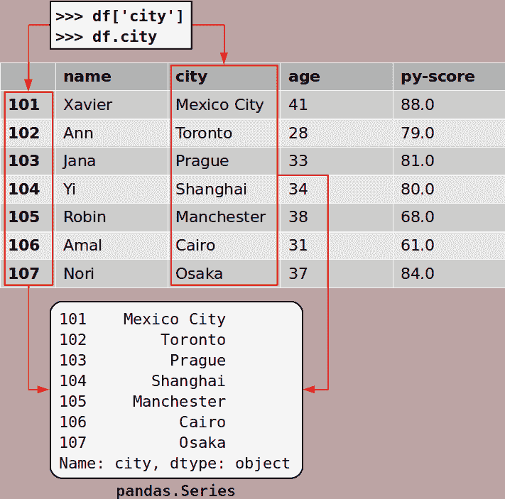
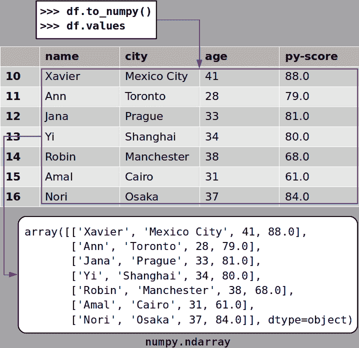
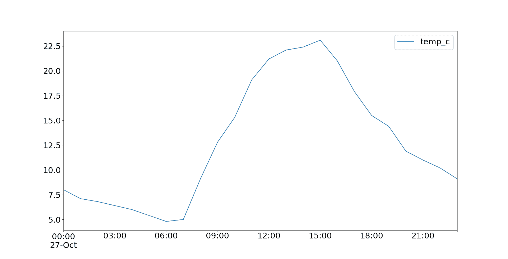
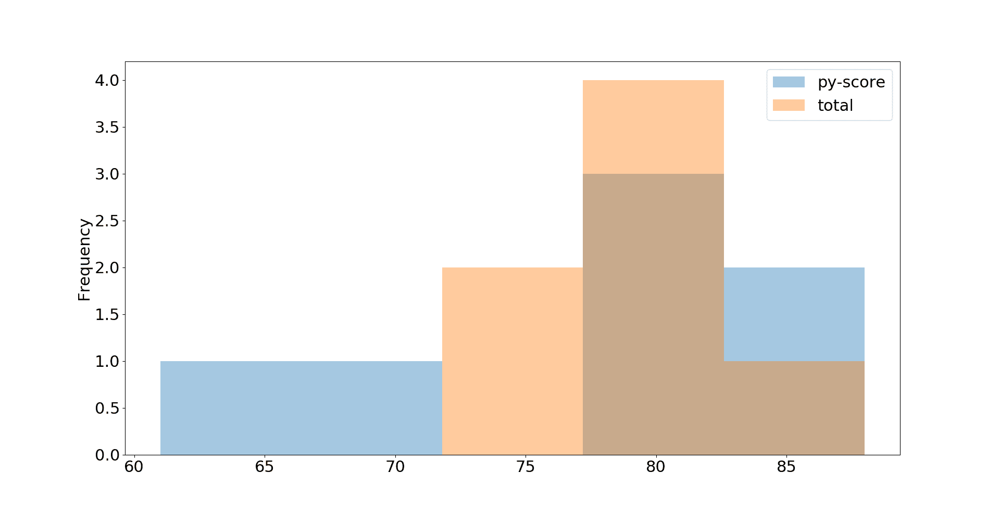

# 熊猫数据框架:让数据工作变得愉快

> 原文：<https://realpython.com/pandas-dataframe/>

*立即观看**本教程有真实 Python 团队创建的相关视频课程。与书面教程一起观看，加深您的理解: [**熊猫数据帧:高效处理数据**](/courses/pandas-dataframe-working-with-data/)*

 *[**熊猫数据帧**](https://pandas.pydata.org/pandas-docs/stable/reference/frame.html) 是一个[结构](https://pandas.pydata.org/pandas-docs/stable/getting_started/dsintro.html)，包含**二维数据**及其对应的**标签**。数据帧广泛应用于[数据科学](https://realpython.com/tutorials/data-science/)、[机器学习](https://realpython.com/tutorials/machine-learning/)、科学计算以及其他许多数据密集型领域。

数据帧类似于 [SQL 表](https://realpython.com/python-sql-libraries/)或您在 Excel 或 Calc 中使用的电子表格。在许多情况下，数据帧比表格或电子表格更快、更容易使用、更强大，因为它们是 [Python](https://www.python.org/about/) 和 [NumPy](https://numpy.org/#) 生态系统不可或缺的一部分。

在本教程中，您将学习:

*   什么是**熊猫数据框架**以及如何创建一个
*   如何**访问、修改、添加、排序、过滤和删除**数据
*   如何处理**缺失值**
*   如何处理**时序数据**
*   如何快速**可视化**数据

是时候开始使用熊猫数据框架了！

**免费奖励:** [掌握 Python 的 5 个想法](https://realpython.com/bonus/python-mastery-course/)，这是一个面向 Python 开发者的免费课程，向您展示将 Python 技能提升到下一个水平所需的路线图和心态。

## 介绍熊猫数据帧

熊猫数据帧是包含以下内容的数据结构:

*   **数据**组织成**二维**，行和列
*   **标签**对应于**行**和**列**

您可以通过[导入](https://realpython.com/courses/python-imports-101/) [熊猫](https://realpython.com/pandas-python-explore-dataset/)来开始处理数据帧:

>>>

```py
>>> import pandas as pd
```

现在您已经导入了熊猫，您可以使用数据框架了。

想象一下，你正在用熊猫来分析一个职位的候选人的数据，这个职位是用 Python 开发 [web 应用程序。假设你对候选人的姓名、城市、年龄和 Python 编程测试的分数感兴趣，或者:](https://realpython.com/tutorials/web-dev/)

|  | `name` | `city` | `age` | `py-score` |
| --- | --- | --- | --- | --- |
| **T2`101`** | `Xavier` | `Mexico City` | `41` | `88.0` |
| **T2`102`** | `Ann` | `Toronto` | `28` | `79.0` |
| **T2`103`** | `Jana` | `Prague` | `33` | `81.0` |
| **T2`104`** | `Yi` | `Shanghai` | `34` | `80.0` |
| **T2`105`** | `Robin` | `Manchester` | `38` | `68.0` |
| **T2`106`** | `Amal` | `Cairo` | `31` | `61.0` |
| **T2`107`** | `Nori` | `Osaka` | `37` | `84.0` |

在该表中，第一行包含**列标签** ( `name`、`city`、`age`和`py-score`)。第一列包含**行标签** ( `101`、`102`等等)。所有其他单元格用**数据值**填充。

现在，您已经拥有了创建熊猫数据框架所需的一切。

创建熊猫数据框架有几种方法。在大多数情况下，您将使用 [`DataFrame`构造函数](https://pandas.pydata.org/pandas-docs/stable/reference/api/pandas.DataFrame.html)并提供数据、标签和其他信息。您可以将数据作为二维的[列表、元组、](https://realpython.com/python-lists-tuples/)或 [NumPy 数组](https://realpython.com/numpy-array-programming/)来传递。您还可以将它作为一个[字典](https://realpython.com/python-dicts/)或 [Pandas `Series`](https://pandas.pydata.org/pandas-docs/stable/getting_started/dsintro.html#series) 实例传递，或者作为本教程中未涉及的其他几种数据类型之一传递。

对于这个例子，假设您正在使用一个[字典](https://docs.python.org/3/tutorial/datastructures.html#dictionaries)来传递数据:

>>>

```py
>>> data = {
...     'name': ['Xavier', 'Ann', 'Jana', 'Yi', 'Robin', 'Amal', 'Nori'],
...     'city': ['Mexico City', 'Toronto', 'Prague', 'Shanghai',
...              'Manchester', 'Cairo', 'Osaka'],
...     'age': [41, 28, 33, 34, 38, 31, 37],
...     'py-score': [88.0, 79.0, 81.0, 80.0, 68.0, 61.0, 84.0]
... }

>>> row_labels = [101, 102, 103, 104, 105, 106, 107]
```

`data`是一个 [Python 变量](https://realpython.com/python-variables/)，它引用保存候选数据的字典。它还包含列的标签:

*   `'name'`
*   `'city'`
*   `'age'`
*   `'py-score'`

最后，`row_labels`指的是包含行标签的列表，这些标签是从`101`到`107`的数字。

现在，您已经准备好创建熊猫数据框架了:

>>>

```py
>>> df = pd.DataFrame(data=data, index=row_labels)
>>> df
 name         city  age  py-score
101  Xavier  Mexico City   41      88.0
102     Ann      Toronto   28      79.0
103    Jana       Prague   33      81.0
104      Yi     Shanghai   34      80.0
105   Robin   Manchester   38      68.0
106    Amal        Cairo   31      61.0
107    Nori        Osaka   37      84.0
```

就是这样！`df`是一个变量，用于保存对熊猫数据帧的引用。这个 Pandas 数据框架看起来就像上面的候选表，具有以下特征:

*   **从`101`到`107`的行标签**
*   **列标签**，如`'name'`、`'city'`、`'age'`、`'py-score'`
*   **数据**，如考生姓名、城市、年龄和 Python 考试成绩

该图显示了来自`df`的标签和数据:

[](https://files.realpython.com/media/fig-1.d6e5d754edf5.png)

行标签用蓝色标出，而列标签用红色标出，数据值用紫色标出。

Pandas 数据帧有时会非常大，一次查看所有行是不切实际的。您可以使用 [`.head()`](https://pandas.pydata.org/pandas-docs/stable/reference/api/pandas.DataFrame.head.html) 显示前几项，使用 [`.tail()`](https://pandas.pydata.org/pandas-docs/stable/reference/api/pandas.Series.html) 显示后几项:

>>>

```py
>>> df.head(n=2)
 name         city  age  py-score
101  Xavier  Mexico City   41      88.0
102     Ann      Toronto   28      79.0

>>> df.tail(n=2)
 name   city  age  py-score
106  Amal  Cairo   31      61.0
107  Nori  Osaka   37      84.0
```

这就是如何显示熊猫数据帧的开始或结束。参数`n`指定要显示的行数。

注意:把 Pandas DataFrame 想象成一个列的字典，或者 Pandas 系列，有很多额外的特性。

您可以像从字典中获取值一样访问 Pandas 数据帧中的列:

>>>

```py
>>> cities = df['city']
>>> cities
101    Mexico City
102        Toronto
103         Prague
104       Shanghai
105     Manchester
106          Cairo
107          Osaka
Name: city, dtype: object
```

这是从熊猫数据框架中获取列的最方便的方法。

如果列名是一个有效的 [Python 标识符](https://docs.python.org/3/reference/lexical_analysis.html#identifiers)的字符串，那么您可以使用**点符号**来访问它。也就是说，您可以像获取类实例的[属性一样访问该列:](https://realpython.com/lessons/class-and-instance-attributes/)

>>>

```py
>>> df.city
101    Mexico City
102        Toronto
103         Prague
104       Shanghai
105     Manchester
106          Cairo
107          Osaka
Name: city, dtype: object
```

这就是你得到一个特定列的方法。您已经提取了与标签`'city'`相对应的列，其中包含了所有求职者的位置。

请注意，您已经提取了数据和相应的行标签，这一点很重要:

[](https://files.realpython.com/media/fig-2.2bee1e181467.png)

熊猫数据帧的每一列都是 [`pandas.Series`](https://pandas.pydata.org/pandas-docs/stable/reference/series.html) 的一个实例，这是一个保存一维数据及其标签的结构。您可以像使用字典一样获得一个`Series`对象的单个项目，方法是使用它的标签作为一个键:

>>>

```py
>>> cities[102]
'Toronto'
```

在这种情况下，`'Toronto'`是数据值，`102`是相应的标签。正如你将在[后面的章节](#accessing-and-modifying-data)中看到的，还有其他方法可以在熊猫数据帧中获得特定的项目。

你也可以用[访问器](https://realpython.com/lessons/take-advantage-accessor-methods/) [`.loc[]`](https://pandas.pydata.org/pandas-docs/stable/reference/api/pandas.DataFrame.loc.html) 访问一整行:

>>>

```py
>>> df.loc[103]
name          Jana
city        Prague
age             33
py-score        81
Name: 103, dtype: object
```

这一次，您已经提取了对应于标签`103`的行，其中包含名为`Jana`的候选人的数据。除了该行中的数据值，您还提取了相应列的标签:

[](https://files.realpython.com/media/fig-3.2e2d5c452c23.png)

返回的行也是`pandas.Series`的实例。

[*Remove ads*](/account/join/)

## *创建熊猫数据框架*

 *如前所述，创建熊猫数据框有几种方法。在本节中，您将学习如何使用`DataFrame`构造函数以及:

*   Python 词典
*   Python 列表
*   二维 NumPy 阵列
*   文件

还有其他方法，你可以在[官方文档](https://pandas.pydata.org/pandas-docs/stable/getting_started/dsintro.html#dataframe)中了解到。

您可以从导入熊猫和 [NumPy](https://numpy.org/devdocs/) 开始，您将在下面的例子中使用它们:

>>>

```py
>>> import numpy as np
>>> import pandas as pd
```

就是这样。现在，您已经准备好创建一些数据框架了。

### 用字典创建熊猫数据框架

正如您已经看到的，您可以使用 Python 字典创建熊猫数据帧:

>>>

```py
>>> d = {'x': [1, 2, 3], 'y': np.array([2, 4, 8]), 'z': 100}

>>> pd.DataFrame(d)
 x  y    z
0  1  2  100
1  2  4  100
2  3  8  100
```

字典的关键字是数据帧的列标签，字典值是相应数据帧列中的数据值。这些值可以包含在一个[元组](https://docs.python.org/3/tutorial/datastructures.html#tuples-and-sequences)、[列表](https://docs.python.org/3/tutorial/datastructures.html#more-on-lists)、一维 [NumPy 数组](https://docs.scipy.org/doc/numpy/reference/generated/numpy.ndarray.html)、 [Pandas `Series`对象](https://pandas.pydata.org/pandas-docs/stable/reference/series.html)或其他几种数据类型之一中。您还可以提供一个值，该值将沿整列复制。

可以用参数`columns`控制列的顺序，用参数`index`控制行标签的顺序:

>>>

```py
>>> pd.DataFrame(d, index=[100, 200, 300], columns=['z', 'y', 'x'])
 z  y  x
100  100  2  1
200  100  4  2
300  100  8  3
```

如您所见，您已经指定了行标签`100`、`200`和`300`。您还强制了列的顺序:`z`、`y`、`x`。

### 用列表创建熊猫数据框架

创建熊猫数据框架的另一种方法是使用字典列表:

>>>

```py
>>> l = [{'x': 1, 'y': 2, 'z': 100},
...      {'x': 2, 'y': 4, 'z': 100},
...      {'x': 3, 'y': 8, 'z': 100}]

>>> pd.DataFrame(l)
 x  y    z
0  1  2  100
1  2  4  100
2  3  8  100
```

同样，字典键是列标签，字典值是数据帧中的数据值。

你也可以使用一个**嵌套的**列表，或者一个列表列表，作为数据值。如果这样做，那么在创建数据帧时，明智的做法是显式指定列和/或行的标签:

>>>

```py
>>> l = [[1, 2, 100],
...      [2, 4, 100],
...      [3, 8, 100]]

>>> pd.DataFrame(l, columns=['x', 'y', 'z'])
 x  y    z
0  1  2  100
1  2  4  100
2  3  8  100
```

这就是如何使用嵌套列表创建熊猫数据框架。也可以用同样的方式使用元组列表。为此，只需用元组替换上例中的嵌套列表。

[*Remove ads*](/account/join/)

### *用 NumPy 数组创建熊猫数据帧*

 *您可以像处理列表一样将二维 NumPy 数组传递给`DataFrame`构造函数:

>>>

```py
>>> arr = np.array([[1, 2, 100],
...                 [2, 4, 100],
...                 [3, 8, 100]])

>>> df_ = pd.DataFrame(arr, columns=['x', 'y', 'z'])
>>> df_
 x  y    z
0  1  2  100
1  2  4  100
2  3  8  100
```

尽管这个例子看起来与上面的嵌套列表实现几乎一样，但是它有一个优点:您可以指定可选参数`copy`。

当`copy`设置为`False`(默认设置)时，NumPy 数组中的数据不会被复制。这意味着数组中的原始数据被分配给 Pandas 数据帧。如果您修改阵列，那么您的数据帧也会改变:

>>>

```py
>>> arr[0, 0] = 1000

>>> df_
 x  y    z
0  1000  2  100
1     2  4  100
2     3  8  100
```

如你所见，当你改变`arr`的第一项时，你也修改了`df_`。

**注意:**在处理大型数据集时，不复制数据值可以节省大量时间和处理能力。

如果这种行为不是您想要的，那么您应该在`DataFrame`构造函数中指定`copy=True`。这样，`df_`将被创建为来自`arr`的值的副本，而不是实际的值。

### 从文件创建熊猫数据帧

您可以[将数据和标签](https://realpython.com/pandas-read-write-files/)从 Pandas DataFrame 保存和加载到多种文件类型，包括 CSV、Excel、SQL、JSON 等等。这是一个非常强大的功能。

您可以使用 [`.to_csv()`](https://pandas.pydata.org/pandas-docs/stable/reference/api/pandas.DataFrame.to_csv.html) 将您的求职者数据框架保存到 [CSV 文件](https://realpython.com/python-csv/):

>>>

```py
>>> df.to_csv('data.csv')
```

上面的语句将在您的工作目录中生成一个名为`data.csv`的 [CSV 文件](https://en.wikipedia.org/wiki/Comma-separated_values):

```py
,name,city,age,py-score
101,Xavier,Mexico City,41,88.0
102,Ann,Toronto,28,79.0
103,Jana,Prague,33,81.0
104,Yi,Shanghai,34,80.0
105,Robin,Manchester,38,68.0
106,Amal,Cairo,31,61.0
107,Nori,Osaka,37,84.0
```

现在你已经有了一个包含数据的 CSV 文件，你可以用 [`read_csv()`](https://pandas.pydata.org/pandas-docs/stable/reference/api/pandas.read_csv.html) 加载它:

>>>

```py
>>> pd.read_csv('data.csv', index_col=0)
 name         city  age  py-score
101  Xavier  Mexico City   41      88.0
102     Ann      Toronto   28      79.0
103    Jana       Prague   33      81.0
104      Yi     Shanghai   34      80.0
105   Robin   Manchester   38      68.0
106    Amal        Cairo   31      61.0
107    Nori        Osaka   37      84.0
```

这就是如何从文件中获取熊猫数据帧的方法。在这种情况下，`index_col=0`指定行标签位于 CSV 文件的第一列。

## 检索标签和数据

既然已经创建了数据框架，就可以开始从中检索信息了。使用 Pandas，您可以执行以下操作:

*   以序列形式检索和修改行和列标签
*   将数据表示为 NumPy 数组
*   检查并调整[数据类型](https://docs.scipy.org/doc/numpy/reference/arrays.dtypes.html)
*   分析`DataFrame`物体的大小

[*Remove ads*](/account/join/)

### *作为序列的熊猫数据帧标签*

 *可以用 [`.index`](https://pandas.pydata.org/pandas-docs/stable/reference/api/pandas.Index.html) 得到数据帧的行标签，用 [`.columns`](https://pandas.pydata.org/pandas-docs/stable/reference/api/pandas.DataFrame.columns.html) 得到数据帧的列标签:

>>>

```py
>>> df.index
Int64Index([1, 2, 3, 4, 5, 6, 7], dtype='int64')

>>> df.columns
Index(['name', 'city', 'age', 'py-score'], dtype='object')
```

现在，行和列标签作为特殊类型的序列。与处理任何其他 Python 序列一样，您可以获得单个项目:

>>>

```py
>>> df.columns[1]
'city'
```

除了提取特定的项，您还可以应用其他序列操作，包括遍历行或列的标签。然而，这很少是必要的，因为 Pandas 提供了其他方法来迭代数据帧，这将在后面的章节中看到。

您也可以使用这种方法来修改标签:

>>>

```py
>>> df.index = np.arange(10, 17)

>>> df.index
Int64Index([10, 11, 12, 13, 14, 15, 16], dtype='int64')

>>> df
 name         city  age  py-score
10  Xavier  Mexico City   41      88.0
11     Ann      Toronto   28      79.0
12    Jana       Prague   33      81.0
13      Yi     Shanghai   34      80.0
14   Robin   Manchester   38      68.0
15    Amal        Cairo   31      61.0
16    Nori        Osaka   37      84.0
```

在本例中，您使用 [`numpy.arange()`](https://docs.scipy.org/doc/numpy/reference/generated/numpy.arange.html) 来生成一个新的行标签序列，其中包含从`10`到`16`的整数。要了解更多关于`arange()`的内容，请查看 [NumPy arange():如何使用 np.arange()](https://realpython.com/how-to-use-numpy-arange/) 。

请记住，如果你试图修改`.index`或`.columns`的某一项，那么你将得到一个 [`TypeError`](https://docs.python.org/3/library/exceptions.html#TypeError) 。

### 作为 NumPy 数组的数据

有时，您可能想从没有标签的熊猫数据帧中提取数据。要获得带有未标记数据的 NumPy 数组，可以使用 [`.to_numpy()`](https://pandas.pydata.org/pandas-docs/stable/reference/api/pandas.DataFrame.to_numpy.html) 或 [`.values`](https://pandas.pydata.org/pandas-docs/stable/reference/api/pandas.DataFrame.values.html) :

>>>

```py
>>> df.to_numpy()
array([['Xavier', 'Mexico City', 41, 88.0],
 ['Ann', 'Toronto', 28, 79.0],
 ['Jana', 'Prague', 33, 81.0],
 ['Yi', 'Shanghai', 34, 80.0],
 ['Robin', 'Manchester', 38, 68.0],
 ['Amal', 'Cairo', 31, 61.0],
 ['Nori', 'Osaka', 37, 84.0]], dtype=object)
```

`.to_numpy()`和`.values`的工作方式类似，它们都返回一个 NumPy 数组，其中包含来自 Pandas DataFrame 的数据:

[](https://files.realpython.com/media/fig-4.a19aadbe0f10.png)

Pandas 文档建议使用`.to_numpy()`,因为两个可选参数提供了灵活性:

1.  **`dtype` :** 使用该参数指定结果数组的数据类型。默认设置为`None`。
2.  **`copy` :** 如果想使用数据帧中的原始数据，将该参数设置为`False`。如果你想复制数据，将其设置为`True`。

不过`.values`比`.to_numpy()`存在的时间要长得多，后者是在熊猫 0.24.0 版本中引入的。这意味着你可能会更频繁地看到`.values`，尤其是在旧代码中。

### 数据类型

数据值的**类型，也称为**数据类型**或**数据类型**，非常重要，因为它们决定了数据帧使用的内存量，以及它的计算速度和精度水平。**

Pandas 非常依赖于 NumPy 数据类型。然而，熊猫 1.0 引入了一些额外的类型:

*   **[`BooleanDtype`](https://pandas.pydata.org/docs/reference/api/pandas.BooleanDtype.html#pandas.BooleanDtype)****[`BooleanArray`](https://pandas.pydata.org/docs/reference/api/pandas.arrays.BooleanArray.html#pandas.arrays.BooleanArray)**支持缺失布尔值和[克莱尼三值逻辑](https://pandas.pydata.org/docs/user_guide/boolean.html#kleene-logical-operations)。
*   **[`StringDtype`](https://pandas.pydata.org/docs/reference/api/pandas.StringDtype.html#pandas.StringDtype)** 和 **[`StringArray`](https://pandas.pydata.org/pandas-docs/stable/reference/api/pandas.arrays.StringArray.html)** 代表一个专用的字符串类型。

用 [`.dtypes`](https://pandas.pydata.org/pandas-docs/stable/reference/api/pandas.DataFrame.dtypes.html#pandas.DataFrame.dtypes) 可以得到熊猫数据帧每一列的数据类型:

>>>

```py
>>> df.dtypes
name         object
city         object
age           int64
py-score    float64
dtype: object
```

如您所见，`.dtypes`返回一个`Series`对象，以列名作为标签，以相应的数据类型作为值。

如果要修改一列或多列的数据类型，那么可以使用 [`.astype()`](https://pandas.pydata.org/pandas-docs/stable/reference/api/pandas.DataFrame.astype.html) :

>>>

```py
>>> df_ = df.astype(dtype={'age': np.int32, 'py-score': np.float32})
>>> df_.dtypes
name         object
city         object
age           int32
py-score    float32
dtype: object
```

`.astype()`最重要也是唯一强制的参数是`dtype`。它需要数据类型或字典。如果传递一个字典，那么键就是列名，值就是所需的相应数据类型。

如您所见，数据帧`df`中的列`age`和`py-score`的数据类型都是`int64`，表示 64 位(或 8 字节)整数。然而，`df_`也提供了一种更小的 32 位(4 字节)整数数据类型，称为`int32`。

[*Remove ads*](/account/join/)

### *熊猫数据帧大小*

 *属性 [`.ndim`](https://pandas.pydata.org/pandas-docs/stable/reference/api/pandas.DataFrame.ndim.html) 、 [`.size`](https://pandas.pydata.org/pandas-docs/stable/reference/api/pandas.DataFrame.size.html) 、 [`.shape`](https://pandas.pydata.org/pandas-docs/stable/reference/api/pandas.DataFrame.shape.html) 分别返回维度数、跨每个维度的数据值数以及数据值总数:

>>>

```py
>>> df_.ndim
2

>>> df_.shape
(7, 4)

>>> df_.size
28
```

`DataFrame`实例有两个维度(行和列)，所以`.ndim`返回`2`。另一方面，`Series`对象只有一个维度，所以在这种情况下，`.ndim`将返回`1`。

`.shape`属性返回一个包含行数(在本例中为`7`)和列数(`4`)的元组。最后，`.size`返回一个等于 DataFrame 中值的个数的整数(`28`)。

你甚至可以用 [`.memory_usage()`](https://pandas.pydata.org/pandas-docs/stable/reference/api/pandas.DataFrame.memory_usage.html) 检查每一列使用的内存量:

>>>

```py
>>> df_.memory_usage()
Index       56
name        56
city        56
age         28
py-score    28
dtype: int64
```

如您所见，`.memory_usage()`返回一个以列名作为标签、以字节为单位的内存使用量作为数据值的序列。如果您想排除保存行标签的列的内存使用，那么传递可选参数`index=False`。

在上面的例子中，最后两列`age`和`py-score`各使用 28 字节的内存。这是因为这些列有七个值，每个值都是一个 32 位或 4 字节的整数。7 个整数乘以 4 个字节各等于 28 个字节的内存使用量。

## 访问和修改数据

您已经学习了如何将 Pandas 数据帧的特定行或列作为`Series`对象:

>>>

```py
>>> df['name']
10    Xavier
11       Ann
12      Jana
13        Yi
14     Robin
15      Amal
16      Nori
Name: name, dtype: object

>>> df.loc[10]
name             Xavier
city        Mexico City
age                  41
py-score             88
Name: 10, dtype: object
```

在第一个例子中，通过使用标签作为键，像访问字典中的元素一样访问列`name`。如果列标签是有效的 Python 标识符，那么您也可以使用点符号来访问该列。在第二个例子中，您使用 [`.loc[]`](https://pandas.pydata.org/pandas-docs/stable/reference/api/pandas.DataFrame.loc.html) 来获取标签为`10`的行。

### 用存取器获取数据

除了可以通过标签获取行或列的访问器`.loc[]`之外，Pandas 还提供了访问器 [`.iloc[]`](https://pandas.pydata.org/pandas-docs/stable/reference/api/pandas.DataFrame.iloc.html) ，可以通过整数索引来检索行或列。在大多数情况下，您可以使用这两种方法中的任何一种:

>>>

```py
>>> df.loc[10]
name             Xavier
city        Mexico City
age                  41
py-score             88
Name: 10, dtype: object

>>> df.iloc[0]
name             Xavier
city        Mexico City
age                  41
py-score             88
Name: 10, dtype: object
```

`df.loc[10]`返回带有标签`10`的行。类似地，`df.iloc[0]`返回具有从零开始的索引`0`的行，这是第一行。正如您所看到的，两条语句都返回相同的行作为一个`Series`对象。

熊猫总共有四个访问者:

1.  **[`.loc[]`](https://pandas.pydata.org/pandas-docs/stable/reference/api/pandas.DataFrame.loc.html)** 接受行和列的标签并返回系列或数据帧。您可以使用它来获取整行或整列，以及它们的各个部分。

2.  **[`.iloc[]`](https://pandas.pydata.org/pandas-docs/stable/reference/api/pandas.DataFrame.iloc.html)** 接受行和列的从零开始的索引，并返回系列或数据帧。您可以使用它来获取整行或整列，或者它们的一部分。

3.  **[`.at[]`](https://pandas.pydata.org/pandas-docs/version/0.25/reference/api/pandas.DataFrame.at.html)** 接受行和列的标签并返回单个数据值。

4.  **[`.iat[]`](https://pandas.pydata.org/pandas-docs/stable/reference/api/pandas.DataFrame.iat.html)** 接受行和列的从零开始的索引，并返回单个数据值。

其中，`.loc[]`和`.iloc[]`特别厉害。它们支持[切片](https://realpython.com/lessons/indexing-and-slicing/)和 [NumPy 式索引](https://docs.scipy.org/doc/numpy/user/basics.indexing.html)。您可以使用它们来访问列:

>>>

```py
>>> df.loc[:, 'city']
10    Mexico City
11        Toronto
12         Prague
13       Shanghai
14     Manchester
15          Cairo
16          Osaka
Name: city, dtype: object

>>> df.iloc[:, 1]
10    Mexico City
11        Toronto
12         Prague
13       Shanghai
14     Manchester
15          Cairo
16          Osaka
Name: city, dtype: object
```

`df.loc[:, 'city']`返回列`city`。行标签 place 中的 [slice](https://docs.python.org/dev/library/functions.html#slice) 构造(`:`)意味着应该包含所有的行。`df.iloc[:, 1]`返回同一列，因为从零开始的索引`1`引用第二列`city`。

就像使用 NumPy 一样，您可以提供切片以及列表或数组，而不是索引来获得多行或多列:

>>>

```py
>>> df.loc[11:15, ['name', 'city']]
 name        city
11    Ann     Toronto
12   Jana      Prague
13     Yi    Shanghai
14  Robin  Manchester
15   Amal       Cairo

>>> df.iloc[1:6, [0, 1]]
 name        city
11    Ann     Toronto
12   Jana      Prague
13     Yi    Shanghai
14  Robin  Manchester
15   Amal       Cairo
```

**注意:**不要用元组代替列表或整数数组来获取普通的行或列。元组被保留用于在 NumPy 和 Pandas[中表示多维度，以及在 Pandas](https://docs.scipy.org/doc/numpy/user/basics.indexing.html#dealing-with-variable-numbers-of-indices-within-programs) 中的[分级或多级索引。](https://pandas.pydata.org/pandas-docs/stable/user_guide/advanced.html)

在本例中，您使用:

*   **切片**得到标签为`11`到`15`的行，相当于索引`1`到`5`
*   **列出**得到列`name`和`city`，相当于索引`0`和`1`

两条语句都返回一个 Pandas 数据帧，该数据帧具有所需的五行和两列的交集。

这就引出了`.loc[]`和`.iloc[]`之间一个非常重要的区别。正如您在前面的例子中看到的，当您将行标签`11:15`传递给`.loc[]`时，您得到了从`11`到`15`的行。然而，当您传递行索引`1:6`到`.iloc[]`时，您只获得索引为`1`到`5`的行。

只获得索引`1`到`5`的原因是，对于`.iloc[]`，切片的**停止索引**是**独占的**，这意味着它被排除在返回值之外。这与 [Python 序列](https://docs.python.org/3/library/stdtypes.html#typesseq)和 NumPy 数组一致。然而，使用`.loc[]`，开始和停止索引都包含在**和**中，这意味着它们包含在返回值中。

使用`.iloc[]`可以跳过行和列，就像对元组、列表和 NumPy 数组进行切片一样:

>>>

```py
>>> df.iloc[1:6:2, 0]
11     Ann
13      Yi
15    Amal
Name: name, dtype: object
```

在本例中，您用片`1:6:2`指定所需的行索引。这意味着从索引为`1`的行(第二行)开始，在索引为`6`的行(第七行)之前停止，然后每隔一行跳过一行。

除了使用切片构造，您还可以使用内置的 Python 类 [`slice()`](https://docs.python.org/3/library/functions.html#slice) ，以及 [`numpy.s_[]`](https://docs.scipy.org/doc/numpy/reference/generated/numpy.s_.html) 或 [`pd.IndexSlice[]`](https://pandas.pydata.org/pandas-docs/stable/reference/api/pandas.IndexSlice.html) :

>>>

```py
>>> df.iloc[slice(1, 6, 2), 0]
11     Ann
13      Yi
15    Amal
Name: name, dtype: object

>>> df.iloc[np.s_[1:6:2], 0]
11     Ann
13      Yi
15    Amal
Name: name, dtype: object

>>> df.iloc[pd.IndexSlice[1:6:2], 0]
11     Ann
13      Yi
15    Amal
Name: name, dtype: object
```

根据您的情况，您可能会发现其中一种方法比其他方法更方便。

可以使用`.loc[]`和`.iloc[]`来获得特定的数据值。然而，当您只需要一个值时，Pandas 推荐使用专门的访问器`.at[]`和`.iat[]`:

>>>

```py
>>> df.at[12, 'name']
'Jana'

>>> df.iat[2, 0]
'Jana'
```

在这里，您使用了`.at[]`来获得一个候选人的名字，该候选人使用了相应的列和行标签。您还使用了`.iat[]`来使用它的列和行索引检索相同的名称。

[*Remove ads*](/account/join/)

### *用存取器设置数据*

 *您可以使用访问器通过传递 Python 序列、NumPy 数组或单个值来修改 Pandas 数据帧的各个部分:

>>>

```py
>>> df.loc[:, 'py-score']
10    88.0
11    79.0
12    81.0
13    80.0
14    68.0
15    61.0
16    84.0
Name: py-score, dtype: float64

>>> df.loc[:13, 'py-score'] = [40, 50, 60, 70]
>>> df.loc[14:, 'py-score'] = 0

>>> df['py-score']
10    40.0
11    50.0
12    60.0
13    70.0
14     0.0
15     0.0
16     0.0
Name: py-score, dtype: float64
```

语句`df.loc[:13, 'py-score'] = [40, 50, 60, 70]`使用您提供的列表中的值修改列`py-score`中的前四项(行`10`到`13`)。使用`df.loc[14:, 'py-score'] = 0`将该列中的剩余值设置为`0`。

以下示例显示了您可以使用负索引和`.iloc[]`来访问或修改数据:

>>>

```py
>>> df.iloc[:, -1] = np.array([88.0, 79.0, 81.0, 80.0, 68.0, 61.0, 84.0])

>>> df['py-score']
10    88.0
11    79.0
12    81.0
13    80.0
14    68.0
15    61.0
16    84.0
Name: py-score, dtype: float64
```

在本例中，您已经访问并修改了最后一列(`'py-score'`)，它对应于整数列索引`-1`。这种行为与 Python 序列和 NumPy 数组是一致的。

## 插入和删除数据

Pandas 提供了几种方便的插入和删除行或列的技术。你可以根据自己的情况和需求来选择。

### 插入和删除行

假设您想在求职者列表中添加一个新人。你可以通过[创建一个新的`Series`对象](https://pandas.pydata.org/pandas-docs/stable/reference/api/pandas.Series.html)来代表这个新的候选对象:

>>>

```py
>>> john = pd.Series(data=['John', 'Boston', 34, 79],
...                  index=df.columns, name=17)
>>> john
name          John
city        Boston
age             34
py-score        79
Name: 17, dtype: object

>>> john.name
17
```

新对象的标签对应于来自`df`的列标签。所以才需要`index=df.columns`。

您可以用 [`.append()`](https://pandas.pydata.org/pandas-docs/stable/reference/api/pandas.DataFrame.append.html) 将`john`作为新的一行添加到`df`的末尾:

>>>

```py
>>> df = df.append(john)
>>> df
 name         city  age  py-score
10  Xavier  Mexico City   41      88.0
11     Ann      Toronto   28      79.0
12    Jana       Prague   33      81.0
13      Yi     Shanghai   34      80.0
14   Robin   Manchester   38      68.0
15    Amal        Cairo   31      61.0
16    Nori        Osaka   37      84.0
17    John       Boston   34      79.0
```

这里，`.append()`返回附加了新行的熊猫数据帧。注意 Pandas 如何使用属性`john.name`，即值`17`，来指定新行的标签。

您已经通过对`.append()`的一次调用附加了一个新行，并且您可以通过对 [`.drop()`](https://pandas.pydata.org/pandas-docs/stable/reference/api/pandas.DataFrame.drop.html) 的一次调用删除它:

>>>

```py
>>> df = df.drop(labels=[17])
>>> df
 name         city  age  py-score
10  Xavier  Mexico City   41      88.0
11     Ann      Toronto   28      79.0
12    Jana       Prague   33      81.0
13      Yi     Shanghai   34      80.0
14   Robin   Manchester   38      68.0
15    Amal        Cairo   31      61.0
16    Nori        Osaka   37      84.0
```

这里，`.drop()`删除由参数`labels`指定的行。默认情况下，它返回删除了指定行的 Pandas 数据帧。如果您通过了`inplace=True`，那么原始数据帧将被修改，您将得到 [`None`](https://realpython.com/null-in-python/) 作为返回值。

### 插入和删除列

在 Pandas 数据帧中插入一列的最直接的方法是遵循当您[向字典](https://realpython.com/python-dicts/#building-a-dictionary-incrementally)添加一个条目时所使用的相同过程。下面是如何在一个 [JavaScript](https://realpython.com/python-vs-javascript/) 测试中添加包含候选人分数的列:

>>>

```py
>>> df['js-score'] = np.array([71.0, 95.0, 88.0, 79.0, 91.0, 91.0, 80.0])
>>> df
 name         city  age  py-score  js-score
10  Xavier  Mexico City   41      88.0      71.0
11     Ann      Toronto   28      79.0      95.0
12    Jana       Prague   33      81.0      88.0
13      Yi     Shanghai   34      80.0      79.0
14   Robin   Manchester   38      68.0      91.0
15    Amal        Cairo   31      61.0      91.0
16    Nori        Osaka   37      84.0      80.0
```

现在原始数据帧的末尾多了一列`js-score`。

您不必提供完整的值序列。您可以添加具有单个值的新列:

>>>

```py
>>> df['total-score'] = 0.0
>>> df
 name         city  age  py-score  js-score  total-score
10  Xavier  Mexico City   41      88.0      71.0          0.0
11     Ann      Toronto   28      79.0      95.0          0.0
12    Jana       Prague   33      81.0      88.0          0.0
13      Yi     Shanghai   34      80.0      79.0          0.0
14   Robin   Manchester   38      68.0      91.0          0.0
15    Amal        Cairo   31      61.0      91.0          0.0
16    Nori        Osaka   37      84.0      80.0          0.0
```

数据帧`df`现在有一个用零填充的附加列。

如果您过去使用过字典，那么这种插入列的方式可能对您来说很熟悉。但是，它不允许您指定新列的位置。如果新列的位置很重要，那么可以用 [`.insert()`](https://pandas.pydata.org/pandas-docs/stable/reference/api/pandas.DataFrame.insert.html) 来代替:

>>>

```py
>>> df.insert(loc=4, column='django-score',
...           value=np.array([86.0, 81.0, 78.0, 88.0, 74.0, 70.0, 81.0]))
>>> df
 name         city  age  py-score  django-score  js-score  total-score
10  Xavier  Mexico City   41      88.0          86.0      71.0          0.0
11     Ann      Toronto   28      79.0          81.0      95.0          0.0
12    Jana       Prague   33      81.0          78.0      88.0          0.0
13      Yi     Shanghai   34      80.0          88.0      79.0          0.0
14   Robin   Manchester   38      68.0          74.0      91.0          0.0
15    Amal        Cairo   31      61.0          70.0      91.0          0.0
16    Nori        Osaka   37      84.0          81.0      80.0          0.0
```

您刚刚插入了另一列，其中包含了 [Django](https://realpython.com/tutorials/django/) 测试的分数。参数`loc`确定 Pandas 数据帧中新列的位置，或从零开始的索引。`column`设置新列的标签，`value`指定要插入的数据值。

通过使用 [`del`语句](https://docs.python.org/3/tutorial/datastructures.html#the-del-statement)，可以从 Pandas 数据帧中删除一列或多列，就像使用常规 Python 字典一样:

>>>

```py
>>> del df['total-score']
>>> df
 name         city  age  py-score  django-score  js-score
10  Xavier  Mexico City   41      88.0          86.0      71.0
11     Ann      Toronto   28      79.0          81.0      95.0
12    Jana       Prague   33      81.0          78.0      88.0
13      Yi     Shanghai   34      80.0          88.0      79.0
14   Robin   Manchester   38      68.0          74.0      91.0
15    Amal        Cairo   31      61.0          70.0      91.0
16    Nori        Osaka   37      84.0          81.0      80.0
```

现在你有了没有列`total-score`的`df`。与字典的另一个相似之处是能够使用 [`.pop()`](https://pandas.pydata.org/pandas-docs/stable/reference/api/pandas.DataFrame.pop.html) ，删除指定的列并返回它。这意味着你可以做类似于`df.pop('total-score')`的事情，而不是使用`del`。

您也可以像之前对行所做的那样，用`.drop()`删除一个或多个列。同样，您需要用`labels`指定所需列的标签。另外，当你想删除列时，你需要提供参数`axis=1`:

>>>

```py
>>> df = df.drop(labels='age', axis=1)
>>> df
 name         city  py-score  django-score  js-score
10  Xavier  Mexico City      88.0          86.0      71.0
11     Ann      Toronto      79.0          81.0      95.0
12    Jana       Prague      81.0          78.0      88.0
13      Yi     Shanghai      80.0          88.0      79.0
14   Robin   Manchester      68.0          74.0      91.0
15    Amal        Cairo      61.0          70.0      91.0
16    Nori        Osaka      84.0          81.0      80.0
```

您已经从数据框架中删除了列`age`。

默认情况下，`.drop()`返回没有指定列的数据帧，除非您通过了`inplace=True`。

[*Remove ads*](/account/join/)

## *应用算术运算*

 *您可以对熊猫`Series`和`DataFrame`对象[应用基本的算术运算，例如加、减、乘、除，就像您对 NumPy 数组](https://docs.scipy.org/doc/numpy/user/quickstart.html#basic-operations)所做的一样:

>>>

```py
>>> df['py-score'] + df['js-score']
10    159.0
11    174.0
12    169.0
13    159.0
14    159.0
15    152.0
16    164.0
dtype: float64

>>> df['py-score'] / 100
10    0.88
11    0.79
12    0.81
13    0.80
14    0.68
15    0.61
16    0.84
Name: py-score, dtype: float64
```

您可以使用这种技术向 Pandas 数据框架中插入一个新列。例如，尝试将`total`分数计算为候选人的 Python、Django 和 JavaScript 分数的[线性组合](https://en.wikipedia.org/wiki/Linear_combination):

>>>

```py
>>> df['total'] =\
...     0.4 * df['py-score'] + 0.3 * df['django-score'] + 0.3 * df['js-score']
>>> df
 name         city  py-score  django-score  js-score  total
10  Xavier  Mexico City      88.0          86.0      71.0   82.3
11     Ann      Toronto      79.0          81.0      95.0   84.4
12    Jana       Prague      81.0          78.0      88.0   82.2
13      Yi     Shanghai      80.0          88.0      79.0   82.1
14   Robin   Manchester      68.0          74.0      91.0   76.7
15    Amal        Cairo      61.0          70.0      91.0   72.7
16    Nori        Osaka      84.0          81.0      80.0   81.9
```

现在，您的数据框架中有一列是根据您的考生个人考试成绩计算的`total`分数。更棒的是，你只用一句话就做到了！

## 应用 NumPy 和 SciPy 函数

大多数 NumPy 和 [SciPy](https://realpython.com/python-scipy-cluster-optimize/) 例程可以作为参数而不是 NumPy 数组应用于 Pandas `Series`或`DataFrame`对象。为了说明这一点，您可以使用 NumPy 例程 [`numpy.average()`](https://docs.scipy.org/doc/numpy/reference/generated/numpy.average.html) 计算考生的总成绩。

您将传递您的熊猫数据帧的一部分，而不是传递一个 NumPy 数组给`numpy.average()`:

>>>

```py
>>> import numpy as np

>>> score = df.iloc[:, 2:5]
>>> score
 py-score  django-score  js-score
10      88.0          86.0      71.0
11      79.0          81.0      95.0
12      81.0          78.0      88.0
13      80.0          88.0      79.0
14      68.0          74.0      91.0
15      61.0          70.0      91.0
16      84.0          81.0      80.0

>>> np.average(score, axis=1,
...            weights=[0.4, 0.3, 0.3])
array([82.3, 84.4, 82.2, 82.1, 76.7, 72.7, 81.9])
```

变量`score`现在指的是带有 Python、Django 和 JavaScript 分数的数据帧。您可以使用`score`作为`numpy.average()`的参数，并获得具有指定权重的列的线性组合。

但这还不是全部！可以使用`average()`返回的 NumPy 数组作为`df`的新列。首先，从`df`中删除现有的列`total`，然后使用`average()`添加新列:

>>>

```py
>>> del df['total']
>>> df
 name         city  py-score  django-score  js-score
10  Xavier  Mexico City      88.0          86.0      71.0
11     Ann      Toronto      79.0          81.0      95.0
12    Jana       Prague      81.0          78.0      88.0
13      Yi     Shanghai      80.0          88.0      79.0
14   Robin   Manchester      68.0          74.0      91.0
15    Amal        Cairo      61.0          70.0      91.0
16    Nori        Osaka      84.0          81.0      80.0

>>> df['total'] = np.average(df.iloc[:, 2:5], axis=1,
...                          weights=[0.4, 0.3, 0.3])
>>> df
 name         city  py-score  django-score  js-score  total
10  Xavier  Mexico City      88.0          86.0      71.0   82.3
11     Ann      Toronto      79.0          81.0      95.0   84.4
12    Jana       Prague      81.0          78.0      88.0   82.2
13      Yi     Shanghai      80.0          88.0      79.0   82.1
14   Robin   Manchester      68.0          74.0      91.0   76.7
15    Amal        Cairo      61.0          70.0      91.0   72.7
16    Nori        Osaka      84.0          81.0      80.0   81.9
```

结果与上一个示例相同，但是这里使用了现有的 NumPy 函数，而不是编写自己的代码。

## 排序熊猫数据帧

可以用 [`.sort_values()`](https://pandas.pydata.org/pandas-docs/stable/reference/api/pandas.DataFrame.sort_values.html) 对熊猫数据帧进行排序:

>>>

```py
>>> df.sort_values(by='js-score', ascending=False)
 name         city  py-score  django-score  js-score  total
11     Ann      Toronto      79.0          81.0      95.0   84.4
14   Robin   Manchester      68.0          74.0      91.0   76.7
15    Amal        Cairo      61.0          70.0      91.0   72.7
12    Jana       Prague      81.0          78.0      88.0   82.2
16    Nori        Osaka      84.0          81.0      80.0   81.9
13      Yi     Shanghai      80.0          88.0      79.0   82.1
10  Xavier  Mexico City      88.0          86.0      71.0   82.3
```

此示例根据列`js-score`中的值对数据帧进行排序。参数`by`设置排序所依据的行或列的标签。`ascending`指定是要按升序(`True`)还是降序(`False`)排序，后者是默认设置。您可以通过`axis`来选择是要对行(`axis=0`)还是列(`axis=1`)进行排序。

如果您想按多列排序，那么只需将列表作为参数传递给`by`和`ascending`:

>>>

```py
>>> df.sort_values(by=['total', 'py-score'], ascending=[False, False])
 name         city  py-score  django-score  js-score  total
11     Ann      Toronto      79.0          81.0      95.0   84.4
10  Xavier  Mexico City      88.0          86.0      71.0   82.3
12    Jana       Prague      81.0          78.0      88.0   82.2
13      Yi     Shanghai      80.0          88.0      79.0   82.1
16    Nori        Osaka      84.0          81.0      80.0   81.9
14   Robin   Manchester      68.0          74.0      91.0   76.7
15    Amal        Cairo      61.0          70.0      91.0   72.7
```

在这种情况下，DataFrame 按列`total`排序，但如果两个值相同，则它们的顺序由列`py-score`中的值决定。

可选参数`inplace`也可以和`.sort_values()`一起使用。它默认设置为`False`，确保`.sort_values()`返回一个新的熊猫数据帧。当您设置`inplace=True`时，现有的数据帧将被修改，并且`.sort_values()`将返回`None`。

如果您曾经尝试过在 Excel 中对值进行排序，那么您可能会发现 Pandas 方法更加高效和方便。当你有大量的数据时，熊猫可以明显胜过 Excel。

有关 Pandas 中排序的更多信息，请查看 [Pandas Sort:您的 Python 数据排序指南](https://realpython.com/pandas-sort-python/)。

[*Remove ads*](/account/join/)

## *过滤数据*

 *数据过滤是熊猫的另一个强大功能。它的工作方式类似于 NumPy 中使用布尔数组的[索引。](https://docs.scipy.org/doc/numpy/user/quickstart.html#indexing-with-boolean-arrays)

如果你在一个`Series`对象上应用一些逻辑运算，那么你将得到另一个具有布尔值`True`和`False`的序列:

>>>

```py
>>> filter_ = df['django-score'] >= 80
>>> filter_
10     True
11     True
12    False
13     True
14    False
15    False
16     True
Name: django-score, dtype: bool
```

在这种情况下，`df['django-score'] >= 80`为 Django 得分大于或等于 80 的那些行返回`True`。对于 Django 得分小于 80 的行，它返回`False`。

现在，您已经用布尔数据填充了序列`filter_`。表达式`df[filter_]`返回一个熊猫数据帧，其中来自`df`的行对应于`filter_`中的`True`:

>>>

```py
>>> df[filter_]
 name         city  py-score  django-score  js-score  total
10  Xavier  Mexico City      88.0          86.0      71.0   82.3
11     Ann      Toronto      79.0          81.0      95.0   84.4
13      Yi     Shanghai      80.0          88.0      79.0   82.1
16    Nori        Osaka      84.0          81.0      80.0   81.9
```

如您所见，`filter_[10]`、`filter_[11]`、`filter_[13]`和`filter_[16]`是`True`，因此`df[filter_]`包含带有这些标签的行。另一方面，`filter_[12]`、`filter_[14]`、`filter_[15]`是`False`，所以相应的行不会出现在`df[filter_]`中。

通过将逻辑运算与以下运算符相结合，可以创建非常强大和复杂的表达式:

*   **`NOT`** ( `~`
*   **`AND`** ( `&`
*   **`OR`** ( `|`
*   **`XOR`** ( `^`

例如，您可以得到一个候选数据帧，其`py-score`和`js-score`大于或等于 80:

>>>

```py
>>> df[(df['py-score'] >= 80) & (df['js-score'] >= 80)]
 name    city  py-score  django-score  js-score  total
12  Jana  Prague      81.0          78.0      88.0   82.2
16  Nori   Osaka      84.0          81.0      80.0   81.9
```

表达式`(df['py-score'] >= 80) & (df['js-score'] >= 80)`返回一个序列，其中`py-score`和`js-score`都大于或等于 80，而`False`在其他行中。在这种情况下，只有带有标签`12`和`16`的行满足这两个条件。

也可以应用 [NumPy 逻辑例程](https://docs.scipy.org/doc/numpy/reference/routines.logic.html#logical-operations)来代替运算符。

对于一些需要数据过滤的操作，使用 [`.where()`](https://pandas.pydata.org/pandas-docs/stable/reference/api/pandas.DataFrame.where.html) 更方便。它会替换不满足所提供条件的位置中的值:

>>>

```py
>>> df['django-score'].where(cond=df['django-score'] >= 80, other=0.0)
10    86.0
11    81.0
12     0.0
13    88.0
14     0.0
15     0.0
16    81.0
Name: django-score, dtype: float64
```

在这个例子中，条件是`df['django-score'] >= 80`。当条件为`True`时，调用`.where()`的数据帧或序列的值将保持不变，当条件为`False`时，将被替换为`other`(在本例中为`0.0`)的值。

## 确定数据统计

Pandas 为数据框提供了许多[统计方法](https://pandas.pydata.org/pandas-docs/stable/reference/frame.html#computations-descriptive-stats)。通过 [`.describe()`](https://pandas.pydata.org/pandas-docs/stable/reference/api/pandas.DataFrame.describe.html) 可以得到熊猫数据帧数值列的基本统计数据:

>>>

```py
>>> df.describe()
 py-score  django-score   js-score      total
count   7.000000      7.000000   7.000000   7.000000
mean   77.285714     79.714286  85.000000  80.328571
std     9.446592      6.343350   8.544004   4.101510
min    61.000000     70.000000  71.000000  72.700000
25%    73.500000     76.000000  79.500000  79.300000
50%    80.000000     81.000000  88.000000  82.100000
75%    82.500000     83.500000  91.000000  82.250000
max    88.000000     88.000000  95.000000  84.400000
```

这里，`.describe()`返回一个新的 DataFrame，其行数由`count`表示，还包括列的平均值、标准差、最小值、最大值和四分位数。

如果您想要获得某些或所有列的特定统计信息，那么您可以调用诸如 [`.mean()`](https://pandas.pydata.org/pandas-docs/stable/reference/api/pandas.DataFrame.mean.html) 或 [`.std()`](https://pandas.pydata.org/pandas-docs/stable/reference/api/pandas.DataFrame.std.html) 之类的方法:

>>>

```py
>>> df.mean()
py-score        77.285714
django-score    79.714286
js-score        85.000000
total           80.328571
dtype: float64

>>> df['py-score'].mean()
77.28571428571429

>>> df.std()
py-score        9.446592
django-score    6.343350
js-score        8.544004
total           4.101510
dtype: float64

>>> df['py-score'].std()
9.446591726019244
```

当应用于 Pandas 数据框架时，这些方法返回包含每列结果的序列。当应用于一个`Series`对象或数据帧的一列时，这些方法返回**标量**。

要了解关于熊猫的统计计算的更多信息，请查看使用 Python 的[描述性统计](https://realpython.com/python-statistics/)和 [NumPy、SciPy 和 Pandas:与 Python 的相关性](https://realpython.com/numpy-scipy-pandas-correlation-python/)。

[*Remove ads*](/account/join/)

## *处理缺失数据*

 *缺失数据在数据科学和机器学习中非常普遍。但是不要害怕！Pandas 拥有非常强大的处理缺失数据的功能。事实上，它的文档中有整整一节专门用来处理丢失的数据。

Pandas 通常用 [**NaN(非数字)值**](https://en.wikipedia.org/wiki/NaN) 表示缺失数据。在 Python 中，可以用 [`float('nan')`](https://docs.python.org/3/library/functions.html#float) 、 [`math.nan`](https://docs.python.org/3/library/math.html#math.nan) ，或者 [`numpy.nan`](https://docs.scipy.org/doc/numpy/reference/constants.html#numpy.nan) 得到 NaN。从熊猫 1.0 开始，较新的类型如 [`BooleanDtype`](https://pandas.pydata.org/docs/reference/api/pandas.BooleanDtype.html) 、 [`Int8Dtype`](https://pandas.pydata.org/pandas-docs/stable/reference/api/pandas.Int8Dtype.html) 、 [`Int16Dtype`](https://pandas.pydata.org/pandas-docs/stable/reference/api/pandas.Int16Dtype.html) 、 [`Int32Dtype`](https://pandas.pydata.org/pandas-docs/stable/reference/api/pandas.Int32Dtype.html) 、 [`Int64Dtype`](https://pandas.pydata.org/pandas-docs/stable/reference/api/pandas.Int64Dtype.html) 使用`pandas.NA`作为缺失值。

以下是一个缺失值的熊猫数据帧示例:

>>>

```py
>>> df_ = pd.DataFrame({'x': [1, 2, np.nan, 4]})
>>> df_
 x
0  1.0
1  2.0
2  NaN
3  4.0
```

变量`df_`是指具有一列、`x`和四个值的数据帧。第三个值是`nan`，默认情况下被认为是缺失的。

### 用缺失数据计算

许多熊猫方法在执行计算时省略了`nan`值，除非它们被明确指示*而不是*去:

>>>

```py
>>> df_.mean()
x    2.333333
dtype: float64

>>> df_.mean(skipna=False)
x   NaN
dtype: float64
```

在第一个示例中，`df_.mean()`计算平均值时不考虑`NaN`(第三个值)。它只取`1.0`、`2.0`和`4.0`并返回它们的平均值，即 2.33。

但是，如果您使用`skipna=False`指示`.mean()`不要跳过`nan`值，那么它会考虑这些值，如果数据中有任何丢失的值，它会返回`nan`。

### 填充缺失数据

Pandas 有几个选项可以用其他值来填充或替换缺失的值。最方便的方法是 [`.fillna()`](https://pandas.pydata.org/pandas-docs/stable/reference/api/pandas.DataFrame.fillna.html) 。您可以用它来替换缺少的值:

*   指定值
*   缺失值以上的值
*   低于缺失值的值

以下是如何应用上述选项的方法:

>>>

```py
>>> df_.fillna(value=0)
 x
0  1.0
1  2.0
2  0.0
3  4.0

>>> df_.fillna(method='ffill')
 x
0  1.0
1  2.0
2  2.0
3  4.0

>>> df_.fillna(method='bfill')
 x
0  1.0
1  2.0
2  4.0
3  4.0
```

在第一个例子中，`.fillna(value=0)`用`0.0`替换丢失的值，T1 是用`value`指定的。在第二个例子中，`.fillna(method='ffill')`用它上面的值替换丢失的值，这个值就是`2.0`。在第三个示例中，`.fillna(method='bfill')`使用的值低于缺失值，即`4.0`。

另一个流行的选项是应用 **[插值](https://en.wikipedia.org/wiki/Interpolation)** ，用插值替换缺失值。你可以用 [`.interpolate()`](https://pandas.pydata.org/pandas-docs/stable/reference/api/pandas.DataFrame.interpolate.html) 来做这件事:

>>>

```py
>>> df_.interpolate()
 x
0  1.0
1  2.0
2  3.0
3  4.0
```

如您所见，`.interpolate()`用插值替换了缺失的值。

您也可以将可选参数`inplace`与`.fillna()`一起使用。这样做将:

*   在`inplace=False`时创建并返回一个新的数据帧
*   修改现有数据帧并在`inplace=True`时返回`None`

`inplace`的默认设置是`False`。然而，当您处理大量数据并希望防止不必要的低效复制时，`inplace=True`会非常有用。

[*Remove ads*](/account/join/)

### *删除丢失数据的行和列*

 *在某些情况下，您可能希望删除缺少值的行甚至列。你可以用 [`.dropna()`](https://pandas.pydata.org/pandas-docs/stable/reference/api/pandas.DataFrame.dropna.html) 来做这件事:

>>>

```py
>>> df_.dropna()
 x
0  1.0
1  2.0
3  4.0
```

在这种情况下，`.dropna()`只是删除带有`nan`的行，包括它的标签。它还有可选参数`inplace`，其行为与`.fillna()`和`.interpolate()`相同。

## 迭代熊猫数据帧

正如您之前所学的，数据帧的行和列标签可以作为带有`.index`和`.columns`的序列来检索。您可以使用此功能迭代标签，并获取或设置数据值。然而，Pandas 提供了几种更方便的迭代方法:

*   **[`.items()`](https://pandas.pydata.org/pandas-docs/stable/reference/api/pandas.DataFrame.items.html)** 对列进行迭代
*   **[`.iteritems()`](https://pandas.pydata.org/pandas-docs/stable/reference/api/pandas.DataFrame.iteritems.html)** 对列进行迭代
*   **[`.iterrows()`](https://pandas.pydata.org/pandas-docs/stable/reference/api/pandas.DataFrame.iterrows.html)** 对行进行迭代
*   **[`.itertuples()`](https://pandas.pydata.org/pandas-docs/stable/reference/api/pandas.DataFrame.itertuples.html)** 对行进行迭代，得到[命名的元组](https://realpython.com/python-namedtuple/)

使用`.items()`和`.iteritems()`，您可以迭代熊猫数据帧的列。每次迭代都会产生一个元组，其中列名和列数据作为一个`Series`对象:

>>>

```py
>>> for col_label, col in df.iteritems():
...     print(col_label, col, sep='\n', end='\n\n')
...
name
10    Xavier
11       Ann
12      Jana
13        Yi
14     Robin
15      Amal
16      Nori
Name: name, dtype: object

city
10    Mexico City
11        Toronto
12         Prague
13       Shanghai
14     Manchester
15          Cairo
16          Osaka
Name: city, dtype: object

py-score
10    88.0
11    79.0
12    81.0
13    80.0
14    68.0
15    61.0
16    84.0
Name: py-score, dtype: float64

django-score
10    86.0
11    81.0
12    78.0
13    88.0
14    74.0
15    70.0
16    81.0
Name: django-score, dtype: float64

js-score
10    71.0
11    95.0
12    88.0
13    79.0
14    91.0
15    91.0
16    80.0
Name: js-score, dtype: float64

total
10    82.3
11    84.4
12    82.2
13    82.1
14    76.7
15    72.7
16    81.9
Name: total, dtype: float64
```

`.items()`和`.iteritems()`就是这么用的。

使用`.iterrows()`，您可以迭代熊猫数据帧的行。每次迭代都会产生一个元组，其中包含行名和行数据，作为一个`Series`对象:

>>>

```py
>>> for row_label, row in df.iterrows():
...     print(row_label, row, sep='\n', end='\n\n')
...
10
name                 Xavier
city            Mexico City
py-score                 88
django-score             86
js-score                 71
total                  82.3
Name: 10, dtype: object

11
name                Ann
city            Toronto
py-score             79
django-score         81
js-score             95
total              84.4
Name: 11, dtype: object

12
name              Jana
city            Prague
py-score            81
django-score        78
js-score            88
total             82.2
Name: 12, dtype: object

13
name                  Yi
city            Shanghai
py-score              80
django-score          88
js-score              79
total               82.1
Name: 13, dtype: object

14
name                 Robin
city            Manchester
py-score                68
django-score            74
js-score                91
total                 76.7
Name: 14, dtype: object

15
name             Amal
city            Cairo
py-score           61
django-score       70
js-score           91
total            72.7
Name: 15, dtype: object

16
name             Nori
city            Osaka
py-score           84
django-score       81
js-score           80
total            81.9
Name: 16, dtype: object
```

`.iterrows()`就是这么用的。

类似地，`.itertuples()`对行进行迭代，并且在每次迭代中产生一个命名元组，该元组具有(可选的)索引和数据:

>>>

```py
>>> for row in df.loc[:, ['name', 'city', 'total']].itertuples():
...     print(row)
...
Pandas(Index=10, name='Xavier', city='Mexico City', total=82.3)
Pandas(Index=11, name='Ann', city='Toronto', total=84.4)
Pandas(Index=12, name='Jana', city='Prague', total=82.19999999999999)
Pandas(Index=13, name='Yi', city='Shanghai', total=82.1)
Pandas(Index=14, name='Robin', city='Manchester', total=76.7)
Pandas(Index=15, name='Amal', city='Cairo', total=72.7)
Pandas(Index=16, name='Nori', city='Osaka', total=81.9)
```

可以用参数`name`指定命名元组的名称，默认设置为`'Pandas'`。您还可以指定是否包含带有`index`的行标签，默认设置为`True`。

## 使用时间序列

熊猫擅长[处理时间序列](https://pandas.pydata.org/pandas-docs/stable/user_guide/timeseries.html)。尽管这个功能部分基于 [NumPy 日期时间和时间增量](https://docs.scipy.org/doc/numpy/reference/arrays.datetime.html)，Pandas 提供了更多的灵活性。

### 创建带有时间序列标签的数据帧

在本节中，您将使用一天中每小时的温度数据创建一个熊猫数据帧。

您可以首先创建一个包含数据值的列表(或元组、NumPy 数组或其他数据类型)，这些数据值将是以[摄氏度](https://en.wikipedia.org/wiki/Celsius)给出的每小时温度:

>>>

```py
>>> temp_c = [ 8.0,  7.1,  6.8,  6.4,  6.0,  5.4,  4.8,  5.0,
...            9.1, 12.8, 15.3, 19.1, 21.2, 22.1, 22.4, 23.1,
...           21.0, 17.9, 15.5, 14.4, 11.9, 11.0, 10.2,  9.1]
```

现在您有了变量`temp_c`，它引用了温度值的列表。

下一步是创建一个日期和时间序列。熊猫提供了一个非常方便的功能， [`date_range()`](https://pandas.pydata.org/pandas-docs/stable/reference/api/pandas.date_range.html) ，为此:

>>>

```py
>>> dt = pd.date_range(start='2019-10-27 00:00:00.0', periods=24,
...                    freq='H')
>>> dt
DatetimeIndex(['2019-10-27 00:00:00', '2019-10-27 01:00:00',
 '2019-10-27 02:00:00', '2019-10-27 03:00:00',
 '2019-10-27 04:00:00', '2019-10-27 05:00:00',
 '2019-10-27 06:00:00', '2019-10-27 07:00:00',
 '2019-10-27 08:00:00', '2019-10-27 09:00:00',
 '2019-10-27 10:00:00', '2019-10-27 11:00:00',
 '2019-10-27 12:00:00', '2019-10-27 13:00:00',
 '2019-10-27 14:00:00', '2019-10-27 15:00:00',
 '2019-10-27 16:00:00', '2019-10-27 17:00:00',
 '2019-10-27 18:00:00', '2019-10-27 19:00:00',
 '2019-10-27 20:00:00', '2019-10-27 21:00:00',
 '2019-10-27 22:00:00', '2019-10-27 23:00:00'],
 dtype='datetime64[ns]', freq='H')
```

`date_range()`接受您用来指定范围的开始或结束、周期数、频率、[时区](https://en.wikipedia.org/wiki/Time_zone)等等的参数。

**注:**虽然也有其他选项，但熊猫默认大多使用 [ISO 8601 日期和时间格式](https://en.wikipedia.org/wiki/ISO_8601)。

现在您已经有了温度值以及相应的日期和时间，您可以创建数据帧了。在许多情况下，使用日期时间值作为行标签很方便:

>>>

```py
>>> temp = pd.DataFrame(data={'temp_c': temp_c}, index=dt)
>>> temp
 temp_c
2019-10-27 00:00:00     8.0
2019-10-27 01:00:00     7.1
2019-10-27 02:00:00     6.8
2019-10-27 03:00:00     6.4
2019-10-27 04:00:00     6.0
2019-10-27 05:00:00     5.4
2019-10-27 06:00:00     4.8
2019-10-27 07:00:00     5.0
2019-10-27 08:00:00     9.1
2019-10-27 09:00:00    12.8
2019-10-27 10:00:00    15.3
2019-10-27 11:00:00    19.1
2019-10-27 12:00:00    21.2
2019-10-27 13:00:00    22.1
2019-10-27 14:00:00    22.4
2019-10-27 15:00:00    23.1
2019-10-27 16:00:00    21.0
2019-10-27 17:00:00    17.9
2019-10-27 18:00:00    15.5
2019-10-27 19:00:00    14.4
2019-10-27 20:00:00    11.9
2019-10-27 21:00:00    11.0
2019-10-27 22:00:00    10.2
2019-10-27 23:00:00     9.1
```

就是这样！您已经创建了一个包含时间序列数据和日期时间行索引的数据框架。

[*Remove ads*](/account/join/)

### *分度和切片*

 *一旦有了包含时间序列数据的 Pandas 数据框架，您就可以方便地应用切片来获得部分信息:

>>>

```py
>>> temp['2019-10-27 05':'2019-10-27 14']
 temp_c
2019-10-27 05:00:00     5.4
2019-10-27 06:00:00     4.8
2019-10-27 07:00:00     5.0
2019-10-27 08:00:00     9.1
2019-10-27 09:00:00    12.8
2019-10-27 10:00:00    15.3
2019-10-27 11:00:00    19.1
2019-10-27 12:00:00    21.2
2019-10-27 13:00:00    22.1
2019-10-27 14:00:00    22.4
```

此示例显示了如何提取 05:00 和 14:00(上午 5 点和下午 2 点)之间的温度。尽管您已经提供了字符串，但 Pandas 知道您的行标签是日期-时间值，并将字符串解释为日期和时间。

### 重采样和滚动

您已经看到了如何组合日期-时间行标签，并使用切片从时间序列数据中获取您需要的信息。这只是开始。越来越好了！

如果您想将一天分成四个六小时的间隔，并获得每个间隔的平均温度，那么您只需要一个语句就可以做到。Pandas 提供了 [`.resample()`](https://pandas.pydata.org/pandas-docs/stable/reference/api/pandas.DataFrame.resample.html) 的方法，可以和其他方法结合使用，比如`.mean()`:

>>>

```py
>>> temp.resample(rule='6h').mean()
 temp_c
2019-10-27 00:00:00   6.616667
2019-10-27 06:00:00  11.016667
2019-10-27 12:00:00  21.283333
2019-10-27 18:00:00  12.016667
```

您现在有了一个新的包含四行的 Pandas 数据框架。每一行对应一个六小时的时间间隔。例如，数值`6.616667`是数据帧`temp`中前六个温度的平均值，而`12.016667`是后六个温度的平均值。

代替`.mean()`，您可以应用`.min()`或`.max()`来获得每个间隔的最低和最高温度。您还可以使用`.sum()`来获得数据值的总和，尽管在处理温度时这些信息可能没有用。

你可能还需要做一些滚动窗口分析。这包括计算指定数量的相邻行的统计数据，这些相邻行构成了您的数据窗口。您可以通过选择一组不同的相邻行来执行计算，从而“滚动”窗口。

第一个窗口从数据帧中的第一行开始，包括指定数量的相邻行。然后将窗口向下移动一行，删除第一行并添加紧接在最后一行之后的一行，并再次计算相同的统计数据。重复这个过程，直到到达数据帧的最后一行。

熊猫为此提供了方法 [`.rolling()`](https://pandas.pydata.org/pandas-docs/stable/reference/api/pandas.DataFrame.rolling.html) :

>>>

```py
>>> temp.rolling(window=3).mean()
 temp_c
2019-10-27 00:00:00        NaN
2019-10-27 01:00:00        NaN
2019-10-27 02:00:00   7.300000
2019-10-27 03:00:00   6.766667
2019-10-27 04:00:00   6.400000
2019-10-27 05:00:00   5.933333
2019-10-27 06:00:00   5.400000
2019-10-27 07:00:00   5.066667
2019-10-27 08:00:00   6.300000
2019-10-27 09:00:00   8.966667
2019-10-27 10:00:00  12.400000
2019-10-27 11:00:00  15.733333
2019-10-27 12:00:00  18.533333
2019-10-27 13:00:00  20.800000
2019-10-27 14:00:00  21.900000
2019-10-27 15:00:00  22.533333
2019-10-27 16:00:00  22.166667
2019-10-27 17:00:00  20.666667
2019-10-27 18:00:00  18.133333
2019-10-27 19:00:00  15.933333
2019-10-27 20:00:00  13.933333
2019-10-27 21:00:00  12.433333
2019-10-27 22:00:00  11.033333
2019-10-27 23:00:00  10.100000
```

现在，您有了一个数据框架，其中包含为几个三小时窗口计算的平均温度。参数`window`指定移动时间窗口的大小。

在上例中，第三个值(`7.3`)是前三个小时的平均温度(`00:00:00`、`01:00:00`和`02:00:00`)。第四个值是`02:00:00`、`03:00:00`和`04:00:00`小时的平均温度。最后一个值是最近三个小时的平均温度，`21:00:00`、`22:00:00`和`23:00:00`。前两个值丢失了，因为没有足够的数据来计算它们。

## 用熊猫绘制数据帧

Pandas 允许你[可视化数据](https://pandas.pydata.org/pandas-docs/stable/user_guide/visualization.html)或[基于数据帧](https://realpython.com/lessons/plotting-dataframe/)创建图表。它在后台使用 [Matplotlib](https://matplotlib.org/) ，因此开发 Pandas 的绘图功能与[使用 Matplotlib](https://realpython.com/python-matplotlib-guide/) 非常相似。

如果你想显示这些图，那么你首先需要导入`matplotlib.pyplot`:

>>>

```py
>>> import matplotlib.pyplot as plt
```

现在您可以使用 [`pandas.DataFrame.plot()`](https://pandas.pydata.org/pandas-docs/stable/reference/api/pandas.DataFrame.plot.html) 来创建情节，使用 [`plt.show()`](https://matplotlib.org/3.1.1/api/_as_gen/matplotlib.pyplot.show.html) 来显示情节:

>>>

```py
>>> temp.plot()
<matplotlib.axes._subplots.AxesSubplot object at 0x7f070cd9d950>
>>> plt.show()
```

现在`.plot()`返回一个`plot`对象，如下所示:

[](https://files.realpython.com/media/fig-5.01c1e38cbc9f.png)

你也可以应用 [`.plot.line()`](https://pandas.pydata.org/pandas-docs/stable/reference/api/pandas.DataFrame.plot.line.html#pandas.DataFrame.plot.line) ，得到同样的结果。`.plot()`和`.plot.line()`都有许多可选参数，您可以使用它们来指定您的绘图外观。其中一些被直接传递给底层的 Matplotlib 方法。

您可以通过链接方法`.get_figure()`和 [`.savefig()`](https://matplotlib.org/3.1.1/api/_as_gen/matplotlib.figure.Figure.html#matplotlib.figure.Figure.savefig) 来保存您的体形:

>>>

```py
>>> temp.plot().get_figure().savefig('temperatures.png')
```

该语句创建绘图，并将其保存为工作目录中名为`'temperatures.png'`的文件。

你可以用熊猫数据框得到其他类型的图。例如，您可以将之前的求职者数据可视化为带有 [`.plot.hist()`](https://pandas.pydata.org/pandas-docs/stable/reference/api/pandas.DataFrame.plot.hist.html) 的[直方图](https://realpython.com/python-histograms/):

>>>

```py
>>> df.loc[:, ['py-score', 'total']].plot.hist(bins=5, alpha=0.4)
<matplotlib.axes._subplots.AxesSubplot object at 0x7f070c69edd0>
>>> plt.show()
```

在本例中，您将提取 Python 测试分数和总分数据，并使用直方图对其进行可视化。结果图如下所示:

[](https://files.realpython.com/media/fig-6.77667301f3e9.png)

这只是基本的样子。您可以使用可选参数调整细节，包括`.plot.hist()`、 [Matplotlib 的`plt.rcParams`、](https://matplotlib.org/3.1.1/api/matplotlib_configuration_api.html#matplotlib.RcParams)等。你可以在 Matplotlib 的[剖析中找到详细的解释。](https://github.com/matplotlib/AnatomyOfMatplotlib)

## 延伸阅读

Pandas 数据帧是非常全面的对象，支持本教程中没有提到的许多操作。其中包括:

*   [分级(多级)索引](https://pandas.pydata.org/pandas-docs/stable/user_guide/advanced.html#hierarchical-indexing-multiindex)
*   [分组](https://realpython.com/lessons/working-groupby-pandas/)
*   [合并、连接和拼接](https://realpython.com/pandas-merge-join-and-concat/)
*   [处理分类数据](https://realpython.com/lessons/use-categorical-data-save-time-and-space/)

官方熊猫教程很好地总结了一些可用的选项。如果你想[了解更多关于熊猫和数据框](https://realpython.com/search?q=pandas)，那么你可以看看这些教程:

*   [用 Pandas 和 NumPy 清理 Pythonic 数据](https://realpython.com/python-data-cleaning-numpy-pandas/)
*   [熊猫数据帧 101](https://realpython.com/courses/pandas-dataframes-101/)
*   [介绍熊猫和文森特](https://realpython.com/courses/introduction-pandas-and-vincent/)
*   [蟒蛇熊猫:诡计&你可能不知道的特点](https://realpython.com/python-pandas-tricks/)
*   [地道的熊猫:把戏&你可能不知道的特点](https://realpython.com/courses/idiomatic-pandas-tricks-features-you-may-not-know/)
*   [阅读熊猫 CSVs】](https://realpython.com/lessons/reading-csvs-pandas/)
*   [用熊猫写 CSVs】](https://realpython.com/lessons/writing-csvs-pandas/)
*   [用 Python 读写 CSV 文件](https://realpython.com/python-csv/)
*   [读写 CSV 文件](https://realpython.com/courses/reading-and-writing-csv-files/)
*   [用熊猫读取 Python 中的大型 Excel 文件](https://realpython.com/working-with-large-excel-files-in-pandas/)
*   [快速、灵活、简单和直观:如何加快您的熊猫项目](https://realpython.com/fast-flexible-pandas/)

你已经知道熊猫数据帧处理二维数据。如果您需要处理二维以上的标注数据，可以查看另一个强大的数据科学 Python 库[**【xarray】**](http://xarray.pydata.org/en/stable/)，它的功能与 Pandas 非常相似。

如果你在处理大数据，想要一个类似数据框架的体验，那么你可以给 [**Dask**](https://dask.org/) 一个机会，使用它的[数据框架 API](https://docs.dask.org/en/latest/dataframe.html) 。一个 **Dask 数据帧**包含许多 Pandas 数据帧，并以一种**懒惰**的方式执行计算。

## 结论

现在你知道了什么是 **Pandas DataFrame** ，它的一些特性是什么，以及如何使用它来有效地处理数据。熊猫数据框架是功能强大、用户友好的数据结构，您可以使用它来更深入地了解您的数据集！

**在本教程中，您已经学习了:**

*   什么是**熊猫数据框架**以及如何创建一个
*   如何**访问、修改、添加、排序、过滤和删除**数据
*   如何对数据帧使用 **NumPy 例程**
*   如何处理**缺失值**
*   如何处理**时序数据**
*   如何**可视化包含在数据帧中的**数据

您已经学习了足够多的知识来涵盖数据框架的基础知识。如果你想更深入地了解如何使用 Python 中的数据，那么请查看[的熊猫教程](https://realpython.com/search?q=pandas)。

如果你有任何问题或意见，请写在下面的评论区。

*立即观看**本教程有真实 Python 团队创建的相关视频课程。与书面教程一起观看，加深您的理解: [**熊猫数据帧:高效处理数据**](/courses/pandas-dataframe-working-with-data/)************