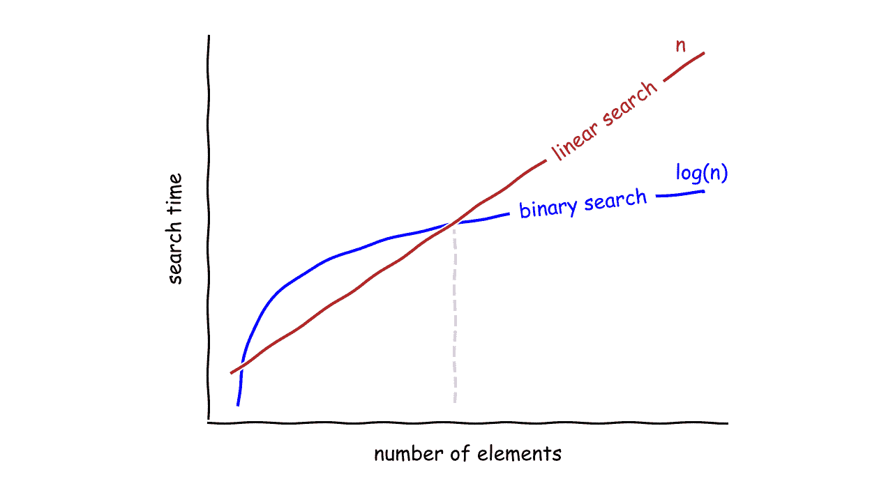
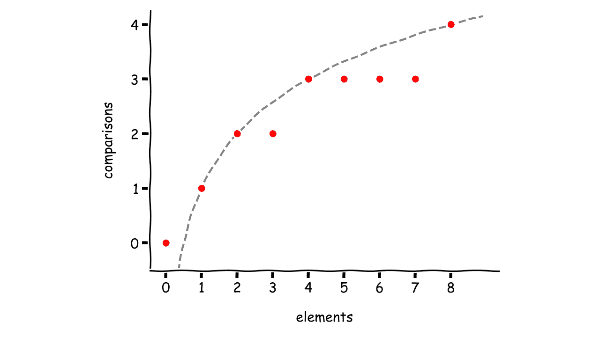
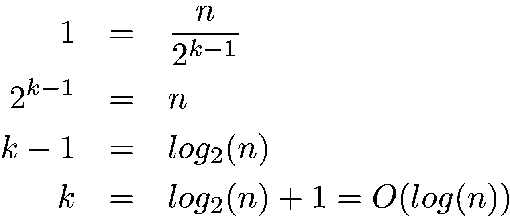

# 如何用 Python 实现二分搜索法

> 原文:[https://realpython.com/binary-search-python/](https://realpython.com/binary-search-python/)

*立即观看**本教程有真实 Python 团队创建的相关视频课程。配合文字教程一起看，加深理解: [**用 Python 创建二分搜索法**](/courses/creating-binary-search-python/)*

 ***二分搜索法**是计算机科学中的经典算法。它经常出现在编程竞赛和[技术面试中](https://realpython.com/python-coding-interview-tips/)。实现二分搜索法被证明是一项具有挑战性的任务，即使您理解了这个概念。除非你很好奇或者有特定的任务，否则你应该总是利用现有的库来用 Python 或者任何其他语言做二分搜索法。

**在本教程中，您将学习如何:**

*   使用 **`bisect`** 模块在 Python 中做一个二分搜索法
*   在 Python 中递归地实现二分搜索法**和迭代地实现 T2**
*   识别并修复二分搜索法 Python 实现中的缺陷
*   分析二分搜索法算法的**时空复杂度**
*   搜索甚至比二分搜索法**还要快**

本教程假设你是一名学生或对算法和数据结构感兴趣的中级程序员[](https://realpython.com/tutorials/intermediate/)**。最起码要熟悉 Python 的[内置数据类型](https://realpython.com/python-data-types/)，比如[列表和元组](https://realpython.com/python-lists-tuples/)。此外，熟悉一下[递归](https://realpython.com/python-recursion/)、[类](https://realpython.com/lessons/classes-python/)、[数据类](https://realpython.com/python-data-classes/)和 [lambdas](https://realpython.com/python-lambda/) 将有助于你更好地理解本教程中的概念。**

 **在下面，您将找到贯穿本教程的示例代码的链接，它需要 Python 3.7 或更高版本才能运行:

**获取示例代码:** [单击此处获取示例代码，您将在本教程中使用](https://realpython.com/bonus/binary-search-python-code/)来学习 Python 中的二分搜索法。

## 基准测试

在本教程的下一部分，您将使用[互联网电影数据库(IMDb)](https://www.imdb.com/) 的子集来测试一些搜索算法的性能。这个数据集对于个人和非商业用途是免费的。它以一堆压缩的[制表符分隔值(TSV)](https://en.wikipedia.org/wiki/Tab-separated_values) 文件的形式分发，这些文件每天更新。

为了让您的生活更轻松，您可以使用示例代码中包含的 Python 脚本。它会自动从 IMDb 获取相关文件，解压缩，并提取有趣的部分:

```py
$ python download_imdb.py
Fetching data from IMDb...
Created "names.txt" and "sorted_names.txt"
```

请注意，这将下载和提取大约 600 MB 的数据，并产生两个额外的文件，其大小约为该文件的一半。下载和处理这些数据可能需要一两分钟的时间。

[*Remove ads*](/account/join/)

### *下载 IMDb*

 *要手动获取数据，请在网络浏览器中导航至[https://datasets.imdbws.com/](https://datasets.imdbws.com/)，并获取名为`name.basics.tsv.gz`的文件，其中包含演员、导演、编剧等的记录。当您解压缩文件时，您会看到以下内容:

```py
nconst     primaryName      birthYear  deathYear  (...)
nm0000001  Fred Astaire     1899       1987       (...)
nm0000002  Lauren Bacall    1924       2014       (...)
nm0000003  Brigitte Bardot  1934       \N         (...)
nm0000004  John Belushi     1949       1982       (...)
```

它有一个**标题**,第一行是列名，随后的每一行是**数据记录**。每个记录包含一个唯一的标识符、全名、出生年份和一些其他属性。这些都用制表符分隔。

有数百万条记录，所以不要试图用常规的文本编辑器打开文件，以免让你的电脑崩溃。即使是专门的软件，如电子表格，也很难打开它。相反，例如，您可以利用包含在 [JupyterLab](https://jupyterlab.readthedocs.io/en/stable/) 中的高性能数据网格查看器。

### 读取制表符分隔的值

有几种方法可以解析 TSV 文件。例如，你可以用 [Pandas](https://realpython.com/lessons/reading-csvs-pandas/) 阅读它，使用一个专用的应用程序，或者利用一些命令行工具。但是，建议您使用示例代码中包含的简单 Python 脚本。

**注意:**根据经验，您应该避免手动解析文件，因为您可能会忽略**边缘情况**。例如，在其中一个字段中，可以在引号内使用分隔制表符，这会破坏列数。只要有可能，尽量在标准库中或者值得信赖的第三方库中找到相关的模块。

最终，您希望得到两个文本文件供您使用:

1.  `names.txt`
2.  `sorted_names.txt`

其中一个将包含一个通过从原始 TSV 文件中剪切第二列而获得的姓名列表:

```py
Fred Astaire
Lauren Bacall
Brigitte Bardot
John Belushi
Ingmar Bergman
...
```

第二个将是这个的排序版本。

一旦两个文件都准备好了，就可以使用这个函数将它们加载到 Python 中:

```py
def load_names(path):
    with open(path) as text_file:
        return text_file.read().splitlines()

names = load_names('names.txt')
sorted_names = load_names('sorted_names.txt')
```

这段代码返回一个从给定文件中提取的名字列表。注意，对产生的[字符串](https://realpython.com/python-strings/)调用`.splitlines()`会移除每行的尾部换行符。或者，您可以调用`text_file.readlines()`，但是这样会保留不需要的换行符。

### 测量执行时间

要评估特定算法的性能，可以根据 IMDb 数据集测量其执行时间。这通常是借助内置的 [`time`](https://realpython.com/python-time-module/) 或 [`timeit`](https://pymotw.com/3/timeit/) 模块来完成的，这些模块对于计时一段代码很有用。

如果你愿意，你也可以定义一个定制的[装饰器](https://realpython.com/lessons/timing-functions-decorators/)来计时一个函数。提供的示例代码使用了 Python 3.7 中引入的 [`time.perf_counter_ns()`](https://docs.python.org/3/library/time.html#time.perf_counter_ns) ，因为它提供了纳秒级的高精度。

## 理解搜索算法

搜索无处不在，是计算机科学的核心。你可能今天一个人就进行了几次网络搜索，但是你有没有想过**搜索**到底是什么意思？

搜索算法有许多不同的形式。例如，您可以:

*   进行[全文搜索](https://en.wikipedia.org/wiki/Full-text_search)
*   用[模糊搜索](https://en.wikipedia.org/wiki/Approximate_string_matching)匹配字符串
*   在图中寻找最短路径
*   查询数据库
*   寻找最小值或最大值

在本教程中，您将学习如何在排序的项目列表(如电话簿)中搜索元素。当您搜索这样的元素时，您可能会问以下问题之一:

| 问题 | 回答 |
| --- | --- |
| 在那里吗？ | 是 |
| 它在哪里？ | 在第 42 页 |
| 是哪一个？ | 一个叫约翰·多伊的人 |

第一个问题的答案告诉你一个元素是否存在于集合中。它总是保持*真*或*假*。第二个答案是集合中某个元素的**位置**，如果该元素丢失，则可能无法使用。最后，第三个答案是**元素**本身，或者说缺少它。

**注:**由于**重复或相似的项目**，有时可能会有不止一个正确答案。例如，如果您有几个同名的联系人，那么他们都符合您的搜索条件。在其他时候，可能只有一个大概的答案或者根本没有答案。

在最常见的情况下，您将通过值进行**搜索，它将集合中的元素与您作为引用提供的元素进行比较。换句话说，您的搜索条件是整个元素，比如一个数字、一个字符串或一个像人这样的对象。即使两个被比较的元素之间的微小差异也不会导致匹配。**

另一方面，通过选择元素的某些属性，比如一个人的姓氏，可以使搜索标准更加细化。这被称为通过键的**搜索，因为您选择一个或多个属性进行比较。在深入研究 Python 中的二分搜索法之前，让我们快速浏览一下其他搜索算法，以获得更全面的了解，并理解它们是如何工作的。**

[*Remove ads*](/account/join/)

### *随机搜索*

 *你会怎样在背包里找东西？你可能只是把手伸进去，随便挑一件，看看它是不是你想要的。如果你运气不好，你就把它放回去，冲洗，然后重复。这个例子很好的理解了**随机搜索**，这是效率最低的搜索算法之一。这种方法的低效源于这样一个事实，即你冒着多次选择同样错误的东西的风险。

**注意:**有趣的是，理论上来说，如果你*非常幸运或者收藏的元素数量很少，这个策略*可能是最有效的。**

该算法的基本原理可以用以下 Python 代码片段来表达:

```py
import random

def find(elements, value):
    while True:
        random_element = random.choice(elements)
        if random_element == value:
            return random_element
```

该函数循环，直到在[随机](https://realpython.com/python-random/)选择的某个元素与作为输入给出的值匹配。然而，这不是很有用，因为函数要么隐式返回 [`None`](https://realpython.com/null-in-python/) ，要么返回它已经在参数中收到的相同值。您可以在下面的链接下载的示例代码中找到完整的实现:

**获取示例代码:** [单击此处获取示例代码，您将在本教程中使用](https://realpython.com/bonus/binary-search-python-code/)来学习 Python 中的二分搜索法。

对于微观数据集，随机搜索算法似乎工作得相当快:

>>>

```py
>>> from search.random import *  # Sample code to download
>>> fruits = ['orange', 'plum', 'banana', 'apple']
>>> contains(fruits, 'banana')
True
>>> find_index(fruits, 'banana')
2
>>> find(fruits, key=len, value=4)
'plum'
```

然而，想象一下，必须像这样在*百万*个元素中搜索！下面是对 IMDb 数据集进行的性能测试的简要介绍:

| 搜索术语 | 元素索引 | 最佳时间 | 平均时间 | 最糟糕的时候 |
| --- | --- | --- | --- | --- |
| *弗雷德·阿斯泰尔* | `0` | `0.74s` | `21.69s` | `43.16s` |
| *艾丽西娅·莫妮卡* | `4,500,000` | `1.02s` | `26.17s` | `66.34s` |
| *Baoyin Liu* | `9,500,000` | `0.11s` | `17.41s` | `51.03s` |
| *失踪* | `N/A` | `5m 16s` | `5m 40s` | `5m 54s` |

特别选择了不同存储位置的独特元素以避免偏差。考虑到算法的随机性和其他因素，如[垃圾收集](https://realpython.com/python-memory-management/#garbage-collection)或在后台运行的系统进程，每个术语都被搜索了十次。

**注意:**如果你想自己进行这个实验，那么回头参考本教程介绍中的说明。为了测量代码的性能，你可以使用内置的 [`time`和`timeit`](https://realpython.com/python-time-module/) 模块，或者你可以使用自定义的[装饰器](https://realpython.com/lessons/timing-functions-decorators/)来计时函数。

该算法具有**非确定性性能**。虽然找到一个元素的平均时间不取决于它的位置，但最好和最差的时间相差两到三个数量级。它也遭受不一致的行为。考虑拥有一个包含一些重复元素的元素集合。因为该算法随机选取元素，所以在随后的运行中，它将不可避免地返回不同的副本。

你如何改进这一点？一次解决这两个问题的方法是使用**线性搜索**。

### 线性搜索

当你决定午餐吃什么时，你可能会乱翻菜单，直到有什么吸引你的目光。或者，你可以采取一种更系统的方法，从上到下浏览菜单，并按照**顺序**仔细检查每一个项目。简而言之，这就是线性搜索。要在 Python 中实现它，您可以使用 [`enumerate()`](https://realpython.com/lessons/use-enumerate-keep-running-index/) 元素来跟踪当前元素的索引:

```py
def find_index(elements, value):
    for index, element in enumerate(elements):
        if element == value:
            return index
```

该函数以预定义且一致的顺序在元素集合上循环。当找到元素时，或者当没有更多元素要检查时，它停止。这种策略保证没有一个元素会被访问一次以上，因为您是按`index`的顺序遍历它们的。

让我们看看线性搜索如何处理您之前使用的 IMDb 数据集:

| 搜索术语 | 元素索引 | 最佳时间 | 平均时间 | 最糟糕的时候 |
| --- | --- | --- | --- | --- |
| *弗雷德·阿斯泰尔* | `0` | `491ns` | `1.17µs` | `6.1µs` |
| *艾丽西娅·莫妮卡* | `4,500,000` | `0.37s` | `0.38s` | `0.39s` |
| *Baoyin Liu* | `9,500,000` | `0.77s` | `0.79s` | `0.82s` |
| *失踪* | `N/A` | `0.79s` | `0.81s` | `0.83s` |

单个元素的查找时间几乎没有任何差异。平均时间实际上与最好和最差的时间相同。因为元素总是以相同的顺序浏览，所以查找相同元素所需的比较次数不会改变。

但是，查找时间会随着集合中元素索引的增加而增加。元素离列表的开头越远，需要进行的比较就越多。在最坏的情况下，当一个元素丢失时，必须检查整个集合才能给出明确的答案。

当您将实验数据投影到[图](https://realpython.com/pandas-plot-python/)上并连接这些点时，您将立即看到元素位置与找到它所需的时间之间的关系:

[](https://files.realpython.com/media/linear_search_time_plot.35afe62a7aa6.png)

所有样本都位于一条直线上，可以用一个**线性函数**来描述，这也是算法名字的由来。您可以假设，平均而言，使用线性搜索查找任何元素所需的时间将与集合中所有元素的数量成比例。随着要搜索的数据量的增加，它们不能很好地扩展。

例如，如果使用线性搜索，一些机场的生物扫描仪不会在几秒钟内识别乘客。另一方面，线性搜索算法可能是较小数据集的一个好选择，因为它不需要对数据进行预处理。在这种情况下，预处理的好处无法补偿它的成本。

Python 已经提供了线性搜索，所以没有必要自己编写。例如，`list`数据结构公开了一个方法，该方法将返回元素的索引，否则将引发异常:

>>>

```py
>>> fruits = ['orange', 'plum', 'banana', 'apple']
>>> fruits.index('banana')
2
>>> fruits.index('blueberry')
Traceback (most recent call last):
  File "<stdin>", line 1, in <module>
ValueError: 'blueberry' is not in list
```

这也可以告诉您该元素是否存在于集合中，但是一种更具[python 式](https://realpython.com/learning-paths/writing-pythonic-code/)的方式是使用通用的`in`操作符:

>>>

```py
>>> 'banana' in fruits
True
>>> 'blueberry' in fruits
False
```

值得注意的是，尽管使用了线性搜索，但这些内置函数和操作符会让您的实现大吃一惊。这是因为它们是用纯 [C](https://realpython.com/build-python-c-extension-module/) 编写的，可以编译成本机代码。无论你如何努力，标准的 Python 解释器都不是它的对手。

使用`timeit`模块进行的快速测试显示，Python 实现的运行速度可能比同等的本地实现慢十倍:

>>>

```py
>>> import timeit
>>> from search.linear import contains
>>> fruits = ['orange', 'plum', 'banana', 'apple']
>>> timeit.timeit(lambda: contains(fruits, 'blueberry'))
1.8904765040024358
>>> timeit.timeit(lambda: 'blueberry' in fruits)
0.22473459799948614
```

然而，对于足够大的数据集，即使是本机代码也会达到其极限，唯一的解决方案将是重新思考算法。

**注意:**`in`操作符并不总是进行线性搜索。例如，当您在`set`上使用它时，它会进行基于哈希的搜索。操作员可以使用任何可重复的**，包括`tuple`、`list`、`set`、`dict`和`str`。通过实现[魔法方法](https://docs.python.org/3/reference/datamodel.html#special-method-names) `.__contains__()`来定义底层逻辑，你甚至可以用它来支持你的定制类。**

 **在现实生活中，通常应该避免使用线性搜索算法。例如，有一段时间，我不能在兽医诊所注册我的猫，因为他们的系统总是崩溃。医生告诉我，他最终必须升级他的电脑，因为向数据库中添加更多的记录会使它运行得越来越慢。

我记得当时我心里想，写那个软件的人显然不知道**二分搜索法**算法！

[*Remove ads*](/account/join/)

### *二分搜索法*

 *单词**二进制**一般与数字 2 联系在一起。在这个上下文中，它指的是将一个元素集合分成两半，并在算法的每一步丢弃其中的一个。这可以极大地减少查找元素所需的比较次数。但是有一个问题——集合中的元素必须先排序为。

其背后的想法类似于在书中寻找一页的步骤。首先，你通常会把书翻到完全随机的一页，或者至少是接近你认为你想要的那一页的那一页。

偶尔，你会幸运地在第一次尝试时找到那个页面。然而，如果页码太低，那么你知道这一页一定是在右边。如果您在下一次尝试时超过了，并且当前页码高于您正在查找的页面，那么您肯定知道它一定在两者之间。

重复这个过程，但不是随机选择一个页面，而是检查位于新范围中间的页面。这最大限度地减少了尝试的次数。类似的方法可以用在[数字猜谜游戏](https://inventwithpython.com/chapter4.html)中。如果您没有听说过这个游戏，那么您可以在互联网上查找，以获得大量用 Python 实现的示例。

**注:**有时，如果数值是均匀分布的，可以用**线性插值**计算中间指数，而不是取平均值。该算法的这种变化将需要更少的步骤。

限制要搜索的页面范围的页码称为**下限**和**上限**。在二分搜索法，通常从第一页开始作为下界，最后一页作为上界。您必须在进行过程中更新这两个边界。例如，如果你翻到的那一页比你要找的那一页低，那就是你新的下限。

假设您要在一组按大小升序排列的水果中寻找一颗草莓:

[](https://files.realpython.com/media/binary-search-fruits-01.2ae8a8516eb9.png)

第一次尝试时，中间的元素恰好是一个柠檬。因为它比草莓大，你可以丢弃右边的所有元素，包括柠檬。您将把上限移动到一个新位置，并更新中间索引:

[](https://files.realpython.com/media/binary-search-fruits-02.ec849d47d8a4.png)

现在，你只剩下一半的水果了。当前的中间元素确实是您正在寻找的草莓，这结束了搜索。如果不是，那么你只需要相应地更新边界，并继续下去，直到它们通过对方。例如，在草莓和猕猴桃之间寻找一个丢失的李子，将得到以下结果:

[](https://files.realpython.com/media/binary-search-fruits-03.e50276fabb7c.png)

请注意，为了找到想要的元素，不必进行太多的比较。这就是二分搜索法的魅力。即使您正在处理一百万个元素，您最多只需要少量的检查。这个数不会因为减半而超过元素总数的**对数**底数 2。换句话说，剩余元素的数量在每一步减少一半。

这是可能的，因为元素已经按大小排序。但是，如果您想通过另一个关键字(比如颜色)来查找水果，那么您必须再次对整个集合进行排序。为了避免昂贵的排序开销，您可以尝试预先计算同一集合的不同视图。这有点类似于创建一个**数据库索引**。

考虑一下如果在集合中添加、删除或更新一个元素会发生什么。为了让二分搜索法继续工作，您需要保持正确的排序顺序。这可以通过`bisect`模块来完成，您将在下一节中读到。

在本教程的后面，你将看到如何用 Python 实现二分搜索法算法。现在，让我们用 IMDb 数据集来面对它。请注意，现在要搜索的人与以前不同。这是因为数据集必须针对二分搜索法进行排序，这会对元素进行重新排序。新元素的位置与之前大致相同，以保持测量的可比性:

| 搜索术语 | 元素索引 | 平均时间 | 比较 |
| --- | --- | --- | --- |
| *(…)准备好了* | `0` | `6.52µs` | Twenty-three |
| 乔纳森·萨姆万埃特 | `4,499,997` | `6.99µs` | Twenty-four |
| *黑曲霉* | `9,500,001` | `6.5µs` | Twenty-three |
| *失踪* | `N/A` | `7.2µs` | Twenty-three |

答案几乎是即时的。在一般情况下，二分搜索法只需要几微秒就能在九百万个元素中找到一个！除此之外，所选元素的比较次数几乎保持不变，这符合以下公式:

[](https://files.realpython.com/media/log2.3b129f5915a5.png)

找到大多数元素将需要最大数量的比较，这可以从集合大小的对数中得出。相反，中间只有一个元素可以在第一次比较中找到。

二分搜索法是“分而治之”技术的一个很好的例子，这种技术将一个问题分成一堆同类的小问题。然后将各个解决方案组合起来，形成最终答案。这种技术的另一个众所周知的例子是[快速排序](https://en.wikipedia.org/wiki/Quicksort)算法。

**注:**不要把各个击破和 [**动态编程**](https://en.wikipedia.org/wiki/Dynamic_programming) 混为一谈，这是有点类似的手法。

与其他搜索算法不同，二分搜索法不仅可以用于搜索。例如，它允许集合成员测试、查找最大值或最小值、查找目标值的最近邻、执行范围查询等等。

如果速度是重中之重，那么二分搜索法并不总是最好的选择。甚至还有更快的算法可以利用基于散列的数据结构。然而，这些算法需要大量额外的内存，而二分搜索法提供了一个很好的时空权衡。

[*Remove ads*](/account/join/)

### *基于哈希的搜索*

 *为了更快的搜索，你需要缩小**问题空间**。二分搜索法通过将每一级的候选人数减半来实现这一目标。这意味着，即使您有一百万个元素，如果所有元素都已排序，那么最多需要二十次比较才能确定该元素是否存在。

最快的搜索方法是知道在哪里可以找到你要找的东西。如果您知道一个元素的确切内存位置，那么您将直接访问它，而不需要首先进行搜索。将一个元素或者(更常见的)它的一个键映射到内存中的元素位置被称为**散列**。

您可以认为散列不是搜索特定的元素，而是基于元素本身计算索引。这是一个 **[哈希函数](https://realpython.com/python-hash-table/#understand-the-hash-function)** 的工作，它需要保存某些数学属性。一个好的散列函数应该:

*   将任意输入转换成固定大小的输出。
*   有均匀的值分布来减轻[](https://en.wikipedia.org/wiki/Collision_(computer_science))**的哈希冲突。**
***   产生决定性的结果。*   成为一个[单向函数](https://en.wikipedia.org/wiki/One-way_function)。*   放大输入变化以实现[雪崩效应](https://en.wikipedia.org/wiki/Avalanche_effect)。**

 **同时，它不应该在计算上太昂贵，否则它的成本会超过收益。哈希函数也用于数据完整性验证和加密。

使用这个概念将键映射为值的数据结构被称为**映射**、**散列表**、**字典**或**关联数组**。

**注意:** Python 有两个内置的数据结构，分别是`set`和`dict`，依靠 hash 函数寻找元素。当一个`set`散列它的元素时，一个`dict`对元素键使用散列函数。要弄清楚`dict`是如何在 Python 中实现的，请查看 Raymond Hettinger 关于[现代 Python 词典](https://www.youtube.com/watch?v=npw4s1QTmPg)的会议演讲。

另一种可视化散列的方式是想象相似元素的所谓的**桶**被分组到它们各自的键下。例如，您可以根据颜色将水果收获到不同的桶中:

[](https://files.realpython.com/media/buckets.ca9e58a83b24.png)

椰子和猕猴桃被放入标有棕色标签的桶中，而苹果则被放入标有红色标签的桶中，以此类推。这允许你快速浏览一小部分元素。理想情况下，你希望每个桶里只有一个水果。否则，你会得到所谓的**碰撞**，这会导致额外的工作。

**注意:**桶及其内容通常没有特定的顺序。

让我们将 IMDb 数据集中的名字放入字典中，这样每个名字就成为一个键，相应的值就成为它的索引:

>>>

```py
>>> from benchmark import load_names  # Sample code to download
>>> names = load_names('names.txt')
>>> index_by_name = {
...     name: index for index, name in enumerate(names)
... }
```

在将文本名称加载到平面列表中之后，您可以将它放入字典理解(T2)中来创建映射。现在，检查元素是否存在以及获取其索引非常简单:

>>>

```py
>>> 'Guido van Rossum' in index_by_name
False
>>> 'Arnold Schwarzenegger' in index_by_name
True
>>> index_by_name['Arnold Schwarzenegger']
215
```

感谢在幕后使用的哈希函数，你根本不用实现任何搜索！

以下是基于哈希的搜索算法在 IMDb 数据集上的表现:

| 搜索术语 | 元素索引 | 最佳时间 | 平均时间 | 最糟糕的时候 |
| --- | --- | --- | --- | --- |
| *弗雷德·阿斯泰尔* | `0` | `0.18µs` | `0.4µs` | `1.9µs` |
| *艾丽西娅·莫妮卡* | `4,500,000` | `0.17µs` | `0.4µs` | `2.4µs` |
| *Baoyin Liu* | `9,500,000` | `0.17µs` | `0.4µs` | `2.6µs` |
| *失踪* | `N/A` | `0.19µs` | `0.4µs` | `1.7µs` |

不仅平均时间比已经很快的二分搜索法 Python 实现快了一个数量级，而且无论元素在哪里，这种速度在所有元素中都保持不变。

这种收益的代价是 Python 进程多消耗了大约 0.5 GB 的内存，加载时间变慢，并且需要保持额外的数据与[字典](https://realpython.com/courses/dictionaries-python/)的内容一致。反过来，查找非常快，而更新和插入比列表稍慢。

字典对关键字的另一个约束是它们必须是**可散列的**，并且它们的**散列值**不能随时间改变。您可以通过对特定数据类型调用`hash()`来检查它在 Python 中是否是可散列的:

>>>

```py
>>> key = ['round', 'juicy']
>>> hash(key)
Traceback (most recent call last):
  File "<stdin>", line 1, in <module>
TypeError: unhashable type: 'list'
```

可变集合——如`list`、`set`和`dict`—是不可散列的。实际上，字典键应该是**不可变的**，因为它们的哈希值通常取决于键的一些属性。如果一个可变集合是可散列的，并且可以用作一个键，那么它的散列值在每次内容改变时都会不同。考虑一下，如果一个特定的水果由于成熟而改变了颜色，会发生什么。你找错桶了！

散列函数还有许多其他用途。例如，它用在密码学中以避免以纯文本形式存储密码，以及用于数据完整性验证。

[*Remove ads*](/account/join/)

## *使用`bisect`模块*

 *Python 中的二分搜索法可以使用内置的`bisect`模块来执行，这也有助于按排序顺序保存列表。它基于求函数根的[二分法](https://en.wikipedia.org/wiki/Bisection_method)。该模块有六个功能，分为两类:

| 查找索引 | 插入元素 |
| --- | --- |
| `bisect()` | `insort()` |
| `bisect_left()` | `insort_left()` |
| `bisect_right()` | `insort_right()` |

这些函数允许您查找一个元素的索引或者在正确的位置添加一个新元素。第一行中的那些只是分别用于`bisect_right()`和`insort_right()`的别名。实际上，你只需要处理四个功能。

**注意:**在将列表传递给某个函数之前，您有责任对其进行排序。如果元素没有排序，那么您很可能会得到不正确的结果。

事不宜迟，让我们看看`bisect`模块的运行情况。

### 寻找元素

要在排序列表中查找现有元素的索引，您需要`bisect_left()`:

>>>

```py
>>> import bisect
>>> sorted_fruits = ['apple', 'banana', 'orange', 'plum']
>>> bisect.bisect_left(sorted_fruits, 'banana')
1
```

输出告诉您香蕉是列表中的第二种水果，因为它是在索引`1`处找到的。但是，如果缺少一个元素，您仍然可以获得它的预期位置:

>>>

```py
>>> bisect.bisect_left(sorted_fruits, 'apricot')
1
>>> bisect.bisect_left(sorted_fruits, 'watermelon')
4
```

尽管这些水果还没有列在清单上，但你可以知道把它们放在哪里。例如，杏应该出现在苹果和香蕉之间，而西瓜应该成为最后一个元素。通过评估两个条件，您将知道是否找到了元素:

1.  **索引**是否在列表大小内？

2.  元素的**值**是想要的值吗？

这可以转化为通过值查找元素的通用函数:

```py
def find_index(elements, value):
    index = bisect.bisect_left(elements, value)
    if index < len(elements) and elements[index] == value:
        return index
```

当有匹配时，该函数将返回相应的元素索引。否则，它将隐式返回`None`。

要按键搜索，您必须维护一个单独的键列表。因为这会导致额外的成本，所以预先计算这些键并尽可能多地重用它们是值得的。您可以定义一个助手类，以便能够通过不同的键进行搜索，而不会引入太多的代码重复:

```py
class SearchBy:
    def __init__(self, key, elements):
        self.elements_by_key = sorted([(key(x), x) for x in elements])
        self.keys = [x[0] for x in self.elements_by_key]
```

密钥是作为第一个参数传递给`__init__()`的函数。一旦有了它，就可以创建一个键-值对的排序列表，以便以后能够从它的键中检索元素。用[元组](https://realpython.com/lessons/immutable-data-structures-tuples/)表示对保证了每对的第一个元素将被排序。在下一步中，您将提取键来创建一个适合您的二分搜索法 Python 实现的平面列表。

还有通过键查找元素的实际方法:

```py
class SearchBy:
    def __init__(self, key, elements):
        ...

    def find(self, value):
        index = bisect.bisect_left(self.keys, value)
        if index < len(self.keys) and self.keys[index] == value:
            return self.elements_by_key[index][1]
```

这段代码将排序后的键列表一分为二，通过键获得元素的索引。如果这样的键存在，那么它的索引可以用来从以前计算的键-值对列表中获得相应的对。该对中的第二个元素是期望值。

**注:**这只是一个说明性的例子。使用官方文件中提到的[推荐食谱](https://code.activestate.com/recipes/577197-sortedcollection/)，你会感觉更好。

如果你有多个香蕉，那么`bisect_left()`将返回最左边的实例:

>>>

```py
>>> sorted_fruits = [
...     'apple',
...     'banana', 'banana', 'banana',
...     'orange',
...     'plum'
... ]
>>> bisect.bisect_left(sorted_fruits, 'banana')
1
```

可以预见，要获得最右边的香蕉，您需要调用`bisect_right()`或它的别名`bisect()`。但是，这两个函数从实际最右边的香蕉返回一个索引，这对于查找新元素的插入点很有用:

>>>

```py
>>> bisect.bisect_right(sorted_fruits, 'banana')
4
>>> bisect.bisect(sorted_fruits, 'banana')
4
>>> sorted_fruits[4]
'orange'
```

当你组合代码时，你可以看到你有多少香蕉:

>>>

```py
>>> l = bisect.bisect_left(sorted_fruits, 'banana')
>>> r = bisect.bisect_right(sorted_fruits, 'banana')
>>> r - l
3
```

如果缺少一个元素，那么`bisect_left()`和`bisect_right()`将返回相同的索引，没有香蕉。

[*Remove ads*](/account/join/)

### *插入新元素*

 *模块的另一个实际应用是维护已经排序的列表中元素的顺序。毕竟，你不会想在每次需要插入内容的时候对整个列表进行排序。在大多数情况下，这三种功能可以互换使用:

>>>

```py
>>> import bisect
>>> sorted_fruits = ['apple', 'banana', 'orange']
>>> bisect.insort(sorted_fruits, 'apricot') >>> bisect.insort_left(sorted_fruits, 'watermelon') >>> bisect.insort_right(sorted_fruits, 'plum') >>> sorted_fruits
['apple', 'apricot', 'banana', 'orange', 'plum', 'watermelon']
```

直到你的列表中有**个重复的**时，你才会看到任何不同。但即使这样，只要这些重复项是简单的值，它就不会变得明显。再往左边加一根香蕉，效果和往右边加一样。

要注意这种差异，您需要一种数据类型，其对象可以有**个唯一标识**，尽管有**个相等的值**。让我们使用 Python 3.7 中引入的 [@dataclass](https://realpython.com/python-data-classes/) [装饰器](https://realpython.com/primer-on-python-decorators/)来定义一个`Person`类型:

```py
from dataclasses import dataclass, field

@dataclass
class Person:
    name: str
    number: int = field(compare=False)

    def __repr__(self):
        return f'{self.name}({self.number})'
```

一个人有一个`name`和一个任意的`number`分配给它。通过从相等测试中排除`number`字段，您使两个人相等，即使他们具有不同的属性值:

>>>

```py
>>> p1 = Person('John', 1)
>>> p2 = Person('John', 2)
>>> p1 == p2
True
```

另一方面，这两个变量指的是完全独立的实体，这使您可以区分它们:

>>>

```py
>>> p1 is p2
False
>>> p1
John(1)
>>> p2
John(2)
```

变量`p1`和`p2`确实是不同的对象。

请注意，默认情况下，数据类的实例是不可比较的，这使得您无法对它们使用二分法:

>>>

```py
>>> alice, bob = Person('Alice', 1), Person('Bob', 1)
>>> alice < bob
Traceback (most recent call last):
  File "<stdin>", line 1, in <module>
TypeError: '<' not supported between instances of 'Person' and 'Person'
```

Python 不知道对`alice`和`bob`排序，因为它们是自定义类的对象。传统上，你要在你的类中实现神奇的方法`.__lt__()`，它代表**小于**，告诉解释器如何比较这些元素。然而，`@dataclass`装饰器接受一些可选的[布尔](https://realpython.com/python-boolean/)标志。其中之一是`order`，当设置为`True`时，会自动生成用于比较的神奇方法:

```py
@dataclass(order=True) class Person:
    ...
```

反过来，这允许你比较两个人，并决定谁先来:

>>>

```py
>>> alice < bob
True
>>> bob < alice
False
```

最后，您可以利用`name`和`number`属性来观察各种函数向列表中插入新成员的位置:

>>>

```py
>>> sorted_people = [Person('John', 1)]
>>> bisect.insort_left(sorted_people, Person('John', 2))
>>> bisect.insort_right(sorted_people, Person('John', 3))
>>> sorted_people
[John(2), John(1), John(3)]
```

名称后括号中的数字表示插入顺序。最开始的时候，只有一个`John`，他得到的号码是`1`。然后，你把它的复制品加到左边，后来又在右边加了一个。

[*Remove ads*](/account/join/)

## *用 Python 实现二分搜索法*

 *请记住，除非有充分的理由，否则您可能不应该实现该算法。你将节省时间，不需要重新发明轮子。库代码很有可能是成熟的，已经在生产环境中被真实用户测试过，并且具有由多个贡献者交付的广泛功能。

也就是说，有时候卷起袖子自己动手是有意义的。由于许可或安全问题，您的公司可能有禁止某些开源库的政策。也许由于内存或网络带宽的限制，您无法承受另一种依赖。最后，自己编写代码可能是一个很好的学习工具！

您可以通过两种方式实现大多数算法:

1.  **迭代**
2.  **[递归](https://realpython.com/python-thinking-recursively/)**

然而，这一规则也有例外。一个显著的例子是[阿克曼函数](https://en.wikipedia.org/wiki/Ackermann_function)，它只能用递归来表示。

在进一步学习之前，请确保您已经很好地掌握了二分搜索法算法。你可以参考本教程前面的[部分来快速复习。](https://realpython.com/binary-search-python/#binary-search)

### 迭代

该算法的迭代版本包含一个循环，它将重复一些步骤，直到满足停止条件。让我们从实现一个函数开始，这个函数将通过值搜索元素并返回它们的索引:

```py
def find_index(elements, value):
    ...
```

稍后您将重用这个函数。

假设所有的元素都被排序，你可以在序列的两端设置上下边界:

```py
def find_index(elements, value):
 left, right = 0, len(elements) - 1
```

现在，您希望识别中间的元素，以查看它是否具有所需的值。计算中间指数可以通过取两个边界的平均值来完成:

```py
def find_index(elements, value):
    left, right = 0, len(elements) - 1
 middle = (left + right) // 2
```

注意一个整数除法是如何通过[对结果进行地板处理](http://python-history.blogspot.com/2010/08/why-pythons-integer-division-floors.html)来帮助处理有界范围内的奇数和偶数元素的。根据你如何更新边界和定义停止条件，你也可以使用[上限函数](https://en.wikipedia.org/wiki/Floor_and_ceiling_functions)。

接下来，您要么完成序列，要么将序列一分为二，并继续在结果的一半中搜索:

```py
def find_index(elements, value):
    left, right = 0, len(elements) - 1
    middle = (left + right) // 2

 if elements[middle] == value: return middle 
 if elements[middle] < value: left = middle + 1 elif elements[middle] > value: right = middle - 1
```

如果中间的元素是匹配的，那么返回它的索引。否则，如果它太小，那么你需要向上移动下边界。如果它太大，那么你需要把上限下移。

要继续前进，您必须将大部分步骤封闭在一个循环中，当下边界超过上边界时，循环将停止:

```py
def find_index(elements, value):
    left, right = 0, len(elements) - 1

 while left <= right:        middle = (left + right) // 2

        if elements[middle] == value:
            return middle

        if elements[middle] < value:
            left = middle + 1
        elif elements[middle] > value:
            right = middle - 1
```

换句话说，只要下边界低于或等于上边界，您就希望迭代。否则，没有匹配，函数隐式返回`None`。

**通过关键字**搜索可以归结为查看一个对象的属性，而不是它的文字值。例如，关键字可以是水果名称中的字符数。您可以修改`find_index()`以接受并使用一个`key`参数:

```py
def find_index(elements, value, key):
    left, right = 0, len(elements) - 1

    while left <= right:
        middle = (left + right) // 2
 middle_element = key(elements[middle]) 
        if middle_element == value:
            return middle

        if middle_element < value:
            left = middle + 1
        elif middle_element > value:
            right = middle - 1
```

但是，您还必须记住使用您将要搜索的相同的`key`对列表进行排序:

>>>

```py
>>> fruits = ['orange', 'plum', 'watermelon', 'apple']
>>> fruits.sort(key=len)
>>> fruits
['plum', 'apple', 'orange', 'watermelon']
>>> fruits[find_index(fruits, key=len, value=10)]
'watermelon'
>>> print(find_index(fruits, key=len, value=3))
None
```

在上面的例子中，`watermelon`被选中是因为它的名字正好是十个字符长，而列表中没有水果的名字是由三个字母组成的。

这很好，但同时，您也失去了按值搜索的能力。为了解决这个问题，你可以给`key`分配一个默认值`None`，然后检查它是否被给定。然而，在一个更简化的解决方案中，您总是希望调用`key`。默认情况下，它是一个返回元素本身的[标识函数](https://en.wikipedia.org/wiki/Identity_function):

```py
def identity(element):
    return element

def find_index(elements, value, key=identity):
    ...
```

或者，您可以使用匿名的 [lambda 表达式](https://realpython.com/python-lambda/)来定义 identity 函数:

```py
def find_index(elements, value, key=lambda x: x):
    ...
```

只回答一个问题。还有另外两个，分别是“在吗？”以及“这是什么？”要回答这两个问题，您可以在此基础上构建:

```py
def find_index(elements, value, key):
    ...

def contains(elements, value, key=identity):
    return find_index(elements, value, key) is not None

def find(elements, value, key=identity):
    index = find_index(elements, value, key)
    return None if index is None else elements[index]
```

有了这三个函数，您几乎可以了解一个元素的所有信息。然而，在您的实现中，您仍然没有解决**重复**的问题。如果你有一群人，其中一些人有共同的名字或姓氏，那会怎么样？例如，人们中可能有一个`Smith`家庭或几个叫`John`的人:

```py
people = [
    Person('Bob', 'Williams'),
    Person('John', 'Doe'),
    Person('Paul', 'Brown'),
    Person('Alice', 'Smith'),
    Person('John', 'Smith'),
]
```

要对`Person`类型建模，您可以修改前面定义的数据类:

```py
from dataclasses import dataclass

@dataclass(order=True)
class Person:
    name: str
    surname: str
```

请注意使用了`order`属性来自动生成神奇的方法，以便通过所有字段来比较该类的实例。或者，您可能更喜欢利用 [`namedtuple`](https://realpython.com/lessons/immutable-data-structures-namedtuple/) ，它的语法更短:

```py
from collections import namedtuple
Person = namedtuple('Person', 'name surname')
```

这两种定义都很好，可以互换。每个人都有一个`name`和一个`surname`属性。要按其中一个进行排序和搜索，您可以使用内置`operator`模块中的`attrgetter()`方便地定义关键功能:

>>>

```py
>>> from operator import attrgetter
>>> by_surname = attrgetter('surname')
>>> people.sort(key=by_surname)
>>> people
[Person(name='Paul', surname='Brown'),
 Person(name='John', surname='Doe'),
 Person(name='Alice', surname='Smith'),
 Person(name='John', surname='Smith'),
 Person(name='Bob', surname='Williams')]
```

注意现在人们是如何按照姓氏升序排列的。有`John Smith`和`Alice Smith`，但是对`Smith`姓氏进行二进制搜索目前只会给出一个任意的结果:

>>>

```py
>>> find(people, key=by_surname, value='Smith')
Person(name='Alice', surname='Smith')
```

为了模仿前面显示的`bisect`模块的特性，您可以编写自己版本的`bisect_left()`和`bisect_right()`。在找到重复元素的最左边的**和**实例之前，您需要确定是否存在这样的元素:

```py
def find_leftmost_index(elements, value, key=identity):
    index = find_index(elements, value, key)
    if index is not None:
        ...
    return index
```

如果已经找到了某个索引，那么您可以向左看并继续移动，直到您遇到具有不同键的元素或者不再有元素:

```py
def find_leftmost_index(elements, value, key=identity):
    index = find_index(elements, value, key)
    if index is not None:
 while index >= 0 and key(elements[index]) == value: index -= 1 index += 1    return index
```

一旦越过最左边的元素，就需要将索引向右移动一个位置。

找到最右边的实例非常相似，但是您需要翻转条件:

```py
def find_rightmost_index(elements, value, key=identity):
    index = find_index(elements, value, key)
    if index is not None:
        while index < len(elements) and key(elements[index]) == value:
            index += 1
        index -= 1
    return index
```

现在你不是向左走，而是向右走，直到列表结束。使用这两个函数，您可以找到重复项目的所有出现次数:

```py
def find_all_indices(elements, value, key=identity):
    left = find_leftmost_index(elements, value, key)
    right = find_rightmost_index(elements, value, key)
    if left and right:
        return set(range(left, right + 1))
    return set()
```

这个函数总是返回一个[集合](https://realpython.com/courses/sets-python/)。如果没有找到元素，那么集合将是空的。如果元素是唯一的，那么集合将只由一个索引组成。否则，集合中会有多个索引。

最后，您可以定义更抽象的函数来完善您的二分搜索法 Python 库:

```py
def find_leftmost(elements, value, key=identity):
    index = find_leftmost_index(elements, value, key)
    return None if index is None else elements[index]

def find_rightmost(elements, value, key=identity):
    index = find_rightmost_index(elements, value, key)
    return None if index is None else elements[index]

def find_all(elements, value, key=identity):
    return {elements[i] for i in find_all_indices(elements, value, key)}
```

这不仅允许您精确定位列表中元素的确切位置，还允许您检索这些元素。你可以问非常具体的问题:

| 在那里吗？ | 它在哪里？ | 这是什么？ |
| --- | --- | --- |
| `contains()` | `find_index()` | `find()` |
|  | `find_leftmost_index()` | `find_leftmost()` |
|  | `find_rightmost_index()` | `find_rightmost()` |
|  | `find_all_indices()` | `find_all()` |

二分搜索法 Python 库的完整代码可以在下面的链接中找到:

**获取示例代码:** [单击此处获取示例代码，您将在本教程中使用](https://realpython.com/bonus/binary-search-python-code/)来学习 Python 中的二分搜索法。

[*Remove ads*](/account/join/)

### *递归*

 *为了简单起见，我们只考虑`contains()`的**递归**版本，它告诉我们是否找到了一个元素。

**注意:**我最喜欢的关于[递归](https://realpython.com/python-thinking-recursively/)的定义是在关于 JavaScript 函数式编程的*Fun Fun Fun Fun Fun Fun Fun Fun Fun Fun Fun Fun Fun Fun Fun Fun Fun Fun Fun Fun Fun Fun Fun Fun Fun Fun Fun Fun Fun Fun Fun Fun Fun Fun Fun Fun Fun Fun Fun Fun Fun Fun Fun Fun Fun Fun Fun Fun Fun Fun Fun Fun Fun Fun Fun Fun Fun Fun Fun Fun Fun Fun Fun Fun Fun Fun Fun Fun Fun Fun Fun Fun*

> "递归是当一个函数调用它自己，直到它不调用为止."
> 
> -*mattias Petter Johansson*的缩写

最直接的方法是采用二分搜索法的迭代版本，并使用[切片操作符](https://realpython.com/lessons/indexing-and-slicing/)来分割列表:

```py
def contains(elements, value):
    left, right = 0, len(elements) - 1

 if left <= right:        middle = (left + right) // 2

        if elements[middle] == value:
            return True

        if elements[middle] < value:
 return contains(elements[middle + 1:], value)        elif elements[middle] > value:
 return contains(elements[:middle], value) 
    return False
```

不是循环，而是检查一次条件，有时在一个较小的列表上调用相同的函数。那会有什么问题呢？事实证明，切片会生成元素引用的**副本**，这会产生显著的内存和计算开销。

为了避免复制，您可以重用同一个列表，但在必要时将不同的边界传递给函数:

```py
def contains(elements, value, left, right):
    if left <= right:
        middle = (left + right) // 2

        if elements[middle] == value:
            return True

        if elements[middle] < value:
 return contains(elements, value, middle + 1, right)        elif elements[middle] > value:
 return contains(elements, value, left, middle - 1) 
    return False
```

缺点是每次你想调用那个函数时，你必须通过初始边界，确保它们是正确的:

>>>

```py
>>> sorted_fruits = ['apple', 'banana', 'orange', 'plum']
>>> contains(sorted_fruits, 'apple', 0, len(sorted_fruits) - 1)
True
```

如果你犯了一个错误，那么它可能找不到那个元素。您可以通过使用默认的函数参数或引入一个助手函数来改进这一点，该助手函数委托给递归函数:

```py
def contains(elements, value):
    return recursive(elements, value, 0, len(elements) - 1)

def recursive(elements, value, left, right):
    ...
```

更进一步，您可能更喜欢将[一个函数嵌套在另一个函数中，以隐藏技术细节并利用外部作用域的变量重用:](https://realpython.com/inner-functions-what-are-they-good-for/)

```py
def contains(elements, value):
    def recursive(left, right):
        if left <= right:
            middle = (left + right) // 2
            if elements[middle] == value:
                return True
            if elements[middle] < value:
                return recursive(middle + 1, right)
            elif elements[middle] > value:
                return recursive(left, middle - 1)
        return False
    return recursive(0, len(elements) - 1)
```

`recursive()` [内部函数](https://realpython.com/inner-functions-what-are-they-good-for/)可以访问`elements`和`value`参数，即使它们是在封闭范围内定义的。Python 中变量的生命周期和可见性由所谓的 **LEGB** 规则决定，该规则告诉解释器按以下顺序查找符号:

1.  **本地**范围
2.  **封闭**范围
3.  **全局**范围
4.  **内置**符号

这允许从嵌套的代码块中访问外部作用域中定义的变量。

迭代和递归实现之间的选择通常是性能考虑、便利性以及个人喜好的最终结果。然而，递归也有一定的风险，这是下一节的主题之一。

## 掩盖棘手的细节

以下是《计算机编程的艺术》 的作者对实现二分搜索法算法的看法:

> “尽管二分搜索法的基本思想相对来说比较简单，但细节可能出人意料地复杂，许多优秀的程序员在第一次尝试时就做错了。”
> 
> —唐纳德·克努特

如果这还不足以阻止你自己编写算法的想法，那么这个可能会。Java 中的标准库在实现二分搜索法时有一个微妙的[错误](https://ai.googleblog.com/2006/06/extra-extra-read-all-about-it-nearly.html)，这个错误十年来都没有被发现！但是臭虫本身的根源要比这早得多。

**注:**我曾经在一次技术筛选中成为二分搜索法算法的受害者。有几个编码难题需要解决，包括一个二分搜索法难题。猜猜我哪一个没完成？是啊。

下面的列表并不详尽，但同时，它也没有谈到像忘记对列表排序这样的常见错误。

[*Remove ads*](/account/join/)

### *整数溢出*

 *这就是刚刚提到的 Java bug。如果您还记得，二分搜索法 Python 算法检查排序集合中有界范围的中间元素。但是中间元素究竟是如何选择的呢？通常，取上下边界的平均值来寻找中间指数:

```py
middle = (left + right) // 2
```

这种计算平均值的方法在绝大多数情况下都很好。但是，一旦元素集合变得足够大，两个边界的总和就不适合整数数据类型。它将大于整数允许的最大值。

在这种情况下，一些编程语言可能会引发错误，从而立即停止程序执行。不幸的是，情况并非总是如此。比如 Java 默默的忽略了这个问题，让值翻转过来变成了某个看似随机的数字。只有当结果恰好是负数时，您才会知道这个问题，这会抛出一个`IndexOutOfBoundsException`。

这里有一个例子演示了在 [jshell](https://en.wikipedia.org/wiki/JShell) 中的这种行为，它有点像 Java 的交互式解释器:

```py
jshell>  var  a  =  Integer.MAX_VALUE a  ==>  2147483647 jshell>  a  +  1 $2  ==>  -2147483648
```

找到中间索引的更安全的方法是首先计算偏移量，然后将其添加到下边界:

```py
middle = left + (right - left) // 2
```

即使两个值都达到最大值，上面公式中的和也永远不会是。还有一些方法，但好消息是您不需要担心这些，因为 Python 没有整数溢出错误。除了内存之外，整数的大小没有上限:

>>>

```py
>>> 2147483647**7
210624582650556372047028295576838759252690170086892944262392971263
```

然而，有一个问题。当您从库中调用函数时，代码可能会受到 C 语言的约束，仍然会导致溢出。Python 中有很多基于 C 语言的库。你甚至可以构建自己的 [C 扩展模块](https://realpython.com/build-python-c-extension-module/)，或者使用 [`ctypes`](https://dbader.org/blog/python-ctypes-tutorial) 将动态链接库加载到 Python 中。

### 堆栈溢出

从理论上讲，**堆栈溢出**问题可能与二分搜索法的递归实现有关。大多数编程语言对嵌套函数调用的数量都有限制。每个调用都与存储在堆栈中的返回地址相关联。在 Python 中，此类调用的默认限制是几千级:

>>>

```py
>>> import sys
>>> sys.getrecursionlimit()
3000
```

这对许多递归函数来说是不够的。然而，由于其对数性质，Python 中的二分搜索法不太可能需要更多。你需要收集 2 的 3000 次方个元素。那是一个超过九百位数的数字！

然而，如果停止条件由于一个 bug 而被错误地陈述，那么**无限递归错误**仍然有可能出现。在这种情况下，无限递归将最终导致堆栈溢出。

**注意:****堆栈溢出错误**在手动内存管理的语言中非常常见。人们经常会在谷歌上搜索这些错误，看看其他人是否也有类似的问题，这就给一个流行的程序员网站[Q&A](https://stackoverflow.com/)起了个名字。

您可以临时提高或降低递归限制来模拟堆栈溢出错误。请注意，由于 Python 运行时环境必须调用的函数，有效限制将会更小:

>>>

```py
>>> def countup(limit, n=1):
...     print(n)
...     if n < limit:
...         countup(limit, n + 1)
...
>>> import sys
>>> sys.setrecursionlimit(7)  # Actual limit is 3 >>> countup(10)
1
2
3
Traceback (most recent call last):
  File "<stdin>", line 1, in <module>
  File "<stdin>", line 4, in countup
  File "<stdin>", line 4, in countup
  File "<stdin>", line 2, in countup
RecursionError: maximum recursion depth exceeded while calling a Python object
```

在堆栈饱和之前，递归函数被调用了三次。剩下的四个调用肯定是由交互式解释器发出的。如果您在 [PyCharm](https://realpython.com/pycharm-guide/) 或其他 Python shell 中运行相同的代码，那么您可能会得到不同的结果。

[*Remove ads*](/account/join/)

### *重复元素*

 *您知道列表中有重复元素的可能性，并且知道如何处理它们。这只是为了强调 Python 中传统的二分搜索法可能不会产生确定性的结果。根据列表的排序方式或元素数量，您会得到不同的答案:

>>>

```py
>>> from search.binary import *
>>> sorted_fruits = ['apple', 'banana', 'banana', 'orange']
>>> find_index(sorted_fruits, 'banana')
1
>>> sorted_fruits.append('plum')
>>> find_index(sorted_fruits, 'banana')
2
```

单子上有两个香蕉。起初，对`find_index()`的调用返回左边的。然而，在列表的末尾添加一个完全不相关的元素会使相同的调用产生不同的`banana`。

同样的原理，被称为**算法稳定性**，适用于[排序算法](https://realpython.com/sorting-algorithms-python/)。有些是稳定的，意味着它们不会改变等价元素的相对位置。其他人不做这样的保证。如果您需要根据多个标准对元素进行排序，那么您应该总是从最不重要的键开始，以保持稳定性。

### 浮点舍入

到目前为止，你只搜索了水果或人，但数字呢？他们应该没什么不同，对吧？让我们使用[列表理解](https://realpython.com/courses/using-list-comprehensions-effectively/)来制作一个以`0.1`为增量的浮点数列表:

>>>

```py
>>> sorted_numbers = [0.1*i for i in range(1, 4)]
```

该列表应包含数字:十分之一的*、*十分之二的*和十分之三的*。令人惊讶的是，这三个数字中只有两个可以找到:

>>>

```py
>>> from search.binary import contains
>>> contains(sorted_numbers, 0.1)
True
>>> contains(sorted_numbers, 0.2)
True
>>> contains(sorted_numbers, 0.3)
False
```

这不是一个与 Python 中的二分搜索法严格相关的问题，因为内置的线性搜索与它是一致的:

>>>

```py
>>> 0.1 in sorted_numbers
True
>>> 0.2 in sorted_numbers
True
>>> 0.3 in sorted_numbers
False
```

这甚至不是 Python 的问题，而是浮点数如何在计算机内存中表示的问题。这是由 IEEE 754 浮点运算标准定义的。不深入细节，一些十进制数没有二进制形式的有限表示。由于内存有限，这些数字被[舍入](https://realpython.com/python-rounding/)，导致**浮点舍入错误**。

**注意:**如果你需要最大的精度，那么避开浮点数。它们非常适合工程用途。但是，对于货币操作，您不希望舍入误差累积。建议将所有价格和金额缩小到最小单位，如美分或便士，并将它们视为整数。

或者，许多编程语言都支持**定点数**，比如 Python 中的[十进制](https://pymotw.com/3/decimal/)类型。这使您可以控制舍入发生的时间和方式。

如果您确实需要处理浮点数，那么您应该用一个**近似比较**来代替精确匹配。让我们考虑两个值略有不同的变量:

>>>

```py
>>> a = 0.3
>>> b = 0.1 * 3
>>> b
0.30000000000000004
>>> a == b
False
```

虽然两个值几乎相同，但常规比较会得出否定结果。幸运的是，Python 提供了一个函数来测试两个值在某个小邻域内是否接近:

>>>

```py
>>> import math
>>> math.isclose(a, b)
True
```

该邻域是值之间的最大距离，可根据需要进行调整:

>>>

```py
>>> math.isclose(a, b, rel_tol=1e-16)
False
```

您可以通过以下方式使用该函数在 Python 中进行二分搜索法:

```py
import math

def find_index(elements, value):
    left, right = 0, len(elements) - 1

    while left <= right:
        middle = (left + right) // 2

 if math.isclose(elements[middle], value):            return middle

        if elements[middle] < value:
            left = middle + 1
        elif elements[middle] > value:
            right = middle - 1
```

另一方面，Python 中二分搜索法的这种实现仅特定于浮点数。你不能用它来搜索其他任何东西而不出错。

## 解析二分搜索法的时空复杂性

接下来的部分将不包含代码和一些数学概念。

在计算中，你可以以增加内存使用为代价来优化几乎任何算法的性能。例如，您看到了基于哈希的 IMDb 数据集搜索需要额外的 0.5 GB 内存来实现无与伦比的速度。

相反，为了节省带宽，您会在通过网络发送视频流之前对其进行压缩，这增加了工作量。这种现象被称为**时空权衡**，在评估算法的**复杂度**时非常有用。

### 时空复杂度

计算复杂度是一种*相对*的度量，用来衡量一个算法完成它的工作需要多少资源。资源包括**计算时间**以及它使用的**内存量**。比较各种算法的复杂性可以让你在给定的情况下做出明智的决定。

**注意:**不需要分配比其输入数据已经消耗的内存更多的内存的算法被称为**就地**，或**就地**，算法。这导致原始数据的变异，有时可能会产生不必要的副作用。

您了解了一些搜索算法以及它们在大型数据集上的平均性能。从这些测量中可以明显看出，二分搜索法比线性搜索更快。你甚至可以通过什么因素来判断。

然而，如果你在不同的环境中进行相同的测量，你可能会得到稍微不同或者完全不同的结果。有一些看不见的因素会影响你的测试。此外，这样的测量并不总是可行的。那么，如何快速客观地比较时间复杂度呢？

第一步是将算法分解成更小的部分，并找到做最多工作的部分。很可能会有一些**基本操作**被多次调用，并且持续花费相同的时间来运行。对于搜索算法，这样的操作可能是两个元素的比较。

建立了这一点，现在可以分析算法了。要找到时间复杂度，您需要描述执行的基本操作数量与输入大小之间的关系。形式上，这样的关系是一个数学函数。然而，你对寻找它的精确代数公式不感兴趣，而是**估计**它的整体形状。

有几个众所周知的函数类适合大多数算法。一旦您根据其中一个算法对其进行分类，您就可以将它放在一个标尺上:

[](https://files.realpython.com/media/scale.2acc590633c2.png)

<figcaption class="figure-caption text-center">Common Classes of Time Complexity</figcaption>

这些类告诉您基本操作的数量是如何随着输入大小的增加而增加的。从左至右分别是:

*   常数
*   对数的
*   线性的
*   拟线性的
*   二次的
*   指数的
*   阶乘

这可以让你对你正在考虑的算法的性能有一个概念。不管输入大小如何，恒定的复杂度是最理想的。对数复杂度仍然很好，表明分而治之的技术正在使用。在这个标度上，越靠右，算法的复杂性越差，因为它有更多的工作要做。

当你谈论时间复杂度时，你通常指的是**渐近复杂度**，它描述了在非常大的数据集下的行为。这简化了函数公式，消除了所有项和系数，只保留了增长速度最快的项和系数(例如，n 的平方)。

然而，单个函数并不能提供足够的信息来准确地比较两种算法。时间复杂度可能因数据量而异。例如，二分搜索法算法就像一个涡轮增压发动机，它在准备输出功率之前就建立了压力。另一方面，线性搜索算法从一开始就很快，但很快达到其峰值功率，并最终输掉比赛:

[](https://files.realpython.com/media/linear_binary_plot.0fc7428a70f0.png)

就速度而言，当集合中有一定数量的元素时，二分搜索法算法开始超过线性搜索。对于较小的集合，线性搜索可能是更好的选择。

**注意:**注意，同一个算法可能有不同的**乐观**、**悲观**、**平均**时间复杂度。例如，在最好的情况下，线性搜索算法将在运行一次比较后，找到第一个索引处的元素。

另一方面，它必须将一个参考值与集合中的所有元素进行比较。实际上，你想知道一个算法的悲观复杂度。

渐近复杂性有一些数学符号，用于比较算法。到目前为止，最流行的是大 O 符号。

### 大 O 符号

**[大 O 符号](https://en.wikipedia.org/wiki/Big_O_notation)** 代表渐近复杂的最坏情况。虽然这听起来有点吓人，但是您不需要知道正式的定义。直观地说，这是对描述复杂性的函数尾部增长率的一个非常粗略的度量。你把它读成某个东西的“*大哦”*:

[](https://files.realpython.com/media/big-oh.217cd3f57332.png)

“某样东西”通常是数据大小的函数，或者只是代表常数的数字“1”。例如，线性搜索算法的时间复杂度为`O(n)`，而基于哈希的搜索的时间复杂度为`O(1)`。

**注意:**当你说某个算法有复杂度`O(f(n))`，其中`n`是输入数据的大小，那么就意味着函数`f(n)`是那个复杂度的图的一个上界。换句话说，当`n`接近无穷大时，该算法的实际复杂度不会比`f(n)`乘以某个常数增长得更快。

在现实生活中，大 O 符号不太正式地用作上界和下界。这对于算法的分类和比较很有用，不用担心精确的函数公式。

### 二分搜索法的复杂性

您将通过确定作为输入大小的函数的最坏情况下(元素缺失时)的比较次数来估计二分搜索法的渐近时间复杂度。你可以用三种不同的方法来解决这个问题:

1.  扁平的
2.  图解的
3.  分析的

**表格**方法是收集经验数据，将其放入表格中，并通过目测采样值来猜测公式:

| 元素数量 | 比较次数 |
| --- | --- |
| Zero | Zero |
| one | one |
| Two | Two |
| three | Two |
| four | three |
| five | three |
| six | three |
| seven | three |
| eight | four |

随着集合中元素数量的增加，比较的次数也会增加，但是增加的速度比线性函数要慢。这表明有一个好的算法可以根据数据进行扩展。

如果那对你没有帮助，你可以试试**图形化**方法，它通过绘制一个图形来可视化采样数据:

[](https://files.realpython.com/media/plot_empirical.0c438614f9fa.png)

数据点似乎与曲线重叠，但您没有足够的信息来提供结论性的答案。它可以是一个[多项式](https://en.wikipedia.org/wiki/Polynomial)，对于较大的输入，其图形上下翻转。

采用**分析**方法，你可以选择一些关系并寻找模式。例如，您可以研究在算法的每一步中元素的数量是如何减少的:

| 比较 | 元素数量 |
| --- | --- |
| - | n |
| 第一 | n/2 |
| 第二 | n/4 |
| 第三 | n/8 |
| ⋮ | ⋮ |
| k-th | n/2 <sup>k</sup> |

在开始的时候，你从所有的 *n* 元素开始。第一次比较后，你只剩下一半了。接下来，你有 25 美分，以此类推。从这个观察中产生的模式是，在*第 k 个*比较之后，有*第 n/2 个<sup>第 k 个</sup>* 个元素。变量 *k* 是基本运算的预期次数。

在所有的 *k* 比较之后，就不会再剩下元素了。然而，当你后退一步，也就是 *k - 1* ，就只剩下一个元素了。这给了你一个方便的等式:

[](https://files.realpython.com/media/binary-search-complexity.5863e5e14cec.png)

将等式两边乘以分母，然后取结果的以 2 为底的对数，并将剩余的常数向右移动。你刚刚找到了二分搜索法复杂度的公式，其数量级为`O(log(n))`。

## 结论

现在你对二分搜索法算法了如指掌。您可以自己完美地实现它，或者利用 Python 中的标准库。了解了时空复杂性的概念后，你就能够为给定的情况选择最佳的搜索算法。

**现在你可以:**

*   使用 **`bisect`** 模块在 Python 中做一个二分搜索法
*   在 Python 中递归地实现二分搜索法**和迭代地实现 T2**
***   识别并修复二分搜索法 Python 实现中的缺陷*   分析二分搜索法算法的**时空复杂度***   搜索甚至比二分搜索法**还要快****

 **有了这些知识，你将会在 **[编程面试](https://realpython.com/python-coding-interview-tips/)** 中大显身手！不管二分搜索法算法是不是一个特定问题的最佳解决方案，你都有工具自己找出答案。你不需要一个计算机科学学位来做到这一点。

您可以通过下面的链接获得本教程中的所有代码:

**获取示例代码:** [单击此处获取示例代码，您将在本教程中使用](https://realpython.com/bonus/binary-search-python-code/)来学习 Python 中的二分搜索法。

*立即观看**本教程有真实 Python 团队创建的相关视频课程。配合文字教程一起看，加深理解: [**用 Python 创建二分搜索法**](/courses/creating-binary-search-python/)********************