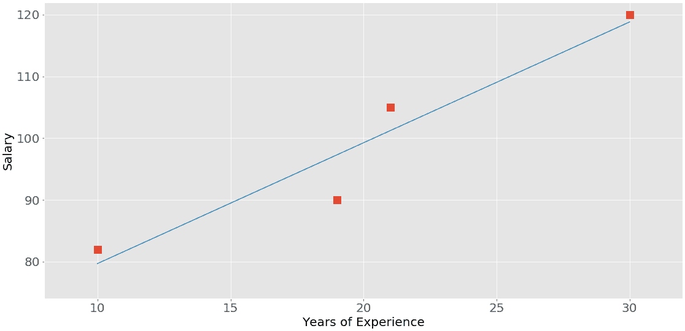
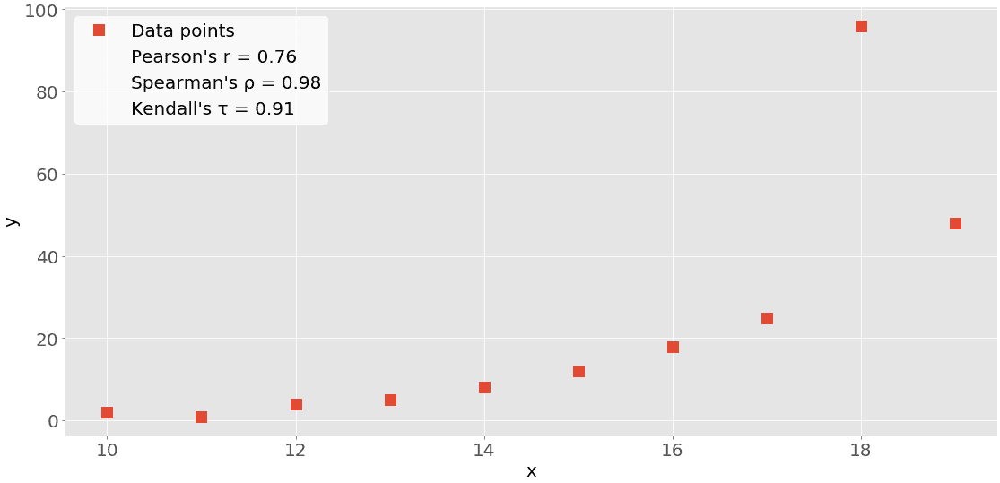
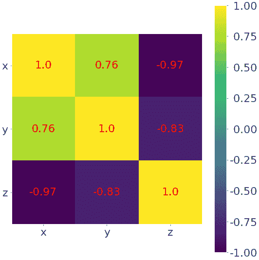

# NumPy、SciPy 和 Pandas:与 Python 的相关性

> 原文：<https://realpython.com/numpy-scipy-pandas-correlation-python/>

**相关系数**量化了[变量](https://realpython.com/python-variables/)或数据集特征之间的关联。这些[统计数据](https://realpython.com/python-statistics/)对于科学和技术非常重要，Python 有很好的工具可以用来计算它们。SciPy 、NumPy 和 [Pandas](https://realpython.com/pandas-python-explore-dataset/) 关联方法快速、全面且有据可查。

在本教程中，您将学习:

*   什么是皮尔森、斯皮尔曼和肯德尔相关系数
*   如何使用 SciPy、NumPy 和 Pandas **相关函数**
*   如何用 Matplotlib 可视化数据、回归线和相关矩阵

您将从解释相关性开始，然后查看三个快速介绍性示例，最后深入研究 NumPy、SciPy 和 Pandas 相关性的细节。

**免费奖励:** [点击此处获取免费的 NumPy 资源指南](#)，它会为您指出提高 NumPy 技能的最佳教程、视频和书籍。

## 相关性

[统计学](https://realpython.com/python-statistics/)和[数据科学](https://realpython.com/tutorials/data-science/)通常关注一个数据集的两个或多个变量(或特征)之间的关系。数据集中的每个数据点是一个**观察**，而**特征**是那些观察的属性或特性。

您使用的每个数据集都使用变量和观察值。例如，您可能有兴趣了解以下内容:

*   篮球运动员的身高[如何与他们的投篮命中率](http://www.nbaminer.com/shooting-ability-and-size/)相关联
*   [员工的工作经历与工资](https://datasciencedegree.wisconsin.edu/data-science/data-scientist-salary/)是否有关系
*   不同国家的[人口密度](https://en.wikipedia.org/wiki/List_of_countries_and_dependencies_by_population_density)和[国内生产总值](https://en.wikipedia.org/wiki/List_of_countries_by_GDP_(nominal))之间存在什么数学相关性

在上面的例子中，身高、射击精度、经验年限、工资、人口密度和国内生产总值是特征或变量。与每个玩家、雇员和每个国家相关的数据是观察值。

当数据以表格的形式表示时，表格的行通常是观察值，而列是特征。看一下这个雇员表:

| 名字 | 多年的经验 | 年薪 |
| --- | --- | --- |
| 安 | Thirty | One hundred and twenty thousand |
| 抢劫 | Twenty-one | One hundred and five thousand |
| 汤姆(男子名) | Nineteen | Ninety thousand |
| 常春藤 | Ten | Eighty-two thousand |

在该表中，每一行代表一个观察结果，或者关于一个雇员(Ann、Rob、Tom 或 Ivy)的数据。每列显示所有雇员的一个属性或特征(姓名、经历或薪水)。

如果你分析一个数据集的任意两个特征，那么你会发现这两个特征之间存在某种类型的**相关性**。请考虑以下数字:

[](https://files.realpython.com/media/py-corr-1.d13ed60a9b91.png)

这些图显示了三种不同形式的相关性之一:

1.  **负相关(红点):**在左边的图中，y 值随着 x 值的增加而减少。这显示了强烈的负相关性，当一个特征的*大*值对应于另一个特征的*小*值时，就会出现这种负相关性，反之亦然。

2.  **相关性弱或无相关性(绿点):**中间的图没有明显的趋势。这是弱相关性的一种形式，当两个特征之间的关联不明显或几乎不可见时，就会出现这种情况。

3.  **正相关(蓝点):**在右边的图中，y 值随着 x 值的增加而增加。这说明了强正相关，当一个特征的*大*值对应于另一个特征的*大*值时，就会出现这种情况，反之亦然。

下图显示了上面的 employee 表中的数据:

[](https://files.realpython.com/media/py-corr-6.dfed6cf1da64.png)

经验和薪水之间的关系是正相关的，因为更高的经验对应着更高的薪水，反之亦然。

**注意:**当你分析相关性时，你应该始终记住**相关性并不表示因果关系**。它量化了数据集要素之间的关系强度。有时，这种关联是由几个感兴趣的特征的共同因素引起的。

相关性与均值、标准差、方差和协方差等其他统计量紧密相关。如果您想了解更多关于这些量以及如何使用 Python 计算它们的信息，请使用 Python 查看[描述性统计。](https://realpython.com/python-statistics/)

有几个统计数据可以用来量化相关性。在本教程中，您将了解三个相关系数:

*   [皮尔逊的 r](https://en.wikipedia.org/wiki/Pearson_correlation_coefficient)
*   [斯皮尔曼的 rho](https://en.wikipedia.org/wiki/Spearman%27s_rank_correlation_coefficient)
*   [肯德尔的τ](https://en.wikipedia.org/wiki/Kendall_rank_correlation_coefficient)

皮尔逊系数衡量线性相关性，而斯皮尔曼和肯德尔系数比较数据的 T2 等级。有几种 NumPy、SciPy 和 Pandas 相关函数和方法可用于计算这些系数。您也可以使用 [Matplotlib](https://matplotlib.org/) 来方便地展示结果。

[*Remove ads*](/account/join/)

## *示例:NumPy 相关计算*

 *[NumPy](https://numpy.org/) 有很多[统计例程](https://docs.scipy.org/doc/numpy/reference/routines.statistics.html)，包括 [`np.corrcoef()`](https://docs.scipy.org/doc/numpy/reference/generated/numpy.corrcoef.html) ，返回皮尔逊相关系数矩阵。您可以从导入 NumPy 并定义两个 NumPy 数组开始。这些是类 [`ndarray`](https://docs.scipy.org/doc/numpy/reference/generated/numpy.ndarray.html) 的实例。称他们为`x`和`y`:

>>>

```py
>>> import numpy as np
>>> x = np.arange(10, 20)
>>> x
array([10, 11, 12, 13, 14, 15, 16, 17, 18, 19])
>>> y = np.array([2, 1, 4, 5, 8, 12, 18, 25, 96, 48])
>>> y
array([ 2,  1,  4,  5,  8, 12, 18, 25, 96, 48])
```

在这里，您使用 [`np.arange()`](https://realpython.com/how-to-use-numpy-arange/) 创建一个数组`x`，其中包含 10(含)到 20(不含)之间的整数。然后使用`np.array()`创建包含任意整数的第二个数组`y`。

一旦有了两个长度相同的数组，就可以调用`np.corrcoef()`并将两个数组都作为参数:

>>>

```py
>>> r = np.corrcoef(x, y)
>>> r
array([[1\.        , 0.75864029],
 [0.75864029, 1\.        ]])
>>> r[0, 1]
0.7586402890911867
>>> r[1, 0]
0.7586402890911869
```

`corrcoef()`返回[相关矩阵](https://www.displayr.com/what-is-a-correlation-matrix/)，这是一个包含相关系数的二维数组。这是您刚刚创建的关联矩阵的简化版本:

```py
 x       y

x    1.00    0.76
y    0.76    1.00
```

相关矩阵主对角线上的值(左上和右下)等于 1。左上角的值对应于`x`和`x`的相关系数，而右下角的值是`y`和`y`的相关系数。它们总是等于 1。

但是，你通常需要的是相关矩阵的左下和右上的值。这些值相等，都代表`x`和`y`的**皮尔逊相关系数**。在这种情况下，它大约是 0.76。

该图显示了上述示例的数据点和相关系数:

[](https://files.realpython.com/media/py-corr-5.2ee03a029ffe.png)

红色方块是数据点。如您所见，该图还显示了三个相关系数的值。

## 示例:SciPy 相关性计算

[SciPy](https://docs.scipy.org/doc/scipy/reference/) 也有很多 [`scipy.stats`](https://docs.scipy.org/doc/scipy/reference/stats.html) 中包含的统计套路。您可以使用以下方法来计算前面看到的三个相关系数:

*   [T2`pearsonr()`](https://docs.scipy.org/doc/scipy/reference/generated/scipy.stats.pearsonr.html)
*   [T2`spearmanr()`](https://docs.scipy.org/doc/scipy/reference/generated/scipy.stats.spearmanr.html)
*   [T2`kendalltau()`](https://docs.scipy.org/doc/scipy/reference/generated/scipy.stats.kendalltau.html)

以下是如何在 Python 中使用这些函数:

>>>

```py
>>> import numpy as np
>>> import scipy.stats
>>> x = np.arange(10, 20)
>>> y = np.array([2, 1, 4, 5, 8, 12, 18, 25, 96, 48])
>>> scipy.stats.pearsonr(x, y)    # Pearson's r
(0.7586402890911869, 0.010964341301680832)
>>> scipy.stats.spearmanr(x, y)   # Spearman's rho
SpearmanrResult(correlation=0.9757575757575757, pvalue=1.4675461874042197e-06)
>>> scipy.stats.kendalltau(x, y)  # Kendall's tau
KendalltauResult(correlation=0.911111111111111, pvalue=2.9761904761904762e-05)
```

请注意，这些函数返回包含两个值的对象:

1.  相关系数
2.  [p 值](https://en.wikipedia.org/wiki/P-value)

当你测试一个假设时，你在统计方法中使用 **p 值**。p 值是一个重要的测量值，需要深入的概率和统计知识来解释。要了解更多，你可以阅读[的基础知识](https://www.statsdirect.com/help/basics/p_values.htm)，或者查看[一位数据科学家对 p 值](https://towardsdatascience.com/p-values-explained-by-data-scientist-f40a746cfc8)的解释。

您可以提取 p 值和相关系数及其索引，作为[元组](https://realpython.com/python-lists-tuples/)的项目:

>>>

```py
>>> scipy.stats.pearsonr(x, y)[0]    # Pearson's r
0.7586402890911869
>>> scipy.stats.spearmanr(x, y)[0]   # Spearman's rho
0.9757575757575757
>>> scipy.stats.kendalltau(x, y)[0]  # Kendall's tau
0.911111111111111
```

您也可以对 Spearman 和 Kendall 系数使用点符号:

>>>

```py
>>> scipy.stats.spearmanr(x, y).correlation   # Spearman's rho
0.9757575757575757
>>> scipy.stats.kendalltau(x, y).correlation  # Kendall's tau
0.911111111111111
```

点符号更长，但是可读性更强，也更容易理解。

如果想同时得到皮尔逊相关系数和 p 值，那么可以解包返回值:

>>>

```py
>>> r, p = scipy.stats.pearsonr(x, y)
>>> r
0.7586402890911869
>>> p
0.010964341301680829
```

这种方法利用了 [Python 解包](https://realpython.com/lessons/tuple-assignment-packing-unpacking/)和`pearsonr()`用这两个统计数据返回一个元组的事实。你也可以对`spearmanr()`和`kendalltau()`使用这种技术，稍后你会看到。

[*Remove ads*](/account/join/)

## *示例:熊猫相关性计算*

 *[熊猫](https://pandas.pydata.org/)在某些情况下比 NumPy 和 SciPy 更方便计算统计数据。提供了 [`Series`](https://pandas.pydata.org/pandas-docs/stable/reference/series.html#computations-descriptive-stats) 和 [`DataFrame`](https://pandas.pydata.org/pandas-docs/stable/reference/frame.html#computations-descriptive-stats) 实例的统计方法。例如，给定两个具有相同项数的`Series`对象，您可以对其中一个调用 [`.corr()`](https://pandas.pydata.org/pandas-docs/stable/reference/api/pandas.Series.corr.html) ，并将另一个作为第一个参数:

>>>

```py
>>> import pandas as pd
>>> x = pd.Series(range(10, 20))
>>> x
0    10
1    11
2    12
3    13
4    14
5    15
6    16
7    17
8    18
9    19
dtype: int64
>>> y = pd.Series([2, 1, 4, 5, 8, 12, 18, 25, 96, 48])
>>> y
0     2
1     1
2     4
3     5
4     8
5    12
6    18
7    25
8    96
9    48
dtype: int64
>>> x.corr(y)                     # Pearson's r
0.7586402890911867
>>> y.corr(x)
0.7586402890911869
>>> x.corr(y, method='spearman')  # Spearman's rho
0.9757575757575757
>>> x.corr(y, method='kendall')   # Kendall's tau
0.911111111111111
```

这里，您使用`.corr()`来计算所有三个相关系数。您可以用参数`method`定义所需的统计数据，该参数可以取几个值中的一个:

*   `'pearson'`
*   `'spearman'`
*   `'kendall'`
*   可赎回债券

可调用对象可以是任何函数、方法或带有`.__call__()` 的[对象，它接受两个一维数组并返回一个浮点数。](https://docs.python.org/3/reference/datamodel.html#emulating-callable-objects)

## 线性相关性

**线性相关性**测量变量或数据集特征与线性函数之间的数学关系的接近程度。如果两个特征之间的关系更接近某个线性函数，那么它们的线性相关性更强，相关系数的[绝对值](https://realpython.com/python-absolute-value/)更高。

### 皮尔逊相关系数

考虑一个具有两个特征的数据集: **x** 和 **y** 。每个特征有 n 个值，所以 **x** 和 **y** 是 n 元组。假设来自 **x** 的第一个值 x₁对应于来自 **y** 的第一个值 y₁，来自 **x** 的第二个值 x₂对应于来自 **y** 的第二个值 y₂，以此类推。然后，有 n 对对应的值:(x₁，y₁)，(x₂，y₂)，等等。这些 x-y 对中的每一对代表一个单独的观察。

**皮尔逊(乘积矩)相关系数**是两个特征之间线性关系的度量。它是 **x** 和 **y** 的协方差与它们标准差的乘积之比。它通常用字母 r 表示，并被称为**皮尔逊 r** 。您可以用下面的等式用数学方法表示该值:

r =σᵢ((xᵢmean(x))(yᵢ均值(y)))(√σᵢ(xᵢ均值(x))√σᵢ(yᵢ均值(y)) )⁻

这里，I 取值 1，2，…，n。**x**和 **y** 的[平均值](https://realpython.com/python-statistics/#measures-of-central-tendency)用 mean(x)和 mean(y)表示。该公式表明，如果较大的 x 值倾向于对应于较大的 y 值，反之亦然，则 r 为正。另一方面，如果较大的 x 值通常与较小的 y 值相关联，反之亦然，则 r 为负。

以下是关于皮尔逊相关系数的一些重要事实:

*   皮尔逊相关系数可以是 1 ≤ r ≤ 1 范围内的任何实数值。

*   最大值 r = 1 对应于 **x** 和 **y** 之间存在完美的正线性关系的情况。换句话说，较大的 x 值对应于较大的 y 值，反之亦然。

*   值 r > 0 表示 **x** 和 **y** 之间正相关。

*   值 r = 0 对应于 **x** 和 **y** 之间没有线性关系的情况。

*   值 r < 0 indicates negative correlation between **x** 和 **y** 。

*   最小值 r = 1 对应于 **x** 和 **y** 之间存在完美的负线性关系的情况。换句话说，较大的 x 值对应于较小的 y 值，反之亦然。

上述事实可以归纳在下表中:

| 皮尔逊 r 值 | **x** 和 **y** 之间的相关性 |
| --- | --- |
| 等于 1 | 完美正线性关系 |
| 大于 0 | 正相关 |
| 等于 0 | 没有线性关系 |
| 小于 0 | 负相关 |
| 等于-1 | 完美负线性关系 |

简而言之，r 的绝对值越大，相关性越强，越接近线性函数。r 的绝对值越小，表示相关性越弱。

### 线性回归:SciPy 实现

[线性回归](https://realpython.com/linear-regression-in-python/)是寻找尽可能接近特征间实际关系的线性函数的过程。换句话说，您确定了最能描述特征之间关联的线性函数。这个线性函数也被称为[回归线](https://realpython.com/linear-regression-in-python/#simple-linear-regression)。

可以用 SciPy 实现线性回归。您将获得最接近两个数组之间关系的线性函数，以及皮尔逊相关系数。首先，您需要导入库并准备一些要使用的数据:

>>>

```py
>>> import numpy as np
>>> import scipy.stats
>>> x = np.arange(10, 20)
>>> y = np.array([2, 1, 4, 5, 8, 12, 18, 25, 96, 48])
```

在这里，您导入`numpy`和`scipy.stats`并定义变量`x`和`y`。

可以使用 [`scipy.stats.linregress()`](https://docs.scipy.org/doc/scipy/reference/generated/scipy.stats.linregress.html) 对两个长度相同的数组进行线性回归。您应该将数组作为参数提供，并使用点标记法获得输出:

>>>

```py
>>> result = scipy.stats.linregress(x, y)
>>> result.slope
7.4363636363636365
>>> result.intercept
-85.92727272727274
>>> result.rvalue
0.7586402890911869
>>> result.pvalue
0.010964341301680825
>>> result.stderr
2.257878767543913
```

就是这样！您已经完成了线性回归，并获得了以下结果:

*   **`.slope` :** 回归线的斜率
*   **`.intercept` :** 回归线的截距
*   **`.pvalue`:**p 值
*   **`.stderr` :** 估计梯度的[标准误差](http://onlinestatbook.com/2/regression/accuracy.html)

您将在后面的小节中学习如何可视化这些结果。

您也可以向`linregress()`提供单个参数，但它必须是一个二维数组，其中一个维度的长度为 2:

>>>

```py
>>> xy = np.array([[10, 11, 12, 13, 14, 15, 16, 17, 18, 19],
...                [2, 1, 4, 5, 8, 12, 18, 25, 96, 48]])
>>> scipy.stats.linregress(xy)
LinregressResult(slope=7.4363636363636365, intercept=-85.92727272727274, rvalue=0.7586402890911869, pvalue=0.010964341301680825, stderr=2.257878767543913)
```

结果与前面的例子完全相同，因为`xy`包含的数据与`x`和`y`包含的数据相同。`linregress()`将`xy`的第一行作为一个特征，第二行作为另一个特征。

**注意:**在上面的例子中，`scipy.stats.linregress()`认为行是特征，列是观察值。那是因为有两排。

在[机器学习](https://realpython.com/tutorials/machine-learning/)中通常的做法是相反的:行是观察，列是特征。许多机器学习库，如熊猫、 [Scikit-Learn](https://scikit-learn.org/stable/) 、 [Keras](https://keras.io/) 等，都遵循这一惯例。

在分析数据集中的相关性时，您应该注意观察值和要素是如何表示的。

如果您提供`xy`的[转置](https://en.wikipedia.org/wiki/Transpose)，或者一个 10 行 2 列的 NumPy 数组，`linregress()`将返回相同的结果。在 NumPy 中，您可以通过多种方式转置矩阵:

*   [T2`transpose()`](https://docs.scipy.org/doc/numpy/reference/generated/numpy.transpose.html)
*   [T2`.transpose()`](https://docs.scipy.org/doc/numpy/reference/generated/numpy.ndarray.transpose.html)
*   [T2`.T`](https://docs.scipy.org/doc/numpy/reference/generated/numpy.ndarray.T.html)

你可以这样移调`xy`:

>>>

```py
>>> xy.T
array([[10,  2],
 [11,  1],
 [12,  4],
 [13,  5],
 [14,  8],
 [15, 12],
 [16, 18],
 [17, 25],
 [18, 96],
 [19, 48]])
```

现在你知道如何得到转置，你可以传递一个给`linregress()`。第一列是一个特征，第二列是另一个特征:

>>>

```py
>>> scipy.stats.linregress(xy.T)
LinregressResult(slope=7.4363636363636365, intercept=-85.92727272727274, rvalue=0.7586402890911869, pvalue=0.010964341301680825, stderr=2.257878767543913)
```

这里用`.T`得到`xy`的转置。`linregress()`的工作方式与`xy`及其转置相同。它通过沿着长度为 2 的维度分割数组来提取特征。

您还应该注意数据集是否包含缺失值。在数据科学和机器学习中，您经常会发现一些丢失或损坏的数据。在 Python、NumPy、SciPy 和 Pandas 中表示它的通常方式是使用 [NaN](https://en.wikipedia.org/wiki/NaN) 或**而不是数字**值。但是如果您的数据包含`nan`值，那么您将无法使用`linregress()`得到有用的结果:

>>>

```py
>>> scipy.stats.linregress(np.arange(3), np.array([2, np.nan, 5]))
LinregressResult(slope=nan, intercept=nan, rvalue=nan, pvalue=nan, stderr=nan)
```

在这种情况下，结果对象返回所有的`nan`值。在 Python 中，`nan`是一个特殊的浮点值，可以通过使用以下任意一种方法获得:

*   [T2`float('nan')`](https://docs.python.org/3/library/functions.html#float)
*   [T2`math.nan`](https://docs.python.org/3/library/math.html#math.nan)
*   [T2`numpy.nan`](https://docs.scipy.org/doc/numpy/reference/constants.html#numpy.nan)

你也可以用 [`math.isnan()`](https://docs.python.org/3.7/library/math.html#math.isnan) 或者 [`numpy.isnan()`](https://docs.scipy.org/doc/numpy/reference/generated/numpy.isnan.html) 来检查一个变量是否对应`nan`。

[*Remove ads*](/account/join/)

### *皮尔逊相关性:NumPy 和 SciPy 实现*

 *你已经看到了如何用`corrcoef()`和`pearsonr()`得到皮尔逊相关系数:

>>>

```py
>>> r, p = scipy.stats.pearsonr(x, y)
>>> r
0.7586402890911869
>>> p
0.010964341301680829
>>> np.corrcoef(x, y)
array([[1\.        , 0.75864029],
 [0.75864029, 1\.        ]])
```

注意，如果你给`pearsonr()`提供一个带有`nan`值的数组，你将得到一个 [`ValueError`](https://docs.python.org/3/library/exceptions.html#ValueError) 。

很少有额外的细节值得考虑。首先，回想一下`np.corrcoef()`可以接受两个 NumPy 数组作为参数。相反，您可以传递一个具有与参数相同值的二维数组:

>>>

```py
>>> np.corrcoef(xy)
array([[1\.        , 0.75864029],
 [0.75864029, 1\.        ]])
```

这个例子和前面的例子的结果是一样的。同样，`xy`的第一行代表一个特性，而第二行代表另一个特性。

如果您想要获得三个特征的相关系数，那么您只需提供一个带有三行作为参数的数值二维数组:

>>>

```py
>>> xyz = np.array([[10, 11, 12, 13, 14, 15, 16, 17, 18, 19],
...                 [2, 1, 4, 5, 8, 12, 18, 25, 96, 48],
...                 [5, 3, 2, 1, 0, -2, -8, -11, -15, -16]])
>>> np.corrcoef(xyz)
array([[ 1\.        ,  0.75864029, -0.96807242],
 [ 0.75864029,  1\.        , -0.83407922],
 [-0.96807242, -0.83407922,  1\.        ]])
```

您将再次获得相关矩阵，但这个矩阵将比前几个大:

```py
 x        y        z

x     1.00     0.76    -0.97
y     0.76     1.00    -0.83
z    -0.97    -0.83     1.00
```

这是因为`corrcoef()`将`xyz`的每一行视为一个特征。值`0.76`是`xyz`的前两个特征的相关系数。这与前面例子中的`x`和`y`的系数相同。`-0.97`表示第一个和第三个特征的皮尔逊 r，而`-0.83`是后两个特征的皮尔逊 r。

下面是一个有趣的例子，说明当您将`nan`数据传递给`corrcoef()`时会发生什么:

>>>

```py
>>> arr_with_nan = np.array([[0, 1, 2, 3],
...                          [2, 4, 1, 8],
...                          [2, 5, np.nan, 2]])
>>> np.corrcoef(arr_with_nan)
array([[1\.        , 0.62554324,        nan],
 [0.62554324, 1\.        ,        nan],
 [       nan,        nan,        nan]])
```

在这个例子中，`arr_with_nan`的前两行(或特征)是可以的，但是第三行`[2, 5, np.nan, 2]`包含一个`nan`值。不包括带`nan`的特性的都算好了。然而，取决于最后一行的结果是`nan`。

默认情况下，`numpy.corrcoef()`将行视为特征，将列视为观察值。如果您想要相反的行为，这在机器学习中广泛使用，那么使用参数`rowvar=False`:

>>>

```py
>>> xyz.T
array([[ 10,   2,   5],
 [ 11,   1,   3],
 [ 12,   4,   2],
 [ 13,   5,   1],
 [ 14,   8,   0],
 [ 15,  12,  -2],
 [ 16,  18,  -8],
 [ 17,  25, -11],
 [ 18,  96, -15],
 [ 19,  48, -16]])
>>> np.corrcoef(xyz.T, rowvar=False)
array([[ 1\.        ,  0.75864029, -0.96807242],
 [ 0.75864029,  1\.        , -0.83407922],
 [-0.96807242, -0.83407922,  1\.        ]])
```

该数组与您之前看到的数组相同。这里，您应用了不同的约定，但是结果是相同的。

### 皮尔逊相关性:熊猫实施

到目前为止，您已经使用了`Series`和`DataFrame`对象方法来计算相关系数。让我们更详细地探讨这些方法。首先，您需要导入熊猫并创建一些`Series`和`DataFrame`的实例:

>>>

```py
>>> import pandas as pd
>>> x = pd.Series(range(10, 20))
>>> x
0    10
1    11
2    12
3    13
4    14
5    15
6    16
7    17
8    18
9    19
dtype: int64
>>> y = pd.Series([2, 1, 4, 5, 8, 12, 18, 25, 96, 48])
>>> y
0     2
1     1
2     4
3     5
4     8
5    12
6    18
7    25
8    96
9    48
dtype: int64
>>> z = pd.Series([5, 3, 2, 1, 0, -2, -8, -11, -15, -16])
>>> z
0     5
1     3
2     2
3     1
4     0
5    -2
6    -8
7   -11
8   -15
9   -16
dtype: int64
>>> xy = pd.DataFrame({'x-values': x, 'y-values': y})
>>> xy
 x-values  y-values
0        10         2
1        11         1
2        12         4
3        13         5
4        14         8
5        15        12
6        16        18
7        17        25
8        18        96
9        19        48
>>> xyz = pd.DataFrame({'x-values': x, 'y-values': y, 'z-values': z})
>>> xyz
 x-values  y-values  z-values
0        10         2         5
1        11         1         3
2        12         4         2
3        13         5         1
4        14         8         0
5        15        12        -2
6        16        18        -8
7        17        25       -11
8        18        96       -15
9        19        48       -16
```

您现在有三个名为`x`、`y`和`z`的`Series`对象。你也有两个`DataFrame`对象，`xy`和`xyz`。

**注意:**当您使用`DataFrame`实例时，您应该知道行是观察值，列是特征。这与机器学习中的惯例是一致的。

您已经学习了如何使用`.corr()`和`Series`对象来获得皮尔逊相关系数:

>>>

```py
>>> x.corr(y)
0.7586402890911867
```

这里，您对一个对象调用`.corr()`,并将另一个作为第一个参数传递。

如果您提供一个`nan`值，那么`.corr()`将仍然工作，但是它将排除包含`nan`值的观察值:

>>>

```py
>>> u, u_with_nan = pd.Series([1, 2, 3]), pd.Series([1, 2, np.nan, 3])
>>> v, w = pd.Series([1, 4, 8]), pd.Series([1, 4, 154, 8])
>>> u.corr(v)
0.9966158955401239
>>> u_with_nan.corr(w)
0.9966158955401239
```

在这两个例子中，你会得到相同的相关系数。这是因为`.corr()`忽略了一对缺少值的值(`np.nan`，`154`)。

也可以将 [`.corr()`](https://pandas.pydata.org/pandas-docs/stable/reference/api/pandas.DataFrame.corr.html) 与`DataFrame`对象搭配使用。您可以使用它来获得它们的列的相关矩阵:

>>>

```py
>>> corr_matrix = xy.corr()
>>> corr_matrix
 x-values  y-values
x-values   1.00000   0.75864
y-values   0.75864   1.00000
```

得到的相关矩阵是`DataFrame`的一个新实例，保存了列`xy['x-values']`和`xy['y-values']`的相关系数。这种带标签的结果通常非常便于使用，因为您可以使用它们的标签或整数位置索引来访问它们:

>>>

```py
>>> corr_matrix.at['x-values', 'y-values']
0.7586402890911869
>>> corr_matrix.iat[0, 1]
0.7586402890911869
```

此示例显示了访问值的两种方式:

1.  使用 [`.at[]`](https://pandas.pydata.org/pandas-docs/stable/reference/api/pandas.DataFrame.at.html) 通过行和列标签访问单个值。
2.  使用 [`.iat[]`](https://pandas.pydata.org/pandas-docs/stable/reference/api/pandas.DataFrame.iat.html) 通过行和列的位置访问一个值。

对于包含三列或更多列的`DataFrame`对象，您可以以同样的方式应用`.corr()`:

>>>

```py
>>> xyz.corr()
 x-values  y-values  z-values
x-values  1.000000  0.758640 -0.968072
y-values  0.758640  1.000000 -0.834079
z-values -0.968072 -0.834079  1.000000
```

您将获得具有以下相关系数的相关矩阵:

*   `0.758640`为`x-values`和`y-values`
*   `-0.968072`为`x-values`和`z-values`
*   `-0.834079`为`y-values`和`z-values`

另一个有用的方法是 [`.corrwith()`](https://pandas.pydata.org/pandas-docs/stable/reference/api/pandas.DataFrame.corrwith.html) ，它允许您计算一个 DataFrame 对象的行或列与作为第一个参数传递的另一个系列或 DataFrame 对象之间的相关系数:

>>>

```py
>>> xy.corrwith(z)
x-values   -0.968072
y-values   -0.834079
dtype: float64
```

在这种情况下，结果是一个新的`Series`对象，它具有列`xy['x-values']`的相关系数和`z`的值，以及`xy['y-values']`和`z`的系数。

`.corrwith()`有一个可选参数`axis`,用于指定是用列还是行来表示特征。`axis`的默认值为 0，也默认为表示特征的列。还有一个`drop`参数，它指示如何处理丢失的值。

`.corr()`和`.corrwith()`都有可选参数`method`来指定想要计算的相关系数。默认情况下会返回皮尔逊相关系数，因此在这种情况下不需要提供它。

[*Remove ads*](/account/join/)

## *等级相关性*

 ***等级相关性**比较与两个变量或数据集特征相关的数据的等级或排序。如果排序相似，那么相关性是强的、正的和高的。然而，如果顺序接近颠倒，那么相关性是强的、负的和低的。换句话说，等级相关性只与值的顺序有关，而与数据集中的特定值无关。

为了说明线性相关和等级相关之间的区别，请考虑下图:

[](https://files.realpython.com/media/py-corr-2.ac1acc7812d0.png)

左图在 **x** 和 **y** 之间有一个完美的正线性关系，所以 r = 1。中间的图显示正相关，右边的图显示负相关。然而，它们都不是线性函数，因此 r 不同于 1 或 1。

当你只看等级的时候，这三种关系都是完美的！左侧和中间的图显示了较大的 x 值总是对应于较大的 y 值的观察结果。这是完美的正等级相关。右边的图说明了相反的情况，这是完美的负秩相关。

### 斯皮尔曼相关系数

两个特征之间的 **Spearman 相关系数**是它们等级值之间的 Pearson 相关系数。它的计算方式与皮尔逊相关系数相同，但考虑了他们的排名而不是他们的价值。它通常用希腊字母 rho (ρ)表示，并被称为**斯皮尔曼的 rho** 。

假设您有两个 n 元组， **x** 和 **y** ，其中`(x₁, y₁), (x₂, y₂), …`是作为对应值对的观察值。可以用与皮尔逊系数相同的方法计算斯皮尔曼相关系数ρ。您将使用等级而不是来自 **x** 和 **y** 的实际值。

以下是关于斯皮尔曼相关系数的一些重要事实:

*   它可以取 1 ≤ ρ ≤ 1 范围内的实值。

*   其最大值ρ = 1 对应于在 **x** 和 **y** 之间存在一个单调递增函数[的情况。换句话说，较大的 x 值对应于较大的 y 值，反之亦然。](https://en.wikipedia.org/wiki/Monotonic_function)

*   其最小值ρ= 1 对应于 **x** 和 **y** 之间存在单调递减函数的情况。换句话说，较大的 x 值对应于较小的 y 值，反之亦然。

您可以用 Python 计算 Spearman 的 rho，方法与计算 Pearson 的 r 非常相似。

### 肯德尔相关系数

让我们从考虑两个 n 元组开始， **x** 和 **y** 。每个 x-y 对`(x₁, y₁), (x₂, y₂), …`都是一个单独的观察值。一对观测值(xᵢ，yᵢ)和(xⱼ，yⱼ)，其中 i < j，将是三件事之一:

*   如果(xᵢ > xⱼ和 yᵢ > yⱼ)或(xᵢ < xⱼ和 yᵢ < yⱼ)中的任何一个
*   **不和谐**如果是(xᵢ < xⱼ和 yᵢ > yⱼ)或者(xᵢ > xⱼ和 yᵢ < yⱼ)
*   **如果在 **x** (xᵢ = xⱼ)或 **y** (yᵢ = yⱼ)出现平局，则不会出现**

**肯德尔相关系数**比较一致和不一致数据对的数量。该系数基于相对于 x-y 对数量的一致和不一致对的计数差异。它通常用希腊字母 tau (τ)表示，并被称为**肯德尔的 tau** 。

根据 [`scipy.stats`官方文件](https://docs.scipy.org/doc/scipy/reference/generated/scipy.stats.kendalltau.html)，肯德尔相关系数计算为τ=(n⁺-n⁻)/√((n⁺+n⁻+nˣ)(n⁺+n⁻+nʸ)，其中:

*   n⁺是和谐对的数量
*   n⁻是不和谐对的数量
*   nˣ是仅在 **x** 中的联系数
*   nʸ是仅在 **y** 的联系数

如果在 **x** 和 **y** 都出现平局，那么它不包括在 nˣ或 nʸ.

关于肯德尔秩相关系数的[维基百科页面](https://en.wikipedia.org/wiki/Kendall_rank_correlation_coefficient)给出了如下表达式:τ=(2/(n(n1)))σᵢⱼ(sign(xᵢxⱼ)sign(yᵢyⱼ)对于 i < j，其中 i = 1，2，…，n1，j = 2，3，…，n，符号函数 sign(z)如果 z < 0 则为 1，如果 z = 0 则为 0，如果 z > 0 则为 1。n(n1)/2 是 x-y 对的总数。

关于肯德尔相关系数的一些重要事实如下:

*   它可以取 1 ≤ τ ≤ 1 范围内的实值。

*   其最大值τ = 1 对应于 **x** 和 **y** 中对应值的秩相同的情况。换句话说，所有的配对都是一致的。

*   其最小值τ= 1 对应于 **x** 中的等级与 **y** 中的等级相反的情况。换句话说，所有对都是不和谐的。

可以用 Python 计算 Kendall 的 tau，类似于计算 Pearson 的 r。

[*Remove ads*](/account/join/)

### *等级:SciPy 实现*

 *您可以使用`scipy.stats`来确定数组中每个值的等级。首先，您将导入库并创建 NumPy 数组:

>>>

```py
>>> import numpy as np
>>> import scipy.stats
>>> x = np.arange(10, 20)
>>> y = np.array([2, 1, 4, 5, 8, 12, 18, 25, 96, 48])
>>> z = np.array([5, 3, 2, 1, 0, -2, -8, -11, -15, -16])
```

现在您已经准备好了数据，您可以使用 [`scipy.stats.rankdata()`](https://docs.scipy.org/doc/scipy/reference/generated/scipy.stats.rankdata.html) 来确定 NumPy 数组中每个值的排名:

>>>

```py
>>> scipy.stats.rankdata(x)
array([ 1.,  2.,  3.,  4.,  5.,  6.,  7.,  8.,  9., 10.])
>>> scipy.stats.rankdata(y)
array([ 2.,  1.,  3.,  4.,  5.,  6.,  7.,  8., 10.,  9.])
>>> scipy.stats.rankdata(z)
array([10.,  9.,  8.,  7.,  6.,  5.,  4.,  3.,  2.,  1.])
```

数组`x`和`z`是单调的，因此它们的秩也是单调的。`y`中的最小值是`1`，对应的是等级`1`。第二小的是`2`，对应的是排名`2`。最大的值是`96`，它对应于最大的等级`10`，因为数组中有 10 个项目。

`rankdata()`有可选参数`method`。这告诉 Python 如果数组中有平局该怎么办(如果两个或更多值相等)。默认情况下，它会为他们分配平均等级:

>>>

```py
>>> scipy.stats.rankdata([8, 2, 0, 2])
array([4\. , 2.5, 1\. , 2.5])
```

有两个值为`2`的元素，它们的等级为`2.0`和`3.0`。值`0`的等级为`1.0`，值`8`的等级为`4.0`。然后，值为`2`的两个元素将获得相同的等级`2.5`。

`rankdata()`视`nan`值为大值:

>>>

```py
>>> scipy.stats.rankdata([8, np.nan, 0, 2])
array([3., 4., 1., 2.])
```

在这种情况下，值`np.nan`对应于最大等级`4.0`。你也可以用 [`np.argsort()`](https://docs.scipy.org/doc/numpy/reference/generated/numpy.argsort.html) 获得军衔:

>>>

```py
>>> np.argsort(y) + 1
array([ 2,  1,  3,  4,  5,  6,  7,  8, 10,  9])
```

`argsort()`返回数组项在排序数组中的索引。这些索引是从零开始的，所以你需要给它们都加上`1`。

### 等级关联:NumPy 和 SciPy 实现

可以用`scipy.stats.spearmanr()`计算斯皮尔曼相关系数:

>>>

```py
>>> result = scipy.stats.spearmanr(x, y)
>>> result
SpearmanrResult(correlation=0.9757575757575757, pvalue=1.4675461874042197e-06)
>>> result.correlation
0.9757575757575757
>>> result.pvalue
1.4675461874042197e-06
>>> rho, p = scipy.stats.spearmanr(x, y)
>>> rho
0.9757575757575757
>>> p
1.4675461874042197e-06
```

`spearmanr()`返回一个包含 Spearman 相关系数和 p 值的对象。如您所见，您可以通过两种方式访问特定值:

1.  使用点符号(`result.correlation`和`result.pvalue`)
2.  使用 Python 解包(`rho, p = scipy.stats.spearmanr(x, y)`)

如果提供包含与`x`和`y`到`spearmanr()`相同数据的二维数组`xy`，也可以得到相同的结果:

>>>

```py
>>> xy = np.array([[10, 11, 12, 13, 14, 15, 16, 17, 18, 19],
...                [2, 1, 4, 5, 8, 12, 18, 25, 96, 48]])
>>> rho, p = scipy.stats.spearmanr(xy, axis=1)
>>> rho
0.9757575757575757
>>> p
1.4675461874042197e-06
```

`xy`第一行是一个特征，第二行是另一个特征。您可以对此进行修改。可选参数`axis`决定是列(`axis=0`)还是行(`axis=1`)表示特征。默认行为是行是观测值，列是要素。

另一个可选参数`nan_policy`定义了如何处理`nan`值。它可以取三个值之一:

*   如果输入中有一个`nan`值，则 **`'propagate'`** 返回`nan`。这是默认行为。
*   如果输入中有一个`nan`值，则 **`'raise'`** 会产生一个`ValueError`。
*   **`'omit'`** 忽略带有`nan`值的观测值。

如果您提供一个包含两个以上要素的二维数组，那么您将获得相关矩阵和 p 值矩阵:

>>>

```py
>>> xyz = np.array([[10, 11, 12, 13, 14, 15, 16, 17, 18, 19],
...                 [2, 1, 4, 5, 8, 12, 18, 25, 96, 48],
...                 [5, 3, 2, 1, 0, -2, -8, -11, -15, -16]])
>>> corr_matrix, p_matrix = scipy.stats.spearmanr(xyz, axis=1)
>>> corr_matrix
array([[ 1\.        ,  0.97575758, -1\.        ],
 [ 0.97575758,  1\.        , -0.97575758],
 [-1\.        , -0.97575758,  1\.        ]])
>>> p_matrix
array([[6.64689742e-64, 1.46754619e-06, 6.64689742e-64],
 [1.46754619e-06, 6.64689742e-64, 1.46754619e-06],
 [6.64689742e-64, 1.46754619e-06, 6.64689742e-64]])
```

相关矩阵中的值`-1`示出了第一和第三特征具有完美的负秩相关，即第一行中的较大值总是对应于第三行中的较小值。

你可以用`kendalltau()`得到肯德尔相关系数:

>>>

```py
>>> result = scipy.stats.kendalltau(x, y)
>>> result
KendalltauResult(correlation=0.911111111111111, pvalue=2.9761904761904762e-05)
>>> result.correlation
0.911111111111111
>>> result.pvalue
2.9761904761904762e-05
>>> tau, p = scipy.stats.kendalltau(x, y)
>>> tau
0.911111111111111
>>> p
2.9761904761904762e-05
```

`kendalltau()`的工作方式很像`spearmanr()`。它接受两个一维数组，有可选参数`nan_policy`，并返回一个包含相关系数和 p 值的对象。

但是，如果你只提供一个二维数组作为参数，那么`kendalltau()`将会引发一个 [`TypeError`](https://docs.python.org/3/library/exceptions.html#TypeError) 。如果你传递两个相同形状的多维数组，那么它们会在计算前被展平。

[*Remove ads*](/account/join/)

### *等级关联:熊猫实现*

 *你可以用熊猫来计算斯皮尔曼和肯德尔相关系数。就像之前一样，首先导入`pandas`并创建一些`Series`和`DataFrame`实例:

>>>

```py
>>> import pandas as pd
>>> x, y, z = pd.Series(x), pd.Series(y), pd.Series(z)
>>> xy = pd.DataFrame({'x-values': x, 'y-values': y})
>>> xyz = pd.DataFrame({'x-values': x, 'y-values': y, 'z-values': z})
```

现在您有了这些熊猫对象，您可以使用`.corr()`和`.corrwith()`，就像您在计算皮尔逊相关系数时所做的那样。你只需要用可选参数`method`指定想要的相关系数，默认为`'pearson'`。

要计算 Spearman 的 rho，请通过`method=spearman`:

>>>

```py
>>> x.corr(y, method='spearman')
0.9757575757575757
>>> xy.corr(method='spearman')
 x-values  y-values
x-values  1.000000  0.975758
y-values  0.975758  1.000000
>>> xyz.corr(method='spearman')
 x-values  y-values  z-values
x-values  1.000000  0.975758 -1.000000
y-values  0.975758  1.000000 -0.975758
z-values -1.000000 -0.975758  1.000000
>>> xy.corrwith(z, method='spearman')
x-values   -1.000000
y-values   -0.975758
dtype: float64
```

如果你想要肯德尔的τ，那么你用`method=kendall`:

>>>

```py
>>> x.corr(y, method='kendall')
0.911111111111111
>>> xy.corr(method='kendall')
 x-values  y-values
x-values  1.000000  0.911111
y-values  0.911111  1.000000
>>> xyz.corr(method='kendall')
 x-values  y-values  z-values
x-values  1.000000  0.911111 -1.000000
y-values  0.911111  1.000000 -0.911111
z-values -1.000000 -0.911111  1.000000
>>> xy.corrwith(z, method='kendall')
x-values   -1.000000
y-values   -0.911111
dtype: float64
```

如您所见，与 SciPy 不同，您可以使用单一的二维数据结构(dataframe)。

## 相关性的可视化

**数据可视化**在统计学和数据科学中非常重要。它可以帮助您更好地理解数据，并让您更好地了解要素之间的关系。在本节中，您将学习如何用 x-y 图直观地表示两个要素之间的关系。您还将使用热图来可视化关联矩阵。

您将学习如何准备数据和获得某些可视化表示，但不会涉及许多其他解释。要深入了解 Matplotlib，请查看 [Python 使用 Matplotlib 绘图(指南)](https://realpython.com/python-matplotlib-guide/)。还可以看看[官方文档](https://matplotlib.org/contents.html)和[解剖 Matplotlib](https://github.com/matplotlib/AnatomyOfMatplotlib) 。

要开始，首先导入`matplotlib.pyplot`:

>>>

```py
>>> import matplotlib.pyplot as plt
>>> plt.style.use('ggplot')
```

这里，您使用`plt.style.use('ggplot')`来设置图形的样式。如果你愿意，可以跳过这一行。

您将使用前面章节中的数组`x`、`y`、`z`和`xyz`。您可以再次创建它们以减少滚动次数:

>>>

```py
>>> import numpy as np
>>> import scipy.stats
>>> x = np.arange(10, 20)
>>> y = np.array([2, 1, 4, 5, 8, 12, 18, 25, 96, 48])
>>> z = np.array([5, 3, 2, 1, 0, -2, -8, -11, -15, -16])
>>> xyz = np.array([[10, 11, 12, 13, 14, 15, 16, 17, 18, 19],
...                 [2, 1, 4, 5, 8, 12, 18, 25, 96, 48],
...                 [5, 3, 2, 1, 0, -2, -8, -11, -15, -16]])
```

现在你已经得到了数据，你可以开始绘图了。

### 带回归线的 X-Y 图

首先，您将看到如何使用回归线、其方程和皮尔逊相关系数创建 x-y 图。用`linregress()`可以得到回归线的斜率和截距，以及相关系数:

>>>

```py
>>> slope, intercept, r, p, stderr = scipy.stats.linregress(x, y)
```

现在你有了你需要的所有值。也可以用回归线的方程和相关系数的值得到字符串。为此，f 弦非常方便:

>>>

```py
>>> line = f'Regression line: y={intercept:.2f}+{slope:.2f}x, r={r:.2f}'
>>> line
'Regression line: y=-85.93+7.44x, r=0.76'
```

现在，用 [`.plot()`](https://matplotlib.org/3.1.1/api/_as_gen/matplotlib.axes.Axes.plot.html) 创建 x-y 图:

```py
fig, ax = plt.subplots()
ax.plot(x, y, linewidth=0, marker='s', label='Data points')
ax.plot(x, intercept + slope * x, label=line)
ax.set_xlabel('x')
ax.set_ylabel('y')
ax.legend(facecolor='white')
plt.show()
```

您的输出应该如下所示:

[](https://files.realpython.com/media/py-corr-3.14840f023cfb.png)

红色方块代表观察值，而蓝色线是回归线。图例中列出了它的方程以及相关系数。

[*Remove ads*](/account/join/)

### *相关矩阵的热图*

 *当你有很多特征时，相关矩阵会变得很大很混乱！幸运的是，您可以将它直观地呈现为热图，其中每个字段都有与其值对应的颜色。你需要相关矩阵:

>>>

```py
>>> corr_matrix = np.corrcoef(xyz).round(decimals=2)
>>> corr_matrix
array([[ 1\.  ,  0.76, -0.97],
 [ 0.76,  1\.  , -0.83],
 [-0.97, -0.83,  1\.  ]])
```

用 [`.round()`](https://docs.scipy.org/doc/numpy/reference/generated/numpy.ndarray.round.html) 对相关矩阵中的数字取整会很方便，因为它们将显示在热图上。

最后，使用 [`.imshow()`](https://matplotlib.org/3.1.1/api/_as_gen/matplotlib.axes.Axes.imshow.html) 和相关矩阵作为参数创建您的热图:

```py
fig, ax = plt.subplots()
im = ax.imshow(corr_matrix)
im.set_clim(-1, 1)
ax.grid(False)
ax.xaxis.set(ticks=(0, 1, 2), ticklabels=('x', 'y', 'z'))
ax.yaxis.set(ticks=(0, 1, 2), ticklabels=('x', 'y', 'z'))
ax.set_ylim(2.5, -0.5)
for i in range(3):
    for j in range(3):
        ax.text(j, i, corr_matrix[i, j], ha='center', va='center',
                color='r')
cbar = ax.figure.colorbar(im, ax=ax, format='% .2f')
plt.show()
```

您的输出应该如下所示:

[](https://files.realpython.com/media/py-corr-4.f64f5a7fe82e.png)

结果是一个带有系数的表格。这看起来有点像熊猫输出彩色背景。颜色有助于您理解输出。在本例中，黄色代表数字 1，绿色对应 0.76，紫色代表负数。

## 结论

您现在知道了**相关系数**是测量变量或数据集特征之间关联的统计数据。它们在数据科学和机器学习中非常重要。

现在，您可以使用 Python 来计算:

*   **皮尔逊**积差相关系数
*   **斯皮尔曼的**等级相关系数
*   **肯德尔的**等级相关系数

现在，您可以使用 NumPy、SciPy 和 Pandas 相关函数和方法来有效地计算这些(和其他)统计数据，即使在处理大型数据集时也是如此。您还知道如何使用 Matplotlib 图和热图来**可视化**数据、回归线和相关矩阵。

如果您有任何问题或意见，请在下面的评论区提出！*******