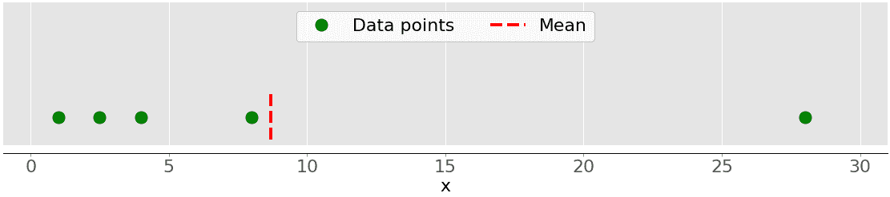
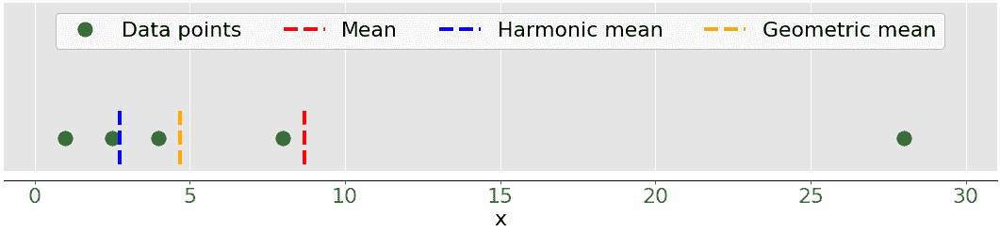

# Python 统计基础:如何描述数据

> 原文:[https://realpython.com/python-statistics/](https://realpython.com/python-statistics/)

在大数据和[人工智能](https://realpython.com/python-ai-neural-network/)的时代，[数据科学](https://realpython.com/tutorials/data-science/)和[机器学习](https://realpython.com/tutorials/machine-learning/)已经成为很多科技领域的必备。处理数据的一个必要方面是描述、总结和可视化表示数据的能力。 **Python 统计库**是全面、流行和广泛使用的工具，将帮助您处理数据。

在本教程中，您将学习:

*   你可以用什么数字量来描述和总结你的数据集
*   如何用纯 Python 实现**计算**描述性统计
*   如何使用可用的 Python 库获得描述性统计数据
*   如何**可视化**您的数据集

**免费附赠:** ，你可以以此为基础制作自己的剧情和图形。

## 了解描述性统计

**描述性统计**是关于数据的描述和汇总。它使用两种主要方法:

1.  **定量方法**用数字描述和总结数据。
2.  **视觉方法**用图表、曲线图、直方图和其他图形说明数据。

您可以对一个或多个数据集或[变量](https://realpython.com/python-variables/)应用描述性统计。当你描述和总结一个单一变量时，你是在进行**单变量分析**。当你搜索一对变量之间的统计关系时，你正在做一个**双变量分析**。类似地，**多元分析**同时涉及多个变量。

[*Remove ads*](/account/join/)

### *措施类型*

 *在本教程中，您将了解描述性统计中的以下测量类型:

*   **中心趋势**告诉你数据的中心。有用的度量包括平均值、中值和众数。
*   **可变性**告诉你数据的分布情况。有用的度量包括方差和标准差。
*   **相关性或联合可变性**告诉您数据集中一对变量之间的关系。有用的度量包括协方差和[相关系数](https://realpython.com/numpy-scipy-pandas-correlation-python/)。

您将学习如何使用 Python 理解和计算这些测量值。

### 人口和样本

在统计学中，**群体**是你感兴趣的所有元素或项目的集合。人口通常很庞大，这使得他们不适合收集和分析数据。这就是为什么统计学家通常试图通过选择和检查人口中有代表性的子集来对人口做出一些结论。

群体的这个子集被称为**样本**。理想的情况是，样本应在令人满意的程度上保留人口的基本统计特征。这样，您将能够使用样本来收集关于人口的结论。

### 离群值

**异常值**是一个数据点，它与取自样本或总体的大部分数据有显著不同。离群值有许多可能的原因，但这里有一些可以帮助您开始:

*   **数据的自然变化**
*   **被观察系统行为的变化**
*   **数据收集中的错误**

数据收集错误是异常值的一个特别突出的原因。例如，测量仪器或程序的局限性可能意味着无法获得正确的数据。其他错误可能是由计算错误、数据污染、人为错误等造成的。

离群值没有精确的数学定义。您必须依靠经验、关于感兴趣主题的知识和常识来确定数据点是否是异常值以及如何处理它。

## 选择 Python 统计库

有许多 Python 统计库可供您使用，但在本教程中，您将了解一些最流行和最广泛使用的统计库:

*   **Python 的 [`statistics`](https://docs.python.org/3/library/statistics.html)** 是内置的用于描述性统计的 Python 库。如果数据集不太大或者不能依赖于导入其他库，可以使用它。

*   **[NumPy](https://docs.scipy.org/doc/numpy/user/index.html)** 是一个用于数值计算的第三方库，为处理一维及多维数组而优化。它的主类型是名为 [`ndarray`](https://docs.scipy.org/doc/numpy/reference/arrays.ndarray.html) 的数组类型。这个库包含许多用于统计分析的[例程](https://docs.scipy.org/doc/numpy/reference/routines.statistics.html)。

*   **[SciPy](https://www.scipy.org/getting-started.html)** 是基于 NumPy 的科学计算第三方库。与 NumPy 相比，它提供了更多的功能，包括用于统计分析的 [`scipy.stats`](https://docs.scipy.org/doc/scipy/reference/stats.html) 。

*   **[熊猫](https://pandas.pydata.org/pandas-docs/stable/)** 是基于 NumPy 的数值计算第三方库。擅长用 [`Series`](https://pandas.pydata.org/pandas-docs/stable/reference/api/pandas.Series.html) 对象处理带标签的一维(1D)数据，用 [`DataFrame`](https://pandas.pydata.org/pandas-docs/stable/reference/api/pandas.DataFrame.html) 对象处理二维(2D)数据。

*   **[Matplotlib](https://matplotlib.org/)** 是数据可视化的第三方库。它与 NumPy，SciPy 和 Pandas 结合使用效果很好。

注意，在很多情况下，`Series`和 [`DataFrame`](https://realpython.com/pandas-dataframe/) 对象可以用来代替 NumPy 数组。通常，您可能只是将它们传递给一个 NumPy 或 [SciPy](https://realpython.com/python-scipy-cluster-optimize/) 统计函数。另外，您可以通过调用 [`.values`](https://pandas.pydata.org/pandas-docs/stable/reference/api/pandas.DataFrame.values.html) 或 [`.to_numpy()`](https://pandas.pydata.org/pandas-docs/stable/reference/api/pandas.DataFrame.to_numpy.html) 从一个`Series`或`DataFrame`对象中获取未标记的数据。

## Python 统计库入门

内置的 Python `statistics`库拥有相对较少的最重要的统计函数。[官方文件](https://docs.python.org/3/library/statistics.html)是找到细节的宝贵资源。如果您仅限于纯 Python，那么 Python `statistics`库可能是正确的选择。

开始学习 NumPy 的一个好地方是官方的[用户指南](https://docs.scipy.org/doc/numpy/user/index.html)，尤其是[快速入门](https://docs.scipy.org/doc/numpy/user/quickstart.html)和[基础知识](https://docs.scipy.org/doc/numpy/user/basics.html)部分。[官方参考](https://docs.scipy.org/doc/numpy/reference/)可以帮助你刷新对具体数字概念的记忆。当你阅读本教程时，你可能想看看[统计](https://docs.scipy.org/doc/numpy/reference/routines.statistics.html)部分和官方[参考](https://docs.scipy.org/doc/scipy/reference/stats.html)。

**注:**

要了解关于 NumPy 的更多信息，请查看以下资源:

*   [看 Ma，无 For 循环:用 NumPy 进行数组编程](https://realpython.com/numpy-array-programming/)
*   [用 Pandas 和 NumPy 清理 Pythonic 数据](https://realpython.com/python-data-cleaning-numpy-pandas/)
*   [NumPy arange():如何使用 np.arange()](https://realpython.com/how-to-use-numpy-arange/)

如果你想学习熊猫，那么[官方入门页面](https://pandas.pydata.org/pandas-docs/stable/getting_started/index.html)是一个很好的开始。数据结构的[介绍](https://pandas.pydata.org/pandas-docs/stable/getting_started/dsintro.html)可以帮助你了解基本的数据类型`Series`和`DataFrame`。同样，优秀的官方入门教程旨在给你足够的信息，开始在实践中有效地使用熊猫。

**注:**

要了解更多关于熊猫的信息，请查看以下资源:

*   [使用熊猫和 Python 探索您的数据集](https://realpython.com/pandas-python-explore-dataset/)
*   [熊猫数据帧 101](https://realpython.com/courses/pandas-dataframes-101/)
*   [地道的熊猫:把戏&你可能不知道的特点](https://realpython.com/courses/idiomatic-pandas-tricks-features-you-may-not-know/)
*   [快速、灵活、简单和直观:如何加快您的熊猫项目](https://realpython.com/fast-flexible-pandas/)

`matplotlib`有一个全面的[官方用户指南](https://matplotlib.org/users/index.html)，你可以用它来深入了解使用该库的细节。[Matplotlib](https://github.com/matplotlib/AnatomyOfMatplotlib)的剖析对于想要开始使用`matplotlib`及其相关库的初学者来说是一个极好的资源。

**注:**

要了解有关数据可视化的更多信息，请查看以下资源:

*   [使用 Matplotlib 进行 Python 绘图(指南)](https://realpython.com/python-matplotlib-guide/)
*   [Python 直方图绘制:NumPy，Matplotlib，Pandas & Seaborn](https://realpython.com/python-histograms/)
*   [使用散景在 Python 中进行交互式数据可视化](https://realpython.com/python-data-visualization-bokeh/)
*   [熊猫图:面向初学者的 Python 数据可视化](https://realpython.com/pandas-plot-python/)

让我们开始使用这些 Python 统计库吧！

[*Remove ads*](/account/join/)

## *计算描述性统计数据*

 *首先导入您需要的所有包:

>>>

```py
>>> import math
>>> import statistics
>>> import numpy as np
>>> import scipy.stats
>>> import pandas as pd
```

这些都是 Python 统计数据计算所需的包。通常，您不会使用 Python 的内置`math`包，但在本教程中它会很有用。稍后，您将导入`matplotlib.pyplot`进行数据可视化。

让我们创建一些数据来使用。您将从包含一些任意数字数据的 Python 列表开始:

>>>

```py
>>> x = [8.0, 1, 2.5, 4, 28.0]
>>> x_with_nan = [8.0, 1, 2.5, math.nan, 4, 28.0]
>>> x
[8.0, 1, 2.5, 4, 28.0]
>>> x_with_nan
[8.0, 1, 2.5, nan, 4, 28.0]
```

现在你有了列表`x`和`x_with_nan`。它们几乎相同，不同之处在于`x_with_nan`包含一个`nan`值。理解 Python 统计例程在遇到 **[非数字值(`nan` )](https://en.wikipedia.org/wiki/NaN)** 时的行为很重要。在数据科学中，丢失值是常见的，您通常会用`nan`来替换它们。

**注:**你怎么得到一个`nan`值？

在 Python 中，可以使用以下任意一种:

*   [T2`float('nan')`](https://docs.python.org/3/library/functions.html#float)
*   [T2`math.nan`](https://docs.python.org/3/library/math.html#math.nan)
*   [T2`np.nan`](https://docs.scipy.org/doc/numpy/reference/constants.html#numpy.nan)

您可以互换使用所有这些功能:

>>>

```py
>>> math.isnan(np.nan), np.isnan(math.nan)
(True, True)
>>> math.isnan(y_with_nan[3]), np.isnan(y_with_nan[3])
(True, True)
```

可以看到功能都是等价的。但是，请记住，比较两个`nan`值是否相等会返回`False`。换句话说，`math.nan == math.nan`就是`False`！

现在，创建对应于`x`和`x_with_nan`的`np.ndarray`和`pd.Series`对象:

>>>

```py
>>> y, y_with_nan = np.array(x), np.array(x_with_nan)
>>> z, z_with_nan = pd.Series(x), pd.Series(x_with_nan)
>>> y
array([ 8\. ,  1\. ,  2.5, 4\. , 28\. ])
>>> y_with_nan
array([ 8\. ,  1\. ,  2.5,  nan,  4\. , 28\. ])
>>> z
0     8.0
1     1.0
2     2.5
3     4.0
4    28.0
dtype: float64
>>> z_with_nan
0     8.0
1     1.0
2     2.5
3     NaN
4     4.0
5    28.0
dtype: float64
```

你现在有两个 NumPy 数组(`y`和`y_with_nan`)和两只熊猫`Series` ( `z`和`z_with_nan`)。所有这些都是 1D 值序列。

**注意**:虽然你将在本教程中使用[列表](https://realpython.com/python-lists-tuples/)，但是请记住，在大多数情况下，你可以以同样的方式使用[元组](https://realpython.com/python-lists-tuples/)。

您可以选择为`z`和`z_with_nan`中的每个值指定一个标签。

### 集中趋势的度量

集中趋势的**测量值**显示数据集的中心或中间值。关于什么被认为是数据集的中心，有几种定义。在本教程中，您将学习如何识别和计算这些集中趋势的度量:

*   平均
*   加权平均数
*   几何平均值
*   调和平均值
*   中位数
*   方式

#### 平均值

**样本平均值**，也称为**样本算术平均值**或简称为**平均值**，是一个数据集中所有项目的算术平均值。数据集𝑥的平均值在数学上表示为σᵢ𝑥ᵢ/𝑛，其中𝑖 = 1，2，…，𝑛.换句话说，它是所有𝑥ᵢ元素的总和除以数据集𝑥.中的项目数

下图显示了一个样本的平均值，包含五个数据点:

[](https://files.realpython.com/media/py-stats-01.3254dbfe6b9a.png)

绿点代表数据点 1、2.5、4、8 和 28。红色虚线是他们的平均值，或者说(1 + 2.5 + 4 + 8 + 28) / 5 = 8.7。

你可以用纯 Python 使用 [`sum()`](https://docs.python.org/3/library/functions.html#sum) 和 [`len()`](https://realpython.com/len-python-function/) 计算平均值，不需要导入库:

>>>

```py
>>> mean_ = sum(x) / len(x)
>>> mean_
8.7
```

尽管这很简洁，但您也可以应用内置的 Python 统计函数:

>>>

```py
>>> mean_ = statistics.mean(x)
>>> mean_
8.7
>>> mean_ = statistics.fmean(x)
>>> mean_
8.7
```

您已经从内置的 Python `statistics`库中调用了函数 [`mean()`](https://docs.python.org/3/library/statistics.html#statistics.mean) 和 [`fmean()`](https://docs.python.org/3/library/statistics.html#statistics.fmean) ，并获得了与使用纯 Python 相同的结果。`fmean()`是在 [Python 3.8](https://realpython.com/python38-new-features/) 中引入的，作为`mean()`的更快替代。它总是返回一个浮点数。

但是，如果您的数据中有`nan`值，那么`statistics.mean()`和`statistics.fmean()`将返回`nan`作为输出:

>>>

```py
>>> mean_ = statistics.mean(x_with_nan)
>>> mean_
nan
>>> mean_ = statistics.fmean(x_with_nan)
>>> mean_
nan
```

这个结果与`sum()`的行为一致，因为`sum(x_with_nan)`也返回`nan`。

如果用 NumPy，那么就可以用 [`np.mean()`](https://docs.scipy.org/doc/numpy/reference/generated/numpy.mean.html) 得到平均值:

>>>

```py
>>> mean_ = np.mean(y)
>>> mean_
8.7
```

在上面的例子中，`mean()`是一个函数，但是你也可以使用相应的方法 [`.mean()`](https://docs.scipy.org/doc/numpy/reference/generated/numpy.ndarray.mean.html) :

>>>

```py
>>> mean_ = y.mean()
>>> mean_
8.7
```

NumPy 的函数`mean()`和方法`.mean()`返回与`statistics.mean()`相同的结果。当您的数据中有`nan`值时也是如此:

>>>

```py
>>> np.mean(y_with_nan)
nan
>>> y_with_nan.mean()
nan
```

结果你通常不需要得到一个`nan`值。如果你喜欢忽略`nan`值，那么你可以使用 [`np.nanmean()`](https://docs.scipy.org/doc/numpy/reference/generated/numpy.nanmean.html) :

>>>

```py
>>> np.nanmean(y_with_nan)
8.7
```

`nanmean()`简单地忽略所有的`nan`值。如果您将它应用到没有`nan`值的数据集，它将返回与`mean()`相同的值。

`pd.Series`对象也有方法 [`.mean()`](https://pandas.pydata.org/pandas-docs/stable/reference/api/pandas.Series.mean.html) :

>>>

```py
>>> mean_ = z.mean()
>>> mean_
8.7
```

如您所见，它的用法与 NumPy 的用法相似。但是，熊猫的`.mean()`默认忽略`nan`值:

>>>

```py
>>> z_with_nan.mean()
8.7
```

这种行为是可选参数`skipna`默认值的结果。您可以更改此参数来修改行为。

#### 加权平均值

**加权平均值**，也称为**加权算术平均值**或**加权平均值**，是算术平均值的推广，使您能够定义每个数据点对结果的相对贡献。

您为数据集𝑥的每个数据点𝑥ᵢ定义一个**权重𝑤ᵢ** ，其中𝑖 = 1，2，…，𝑛和𝑛是𝑥.的项目数然后，你将每个数据点乘以相应的权重，将所有乘积求和，将得到的和除以权重之和:σᵢ(𝑤ᵢ𝑥ᵢ)/σᵢ𝑤ᵢ.

**注:**方便(通常情况下)所有权重都是**非负**，𝑤ᵢ ≥ 0，并且它们的和等于 1，或者σᵢ𝑤ᵢ= 1。

当您需要包含以给定相对频率出现的项目的数据集的平均值时，加权平均值非常方便。例如，假设有一个集合，其中 20%的项目等于 2，50%的项目等于 4，其余 30%的项目等于 8。你可以这样计算这样一个集合的平均值:

>>>

```py
>>> 0.2 * 2 + 0.5 * 4 + 0.3 * 8
4.8
```

在这里，你将频率和权重考虑在内。用这种方法，你不需要知道项目的总数。

通过将`sum()`与 [`range()`](https://realpython.com/courses/python-range-function/) 或 [`zip()`](https://realpython.com/python-zip-function/) 结合，可以在纯 Python 中实现加权平均:

>>>

```py
>>> x = [8.0, 1, 2.5, 4, 28.0]
>>> w = [0.1, 0.2, 0.3, 0.25, 0.15]
>>> wmean = sum(w[i] * x[i] for i in range(len(x))) / sum(w)
>>> wmean
6.95
>>> wmean = sum(x_ * w_ for (x_, w_) in zip(x, w)) / sum(w)
>>> wmean
6.95
```

同样，这是一个干净优雅的实现，不需要导入任何库。

但是，如果您有大型数据集，那么 NumPy 可能会提供更好的解决方案。您可以使用 [`np.average()`](https://docs.scipy.org/doc/numpy/reference/generated/numpy.average.html) 来获得 NumPy 数组或 Pandas `Series`的加权平均值:

>>>

```py
>>> y, z, w = np.array(x), pd.Series(x), np.array(w)
>>> wmean = np.average(y, weights=w)
>>> wmean
6.95
>>> wmean = np.average(z, weights=w)
>>> wmean
6.95
```

结果与纯 Python 实现的情况相同。您也可以在普通的列表和元组上使用这种方法。

另一种解决方案是使用基于元素的乘积`w * y`与 [`np.sum()`](https://docs.scipy.org/doc/numpy/reference/generated/numpy.sum.html) 或 [`.sum()`](https://docs.scipy.org/doc/numpy/reference/generated/numpy.ndarray.sum.html) :

>>>

```py
>>> (w * y).sum() / w.sum()
6.95
```

就是这样！你已经计算了加权平均值。

但是，如果数据集包含`nan`值，请小心:

>>>

```py
>>> w = np.array([0.1, 0.2, 0.3, 0.0, 0.2, 0.1])
>>> (w * y_with_nan).sum() / w.sum()
nan
>>> np.average(y_with_nan, weights=w)
nan
>>> np.average(z_with_nan, weights=w)
nan
```

本例中，`average()`返回`nan`，与`np.mean()`一致。

#### 调和平均值

**调和平均值**是数据集中所有项目的倒数的平均值的倒数:𝑛/σᵢ(1/𝑥ᵢ)，其中𝑖 = 1，2，…，𝑛和𝑛是数据集中的项目数𝑥.调和平均值的纯 Python 实现的一个变体是:

>>>

```py
>>> hmean = len(x) / sum(1 / item for item in x)
>>> hmean
2.7613412228796843
```

和同样数据`x`的算术平均值相差很大，你算出来是 8.7。

你也可以用 [`statistics.harmonic_mean()`](https://docs.python.org/3/library/statistics.html#statistics.harmonic_mean) 来计算这个测度:

>>>

```py
>>> hmean = statistics.harmonic_mean(x)
>>> hmean
2.7613412228796843
```

上面的例子展示了`statistics.harmonic_mean()`的一个实现。如果数据集中有一个`nan`值，那么它将返回`nan`。如果至少有一个`0`，那么它将返回`0`。如果您至少提供一个负数，那么您将得到 [`statistics.StatisticsError`](https://docs.python.org/3/library/statistics.html#statistics.StatisticsError) :

>>>

```py
>>> statistics.harmonic_mean(x_with_nan)
nan
>>> statistics.harmonic_mean([1, 0, 2])
0
>>> statistics.harmonic_mean([1, 2, -2])  # Raises StatisticsError
```

当你使用这种方法时，请记住这三种情况！

计算调和平均值的第三种方法是使用 [`scipy.stats.hmean()`](https://docs.scipy.org/doc/scipy/reference/generated/scipy.stats.hmean.html) :

>>>

```py
>>> scipy.stats.hmean(y)
2.7613412228796843
>>> scipy.stats.hmean(z)
2.7613412228796843
```

同样，这是一个非常简单的实现。然而，如果你的数据集包含`nan`、`0`、负数，或者除了正数[之外的任何数字](https://realpython.com/python-numbers/)，那么你将得到一个 [`ValueError`](https://docs.python.org/3/library/exceptions.html#ValueError) ！

#### 几何平均值

**几何平均值**是数据集𝑥:ⁿ√(πᵢ𝑥ᵢ中所有𝑛元素𝑥ᵢ乘积的𝑛-th 根，其中𝑖 = 1，2，…，𝑛.下图说明了数据集的算术平均值、调和平均值和几何平均值:

[](https://files.realpython.com/media/py-stats-02.ec1ca0f9a9ac.png)

绿点再次表示数据点 1、2.5、4、8 和 28。红色虚线是平均值。蓝色虚线是调和平均值，黄色虚线是几何平均值。

您可以在纯 Python 中实现几何平均，如下所示:

>>>

```py
>>> gmean = 1
>>> for item in x:
...     gmean *= item
...
>>> gmean **= 1 / len(x)
>>> gmean
4.677885674856041
```

如您所见，在这种情况下，几何平均值与同一个数据集`x`的算术平均值(8.7)和调和平均值(2.76)显著不同。

Python 3.8 引入了 [`statistics.geometric_mean()`](https://docs.python.org/3/library/statistics.html#statistics.geometric_mean) ，将所有值转换为浮点数，并返回其几何平均值:

>>>

```py
>>> gmean = statistics.geometric_mean(x)
>>> gmean
4.67788567485604
```

您已经获得了与上一个示例相同的结果，但是舍入误差很小。

如果您传递带有`nan`值的数据，那么`statistics.geometric_mean()`将像大多数类似的函数一样运行并返回`nan`:

>>>

```py
>>> gmean = statistics.geometric_mean(x_with_nan)
>>> gmean
nan
```

的确，这与`statistics.mean()`、`statistics.fmean()`、`statistics.harmonic_mean()`的行为是一致的。如果你的数据中有一个零或负数，那么`statistics.geometric_mean()`将提高`statistics.StatisticsError`。

你也可以用 [`scipy.stats.gmean()`](https://docs.scipy.org/doc/scipy/reference/generated/scipy.stats.gmean.html) 得到几何平均数:

>>>

```py
>>> scipy.stats.gmean(y)
4.67788567485604
>>> scipy.stats.gmean(z)
4.67788567485604
```

您获得了与纯 Python 实现相同的结果。

如果数据集中有`nan`个值，那么`gmean()`将返回`nan`。如果至少有一个`0`，那么它将返回`0.0`并给出警告。如果您至少提供一个负数，那么您将得到`nan`和警告。

#### 中位数

**样本中值**是排序数据集的中间元素。数据集可以按升序或降序排序。如果数据集的元素𝑛数是奇数，则中值是中间位置的值:0.5(𝑛 + 1)。如果𝑛是偶数，则中位数是中间两个值的算术平均值，即 0.5𝑛和 0.5𝑛 + 1 位置上的项目。

例如，如果您有数据点 2、4、1、8 和 9，则中值为 4，位于排序数据集(1、2、4、8、9)的中间。如果数据点是 2、4、1 和 8，则中位数是 3，这是排序序列(2 和 4)的两个中间元素的平均值。下图说明了这一点:

[](https://files.realpython.com/media/py-stats-04.f7b39a21dd2d.png)

数据点是绿点，紫线显示每个数据集的中位数。上部数据集(1、2.5、4、8 和 28)的中值为 4。如果从较低的数据集中移除异常值 28，则中值变为 2.5 和 4 之间的算术平均值，即 3.25。

下图显示了数据点 1、2.5、4、8 和 28 的平均值和中值:

[](https://files.realpython.com/media/py-stats-03.33356e86aa97.png)

同样，平均值是红色虚线，而中间值是紫色线。

平均值和中值行为之间的主要差异与数据集**异常值**或**极端值**有关。平均值受异常值的影响很大，但中值仅轻微或根本不依赖于异常值。请考虑下图:

[](https://files.realpython.com/media/py-stats-05.b5c3dba0cd5f.png)

上面的数据集再次包含项目 1、2.5、4、8 和 28。它的平均值是 8.7，中位数是 5，正如你之前看到的。下面的数据集显示了移动最右边的值为 28 的点时的情况:

*   **如果你增加它的值(向右移动)**，那么平均值会上升，但是中间值不会改变。
*   **如果你减少它的值(向左移动)**，那么均值会下降，但是中值会保持不变，直到移动点的值大于等于 4。

您可以通过比较平均值和中值来检测数据中的异常值和不对称性。是平均值还是中值对你更有用取决于你特定问题的背景。

以下是中间值的许多可能的纯 Python 实现之一:

>>>

```py
>>> n = len(x)
>>> if n % 2:
...     median_ = sorted(x)[round(0.5*(n-1))]
... else:
...     x_ord, index = sorted(x), round(0.5 * n)
...     median_ = 0.5 * (x_ord[index-1] + x_ord[index])
...
>>> median_
4
```

该实现的两个最重要的步骤如下:

1.  **排序**数据集的元素
2.  **在排序的数据集中寻找中间元素**

用 [`statistics.median()`](https://docs.python.org/3/library/statistics.html#statistics.median) 可以得到中位数:

>>>

```py
>>> median_ = statistics.median(x)
>>> median_
4
>>> median_ = statistics.median(x[:-1])
>>> median_
3.25
```

`x`的排序版本是`[1, 2.5, 4, 8.0, 28.0]`，所以中间的元素是`4`。`x[:-1]`的排序版本，没有最后一项`28.0`的`x`，是`[1, 2.5, 4, 8.0]`。现在，有两个中间元素，`2.5`和`4`。他们的平均成绩是`3.25`。

[`median_low()`](https://docs.python.org/3/library/statistics.html#statistics.median_low) 和 [`median_high()`](https://docs.python.org/3/library/statistics.html#statistics.median_high) 是 Python `statistics`库中又两个与中位数相关的函数。它们总是从数据集中返回一个元素:

*   **如果元素的数量是奇数**，那么有一个中间值，所以这些函数的行为就像`median()`。
*   **如果元素个数是偶数**，那么有两个中间值。在这种情况下，`median_low()`返回较低的中间值，`median_high()`返回较高的中间值。

您可以像使用`median()`一样使用这些函数:

>>>

```py
>>> statistics.median_low(x[:-1])
2.5
>>> statistics.median_high(x[:-1])
4
```

同样，`x[:-1]`的排序版本是`[1, 2.5, 4, 8.0]`。中间的两个元素是`2.5`(低)和`4`(高)。

与 Python `statistics`库中的大多数其他函数不同，当数据点中存在`nan`值时，`median()`、`median_low()`和`median_high()`不会返回`nan`:

>>>

```py
>>> statistics.median(x_with_nan)
6.0
>>> statistics.median_low(x_with_nan)
4
>>> statistics.median_high(x_with_nan)
8.0
```

小心这种行为，因为它可能不是你想要的！

也可以用 [`np.median()`](https://docs.scipy.org/doc/numpy/reference/generated/numpy.median.html) 得到中位数:

>>>

```py
>>> median_ = np.median(y)
>>> median_
4.0
>>> median_ = np.median(y[:-1])
>>> median_
3.25
```

您已经获得了与`statistics.median()`和`np.median()`相同的值。

但是，如果数据集中有一个`nan`值，那么`np.median()`发出 [`RuntimeWarning`](https://docs.python.org/3.7/library/exceptions.html#RuntimeWarning) 并返回`nan`。如果这种行为不是您想要的，那么您可以使用 [`nanmedian()`](https://docs.scipy.org/doc/numpy/reference/generated/numpy.nanmedian.html) 来忽略所有的`nan`值:

>>>

```py
>>> np.nanmedian(y_with_nan)
4.0
>>> np.nanmedian(y_with_nan[:-1])
3.25
```

获得的结果与将`statistics.median()`和`np.median()`应用于数据集`x`和`y`的结果相同。

熊猫`Series`对象有默认忽略`nan`值的 [`.median()`](https://pandas.pydata.org/pandas-docs/stable/reference/api/pandas.Series.median.html) 方法:

>>>

```py
>>> z.median()
4.0
>>> z_with_nan.median()
4.0
```

`.median()`的行为与熊猫身上的`.mean()`一致。您可以使用可选参数`skipna`来改变这种行为。

#### 模式

**采样模式**是数据集中出现频率最高的值。如果没有一个这样的值，那么这个集合就是**多模态**，因为它有多个模态值。例如，在包含点 2、3、2、8 和 12 的集合中，数字 2 是众数，因为它出现两次，不像其他项目只出现一次。

这是如何用纯 Python 获得模式的:

>>>

```py
>>> u = [2, 3, 2, 8, 12]
>>> mode_ = max((u.count(item), item) for item in set(u))[1]
>>> mode_
2
```

您使用`u.count()`来获得每个条目在`u`中出现的次数。出现次数最多的项目是模式。注意，你不必使用`set(u)`。相反，您可以用`u`来代替它，并遍历整个列表。

**注:** `set(u)`返回一个 Python [集合](https://realpython.com/python-sets/)，集合`u`中的所有唯一项。您可以使用这个技巧来优化对较大数据的处理，尤其是当您希望看到大量重复数据时。

可以用 [`statistics.mode()`](https://docs.python.org/3/library/statistics.html#statistics.mode) 和 [`statistics.multimode()`](https://docs.python.org/3/library/statistics.html#statistics.multimode) 获得模式:

>>>

```py
>>> mode_ = statistics.mode(u)
>>> mode_
>>> mode_ = statistics.multimode(u)
>>> mode_
[2]
```

如您所见，`mode()`返回单个值，而`multimode()`返回包含结果的列表。不过，这并不是这两个函数之间的唯一区别。如果有多个模态值，那么`mode()`引发`StatisticsError`，而`multimode()`返回包含所有模态的列表:

>>>

```py
>>> v = [12, 15, 12, 15, 21, 15, 12]
>>> statistics.mode(v)  # Raises StatisticsError
>>> statistics.multimode(v)
[12, 15]
```

您应该特别注意这种情况，并且在选择这两种功能时要小心。

`statistics.mode()`和`statistics.multimode()`将`nan`值作为常规值处理，并可以返回`nan`作为模态值:

>>>

```py
>>> statistics.mode([2, math.nan, 2])
2
>>> statistics.multimode([2, math.nan, 2])
[2]
>>> statistics.mode([2, math.nan, 0, math.nan, 5])
nan
>>> statistics.multimode([2, math.nan, 0, math.nan, 5])
[nan]
```

在上面的第一个例子中，数字`2`出现了两次，并且是模态值。在第二个示例中，`nan`是模态值，因为它出现了两次，而其他值只出现了一次。

**注:** `statistics.multimode()`在 [Python 3.8](https://realpython.com/courses/cool-new-features-python-38/) 中介绍。

也可以用 [`scipy.stats.mode()`](https://docs.scipy.org/doc/scipy/reference/generated/scipy.stats.mode.html) 得到模式:

>>>

```py
>>> u, v = np.array(u), np.array(v)
>>> mode_ = scipy.stats.mode(u)
>>> mode_
ModeResult(mode=array([2]), count=array([2]))
>>> mode_ = scipy.stats.mode(v)
>>> mode_
ModeResult(mode=array([12]), count=array([3]))
```

这个函数返回带有模态值的对象以及它出现的次数。如果数据集中有多个模态值，那么只返回最小的值。

您可以用点标记的 NumPy 数组来获取模式及其出现次数:

>>>

```py
>>> mode_.mode
array([12])
>>> mode_.count
array([3])
```

这段代码使用`.mode`返回数组`v`中最小的众数(`12`)，使用`.count`返回众数(`3`)。`scipy.stats.mode()`也可以灵活使用`nan`值。它允许您用可选参数`nan_policy`定义期望的行为。该参数可以采用值`'propagate'`、`'raise'`(错误)或`'omit'`。

熊猫`Series`对象具有方法 [`.mode()`](https://pandas.pydata.org/pandas-docs/stable/reference/api/pandas.Series.mode.html#pandas.Series.mode) ，该方法可以很好地处理多模态值，并在默认情况下忽略`nan`值:

>>>

```py
>>> u, v, w = pd.Series(u), pd.Series(v), pd.Series([2, 2, math.nan])
>>> u.mode()
0    2
dtype: int64
>>> v.mode()
0    12
1    15
dtype: int64
>>> w.mode()
0    2.0
dtype: float64
```

如您所见，`.mode()`返回一个保存所有模态值的新的`pd.Series`。如果你想让`.mode()`考虑`nan`的值，那么只需传递可选参数`dropna=False`。

[*Remove ads*](/account/join/)

### *可变性测量*

 *集中趋势的度量不足以描述数据。您还需要量化数据点分布的可变性的**度量。在本节中，您将学习如何识别和计算以下可变性度量:**

*   差异
*   标准偏差
*   歪斜
*   百分位数
*   范围

#### 差异

**样本方差**量化了数据的分布。它用数字显示数据点离平均值有多远。您可以用数学方法将带有𝑛元素的数据集𝑥的样本方差表示为𝑠=σᵢ(𝑥ᵢmean(𝑥)/(𝑛1)，其中𝑖 = 1，2，…，𝑛，mean 是的样本均值。如果你想更深入地理解为什么用𝑛1 而不是𝑛来除和，那么你可以更深入地研究[贝塞尔的修正](https://en.wikipedia.org/wiki/Bessel%27s_correction)。

下图说明了在描述数据集时考虑差异的重要性:

[](https://files.realpython.com/media/py-stats-06.2cafb41d561e.png)

该图中有两个数据集:

1.  **绿点:**该数据集具有较小的方差或与平均值的较小平均差。它还具有较小的范围或最大和最小项目之间的较小差异。
2.  **白点:**该数据集具有较大的方差或与均值的较大平均差。它还具有更大的范围或最大和最小项目之间的更大差异。

请注意，这两个数据集具有相同的平均值和中值，尽管它们看起来明显不同。无论是平均值还是中位数都无法描述这种差异。这就是为什么你需要可变性的度量。

以下是使用纯 Python 计算样本方差的方法:

>>>

```py
>>> n = len(x)
>>> mean_ = sum(x) / n
>>> var_ = sum((item - mean_)**2 for item in x) / (n - 1)
>>> var_
123.19999999999999
```

这种方法是足够的，并且很好地计算样本方差。然而，更简短、更优雅的解决方案是调用现有的函数 [`statistics.variance()`](https://docs.python.org/3/library/statistics.html#statistics.variance) :

>>>

```py
>>> var_ = statistics.variance(x)
>>> var_
123.2
```

你已经获得了与上面相同的方差结果。`variance()`可以避免计算平均值，如果你提供平均值作为第二个参数:`statistics.variance(x, mean_)`。

如果你的数据中有`nan`个值，那么`statistics.variance()`将返回`nan`:

>>>

```py
>>> statistics.variance(x_with_nan)
nan
```

这种行为与 Python `statistics`库中的`mean()`和大多数其他函数一致。

也可以用 NumPy 计算样本方差。你应该使用函数 [`np.var()`](https://docs.scipy.org/doc/numpy/reference/generated/numpy.var.html) 或者相应的方法 [`.var()`](https://docs.scipy.org/doc/numpy/reference/generated/numpy.ndarray.var.html) :

>>>

```py
>>> var_ = np.var(y, ddof=1)
>>> var_
123.19999999999999
>>> var_ = y.var(ddof=1)
>>> var_
123.19999999999999
```

指定参数`ddof=1`非常重要。这就是如何将[的自由度增量](https://en.wikipedia.org/wiki/Degrees_of_freedom_(statistics))设置为`1`。此参数允许正确计算𝑠，分母为(𝑛1)而不是𝑛.

如果数据集中有`nan`个值，那么`np.var()`和`.var()`将返回`nan`:

>>>

```py
>>> np.var(y_with_nan, ddof=1)
nan
>>> y_with_nan.var(ddof=1)
nan
```

这与`np.mean()`和`np.average()`一致。如果你想跳过`nan`值，那么你应该使用 [`np.nanvar()`](https://docs.scipy.org/doc/numpy/reference/generated/numpy.nanvar.html) :

>>>

```py
>>> np.nanvar(y_with_nan, ddof=1)
123.19999999999999
```

`np.nanvar()`忽略`nan`值。这还需要你指定`ddof=1`。

`pd.Series`对象有默认跳过`nan`值的 [`.var()`](https://pandas.pydata.org/pandas-docs/stable/reference/api/pandas.Series.var.html) 方法:

>>>

```py
>>> z.var(ddof=1)
123.19999999999999
>>> z_with_nan.var(ddof=1)
123.19999999999999
```

它也有参数`ddof`，但是它的默认值是`1`，所以可以省略。如果您想要与`nan`值相关的不同行为，那么使用可选参数`skipna`。

您可以像计算样本方差一样计算**总体方差**。但是，您必须在分母中使用𝑛，而不是𝑛1:σᵢ(𝑥ᵢmean(𝑥))/𝑛.在这种情况下，𝑛是整个人口中的项目数。您可以获得与样本方差相似的总体方差，但有以下区别:

*   **在纯 Python 实现中用`n`替换** `(n - 1)`。
*   **用** [`statistics.pvariance()`](https://docs.python.org/3/library/statistics.html#statistics.pvariance) 代替`statistics.variance()`。
*   **如果使用 NumPy 或 Pandas，指定**参数`ddof=0`。在 NumPy 中，可以省略`ddof`，因为它的默认值是`0`。

请注意，无论何时计算方差，您都应该知道您是在处理一个样本还是整个总体！

#### 标准偏差

**样本标准差**是数据分布的另一个度量。它与样本方差有关，因为标准差𝑠是样本方差的正平方根。标准差通常比方差更方便，因为它与数据点具有相同的单位。一旦得到方差，就可以用纯 Python 计算标准差:

>>>

```py
>>> std_ = var_ ** 0.5
>>> std_
11.099549540409285
```

虽然这种解决方案可行，但是您也可以使用 [`statistics.stdev()`](https://docs.python.org/3/library/statistics.html#statistics.stdev) :

>>>

```py
>>> std_ = statistics.stdev(x)
>>> std_
11.099549540409287
```

当然，结果和以前一样。像`variance()`，`stdev()`不计算平均值，如果你明确地提供它作为第二个参数:`statistics.stdev(x, mean_)`。

你可以用几乎相同的方法得到 NumPy 的标准差。可以使用函数 [`std()`](https://docs.scipy.org/doc/numpy/reference/generated/numpy.std.html) 和相应的方法 [`.std()`](https://docs.scipy.org/doc/numpy/reference/generated/numpy.ndarray.std.html) 来计算标准差。如果数据集中有`nan`值，那么它们将返回`nan`。要忽略`nan`值，应该使用 [`np.nanstd()`](https://docs.scipy.org/doc/numpy/reference/generated/numpy.nanstd.html) 。使用 NumPy 中的`std()`、`.std()`和`nanstd()`，就像使用`var()`、`.var()`和`nanvar()`一样:

>>>

```py
>>> np.std(y, ddof=1)
11.099549540409285
>>> y.std(ddof=1)
11.099549540409285
>>> np.std(y_with_nan, ddof=1)
nan
>>> y_with_nan.std(ddof=1)
nan
>>> np.nanstd(y_with_nan, ddof=1)
11.099549540409285
```

不要忘记将 delta 自由度设置为`1`！

`pd.Series`对象也有默认跳过`nan`的 [`.std()`](https://pandas.pydata.org/pandas-docs/stable/reference/api/pandas.Series.std.html) 方法:

>>>

```py
>>> z.std(ddof=1)
11.099549540409285
>>> z_with_nan.std(ddof=1)
11.099549540409285
```

参数`ddof`默认为`1`，可以省略。同样，如果您想区别对待`nan`值，那么应用参数`skipna`。

**总体标准差**是指总体。它是人口方差的正平方根。您可以像计算样本标准差一样计算它，但有以下区别:

*   **求**纯 Python 实现中人口方差的平方根。
*   **用** [`statistics.pstdev()`](https://docs.python.org/3/library/statistics.html#statistics.pstdev) 代替`statistics.stdev()`。
*   **如果使用 NumPy 或 Pandas，指定**参数`ddof=0`。在 NumPy 中，可以省略`ddof`，因为它的默认值是`0`。

如您所见，在 Python、NumPy 和 Pandas 中，您可以用与确定方差几乎相同的方式来确定标准差。您使用不同但相似的函数和方法，并使用相同的参数。

#### 偏斜度

**样本偏斜度**测量数据样本的不对称度。

偏斜度有几种数学定义。计算具有𝑛元素的数据集𝑥的偏度的一个常用表达式是(𝑛/((𝑛-1)(𝑛-2))(σᵢ(𝑥ᵢ-mean(𝑥))/(𝑛𝑠)。更简单的表达式是σᵢ(𝑥ᵢmean(𝑥))𝑛/((𝑛1)(𝑛2)𝑠)，其中𝑖 = 1，2，…，𝑛，mean(是)的样本均值。这样定义的偏度称为**调整后的费希尔-皮尔逊标准化矩系数**。

上图显示了两个非常对称的数据集。换句话说，他们的点离平均值有相似的距离。相比之下，下图显示了两个不对称的集合:

[](https://files.realpython.com/media/py-stats-07.92abf9f362b0.png)

第一组用绿点表示，第二组用白点表示。通常，**负偏度**值表示在左侧有一个优势尾部，你可以在第一组中看到。**正偏度值**对应的是右边更长或更粗的尾巴，你可以在第二组中看到。如果偏斜度接近 0(例如，在 0.5 和 0.5 之间)，则数据集被认为是完全对称的。

一旦计算出数据集的大小`n`、样本均值`mean_`和标准差`std_`，就可以用纯 Python 获得样本偏斜度:

>>>

```py
>>> x = [8.0, 1, 2.5, 4, 28.0]
>>> n = len(x)
>>> mean_ = sum(x) / n
>>> var_ = sum((item - mean_)**2 for item in x) / (n - 1)
>>> std_ = var_ ** 0.5
>>> skew_ = (sum((item - mean_)**3 for item in x)
...          * n / ((n - 1) * (n - 2) * std_**3))
>>> skew_
1.9470432273905929
```

偏斜度为正，所以`x`有一个右侧尾部。

也可以用 [`scipy.stats.skew()`](https://docs.scipy.org/doc/scipy/reference/generated/scipy.stats.skew.html) 计算样本偏度:

>>>

```py
>>> y, y_with_nan = np.array(x), np.array(x_with_nan)
>>> scipy.stats.skew(y, bias=False)
1.9470432273905927
>>> scipy.stats.skew(y_with_nan, bias=False)
nan
```

获得的结果与纯 Python 实现相同。参数`bias`被设置为`False`以启用对统计偏差的校正。可选参数`nan_policy`可以取值`'propagate'`、`'raise'`或`'omit'`。它允许你控制如何处理`nan`值。

熊猫`Series`对象具有方法 [`.skew()`](https://pandas.pydata.org/pandas-docs/stable/reference/api/pandas.Series.skew.html) ，该方法也返回数据集的偏斜度:

>>>

```py
>>> z, z_with_nan = pd.Series(x), pd.Series(x_with_nan)
>>> z.skew()
1.9470432273905924
>>> z_with_nan.skew()
1.9470432273905924
```

像其他方法一样，`.skew()`默认忽略`nan`值，因为可选参数`skipna`的默认值。

#### 百分位数

**样本𝑝百分位**是数据集中的元素，使得数据集中元素的𝑝%小于或等于该值。此外，元素的(100)𝑝)%大于或等于该值。如果数据集中有两个这样的元素，那么样本𝑝百分位数就是它们的算术平均值。每个数据集有三个**四分位数**，它们是将数据集分成四个部分的百分点:

*   **第一个四分位数**是样本的第 25 个百分位数。它从数据集的其余部分中划分出大约 25%的最小项目。
*   **第二个四分位数**是样本的第 50 百分位或**中位数**。大约 25%的项目位于第一和第二四分位数之间，另外 25%位于第二和第三四分位数之间。
*   **第三个四分位数**是样本的第 75 个百分位数。它从数据集的其余部分中划分出大约 25%的最大项目。

每个零件都有大约相同数量的项目。如果你想把你的数据分成几个区间，那么你可以使用 [`statistics.quantiles()`](https://docs.python.org/3/library/statistics.html#statistics.quantiles) :

>>>

```py
>>> x = [-5.0, -1.1, 0.1, 2.0, 8.0, 12.8, 21.0, 25.8, 41.0]
>>> statistics.quantiles(x, n=2)
[8.0]
>>> statistics.quantiles(x, n=4, method='inclusive')
[0.1, 8.0, 21.0]
```

在这个例子中，`8.0`是`x`的中位数，而`0.1`和`21.0`分别是样本的第 25 和第 75 个百分位数。参数`n`定义了产生的等概率百分位数，而`method`决定了如何计算它们。

**注:** `statistics.quantiles()`在 [Python 3.8](https://realpython.com/courses/cool-new-features-python-38/) 中介绍。

您还可以使用 [`np.percentile()`](https://docs.scipy.org/doc/numpy/reference/generated/numpy.percentile.html) 来确定数据集中的任何样本百分比。例如，这是如何找到第 5 个和第 95 个百分位数的方法:

>>>

```py
>>> y = np.array(x)
>>> np.percentile(y, 5)
-3.44
>>> np.percentile(y, 95)
34.919999999999995
```

`percentile()`需要几个参数。您必须提供数据集作为第一个参数，百分位值作为第二个参数。数据集可以是 NumPy 数组、列表、元组或类似数据结构的形式。百分比可以是 0 到 100 之间的一个数字，就像上面的例子一样，但它也可以是一个数字序列:

>>>

```py
>>> np.percentile(y, [25, 50, 75])
array([ 0.1,  8\. , 21\. ])
>>> np.median(y)
8.0
```

这段代码一次性计算第 25、50 和 75 个百分点。如果百分比值是一个序列，那么`percentile()`返回一个 NumPy 数组和结果。第一条语句返回四分位数数组。第二个语句返回中间值，因此您可以确认它等于第 50 个百分位数，即`8.0`。

如果要忽略`nan`值，那么用 [`np.nanpercentile()`](https://docs.scipy.org/doc/numpy/reference/generated/numpy.nanpercentile.html) 代替:

>>>

```py
>>> y_with_nan = np.insert(y, 2, np.nan)
>>> y_with_nan
array([-5\. , -1.1,  nan,  0.1,  2\. ,  8\. , 12.8, 21\. , 25.8, 41\. ])
>>> np.nanpercentile(y_with_nan, [25, 50, 75])
array([ 0.1,  8\. , 21\. ])
```

这就是你避免`nan`值的方法。

NumPy 在 [`quantile()`](https://docs.scipy.org/doc/numpy/reference/generated/numpy.quantile.html) 和 [`nanquantile()`](https://docs.scipy.org/doc/numpy/reference/generated/numpy.nanquantile.html) 中也为你提供了非常相似的功能。如果您使用它们，那么您需要将分位数值作为 0 到 1 之间的数字而不是百分点来提供:

>>>

```py
>>> np.quantile(y, 0.05)
-3.44
>>> np.quantile(y, 0.95)
34.919999999999995
>>> np.quantile(y, [0.25, 0.5, 0.75])
array([ 0.1,  8\. , 21\. ])
>>> np.nanquantile(y_with_nan, [0.25, 0.5, 0.75])
array([ 0.1,  8\. , 21\. ])
```

结果和前面的例子一样，但是这里你的参数在 0 和 1 之间。换句话说，你通过了`0.05`而不是`5`，通过了`0.95`而不是`95`。

`pd.Series`对象有方法 [`.quantile()`](https://pandas.pydata.org/pandas-docs/stable/reference/api/pandas.Series.quantile.html) :

>>>

```py
>>> z, z_with_nan = pd.Series(y), pd.Series(y_with_nan)
>>> z.quantile(0.05)
-3.44
>>> z.quantile(0.95)
34.919999999999995
>>> z.quantile([0.25, 0.5, 0.75])
0.25     0.1
0.50     8.0
0.75    21.0
dtype: float64
>>> z_with_nan.quantile([0.25, 0.5, 0.75])
0.25     0.1
0.50     8.0
0.75    21.0
dtype: float64
```

`.quantile()`还需要你提供分位数值作为自变量。该值可以是 0 到 1 之间的数字，也可以是一系列数字。在第一种情况下，`.quantile()`返回一个标量。在第二种情况下，它返回一个保存结果的新的`Series`。

#### 范围

数据的**范围**是数据集中最大和最小元素之间的差值。用 [`np.ptp()`](https://docs.scipy.org/doc/numpy/reference/generated/numpy.ptp.html) 功能可以得到:

>>>

```py
>>> np.ptp(y)
46.0
>>> np.ptp(z)
46.0
>>> np.ptp(y_with_nan)
nan
>>> np.ptp(z_with_nan)
46.0
```

如果 NumPy 数组中有`nan`个值，这个函数将返回`nan`。如果你使用一个熊猫`Series`对象，那么它将返回一个数字。

或者，您可以使用内置的 Python、 [NumPy](https://realpython.com/numpy-max-maximum/) 或 Pandas 函数和方法来计算序列的最大值和最小值:

*   来自 Python 标准库的 [`max()`](https://docs.python.org/3/library/functions.html#max) 和 [`min()`](https://docs.python.org/3/library/functions.html#min)
*   来自 NumPy 的 [`amax()`](https://docs.scipy.org/doc/numpy/reference/generated/numpy.amax.html) 和 [`amin()`](https://docs.scipy.org/doc/numpy/reference/generated/numpy.amin.html)
*   [`nanmax()`](https://docs.scipy.org/doc/numpy/reference/generated/numpy.nanmax.html) 和 [`nanmin()`](https://docs.scipy.org/doc/numpy/reference/generated/numpy.nanmin.html) 从 NumPy 忽略`nan`值
*   来自 NumPy 的 [`.max()`](https://docs.scipy.org/doc/numpy/reference/generated/numpy.ndarray.max.html) 和 [`.min()`](https://docs.scipy.org/doc/numpy/reference/generated/numpy.ndarray.min.html)
*   [`.max()`](https://pandas.pydata.org/pandas-docs/stable/reference/api/pandas.Series.max.html) 和 [`.min()`](https://pandas.pydata.org/pandas-docs/stable/reference/api/pandas.Series.min.html) 来自熊猫默认忽略`nan`值

以下是如何使用这些例程的一些示例:

>>>

```py
>>> np.amax(y) - np.amin(y)
46.0
>>> np.nanmax(y_with_nan) - np.nanmin(y_with_nan)
46.0
>>> y.max() - y.min()
46.0
>>> z.max() - z.min()
46.0
>>> z_with_nan.max() - z_with_nan.min()
46.0
```

这就是你得到数据范围的方法。

**四分位数间距**是第一个四分位数和第三个四分位数之间的差值。一旦你计算出四分位数，你就可以得到它们的差值:

>>>

```py
>>> quartiles = np.quantile(y, [0.25, 0.75])
>>> quartiles[1] - quartiles[0]
20.9
>>> quartiles = z.quantile([0.25, 0.75])
>>> quartiles[0.75] - quartiles[0.25]
20.9
```

请注意，您访问的是带有标签`0.75`和`0.25`的熊猫`Series`对象中的值。

[*Remove ads*](/account/join/)

### *描述性统计概要*

 *SciPy 和 Pandas 提供了有用的例程，可以通过一个函数或方法调用快速获得描述性统计数据。可以这样使用 [scipy.stats.describe()](https://docs.scipy.org/doc/scipy/reference/generated/scipy.stats.describe.html) :

>>>

```py
>>> result = scipy.stats.describe(y, ddof=1, bias=False)
>>> result
DescribeResult(nobs=9, minmax=(-5.0, 41.0), mean=11.622222222222222, variance=228.75194444444446, skewness=0.9249043136685094, kurtosis=0.14770623629658886)
```

您必须提供数据集作为第一个参数。参数可以是 NumPy 数组、列表、元组或类似的数据结构。您可以省略`ddof=1`,因为这是默认值，并且只在计算方差时才起作用。您可以通过`bias=False`来强制校正偏斜度，并通过[峰度](https://en.wikipedia.org/wiki/Kurtosis)来校正统计偏差。

**注:**可选参数`nan_policy`可以取值`'propagate'`(默认)、`'raise'`(错误)、或`'omit'`。该参数允许您控制有`nan`值时发生的情况。

`describe()`返回包含以下描述性统计信息的对象:

*   **`nobs`** :数据集中观察值或元素的数量
*   **`minmax`** :数据集的最小值和最大值的元组
*   **`mean`** :你的数据集的均值
*   **`variance`** :你的数据集的方差
*   **`skewness`** :数据集的偏斜度
*   **`kurtosis`** :你的数据集的峰度

您可以使用点符号访问特定值:

>>>

```py
>>> result.nobs
9
>>> result.minmax[0]  # Min
-5.0
>>> result.minmax[1]  # Max
41.0
>>> result.mean
11.622222222222222
>>> result.variance
228.75194444444446
>>> result.skewness
0.9249043136685094
>>> result.kurtosis
0.14770623629658886
```

使用 SciPy，只需一次函数调用就能获得数据集的描述性统计摘要。

熊猫有类似的功能，如果不是更好的话。`Series`对象有方法 [`.describe()`](https://pandas.pydata.org/pandas-docs/stable/reference/api/pandas.Series.describe.html) :

>>>

```py
>>> result = z.describe()
>>> result
count     9.000000
mean     11.622222
std      15.124548
min      -5.000000
25%       0.100000
50%       8.000000
75%      21.000000
max      41.000000
dtype: float64
```

它返回一个新的`Series`,包含以下内容:

*   **`count` :** 数据集中的元素数量
*   **`mean` :** 你的数据集的均值
*   **`std` :** 数据集的标准差
*   **`min`和`max` :** 数据集的最小值和最大值
*   **`25%`、`50%`、`75%` :** 数据集的四分位数

如果您希望得到的`Series`对象包含其他百分点，那么您应该指定可选参数`percentiles`的值。您可以通过标签访问`result`的每个项目:

>>>

```py
>>> result['mean']
11.622222222222222
>>> result['std']
15.12454774346805
>>> result['min']
-5.0
>>> result['max']
41.0
>>> result['25%']
0.1
>>> result['50%']
8.0
>>> result['75%']
21.0
```

这就是如何使用 Pandas 通过一个方法调用获得一个`Series`对象的描述性统计数据。

### 数据对之间相关性的度量

您经常需要检查数据集中两个变量的对应元素之间的关系。假设有两个变量，𝑥和𝑦，有相同数量的元素，𝑛.让𝑥的𝑥₁对应𝑦的𝑦₁，𝑥的𝑥₂对应𝑦的𝑦₂，等等。然后你可以说有𝑛对的对应元素:(𝑥₁，𝑦₁)，(𝑥₂，𝑦₂)，等等。

您将看到数据对之间的相关性的以下**度量:**

*   当𝑥的较大值对应于𝑦的较大值时，正相关存在，反之亦然。
*   当𝑥的较大值对应于𝑦的较小值时，负相关存在，反之亦然。
*   **如果没有这种明显的关系，则存在弱相关性或无相关性**。

下图显示了负相关、弱相关和正相关的示例:

[](https://files.realpython.com/media/py-stats-08.5a1e9f3e3aa4.png)

左边带红点的图显示负相关。中间带绿点的图显示弱相关性。最后，右边的蓝点图显示了正相关。

**注意**:当处理一对变量之间的相关性时，有一件重要的事情你应该永远记住，那就是**相关性不是因果关系**的量度或指标，而只是关联性！

测量数据集之间相关性的两个统计量是**协方差**和**相关系数**。让我们定义一些数据来使用这些度量。您将创建两个 Python 列表，并使用它们来获得相应的 NumPy 数组和 Pandas `Series`:

>>>

```py
>>> x = list(range(-10, 11))
>>> y = [0, 2, 2, 2, 2, 3, 3, 6, 7, 4, 7, 6, 6, 9, 4, 5, 5, 10, 11, 12, 14]
>>> x_, y_ = np.array(x), np.array(y)
>>> x__, y__ = pd.Series(x_), pd.Series(y_)
```

既然有了这两个变量，就可以开始探索它们之间的关系了。

#### 协方差

**样本协方差**是一种量化一对变量之间关系的强度和方向的方法:

*   **如果相关性为正，**那么协方差也为正。更强的关系对应于更高的协方差值。
*   **如果相关性为负，**那么协方差也为负。更强的关系对应于协方差的更低(或更高)的[绝对值](https://realpython.com/python-absolute-value)。
*   **如果相关性弱，**那么协方差接近于零。

变量𝑥和𝑦的协方差在数学上定义为𝑠ˣʸ=σᵢ(𝑥ᵢ-mean(𝑥))(𝑦ᵢ-mean(𝑦)/(1)，其中，均值是样本均值因此，两个相同变量的协方差实际上是方差:𝑠ˣˣ=σᵢ(𝑥ᵢmean(𝑥)/(𝑛1)=(𝑠ˣ)和𝑠ʸʸ=σᵢ(𝑦ᵢmean(𝑦)/(1)=(1)。

这是在纯 Python 中计算协方差的方法:

>>>

```py
>>> n = len(x)
>>> mean_x, mean_y = sum(x) / n, sum(y) / n
>>> cov_xy = (sum((x[k] - mean_x) * (y[k] - mean_y) for k in range(n))
...           / (n - 1))
>>> cov_xy
19.95
```

首先，你得找到`x`和`y`的平均值。然后，应用协方差的数学公式。

NumPy 有函数 [`cov()`](https://docs.scipy.org/doc/numpy/reference/generated/numpy.cov.html) ，返回**协方差矩阵**:

>>>

```py
>>> cov_matrix = np.cov(x_, y_)
>>> cov_matrix
array([[38.5       , 19.95      ],
 [19.95      , 13.91428571]])
```

注意`cov()`有可选参数`bias`，默认为`False`，和`ddof`，默认为`None`。它们的默认值适用于获取样本协方差矩阵。协方差矩阵的左上元素是`x`和`x`的协方差，或者是`x`的方差。同样，右下元素是`y`和`y`的协方差，或者是`y`的方差。您可以查看这是不是真的:

>>>

```py
>>> x_.var(ddof=1)
38.5
>>> y_.var(ddof=1)
13.914285714285711
```

如你所见，`x`和`y`的方差分别等于`cov_matrix[0, 0]`和`cov_matrix[1, 1]`。

协方差矩阵的另外两个元素是相等的，并且表示`x`和`y`之间的实际协方差:

>>>

```py
>>> cov_xy = cov_matrix[0, 1]
>>> cov_xy
19.95
>>> cov_xy = cov_matrix[1, 0]
>>> cov_xy
19.95
```

您已经用`np.cov()`获得了与纯 Python 相同的协方差值。

熊猫`Series`有方法 [`.cov()`](https://pandas.pydata.org/pandas-docs/stable/reference/api/pandas.Series.cov.html) 可以用来计算协方差:

>>>

```py
>>> cov_xy = x__.cov(y__)
>>> cov_xy
19.95
>>> cov_xy = y__.cov(x__)
>>> cov_xy
19.95
```

这里，您在一个`Series`对象上调用`.cov()`，并将另一个对象作为第一个参数传递。

#### 相关系数

相关系数或**皮尔逊积差相关系数**用符号𝑟.表示系数是数据间相关性的另一种度量。你可以把它想成一个标准化的协方差。以下是一些重要的事实:

*   **值𝑟 > 0** 表示正相关。
*   **值𝑟 < 0** 表示负相关。
*   **值 r = 1** 是𝑟.的最大可能值它对应于变量之间完美的正线性关系。
*   值 r = 1 是𝑟.的最小可能值它对应于变量之间完美的负线性关系。
*   **值 r ≈ 0** ，或者𝑟在零附近时，意味着变量之间的相关性弱。

相关系数的数学公式是𝑟 = 𝑠ˣʸ / (𝑠ˣ𝑠ʸ)，其中𝑠ˣ和𝑠ʸ分别是𝑥和𝑦的标准差。如果你有数据集`x`和`y`的均值(`mean_x`和`mean_y`)和标准差(`std_x`、`std_y`)，以及它们的协方差`cov_xy`，那么你可以用纯 Python 计算相关系数:

>>>

```py
>>> var_x = sum((item - mean_x)**2 for item in x) / (n - 1)
>>> var_y = sum((item - mean_y)**2 for item in y) / (n - 1)
>>> std_x, std_y = var_x ** 0.5, var_y ** 0.5
>>> r = cov_xy / (std_x * std_y)
>>> r
0.861950005631606
```

你已经得到了代表相关系数的变量`r`。

`scipy.stats`具有计算相关系数的例程 [`pearsonr()`](https://docs.scipy.org/doc/scipy/reference/generated/scipy.stats.pearsonr.html) 和 [𝑝-value](https://en.wikipedia.org/wiki/P-value) :

>>>

```py
>>> r, p = scipy.stats.pearsonr(x_, y_)
>>> r
0.861950005631606
>>> p
5.122760847201171e-07
```

`pearsonr()`返回包含两个数字的元组。第一个是𝑟，第二个是𝑝-value.

类似于协方差矩阵的情况，可以应用 [`np.corrcoef()`](https://docs.scipy.org/doc/numpy/reference/generated/numpy.corrcoef.html) ，以`x_`和`y_`为自变量，得到**相关系数矩阵**:

>>>

```py
>>> corr_matrix = np.corrcoef(x_, y_)
>>> corr_matrix
array([[1\.        , 0.86195001],
 [0.86195001, 1\.        ]])
```

左上角的元素是`x_`和`x_`之间的相关系数。右下方的元素是`y_`和`y_`之间的相关系数。他们的价值观等于`1.0`。其他两个元素相等，代表`x_`和`y_`之间的实际相关系数:

>>>

```py
>>> r = corr_matrix[0, 1]
>>> r
0.8619500056316061
>>> r = corr_matrix[1, 0]
>>> r
0.861950005631606
```

当然，结果和用纯 Python 和`pearsonr()`是一样的。

你可以用 [`scipy.stats.linregress()`](https://docs.scipy.org/doc/scipy/reference/generated/scipy.stats.linregress.html) 得到相关系数:

>>>

```py
>>> scipy.stats.linregress(x_, y_)
LinregressResult(slope=0.5181818181818181, intercept=5.714285714285714, rvalue=0.861950005631606, pvalue=5.122760847201164e-07, stderr=0.06992387660074979)
```

`linregress()`取`x_`和`y_`，进行[线性回归](https://realpython.com/linear-regression-in-python/)，返回结果。`slope`和`intercept`定义回归线的方程，而`rvalue`是相关系数。要访问`linregress()`结果中的特定值，包括相关系数，使用点符号:

>>>

```py
>>> result = scipy.stats.linregress(x_, y_)
>>> r = result.rvalue
>>> r
0.861950005631606
```

这就是你如何进行线性回归，并获得相关系数。

熊猫`Series`有计算相关系数的方法 [`.corr()`](https://pandas.pydata.org/pandas-docs/stable/reference/api/pandas.Series.corr.html) :

>>>

```py
>>> r = x__.corr(y__)
>>> r
0.8619500056316061
>>> r = y__.corr(x__)
>>> r
0.861950005631606
```

您应该在一个`Series`对象上调用`.corr()`，并将另一个对象作为第一个参数传递。

[*Remove ads*](/account/join/)

## *使用 2D 数据*

 *统计学家经常使用 2D 数据。以下是 2D 数据格式的一些示例:

*   [数据库](https://realpython.com/tutorials/databases/)表格
*   [CSV 文件](https://realpython.com/python-csv/)
*   [Excel](https://realpython.com/working-with-large-excel-files-in-pandas/) 、Calc 和 Google [电子表格](https://realpython.com/openpyxl-excel-spreadsheets-python/)

NumPy 和 SciPy 提供了处理 2D 数据的综合方法。Pandas 有专门处理 2D 标签数据的类`DataFrame`。

### 坐标轴

首先创建一个 2D NumPy 数组:

>>>

```py
>>> a = np.array([[1, 1, 1],
...               [2, 3, 1],
...               [4, 9, 2],
...               [8, 27, 4],
...               [16, 1, 1]])
>>> a
array([[ 1,  1,  1],
 [ 2,  3,  1],
 [ 4,  9,  2],
 [ 8, 27,  4],
 [16,  1,  1]])
```

现在您有了一个 2D 数据集，将在本节中使用。您可以像对 1D 数据一样对其应用 Python 统计函数和方法:

>>>

```py
>>> np.mean(a)
5.4
>>> a.mean()
5.4
>>> np.median(a)
2.0
>>> a.var(ddof=1)
53.40000000000001
```

如您所见，您可以获得数组`a`中所有数据的统计数据(如平均值、中值或方差)。有时，这种行为是您想要的，但在某些情况下，您会想要为 2D 数组的每一行或每一列计算这些量。

到目前为止，您使用的函数和方法都有一个可选参数，名为 **`axis`** ，这对于处理 2D 数据是必不可少的。`axis`可以取以下任何值:

*   **`axis=None`** 表示计算统计数组中的所有数据。上面的例子是这样工作的。这种行为通常是 NumPy 中的默认行为。
*   **`axis=0`** 表示计算所有行的统计数据，即数组的每一列。这种行为通常是 SciPy 统计函数的默认行为。
*   **`axis=1`** 表示计算所有列的统计数据，即数组的每一行。

让我们看看`axis=0`和`np.mean()`的行动:

>>>

```py
>>> np.mean(a, axis=0)
array([6.2, 8.2, 1.8])
>>> a.mean(axis=0)
array([6.2, 8.2, 1.8])
```

上面的两条语句返回新的 NumPy 数组，其中包含每列的平均值`a`。在这个例子中，第一列的平均值是`6.2`。第二列有平均值`8.2`，而第三列有`1.8`。

如果您提供`axis=1`到`mean()`，那么您将得到每一行的结果:

>>>

```py
>>> np.mean(a, axis=1)
array([ 1.,  2.,  5., 13.,  6.])
>>> a.mean(axis=1)
array([ 1.,  2.,  5., 13.,  6.])
```

如你所见，第一行的`a`是平均值`1.0`，第二行是`2.0`，依此类推。

**注意:**您可以将这些规则扩展到多维数组，但这超出了本教程的范围。请随意自己深入这个话题！

参数`axis`与其他 NumPy 函数和方法的工作方式相同:

>>>

```py
>>> np.median(a, axis=0)
array([4., 3., 1.])
>>> np.median(a, axis=1)
array([1., 2., 4., 8., 1.])
>>> a.var(axis=0, ddof=1)
array([ 37.2, 121.2,   1.7])
>>> a.var(axis=1, ddof=1)
array([  0.,   1.,  13., 151.,  75.])
```

您已经得到了数组`a`的所有列(`axis=0`)和行(`axis=1`)的中位数和样本方差。

当您使用 SciPy 统计函数时，这非常相似。但是请记住，在这种情况下，`axis`的默认值是`0`:

>>>

```py
>>> scipy.stats.gmean(a)  # Default: axis=0
array([4\.        , 3.73719282, 1.51571657])
>>> scipy.stats.gmean(a, axis=0)
array([4\.        , 3.73719282, 1.51571657])
```

如果您省略`axis`或提供`axis=0`，那么您将得到所有行的结果，也就是每一列的结果。例如，`a`的第一列的几何平均值为`4.0`，以此类推。

如果您指定了`axis=1`，那么您将得到所有列的计算结果，也就是每行的计算结果:

>>>

```py
>>> scipy.stats.gmean(a, axis=1)
array([1\.        , 1.81712059, 4.16016765, 9.52440631, 2.5198421 ])
```

本例中第一行`a`的几何平均值为`1.0`。第二排大约是`1.82`，依此类推。

如果您想要整个数据集的统计数据，那么您必须提供`axis=None`:

>>>

```py
>>> scipy.stats.gmean(a, axis=None)
2.829705017016332
```

数组`a`中所有项的几何平均值约为`2.83`。

通过使用 [scipy.stats.describe()](https://docs.scipy.org/doc/scipy/reference/generated/scipy.stats.describe.html) 对 2D 数据进行一次函数调用，就可以获得 Python 统计数据摘要。它的工作原理类似于 1D 阵列，但是您必须小心使用参数`axis`:

>>>

```py
>>> scipy.stats.describe(a, axis=None, ddof=1, bias=False)
DescribeResult(nobs=15, minmax=(1, 27), mean=5.4, variance=53.40000000000001, skewness=2.264965290423389, kurtosis=5.212690982795767)
>>> scipy.stats.describe(a, ddof=1, bias=False)  # Default: axis=0
DescribeResult(nobs=5, minmax=(array([1, 1, 1]), array([16, 27,  4])), mean=array([6.2, 8.2, 1.8]), variance=array([ 37.2, 121.2,   1.7]), skewness=array([1.32531471, 1.79809454, 1.71439233]), kurtosis=array([1.30376344, 3.14969121, 2.66435986]))
>>> scipy.stats.describe(a, axis=1, ddof=1, bias=False)
DescribeResult(nobs=3, minmax=(array([1, 1, 2, 4, 1]), array([ 1,  3,  9, 27, 16])), mean=array([ 1.,  2.,  5., 13.,  6.]), variance=array([  0.,   1.,  13., 151.,  75.]), skewness=array([0\.        , 0\.        , 1.15206964, 1.52787436, 1.73205081]), kurtosis=array([-3\. , -1.5, -1.5, -1.5, -1.5]))
```

当您提供`axis=None`时，您将获得所有数据的摘要。大多数结果都是标量。如果设置了`axis=0`或者省略了它，那么返回值就是每一列的摘要。因此，大多数结果是具有与列数相同的项数的数组。如果您设置了`axis=1`，那么`describe()`将返回所有行的摘要。

您可以从带有点符号的摘要中获得特定值:

>>>

```py
>>> result = scipy.stats.describe(a, axis=1, ddof=1, bias=False)
>>> result.mean
array([ 1.,  2.,  5., 13.,  6.])
```

这就是您如何通过一个函数调用来查看 2D 数组的统计信息摘要。

[*Remove ads*](/account/join/)

### *DataFrames*

 *类`DataFrame`是基本的 Pandas 数据类型之一。使用起来非常舒服，因为它有行和列的标签。使用数组`a`并创建一个`DataFrame`:

>>>

```py
>>> row_names = ['first', 'second', 'third', 'fourth', 'fifth']
>>> col_names = ['A', 'B', 'C']
>>> df = pd.DataFrame(a, index=row_names, columns=col_names)
>>> df
 A   B  C
first    1   1  1
second   2   3  1
third    4   9  2
fourth   8  27  4
fifth   16   1  1
```

实际上，列名很重要，应该是描述性的。行的名称有时会自动指定为`0`、`1`等等。您可以用参数`index`显式地指定它们，不过如果您愿意，也可以省略`index`。

`DataFrame`方法与`Series`方法非常相似，尽管行为不同。如果调用不带参数的 Python 统计方法，那么`DataFrame`将返回每一列的结果:

>>>

```py
>>> df.mean()
A    6.2
B    8.2
C    1.8
dtype: float64
>>> df.var()
A     37.2
B    121.2
C      1.7
dtype: float64
```

您得到的是一个保存结果的新的`Series`。在这种情况下，`Series`保存每一列的平均值和方差。如果您想要每一行的结果，那么只需指定参数`axis=1`:

>>>

```py
>>> df.mean(axis=1)
first      1.0
second     2.0
third      5.0
fourth    13.0
fifth      6.0
dtype: float64
>>> df.var(axis=1)
first       0.0
second      1.0
third      13.0
fourth    151.0
fifth      75.0
dtype: float64
```

结果是一个`Series`,每一行都有期望的数量。标签`'first'`、`'second'`等指的是不同的行。

您可以像这样隔离`DataFrame`的每一列:

>>>

```py
>>> df['A']
first      1
second     2
third      4
fourth     8
fifth     16
Name: A, dtype: int64
```

现在，您有了一个`Series`对象形式的列`'A'`,您可以应用适当的方法:

>>>

```py
>>> df['A'].mean()
6.2
>>> df['A'].var()
37.20000000000001
```

这就是获得单个列的统计数据的方法。

有时，您可能想使用一个`DataFrame`作为 NumPy 数组，并对它应用一些函数。通过`.values`或`.to_numpy()`可以从`DataFrame`获取所有数据:

>>>

```py
>>> df.values
array([[ 1,  1,  1],
 [ 2,  3,  1],
 [ 4,  9,  2],
 [ 8, 27,  4],
 [16,  1,  1]])
>>> df.to_numpy()
array([[ 1,  1,  1],
 [ 2,  3,  1],
 [ 4,  9,  2],
 [ 8, 27,  4],
 [16,  1,  1]])
```

`df.values`和`df.to_numpy()`给出了一个 NumPy 数组，其中包含来自`DataFrame`的所有项目，没有行和列标签。请注意，`df.to_numpy()`更加灵活，因为您可以指定项目的数据类型，以及您是想要使用现有数据还是复制它。

像`Series`，`DataFrame`对象具有方法 [`.describe()`](https://pandas.pydata.org/pandas-docs/stable/reference/api/pandas.DataFrame.describe.html) ，该方法返回另一个`DataFrame`，其中包含所有列的统计汇总:

>>>

```py
>>> df.describe()
 A          B        C
count   5.00000   5.000000  5.00000
mean    6.20000   8.200000  1.80000
std     6.09918  11.009087  1.30384
min     1.00000   1.000000  1.00000
25%     2.00000   1.000000  1.00000
50%     4.00000   3.000000  1.00000
75%     8.00000   9.000000  2.00000
max    16.00000  27.000000  4.00000
```

该摘要包含以下结果:

*   **`count` :** 每列的项目数
*   **`mean` :** 各列的意思
*   **`std` :** 标准差
*   **`min`和`max` :** 最小值和最大值
*   **`25%`、`50%`、`75%` :** 百分位

如果您希望得到的`DataFrame`对象包含其他百分点，那么您应该指定可选参数`percentiles`的值。

您可以像这样访问摘要的每个项目:

>>>

```py
>>> df.describe().at['mean', 'A']
6.2
>>> df.describe().at['50%', 'B']
3.0
```

这就是如何通过一个 Pandas 方法调用在一个`Series`对象中获得描述性的 Python 统计数据。

[*Remove ads*](/account/join/)

## *可视化数据*

 *除了计算数字量(如平均值、中值或方差)之外，您还可以使用可视化方法来呈现、描述和汇总数据。在本节中，您将了解如何使用以下图表直观地展示您的数据:

*   箱线图
*   直方图
*   饼图
*   条形图
*   X-Y 图
*   热图

是一个非常方便且广泛使用的库，尽管它不是唯一可用于此目的的 Python 库。可以像这样导入它:

>>>

```py
>>> import matplotlib.pyplot as plt
>>> plt.style.use('ggplot')
```

现在，您已经将`matplotlib.pyplot`导入并准备好使用。第二条语句通过选择颜色、线宽和其他样式元素来设置绘图的样式。如果你对默认的样式设置满意，你可以省略这些。

**注意:**这个部分主要关注表示数据的**，并且将样式设置保持在最低限度。你会看到从`matplotlib.pyplot`到所用例程的官方文档的链接，所以你可以探索这里看不到的选项。**

您将使用[伪随机数](https://realpython.com/courses/generating-random-data-python/)来获取要处理的数据。你不需要了解[随机数](https://realpython.com/lessons/randomness-modeling-and-simulation/)就能理解这一部分。你只需要一些任意的数字，伪随机发生器就是一个获取它们的便捷工具。模块 [`np.random`](https://docs.scipy.org/doc/numpy-1.16.0/reference/routines.random.html) 生成伪随机数数组:

*   [正态分布数字](https://en.wikipedia.org/wiki/Normal_distribution)由 [`np.random.randn()`](https://docs.scipy.org/doc/numpy-1.16.0/reference/generated/numpy.random.randn.html) 生成。
*   [均匀分布的整数](https://en.wikipedia.org/wiki/Discrete_uniform_distribution)用 [`np.random.randint()`](https://docs.scipy.org/doc/numpy-1.16.0/reference/generated/numpy.random.randint.html) 生成。

NumPy 1.17 引入了另一个用于伪随机数生成的[模块](https://numpy.org/devdocs/release/1.17.0-notes.html#new-extensible-numpy-random-module-with-selectable-random-number-generators)。要了解更多信息，请查看[官方文档](https://docs.scipy.org/doc/numpy/reference/random/generator.html)。

### 箱线图

**箱线图**是一个非常好的工具，可以直观地表示给定数据集的描述性统计数据。它可以显示范围、四分位数范围、中位数、众数、异常值和所有四分位数。首先，创建一些数据，用箱线图来表示:

>>>

```py
>>> np.random.seed(seed=0)
>>> x = np.random.randn(1000)
>>> y = np.random.randn(100)
>>> z = np.random.randn(10)
```

第一条语句用 [`seed()`](https://docs.scipy.org/doc/numpy-1.16.0/reference/generated/numpy.random.seed.html) 设置 NumPy 随机数发生器的种子，这样每次运行代码都能得到相同的结果。您不必设置种子，但是如果您不指定这个值，那么您每次都会得到不同的结果。

其他语句用正态分布的伪随机数生成三个 NumPy 数组。`x`是指有 1000 项的数组，`y`有 100 项，`z`包含 10 项。现在你已经有了要处理的数据，你可以应用 [`.boxplot()`](https://matplotlib.org/3.1.1/api/_as_gen/matplotlib.pyplot.boxplot.html) 来得到方框图:

```py
fig, ax = plt.subplots()
ax.boxplot((x, y, z), vert=False, showmeans=True, meanline=True,
           labels=('x', 'y', 'z'), patch_artist=True,
           medianprops={'linewidth': 2, 'color': 'purple'},
           meanprops={'linewidth': 2, 'color': 'red'})
plt.show()
```

`.boxplot()`的参数定义如下:

*   **`x`** 是你的数据。
*   **`vert`** 在`False`时将绘图方向设置为水平。默认方向是垂直的。
*   **`showmeans`** 显示了`True`时你的数据的均值。
*   **`meanline`** 代表当`True`时的意思为一条线。默认表示是一个点。
*   **`labels` :** 你的数据的标签。
*   **`patch_artist`** 决定了如何绘制图形。
*   **`medianprops`** 表示代表中线的属性。
*   **`meanprops`** 表示代表平均值的线或点的性质。

还有其他参数，但是它们的分析超出了本教程的范围。

上面的代码生成了这样一幅图像:

[](https://files.realpython.com/media/py-stats-09.bbe925f1a3e3.png)

你可以看到三个方框图。它们中的每一个都对应于单个数据集(`x`、`y`或`z`)，并显示以下内容:

*   **平均值**为红色虚线。
*   **中值**为紫线。
*   **第一个四分位数**是蓝色矩形的左边缘。
*   **第三个四分位数**是蓝色矩形的右边缘。
*   **四分位范围**是蓝色矩形的长度。
*   **范围**包含从左到右的所有内容。
*   **离群值**是左右两边的点。

一个方框图可以在一个图形中显示如此多的信息！

[*Remove ads*](/account/join/)

### *直方图*

 *[直方图](https://realpython.com/python-histograms/)在数据集中有大量唯一值时特别有用。直方图将排序后的数据集中的值划分为区间，也称为**箱**。通常，所有的箱子都是等宽的，尽管这不是必须的。面元的下限和上限的值被称为**面元边缘**。

**频率**是对应于每个仓的单个值。它是值位于条柱边缘之间的数据集元素的数量。按照惯例，除了最右边的箱子，所有箱子都是半开的。它们包括等于下限的值，但不包括等于上限的值。最右边的库是封闭的，因为它包括两个边界。如果使用条柱边 0、5、10 和 15 划分数据集，则有三个条柱:

1.  **第一个和最左边的容器**包含大于或等于 0 且小于 5 的值。
2.  **第二个框**包含大于或等于 5 且小于 10 的值。
3.  **第三个和最右边的容器**包含大于或等于 10 且小于或等于 15 的值。

函数 [`np.histogram()`](https://docs.scipy.org/doc/numpy/reference/generated/numpy.histogram.html) 是获取直方图数据的便捷方式:

>>>

```py
>>> hist, bin_edges = np.histogram(x, bins=10)
>>> hist
array([  9,  20,  70, 146, 217, 239, 160,  86,  38,  15])
>>> bin_edges
array([-3.04614305, -2.46559324, -1.88504342, -1.3044936 , -0.72394379,
 -0.14339397,  0.43715585,  1.01770566,  1.59825548,  2.1788053 ,
 2.75935511])
```

它接受包含您的数据和箱数(或边数)的数组，并返回两个 NumPy 数组:

1.  **`hist`** 包含每个 bin 对应的频率或项数。
2.  **`bin_edges`** 包含面元的边缘或边界。

`histogram()`算什么， [`.hist()`](https://matplotlib.org/3.1.1/api/_as_gen/matplotlib.pyplot.hist.html) 可以图形化地显示:

```py
fig, ax = plt.subplots()
ax.hist(x, bin_edges, cumulative=False)
ax.set_xlabel('x')
ax.set_ylabel('Frequency')
plt.show()
```

`.hist()`的第一个参数是你的数据序列。第二个参数定义了容器的边缘。第三个选项禁止使用累积值创建直方图。上面的代码生成了这样一个图形:

[](https://files.realpython.com/media/py-stats-10.47c60c3e5c75.png)

您可以在水平轴上看到容器边缘，在垂直轴上看到频率。

如果您提供参数`cumulative=True`到`.hist()`，就有可能获得带有累积项数的直方图:

```py
fig, ax = plt.subplots()
ax.hist(x, bin_edges, cumulative=True)
ax.set_xlabel('x')
ax.set_ylabel('Frequency')
plt.show()
```

这段代码产生了下图:

[](https://files.realpython.com/media/py-stats-11.2d63bac53eb9.png)

它显示带有累积值的直方图。第一个和最左边的容器的频率是该容器中的项目数。第二容器的频率是第一和第二容器中项目数量的总和。其他箱遵循相同的模式。最后，最后一个和最右边的 bin 的频率是数据集中的项目总数(在本例中为 1000)。也可以在后台使用`matplotlib`直接绘制带有 [`pd.Series.hist()`](https://pandas.pydata.org/pandas-docs/stable/reference/api/pandas.Series.hist.html) 的直方图。

### 饼状图

**饼图**用少量标签和给定的相对频率表示数据。即使有无法订购的标签(如名义数据)，它们也能很好地工作。饼图是一个分成多个部分的圆形。每个切片对应于来自数据集的单个不同标签，并且具有与该标签相关联的相对频率成比例的面积。

让我们定义与三个标签相关的数据:

>>>

```py
>>> x, y, z = 128, 256, 1024
```

现在，用 [`.pie()`](https://matplotlib.org/3.1.1/api/_as_gen/matplotlib.axes.Axes.pie.html) 创建一个饼状图:

```py
fig, ax = plt.subplots()
ax.pie((x, y, z), labels=('x', 'y', 'z'), autopct='%1.1f%%')
plt.show()
```

`.pie()`的第一个参数是你的数据，第二个是对应标签的顺序。`autopct`定义了图上显示的相对频率的格式。你会得到一个类似这样的图:

[](https://files.realpython.com/media/py-stats-12.85291860060a.png)

饼图显示`x`为圆圈的最小部分，`y`为第二大部分，然后`z`为最大部分。百分比表示每个值与其总和相比的相对大小。

[*Remove ads*](/account/join/)

### *条形图*

 ***条形图**也显示了对应于给定标签或离散数值的数据。它们可以显示来自两个数据集的数据对。一组项目是**标签**，另一组对应的项目是它们的**频率**。可选地，它们也可以显示与频率相关的误差。

条形图显示称为**条**的平行矩形。每个条对应于单个标签，并且具有与其标签的频率或相对频率成比例的高度。让我们生成三个数据集，每个数据集有 21 个项目:

>>>

```py
>>> x = np.arange(21)
>>> y = np.random.randint(21, size=21)
>>> err = np.random.randn(21)
```

你用 [`np.arange()`](https://realpython.com/how-to-use-numpy-arange/) 得到`x`，或者从`0`到`20`的连续整数数组。您将使用它来表示标签。`y`是一个均匀分布的随机整数数组，也在`0`和`20`之间。这个数组将代表频率。`err`包含正态分布的浮点数，为误差。这些值是可选的。

如果需要竖条，您可以使用 [`.bar()`](https://matplotlib.org/3.1.1/api/_as_gen/matplotlib.axes.Axes.bar.html) 创建条形图；如果需要横条，您可以使用 [`.barh()`](https://matplotlib.org/3.1.1/api/_as_gen/matplotlib.axes.Axes.barh.html) 创建条形图:

```py
fig, ax = plt.subplots())
ax.bar(x, y, yerr=err)
ax.set_xlabel('x')
ax.set_ylabel('y')
plt.show()
```

该代码应产生下图:

[](https://files.realpython.com/media/py-stats-13.86e4d6acf1bd.png)

红色条的高度对应于频率`y`，而黑线的长度显示误差`err`。如果不想包含错误，则省略`.bar()`的参数`yerr`。

### X-Y 坐标图

**x-y 图**或**散点图**代表来自两个数据集的数据对。水平 x 轴显示来自集合`x`的值，而垂直 y 轴显示来自集合`y`的相应值。您可以选择包括回归线和相关系数。让我们生成两个数据集并用`scipy.stats.linregress()`进行线性回归:

>>>

```py
>>> x = np.arange(21)
>>> y = 5 + 2 * x + 2 * np.random.randn(21)
>>> slope, intercept, r, *__ = scipy.stats.linregress(x, y)
>>> line = f'Regression line: y={intercept:.2f}+{slope:.2f}x, r={r:.2f}'
```

数据集`x`也是一个从 0 到 20 的整数数组。`y`被计算为被一些随机噪声扭曲的`x`的线性函数。

`linregress`返回几个值。你需要回归线的`slope`和`intercept`，以及相关系数`r`。然后你可以应用 [`.plot()`](https://matplotlib.org/3.1.1/api/_as_gen/matplotlib.axes.Axes.plot.html) 得到 x-y 坐标图:

```py
fig, ax = plt.subplots()
ax.plot(x, y, linewidth=0, marker='s', label='Data points')
ax.plot(x, intercept + slope * x, label=line)
ax.set_xlabel('x')
ax.set_ylabel('y')
ax.legend(facecolor='white')
plt.show()
```

上面代码的结果如下图所示:

[](https://files.realpython.com/media/py-stats-14.33b9d9b32eb4.png)

您可以看到红色正方形的数据点(x-y 对)，以及蓝色回归线。

### 热图

一个**热图**可以用来直观地显示一个矩阵。颜色代表矩阵的数字或元素。热图对于说明协方差和相关矩阵特别有用。您可以使用 [`.imshow()`](https://matplotlib.org/3.1.1/api/_as_gen/matplotlib.axes.Axes.imshow.html) 为协方差矩阵创建热图:

```py
matrix = np.cov(x, y).round(decimals=2)
fig, ax = plt.subplots()
ax.imshow(matrix)
ax.grid(False)
ax.xaxis.set(ticks=(0, 1), ticklabels=('x', 'y'))
ax.yaxis.set(ticks=(0, 1), ticklabels=('x', 'y'))
ax.set_ylim(1.5, -0.5)
for i in range(2):
    for j in range(2):
        ax.text(j, i, matrix[i, j], ha='center', va='center', color='w')
plt.show()
```

这里，热图包含标签`'x'`和`'y'`以及协方差矩阵中的数字。你会得到这样一个数字:

[](https://files.realpython.com/media/py-stats-15.432905d1b05a.png)

黄色区域代表矩阵中最大的元素`130.34`，而紫色区域对应最小的元素`38.5`。中间的蓝色方块与值`69.9`相关联。

您可以按照相同的逻辑获得相关系数矩阵的热图:

```py
matrix = np.corrcoef(x, y).round(decimals=2)
fig, ax = plt.subplots()
ax.imshow(matrix)
ax.grid(False)
ax.xaxis.set(ticks=(0, 1), ticklabels=('x', 'y'))
ax.yaxis.set(ticks=(0, 1), ticklabels=('x', 'y'))
ax.set_ylim(1.5, -0.5)
for i in range(2):
    for j in range(2):
        ax.text(j, i, matrix[i, j], ha='center', va='center', color='w')
plt.show()
```

结果如下图所示:

[](https://files.realpython.com/media/py-stats-16.c0240902890d.png)

黄色代表数值`1.0`，紫色显示`0.99`。

[*Remove ads*](/account/join/)

## *结论*

 *现在，您已经了解了描述和汇总数据集的数量，以及如何在 Python 中计算它们。用纯 Python 代码可以得到**描述性统计数据**，但这很少是必要的。通常，您会使用一些专门为此目的而创建的库:

*   **使用 Python 的`statistics`** 进行最重要的 Python 统计函数。
*   **使用 NumPy** 高效处理数组。
*   **使用 SciPy** 为 NumPy 数组执行额外的 Python 统计例程。
*   **使用 Pandas** 处理带标签的数据集。
*   **使用 Matplotlib** 将数据可视化为曲线图、图表和直方图。

在大数据和人工智能时代，你必须知道如何计算描述性统计量。现在你已经准备好深入[数据科学](https://realpython.com/tutorials/data-science/)和[机器学习](https://realpython.com/tutorials/machine-learning/)的世界了！如果你有任何问题或意见，请写在下面的评论区。**********