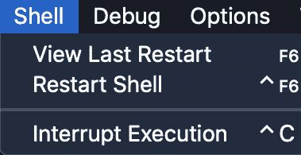
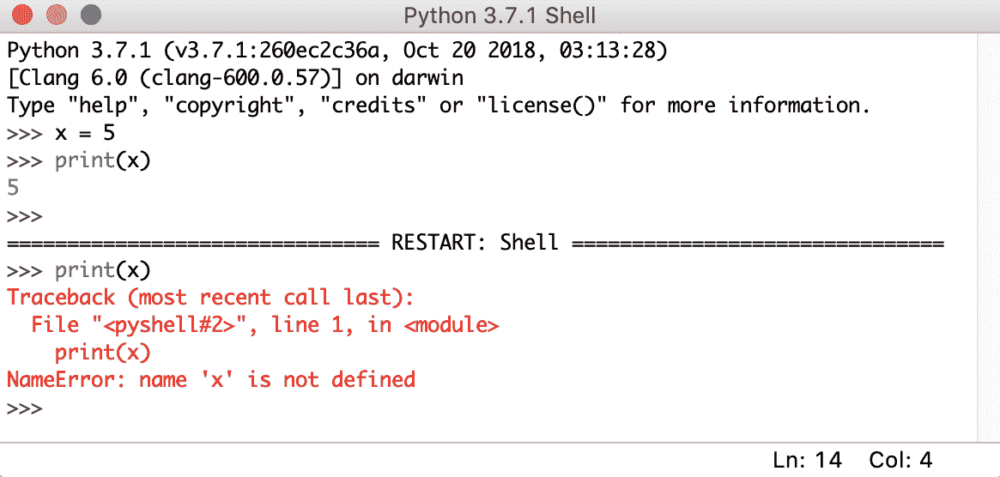
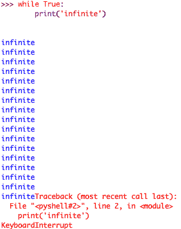
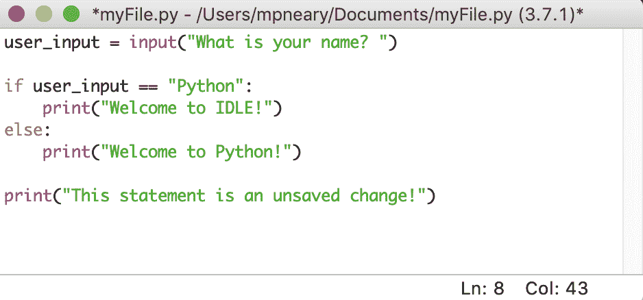
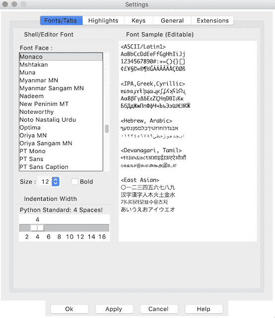
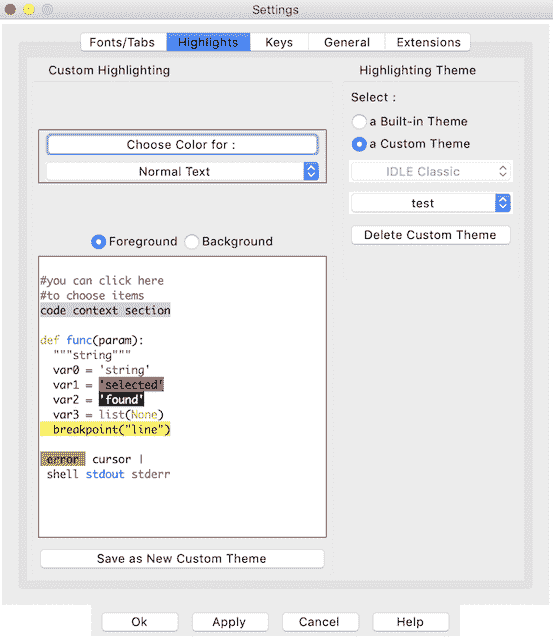
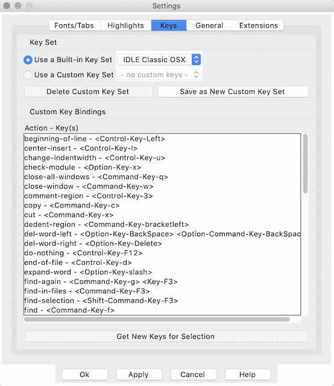
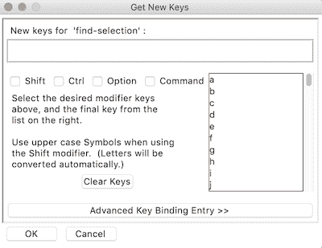
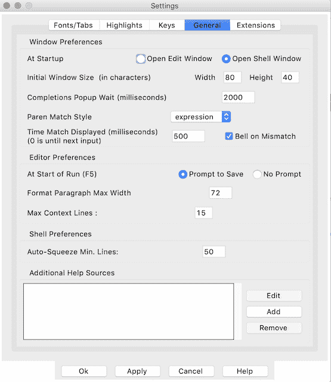

# Python IDLE 入门

> 原文：<https://realpython.com/python-idle/>

*立即观看**本教程有真实 Python 团队创建的相关视频课程。和写好的教程一起看，加深理解: [**从 Python 闲置开始**](/courses/starting-python-idle/)*

 *如果你最近下载了 Python 到你的电脑上，那么你可能已经注意到你的电脑上有一个名为 **IDLE** 的新程序。你可能想知道，“这个程序在我的电脑上做什么？我没有下载那个！”虽然您可能没有自己下载过这个程序，但 IDLE 是与每个 Python 安装捆绑在一起的。它可以帮助您立即开始学习这门语言。在本教程中，您将学习如何在 Python IDLE 中工作，以及一些您可以在 Python 之旅中使用的很酷的技巧！

在本教程中，您将学习:

*   Python IDLE 是什么
*   如何使用 IDLE 直接与 Python 交互
*   如何用 IDLE 编辑、执行和调试 Python 文件
*   如何根据自己的喜好定制 Python IDLE

**免费奖励:** 并学习 Python 3 的基础知识，如使用数据类型、字典、列表和 Python 函数。

## Python 空闲是什么？

每一个 Python 安装都带有一个**集成开发和学习环境**，你会看到它被缩短为 IDLE 甚至 IDE。这是一类帮助你更有效地编写代码的应用程序。虽然有许多[ide](https://realpython.com/python-ides-code-editors-guide/)供您选择，但是 Python IDLE 非常精简，这使得它成为初学程序员的完美工具。

Python IDLE 包含在 Windows 和 Mac 上的 Python 安装中。如果您是 Linux 用户，那么您应该能够使用您的包管理器找到并下载 Python IDLE。一旦你安装了它，你就可以使用 Python IDLE 作为交互式解释器或者文件编辑器。

[*Remove ads*](/account/join/)

### *交互式解释器*

 *试验 Python 代码的最好地方是在[交互式解释器](https://realpython.com/interacting-with-python/)，也称为**外壳**。外壳是一个基本的[读取-评估-打印循环(REPL)](https://en.wikipedia.org/wiki/Read%E2%80%93eval%E2%80%93print_loop) 。它读取一条 Python 语句，评估该语句的结果，然后将结果打印在屏幕上。然后，它循环返回以读取下一条语句。

Python shell 是试验小代码片段的绝佳场所。您可以通过计算机上的终端或命令行应用程序来访问它。您可以使用 Python IDLE 简化工作流程，当您打开 Python shell 时，它会立即启动。

### 一个文件编辑器

每个程序员都需要能够编辑和保存文本文件。Python 程序是扩展名为`.py`的文件，包含多行 Python 代码。Python IDLE 使您能够轻松地创建和编辑这些文件。

Python IDLE 还提供了几个你将在专业 ide 中看到的有用特性，比如基本语法高亮、代码完成和自动缩进。专业 ide 是更健壮的软件，它们有一个陡峭的学习曲线。如果您刚刚开始您的 Python 编程之旅，那么 Python IDLE 是一个很好的选择！

## 如何使用 Python IDLE Shell

shell 是 Python IDLE 的默认操作模式。当你点击图标打开程序时，你首先看到的是外壳:

这是一个空白的 Python 解释器窗口。您可以使用它立即开始与 Python 交互。您可以用一小段代码来测试它:

这里，您使用了 [`print()`](https://realpython.com/python-print/) 将字符串`"Hello, from IDLE!"`输出到您的屏幕。这是与 Python IDLE 交互的最基本方式。您一次输入一个命令，Python 会响应每个命令的结果。

接下来，看看菜单栏。您将看到使用 shell 的几个选项:

您可以从该菜单重新启动 shell。如果您选择该选项，那么您将清除 shell 的状态。它将表现得好像您已经启动了一个新的 Python IDLE 实例。外壳将会忘记以前状态的所有内容:

在上图中，首先声明一个[变量](https://realpython.com/python-variables/)，`x = 5`。当您调用`print(x)`时，shell 显示正确的输出，这是数字`5`。但是，当您重启 shell 并尝试再次调用`print(x)`时，您可以看到 shell 打印了一个 [traceback](https://realpython.com/python-traceback/) 。这是一条错误消息，说明变量`x`未定义。shell 已经忘记了重启之前发生的所有事情。

您也可以从这个菜单中断 shell 的执行。这将在中断时停止 shell 中正在运行的任何程序或语句。看看当您向 shell 发送键盘中断时会发生什么:

窗口底部以红色文本显示一条`KeyboardInterrupt`错误信息。程序接收到中断并已停止执行。

[*Remove ads*](/account/join/)

## *如何使用 Python 文件*

 *Python IDLE 提供了一个成熟的文件编辑器，让您能够在这个程序中编写和执行 Python 程序。内置的文件编辑器还包括几个功能，如代码完成和自动缩进，这将加快您的编码工作流程。首先，我们来看看如何在 Python IDLE 中编写和执行程序。

### 打开文件

要启动一个新的 Python 文件，从菜单栏中选择*文件→新文件*。这将在编辑器中打开一个空白文件，如下所示:

从这个窗口中，您可以编写一个全新的 Python 文件。您也可以通过选择菜单栏中的*文件→打开…* 来打开现有的 Python 文件。这将打开您操作系统的文件浏览器。然后，可以找到想要打开的 Python 文件。

如果您对阅读 Python 模块的源代码感兴趣，那么您可以选择*文件→路径浏览器*。这将允许您查看 Python IDLE 可以看到的模块。当你双击其中一个，文件编辑器就会打开，你就可以阅读它了。

该窗口的内容将与您调用`sys.path`时返回的路径相同。如果您知道想要查看的特定模块的名称，那么您可以选择*文件→模块浏览器*，并在出现的框中输入模块的名称。

### 编辑文件

一旦你在 Python IDLE 中打开了一个文件，你就可以对它进行修改。当您准备好编辑文件时，您会看到类似这样的内容:

文件的内容显示在打开的窗口中。窗口顶部的栏包含三条重要信息:

1.  **您正在编辑的文件的名称**
2.  **您可以在电脑上找到该文件的文件夹的完整路径**
3.  IDLE 正在使用的 Python 版本

在上图中，您正在编辑文件`myFile.py`，它位于`Documents`文件夹中。Python 版本是 3.7.1，你可以在括号里看到。

窗口右下角还有两个数字:

1.  **Ln:** 显示光标所在的行号。
2.  **Col:** 显示光标所在的列号。

看到这些数字很有用，这样您可以更快地找到错误。它们还能帮助你确保你保持在一定的线宽内。

此窗口中有一些视觉提示，可以帮助您记住保存您的工作。如果你仔细观察，你会发现 Python IDLE 使用星号让你知道你的文件有未保存的修改:

显示在空闲窗口顶部的文件名被星号包围。这意味着编辑器中有未保存的更改。您可以使用系统的标准键盘快捷键保存这些更改，也可以从菜单栏中选择*文件→保存*。请确保使用扩展名`.py`保存文件，以便启用语法高亮显示。

[*Remove ads*](/account/join/)

### *执行文件*

 *当你想执行一个你在空闲状态下创建的文件时，你应该首先确保它被保存。请记住，您可以通过查看文件编辑器窗口顶部文件名周围的星号来查看您的文件是否被正确保存。不过，如果你忘记了也不用担心！当你试图执行一个未保存的文件时，Python IDLE 会提醒你保存。

要在空闲状态下执行文件，只需按键盘上的 F5 键。您也可以从菜单栏中选择*运行→运行模块*。这两个选项都将重启 Python 解释器，然后运行您用新的解释器编写的代码。这个过程与您在终端中运行`python3 -i [filename]`是一样的。

当你的代码执行完毕，解释器将知道你的代码的一切，包括任何全局变量、函数和类。这使得 Python IDLE 成为在出现问题时检查数据的好地方。如果你需要中断程序的执行，你可以在运行代码的解释器中按 `Ctrl` + `C` 。

## 如何改进你的工作流程

现在您已经了解了如何在 Python IDLE 中编写、编辑和执行文件，是时候加快您的工作流程了！Python IDLE 编辑器提供了一些您将在大多数专业 ide 中看到的特性，来帮助您更快地编码。这些特性包括自动缩进、代码完成和调用提示以及代码上下文。

### 自动缩进

当 IDLE 需要开始一个新的块时，它会自动缩进你的代码。这通常发生在您键入冒号(`:`)之后。当您在冒号后按回车键时，光标将自动移动一定数量的空格，并开始一个新的代码块。

您可以在设置中配置光标将移动多少个空格，但默认是标准的四个空格。Python 的开发人员就编写良好的 Python 代码的标准风格达成了一致，这包括缩进、空白等规则。这种标准风格被形式化了，现在被称为 **PEP 8** 。要了解更多信息，请查看[如何用 PEP 8](https://realpython.com/python-pep8/) 编写漂亮的 Python 代码。

### 代码完成和呼叫提示

当你为一个大项目或者一个复杂的问题编写代码时，你可能会花费大量的时间来输入你需要的所有代码。**代码完成**通过尝试为您完成代码来帮助您节省键入时间。Python IDLE 具有基本的代码完成功能。它只能自动补全函数和类名。要在编辑器中使用自动完成功能，只需在一系列文本后按 tab 键。

Python IDLE 还会提供呼叫提示。一个**调用提示**就像是对代码某一部分的提示，帮助你记住那个元素需要什么。键入左括号开始函数调用后，如果几秒钟内没有键入任何内容，将会出现调用提示。例如，如果您不太记得如何添加到一个[列表](https://realpython.com/python-lists-tuples/)，那么您可以在左括号后暂停以调出呼叫提示:

呼叫提示将显示为弹出提示，提醒您如何添加到列表中。像这样的调用技巧在您编写代码时提供了有用的信息。

### 代码上下文

**代码上下文**功能是 Python 空闲文件编辑器的一个简洁的特性。它将向你展示一个函数、类、循环或其他结构的范围。当您滚动浏览一个很长的文件，并需要在编辑器中查看代码时跟踪您的位置时，这尤其有用。

要打开它，在菜单栏中选择*选项→代码上下文*。您会看到编辑器窗口顶部出现一个灰色栏:

当你向下滚动你的代码时，包含每一行代码的**上下文**将停留在这个灰色条内。这意味着你在上图中看到的`print()`函数是[主函数](https://realpython.com/python-main-function/)的一部分。当您到达超出此函数范围的一行时，条形将会消失。

## 如何在空闲状态下调试

一个 **bug** 是你程序中的一个意外问题。它们可以以多种形式出现，其中一些比另一些更难修复。有些 bug 非常棘手，你不能通过通读你的程序来发现它们。幸运的是，Python IDLE 提供了一些[基本工具](https://realpython.com/python-debug-idle/)，可以帮助你[轻松调试](https://realpython.com/courses/python-debugging-pdb/)你的程序！

[*Remove ads*](/account/join/)

### *解释器调试模式*

 *如果您想用内置调试器运行您的代码，那么您需要打开这个特性。为此，从 Python 空闲菜单栏中选择*调试→调试器*。在解释器中，您应该看到`[DEBUG ON]`出现在提示符(`>>>`)之前，这意味着解释器已经准备好并正在等待。

执行 Python 文件时，将出现调试器窗口:

在此窗口中，您可以在代码执行时检查局部变量和全局变量的值。这使您能够深入了解代码运行时数据是如何被操作的。

您也可以单击以下按钮来浏览代码:

*   **Go:** 按下此键，执行前进到下一个[断点](https://en.wikipedia.org/wiki/Breakpoint)。您将在下一节了解这些内容。
*   **步骤:**按此执行当前行，转到下一行。
*   **Over:** 如果当前代码行包含一个函数调用，那么按下此键以*跳过*该函数。换句话说，执行那个函数，转到下一行，但是在执行函数的时候不要暂停(除非有断点)。
*   **Out:** 如果当前行代码在一个函数中，则按此键可以从该函数的*中跳出*。换句话说，继续执行这个函数，直到返回。

一定要小心，因为没有反向按钮！在程序的执行过程中，您只能及时向前移动。

您还会在“调试”窗口中看到四个复选框:

1.  **全局:**您的程序的全局信息
2.  **Locals:** 您的程序在执行过程中的本地信息
3.  **栈:**执行过程中运行的函数
4.  **来源:**你的文件在空闲时编辑

当您选择其中之一时，您将在调试窗口中看到相关信息。

### 断点

一个**断点**是一行代码，当你运行你的代码时，你把它标识为解释器应该暂停的地方。它们只有在*调试*模式开启时才能工作，所以确保你已经先这样做了。

要设置断点，右键单击要暂停的代码行。这将以黄色突出显示代码行，作为设置断点的可视指示。您可以在代码中设置任意数量的断点。要撤销断点，再次右键单击同一行并选择*清除断点*。

一旦你设置了断点并打开了*调试*模式，你就可以像平常一样运行你的代码了。调试器窗口将弹出，您可以开始手动单步调试您的代码。

### 错误和异常

当您在解释器中看到报告给您的错误时，Python IDLE 允许您从菜单栏直接跳转到有问题的文件或行。您只需用光标高亮显示报告的行号或文件名，并从菜单栏中选择*调试→转到文件/行*。这将打开有问题的文件，并把您带到包含错误的那一行。无论*调试*模式是否开启，该功能都起作用。

Python IDLE 还提供了一个叫做**堆栈查看器**的工具。你可以在菜单栏的*调试*选项下进入。这个工具将向您展示 Python IDLE 在运行代码时遇到的最后一个错误或[异常](https://realpython.com/python-exceptions/)的堆栈上出现的错误的[回溯](https://realpython.com/courses/python-traceback/)。当发生意外或有趣的错误时，您可能会发现查看堆栈很有帮助。否则，这个特性可能很难解析，并且可能对您没有用处，除非您正在编写非常复杂的代码。

## 如何定制 Python IDLE

有很多方法可以让 Python IDLE 拥有适合自己的视觉风格。默认的外观基于 Python 徽标中的颜色。如果你不喜欢任何东西的样子，那么你几乎总是可以改变它。

要访问定制窗口，从菜单栏中选择*选项→配置空闲*。要预览您想要进行的更改的结果，请按下*应用*。当你定制完 Python IDLE 后，按 *OK* 保存你所有的修改。如果您不想保存您的更改，只需按下*取消*。

您可以自定义 Python IDLE 的 5 个区域:

1.  字体/标签
2.  突出
3.  键
4.  一般
5.  扩展ˌ扩张

现在，让我们来逐一了解一下。

[*Remove ads*](/account/join/)

### *字体/标签*

 *第一个选项卡允许您更改字体颜色、字体大小和字体样式。根据您的操作系统，您可以将字体更改为几乎任何您喜欢的样式。字体设置窗口如下所示:

您可以使用滚动窗口选择您喜欢的字体。(建议你选择 Courier New 这样的定宽字体。)选择一个足够大的字体，让你看得更清楚。您也可以点击*粗体*旁边的复选框来切换是否所有文本都以粗体显示。

此窗口还允许您更改每个缩进级别使用的空格数。默认情况下，这将被设置为四个空格的 [PEP 8](https://realpython.com/python-pep8/) 标准。您可以更改这一点，使代码的宽度根据您的喜好或多或少地展开。

### 亮点

第二个定制选项卡将允许您更改突出显示。**语法突出显示**是任何 IDE 的一个重要特性，它可以突出显示您正在使用的语言的语法。这有助于您直观地区分不同的 Python 结构和代码中使用的数据。

Python IDLE 允许您完全自定义 Python 代码的外观。它预装了三种不同的亮点主题:

1.  无聊的日子
2.  无所事事的夜晚
3.  闲置新闻

您可以从这些预安装的主题中进行选择，或者在此窗口中创建您自己的自定义主题:

不幸的是，IDLE 不允许你从一个文件中安装自定义主题。你必须从这个窗口创建自定义主题。为此，您可以简单地开始改变不同项目的颜色。选择一个项目，然后按*为*选择颜色。你将被带到一个颜色选择器，在那里你可以选择你想要使用的确切颜色。

然后，系统会提示您将该主题保存为新的自定义主题，您可以输入自己选择的名称。如果愿意，您可以继续更改不同项目的颜色。记得按下*应用*来查看您的行动变化！

### 按键

第三个定制选项卡允许您将不同的按键映射到动作，也称为**键盘快捷键**。无论何时使用 IDE，这些都是生产力的重要组成部分。你可以自己想出键盘快捷键，也可以使用 IDLE 自带的快捷键。预安装的快捷方式是一个很好的起点:

键盘快捷键按动作的字母顺序列出。它们以*动作-快捷方式*的格式列出，其中*动作*是当你按下*快捷方式*中的组合键时会发生的事情。如果您想使用内置的键集，请选择与您的操作系统相匹配的映射。请密切注意不同的键，并确保您的键盘有它们！

#### 创建自己的快捷方式

键盘快捷键的定制与语法高亮颜色的定制非常相似。遗憾的是，IDLE 不允许您从文件中安装自定义键盘快捷键。您必须从*键*选项卡创建一组自定义快捷键。

从列表中选择一对，按下*获取新的选择键*。将弹出一个新窗口:

在这里，您可以使用复选框和滚动菜单来选择要用于该快捷键的组合键。您可以选择*高级键绑定条目> >* 手动输入命令。请注意，这不会拾取您按下的键。您必须逐字键入您在快捷键列表中看到的命令。

[*Remove ads*](/account/join/)

### *常规*

 *“定制”窗口的第四个选项卡是进行小的常规更改的地方。“常规设置”选项卡如下所示:

在这里，您可以自定义窗口大小，以及启动 Python IDLE 时是先打开 shell 还是先打开文件编辑器。这个窗口中的大部分东西改变起来并不令人兴奋，所以你可能不需要摆弄它们。

### 扩展

定制窗口的第五个选项卡允许您向 Python IDLE 添加扩展。扩展允许你在编辑器和解释器窗口中添加新的、令人敬畏的特性。您可以从互联网上下载它们，并将其安装到 Python IDLE 中。

要查看安装了哪些扩展，选择*选项→配置空闲- >扩展*。互联网上有许多[扩展](http://idlex.sourceforge.net/extensions.html)可供你阅读更多。找到自己喜欢的，添加到 Python IDLE！

## 结论

在本教程中，您已经学习了使用 **IDLE** 编写 Python 程序的所有基础知识。你知道什么是 Python IDLE，以及如何使用它直接与 Python 交互。您还了解了如何处理 Python 文件，以及如何根据自己的喜好定制 Python IDLE。

**你已经学会了如何:**

*   使用 Python 空闲 shell
*   使用 Python IDLE 作为文件编辑器
*   利用帮助您更快编码的功能改进您的工作流程
*   调试代码并查看错误和异常
*   根据您的喜好定制 Python IDLE

现在，您拥有了一个新工具，它将让您高效地编写 Pythonic 代码，并为您节省无数时间。编程快乐！

*立即观看**本教程有真实 Python 团队创建的相关视频课程。和写好的教程一起看，加深理解: [**从 Python 闲置开始**](/courses/starting-python-idle/)********