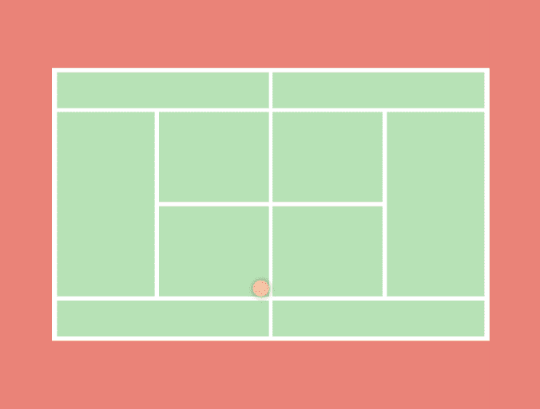
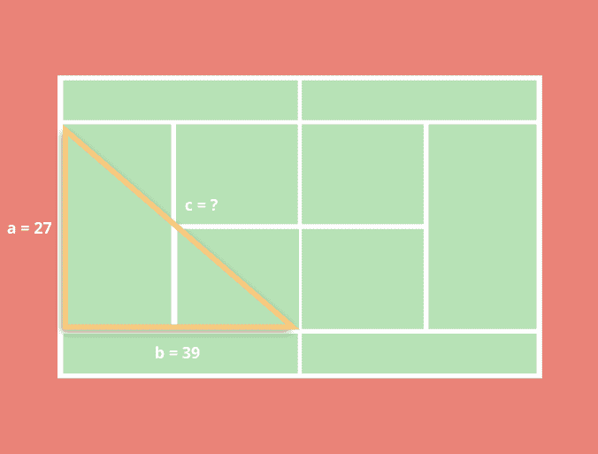

# Python 平方根函数

> 原文:[https://realpython.com/python-square-root-function/](https://realpython.com/python-square-root-function/)

*立即观看**本教程有真实 Python 团队创建的相关视频课程。和写好的教程一起看，加深理解:[**Python 中的平方根函数**](/courses/square-root-function-python/)*

 *你想解一个二次方程吗？也许你需要计算直角三角形一边的长度。对于这类方程和更多的方程，Python 的平方根函数， **`sqrt()`** ，可以帮助你快速准确地计算出你的解。

到本文结束时，您将了解到:

*   平方根是什么
*   如何使用 Python 的平方根函数，`sqrt()`
*   什么时候`sqrt()`在现实世界中有用

让我们开始吧！

**Python 中途站:**本教程是一个**快速**和**实用**的方法来找到你需要的信息，所以你会很快回到你的项目！

**免费奖励:** ，它向您展示 Python 3 的基础知识，如使用数据类型、字典、列表和 Python 函数。

## 数学中的平方根

在代数中，一个**平方**、 *x* ，是一个[数](https://realpython.com/python-numbers/)、 *n* 乘以自身的结果: *x = n*

您可以使用 Python 计算平方:

>>>

```
>>> n = 5
>>> x = n ** 2
>>> x
25
```

Python `**`运算符用于计算一个数的幂。在这种情况下，5 的平方或 5 的 2 次方是 25。

那么，平方根是数字 *n* ，当乘以它自身时，产生平方， *x* 。

在这个例子中， *n* 的平方根是 5。

25 是一个完美正方形的例子。完美平方是整数值的平方:

>>>

```
>>> 1 ** 2
1

>>> 2 ** 2
4

>>> 3 ** 2
9
```

当你在初级代数课上学习乘法表时，你可能已经记住了一些完美的正方形。

如果给你一个小正方，计算或记忆它的平方根可能足够简单。但是对于大多数其他的方块来说，这种计算可能会变得有点乏味。通常，当你没有计算器时，一个估计就足够了。

幸运的是，作为一名 Python 开发者，您确实有一个计算器，即 [Python 解释器](https://realpython.com/interacting-with-python/#using-the-python-interpreter-interactively)！

[*Remove ads*](/account/join/)

## *Python 平方根函数*

 *Python 标准库中的 [`math`模块](https://realpython.com/python-math-module/)，可以帮助你在代码中处理数学相关的问题。它包含许多有用的功能，如`remainder()`和`factorial()`。还包括 [Python 平方根函数、`sqrt()`](https://docs.python.org/3/library/math.html#math.sqrt) 。

您将从[导入](https://realpython.com/absolute-vs-relative-python-imports/) `math`开始:

>>>

```
>>> import math
```

这就够了！你现在可以使用`math.sqrt()`来计算平方根。

有一个简单明了的界面。

它有一个参数`x`，它(正如您之前看到的)代表您试图计算平方根的平方。在前面的例子中，这应该是`25`。

`sqrt()`的返回值是`x`的平方根，作为[浮点数](https://realpython.com/python-data-types/#floating-point-numbers)。在本例中，这将是`5.0`。

让我们来看一些如何(以及如何不)使用`sqrt()`的例子。

### 正数的平方根

可以传递给`sqrt()`的一种参数是正数。这既包括 [`int`](https://realpython.com/python-data-types/#integers) 又包括 [`float`](https://realpython.com/python-data-types/#floating-point-numbers) 类型。

例如，您可以使用`sqrt()`求解`49`的平方根:

>>>

```
>>> math.sqrt(49)
7.0
```

返回值是作为浮点数的`7.0`(`49`的平方根)。

除了整数，您还可以传递`float`值:

>>>

```
>>> math.sqrt(70.5)
8.396427811873332
```

您可以通过计算平方根的倒数来验证平方根的准确性:

>>>

```
>>> 8.396427811873332 ** 2
70.5
```

### 零的平方根

偶数`0`是传递给 Python 平方根函数的有效平方:

>>>

```
>>> math.sqrt(0)
0.0
```

虽然您可能不需要经常计算零的平方根，但是您可能会将一个[变量](https://realpython.com/python-variables/)传递给`sqrt()`，而您实际上并不知道它的值。所以，很高兴知道在这些情况下它可以处理零。

[*Remove ads*](/account/join/)

### *负数的平方根*

 *任何[实数](https://en.wikipedia.org/wiki/Real_number)的平方不能为负。这是因为只有当一个因子为正，另一个为负时，负乘积才是可能的。根据定义，正方形是一个数和它本身的乘积，所以不可能有负的实数正方形:

>>>

```
>>> math.sqrt(-25)
Traceback (most recent call last):
  File "<stdin>", line 1, in <module>
ValueError: math domain error
```

如果你试图给`sqrt()`传递一个负数，那么你会得到一个`ValueError`，因为负数不在可能的实数范围内。相反，负数的平方根需要是[复数](https://en.wikipedia.org/wiki/Complex_number)，这超出了 Python 平方根函数的范围。

## 现实世界中的平方根

要查看 Python 平方根函数的实际应用，让我们转向网球运动。

想象一下，世界上速度最快的球员之一拉斐尔·纳达尔刚刚从后角打了一个正手球，底线在[网球场的边线上](https://en.wikipedia.org/wiki/Tennis_court):

[](https://files.realpython.com/media/untitled.b0437a7fab5e.png)

现在，假设他的对手回击了一记吊球(这种球会使球变短，几乎没有向前的动力)到另一个边线与球网相遇的对角:

[](https://files.realpython.com/media/untitled_1.9226ba6799b4.png)

纳达尔必须跑多远才能触到球？

你可以从[规则网球场的尺寸](https://en.wikipedia.org/wiki/Tennis_court#/media/File:Tennis_court_imperial.svg)确定底线是 27 英尺长，边线(在网的一边)是 39 英尺长。所以，本质上，这归结为求解直角三角形的斜边:

[](https://files.realpython.com/media/Tennis_Court_1.12dcfe313971.png)

利用几何学中一个很有价值的方程[勾股定理](https://en.wikipedia.org/wiki/Pythagorean_theorem)，我们知道 *a + b = c* ，其中 *a* 和 *b* 是直角三角形的腿， *c* 是斜边。

因此，我们可以通过重新排列方程来求解 *c* 来计算纳达尔必须跑的距离:

[](https://files.realpython.com/media/pythagorean_theorem_solve.1176a7b846c3.png)

您可以使用 Python 平方根函数求解该方程:

>>>

```
>>> a = 27
>>> b = 39
>>> math.sqrt(a ** 2 + b ** 2)
47.43416490252569
```

所以，纳达尔必须跑大约 47.4 英尺(14.5 米)，才能触到球并保住分。

## 结论

恭喜你！现在，您已经了解了 Python 平方根函数的所有内容。

您已经完成了:

*   平方根简介
*   Python 平方根函数的来龙去脉，`sqrt()`
*   使用真实世界示例的`sqrt()`的实际应用

知道如何使用`sqrt()`只是成功的一半。理解何时使用它是另一个问题。现在，您已经知道了这两者，那么就去应用您新掌握的 Python 平方根函数吧！

*立即观看**本教程有真实 Python 团队创建的相关视频课程。和写好的教程一起看，加深理解:[**Python 中的平方根函数**](/courses/square-root-function-python/)****