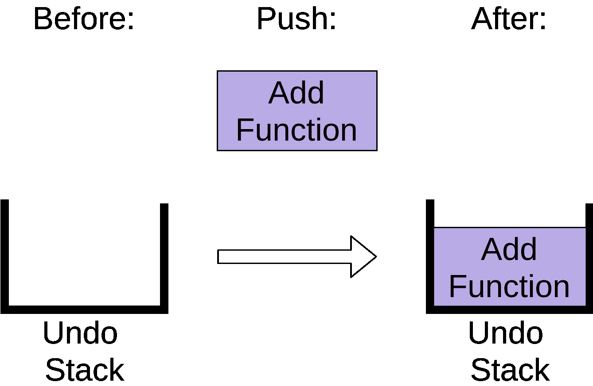
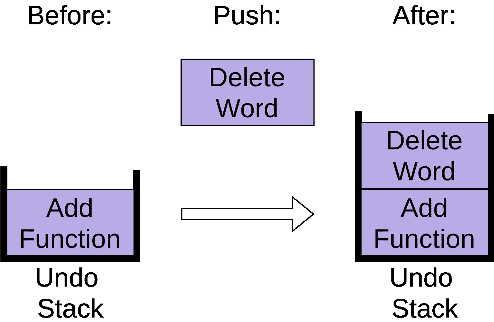
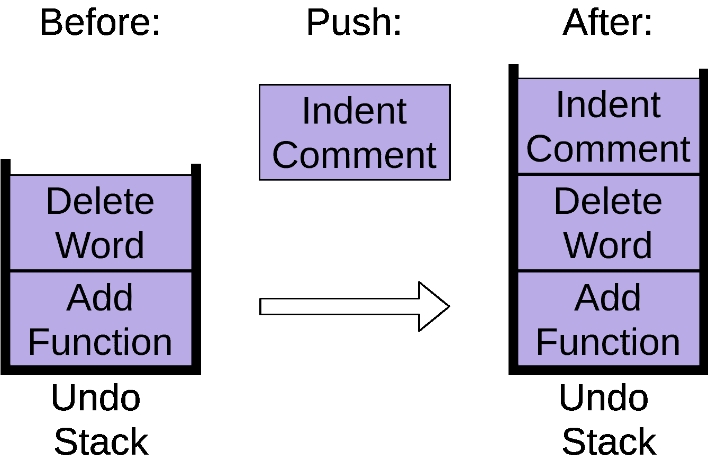
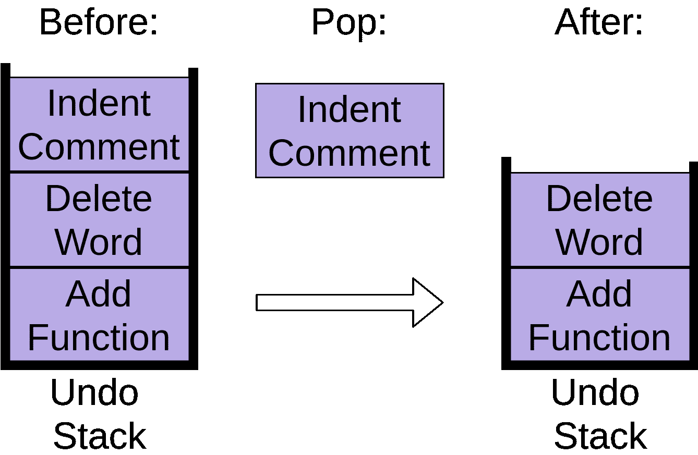
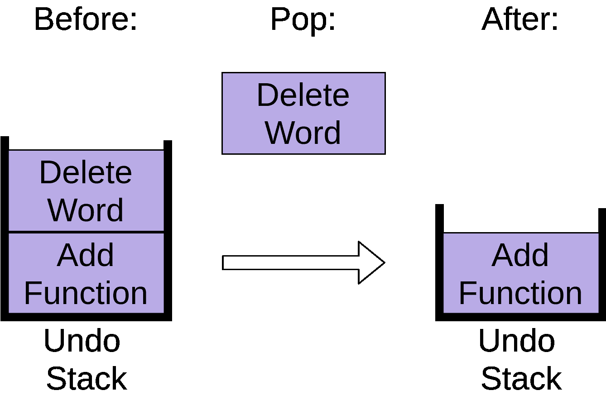
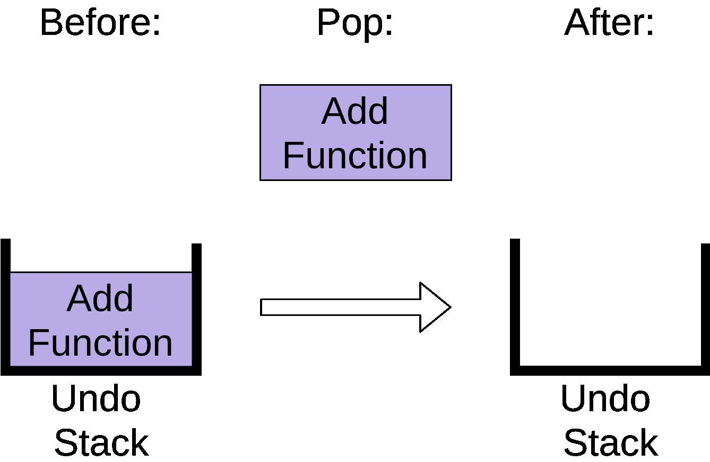
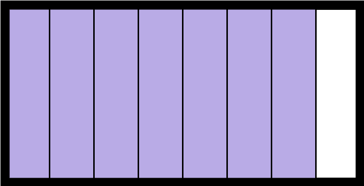

# 如何实现 Python 堆栈

> 原文:[https://realpython.com/how-to-implement-python-stack/](https://realpython.com/how-to-implement-python-stack/)

*立即观看**本教程有真实 Python 团队创建的相关视频课程。和书面教程一起看，加深理解: [**如何实现一个 Python 栈**](/courses/python-stack/)*

 *你听说过 stacks，想知道它们是什么吗？你有一个大概的想法，但是想知道如何实现一个 Python 堆栈？你来对地方了！

在本教程中，您将学习:

*   如何识别栈何时是数据结构的好选择
*   如何决定哪个实现最适合您的程序
*   在线程或多处理环境中，对于堆栈有什么额外的考虑

本教程是为那些擅长运行脚本，知道什么是 [`list`](https://realpython.com/python-lists-tuples/) 以及如何使用它，并且想知道如何实现 Python 栈的 Python 爱好者准备的。

**免费奖励:** 并学习 Python 3 的基础知识，如使用数据类型、字典、列表和 Python 函数。

## 什么是堆栈？

一个[栈](https://realpython.com/queue-in-python/#stack-last-in-first-out-lifo)是一个[数据结构](https://realpython.com/python-data-structures/)，以后进先出的方式存储项目。这通常被称为后进先出法。这与以先进先出(FIFO)方式存储项目的[队列](https://realpython.com/queue-in-python/#queue-first-in-first-out-fifo)形成对比。

如果你想到一个你可能很熟悉的用例:你的编辑器中的*撤销*特性，那么理解一个栈可能是最容易的。

让我们假设您正在编辑一个 Python 文件，这样我们就可以看到您执行的一些操作。首先，添加一个新函数。这将向撤消堆栈添加一个新项:

[](https://files.realpython.com/media/stack_push_add_function.b406cffbe2dd.png)

您可以看到堆栈现在有一个 *Add Function* 操作。添加函数后，您从注释中删除一个单词。这也被添加到撤消堆栈中:

[](https://files.realpython.com/media/stack_push_delete_word.6a64fed15fde.png)

注意 *Delete Word* 项是如何放在栈顶的。最后，你缩进一个注释，使它正确地排列起来:

[](https://files.realpython.com/media/stack_push_indent.01223b7d94a7.png)

您可以看到，这些命令都存储在一个撤销堆栈中，每个新命令都放在顶部。当你使用堆栈时，像这样添加新的项目被称为`push`。

现在您已经决定撤销所有这三个更改，所以您点击了撤销命令。它获取堆栈顶部的项目，该项目缩进注释，并将其从堆栈中移除:

[](https://files.realpython.com/media/stack_pop_indent.e28029c81831.png)

您的编辑器撤消了缩进，撤消堆栈现在包含两项。该操作与`push`相反，通常称为`pop`。

当您再次点击 undo 时，下一项将弹出堆栈:

[](https://files.realpython.com/media/stack_pop_delete_word.89f14f6ed390.png)

这移除了*删除字*项，在堆栈上只留下一个操作。

最后，如果你第三次点击*撤销*，那么最后一个项目将弹出堆栈:

[](https://files.realpython.com/media/stack_pop_add_function.a4f66332971a.png)

撤消堆栈现在是空的。之后再次点击*撤销*将不会有任何效果，因为你的撤销堆栈是空的，至少在大多数编辑器中是这样。在下面的实现描述中，您将看到当您在空堆栈上调用`.pop()`时会发生什么。

[*Remove ads*](/account/join/)

## *实现 Python 堆栈*

 *在实现 Python 堆栈时，有几个选项。这篇文章不会涵盖所有的，只是基本的，将满足您几乎所有的需求。您将专注于使用属于 Python 库的数据结构，而不是自己编写或使用第三方包。

您将看到以下 Python 堆栈实现:

*   `list`
*   `collections.deque`
*   `queue.LifoQueue`

### 使用`list`创建一个 Python 栈

您可能在程序中经常使用的内置`list`结构可以用作堆栈。代替`.push()`，你可以使用 [`.append()`](https://realpython.com/python-append/) 来添加新元素到你的栈顶，而`.pop()`以 LIFO 顺序移除元素:

>>>

```py
>>> myStack = []

>>> myStack.append('a')
>>> myStack.append('b')
>>> myStack.append('c')

>>> myStack
['a', 'b', 'c']

>>> myStack.pop()
'c'
>>> myStack.pop()
'b'
>>> myStack.pop()
'a'

>>> myStack.pop()
Traceback (most recent call last):
  File "<console>", line 1, in <module>
IndexError: pop from empty list
```

你可以在最后一个命令中看到，如果你在一个空栈上调用`.pop()`，一个`list`将引发一个`IndexError`。

有熟悉的优势。你知道它是如何工作的，并且可能已经在你的程序中使用过了。

不幸的是，与您将看到的其他数据结构相比，`list`有一些缺点。最大的问题是，随着增长，它可能会遇到速度问题。存储`list`中的项目是为了提供对`list`中随机元素的快速访问。概括地说，这意味着这些项在内存中是相邻存储的。

如果你的堆栈变得比当前容纳它的内存块更大，那么 Python 需要做一些内存分配。这可能导致一些`.append()`电话比其他电话花费更长的时间。

还有一个不太严重的问题。如果你使用`.insert()`将一个元素添加到你的栈中，而不是添加到末尾，这将花费更长的时间。然而，这通常不是您对堆栈所做的事情。

下一个数据结构将帮助您解决您在`list`中看到的重新分配问题。

### 使用`collections.deque`创建一个 Python 栈

`collections`模块包含 [`deque`](https://docs.python.org/3/library/collections.html#collections.deque) ，这对创建 Python 栈很有用。`deque`读作“甲板”，代表“[双头队列](https://realpython.com/queue-in-python/#deque-double-ended-queue)”

您可以在`deque`上使用与上面看到的`list`、`.append()`和`.pop()`相同的方法:

>>>

```py
>>> from collections import deque
>>> myStack = deque()

>>> myStack.append('a')
>>> myStack.append('b')
>>> myStack.append('c')

>>> myStack
deque(['a', 'b', 'c'])

>>> myStack.pop()
'c'
>>> myStack.pop()
'b'
>>> myStack.pop()
'a'

>>> myStack.pop()
Traceback (most recent call last):
  File "<console>", line 1, in <module>
IndexError: pop from an empty deque
```

这看起来几乎和上面的`list`例子一样。此时，您可能想知道为什么 Python 核心开发人员会创建两个看起来一样的数据结构。

#### 为什么有`deque`和`list`？

正如你在上面关于`list`的讨论中看到的，它是建立在连续内存块的基础上的，这意味着列表中的项目是彼此紧挨着存储的:

[](https://files.realpython.com/media/stack_list_memory_usage.bf57ab8fa608.png)

这对于一些操作非常有用，比如索引到`list`。获取`myList[3]`很快，因为 Python 确切地知道在内存中的什么地方寻找它。这种内存布局也允许切片很好地处理列表。

连续内存布局是`list`可能需要比其他对象花费更多时间来`.append()`一些对象的原因。如果连续内存块已满，那么它将需要获取另一个块，这可能比普通的`.append()`花费更长的时间:

[](https://files.realpython.com/media/stack_list_memory_push.8ad17a48f40a.png)

另一方面，`deque`是建立在双向链表上的。在一个[链表结构](https://realpython.com/linked-lists-python/)中，每个条目都存储在它自己的内存块中，并且有一个对列表中下一个条目的引用。

双向链表也是一样的，只是每个条目都引用了列表中的前一个和下一个条目。这使您可以轻松地将节点添加到列表的任意一端。

向链表结构中添加新条目只需要设置新条目的引用指向堆栈的当前顶部，然后将堆栈的顶部指向新条目:

[](https://files.realpython.com/media/stack_deque_memory.e414da68dce1.png)

然而，这种在堆栈上添加和删除条目的恒定时间伴随着一种折衷。获取`myDeque[3]`比获取列表要慢，因为 Python 需要遍历列表的每个节点才能到达第三个元素。

幸运的是，您很少想要对堆栈进行随机索引或切片。栈上的大多数操作不是`push`就是`pop`。

如果您的代码不使用线程，常量时间`.append()`和`.pop()`操作使得`deque`成为实现 Python 堆栈的绝佳选择。

[*Remove ads*](/account/join/)

## *Python 堆栈和线程*

 *Python 堆栈在多线程程序中也很有用，但是如果您对线程不感兴趣，那么您可以安全地跳过这一部分，直接跳到总结部分。

到目前为止，你已经看到的两个选项，`list`和`deque`，如果你的程序有线程，它们的行为是不同的。

从简单的开始，对于任何可以被多线程访问的数据结构，都不应该使用`list`。`list`不是线程安全的。

**注意:**如果您需要复习线程安全和竞争条件，请查看[Python 线程介绍](https://realpython.com/intro-to-python-threading/)。

然而，事情要复杂一些。如果你阅读了`deque`的文档，它清楚地说明了`.append()`和`.pop()`操作都是原子的，这意味着它们不会被不同的线程中断。

所以如果你限制自己只使用`.append()`和`.pop()`，那么你将是线程安全的。

在线程环境中使用`deque`的问题是，在那个类中还有其他方法，这些方法不是专门设计成原子的，也不是线程安全的。

因此，虽然可以使用`deque`构建线程安全的 Python 堆栈，但是这样做可能会让将来有人滥用它，从而导致竞争。

好吧，如果你正在线程化，你不能使用`list`进行堆栈，你可能也不想使用`deque`进行堆栈，那么*怎么能*为线程化程序构建 Python 堆栈呢？

答案在`queue`模块， [`queue.LifoQueue`](https://docs.python.org/3/library/queue.html) 。还记得你是如何学习到堆栈是按照后进先出的原则运行的吗？嗯，这就是`LifoQueue`的“后进先出”部分的意思。

虽然`list`和`deque`的接口相似，`LifoQueue`使用`.put()`和`.get()`向堆栈中添加和移除数据:

>>>

```py
>>> from queue import LifoQueue
>>> myStack = LifoQueue()

>>> myStack.put('a')
>>> myStack.put('b')
>>> myStack.put('c')

>>> myStack
<queue.LifoQueue object at 0x7f408885e2b0>

>>> myStack.get()
'c'
>>> myStack.get()
'b'
>>> myStack.get()
'a'

>>> # myStack.get() <--- waits forever
>>> myStack.get_nowait()
Traceback (most recent call last):
  File "<console>", line 1, in <module>
  File "/usr/lib/python3.7/queue.py", line 198, in get_nowait
    return self.get(block=False)
  File "/usr/lib/python3.7/queue.py", line 167, in get
    raise Empty
_queue.Empty
```

与`deque`不同，`LifoQueue`被设计成完全线程安全的。它的所有方法在线程环境中使用都是安全的。它还为其操作添加了可选的超时，这通常是线程程序中的必备功能。

然而，这种全线程安全是有代价的。为了实现这种线程安全，`LifoQueue`必须在每个操作上做一些额外的工作，这意味着它将花费更长的时间。

通常，这种轻微的减速不会影响你的整体程序速度，但是如果你已经测量了你的性能并发现你的栈操作是瓶颈，那么小心地切换到`deque`可能是值得的。

我想再次强调，从`LifoQueue`切换到`deque`是因为没有测量显示堆栈操作是瓶颈，所以速度更快，这是[过早优化](https://en.wikipedia.org/wiki/Program_optimization#When_to_optimize)的一个例子。不要那样做。

## Python 堆栈:应该使用哪种实现？

一般来说，如果不使用线程，应该使用`deque`。如果你正在使用线程，那么你应该使用一个`LifoQueue`，除非你已经测量了你的性能，并发现一个小的推动和弹出的速度提升将产生足够的差异，以保证维护风险。

可能很熟悉，但应该避免，因为它可能存在内存重新分配问题。`deque`和`list`的接口是相同的，`deque`没有这些问题，这使得`deque`成为你的非线程 Python 栈的最佳选择。

[*Remove ads*](/account/join/)

## *结论*

 *现在你知道什么是栈，并且已经看到了它们在现实生活中的应用。您已经评估了实现堆栈的三种不同选择，并且看到了`deque`对于非线程程序是一个很好的选择。如果您在线程环境中实现堆栈，那么使用`LifoQueue`可能是个好主意。

您现在能够:

*   认识到什么时候栈是一个好的数据结构
*   选择适合您的问题的实施方案

如果你还有问题，请在下面的评论区联系我们。现在，去写一些代码，因为你获得了另一个工具来帮助你解决编程问题！

*立即观看**本教程有真实 Python 团队创建的相关视频课程。和书面教程一起看，加深理解: [**如何实现一个 Python 栈**](/courses/python-stack/)*****