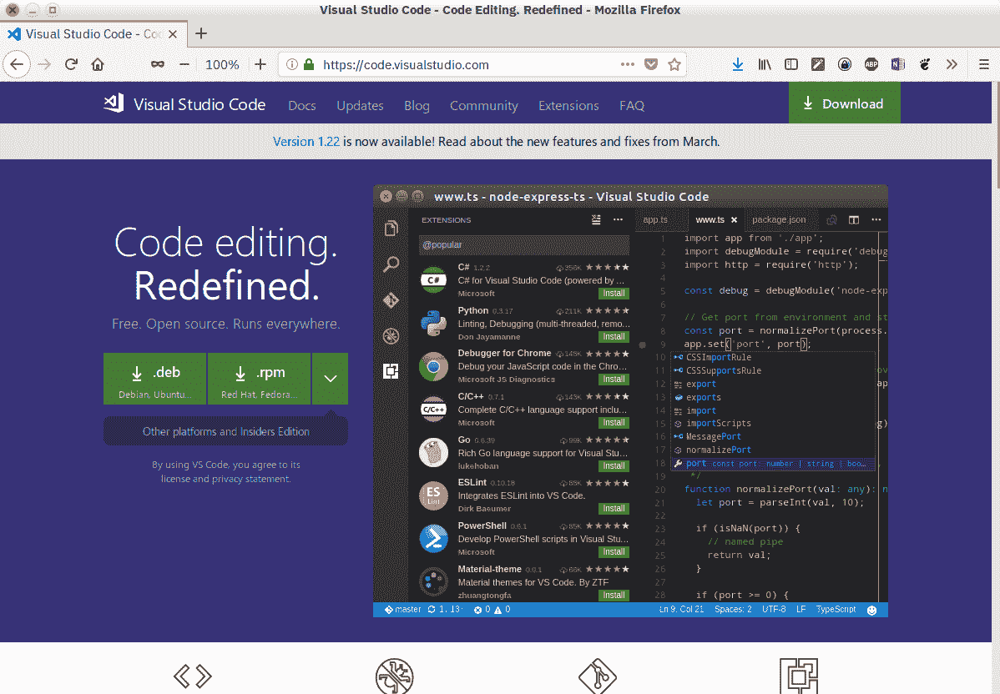
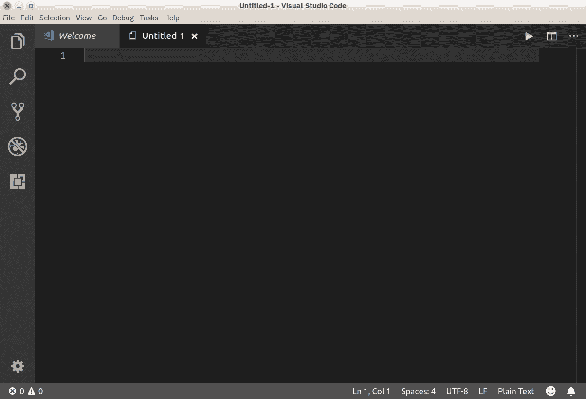
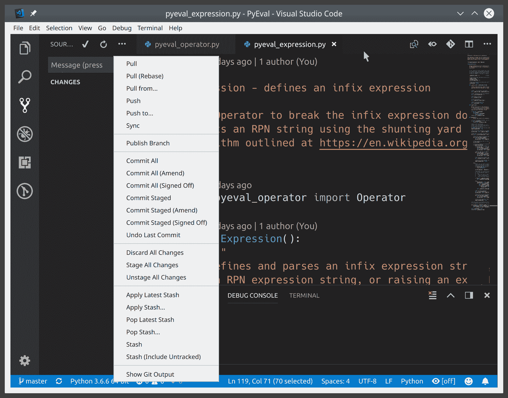

# Visual Studio 代码中的 Python 开发

> 原文:[https://real python . com/python-development-visual-studio-code/](https://realpython.com/python-development-visual-studio-code/)

*立即观看**本教程有真实 Python 团队创建的相关视频课程。配合文字教程一起看，加深理解:[**Visual Studio 代码中的 Python 开发(安装指南)**](/courses/python-development-visual-studio-code-setup-guide/)*

 *对程序员来说最酷的代码编辑器之一， [Visual Studio Code](https://code.visualstudio.com/docs) ，是一个开源的、可扩展的、轻量级的编辑器，可以在所有平台上使用。正是这些品质使得来自[微软](https://azure.com/python)的 Visual Studio 代码非常受欢迎，并且是 Python 开发的一个很好的平台。

**在本文中，您将了解 Visual Studio 代码中的 Python 开发，包括如何:**

*   **安装** Visual Studio 代码
*   发现并安装使 Python 开发变得容易的扩展
*   编写一个简单的 Python 应用程序
*   学习如何在 VS 代码中运行和**调试**现有的 Python 程序
*   将 Visual Studio 代码连接到 Git，将 GitHub 连接到**与世界分享您的代码**

我们假设您熟悉 Python 开发，并且已经在您的系统上安装了某种形式的 Python(Python 2.7、Python 3.6/3.7、Anaconda 或其他)。提供了 Ubuntu 和 Windows 的截图和演示。因为 Visual Studio 代码在所有主要平台上运行，所以您可能会看到稍有不同的 UI 元素，并且可能需要修改某些命令。

如果你已经有了一个基本的 VS 代码设置，并且你希望比本教程中的目标更深入，你可能想要探索 VS 代码中的一些[高级特性。](https://realpython.com/advanced-visual-studio-code-python/)

**免费奖励:** [掌握 Python 的 5 个想法](https://realpython.com/bonus/python-mastery-course/)，这是一个面向 Python 开发者的免费课程，向您展示将 Python 技能提升到下一个水平所需的路线图和心态。

## 为 Python 开发安装和配置 Visual Studio 代码

在任何平台上安装 Visual Studio 代码都是非常容易的。针对 [Windows](https://code.visualstudio.com/docs/setup/windows) 、 [Mac](https://code.visualstudio.com/docs/setup/mac) 和 [Linux](https://code.visualstudio.com/docs/setup/linux) 的完整说明是可用的，编辑器每月更新新功能和错误修复。您可以在 [Visual Studio 代码网站](https://code.visualstudio.com)找到所有内容:

[](https://files.realpython.com/media/vscode-website.491c40d9d828.png)

如果您想知道，Visual Studio 代码(或简称为 VS 代码)除了与它更大的基于 Windows 的同名代码 [Visual Studio](https://visualstudio.microsoft.com/vs/features/python/) 共享一个名称之外，几乎什么都不共享。

**注意:**要了解如何在 Windows 机器上设置作为完整 Python 编码环境一部分的 VS 代码，请查看本[综合指南](https://realpython.com/python-coding-setup-windows/)。

Visual Studio 代码具有对多种语言的内置支持，以及一个扩展模型，该模型具有丰富的支持其他语言的生态系统。VS 代码每月更新一次，你可以在[微软 Python 博客](http://aka.ms/pythonblog)保持最新。微软甚至让任何人都可以克隆和贡献 [VS Code GitHub repo](https://github.com/Microsoft/vscode) 。(提示公关洪水。)

[VS 代码 UI](https://code.visualstudio.com/docs/getstarted/userinterface) 有很好的文档记录，所以我在这里不再赘述:

[](https://files.realpython.com/media/vscode-welcome-screen.c64afd719b3e.png)[*Remove ads*](/account/join/)

### *Python 开发的扩展*

 *如上所述，VS 代码通过一个记录良好的[扩展模型](https://code.visualstudio.com/docs/editor/extension-gallery)支持多种编程语言的开发。 [Python 扩展](https://marketplace.visualstudio.com/items?itemName=ms-python.python)支持在 Visual Studio 代码中进行 Python 开发，具有以下特性:

*   支持 Python 3.4 和更高版本，以及 Python 2.7
*   使用[智能感知](https://code.visualstudio.com/docs/editor/intellisense)完成代码
*   [林挺](https://code.visualstudio.com/docs/python/linting)
*   [调试支持](https://code.visualstudio.com/docs/python/debugging)
*   [代码片段](https://code.visualstudio.com/docs/editor/userdefinedsnippets)
*   [单元测试支持](https://code.visualstudio.com/docs/python/unit-testing)
*   自动使用 [conda 和虚拟环境](https://code.visualstudio.com/docs/python/environments)
*   在 [Jupyter 环境](https://code.visualstudio.com/docs/python/editing#_jupyter-code-cells)和 [Jupyter 笔记本](https://code.visualstudio.com/docs/python/editing#_open-jupyter-notebooks)中编辑代码

[](https://files.realpython.com/media/python-extension-webpage.d2a7d3b6d636.png)

Visual Studio 代码扩展不仅仅涵盖编程语言功能:

*   [Keymaps](https://marketplace.visualstudio.com/search?target=VSCode&category=Keymaps&sortBy=Downloads) 让已经熟悉 Atom、 [Sublime Text](https://realpython.com/setting-up-sublime-text-3-for-full-stack-python-development/) 、 [Emacs](https://realpython.com/emacs-the-best-python-editor/) 、 [Vim](https://realpython.com/vim-and-python-a-match-made-in-heaven/) 、 [PyCharm](https://realpython.com/pycharm-guide/) 或其他环境的用户有宾至如归的感觉。

*   无论你喜欢在明亮、黑暗还是更多彩的环境中编码，都可以定制用户界面。

*   语言包提供本地化的体验。

以下是一些我觉得有用的其他扩展和设置:

*   GitLens 直接在你的编辑窗口中提供了大量有用的 Git 特性，包括责备注释和存储库探索特性。

*   从菜单中选择`File, Auto Save`即可轻松打开自动保存。默认延迟时间为 1000 毫秒，也可以通过[配置](https://code.visualstudio.com/docs/editor/codebasics#_save-auto-save)。

*   [设置同步](https://marketplace.visualstudio.com/items?itemName=Shan.code-settings-sync)允许你使用 GitHub 跨不同安装同步你的 VS 代码设置。如果您在不同的机器上工作，这有助于保持环境的一致性。

*   [Docker](https://code.visualstudio.com/docs/azure/docker) 让你快速方便地使用 Docker，帮助作者`Dockerfile`和`docker-compose.yml`，打包和部署你的项目，甚至为你的项目生成合适的 Docker 文件。

当然，在使用 VS 代码时，您可能会发现其他有用的扩展。请在[评论](#reader-comments)分享你的发现和设定！

点击活动栏上的*扩展*图标可以发现和安装新的扩展和主题。您可以使用关键字搜索扩展，以多种方式对结果进行排序，并快速轻松地安装扩展。对于本文，通过在活动栏上的*扩展*项中键入`python`，并点击*安装*来安装 Python 扩展:

[](https://files.realpython.com/media/vscode-marketplace.25e99aec9f68.gif)

您可以用同样的方式找到并安装上面提到的任何扩展。

### Visual Studio 代码配置文件

值得一提的是，Visual Studio 代码通过[用户和工作区设置](https://code.visualstudio.com/docs/getstarted/settings)是高度可配置的。

用户设置是所有 Visual Studio 代码实例的全局设置，而工作区设置是特定文件夹或项目工作区的本地设置。工作区设置为 VS 代码提供了极大的灵活性，在本文中我一直强调工作区设置。工作空间设置作为`.json`文件存储在项目工作空间的本地文件夹`.vscode`中。

## 启动一个新的 Python 程序

让我们从一个新的 Python 程序开始探索 Visual Studio 代码中的 Python 开发。在 VS 代码中，键入 `Ctrl` + `N` 打开一个新文件。(您也可以从菜单中选择*文件，新建*。)

**注意:**Visual Studio 代码 UI 提供了[命令调板](https://code.visualstudio.com/docs/getstarted/userinterface#_command-palette)，从这里可以搜索和执行任何命令，而无需离开键盘。使用`Ctrl`+`Shift`+`P`打开命令面板，键入`File: New File`，点击 `Enter` 打开一个新文件。

无论您如何到达那里，您都应该看到一个类似于下面的 VS 代码窗口:

[](https://files.realpython.com/media/vscode-new-file.39cc7b9e485d.png)

打开新文件后，您就可以开始输入代码了。

[*Remove ads*](/account/join/)

### *输入 Python 代码*

 *对于我们的测试代码，让我们快速编码厄拉多塞的[筛子(查找所有小于给定数字的素数)。开始在刚刚打开的新选项卡中键入以下代码:](https://en.wikipedia.org/wiki/Sieve_of_Eratosthenes)

```
sieve = [True] * 101
for i in range(2, 100):` 
```

您应该会看到类似这样的内容:

[](https://files.realpython.com/media/vscode-unformatted-code.e11b194803fe.png)

等等，怎么回事？为什么 Visual Studio 代码不做任何关键字突出显示、任何自动格式化或任何真正有帮助的事情？怎么回事？

答案是，现在，VS 代码不知道它在处理什么样的文件。这个缓冲区叫做`Untitled-1`，如果你看窗口的右下角，你会看到文字*纯文本*。

要激活 Python 扩展，将文件保存为`sieve.py`(从菜单中选择*文件，保存*，从命令面板中选择*文件:保存文件*，或者只使用 `Ctrl` + `S`】)。VS 代码会看到`.py`扩展名，并正确地将文件解释为 Python 代码。现在你的窗口应该是这样的:

[](https://files.realpython.com/media/vscode-formatted-code.312b8d79fbe7.png)

那就好多了！VS 代码自动将文件重新格式化为 Python，您可以通过检查左下角的语言模式来验证这一点。

如果您有多个 Python 安装(如 Python 2.7、Python 3.x 或 Anaconda)，您可以通过单击语言模式指示器或从命令面板中选择 *Python: Select Interpreter* 来更改 Python 解释器 VS 代码使用的解释器。VS 代码默认支持使用`pep8`的[格式化](https://code.visualstudio.com/docs/python/editing#_formatterspecific-settings)，但是如果你愿意，你可以选择`black`或者`yapf`。

[https://player.vimeo.com/video/487453125?background=1](https://player.vimeo.com/video/487453125?background=1)

现在让我们添加剩余的筛子代码。要查看 IntelliSense 的工作情况，请直接键入此代码，而不是剪切和粘贴，您应该会看到如下内容:

[](https://files.realpython.com/media/typing-sieve-code.3d2ea083d917.gif)

这是厄拉多塞基本筛子的完整代码:

```
sieve = [True] * 101
for i in range(2, 100):
    if sieve[i]:
        print(i)
        for j in range(i*i, 100, i):
            sieve[j] = False` 
```

当您键入这段代码时，VS Code 会自动为您适当地缩进`for`和`if`语句下的行，添加右括号，并为您提出建议。这就是智能感知的强大之处。

### 运行 Python 代码

现在代码已经完成，您可以运行它了。没有必要离开编辑器来做这件事:Visual Studio 代码可以直接在编辑器中运行这个程序。保存文件(使用 `Ctrl` + `S` )，然后在编辑器窗口点击右键，选择*在终端*运行 Python 文件:

[https://player.vimeo.com/video/487465969?background=1](https://player.vimeo.com/video/487465969?background=1)

您应该会看到终端面板出现在窗口的底部，并显示您的代码输出。

[*Remove ads*](/account/join/)

### *Python 林挺支持*

 *您可能在输入时看到弹出窗口，提示林挺不在。您可以从弹出窗口快速安装林挺支持，默认为 [PyLint](https://realpython.com/courses/writing-cleaner-python-code-pylint/) 。VS 代码也支持其他的 linters。以下是撰写本文时的完整列表:

*   `pylint`
*   `flake8`
*   `mypy`
*   `pydocstyle`
*   `pep8`
*   `prospector`
*   `pyllama`
*   `bandit`

Python 林挺页面有关于如何设置每个 linter 的完整细节。

**注意**:linter 的选择是项目工作区设置，不是全局用户设置。

## 编辑现有的 Python 项目

在厄拉多塞筛子的例子中，您创建了一个 Python 文件。这是一个很好的例子，但是很多时候，你会创建更大的项目，并在更长的时间内工作。典型的新项目工作流可能如下所示:

*   创建一个文件夹来存放项目(可能包括一个新的 GitHub 项目)
*   转到新文件夹
*   使用命令`code filename.py`创建初始 Python 代码

在一个 Python 项目中使用 Visual Studio 代码(相对于单个 Python 文件而言)会带来更多的功能，让 VS 代码真正大放异彩。让我们看看它是如何与一个更大的项目一起工作的。

在上一个千年后期，当我还是一个年轻得多的程序员时，我编写了一个计算器程序，使用 Edsger Dijkstra 的[调车场算法](https://en.wikipedia.org/wiki/Shunting-yard_algorithm)的改编，解析用中缀符号编写的方程。

为了展示 Visual Studio 代码以项目为中心的特性，我开始重新创建调车场算法，作为 Python 中的[方程求值库](https://github.com/JFincher42/PyEval)。要继续跟进，请随意在本地克隆 repo。

一旦在本地创建了文件夹，您就可以在 VS 代码中快速打开整个文件夹。我的首选方法(如上所述)修改如下，因为我已经创建了文件夹和基本文件:

```
cd /path/to/project
code .` 
```

VS 代码理解并将使用以这种方式打开时看到的任何 [virtualenv](https://virtualenv.pypa.io/en/latest/) 、 [pipenv](https://pipenv.readthedocs.io/en/latest/) 或 [conda](https://conda.io/docs/) 环境。你甚至不需要先启动虚拟环境！你甚至可以从 UI 中打开一个文件夹，使用*文件，从菜单中打开文件夹*，从命令面板中打开文件夹 `Ctrl` + `K` ， `Ctrl` + `O` ，或者*文件:打开文件夹*。

对于我的方程式评估库项目，我看到的是:

[](https://files.realpython.com/media/vscode-pyeval-library-folder.964b91919d5b.png)

当 Visual Studio 代码打开文件夹时，它也会打开您上次打开的文件。(这是可配置的。)您可以打开、编辑、运行和调试列出的任何文件。左侧活动栏中的资源管理器视图提供了文件夹中所有文件的视图，并显示了当前选项卡集中有多少未保存的文件。

## 测试支架

VS 代码可以自动识别在`unittest`框架中编写的[现有 Python 测试](https://code.visualstudio.com/docs/python/unit-testing)，或者 [`pytest`](https://realpython.com/pytest-python-testing/) 或`Nose`框架，如果这些框架安装在当前环境中的话。我有一个用`unittest`编写的[单元测试](https://realpython.com/python-testing/)，用于等式评估库，您可以在这个例子中使用它。

要运行您现有的单元测试，从项目中的任何 Python 文件中，右键单击并选择 *Run Current Unit Test File* 。您将被提示指定测试框架，在项目中的什么地方搜索测试，以及您的测试使用的文件名模式。

所有这些都作为工作空间设置保存在您的本地`.vscode/settings.json`文件中，并且可以在那里进行修改。对于这个方程项目，您选择`unittest`、当前文件夹和模式`*_test.py`。

一旦建立了测试框架并发现了测试，您就可以通过点击状态栏上的 *Run Tests* 并从命令面板中选择一个选项来运行您的所有测试:

[https://player.vimeo.com/video/487454306?background=1](https://player.vimeo.com/video/487454306?background=1)

您甚至可以通过在 VS 代码中打开测试文件，点击状态栏上的 *Run Tests* ，并选择 *Run Unit Test Method…* 和要运行的特定测试来运行单个测试。这使得解决单个测试失败并只重新运行失败的测试变得微不足道，这是一个巨大的时间节省！测试结果显示在 *Python 测试日志*下的*输出*窗格中。

[*Remove ads*](/account/join/)

## *调试支持*

 *即使 VS 代码是一个代码编辑器，直接在 VS 代码中调试 Python 也是可能的。VS 代码提供了许多您期望从一个好的代码调试器中得到的特性，包括:

*   自动[变量](https://realpython.com/python-variables/)跟踪
*   观察表情
*   断点
*   调用堆栈检查

您可以在活动栏上的*调试*视图中看到它们:

[](https://files.realpython.com/media/vscode-debug-screen.647a68278472.png)

调试器可以控制在内置终端或外部终端实例中运行的 Python 应用程序。它可以附加到已经运行的 Python 实例，甚至可以调试 [Django](https://realpython.com/tutorials/django/) 和 [Flask](https://realpython.com/tutorials/flask/) 应用。

调试单个 Python 文件中的代码就像使用 `F5` 启动调试器一样简单。使用 `F10` 和 `F11` 分别单步执行和进入函数，使用 `Shift` + `F5` 退出调试器。使用 `F9` 设置断点，或使用鼠标点击编辑器窗口的左边空白处。

在开始调试更复杂的项目之前，包括 Django 或 Flask 应用程序，您需要设置并选择一个调试配置。设置调试配置相对简单。从*调试*视图中，选择*配置*下拉菜单，然后选择*添加配置*，选择 *Python* :

[](https://files.realpython.com/media/vscode-debug-add-configuration.cee71411723c.png)

Visual Studio 代码将在当前文件夹下创建一个名为`.vscode/launch.json`的调试配置文件，它允许您设置特定的 [Python 配置](https://code.visualstudio.com/docs/python/debugging#_standard-configuration-and-options)，以及用于[调试特定应用](https://code.visualstudio.com/docs/python/debugging#_debugging-specific-app-types_)的设置，如 Django 和 Flask。

您甚至可以执行远程调试，并调试 Jinja 和 Django 模板。在编辑器中关闭`launch.json`文件，并从*配置*下拉列表中为您的应用选择合适的配置。

## Git 集成

VS 代码内置了对[源代码控制管理](https://code.visualstudio.com/docs/editor/versioncontrol)的支持，并附带了对 Git 和 GitHub 的支持。您可以在 VS 代码中安装对其他 SCM 的支持，并一起使用它们。可以从*源代码控制*视图中访问源代码控制:

[](https://files.realpython.com/media/vscode-source-control.6b333fd5b16c.png)

如果你的项目文件夹包含一个`.git`文件夹，VS Code 会自动打开全部的 [Git/GitHub](https://code.visualstudio.com/docs/editor/versioncontrol#_git-support) 功能。以下是您可以执行的许多任务中的一部分:

*   提交文件到 Git
*   将更改推送到[远程存储库](https://code.visualstudio.com/docs/editor/versioncontrol#_remotes)，或从其中拉出更改
*   检查现有的或创建新的[分支和标签](https://code.visualstudio.com/docs/editor/versioncontrol#_branches-and-tags)
*   查看并解决[合并冲突](https://code.visualstudio.com/docs/editor/versioncontrol#_merge-conflicts)
*   [视图差异](https://code.visualstudio.com/docs/editor/versioncontrol#_viewing-diffs)

所有这些功能都可以直接从 VS 代码 UI 中获得:

[](https://files.realpython.com/media/vscode-git-commands.487bd9e2de71.png)

VS 代码还会识别在编辑器外所做的更改，并表现出适当的行为。

在 VS 代码中提交最近的更改是一个相当简单的过程。修改过的文件显示在*源代码控制*视图中，带有一个 *M* 标记，而新的未被跟踪的文件用一个 *U* 标记。将鼠标悬停在文件上，然后单击加号( *+* )，准备好您的更改。在视图顶部添加提交消息，然后单击复选标记提交更改:

[](https://files.realpython.com/media/vscode-commit-changes.781a88f03210.png)

您也可以从 VS 代码内部将本地提交推送到 GitHub。从*源代码控制*视图菜单中选择*同步*，或者点击分支指示器旁边[状态栏](https://code.visualstudio.com/docs/editor/versioncontrol#_git-status-bar-actions)上的*同步变更*。

[*Remove ads*](/account/join/)

## *结论*

 *Visual Studio 代码是最酷的通用编辑器之一，也是 Python 开发的绝佳候选。在本文中，您了解了:

*   如何在任何平台上安装 VS 代码
*   如何找到并安装扩展来启用 Python 特有的特性
*   VS 代码如何让编写简单的 Python 应用程序变得更容易
*   如何在 VS 代码中运行和调试现有的 Python 程序
*   如何使用 VS 代码中的 Git 和 GitHub 库

Visual Studio 代码已经成为我的 Python 和其他任务的默认编辑器，我希望您也给它一个机会成为您的编辑器。

如果您有任何问题或意见，请在下面的评论中联系我们。Visual Studio 代码网站上的信息比我们在这里介绍的要多得多。

作者感谢微软 Visual Studio 代码团队的丹·泰勒(Dan Taylor)为本文付出的时间和宝贵投入。

*立即观看**本教程有真实 Python 团队创建的相关视频课程。配合文字教程一起看，加深理解:[**Visual Studio 代码中的 Python 开发(安装指南)**](/courses/python-development-visual-studio-code-setup-guide/)*******