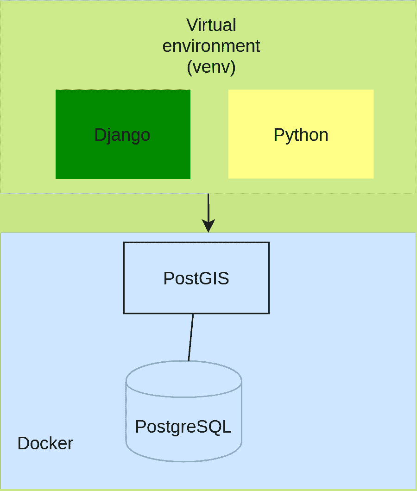
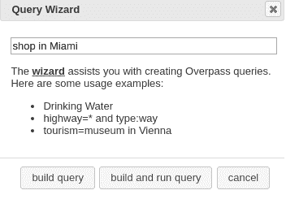
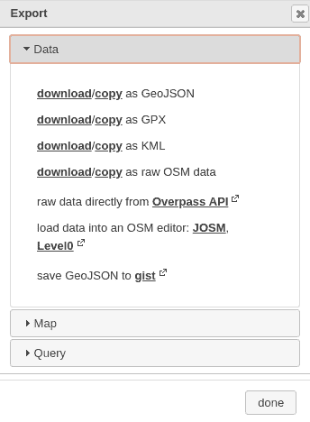
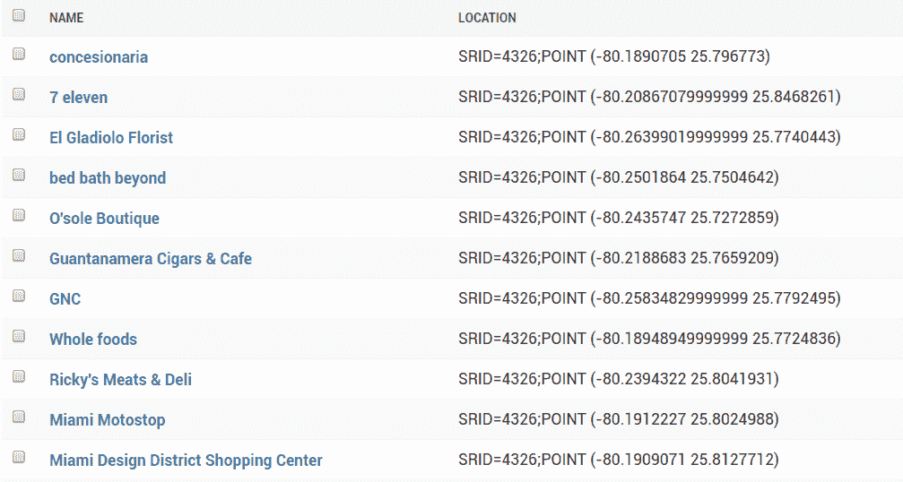

# 用 Django 和 GeoDjango 制作一个基于位置的 Web 应用程序

> 原文:[https://real python . com/location-based-app-with-geodjango-tutorial/](https://realpython.com/location-based-app-with-geodjango-tutorial/)

*立即观看**本教程有真实 Python 团队创建的相关视频课程。和书面教程一起看，加深理解: [**用 Django 和 GeoDjango**](/courses/make-location-based-web-app-django-and-geodjango/) 制作基于位置的 Web App*

 *在本教程中，您将学习如何使用 Django 和 GeoDjango 从头开始构建基于位置的 web 应用程序。您将构建一个简单的附近商店应用程序，列出离用户位置最近的商店。

**本教程结束时，你将能够:**

*   使用 Django 从头构建一个简单的 web 应用程序

*   使用 GeoDjango 子框架在 Django 应用程序中实现地理定位特性

*   使用空间数据库(PostgreSQL 和 PostGIS)从空间要素中获益，并轻松实现位置感知 web 应用程序

**免费奖励:** ，您可以用它们来加深您的 Python web 开发技能。

**示例应用程序源代码:**您将在本教程中构建的应用程序的完整源代码可从 GitHub 上的 [`realpython/materials`资源库获得。](https://github.com/realpython/materials/tree/master/nearbyshops)

## 您将使用的工具

您将使用以下工具开发附近商店的 web 应用程序:

*   Python 编程语言
*   Django 网络框架
*   用于保存数据的 PostgreSQL 数据库
*   用于支持 PostgreSQL 数据库中的空间要素的 PostGIS 扩展
*   `pip`用于安装依赖项
*   用于管理虚拟环境的`venv`模块
*   安装 PostgreSQL 和 PostGIS 的 Docker

[](https://files.realpython.com/media/Untitled_Diagram_8.822b7357a376.png)

在进入实际步骤之前，让我们首先从介绍您将使用的框架开始。

Django 是构建 web 应用程序最流行的 Python 框架。通过提供大量内置 API 和子框架(如 GeoDjango ),开发人员可以轻松快速地构建原型并满足项目期限。

[GeoDjango](https://docs.djangoproject.com/en/2.1/ref/contrib/gis/) 是一个内置的应用程序，作为`contrib`模块包含在 Django 中。它实际上是一个完整的框架本身，也可以与 Django 分开使用。它为构建 GIS web 应用程序提供了一个实用工具工具箱。

[GIS](https://en.wikipedia.org/wiki/Geographic_information_system) 代表地理信息系统。这是一个信息系统([一个有组织的系统，用于收集、组织、存储和交流信息](https://en.wikipedia.org/wiki/Information_system))，旨在处理和操作具有地理或空间特征的数据。

GeoDjango 还提供了与流行的空间库的 Python 绑定，如 [GEOS](https://trac.osgeo.org/geos/) 、 [GDAL](https://www.gdal.org/) 和 [GeoIP](https://github.com/maxmind/geoip-api-c) ，它们可以在任何 Python 应用程序中单独使用，也可以在 shell 中交互使用。

GeoDjango 旨在提供一个世界级的地理网络框架。多年来，它一直在重构，目标是使地理空间数据更容易使用，换句话说，就是识别地球上自然或人工要素的地理位置并存储为坐标和拓扑的数据。

GeoDjango 与 Django ORM 集成得非常好，并提供了一组由[开放地理空间联盟(OGS)](http://www.opengeospatial.org/) 定义的几何字段，可用于映射到地理空间数据库中不同类型的几何:

*   **[`GeometryField`](https://docs.djangoproject.com/en/2.1/ref/contrib/gis/model-api/#geometryfield)** 是 GeoDjango 中所有几何字段的基类。
*   **[`PointField`](https://docs.djangoproject.com/en/2.1/ref/contrib/gis/model-api/#pointfield)** 用于存放 GEOS [点](https://docs.djangoproject.com/en/2.1/ref/contrib/gis/geos/#django.contrib.gis.geos.Point)对象。
*   **[`PolygonField`](https://docs.djangoproject.com/en/2.1/ref/contrib/gis/model-api/#polygonfield)** 用于存储 GEOS [多边形](https://docs.djangoproject.com/en/2.1/ref/contrib/gis/geos/#polygon)对象等等。

GeoDjango 是一个非常强大的框架，用于使用 Django ORM 存储和处理地理数据。它提供了一个易于使用的 API 来查找地图上两点之间的距离、多边形的面积、多边形内的点等等。

为了能够使用 GeoDjango，您需要具备两样东西:空间数据库和地理空间库。[空间数据库](https://en.wikipedia.org/wiki/Spatial_database)是为存储和查询代表几何空间中定义的对象的数据而优化的数据库。

要完全使用 GeoDjango 的所有功能，您需要安装以下开源地理空间库:

*   **GEOS** 代表几何引擎开源。它是 JTS (Java 拓扑套件)的一个 C++端口，实现了 SQL 规范的 [OCG 简单特性。](http://www.opengeospatial.org/standards/sfs)

*   **GDAL** 代表地理空间数据抽象库。这是一个开源库，用于处理栅格和矢量[地理空间数据格式](https://en.wikipedia.org/wiki/GIS_file_formats)。

*   [**PROJ.4**](https://proj4.org/) 为制图投影库。这是一个开源的 GIS 库，可轻松使用空间参考系统和投影。

*   GeoIP 是一个帮助用户根据 IP 地址查找地理信息的库。

本教程使用 Ubuntu 18.04 系统来安装先决条件，使用 Unix bash 来运行命令，但是如果您使用任何其他系统，尤其是像 macOS 这样的基于 Unix 的系统，这应该不成问题。

对于大多数安装说明，您将使用 [aptitude](https://help.ubuntu.com/lts/serverguide/aptitude.html.en) 包管理器，所以您应该简单地用您系统的等价包管理器来替换它。

[*Remove ads*](/account/join/)

## *先决条件*

 *在本节中，您将在引导项目之前安装必要的先决条件，例如 Python 3 和 geo jango[依赖项](https://realpython.com/courses/managing-python-dependencies/) (GEOS、GDAL 和 PROJ.4)。您还将使用 Docker 为您的项目建立一个 PostgreSQL 和 PostGIS 数据库。

### 安装 Python 3

很有可能您的系统上已经安装了 Python 3。如果你没有，你可以直接去[官方网站](https://www.python.org/downloads/)为你的操作系统下载二进制文件。

根据您的系统，您也可以安装 Python 3，或者使用官方的包管理器将它升级到最新版本。

如果你在安装 Python 3 时遇到问题或者想了解更多信息，你可以查看 [Python 3 安装&安装指南](https://realpython.com/installing-python)，它提供了在你的系统上安装 Python 3 的不同方法。

最后，您可以通过运行以下命令来检查是否安装了 Python 3:

```py
$ python3 --version
Python 3.6.5
```

### 安装 GeoDjango 依赖项(GEOS、GDAL 和项目 4)

GeoDjango 需要一个空间数据库和一组开源地理空间库:

*   **GEOS** 是开源的几何引擎，是 JTS (Java Topology Suite)的 C++端口。GeoDjango 需要它来执行几何运算。

*   **PROJ.4** 是一个开源 GIS 库，用于轻松处理空间参考系统和投影。您需要它，因为您将使用 PostGIS 作为空间数据库。

*   GDAL 是一个开源的地理空间数据抽象库，用于处理栅格和矢量数据格式。GeoDjango 使用的许多实用程序都需要它。

关于[空间数据库和所需库](https://docs.djangoproject.com/en/2.1/ref/contrib/gis/install/geolibs/)的更多信息，可以参考文档。

GDAL 2.2 包含在 Ubuntu 18.04 中，所以你可以简单地运行以下命令来安装它:

```py
$ sudo aptitude install gdal-bin libgdal-dev
$ sudo aptitude install python3-gdal
```

**注意:** `python3-gdal`是 Python 3 对 GDAL 的绑定。

接下来，您可以使用以下命令安装其他库:

```py
$ sudo aptitude install binutils libproj-dev
```

**注意:**因为你使用的是 GEOS 的二进制包，你还需要[安装 binutils](https://docs.djangoproject.com/en/2.1/ref/contrib/gis/install/#binutils) 。

有关如何在 [macOS](https://docs.djangoproject.com/en/2.1/ref/contrib/gis/install/#macos) 和 [Windows](https://docs.djangoproject.com/en/2.1/ref/contrib/gis/install/#windows) 上安装这些依赖项的详细说明，请参考文档。

关于 PROJ.4 的更多信息，可以参考其官方[文档](https://proj4.org/install.html)。

[*Remove ads*](/account/join/)

### *用 PostgreSQL 和 PostGIS 建立空间数据库*

 *您将使用 PostgreSQL，这是 Django 最常用的数据库。这不是一个空间数据库，但由于 PostGIS，您可以使用强大的地理空间功能来增强您的数据库。

[PostGIS](http://postgis.net/) 是一个空间数据库扩展，需要安装在一个 [PostgreSQL](https://www.postgresql.org/) 数据库上，这赋予它存储和处理空间数据以及执行空间操作的能力。它增加了对地理对象的支持，允许在 SQL 中运行位置查询。

您可以在您的系统上安装 PostgreSQL，创建一个数据库，然后添加 postgis 扩展，或者更好的方法是使用 Docker 使用 [kartoza postgis](https://hub.docker.com/r/kartoza/postgis/) 映像快速创建一个数据库，该映像提供一个已经安装了 PostgreSQL 和 PostGIS 的容器:

```py
$ docker run --name=postgis -d -e POSTGRES_USER=user001 -e POSTGRES_PASS=123456789 -e POSTGRES_DBNAME=gis -p 5432:5432 kartoza/postgis:9.6-2.4
```

运行该命令后，您将拥有一个 PostgreSQL 服务器，它通过一个名为`gis`的数据库监听`5432`端口。数据库使用`user001`用户名和`123456789`密码。

**注意:**您需要在系统上安装 Docker。有关说明，您可以参考官方的[文件](https://docs.docker.com/install/)。

## 设置您的项目

现在，您已经设置好了空间数据库，可以开始设置 Django 项目了。在本节中，您将使用`venv`为您的项目创建一个隔离的虚拟环境，并安装所有需要的包，比如 Django。

### 创建虚拟环境

虚拟环境允许您为当前项目的依赖项创建一个隔离的环境。这将允许您避免具有不同版本的相同包之间的冲突。

在 Python 3 中，您可以使用`virtualenv`或`venv`模块创建虚拟环境。

有关 Python 虚拟环境的更多信息，请查看 [Python 虚拟环境:初级读本](https://realpython.com/python-virtual-environments-a-primer/)。

现在，在您的终端上运行以下命令，创建一个基于 Python 3 的虚拟环境:

```py
$ python3 -m venv env
(env) $
```

接下来，您需要激活以下命令:

```py
$ source env/bin/activate
```

就是这样。现在您已经激活了您的虚拟环境，您可以为您的项目安装软件包了。

### 安装 Django

创建并激活虚拟环境后的第一步是安装 Django。Django 包可以从 [Python 包索引](https://pypi.org/) (PyPI)中获得，所以您可以简单地使用`pip`在您的终端中运行以下命令来安装它:

```py
$ pip install django
```

[*Remove ads*](/account/join/)

### *创建 Django 项目*

 *您将创建的项目是一个 web 应用程序，它列出了按距离排序的商店，因此您的用户将能够发现离他们的位置很近的商店。

该 web 应用程序利用 GeoDjango 轻松实现位置要求，例如计算商店与用户位置的距离，并根据距离对商店进行排序。

使用 GeoDjango，您可以获取并显示存储在 PostgreSQL 数据库中的最近的商店，该数据库配置了 PostGIS 扩展模块以支持空间操作。

现在，您已经准备好使用`django-admin.py`脚本创建 Django 项目了。只需运行以下命令:

```py
$ django-admin.py startproject nearbyshops
```

这将创建一个名为`nearbyshops`的项目。

### 配置 PostgreSQL 数据库

现在您已经创建了一个项目，让我们继续配置与 PostgreSQL 和 PostGIS 空间数据库的连接。打开`settings.py`文件，并使用您之前配置的 PostGIS 数据库的凭证添加`django.contrib.gis.db.backends.postgis`作为引擎:

```py
DATABASES = {
    'default': {
        'ENGINE': 'django.contrib.gis.db.backends.postgis',
        'NAME': 'gis',
        'USER': 'user001',
        'PASSWORD': '123456789',
        'HOST': 'localhost',
        'PORT': '5432'
    }
}
```

**注意:**如果在运行 Docker 容器时没有指定相同的凭证，您需要相应地更改数据库凭证。

如果您试图在此时运行 Django 服务器，您将得到与`psycopg2`相关的`ImportError: No module named 'psycopg2'`错误，这是 Python 最流行的 PostgreSQL 适配器。要解决这个错误，您只需在您的虚拟环境中安装`psycopg2-binary`,如下所示:

```py
$ pip install psycopg2-binary
```

### 添加 GeoDjango

GeoDjango 是一个框架，它使构建 GIS 和位置感知 web 应用程序变得尽可能容易。只需在已安装应用列表中包含`gis` `contrib`模块即可添加。

打开`settings.py`文件，找到`INSTALLED_APPS`数组。然后添加`'django.contrib.gis'`模块:

```py
INSTALLED_APPS = [
    # [...]
    'django.contrib.gis'
]
```

## 创建 Django 应用程序

Django 项目由应用程序组成。默认情况下，它包含几个核心或内置的应用程序，如`django.contrib.admin`，但您通常会添加至少一个包含您的自定义项目代码的应用程序。

**注意:**对于简单的项目，你可能只需要一个 app，但是一旦你的项目变大了，有了不同的需求，你可以在多个独立的 app 中组织你的代码。

既然您已经创建了 Django 项目，配置了与空间数据库的连接，并将 GeoDjango 添加到项目中，那么您需要创建一个 Django 应用程序，您可以将它称为`shops`。

`shops`应用程序将包含创建和显示离用户位置最近的商店的代码。在接下来的步骤中，您将执行以下任务:

*   创建应用程序
*   添加一个`Shop`模型
*   添加用于加载初始演示数据的数据迁移(商店)
*   添加查看功能
*   添加模板

首先运行以下命令来创建应用程序:

```py
$ python manage.py startapp shops
```

接下来，您需要将它添加到`settings.py`文件中的已安装应用程序列表中，这将使 Django 将其识别为您项目的一部分:

```py
INSTALLED_APPS = [
    # [...]
    'shops'
]
```

[*Remove ads*](/account/join/)

### *创建 Django 模型*

 *在创建了包含项目实际代码的`shops`应用程序之后，您需要在您的应用程序中添加模型。Django 使用 ORM(对象关系映射器)，它是 Django 和数据库之间的一个抽象层，将 Python 对象(或模型)转换成数据库表。

在这种情况下，您需要一个在数据库中代表商店的模型。您将创建一个具有以下字段的`Shop`模型:

*   **`name` :** 店铺名称
*   **`location` :** 店铺所在位置的经纬度坐标
*   **`address` :** 店铺的地址
*   **`city` :** 店铺所在城市

打开`shops/models.py`文件并添加以下代码:

```py
from django.contrib.gis.db import models

class Shop(models.Model):
    name = models.CharField(max_length=100)
    location = models.PointField()
    address = models.CharField(max_length=100)
    city = models.CharField(max_length=50)
```

对于位置，您将使用 [`PointField`](https://docs.djangoproject.com/en/2.1/ref/contrib/gis/model-api/#pointfield) ，这是一个特定于 GeoDjango 的几何字段，用于存储表示一对经度和纬度坐标的 [GEOS 点](https://docs.djangoproject.com/en/2.1/ref/contrib/gis/geos/#django.contrib.gis.geos.Point)对象。

其他字段是类型为`CharField`的普通 Django 字段，可用于存储大小不同的字符串。

**注意:**请注意，`models`模块是从`django.contrib.gis.db`导入的，不是通常的`django.db`模块。

### 创建数据库表

有了 Django，由于它的 ORM，你不需要使用 SQL 来创建数据库表。让我们使用`makemigrations`和`migrate`命令创建数据库表。回到您的终端，运行以下命令:

```py
$ python manage.py makemigrations
$ python manage.py migrate
```

有关这些命令的更多信息，请查看 [Django 迁移-初级教程](https://realpython.com/django-migrations-a-primer/)。

### 添加超级用户

您需要创建一个超级用户，这样您就可以访问管理界面。这可以使用以下命令来完成:

```py
$ python manage.py createsuperuser
```

该提示将要求您输入用于访问用户帐户的用户名、电子邮件和密码。输入它们并点击 `Enter` 。

### 在管理界面注册模型

Django 的管理应用程序提供了一个完整的 CRUD 接口来管理数据。

GeoDjango 扩展了管理应用程序，增加了对几何字段的支持。

在从 Django admin 访问您的模型之前，您需要注册它们。

打开`shops/admin.py`文件并添加以下代码:

```py
from django.contrib.gis.admin import OSMGeoAdmin
from .models import Shop

@admin.register(Shop)
class ShopAdmin(OSMGeoAdmin):
    list_display = ('name', 'location')
```

您正在使用 [`@admin.register`](https://docs.djangoproject.com/en/2.1/ref/contrib/admin/#the-register-decorator) 装饰器在管理应用程序中注册`Shop`模型。修饰类是管理界面中的`Shop`模型的表示，允许您定制不同的方面，比如您想要显示的`Shop`字段。(在您的情况下，是名称和位置。)想要了解更多关于 decorator 的信息，你可以阅读《Python Decorators 初级读本。

由于`Shop`模型包含一个 GeoDjango 字段，您需要使用从`django.contrib.gis.admin`包中获得的特殊的`OSMGeoAdmin`类。

你可以使用`GeoModelAdmin`或者`OSMGeoAdmin`，这是`GeoModelAdmin`的一个子类，它使用管理中的[开放街道地图](https://www.openstreetmap.org/)层来显示几何字段。这提供了比使用`GeoModelAdmin`类更多的信息，如街道和大道细节，后者使用[矢量地图级别 0](http://earth-info.nga.mil/publications/vmap0.html) 。

现在可以运行 Django 服务器了:

```py
$ python manage.py runserver
```

您的应用程序将从`localhost:8000`开始运行，您可以从`localhost:8000/admin`访问管理界面。

[](https://files.realpython.com/media/Screenshot_from_2018-11-28_21-22-03.34e252c9266a.png)

这是来自*添加店铺*界面的截图:

[](https://files.realpython.com/media/Screenshot_from_2018-11-28_21-12-25.2e7a3ff3f939.png)

您可以看到,`Location`几何字段显示为交互式地图。可以放大缩小地图，可以在地图右上角选择不同的选择器来选择一个位置，这个位置用绿色的圆圈标记。

[*Remove ads*](/account/join/)

### *添加初始数据*

 *您的应用程序需要一些初始演示数据，但是您可以使用数据迁移来代替手动添加数据。

数据迁移可用于多种情况，包括在数据库中添加初始数据。有关更多信息，请查看[数据迁移](https://realpython.com/data-migrations/)。

在创建迁移之前，让我们首先使用 OpenStreetMap 的一个基于 web 的数据过滤工具[transition turbo](https://overpass-turbo.eu/)从 [OpenStreetMap](http://www.openstreetmap.org/) 中获取一些真实世界的数据。您可以运行[立交桥 API](http://wiki.openstreetmap.org/wiki/Overpass_API) 查询，并在地图上交互分析结果数据。

您还可以使用集成的[向导](http://wiki.openstreetmap.org/wiki/Overpass_turbo/Wizard)，这使得创建查询变得容易。

在您的情况下，您希望获得一个城市中的所有商店。只需点击*向导的*按钮。将弹出一个小窗口。在文本字段中，编写类似“在迈阿密购物”的查询，然后单击*构建并运行查询*。

[](https://files.realpython.com/media/Screenshot_from_2018-11-09_22-55-41.7a5b7e60974c.png)

接下来，点击*导出*按钮，并点击*下载/复制为原始 OSM 数据*，下载包含原始 OSM 数据的 JSON 文件。将文件另存为项目根文件夹中的`data.json`:

[](https://files.realpython.com/media/Screenshot_from_2018-10-19_02-25-43.ac6770d6a956.png)

这是文件中示例数据的屏幕截图:

[](https://files.realpython.com/media/Screenshot_from_2018-10-19_02-34-34.dce4b6e8d898.png)

您需要获取`elements`数组中的对象。特别是每个商店的`lat`、`lon`和`tags` ( `name`)字段。

您可以从这个 [wiki](http://wiki.openstreetmap.org/wiki/Overpass_API/Overpass_QL) 中找到更多关于如何编写超越查询的细节。

现在，让我们创建一个空迁移，使用以下命令将`data.json`文件的内容导入到数据库中:

```py
$ python manage.py makemigrations shops --empty
```

打开迁移文件。它有以下代码:

```py
from django.db import migrations

class Migration(migrations.Migration):
    dependencies = [
        ('shops', '0001_initial'),
    ]
    operations = [
    ]
```

接下来您需要创建由`RunPython()`执行的`load_data()`。首先，在导入区域中，添加以下导入内容:

```py
from django.db import migrations
import json
from django.contrib.gis.geos import fromstr
from pathlib import Path
```

您正在从 [`pathlib`](https://docs.python.org/3/library/pathlib.html) 包中导入`Path`类以访问底层系统函数，从 [`json`](https://docs.python.org/3.7/library/json.html) 包导入 JSON(Django 内置迁移 API)以及 [`fromstr()`](https://docs.djangoproject.com/en/2.1/ref/contrib/gis/geos/#django.contrib.gis.geos.fromstr) (属于 [`geos`](https://docs.djangoproject.com/en/2.1/ref/contrib/gis/geos/) 包的一部分)。

接下来，添加`load_data()`:

```py
DATA_FILENAME = 'data.json'
def load_data(apps, schema_editor):
    Shop = apps.get_model('shops', 'Shop')
    jsonfile = Path(__file__).parents[2] / DATA_FILENAME

    with open(str(jsonfile)) as datafile:
        objects = json.load(datafile)
        for obj in objects['elements']:
            try:
                objType = obj['type']
                if objType == 'node':
                    tags = obj['tags']
                    name = tags.get('name','no-name')
                    longitude = obj.get('lon', 0)
                    latitude = obj.get('lat', 0)
                    location = fromstr(f'POINT({longitude}  {latitude})', srid=4326)
                    Shop(name=name, location = location).save()
            except KeyError:
                pass
```

让我们解释一下您刚刚添加的代码。首先使用 [`pathlib`库](https://realpython.com/python-pathlib/)的`Path`类构建绝对路径，并打开`data.json`文件。接下来，将 JSON 文件解析成一个 Python 对象。

您遍历包含商店位置和标签的 elements 对象。在循环中，提取名称和经纬度坐标。然后使用`formstr()`返回一个有效的 [`GEOSGeometry`](https://docs.djangoproject.com/en/2.1/ref/contrib/gis/geos/#django.contrib.gis.geos.GEOSGeometry) 对象，该对象对应于字符串中的空间数据，该数据可以分配给`Shop`模型的位置字段。最后，您创建并保存与提取的数据相对应的`Shop`模型的实例。

您正在使用 [`with`语句](https://dbader.org/blog/python-context-managers-and-with-statement)，因此您不必显式关闭文件，以及一个用于格式化`fromstr()`参数的 [f 字符串](https://realpython.com/python-f-strings/)。

`fromstr()`将一个`srid`作为第二个参数。 [`srid`](https://en.wikipedia.org/wiki/Spatial_reference_system) 代表空间参考系统标识符。识别空间参考系统(用于解释空间数据库中的数据的投影系统)具有独特的价值。

`4326` `srid`是 PostGIS 最常用的系统。它也被称为 [WGS84](https://en.wikipedia.org/wiki/World_Geodetic_System#WGS84) ，这里的单位以经度和纬度的度数来指定。你可以参考 spatialreference.org[的 Django 驱动的空间参考系统数据库。](http://spatialreference.org/)

接下来，添加迁移类，以便在运行`migrate`命令时执行上述函数:

```py
class Migration(migrations.Migration):

    dependencies = [
        ('shops', '0005_auto_20181018_2050'),
    ]

    operations = [
        migrations.RunPython(load_data)
    ]
```

就是这样。现在，您可以返回到您的终端并运行以下命令:

```py
$ python manage.py migrate
```

来自`data.json`文件的数据将被加载到您的数据库中。运行 Django 服务器，进入管理界面。您应该会在表格中看到您的数据。在我的例子中，这是表的一部分的截图:

[](https://files.realpython.com/media/Screenshot_from_2018-11-28_21-09-59.c94fbe2ef0dd.png)[*Remove ads*](/account/join/)

### *显示附近的商店*

 *在本教程的这一部分，您已经创建了:

*   `shops`应用程序，它封装了在项目中创建和获得附近商店的代码

*   `Shop`模型和数据库中相应的表

*   用于访问管理界面的初始管理员用户

*   在数据库中加载真实世界商店的初始演示数据，您可以在不手动输入大量虚假数据的情况下进行操作

您还在管理应用程序中注册了`Shop`模型，因此您可以从管理界面创建、更新、删除和列出商店。

接下来，您将使用通用的 [`ListView`](https://docs.djangoproject.com/en/2.1/ref/class-based-views/generic-display/#django.views.generic.list.ListView) 类添加一个视图函数，您可以用它来显示附近商店的列表。您还将创建一个 HTML 模板，视图函数将使用该模板来呈现商店，并添加将用于显示商店的 URL。

让我们首先添加一个模板和一个视图函数，它将用于显示用户所在位置附近的商店。

打开`shops/views.py`文件，从导入必要的 API 开始:

```py
from django.views import generic
from django.contrib.gis.geos import fromstr
from django.contrib.gis.db.models.functions import Distance
from .models import Shop
```

接下来添加一个`user_location`变量，您可以在其中硬编码一个用户位置:

```py
longitude = -80.191788
latitude = 25.761681

user_location = Point(longitude, latitude, srid=4326)
```

在这一部分中，您将简单地对用户的位置(美国迈阿密的坐标)进行硬编码，但理想情况下，这应该由用户指定，或者在用户许可的情况下，使用 [JavaScript](https://realpython.com/python-vs-javascript/) 和 [HTML5 地理定位 API](https://developer.mozilla.org/en-US/docs/Web/API/Geolocation_API) 从用户的浏览器中自动检索。您可以向下滚动到该页面的中间，查看实现地理位置 API 的实例。

最后，添加以下视图类:

```py
class Home(generic.ListView):
    model = Shop
    context_object_name = 'shops'
    queryset = Shop.objects.annotate(distance=Distance('location',
    user_location)
    ).order_by('distance')[0:6]
    template_name = 'shops/index.html'
```

您正在使用通用的基于类的 [`ListView`](https://docs.djangoproject.com/en/2.1/ref/class-based-views/generic-display/#django.views.generic.list.ListView) 来创建一个视图。

基于类的视图是将视图实现为 Python 类而不是函数的另一种方法。它们用于处理 web 开发中的常见用例，而无需重新发明轮子。在这个例子中，您已经子类化了`ListView`通用视图，并覆盖了`model`、`context_object_name`、`queryset`和`template_name`属性，从而创建了一个无需任何额外代码就能处理 HTTP 请求的列表视图。

现在让我们来关注一下`queryset`属性。要获得附近的商店，您只需使用`.annotate()`在返回的 queryset 上用距离标注标注每个对象，该距离标注是使用 [`Distance()`](https://docs.djangoproject.com/en/2.1/ref/contrib/gis/functions/#distance) 计算的，可从 GeoDjango 获得，在每个商店的位置和用户的位置之间。您还可以根据距离标注对返回的查询集进行排序，并只选择最近的六家商店。

你可以从官方[文档](https://docs.djangoproject.com/en/2.1/topics/class-based-views/)中了解更多关于基于类的视图。

接下来让我们添加包含以下内容的`shops/index.html`模板:

```py
<!DOCTYPE html>
<html lang="en">
    <head>
        <meta charset="utf-8">
        <title>Nearby Shops</title>
    </head>
<body>
    <h1>Nearby Shops</h1>
    
    <ul>
    
        <li>
        {{ shop.name }}: {{shop.distance}}
        </li>
    
    </ul>
    
</body>
</html>
```

最近的商店可以从您在基于类的视图中指定为`context_object_name`的`shops`上下文对象中获得。您遍历`shops`对象，显示每个商店的名称和离用户位置的距离。

最后，让我们给我们的`urls.py`文件添加一个 URL:

```py
from django.urls import path
from shops import views

urlpatterns = [
    # [...]
    path('', views.ShopList.as_view())
]
```

您使用`.as_view()`返回一个可调用的视图，该视图接受一个`request`并返回一个`response`，它可以作为第二个参数传递给将路径映射到视图的`path()`。

现在您可以运行您的 Django 服务器了。主页将显示一个简单的非风格化列表，列出距离硬编码用户位置最近的商店。这是一个示例截图:

[](https://files.realpython.com/media/Screenshot_from_2018-11-28_21-13-19.35e78f378050.png)

在截图中，列表中的每一项都显示了商店的名称(冒号前)和距离用户位置的米数(冒号后)。字母 *m* 指的是米。

**注意:**你在截图中用来显示结果的 view 函数只是为了测试`Distance()`标注的 queryset。

本教程到此结束。现在，您已经掌握了向应用程序添加简单地理定位内容或创建 GIS 应用程序的基本技能。您可以阅读 [GeoDjango 文档](https://docs.djangoproject.com/en/2.1/ref/contrib/gis/)以获得可用 API 的完整资源以及您可以使用它们做什么。

您还学习了使用 [Docker](https://www.docker.com/) 快速拉取和启动 PostgreSQL 和 PostGIS 服务器。Docker 的用途可不止这些。这是一个容器化工具，用于构建隔离的、可复制的应用环境。如果你想学习如何容器化你的 Django 项目，你可以阅读[用 Docker Compose 和 Machine](https://realpython.com/django-development-with-docker-compose-and-machine/) 开发 Django。

[*Remove ads*](/account/join/)

## *结论*

 *祝贺您使用 GeoDjango 创建了基于位置的 web 应用程序，该应用程序旨在成为实现 GIS 应用程序的世界级地理框架。如今，位置感知应用程序(知道你的位置，并通过提供基于你的位置的结果来帮助你发现附近的物体和服务的应用程序)风靡一时。使用您在本教程中获得的知识，您将能够在用 Django 开发的应用程序中融入这一现代特性。

除了对 GeoDjango 的依赖之外，唯一的要求是使用空间数据库(能够存储和操作空间数据的数据库)。对于与 Django 一起使用的最流行的数据库管理系统之一 PostgreSQL，您可以简单地在您的数据库中安装 [PostGIS 扩展](https://postgis.net/)，将它转换成一个空间数据库。其他流行的数据库如[甲骨文](https://docs.oracle.com/cd/B28359_01/appdev.111/b28400/sdo_intro.htm)和 [MySQL](https://dev.mysql.com/doc/refman/8.0/en/spatial-types.html) 都内置了对空间数据的支持。

**在本教程中，您已经使用了:**

*   Django 从头开始构建 web 应用程序
*   在 Django 应用程序中实现地理定位特性的 GeoDjango 子框架
*   空间数据库 PostgreSQL 和 PostGIS，可从空间要素中获益并实施位置感知型 web 应用程序

你有没有一个 Django 应用程序可以受益于更多的位置感知？试用 GeoDjango，并在下面的评论中分享你的体验。

**示例应用程序源代码:**您在本教程中构建的应用程序的完整源代码可以在 GitHub 的 [`realpython/materials`资源库中找到。](https://github.com/realpython/materials/tree/master/nearbyshops)

**免费奖励:** ，您可以用它们来加深您的 Python web 开发技能。

*立即观看**本教程有真实 Python 团队创建的相关视频课程。和书面教程一起看，加深理解: [**用 Django 和 GeoDjango**](/courses/make-location-based-web-app-django-and-geodjango/) 制作基于位置的 Web App*********