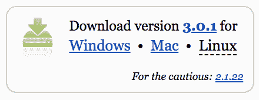

# Thonny:初学者友好的 Python 编辑器

> 原文：<https://realpython.com/python-thonny/>

*立即观看**本教程有真实 Python 团队创建的相关视频课程。和文字教程一起看，加深理解: [**Thonny:初学友好的 Python 编辑器**](/courses/python-thonny/)*

 *你是一个 Python 初学者，正在寻找一个可以支持你学习的工具吗？这篇文章送给你！每个程序员都需要一个写代码的地方。本文将讨论一个名为 Thonny 的令人敬畏的工具，它将使您能够在一个初学者友好的环境中开始使用 Python。

在这篇文章中，你将了解到:

*   如何在电脑上安装 Thonny
*   如何浏览 Thonny 的用户界面以使用其内置功能
*   如何使用 Thonny 编写和运行您的代码
*   如何使用 Thonny 调试您的代码

到本文结束时，您将对 Thonny 中的开发工作流感到舒适，并准备好将其用于您的 Python 学习。

那么什么是 Thonny 呢？很棒的问题！

Thonny 是一个免费的 Python [集成开发环境(IDE)](https://realpython.com/python-ides-code-editors-guide/) ，它是专门为初学 Python 的人设计的。具体来说，它有一个内置的调试器，可以在您遇到讨厌的错误时提供帮助，并且它提供了通过表达式求值的能力，以及其他非常棒的功能。

**免费样章:** ，获得实用的 Python 编程技巧。

## 安装 Thonny

本文假设您的计算机上安装了 Python 3。如果没有，请查看 [Python 3 安装&设置](https://realpython.com/installing-python/)。

[*Remove ads*](/account/join/)

### *网页下载*

 *可以通过访问 [Thonny 网站](https://thonny.org/)经由网络浏览器访问网络下载。进入页面后，您会在右上角看到一个浅灰色框，如下所示:

[](https://files.realpython.com/media/Screenshot_2018-10-20_10.52.50.5b35603b597b.png)

找到灰框后，单击适用于您的操作系统的链接。本教程假设您已经下载了版本 3.0.1。

### 命令行下载

您也可以通过系统的命令行安装 Thonny。在 Windows 上，你可以通过启动一个名为**命令提示符**的程序来做到这一点，而在 macOS 和 Linux 上，你可以启动一个名为**终端**的程序。完成后，输入以下命令:

```py
$ pip install thonny
```

## 用户界面

让我们确保你明白 Thonny 能提供什么。将 Thonny 想象成一个工作室，在这里您将创建令人惊叹的 Python 项目。你的工作室里有一个工具箱，里面有许多工具，可以让你成为摇滚明星皮托尼斯塔。在本节中，您将了解 UI 的每个特性，这些特性将帮助您使用 Thonny 工具箱中的每个工具。

### 代码编辑器和 Shell

现在你已经安装了 Thonny，打开应用程序。您应该会看到一个窗口，顶部有几个图标，还有两个白色区域:

[](https://files.realpython.com/media/Screenshot_2018-10-20_11.03.57.d46d970db1e6.png)

请注意窗口的两个主要部分。顶部是您的代码编辑器，在这里您将编写所有的代码。下半部分是您的 Shell，在这里您可以看到代码的输出。

### 图标

在顶部你会看到几个图标。让我们来探究一下它们各自的功能。您将看到下面的图标图像，每个图标上方都有一个字母。我们将使用这些字母来谈论每个图标:

[](https://files.realpython.com/media/Screenshot_2018-10-20_11.09.16.7c059cfba13c.png)

从左到右，下面是图像中每个图标的描述。

**答:**纸张图标允许您创建新文件。通常在 Python 中，你想把你的程序分成不同的文件。在本教程的后面部分，您将使用该按钮在 Thonny 中创建您的第一个程序！

**B:** 打开文件夹图标允许你打开一个已经存在于你电脑上的文件。如果您回到以前工作过的程序，这可能会很有用。

**C:** 软盘图标允许你保存你的代码。尽早并经常按这个。稍后您将使用它来保存您的第一个 Thonny Python 程序。

**D:** 播放图标允许你运行你的代码。记住你写的代码是要被执行的。运行您的代码意味着您在告诉 Python，“按照我告诉您的去做！”(换句话说，“通读我的代码，执行我写的东西。”)

bug 图标允许你调试你的代码。当你写代码时，不可避免地会遇到错误。bug 是问题的另一种说法。错误可能以多种形式出现，有时出现在你使用不适当的语法时，有时出现在你的逻辑不正确时。

Thonny 的 bug 按钮通常用于发现和调查 bug。在教程的后面部分，您将会用到它。顺便说一句，如果你想知道为什么它们被称为虫子，还有一个有趣的关于它是如何产生的故事！

箭头图标允许你一步一步地运行你的程序。当你调试时，或者换句话说，当你试图在你的代码中找到那些讨厌的 bug 时，这是非常有用的。这些图标在您按下 bug 图标后使用。您会注意到，当您点击每个箭头时，一个黄色高亮条将指示 Python 当前正在评估的行或部分:

*   箭头告诉 Python 前进一大步，意思是跳到下一行或下一个代码块。
*   箭头告诉 Python 迈出一小步，意思是深入到表达式的每个部分。
*   箭头告诉 Python 退出调试器。

**I:** 恢复图标允许你从调试模式返回到播放模式。这在您不想一步一步地遍历代码，而是希望程序结束运行的情况下非常有用。

J:stop 图标允许你停止运行你的代码。比方说，如果您的代码运行了一个打开新窗口的程序，而您想要停止该程序，这可能特别有用。在本教程的后面部分，您将使用停止图标。

#### 我们试试吧！

准备好用 Thonny 编写您的第一个官方 Python 程序:

1.  在代码编辑器中输入以下代码:

    ```py
    print("Hello World")` 
    ```

2.  单击播放按钮运行您的程序。

3.  在 Shell 窗口中查看输出。

4.  再次单击“播放”按钮，它会再次显示“你好”。

恭喜你！您现在已经完成了您在 Thonny 的第一个程序！你应该看到`Hello world!`印在外壳里面，也就是所谓的控制台。这是因为您的程序告诉 Python 打印这个短语，控制台是您看到这个执行的输出的地方。

[*Remove ads*](/account/join/)

### *其他用户界面特性*

 *要查看 Thonny 提供的更多其他功能，请导航到菜单栏并选择*视图*下拉菜单。您应该看到 *Shell* 旁边有一个复选标记，这就是您在 Thonny 的应用程序窗口中看到 Shell 部分的原因:

[](https://files.realpython.com/media/Screenshot_2018-10-20_11.15.24.2f90db2108e7.png)

让我们探索一些其他的产品，特别是那些对 Pythonista 初学者有用的产品:

1.  **帮助:**如果你想了解更多关于与 Thonny 合作的信息，你可以选择*帮助*视图。目前这一节提供了更多关于以下主题的阅读:*逐步运行程序，*如何安装*第三方包*，或者*使用科学 Python 包*。

2.  **变量:**这个特性可能非常有价值。Python 中的变量是您在代码中定义的值。变量可以是[数字](https://realpython.com/python-numbers/)、[字符串](https://realpython.com/python-strings/)，或者其他复杂的数据结构。此部分允许您查看分配给程序中所有[变量](https://realpython.com/python-variables/)的值。

3.  助手:当你遇到异常或其他类型的错误时，助手会给你有用的提示。

随着你技能的提高，其他功能也会变得有用。一旦你对 Thonny 更熟悉了，就去看看吧！

## 代码编辑器

现在你对 UI 有了了解，让我们用 Thonny 再写一个小程序。在本节中，您将了解 Thonny 的特性，这些特性将有助于指导您完成开发工作流程。

### 写一些代码

在代码编辑器(UI 的顶部)中，添加以下函数:

```py
def factorial(num):
    if num == 1:
        return 1
    else:
        return num * factorial(num - 1)

print(factorial(3))
```

### 保存您的代码

在我们继续之前，让我们保存您的程序。上一次，按下播放按钮后，系统会提示您这样做。你也可以点击蓝色的软盘图标或进入菜单栏选择*文件* > *保存*来完成此操作。我们称这个程序为`factorial.py`。

### 运行您的代码

为了运行您的代码，找到并按下播放图标。输出应该如下所示:

[](https://files.realpython.com/media/Screenshot_2018-10-11_23.49.22.af82669bc586.png)

### 调试您的代码

要真正理解这个函数在做什么，请尝试 step 特性。通过该函数执行一些大大小小的步骤，看看发生了什么。请记住，您可以通过按箭头图标来完成此操作:

[](https://files.realpython.com/media/Screenshot_2018-10-23_22.47.50.5613862c2c62.png)

如你所见，这些步骤将显示计算机如何评估代码的每一部分。每个弹出窗口就像一张草稿纸，计算机用它来计算代码的每一部分。如果没有这个令人敬畏的特性，这可能很难被概念化——但是现在你已经得到它了！

[*Remove ads*](/account/join/)

### *停止运行您的代码*

 *到目前为止，这个程序还不需要点击停止图标，特别是因为它一执行 [`print()`](https://realpython.com/python-print/) 就会退出。尝试将传递给阶乘函数的数字增加到`100`:

```py
def factorial(num):
    if num == 1:
        return 1
    else:
        return num * factorial(num - 1)

print(factorial(100))
```

然后单步执行该函数。过一会儿，你会发现你会点击很长时间才能到达终点。这是使用停止按钮的好时机。“停止”按钮对于停止有意或无意持续运行的程序非常有用。

### 在代码中查找语法错误

现在你有一个简单的程序，让我们打破它！通过在阶乘程序中故意创建一个错误，您将能够看到 Thonny 是如何处理这些类型的问题的。

我们将创建所谓的**语法错误**。一个[语法错误](https://realpython.com/invalid-syntax-python/)是一个表明你的代码语法不正确的错误。换句话说，你的代码没有按照正确的方式编写 Python。当 Python 注意到这个错误时，它会显示一个语法错误来抱怨你的无效代码。

在 print 语句上面，我们再添加一个 print 语句，上面写着`print("The factorial of 100 is:")`。现在让我们继续创建语法错误。在第一条 print 语句中，删除第二个引号，在另一条语句中，删除第二个括号。

当你这样做的时候，你应该看到 Thonny 会突出显示你的`SyntaxErrors`。缺少的引用以绿色突出显示，缺少的括号以灰色显示:

[](https://files.realpython.com/media/Screenshot_2018-10-12_00.11.56.451e383e9c31.png)

对于初学者来说，这是一个很好的资源，可以帮助你在写作时发现任何打字错误。开始编程时，一些最常见和最令人沮丧的错误是缺少引号和不匹配的括号。

如果您打开了*助手视图*,您还会注意到，当您调试时，它会给出一条有用的消息，指引您正确的方向:

[](https://files.realpython.com/media/Screenshot_2018-10-20_10.18.50.1f3845020f38.png)

随着你对 Thonny 越来越熟悉，助手会成为帮助你摆脱困境的有用工具！

## 软件包管理器

随着您继续学习 Python，下载一个 Python 包在您的代码中使用会非常有用。这允许你使用别人在你的程序中编写的代码。

考虑一个例子，你想在你的代码中做一些计算。与其编写自己的计算器，你可能想使用一个名为`simplecalculator`的第三方包。为了做到这一点，您将使用 Thonny 的包管理器。

软件包管理器将允许您安装您的程序需要使用的软件包。具体来说，它允许您向工具箱中添加更多工具。Thonny 具有处理与其他 Python 解释器冲突的内在优势。

要访问软件包管理器，进入菜单栏并选择*工具* > *管理软件包…* 这将弹出一个带有搜索字段的新窗口。在该字段中键入`simplecalculator`并点击*搜索*按钮。

输出应该类似于以下内容:

[](https://files.realpython.com/media/Screenshot_2018-10-11_23.22.41.544b108e9748.png)

继续点击*安装*来安装这个包。您将看到一个弹出的小窗口，显示安装软件包时系统的日志。一旦完成，您就可以在代码中使用`simplecalculator`了！

在下一节中，您将使用`simplecalculator`包以及您在本教程中学到的一些其他技能来创建一个简单的计算器程序。

[*Remove ads*](/account/join/)

## *检查你的理解能力*

 *到目前为止你已经了解了很多关于 Thonny 的事情！以下是你学到的东西:

*   在哪里编写代码
*   如何保存您的代码
*   如何运行您的代码
*   如何阻止您的代码运行
*   在哪里看到您的代码执行
*   如何发现`SyntaxErrors`
*   如何安装第三方软件包

让我们检查一下你对这些概念的理解。

现在您已经安装了`simplecalculator`,让我们创建一个使用这个包的简单程序。您还将利用这个机会来检查您是否理解了到目前为止在教程中所学的一些 UI 和开发特性。

### 第 1 部分:创建一个文件，添加一些代码，理解代码

在第 1 部分中，您将创建一个文件，并向其中添加一些代码！尽最大努力去挖掘代码实际在做什么。如果你卡住了，检查一下*深入观察*窗口。让我们开始吧:

1.  创建一个新文件。
2.  将以下代码添加到您的 Thonny 代码编辑器中:

```py
 1from calculator.simple import SimpleCalculator
 2
 3my_calculator = SimpleCalculator()  
 4my_calculator.run('2 * 2')
 5print(my_calculator.lcd)
```

这段代码将把`2 * 2`的结果打印到主 UI 中的 Thonny Shell。要了解代码的每个部分在做什么，请查看下面的*深入了解*部分。


*   **第 1 行:**这段代码将库`calculator`导入到名为`simplecalculator`的包中。从这个库中，我们从名为`simple.py`的文件中导入名为`SimpleCalculator`的类。你可以在这里看到代码。

*   **第 2 行:**这是代码块后面的一个空行，一般是首选样式。在本文中阅读更多关于 [Python 代码质量的内容。](https://realpython.com/python-code-quality/)

*   **第 3 行:**这里我们创建了一个类`SimpleCalculator`的实例，并将其赋给一个名为`my_calculator`的变量。这可以用来运行不同的计算器。如果你是新手，你可以在这里学习更多关于面向对象编程的知识[。](https://realpython.com/python3-object-oriented-programming/)

*   **第 4 行:**这里我们让计算器通过调用`run()`并以字符串形式传入表达式来运行运算`2 * 2`。

*   **第 5 行:**这里我们打印计算的结果。您会注意到，为了获得最新的计算结果，我们必须访问名为`lcd`的属性。

太好了！现在您已经确切地知道了您的计算器代码在做什么，让我们继续运行这段代码吧！

### 第 2 部分:保存文件，查看变量，运行代码

现在是保存和运行代码的时候了。在本节中，您将使用我们之前讨论过的两个图标:

1.  将新文件另存为`calculations.py`。
2.  打开*变量*窗口，记下列出的两个变量。你应该看到`SimpleCalculator`和`my_calculator`。本节还让您深入了解每个变量所指向的值。
3.  运行您的代码！您应该在输出中看到`4.0`:

[](https://files.realpython.com/media/Screenshot_2018-10-20_11.18.36.528db7d62861.png)

干得好！接下来，您将探索 Thonny 的调试器如何帮助您更好地理解这段代码。

## 其他优秀的初学者功能

随着您对 Thonny 越来越熟悉，本节中的特性将会非常方便。

### 调试

使用您的`calculations.py`脚本，您将使用调试器来调查发生了什么。将`calculations.py`中的代码更新为以下内容:

```py
from calculator.simple import SimpleCalculator

def create_add_string(x, y):
    '''Returns a string containing an addition expression.'''
    return 'x + y'

my_calculator = SimpleCalculator()  
my_calculator.run(create_add_string(2, 2))
print(my_calculator.lcd)
```

点击保存图标保存该版本。

您会注意到代码有一个名为`create_add_string()`的新函数。如果你对 Python 函数不熟悉，请在[这个令人敬畏的真正的 Python 课程](https://realpython.com/products/real-python-course/)中学习更多！

当您检查这个函数时，您可能会注意到为什么这个脚本不能像预期的那样工作。如果没有，那也没关系！Thonny 将帮助您了解到底发生了什么，并粉碎这一错误！继续运行你的程序，看看会发生什么。Shell 输出应该如下所示:

```py
>>> %Run calculations.py
0
```

哦不！现在你可以看到你的程序中有一个错误。答案应该是 4！接下来，您将使用 Thonny 的调试器来查找 bug。

#### 我们试试吧！

现在我们的程序中有了一个 bug，这是一个使用 Thonny 调试功能的好机会:

1.  单击窗口顶部的 bug 图标。这将进入调试器模式。

2.  您应该看到 import 语句被突出显示。单击中间的黄色小箭头图标。继续按这个按钮，看看调试器是如何工作的。您应该注意到，它突出显示了 Python 评估您的程序所采取的每个步骤。一旦点击`create_add_string()`，您应该会看到一个新窗口弹出。

3.  仔细检查弹出窗口。您应该会看到它显示了 x 和 y 的值。持续按下小步骤图标，直到您看到 Python 将返回到您的程序的值。它会被封装在一个浅蓝色的盒子里: [ ](https://files.realpython.com/media/create_add_string.f45ac64b9aaf.png) 哦不！有只虫子！看起来 Python 将返回一个包含字母`x`和`y`(意为`'x + y'`的字符串，而不是像`'2 + 2'`那样包含这些变量的值的字符串，这正是计算器所期望的。)每次你看到一个浅蓝色的框，你可以认为这是 Python 用它们的值一步一步地替换子表达式。弹出窗口可以被认为是 Python 用来计算这些值的一张草稿纸。继续浏览程序，看看这个 bug 如何导致`0`的计算。

4.  这里的错误与字符串格式有关。如果您不熟悉字符串格式，请查看这篇关于 [Python 字符串格式最佳实践](https://realpython.com/python-string-formatting/)的文章。在`create_add_string()`、[中，应该使用 f 字符串格式化方法](https://realpython.com/python-f-strings/)。将此函数更新为:

    ```py
    def create_add_string(x, y):
        '''Returns a string containing an addition expression.'''
        return f'{x} + {y}'` 
    ```

5.  再次运行您的程序。您应该会看到以下输出:

    ```py
    >>> %Run calculations.py
    4.0` 
    ```

成功！您刚刚演示了分步调试器如何帮助您找到代码中的问题！接下来，您将了解一些其他有趣的 Thonny 功能。

[*Remove ads*](/account/join/)

### *变量范围高亮显示*

 *Thonny 提供了变量突出显示，以提醒您相同的名称并不总是意味着相同的变量。为了使该功能工作，在菜单栏上，转到 *Thonny* > *首选项*，并确保选中*高亮匹配姓名*。

注意在下面的代码片段中，`create_add_string()`现在有了一个名为`my_calculator`的新变量，尽管这与第 10 行和第 11 行的`my_calculator`不同。你应该能看出来，因为 Thonny 强调了引用同一事物的变量。函数中的这个`my_calculator`只存在于该函数的范围内，这就是为什么当光标在第 10 行的另一个`my_calculator`变量上时，它没有被高亮显示:

[](https://files.realpython.com/media/Screenshot_2018-10-11_23.37.10.0579f93ea6df.png)

这个特性真的可以帮助你避免打字错误和理解你的变量的范围。

### 代码完成

Thonny 还为 API 提供代码完成功能。注意在下面的快照中，按下 `Tab` 键显示了`random`库中可用的方法:

[](https://files.realpython.com/media/code_complete.d1514f5cc85f.png)

当您使用库并且不想查看文档来查找方法或属性名时，这可能非常有用。

### 从事一个已经存在的项目

现在您已经了解了 Thonny 的基本特性，让我们来探索如何使用它来处理一个已经存在的项目。

#### 在您的电脑上找到一个文件

在电脑上打开一个文件就像在菜单栏中选择*文件* > *打开*一样简单，然后使用浏览器导航到该文件。您也可以使用屏幕顶部的打开文件夹图标来完成此操作。

如果你有一个本地安装的`requirements.txt`文件和`pip`，你可以从 Thonny 系统 Shell 中`pip install`它们。如果你没有安装 pip，记住你可以使用[软件包管理器](#the-package-manager)来安装它:

```py
$ pip install -r requirements.txt
```

#### 参与 Github 的一个项目

既然您是 Thonny 专家，您可以使用它来完成*真实 Python 课程 1:Python 简介*中的练习:

1.  导航到名为[的*真实 Python*](https://github.com/realpython/book1-exercises) [GitHub](https://realpython.com/python-git-github-intro/) repo 第一册-练习。

2.  点击绿色按钮*克隆或下载*并选择*下载 Zip* 。

3.  单击打开的文件夹图标导航并查找下载的文件。你应该找到一个名为`book1-exercises1`的文件夹。

4.  打开其中一个文件，开始工作！

这很有用，因为 GitHub 上有很多很酷的项目！

## 结论

完成 Thonny 的教程真是太棒了！

您现在可以开始使用 Thonny 编写、调试和运行 Python 代码了！如果你喜欢 Thonny，你可能也会喜欢我们在[Python ide 和代码编辑器(指南)](https://realpython.com/python-ides-code-editors-guide/)中列出的其他一些 ide。

Thonny 正在积极维护中，并且一直在添加新功能。有几个很棒的新功能目前处于测试阶段，可以在 Thonny 的博客上找到。Thonny 的主要开发工作在爱沙尼亚塔尔图大学[的](https://www.ut.ee/et)[计算机科学研究所](https://www.cs.ut.ee/et)进行，同时还有来自世界各地的贡献者。

*立即观看**本教程有真实 Python 团队创建的相关视频课程。和文字教程一起看，加深理解: [**Thonny:初学友好的 Python 编辑器**](/courses/python-thonny/)*******