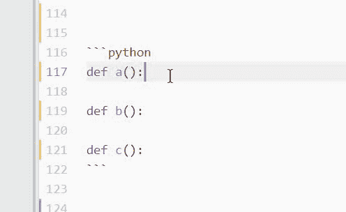
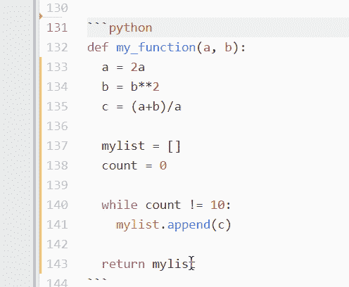
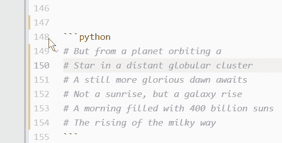

# 用 Python 编写注释(指南)

> 原文:[https://realpython.com/python-comments-guide/](https://realpython.com/python-comments-guide/)

*立即观看**本教程有真实 Python 团队创建的相关视频课程。和文字教程一起看，加深理解: [**用 Python 写评论**](/courses/writing-comments-python/)*

 *当用 Python 写代码时，确保**你的代码能被其他人**容易地理解是很重要的。给[变量](https://realpython.com/python-variables/)起一个明显的名字，[定义显式函数](https://realpython.com/defining-your-own-python-function/)，以及组织你的代码都是很好的方法。

增加代码可读性的另一个简单又棒的方法是使用**注释**！

在本教程中，您将了解用 Python 编写注释的一些基础知识。你将学习如何写干净简洁的评论，以及什么时候你可能根本不需要写任何评论。

**您还将了解:**

*   为什么注释代码如此重要
*   用 Python 编写注释的最佳实践
*   您可能希望避免的评论类型
*   如何练习写更干净的评论

**免费奖励:** [掌握 Python 的 5 个想法](https://realpython.com/bonus/python-mastery-course/)，这是一个面向 Python 开发者的免费课程，向您展示将 Python 技能提升到下一个水平所需的路线图和心态。

## 为什么注释你的代码如此重要

注释是任何程序不可或缺的一部分。它们可以以模块级文档字符串的形式出现，甚至可以是有助于阐明复杂函数的内联解释。

在深入不同类型的注释之前，让我们仔细看看为什么注释代码如此重要。

考虑下面两种情况，其中一个程序员决定不注释他们的代码。

[*Remove ads*](/account/join/)

### *当读取自己的代码时*

 *客户端 A 想要对他们的 web 服务进行最后的部署。你已经在一个紧张的最后期限，所以你决定让它工作。所有那些“额外”的东西——文档、适当的注释等等——您将在以后添加。

截止日期到了，您准时部署了服务。咻！

你在心里记下回去更新评论，但是在你把它放到你的任务清单上之前，你的老板带着一个你需要立即开始的新项目过来了。几天之内，你已经完全忘记了你应该回去适当地注释你为客户 a 写的代码。

快进六个月，客户端 A 需要为相同的服务构建一个补丁，以符合一些新的要求。维护它是你的工作，因为你是最初建造它的人。你打开你的文本编辑器…

你到底写了什么？！

你花了几个小时解析你的旧代码，但你完全迷失在混乱中。当时你太匆忙了，以至于没有正确命名变量，甚至没有在正确的控制流中设置函数。最糟糕的是，你在脚本中没有任何注释来告诉你什么是什么！

开发人员总是忘记他们自己的代码是做什么的，特别是如果它是很久以前或者在很大压力下写的。当最后期限快到了，在电脑前的几个小时已经导致眼睛充血，双手抽筋，这种压力可以以比平时更混乱的代码形式反映出来。

一旦提交了项目，许多开发人员就懒得回去评论他们的代码了。当以后需要重新审视它的时候，他们会花上几个小时试图解析他们所写的内容。

边走边写注释是防止上述情况发生的好方法。对未来的你好点！

### 当别人阅读你的代码时

想象一下，你是唯一一个从事小型 Django 项目的开发人员。您非常了解自己的代码，所以您不倾向于使用注释或任何其他类型的文档，并且您喜欢这样。评论是需要时间去写和维护的，你就是看不到重点。

唯一的问题是，到年底，你的“小 Django 项目”已经变成了“20，000 行代码”的项目，你的主管带来了额外的开发人员来帮助维护它。

新的开发人员努力工作以快速达到速度，但是在一起工作的头几天，你已经意识到他们遇到了一些麻烦。您使用了一些古怪的变量名，并用超级简洁的语法编写。新员工花大量时间一行一行地检查你的代码，试图弄清楚它是如何工作的。他们甚至需要几天时间才能帮你维护它！

在你的代码中使用注释可以帮助其他开发者。注释有助于其他开发人员浏览您的代码，并很快理解它是如何工作的。通过选择从项目一开始就对代码进行注释，可以帮助确保平稳的过渡。

## 如何用 Python 写注释

既然你已经理解了注释你的代码的重要性，让我们回顾一些基础知识，这样你就知道如何正确地做了。

### Python 注释基础知识

评论是给开发者看的。它们在必要的地方描述了代码的各个部分，以方便程序员的理解，包括你自己。

要用 Python 写注释，只需在您想要的注释前加上散列符号`#`:

```
# This is a comment
```

Python 会忽略散列标记之后直到行尾的所有内容。您可以将它们插入代码中的任何位置，甚至与其他代码内联:

```
print("This will run.")  # This won't run
```

当你运行上面的代码时，你只会看到输出`This will run.`，其他的都被忽略了。

评论应该简短、甜蜜、切中要害。虽然 [PEP 8](https://www.python.org/dev/peps/pep-0008/#maximum-line-length) 建议每行代码保持在 79 个字符或更少，但它建议行内注释和文档字符串最多 72 个字符。如果你的评论接近或超过了这个长度，那么你需要把它分散到多行中。

[*Remove ads*](/account/join/)

### *Python 多行注释*

 *不幸的是，Python 无法像其他语言一样编写多行注释，比如 [C](https://realpython.com/c-for-python-programmers/) 、 [Java](https://realpython.com/oop-in-python-vs-java/) 和 Go:

```
# So you can't
just do this
in python
```

在上面的例子中，第一行将被程序忽略，但是其他行将引发一个[语法错误](https://realpython.com/invalid-syntax-python/)。

相比之下，像 Java 这样的语言将允许您非常容易地将注释分散到多行中:

```
/* You can easily
write multiline
comments in Java */
```

程序会忽略`/*`和`*/`之间的所有内容。

虽然 Python 本身没有多行注释功能，但是您可以在 Python 中创建多行注释。有两种简单的方法可以做到这一点。

第一种方法是在每一行之后按下`return`键，添加一个新的散列标记，然后从那里继续您的注释:

```
def multiline_example():
    # This is a pretty good example
    # of how you can spread comments
    # over multiple lines in Python
```

以散列符号开头的每一行都将被程序忽略。

另一种方法是使用多行字符串，将注释放在一组三重引号中:

```
"""
If I really hate pressing `enter` and
typing all those hash marks, I could
just do this instead
"""
```

这就像 Java 中的多行注释，三重引号中的所有内容都将作为注释。

虽然这为您提供了多行功能，但从技术上讲，这并不是注释。它是一个没有赋值给任何变量的字符串，所以你的程序不会调用或引用它。尽管如此，因为它在运行时会被忽略，不会出现在字节码中，所以它可以有效地充当注释。(你可以[看看这篇文章](https://dbader.org/blog/python-multiline-comment)来证明这些字符串不会出现在字节码中。)

但是，在放置这些多行“注释”时要小心根据它们在程序中的位置，它们可能会变成[文档串](https://www.geeksforgeeks.org/python-docstrings/)，这些文档串是与函数或方法相关联的文档。如果你在一个函数定义后面加上一个坏男孩，那么你原本打算作为注释的东西将会和这个对象相关联。

在使用这些的时候要小心，如果有疑问，就在后面的每一行加上一个散列符号。如果您有兴趣了解更多关于 docstrings 以及如何将它们与模块、类等相关联的信息，请查看我们关于[记录 Python 代码](https://realpython.com/documenting-python-code/)的教程。

### Python 注释快捷键

每次需要添加注释时，都要键入所有这些散列符号，这可能很乏味。那么，你能做些什么来加快速度呢？这里有几个技巧可以帮助你在评论时摆脱困境。

您可以做的第一件事就是使用多个游标。听起来就是这样:在屏幕上放置多个光标来完成一项任务。只需按住 `Ctrl` 或 `Cmd` 键，同时单击鼠标左键，您应该会在屏幕上看到闪烁的线条:

[](https://files.realpython.com/media/gif_multi-cursor.6d8f5974124b.gif)

当你需要在几个地方评论同一件事时，这是最有效的。

如果你有一段很长的文本需要注释掉呢？假设您不希望运行一个已定义的函数来检查 bug。点击每一行注释掉它会花费很多时间！在这种情况下，您需要切换注释。只需选择所需代码，在 PC 上按 `Ctrl` + `/` ，在 Mac 上按 `Cmd` + `/` :

[](https://files.realpython.com/media/gif_toggle.6424d45ed925.gif)

所有突出显示的文本都将加上一个散列标记，并被程序忽略。

如果您的注释变得过于笨拙，或者您正在阅读的脚本中的注释非常长，那么您的文本编辑器可能会让您选择使用左侧的小向下箭头折叠它们:

[](https://files.realpython.com/media/gif_hide.6314ae5dad5e.gif)

只需点击箭头隐藏评论。这最适用于多行的长注释，或者占据程序大部分开头的文档字符串。

结合这些技巧将会使你的代码注释变得快速、简单、轻松！

[*Remove ads*](/account/join/)

## *Python 注释最佳实践*

 *虽然知道如何用 Python 写注释是很好的，但确保您的注释可读且易于理解也同样重要。

看看这些提示，帮助你写出真正支持你的代码的注释。

### 给自己写代码的时候

通过适当地注释您自己的代码，您可以让自己的生活更轻松。即使没有其他人会看到它，你也会看到它，这就足够让它变得正确。毕竟你是一名开发人员，所以你的代码也应该易于理解。

使用注释的一个非常有用的方法是作为代码的大纲。如果你不确定你的程序结果如何，那么你可以使用注释作为一种跟踪剩余工作的方式，或者甚至作为一种跟踪程序高级流程的方式。例如，使用注释来概述伪代码中的函数:

```
from collections import defaultdict

def get_top_cities(prices):
    top_cities = defaultdict(int)

    # For each price range
        # Get city searches in that price
        # Count num times city was searched
        # Take top 3 cities & add to dict

    return dict(top_cities)
```

这些评论策划出来`get_top_cities()`。一旦你确切地知道你想要你的函数做什么，你就可以把它翻译成代码。

使用这样的评论可以帮助你保持头脑清醒。当你浏览你的程序时，你会知道为了有一个功能完整的脚本还需要做什么。在将注释“翻译”成代码之后，记得删除任何多余的注释，这样你的代码就会保持清晰和整洁。

您也可以使用注释作为[调试](https://realpython.com/python-debugging-pdb/)过程的一部分。注释掉旧代码，看看这会如何影响您的输出。如果你同意这个改变，那么不要在你的程序中把代码注释掉，因为这会降低可读性。如果需要恢复它，请删除它并使用版本控制。

最后，使用注释来定义您自己代码中的棘手部分。如果你放下一个项目，几个月或几年后再回来，你会花很多时间试图重新熟悉你写的东西。万一你忘记了你自己的代码是做什么的，那就帮你自己一个忙，把它记下来，这样以后就可以更容易地恢复速度了。

### 为他人编写代码时

人们喜欢在文本中快速浏览和来回跳转，阅读代码也不例外。你可能一行一行地通读代码的唯一时间是当它不工作的时候，你必须弄清楚发生了什么。

在大多数其他情况下，您将快速浏览一下变量和函数定义，以便获得要点。在这种情况下，用简单的英语来解释正在发生的事情确实可以帮助开发人员。

善待你的开发伙伴，使用注释来帮助他们浏览你的代码。内联注释应该有节制地使用，以清除那些本身不明显的代码。(当然，您的首要任务应该是让您的代码独立存在，但是行内注释在这方面会很有用。)

如果你有一个复杂的方法或函数，它的名字不容易理解，你可能想在`def`行后面加上一个简短的注释来说明一些问题:

```
def complicated_function(s):
    # This function does something complicated
```

这可以帮助其他浏览你的代码的开发人员了解这个函数的功能。

对于任何公共函数，您都希望包含一个关联的 docstring，不管它是否复杂:

```
def sparsity_ratio(x: np.array) -> float:
    """Return a float

 Percentage of values in array that are zero or NaN
 """
```

该字符串将成为函数的`.__doc__`属性，并正式与该特定方法相关联。PEP 257 docstring 指南将帮助你构建你的 docstring。这些是开发人员在构造文档字符串时通常使用的一组约定。

PEP 257 指南对多行文档字符串也有[约定。这些文档字符串出现在文件的顶部，包括对整个脚本及其功能的高级概述:](https://www.python.org/dev/peps/pep-0257/#multi-line-docstrings)

```
# -*- coding: utf-8 -*-
"""A module-level docstring

Notice the comment above the docstring specifying the encoding.
Docstrings do appear in the bytecode, so you can access this through
the ``__doc__`` attribute. This is also what you'll see if you call
help() on a module or any other Python object.
"""
```

像这样的模块级 docstring 将包含开发人员阅读它时需要知道的任何相关信息。当编写一个时，建议列出所有的类、异常和函数，并为每个列出一行摘要。

[*Remove ads*](/account/join/)

## *Python 评论最差实践*

 *正如编写 Python 注释有标准一样，有几种类型的注释不会导致 Python 代码。这里只是几个。

### 避免:W.E.T .评论

你的评论应该是 D.R.Y .缩写代表编程格言“不要重复自己。”这意味着你的代码应该很少或者没有冗余。你不需要注释一段足以解释它自己的代码，就像这样:

```
return a  # Returns a
```

我们可以清楚地看到,`a`被返回，所以没有必要在注释中明确声明这一点。这使得注释成为 W.E.T .，意味着你“每件事都写了两遍。”(或者，对于更愤世嫉俗的人来说，“浪费了每个人的时间。”)

W.E.T .注释可能是一个简单的错误，特别是如果你在写代码之前使用注释来规划代码。但是一旦你让代码运行良好，一定要回去删除那些变得不必要的注释。

### 忌:臭评论

注释可能是“代码味道”的标志，这意味着您的代码可能存在更深层次的问题。代码味道试图掩盖程序的潜在问题，而注释是试图隐藏这些问题的一种方式。评论应该支持你的代码，而不是试图解释它。如果你的代码写得很差，再多的注释也无法修复它。

让我们举一个简单的例子:

```
# A dictionary of families who live in each city
mydict = {
    "Midtown": ["Powell", "Brantley", "Young"],
    "Norcross": ["Montgomery"], 
    "Ackworth": []
}

def a(dict):
    # For each city
    for p in dict:
        # If there are no families in the city
        if not mydict[p]:
            # Say that there are no families
            print("None.")
```

这段代码相当难懂。每一行之前都有一个注释来解释代码的作用。通过为变量、函数和集合指定明显的名称，这个脚本可以变得更简单，如下所示:

```
families_by_city = {
    "Midtown": ["Powell", "Brantley", "Young"],
    "Norcross": ["Montgomery"],
    "Ackworth": [],
}

def no_families(cities):
    for city in cities:
        if not families_by_city[city]:
            print(f"No families in {city}.")
```

通过使用显而易见的命名约定，我们能够删除所有不必要的注释并减少代码长度！

您的注释应该很少比它们支持的代码长。如果你花了太多时间来解释你做了什么，那么你需要回去重构，使你的代码更加清晰和简洁。

### 避免:粗鲁的评论

这是在开发团队中工作时可能会遇到的事情。当几个人都在处理同一个代码时，其他人会进去检查你写的东西并进行修改。有时，你可能会碰到有人敢写这样的评论:

```
# Put this here to fix Ryan's stupid-a** mistake
```

老实说，不这么做是个好主意。如果是你朋友的代码就没关系，你确定他们不会因此而被冒犯。你永远不知道什么可能会被发布到产品中，如果你不小心把那个评论留在那里，然后被客户发现了，会是什么样子？你是专业人士，在你的评论中包含粗俗的词语不是展示这一点的方式。

## 如何练习评论

开始写更多 Pythonic 注释的最简单的方法就是去做！

开始用自己的代码为自己写注释。从现在开始，在必要的地方加入简单的评论。为复杂的函数增加一些清晰度，并在所有脚本的顶部放置一个 docstring。

另一个很好的练习方法是回顾你写的旧代码。看看哪些地方可能没有意义，并清理代码。如果它仍然需要一些额外的支持，添加一个简短的注释来帮助阐明代码的目的。

如果你的代码在 GitHub 上，并且人们正在分叉你的回购，这是一个特别好的主意。通过引导他们完成您已经完成的工作来帮助他们开始。

也可以通过评论别人的代码来回馈社区。如果你已经从 GitHub 下载了一些东西，并且在筛选的时候遇到了困难，当你开始理解每段代码是做什么的时候，添加注释。

在您的评论上“签名”您的姓名首字母和日期，然后提交您的更改作为拉请求。如果您的更改被合并，您可能会帮助几十个甚至几百个像您一样的开发人员在他们的下一个项目中取得优势。

[*Remove ads*](/account/join/)

## *结论*

 *学会好好评论是一个很有价值的工具。一般来说，你不仅会学到如何更清晰、更简洁地写作，而且毫无疑问，你也会对 Python 有更深的理解。

知道如何用 Python 写注释可以让所有开发者的生活变得更轻松，包括你自己！他们可以帮助其他开发人员了解你的代码所做的事情，并帮助你重新熟悉你自己的旧代码。

通过注意当你使用注释来尝试和支持写得很差的代码时，你将能够回过头来修改你的代码，使之更加健壮。注释以前编写的代码，无论是您自己的还是其他开发人员的，都是练习用 Python 编写简洁注释的好方法。

随着您对编写代码了解的越来越多，您可以考虑进入下一个文档级别。查看我们的教程[记录 Python 代码](https://realpython.com/documenting-python-code/)以采取下一步行动。

*立即观看**本教程有真实 Python 团队创建的相关视频课程。和文字教程一起看，加深理解: [**用 Python 写评论**](/courses/writing-comments-python/)*******