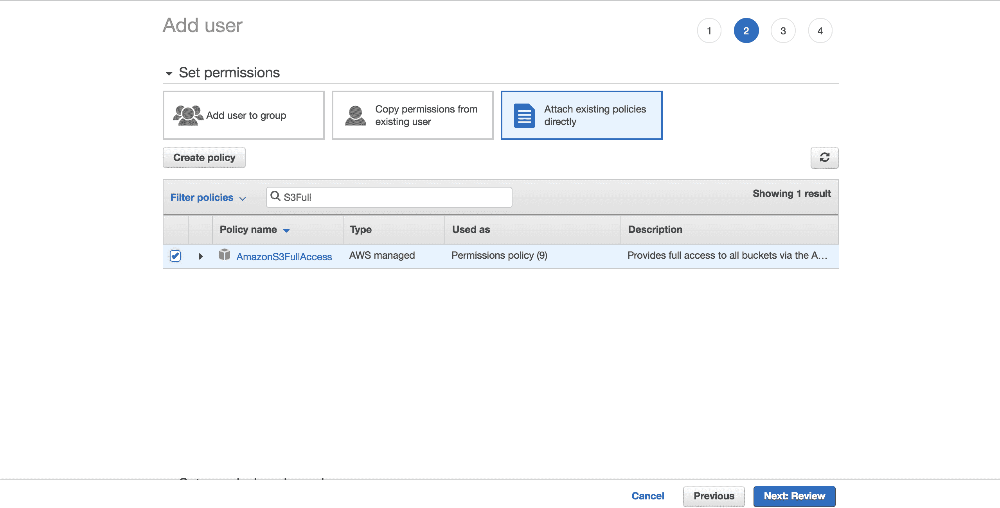
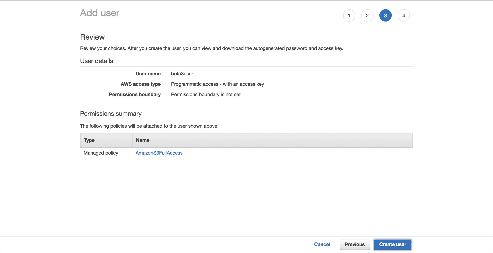

# Python、Boto3 和 AWS S3:揭秘

> 原文:[https://realpython.com/python-boto3-aws-s3/](https://realpython.com/python-boto3-aws-s3/)

*立即观看**本教程有真实 Python 团队创建的相关视频课程。和文字教程一起看，加深理解: [**Python，Boto3，AWS S3:去神秘化**](/courses/python-boto3-aws-s3/)*

 *亚马逊网络服务(AWS)已经成为云计算的领导者。它的核心组件之一是 S3，由 AWS 提供的对象存储服务。凭借其令人印象深刻的可用性和耐用性，它已成为存储视频、图像和数据的标准方式。您可以将 S3 与其他服务结合起来构建无限可伸缩的应用程序。

[Boto3](https://boto3.amazonaws.com/v1/documentation/api/latest/index.html) 是用于 AWS 的 Python SDK 的名称。它允许您从 Python 脚本中直接创建、更新和删除 AWS 资源。

如果您以前接触过 AWS，拥有自己的 AWS 帐户，并且希望通过从 Python 代码内部开始使用 AWS 服务来将您的技能提升到一个新的水平，那么请继续阅读。

**本教程结束时，您将:**

*   自信地直接使用 Python 脚本中的桶和对象
*   知道如何避免使用 Boto3 和 S3 时常见的陷阱
*   从一开始就了解如何设置数据，以避免以后出现性能问题
*   了解如何配置您的对象以利用 S3 的最佳功能

在探索 Boto3 的特性之前，您将首先看到如何在您的机器上配置 SDK。这一步将为您完成本教程的剩余部分做好准备。

**免费奖励:** [掌握 Python 的 5 个想法](https://realpython.com/bonus/python-mastery-course/)，这是一个面向 Python 开发者的免费课程，向您展示将 Python 技能提升到下一个水平所需的路线图和心态。

## 安装

要在您的计算机上安装 Boto3，请转到您的终端并运行以下命令:

```
$ pip install boto3
```

你有 SDK。但是，您现在无法使用它，因为它不知道应该连接到哪个 AWS 帐户。

要让它在您的 AWS 帐户上运行，您需要提供一些有效的凭证。如果您已经有一个对 S3 拥有完全权限的 IAM 用户，则可以使用这些用户的凭据(他们的访问密钥和他们的秘密访问密钥)，而无需创建新用户。否则，最简单的方法是创建一个新的 AWS 用户，然后存储新的凭证。

要创建一个新用户，进入你的 AWS 账户，然后进入*服务*并选择 *IAM* 。然后选择*用户*，点击*添加用户*。

给用户一个名称(例如， *boto3user* )。启用*编程访问*。这将确保该用户能够使用任何 AWS 支持的 SDK 或进行单独的 API 调用:

[](https://files.realpython.com/media/Screen_Shot_2018-09-30_at_13.16.27.60c66df08590.png)

为了简单起见，选择预配置的 *AmazonS3FullAccess* 策略。通过此策略，新用户将能够完全控制 S3。点击*下一页:回顾*:

[](https://files.realpython.com/media/Screen_Shot_2018-09-30_at_13.16.57.b8253f22dc72.png)

选择*创建用户*:

[](https://files.realpython.com/media/Screen_Shot_2018-09-30_at_13.17.12.2268fd61cb5f.png)

一个新的屏幕将显示用户生成的凭证。点击*下载。csv* 按钮制作凭证的副本。您将需要它们来完成您的设置。

现在您有了新用户，创建一个新文件，`~/.aws/credentials`:

```
$ touch ~/.aws/credentials
```

打开文件并粘贴下面的结构。用您下载的新用户凭据填充占位符:

```
[default] aws_access_key_id  =  YOUR_ACCESS_KEY_ID aws_secret_access_key  =  YOUR_SECRET_ACCESS_KEY
```

保存文件。

现在您已经设置了这些凭证，您有了一个`default`概要文件，Boto3 将使用它与您的 AWS 帐户进行交互。

还需要设置一个配置:Boto3 应该与之交互的默认区域。您可以查看支持的 AWS 区域的[完整表格。选择离你最近的地区。从*地区*栏中复制您的首选地区。在我的例子中，我使用的是*欧盟-西方-1* (爱尔兰)。](https://docs.aws.amazon.com/general/latest/gr/rande.html#s3_region)

创建一个新文件，`~/.aws/config`:

```
$ touch ~/.aws/config
```

添加以下内容并用您复制的`region`替换占位符:

```
[default] region  =  YOUR_PREFERRED_REGION
```

保存您的文件。

现在，您已经为教程的剩余部分正式设置好了。

接下来，您将看到 Boto3 为您提供的连接 S3 和其他 AWS 服务的不同选项。

[*Remove ads*](/account/join/)

## *客户端对资源*

 *在其核心，Boto3 所做的只是代表你调用 AWS APIs。对于大多数 AWS 服务，Boto3 提供了两种不同的访问这些抽象 API 的方式:

*   **客户端:**低级服务访问
*   **资源:**更高级的面向对象的服务访问

你可以使用其中任何一个与 S3 互动。

要连接到底层客户端接口，必须使用 Boto3 的`client()`。然后传入您想要连接的服务的名称，在本例中是`s3`:

```
import boto3
s3_client = boto3.client('s3')
```

要连接到高级接口，您将遵循类似的方法，但是使用`resource()`:

```
import boto3
s3_resource = boto3.resource('s3')
```

您已经成功地连接到两个版本，但现在您可能想知道，“我应该使用哪一个？”

对于客户，有更多的程序性工作要做。大多数客户端操作都会给你一个[字典](https://realpython.com/python-dicts/)响应。为了获得您需要的确切信息，您必须自己解析该词典。有了资源方法，SDK 就可以为您完成这项工作。

对于客户端，您可能会看到一些轻微的性能改进。缺点是代码的可读性比使用资源时要差。资源提供了更好的抽象，您的代码将更容易理解。

当您考虑选择哪一个时，了解客户端和资源是如何生成的也很重要:

*   Boto3 从 JSON 服务定义文件生成客户机。客户端的方法支持与目标 AWS 服务的每一种交互。
*   另一方面，资源是从 JSON 资源定义文件中生成的。

Boto3 从不同的定义中生成客户机和资源。因此，您可能会发现资源不提供客户端支持的操作的情况。有趣的是:您不需要修改代码就可以在任何地方使用客户端。对于该操作，您可以通过资源直接访问客户端，比如:`s3_resource.meta.client`。

一个这样的`client`操作是 [`.generate_presigned_url()`](https://boto3.amazonaws.com/v1/documentation/api/latest/reference/services/s3.html#S3.Client.generate_presigned_url) ，它允许您的用户在一段设定的时间内访问您的存储桶中的一个对象，而不需要他们拥有 AWS 凭证。

## 常见操作

现在您已经了解了客户端和资源之间的区别，让我们开始使用它们来构建一些新的 S3 组件。

### 创建存储桶

首先，你需要一个 S3 [桶](https://docs.aws.amazon.com/AmazonS3/latest/gsg/AmazonS3Basics.html)。要以编程方式创建一个，您必须首先为您的存储桶选择一个名称。请记住，这个名称在整个 AWS 平台上必须是唯一的，因为 bucket 名称是符合 DNS 的。如果您尝试创建一个 bucket，但是另一个用户已经占用了您想要的 bucket 名称，那么您的代码将会失败。您将看到以下错误，而不是成功:`botocore.errorfactory.BucketAlreadyExists`。

你可以通过选择一个随机的名字来增加你成功的机会。您可以生成自己的函数来完成这项工作。在这个实现中，您将看到如何使用 [`uuid`](https://docs.python.org/3.7/library/uuid.html) 模块来帮助您实现这一点。UUID4 的字符串表示长度为 36 个字符(包括连字符)，您可以添加一个前缀来指定每个 bucket 的用途。

这里有一种方法可以让你做到:

```
import uuid
def create_bucket_name(bucket_prefix):
    # The generated bucket name must be between 3 and 63 chars long
    return ''.join([bucket_prefix, str(uuid.uuid4())])
```

您已经有了自己的 bucket 名称，但是现在还有一件事情需要注意:除非您所在的地区在美国，否则您需要在创建 bucket 时显式地定义这个地区。否则你会得到一个`IllegalLocationConstraintException`。

为了举例说明当您在美国以外的地区创建 S3 存储桶时这意味着什么，请看下面的代码:

```
s3_resource.create_bucket(Bucket=YOUR_BUCKET_NAME,
                          CreateBucketConfiguration={
                              'LocationConstraint': 'eu-west-1'})
```

您需要提供一个 bucket 名称和一个 bucket 配置，其中您必须指定区域，在我的例子中是`eu-west-1`。

这并不理想。假设您想要将代码部署到云中。您的任务将变得越来越困难，因为您现在已经对该区域进行了硬编码。您可以重构该区域，并将其转换为一个环境变量，但这样您就又多了一件需要管理的事情。

幸运的是，通过利用一个[会话](https://boto3.amazonaws.com/v1/documentation/api/latest/reference/core/session.html)对象，有一个更好的方法来通过编程获得该区域。Boto3 将从您的凭证中创建`session`。你只需要把这个区域作为它的`LocationConstraint`配置传递给`create_bucket()`。下面是如何做到这一点:

```
def create_bucket(bucket_prefix, s3_connection):
    session = boto3.session.Session()
    current_region = session.region_name
    bucket_name = create_bucket_name(bucket_prefix)
    bucket_response = s3_connection.create_bucket(
        Bucket=bucket_name,
        CreateBucketConfiguration={
        'LocationConstraint': current_region})
    print(bucket_name, current_region)
    return bucket_name, bucket_response
```

好的一面是，无论您想在哪里部署它，这段代码都可以工作:locally/EC2/Lambda。此外，您不需要硬编码您的区域。

由于客户机和资源都以相同的方式创建存储桶，所以您可以将其中任何一个作为`s3_connection`参数传递。

现在，您将创建两个存储桶。首先使用客户端创建一个，这将把`bucket_response`作为字典返回给您:

>>>

```
>>> first_bucket_name, first_response = create_bucket(
...     bucket_prefix='firstpythonbucket', 
...     s3_connection=s3_resource.meta.client)
firstpythonbucket7250e773-c4b1-422a-b51f-c45a52af9304 eu-west-1

>>> first_response
{'ResponseMetadata': {'RequestId': 'E1DCFE71EDE7C1EC', 'HostId': 'r3AP32NQk9dvbHSEPIbyYADT769VQEN/+xT2BPM6HCnuCb3Z/GhR2SBP+GM7IjcxbBN7SQ+k+9B=', 'HTTPStatusCode': 200, 'HTTPHeaders': {'x-amz-id-2': 'r3AP32NQk9dvbHSEPIbyYADT769VQEN/+xT2BPM6HCnuCb3Z/GhR2SBP+GM7IjcxbBN7SQ+k+9B=', 'x-amz-request-id': 'E1DCFE71EDE7C1EC', 'date': 'Fri, 05 Oct 2018 15:00:00 GMT', 'location': 'http://firstpythonbucket7250e773-c4b1-422a-b51f-c45a52af9304.s3.amazonaws.com/', 'content-length': '0', 'server': 'AmazonS3'}, 'RetryAttempts': 0}, 'Location': 'http://firstpythonbucket7250e773-c4b1-422a-b51f-c45a52af9304.s3.amazonaws.com/'}
```

然后使用资源创建第二个 bucket，这将返回一个作为`bucket_response`的`Bucket`实例:

>>>

```
>>> second_bucket_name, second_response = create_bucket(
...     bucket_prefix='secondpythonbucket', s3_connection=s3_resource)
secondpythonbucket2d5d99c5-ab96-4c30-b7f7-443a95f72644 eu-west-1

>>> second_response
s3.Bucket(name='secondpythonbucket2d5d99c5-ab96-4c30-b7f7-443a95f72644')
```

你有你的水桶。接下来，您需要开始向它们添加一些文件。

[*Remove ads*](/account/join/)

### *命名您的文件*

 *您可以使用标准的文件命名约定来命名对象。您可以使用任何有效的名称。在本文中，您将看到一个更具体的案例，帮助您理解 S3 是如何在幕后工作的。

如果你计划在你的 S3 存储桶中存放大量的文件，有一些事情你应该记住。如果您的所有文件名都有一个确定的前缀，这个前缀在每个文件中都重复出现，比如像“YYYY-MM-DDThh:mm:ss”这样的时间戳格式，那么您很快就会发现，当您试图与您的 bucket 进行交互时，会遇到[性能问题](https://aws.amazon.com/blogs/aws/amazon-s3-performance-tips-tricks-seattle-hiring-event/)。

这将会发生，因为 S3 采取了文件的前缀，并将其映射到一个分区。您添加的文件越多，分配给同一个分区的文件就越多，该分区将会非常繁重，响应速度也越慢。

你能做些什么来防止这种情况发生？

最简单的解决方法是随机化文件名。您可以想象许多不同的实现，但是在这种情况下，您将使用可信的`uuid`模块来帮助实现。为了使本教程的文件名更容易阅读，您将采用生成的数字的前六个字符`hex`表示，并将其与您的基本文件名连接起来。

下面的 helper 函数允许您传入您希望文件具有的字节数、文件名以及文件的样本内容，以便重复生成所需的文件大小:

```
def create_temp_file(size, file_name, file_content):
    random_file_name = ''.join([str(uuid.uuid4().hex[:6]), file_name])
    with open(random_file_name, 'w') as f:
        f.write(str(file_content) * size)
    return random_file_name
```

创建您的第一个文件，您很快就会用到它:

```
first_file_name = create_temp_file(300, 'firstfile.txt', 'f')
```

通过为文件名添加随机性，您可以在 S3 存储桶中高效地分发数据。

### 创建`Bucket`和`Object`实例

创建文件后的下一步是了解如何将其集成到您的 S3 工作流中。

这就是资源的类发挥重要作用的地方，因为这些抽象使得使用 S3 很容易。

通过使用资源，您可以访问高级类(`Bucket`和`Object`)。您可以通过以下方式分别创建一个:

```
first_bucket = s3_resource.Bucket(name=first_bucket_name)
first_object = s3_resource.Object(
    bucket_name=first_bucket_name, key=first_file_name)
```

您在创建`first_object`变量时没有看到任何错误的原因是 Boto3 没有调用 AWS 来创建引用。`bucket_name`和`key`被称为标识符，它们是创建`Object`的必要参数。一个`Object`的任何其他属性，比如它的大小，都是延迟加载的。这意味着 Boto3 要获得请求的属性，必须调用 AWS。

### 了解子资源

`Bucket`和`Object`是彼此的子资源。子资源是创建子资源的新实例的方法。父资源的标识符被传递给子资源。

如果你有一个`Bucket`变量，你可以直接创建一个`Object`:

```
first_object_again = first_bucket.Object(first_file_name)
```

或者如果你有一个`Object`变量，那么你可以得到`Bucket`:

```
first_bucket_again = first_object.Bucket()
```

很好，你现在明白如何生成一个`Bucket`和一个`Object`。接下来，您将使用这些结构将新生成的文件上传到 S3。

[*Remove ads*](/account/join/)

### *上传文件*

 *有三种方法可以上传文件:

*   从`Object`实例
*   从`Bucket`实例
*   从`client`

在每种情况下，您都必须提供`Filename`，这是您想要上传的文件的路径。现在，您将探索三种选择。随意挑选你最喜欢的上传`first_file_name`到 S3。

**对象实例版本**

您可以使用`Object`实例上传:

```
s3_resource.Object(first_bucket_name, first_file_name).upload_file(
    Filename=first_file_name)
```

或者您可以使用`first_object`实例:

```
first_object.upload_file(first_file_name)
```

**桶实例版本**

以下是使用`Bucket`实例上传的方法:

```
s3_resource.Bucket(first_bucket_name).upload_file(
    Filename=first_file_name, Key=first_file_name)
```

**客户端版本**

您也可以使用`client`上传:

```
s3_resource.meta.client.upload_file(
    Filename=first_file_name, Bucket=first_bucket_name,
    Key=first_file_name)
```

您已经使用三种可用方法中的一种成功地将文件上传到 S3。在接下来的部分中，您将主要使用`Object`类，因为`client`和`Bucket`版本之间的操作非常相似。

### 下载文件

要从 S3 本地下载文件，您将遵循与上传时类似的步骤。但是在这种情况下，`Filename`参数将映射到您想要的本地路径。这一次，它会将文件下载到`tmp`目录:

```
s3_resource.Object(first_bucket_name, first_file_name).download_file(
    f'/tmp/{first_file_name}') # Python 3.6+
```

您已成功从 S3 下载了您的文件。接下来，您将看到如何使用一个 API 调用在 S3 存储桶之间复制同一个文件。

[*Remove ads*](/account/join/)

### *在桶之间复制对象*

 *如果您需要将文件从一个存储桶复制到另一个存储桶，Boto3 为您提供了这种可能性。在这个例子中，您将使用`.copy()`将文件从第一个桶复制到第二个桶:

```
def copy_to_bucket(bucket_from_name, bucket_to_name, file_name):
    copy_source = {
        'Bucket': bucket_from_name,
        'Key': file_name
    }
    s3_resource.Object(bucket_to_name, file_name).copy(copy_source)

copy_to_bucket(first_bucket_name, second_bucket_name, first_file_name)
```

**注意:**如果你的目标是将你的 S3 对象复制到一个不同区域的桶中，看看[跨区域复制](https://docs.aws.amazon.com/AmazonS3/latest/dev/crr.html)。

### 删除对象

让我们通过在等价的`Object`实例上调用`.delete()`来从第二个桶中删除新文件:

```
s3_resource.Object(second_bucket_name, first_file_name).delete()
```

您现在已经看到了如何使用 S3 的核心操作。在接下来的章节中，你已经准备好将你的知识提升到一个更高的层次，学习更复杂的特征。

## 高级配置

在这一部分，你将探索更多的 S3 特色。您将看到如何使用它们的示例，以及它们可以为您的应用程序带来的好处。

### ACL(访问控制列表)

访问控制列表(ACL)帮助您管理对存储桶和其中的对象的访问。它们被认为是管理 S3 权限的传统方式。你为什么要知道他们？如果您必须管理对单个对象的访问，那么您可以使用对象 ACL。

默认情况下，当您将对象上传到 S3 时，该对象是私有的。如果您希望其他人也可以使用该对象，可以在创建时将该对象的 ACL 设置为公共的。以下是如何将新文件上传到存储桶并让每个人都可以访问它:

```
second_file_name = create_temp_file(400, 'secondfile.txt', 's')
second_object = s3_resource.Object(first_bucket.name, second_file_name)
second_object.upload_file(second_file_name, ExtraArgs={
                          'ACL': 'public-read'})
```

您可以从`Object`中获得`ObjectAcl`实例，因为它是其子资源类之一:

```
second_object_acl = second_object.Acl()
```

要查看谁有权访问您的对象，请使用`grants`属性:

>>>

```
>>> second_object_acl.grants
[{'Grantee': {'DisplayName': 'name', 'ID': '24aafdc2053d49629733ff0141fc9fede3bf77c7669e4fa2a4a861dd5678f4b5', 'Type': 'CanonicalUser'}, 'Permission': 'FULL_CONTROL'}, {'Grantee': {'Type': 'Group', 'URI': 'http://acs.amazonaws.com/groups/global/AllUsers'}, 'Permission': 'READ'}]
```

您可以将对象再次设为私有，而无需重新上传:

>>>

```
>>> response = second_object_acl.put(ACL='private')
>>> second_object_acl.grants
[{'Grantee': {'DisplayName': 'name', 'ID': '24aafdc2053d49629733ff0141fc9fede3bf77c7669e4fa2a4a861dd5678f4b5', 'Type': 'CanonicalUser'}, 'Permission': 'FULL_CONTROL'}]
```

您已经看到了如何使用 ACL 来管理对单个对象的访问。接下来，您将看到如何通过使用加密为您的对象增加一层额外的安全性。

**注意:**如果你想把你的数据分成多个类别，看看[标签](https://docs.aws.amazon.com/AmazonS3/latest/dev/object-tagging.html)。您可以根据对象的标签授予对这些对象的访问权限。

[*Remove ads*](/account/join/)

### *加密*

 *有了 S3，您可以使用加密来保护您的数据。您将探索使用 AES-256 算法的服务器端加密，其中 AWS 管理加密和密钥。

创建一个新文件，并使用`ServerSideEncryption`上传:

```
third_file_name = create_temp_file(300, 'thirdfile.txt', 't')
third_object = s3_resource.Object(first_bucket_name, third_file_name)
third_object.upload_file(third_file_name, ExtraArgs={
                         'ServerSideEncryption': 'AES256'})
```

您可以检查用于加密文件的算法，在本例中为`AES256`:

>>>

```
>>> third_object.server_side_encryption
'AES256'
```

现在，您已经了解了如何使用 AWS 提供的 AES-256 服务器端加密算法为您的对象添加额外的保护层。

### 存储

您添加到 S3 存储桶的每个对象都与一个存储类相关联。所有可用的存储类别都具有很高的耐用性。您可以根据应用程序的性能访问要求选择存储对象的方式。

目前，您可以将以下存储类别用于 S3:

*   **标准**:常用数据默认
*   **STANDARD_IA** :针对不常用的数据，需要在请求时快速检索
*   **ONEZONE_IA** :与 STANDARD_IA 使用情形相同，但将数据存储在一个而不是三个可用性区域中
*   **REDUCED_REDUNDANCY** :用于经常使用的、容易复制的非关键数据

如果要更改现有对象的存储类，需要重新创建该对象。

例如，重新加载`third_object`并将其存储类设置为`Standard_IA`:

```
third_object.upload_file(third_file_name, ExtraArgs={
                         'ServerSideEncryption': 'AES256', 
                         'StorageClass': 'STANDARD_IA'})
```

**注意:**如果你对你的对象进行修改，你可能会发现你的本地实例并没有显示它们。此时，您需要做的是调用`.reload()`来获取对象的最新版本。

重新加载该对象，您可以看到它的新存储类:

>>>

```
>>> third_object.reload()
>>> third_object.storage_class
'STANDARD_IA'
```

**注意:**使用[生命周期配置](https://docs.aws.amazon.com/AmazonS3/latest/dev/object-lifecycle-mgmt.html)在您发现需要时，通过不同的类转移对象。他们会自动为您转换这些对象。

### 版本控制

您应该使用版本控制来保存一段时间内对象的完整记录。它还可以作为一种保护机制，防止对象被意外删除。当您请求一个版本化的对象时，Boto3 将检索最新版本。

当您添加一个对象的新版本时，该对象占用的总存储量是其版本大小的总和。因此，如果您存储一个 1 GB 的对象，并且您创建了 10 个版本，那么您必须为 10GB 的存储空间付费。

为第一个时段启用版本控制。为此，您需要使用`BucketVersioning`类:

```
def enable_bucket_versioning(bucket_name):
    bkt_versioning = s3_resource.BucketVersioning(bucket_name)
    bkt_versioning.enable()
    print(bkt_versioning.status)
```

>>>

```
>>> enable_bucket_versioning(first_bucket_name)
Enabled
```

然后为第一个文件`Object`创建两个新版本，一个包含原始文件的内容，另一个包含第三个文件的内容:

```
s3_resource.Object(first_bucket_name, first_file_name).upload_file(
   first_file_name)
s3_resource.Object(first_bucket_name, first_file_name).upload_file(
   third_file_name)
```

现在重新加载第二个文件，这将创建一个新版本:

```
s3_resource.Object(first_bucket_name, second_file_name).upload_file(
    second_file_name)
```

您可以检索对象的最新可用版本，如下所示:

>>>

```
>>> s3_resource.Object(first_bucket_name, first_file_name).version_id
'eQgH6IC1VGcn7eXZ_.ayqm6NdjjhOADv'
```

在本节中，您已经看到了如何使用一些最重要的 S3 属性，并将它们添加到您的对象中。接下来，您将看到如何轻松地遍历您的桶和对象。

[*Remove ads*](/account/join/)

## *旅行记录*

 *如果您需要从所有 S3 资源中检索信息或对其应用操作，Boto3 为您提供了几种迭代遍历存储桶和对象的方法。您将从遍历所有创建的桶开始。

### 桶遍历

要遍历您帐户中的所有存储桶，您可以使用资源的`buckets`属性和`.all()`，这将为您提供`Bucket`实例的完整列表:

>>>

```
>>> for bucket in s3_resource.buckets.all():
...     print(bucket.name)
...
firstpythonbucket7250e773-c4b1-422a-b51f-c45a52af9304
secondpythonbucket2d5d99c5-ab96-4c30-b7f7-443a95f72644
```

您也可以使用`client`来检索 bucket 信息，但是代码更复杂，因为您需要从`client`返回的字典中提取它:

>>>

```
>>> for bucket_dict in s3_resource.meta.client.list_buckets().get('Buckets'):
...     print(bucket_dict['Name'])
...
firstpythonbucket7250e773-c4b1-422a-b51f-c45a52af9304
secondpythonbucket2d5d99c5-ab96-4c30-b7f7-443a95f72644
```

您已经看到了如何遍历您帐户中的存储桶。在接下来的部分中，您将选择一个存储桶，并迭代地查看它包含的对象。

### 对象遍历

如果您想列出一个桶中的所有对象，下面的代码将为您生成一个迭代器:

>>>

```
>>> for obj in first_bucket.objects.all():
...     print(obj.key)
...
127367firstfile.txt
616abesecondfile.txt
fb937cthirdfile.txt
```

`obj`变量是一个`ObjectSummary`。这是一个`Object`的轻量级代表。概要版本不支持`Object`的所有属性。如果您需要访问它们，使用`Object()`子资源创建一个对底层存储键的新引用。然后，您将能够提取缺失的属性:

>>>

```
>>> for obj in first_bucket.objects.all():
...     subsrc = obj.Object()
...     print(obj.key, obj.storage_class, obj.last_modified,
...           subsrc.version_id, subsrc.metadata)
...
127367firstfile.txt STANDARD 2018-10-05 15:09:46+00:00 eQgH6IC1VGcn7eXZ_.ayqm6NdjjhOADv {}
616abesecondfile.txt STANDARD 2018-10-05 15:09:47+00:00 WIaExRLmoksJzLhN7jU5YzoJxYSu6Ey6 {}
fb937cthirdfile.txt STANDARD_IA 2018-10-05 15:09:05+00:00 null {}
```

现在，您可以对存储桶和对象迭代地执行操作。你差不多完成了。在这个阶段，您还应该知道一件事:如何删除您在本教程中创建的所有资源。

## 删除桶和对象

要删除您创建的所有存储桶和对象，您必须首先确保您的存储桶中没有对象。

### 删除非空桶

为了能够删除一个存储桶，您必须首先删除存储桶中的每个对象，否则将引发`BucketNotEmpty`异常。当您有一个版本化的存储桶时，您需要删除每个对象及其所有版本。

如果您发现自动执行此操作的生命周期规则不适合您的需要，以下是您可以通过编程方式删除对象的方法:

```
def delete_all_objects(bucket_name):
    res = []
    bucket=s3_resource.Bucket(bucket_name)
    for obj_version in bucket.object_versions.all():
        res.append({'Key': obj_version.object_key,
                    'VersionId': obj_version.id})
    print(res)
    bucket.delete_objects(Delete={'Objects': res})
```

无论您是否在您的 bucket 上启用了版本控制，上面的代码都可以工作。如果没有，对象的版本将为空。您可以在一个 API 调用中批量删除多达 1000 个，在您的`Bucket`实例上使用`.delete_objects()`，这比单独删除每个对象更划算。

针对第一个存储桶运行新函数，以删除所有版本化对象:

>>>

```
>>> delete_all_objects(first_bucket_name)
[{'Key': '127367firstfile.txt', 'VersionId': 'eQgH6IC1VGcn7eXZ_.ayqm6NdjjhOADv'}, {'Key': '127367firstfile.txt', 'VersionId': 'UnQTaps14o3c1xdzh09Cyqg_hq4SjB53'}, {'Key': '127367firstfile.txt', 'VersionId': 'null'}, {'Key': '616abesecondfile.txt', 'VersionId': 'WIaExRLmoksJzLhN7jU5YzoJxYSu6Ey6'}, {'Key': '616abesecondfile.txt', 'VersionId': 'null'}, {'Key': 'fb937cthirdfile.txt', 'VersionId': 'null'}]
```

作为最后的测试，您可以将一个文件上传到第二个 bucket。该时段没有启用版本控制，因此版本将为空。应用相同的功能删除内容:

>>>

```
>>> s3_resource.Object(second_bucket_name, first_file_name).upload_file(
...     first_file_name)
>>> delete_all_objects(second_bucket_name)
[{'Key': '9c8b44firstfile.txt', 'VersionId': 'null'}]
```

您已经成功地从两个存储桶中移除了所有对象。您现在已经准备好删除存储桶了。

[*Remove ads*](/account/join/)

### *删除存储桶*

 *最后，您将在您的`Bucket`实例上使用`.delete()`来移除第一个桶:

```
s3_resource.Bucket(first_bucket_name).delete()
```

如果你愿意，你可以使用`client`版本来删除第二个桶:

```
s3_resource.meta.client.delete_bucket(Bucket=second_bucket_name)
```

这两个操作都是成功的，因为您在尝试删除之前清空了每个存储桶。

现在，您已经运行了一些可以用 S3 和 Boto3 执行的最重要的操作。恭喜你走到这一步！作为奖励，让我们探索一下用基础设施作为代码来管理 S3 资源的一些优势。

## Python 代码还是基础设施即代码(IaC)？

如你所见，在本教程中，你与 S3 的大部分互动都与物体有关。您没有看到许多与 bucket 相关的操作，例如向 bucket 添加策略，添加生命周期规则以通过存储类转换您的对象，将它们归档到 Glacier 或完全删除它们，或者通过配置 Bucket Encryption 强制加密所有对象。

随着应用程序开始添加其他服务并变得更加复杂，通过 Boto3 的客户端或资源手动管理 buckets 的状态变得越来越困难。要使用 Boto3 监控您的基础设施，请考虑使用基础设施即代码(IaC)工具，如 CloudFormation 或 Terraform 来管理您的应用程序的基础设施。这些工具中的任何一个都将维护您的基础设施的状态，并通知您已经应用的更改。

如果你决定走这条路，请记住以下几点:

*   以任何方式修改存储桶的任何存储桶相关操作都应该通过 IaC 完成。
*   如果您希望所有的对象都以相同的方式运行(例如，全部加密，或者全部公开)，通常有一种方法可以直接使用 IaC，通过添加一个 Bucket 策略或者一个特定的 Bucket 属性来实现。
*   桶读取操作，比如遍历桶的内容，应该使用 Boto3 来完成。
*   单个对象级别的对象相关操作应该使用 Boto3 来完成。

## 结论

祝贺您完成了本教程的最后一课！

现在，您已经准备好开始以编程方式使用 S3 了。您现在知道如何创建对象，将它们上传到 S3，下载它们的内容并直接从脚本中更改它们的属性，同时避免了 Boto3 的常见缺陷。

愿本教程成为您使用 AWS 构建伟大事物之旅的垫脚石！

## 延伸阅读

如果您想了解更多信息，请查看以下内容:

*   [Boto3 文档](https://boto3.amazonaws.com/v1/documentation/api/latest/reference/services/s3.html)
*   [在 Python 中生成随机数据(指南)](https://realpython.com/python-random/)
*   [IAM 策略和存储桶策略以及 ACL](https://aws.amazon.com/blogs/security/iam-policies-and-bucket-policies-and-acls-oh-my-controlling-access-to-s3-resources/)
*   [对象标记](https://docs.aws.amazon.com/AmazonS3/latest/dev/object-tagging.html)
*   [生命周期配置](https://docs.aws.amazon.com/AmazonS3/latest/dev/object-lifecycle-mgmt.html)
*   [跨区域复制](https://docs.aws.amazon.com/AmazonS3/latest/dev/crr.html)
*   [云的形成](https://aws.amazon.com/cloudformation/)
*   [地形](https://www.terraform.io/)

*立即观看**本教程有真实 Python 团队创建的相关视频课程。和文字教程一起看，加深理解: [**Python，Boto3，AWS S3:去神秘化**](/courses/python-boto3-aws-s3/)*********