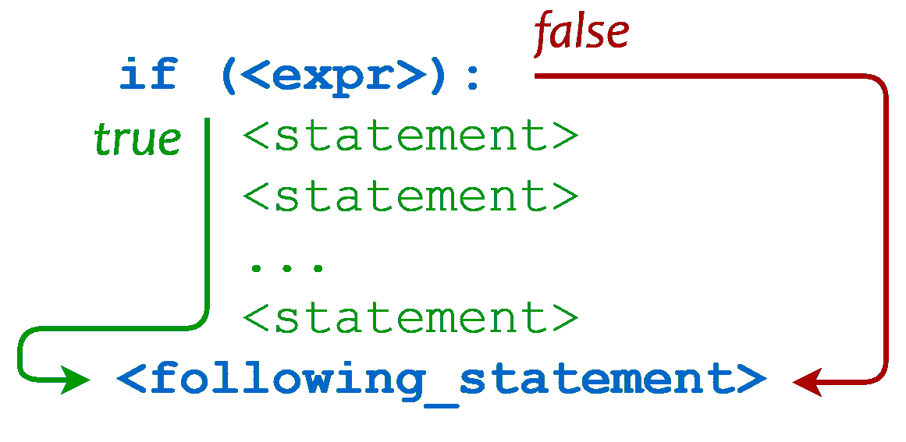
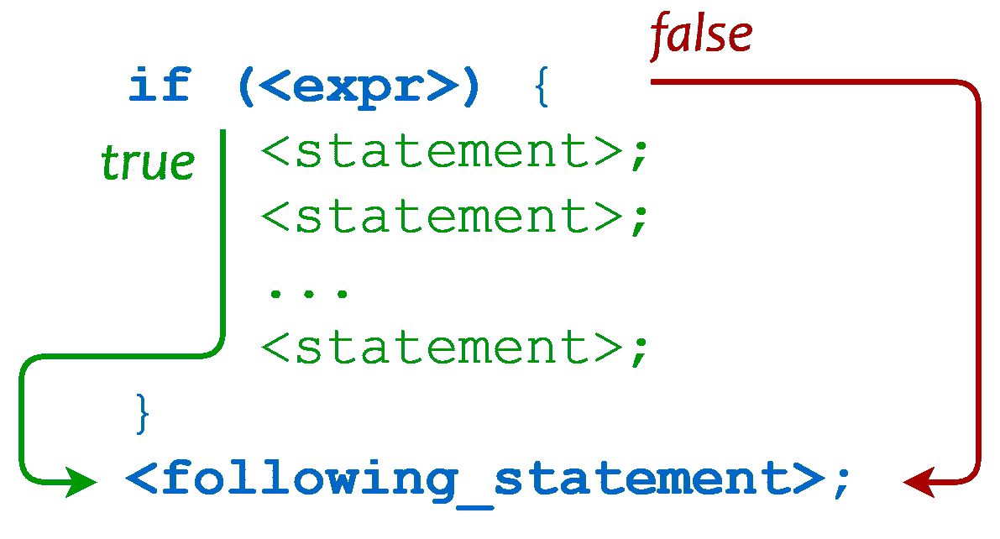

# Python 中的条件语句

> 原文:[https://realpython.com/python-conditional-statements/](https://realpython.com/python-conditional-statements/)

*立即观看**本教程有真实 Python 团队创建的相关视频课程。和书面教程一起看，加深理解:[**Python 中的条件语句(if/elif/else)**](/courses/python-conditional-statements/)*

 *从本系列前面的教程中，您现在已经掌握了相当多的 Python 代码。到目前为止，您所看到的一切都是由**顺序执行**组成的，其中语句总是按照指定的顺序一个接一个地执行。

但世界往往比这更复杂。通常，程序需要跳过一些语句，重复执行一系列语句，或者在不同的语句集之间进行选择。

这就是**控制结构**的用武之地。控制结构指导程序中语句的执行顺序(称为程序的[控制流](https://en.wikipedia.org/wiki/Control_flow))。

**这里是你将在本教程中学到的:**你将遇到你的第一个 Python 控制结构，`if`语句。

在现实世界中，我们通常必须评估周围的信息，然后根据我们的观察选择一种或另一种行动方案:

> 如果天气好的话，我就去割草。(言下之意，如果天气不好，那我就不割草了。)

在 Python 程序中，`if`语句是你如何执行这种决策的。它允许根据表达式的值有条件地执行一条或一组语句。

本教程的大纲如下:

*   首先，您将快速浏览一下最简单形式的`if`语句。
*   接下来，使用`if`语句作为模型，您将看到为什么控制结构需要某种机制来将语句分组到**复合语句**或**块**中。您将学习如何在 Python 中实现这一点。
*   最后，您将把它们联系在一起，并学习如何编写复杂的决策代码。

准备好了吗？开始了。

***参加测验:****通过我们的交互式“Python 条件语句”测验来测试您的知识。完成后，您将收到一个分数，以便您可以跟踪一段时间内的学习进度:*

*[参加测验](/quizzes/python-conditional-statements/)*

 *## `if`语句简介

我们将从最基本类型的`if`语句开始。最简单的形式是这样的:

```
if <expr>:
    <statement>
```

在上面显示的表单中:

*   `<expr>`是一个在[布尔](https://realpython.com/python-boolean/)上下文中计算的表达式，如 Python 教程中的运算符和表达式中的[逻辑运算符](https://realpython.com/python-operators-expressions/#logical-operators)一节所述。
*   `<statement>`是有效的 Python 语句，必须缩进。(你很快就会明白为什么。)

如果`<expr>`为真(评估为“真”值)，则执行`<statement>`。如果`<expr>`为假，那么`<statement>`被跳过并且不被执行。

请注意，`<expr>`后面的冒号(`:`)是必需的。一些编程语言要求`<expr>`用括号括起来，但是 Python 不需要。

以下是这种类型的`if`语句的几个例子:

>>>

```
>>> x = 0
>>> y = 5

>>> if x < y:                            # Truthy ...     print('yes') ...
yes
>>> if y < x:                            # Falsy ...     print('yes') ...

>>> if x:                                # Falsy ...     print('yes') ...
>>> if y:                                # Truthy ...     print('yes') ...
yes

>>> if x or y:                           # Truthy ...     print('yes') ...
yes
>>> if x and y:                          # Falsy ...     print('yes') ...

>>> if 'aul' in 'grault':                # Truthy ...     print('yes') ...
yes
>>> if 'quux' in ['foo', 'bar', 'baz']:  # Falsy ...     print('yes') ...
```

**注意:**如果你在 REPL 会话中交互地尝试这些例子，你会发现，当你在输入`print('yes')`语句后点击 `Enter` 时，什么都不会发生。

因为这是一个多行语句，你需要第二次点击 `Enter` 来告诉解释器你已经完成了。在从脚本文件执行的代码中，这个额外的换行符是不必要的。

[*Remove ads*](/account/join/)

## *分组语句:缩进和块*

 *到目前为止，一切顺利。

但是，假设您想要评估一个条件，然后如果它为真，则执行多项操作:

> 如果天气好，我会:
> 
> *   修剪草坪
> *   给花园除草
> *   带狗去散步
> 
> (如果天气不好，我就不会做这些事情。)

在上面显示的所有例子中，每个`if <expr>:`后面只有一个`<statement>`。需要有某种方法来说“如果`<expr>`是真的，做以下所有的事情。”

大多数编程语言通常采用的方法是定义一个语法装置，将多个语句组合成一个**复合语句**或**块**。一个块在语法上被认为是一个单一的实体。当它是一个`if`语句的目标，并且`<expr>`为真时，那么块中的所有语句都被执行。如果`<expr>`是假的，那么它们都不是。

几乎所有的编程语言都提供了定义块的能力，但是它们提供的方式不尽相同。我们来看看 Python 是怎么做的。

### Python:这都是关于缩进的

Python 遵循一个被称为[越位规则](https://en.wikipedia.org/wiki/Off-side_rule)的惯例，这个术语是由英国计算机科学家彼得·j·兰丁创造的。(该术语取自足协足球中的越位法。)遵循越位规则的语言通过缩进来定义块。Python 是相对较小的一组[场外规则语言](https://en.wikipedia.org/wiki/Off-side_rule#Off-side_rule_languages)中的一种。

回想一下之前关于 Python 程序结构的教程，[缩进在 Python 程序中有特殊的意义](https://realpython.com/python-program-structure/#whitespace-as-indentation)。现在你知道为什么了:缩进是用来定义复合语句或者块的。在 Python 程序中，缩进到同一级别的连续语句被视为同一块的一部分。

因此，Python 中的复合`if`语句如下所示:

```
 1if <expr>:
 2    <statement>
 3    <statement>
 4    ...
 5    <statement>
 6<following_statement>
```

这里，匹配缩进级别的所有语句(第 2 行到第 5 行)都被认为是同一个块的一部分。如果`<expr>`为真，则执行整个块；如果`<expr>`为假，则跳过整个块。无论哪种方式，执行都是从`<following_statement>`(第 6 行)开始的。

[](https://files.realpython.com/media/t.78f3bacaa261.png)

<figcaption class="figure-caption text-center">Python Compound if Statement</figcaption>

请注意，没有表示块结束的标记。更确切地说，块的结尾是由一个比块本身的行缩进量小的行来表示的。

**注意:**在 Python 文档中，由缩进定义的一组语句通常被称为**套件**。本教程系列交替使用术语块和套件。

考虑这个脚本文件`foo.py`:

```
 1if 'foo' in ['bar', 'baz', 'qux']:
 2    print('Expression was true')
 3    print('Executing statement in suite')
 4    print('...')
 5    print('Done.')
 6print('After conditional')
```

运行`foo.py`产生以下输出:

```
C:\Users\john\Documents>python foo.py
After conditional
```

第 2 行到第 5 行的四个 [`print()`](https://realpython.com/python-print/) 语句缩进到相同的级别。它们构成了条件为真时将被执行的块。但它是假的，所以块中的所有语句都被跳过。到达复合`if`语句的末尾后(无论是否执行第 2 到 5 行的块中的语句)，执行将继续到具有较小缩进级别的第一条语句:第 6 行的 [`print()`](https://realpython.com/courses/python-print/) 语句。

块可以嵌套到任意深度。每个缩进定义一个新块，每个突出结束前一个块。由此产生的结构是直截了当的、一致的和直观的。

下面是一个更复杂的脚本文件，名为`blocks.py`:

```
# Does line execute?                        Yes    No
#                                           ---    --
if 'foo' in ['foo', 'bar', 'baz']:        #  x
    print('Outer condition is true')      #  x

    if 10 > 20:                           #  x
        print('Inner condition 1')        #        x

    print('Between inner conditions')     #  x

    if 10 < 20:                           #  x
        print('Inner condition 2')        #  x

    print('End of outer condition')       #  x
print('After outer condition')            #  x
```

运行该脚本时生成的输出如下所示:

```
C:\Users\john\Documents>python blocks.py
Outer condition is true
Between inner conditions
Inner condition 2
End of outer condition
After outer condition
```

**注意:**如果您想知道，在 REPL 会话中输入多行语句时，越位规则是需要额外换行符的原因。否则，解释器无法知道已经进入了该块的最后一条语句。

[*Remove ads*](/account/join/)

### *其他语言是做什么的？*

 *也许你很好奇有哪些选择。在不遵守越位规则的语言中，如何定义块？

大多数编程语言使用的策略是指定特殊的标记来标记一个块的开始和结束。例如，在 Perl 中，块是用成对的花括号(`{}`)定义的，如下所示:

```
# (This is Perl, not Python)
if (<expr>) {
    <statement>;
    <statement>;
    ...
    <statement>;
}
<following_statement>;
```

C/C++、 [Java](https://realpython.com/oop-in-python-vs-java/) 以及一大堆[其他语言](https://en.wikipedia.org/wiki/List_of_programming_languages_by_type#Curly-bracket_languages)都是这样使用花括号的。

[](https://files.realpython.com/media/t.7dbd895afc69.png)

<figcaption class="figure-caption text-center">Compound if Statement in C/C++, Perl, and Java</figcaption>

其他语言，比如 Algol 和 Pascal，用关键字`begin`和`end`来括住块。

### 哪个更好？

情人眼里出西施。总的来说，程序员倾向于强烈地感受到他们是如何做事的。关于越位规则优点的辩论可能会相当激烈。

有利的一面是:

*   Python 对缩进的使用是干净、简洁和一致的。
*   在不使用越界规则的编程语言中，代码的缩进完全独立于块定义和代码函数。有可能编写的代码缩进的方式与代码执行的方式并不匹配，因此当一个人浏览它时会产生错误的印象。这种错误在 Python 中几乎是不可能犯的。
*   使用缩进来定义块迫使您维护您可能无论如何都应该使用的代码格式标准。

消极的一面是:

*   许多程序员不喜欢被迫以某种方式做事。他们往往对什么好看什么不好看有强烈的看法，他们不喜欢被硬塞给一个特定的选择。
*   一些编辑器在缩进行的左边混合插入空格和制表符，这使得 Python 解释器很难确定缩进级别。另一方面，经常可以配置编辑器不这样做。不管用什么语言，在源代码中混合使用制表符和空格通常是不可取的。

不管你喜不喜欢，如果你在用 Python 编程，你就会被越位规则所困。Python 中的所有控件结构都使用它，您将在以后的几个教程中看到。

值得一提的是，许多习惯于使用更传统的块定义方式的程序员最初对 Python 的方式感到畏惧，但现在已经习惯了，甚至越来越喜欢它。

## `else`和`elif`条款

现在您知道了如何使用`if`语句有条件地执行一条语句或几条语句的块。是时候找出你还能做什么了。

有时，您希望评估一个条件，如果条件为真，则采用一条路径，如果条件不为真，则指定另一条路径。这是通过一个`else`子句实现的:

```
if <expr>:
    <statement(s)>
else:
    <statement(s)>
```

如果`<expr>`为真，则执行第一套，跳过第二套。如果`<expr>`为假，则跳过第一套，执行第二套。无论哪种方式，在第二个 suite 之后，执行将继续。如上所述，这两个套件都是由缩进定义的。

在本例中，`x`小于`50`，因此执行第一个套件(第 4 行到第 5 行)，跳过第二个套件(第 7 行到第 8 行):

>>>

```
 1>>> x = 20
 2
 3>>> if x < 50:
 4...     print('(first suite)')
 5...     print('x is small')
 6... else:
 7...     print('(second suite)')
 8...     print('x is large')
 9...
10(first suite)
11x is small
```

另一方面，这里的`x`大于`50`，所以第一个套件被忽略，第二个套件被执行:

>>>

```
 1>>> x = 120
 2>>>
 3>>> if x < 50:
 4...     print('(first suite)')
 5...     print('x is small')
 6... else:
 7...     print('(second suite)')
 8...     print('x is large')
 9...
10(second suite)
11x is large
```

还有基于几种选择的分支执行的语法。为此，使用一个或多个`elif`(简称 *else if* )子句。Python 依次评估每个`<expr>`，并执行对应于第一个为真的套件。如果没有一个表达式为真，并且指定了一个`else`子句，则执行其套件:

```
if <expr>:
    <statement(s)>
elif <expr>:
    <statement(s)>
elif <expr>:
    <statement(s)>
    ...
else:
    <statement(s)>
```

可以指定任意数量的`elif`子句。`else`子句是可选的。如果存在，只能有一个，并且必须在最后指定:

>>>

```
>>> name = 'Joe'
>>> if name == 'Fred':
...     print('Hello Fred')
... elif name == 'Xander':
...     print('Hello Xander')
... elif name == 'Joe':
...     print('Hello Joe')
... elif name == 'Arnold':
...     print('Hello Arnold')
... else:
...     print("I don't know who you are!")
...
Hello Joe
```

最多执行一个指定的代码块。如果没有包含一个`else`子句，并且所有条件都为假，那么不会执行任何块。

**注意:**使用一个冗长的`if` / `elif` / `else`系列可能会有点不雅，尤其是当动作是像`print()`这样简单的语句时。在许多情况下，可能有更好的方法来完成同样的事情。

下面是使用`dict.get()`方法的上述示例的一个可能的替代方法:

>>>

```
>>> names = {
...     'Fred': 'Hello Fred',
...     'Xander': 'Hello Xander',
...     'Joe': 'Hello Joe',
...     'Arnold': 'Hello Arnold'
... }

>>> print(names.get('Joe', "I don't know who you are!"))
Hello Joe
>>> print(names.get('Rick', "I don't know who you are!"))
I don't know who you are!
```

回想一下 Python 字典的教程， [`dict.get()`](https://realpython.com/python-dicts/#built-in-dictionary-methods) 方法在字典中搜索指定的键，如果找到就返回相关的值，如果没有找到就返回给定的默认值。

带有`elif`子句的`if`语句使用短路评估，类似于您看到的`and`和`or`操作符。一旦发现其中一个表达式为真并且执行了它的块，就不会测试其余的表达式。下面演示了这一点:

>>>

```
>>> var  # Not defined
Traceback (most recent call last):
  File "<pyshell#58>", line 1, in <module>
    var
NameError: name 'var' is not defined

>>> if 'a' in 'bar':
...     print('foo')
... elif 1/0:
...     print("This won't happen")
... elif var:
...     print("This won't either")
...
foo
```

第二个表达式包含被零除，第三个引用未定义的[变量](https://realpython.com/python-variables/) `var`。这两种情况都会引发错误，但都不会被计算，因为指定的第一个条件为真。

[*Remove ads*](/account/join/)

## *单行`if`语句*

 *习惯上把`if <expr>`写在一行上，把`<statement>`缩进下一行，就像这样:

```
if <expr>:
    <statement>
```

但是允许在一行上写完整的`if`语句。以下内容在功能上等同于上面的示例:

```
if <expr>: <statement>
```

同一行甚至可以有多个`<statement>`，用分号隔开:

```
if <expr>: <statement_1>; <statement_2>; ...; <statement_n>
```

但这意味着什么呢？有两种可能的解释:

1.  如果`<expr>`为真，则执行`<statement_1>`。

    然后，无条件执行`<statement_2> ... <statement_n>`，不管`<expr>`是否为真。

2.  如果`<expr>`为真，则执行所有的`<statement_1> ... <statement_n>`。否则，不要执行其中任何一个。

Python 采取的是后一种解读。分隔`<statements>`的分号比`<expr>`后面的冒号具有更高的优先级——在计算机行话中，分号被认为比冒号绑定得更紧密。因此，`<statements>`被视为一个套件，要么全部执行，要么都不执行:

>>>

```
>>> if 'f' in 'foo': print('1'); print('2'); print('3')
...
1
2
3
>>> if 'z' in 'foo': print('1'); print('2'); print('3')
...
```

可以在同一行指定多个语句作为一个`elif`或`else`子句:

>>>

```
>>> x = 2
>>> if x == 1: print('foo'); print('bar'); print('baz')
... elif x == 2: print('qux'); print('quux')
... else: print('corge'); print('grault')
...
qux
quux

>>> x = 3
>>> if x == 1: print('foo'); print('bar'); print('baz')
... elif x == 2: print('qux'); print('quux')
... else: print('corge'); print('grault')
...
corge
grault
```

虽然所有这些都可行，解释器也允许，但通常不鼓励这样做，因为这会导致可读性差，特别是对于复杂的`if`语句。 [PEP 8](https://www.python.org/dev/peps/pep-0008/#other-recommendations) 特别推荐反对。

和往常一样，这在某种程度上是一个品味问题。乍看之下，大多数人会觉得下面的例子比上面的例子更吸引人，也更容易理解:

>>>

```
>>> x = 3
>>> if x == 1:
...     print('foo')
...     print('bar')
...     print('baz')
... elif x == 2:
...     print('qux')
...     print('quux')
... else:
...     print('corge')
...     print('grault')
...
corge
grault
```

但是，如果一个`if`语句足够简单，把它放在一行可能是合理的。像这样的事情可能不会引起任何人太多的愤怒:

```
debugging = True  # Set to True to turn debugging on.

    .
    .
    .

if debugging: print('About to call function foo()')
foo()
```

## 条件表达式(Python 的三元运算符)

Python 支持一个额外的决策实体，称为条件表达式。(在 Python 文档的不同地方，它也被称为条件运算符或三元运算符。)2005 年，Guido 提议将条件表达式添加到 PEP 308 语言中，并对此开了绿灯。

最简单的形式是，条件表达式的语法如下:

```
<expr1> if <conditional_expr> else <expr2>
```

这不同于上面列出的`if`语句形式，因为它不是一个控制结构来指导程序执行的流程。它更像是一个定义表达式的运算符。在上面的例子中，首先计算`<conditional_expr>`。如果为真，表达式的计算结果为`<expr1>`。如果为 false，表达式的计算结果为`<expr2>`。

注意这个不明显的顺序:首先计算中间的表达式，然后基于这个结果，返回末端的一个表达式。以下是一些例子，希望有助于澄清:

>>>

```
>>> raining = False
>>> print("Let's go to the", 'beach' if not raining else 'library')
Let's go to the beach
>>> raining = True
>>> print("Let's go to the", 'beach' if not raining else 'library')
Let's go to the library

>>> age = 12
>>> s = 'minor' if age < 21 else 'adult'
>>> s
'minor'

>>> 'yes' if ('qux' in ['foo', 'bar', 'baz']) else 'no'
'no'
```

**注意:** Python 的条件表达式类似于许多其他语言使用的`<conditional_expr> ? <expr1> : <expr2>`语法——C、Perl 和 Java 等等。事实上，`?:`操作符在这些语言中通常被称为三元操作符，这可能是 Python 的条件表达式有时被称为 Python 三元操作符的原因。

你可以在 PEP 308 中看到,`<conditional_expr> ? <expr1> : <expr2>`语法曾被考虑用于 Python，但最终被上面显示的语法所取代。

条件表达式的一个常见用途是选择变量赋值。例如，假设您想找出两个数字中较大的一个。当然，有一个内置的函数， [`max()`](https://realpython.com/python-min-and-max/) ，你可以使用它来做这件事。但是假设您想从头开始编写自己的代码。

您可以使用带有`else`子句的标准`if`语句:

>>>

```
>>> if a > b:
...     m = a
... else:
...     m = b
...
```

但是条件表达式更短，也更具可读性:

>>>

```
>>> m = a if a > b else b
```

请记住，条件表达式在语法上的行为类似于表达式。它可以用作较长表达式的一部分。条件表达式的优先级比几乎所有其他操作符都低，所以需要用括号将它单独分组。

在下面的例子中，`+`操作符比条件表达式绑定得更紧密，所以首先计算`1 + x`和`y + 2`，然后计算条件表达式。第二种情况中的括号是不必要的，不会改变结果:

>>>

```
>>> x = y = 40

>>> z = 1 + x if x > y else y + 2
>>> z
42

>>> z = (1 + x) if x > y else (y + 2)
>>> z
42
```

如果希望首先计算条件表达式，需要用分组括号将它括起来。在下一个示例中，首先计算`(x if x > y else y)`。结果是`y`，也就是`40`，所以`z`被赋值`1 + 40 + 2` = `43`:

>>>

```
>>> x = y = 40

>>> z = 1 + (x if x > y else y) + 2
>>> z
43
```

如果您使用条件表达式作为更大表达式的一部分，那么使用分组括号进行说明可能是个好主意，即使它们并不需要。

条件表达式也像复合逻辑表达式一样使用[短路求值](https://realpython.com/python-operators-expressions/#compound-logical-expressions-and-short-circuit-evaluation)。如果不需要，条件表达式的某些部分不会被计算。

在表达式`<expr1> if <conditional_expr> else <expr2>`中:

*   如果`<conditional_expr>`为真，则返回`<expr1>`并且不评估`<expr2>`。
*   如果`<conditional_expr>`为假，则返回`<expr2>`并且不评估`<expr1>`。

和以前一样，您可以通过使用会引起错误的术语来验证这一点:

>>>

```
>>> 'foo' if True else 1/0
'foo'
>>> 1/0 if False else 'bar'
'bar'
```

在这两种情况下，`1/0`项都不会被计算，所以不会引发异常。

条件表达式也可以链接在一起，作为一种可选的`if` / `elif` / `else`结构，如下所示:

>>>

```
>>> s = ('foo' if (x == 1) else
...      'bar' if (x == 2) else
...      'baz' if (x == 3) else
...      'qux' if (x == 4) else
...      'quux'
... )
>>> s
'baz'
```

不清楚这是否比相应的`if` / `elif` / `else`语句有任何显著的优势，但它是语法正确的 Python。

[*Remove ads*](/account/join/)

## *Python `pass`语句*

 *偶尔，您可能会发现您想要编写一个所谓的代码存根:一个占位符，您最终将在其中放置尚未实现的代码块。

在使用标记分隔符定义代码块的语言中，比如 Perl 和 C 中的花括号，空分隔符可以用来定义代码存根。例如，以下是合法的 Perl 或 C 代码:

```
# This is not Python
if (x)
{
}
```

这里，空花括号定义了一个空块。Perl 或者 C 会对表达式`x`求值，然后即使是真的，也不动声色的什么都不做。

因为 Python 使用缩进而不是分隔符，所以不可能指定空块。如果你用`if <expr>:`引入一个`if`语句，那么在它后面必须有一些东西，要么在同一行，要么缩进到下一行。

考虑这个脚本`foo.py`:

```
if True:

print('foo')
```

如果你试着运行`foo.py`，你会得到这个:

```
C:\Users\john\Documents\Python\doc>python foo.py
 File "foo.py", line 3
 print('foo')
 ^
IndentationError: expected an indented block
```

[Python `pass`语句](https://realpython.com/python-pass/)解决了这个问题。它根本不会改变程序的行为。它是一个占位符，在语法上需要一个语句，但您实际上不想做任何事情的任何情况下，它都可以让解释器满意:

```
if True:
    pass

print('foo')
```

现在`foo.py`运行无误:

```
C:\Users\john\Documents\Python\doc>python foo.py
foo
```

## 结论

完成本教程后，您将开始编写超越简单顺序执行的 Python 代码:

*   向您介绍了**控制结构**的概念。这些复合语句改变了程序**控制流**——程序语句的执行顺序。
*   您学习了如何将单个语句组合成一个**块**或**组**。
*   您遇到了您的第一个控制结构，即 **`if`** 语句，这使得**有条件地**执行基于程序数据评估的语句或块成为可能。

所有这些概念对于开发更复杂的 Python 代码都至关重要。

接下来的两个教程将介绍两个新的控制结构: **`while`** 语句和 **`for`** 语句。这些结构有助于**迭代**，重复执行一个语句或语句块。

***参加测验:****通过我们的交互式“Python 条件语句”测验来测试您的知识。完成后，您将收到一个分数，以便您可以跟踪一段时间内的学习进度:*

*[参加测验](/quizzes/python-conditional-statements/)*

*[« Python Program Structure](https://realpython.com/python-program-structure/)[Conditional Statements in Python](#)[Python "while" Loops »](https://realpython.com/python-while-loop/)

*立即观看**本教程有真实 Python 团队创建的相关视频课程。和书面教程一起看，加深理解:[**Python 中的条件语句(if/elif/else)**](/courses/python-conditional-statements/)********