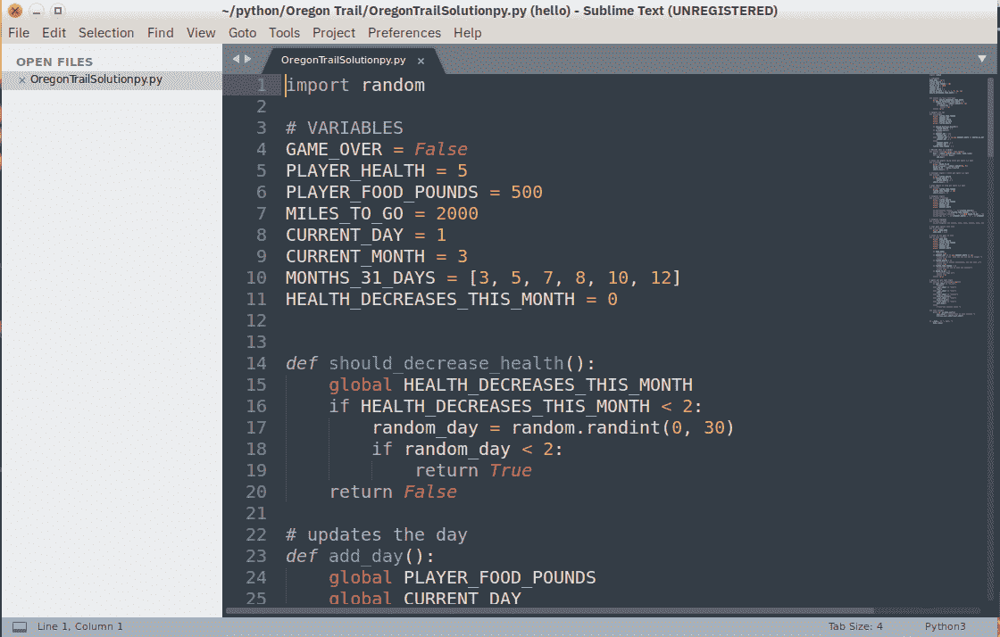
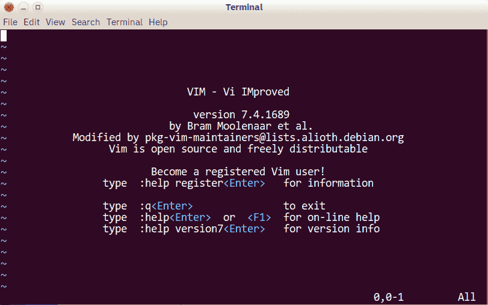
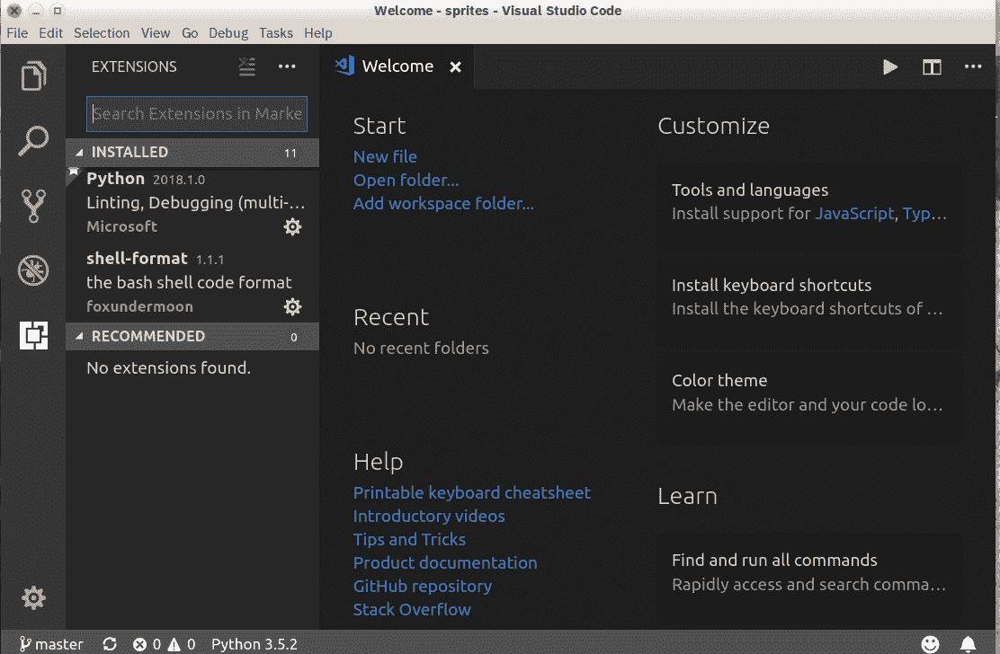
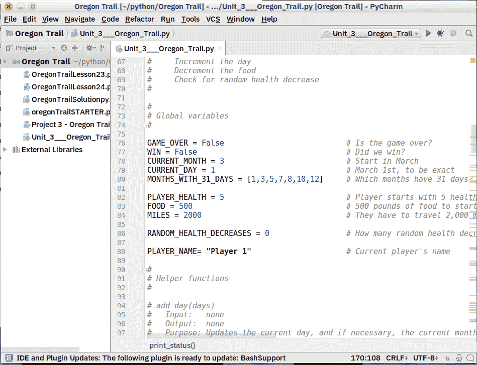
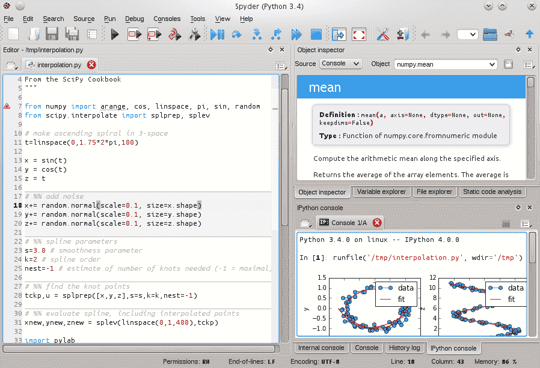
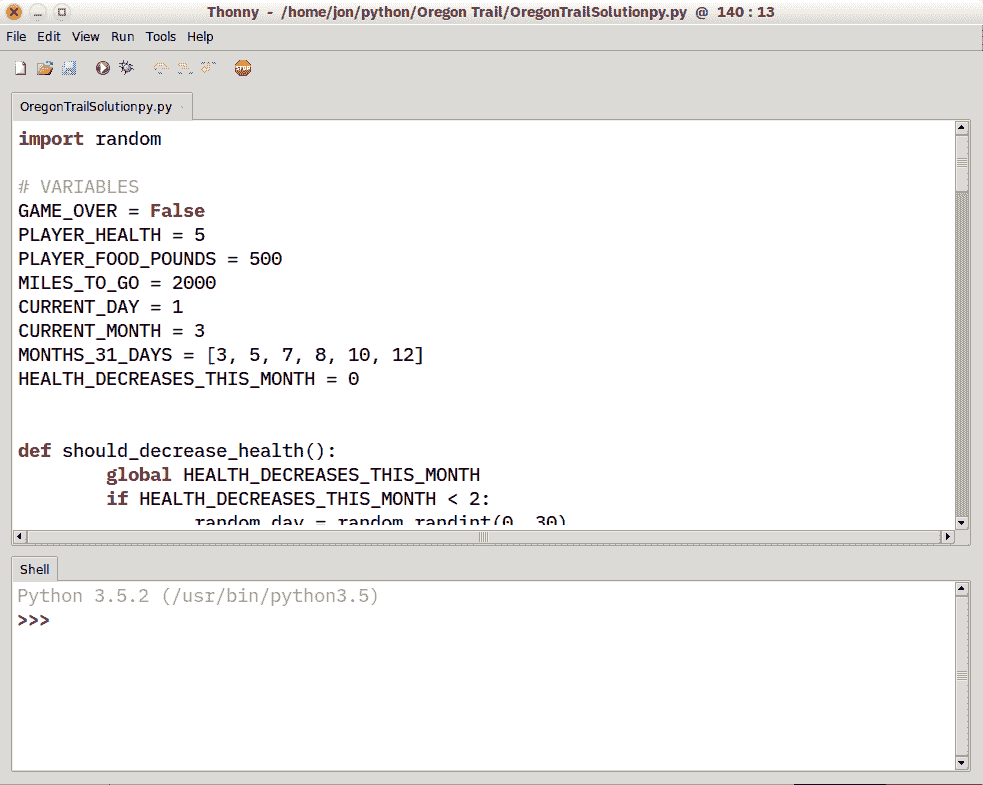

# Python IDEs 和代码编辑器(指南)

> 原文：<https://realpython.com/python-ides-code-editors-guide/>

*立即观看**本教程有真实 Python 团队创建的相关视频课程。和文字教程一起看，加深理解: [**寻找完美的 Python 代码编辑器**](/courses/finding-perfect-python-code-editor/)*

 *使用 [IDLE](https://realpython.com/python-idle/) 或 Python Shell 编写 Python 对于简单的事情来说是很棒的，但是这些工具很快会将大型编程项目变成令人沮丧的绝望之地。使用 IDE，或者仅仅是一个好的专用代码编辑器，会让编码变得有趣——但是哪一个最适合你呢？

不要害怕，亲爱的读者！我们在这里帮助你解释和揭开无数可供选择的秘密。我们无法选择最适合您和您的流程的方法，但是我们可以解释每种方法的优缺点，并帮助您做出明智的决定。

为了使事情变得简单，我们将把我们的列表分成两大类工具:一类是专门为 Python 开发构建的，另一类是为可以用于 Python 的一般开发构建的。我们将为每个问题说出一些为什么和为什么不。最后，这些选项都不是相互排斥的，所以您可以自己尝试一下，代价很小。

但是首先…

## 什么是 ide 和代码编辑器？

IDE(或集成开发环境)是专用于软件开发的程序。顾名思义，ide 集成了几个专门为软件开发设计的工具。这些工具通常包括:

*   为处理代码而设计的编辑器(例如，带有语法突出显示和自动完成功能)
*   构建、执行和调试工具
*   某种形式的源代码管理

大多数 ide 支持许多不同的编程语言，并包含更多的特性。因此，它们可能很大，下载和安装需要时间。您可能还需要高级知识来正确使用它们。

相比之下，专用代码编辑器可以像文本编辑器一样简单，具有语法突出显示和代码格式化功能。大多数好的代码编辑器可以执行代码并控制一个[调试器](https://realpython.com/python-debugging-pdb/)。最好的软件也与源代码控制系统交互。与 IDE 相比，一个好的专用代码编辑器通常更小、更快，但是功能不丰富。

[*Remove ads*](/account/join/)

## *良好的 Python 编码环境的要求*

 *那么在编码环境中我们真正需要的是什么呢？功能列表因应用而异，但有一组核心功能可以简化编码:

*   **保存并重新加载代码文件**
    如果一个 IDE 或编辑器不允许你保存你的工作，并在你离开时以同样的状态重新打开一切，那它就不是一个好的 IDE。
*   **在环境中运行代码**
    同样，如果你不得不退出编辑器来运行你的 Python 代码，那么它也不过是一个简单的文本编辑器。
*   调试支持
    能够在代码运行时逐句通过代码是所有 ide 和大多数优秀代码编辑器的核心特性。
*   **语法突出显示**
    能够快速发现代码中的[关键词](https://realpython.com/python-keywords/)、变量和符号使得阅读和理解代码更加容易。
*   **自动代码格式化**
    任何称职的编辑器或 IDE 都会识别出`while`或`for`语句末尾的冒号，并知道下一行应该缩进。

当然，您可能还需要许多其他特性，比如源代码控制、扩展模型、构建和测试工具、语言帮助等等。但是上面的列表是我认为一个好的编辑环境应该支持的“核心特性”。

记住这些特性，让我们来看看一些可以用于 Python 开发的通用工具。

## 支持 Python 的通用编辑器和 IDEs】

### Eclipse + PyDev

**类别:** IDE
**网站:**[www.eclipse.org](http://www.eclipse.org/)
**Python 工具:** PyDev，[www.pydev.org](https://www.pydev.org)

如果你在开源社区呆过一段时间，你应该听说过 Eclipse。适用于 Linux、Windows 和 OS X 的 Eclipse 是 Java 开发的事实上的开源 IDE。它有一个丰富的扩展和附加组件市场，这使得 Eclipse 对于广泛的开发活动非常有用。

PyDev 就是这样一个扩展，它支持 Python 调试、代码完成和交互式 Python 控制台。将 PyDev 安装到 Eclipse 很容易:从 Eclipse 中选择 Help，Eclipse Marketplace，然后搜索 PyDev。如有必要，单击 Install 并重启 Eclipse。

**优点:**如果你已经安装了 Eclipse，添加 PyDev 会更快更容易。对于有经验的 Eclipse 开发人员来说，PyDev 非常容易使用。

缺点:如果你刚刚开始使用 Python，或者一般的软件开发，Eclipse 可能会很难处理。还记得我说过 ide 比较大，需要更多的知识才能正确使用吗？Eclipse 就是所有这些和一袋(微型)芯片。

### 崇高的文字

**类别:**代码编辑
**网站:**[http://www.sublimetext.com](http://www.sublimetext.com)

Sublime Text 是由一个梦想拥有更好的文本编辑器的 Google 工程师编写的，是一个非常受欢迎的代码编辑器。所有平台都支持 Sublime Text，它内置了对 Python 代码编辑的支持和一组丰富的扩展(称为包),这些扩展扩展了语法和编辑功能。

安装额外的 [Python 包](https://realpython.com/python-modules-packages/)可能很棘手:所有 Sublime 文本包都是用 Python 本身编写的，安装社区包通常需要你直接在 Sublime 文本中执行 Python 脚本。

优点: Sublime Text 在社区中有很多追随者。作为一个代码编辑器，单独来说，Sublime Text 很快，很小，并且得到很好的支持。

**缺点:** Sublime Text 不是免费的，虽然你可以无限期使用评估版。安装扩展可能很棘手，并且没有从编辑器中执行或调试代码的直接支持。

为了充分利用您的 Sublime Text 设置，请阅读我们的 [Python + Sublime Text 设置指南](https://realpython.com/setting-up-sublime-text-3-for-full-stack-python-development/)，并考虑我们的[深度视频课程](https://realpython.com/products/sublime-python/)，该课程将向您展示如何使用 Sublime Text 3 创建有效的 Python 开发设置。

[*Remove ads*](/account/join/)

### *Atom*

 ***类别:**代码编辑
**网站:**[https://atom.io/](https://atom.io/)

Atom 可在所有平台上使用，被宣传为“21 世纪可破解的文本编辑器”。凭借时尚的界面、文件系统浏览器和扩展市场，开源 Atom 是使用 [Electron](https://electronjs.org/) 构建的，这是一个使用 [JavaScript](https://realpython.com/python-vs-javascript/) 、 [HTML 和 CSS](https://realpython.com/html-css-python/) 创建桌面应用程序的框架。Python 语言支持由一个扩展提供，该扩展可以在 Atom 运行时安装。

优点:多亏了 Electron，它在所有平台上都有广泛的支持。Atom 很小，所以下载和加载速度很快。

**缺点:**构建和调试支持不是内置的，而是社区提供的附加组件。因为 Atom 是基于 Electron 构建的，所以它总是在 JavaScript 进程中运行，而不是作为原生应用程序。

### GNU Emacs

**类别:**代码编辑
**网站:**[https://www.gnu.org/software/emacs/](https://www.gnu.org/software/emacs/)

早在 iPhone vs Android 大战之前，在 Linux vs Windows 大战之前，甚至在 PC vs Mac 大战之前，就有了[编辑器大战](https://en.wikipedia.org/wiki/Editor_war)，GNU Emacs 作为参战方之一。GNU Emacs 被宣传为“可扩展、可定制、自我文档化的实时显示编辑器”，它几乎和 UNIX 一样存在了很长时间，并拥有狂热的追随者。

GNU Emacs 总是免费的，在每个平台上都可用(以某种形式)，它使用一种强大的 Lisp 编程语言进行定制，并且存在各种用于 Python 开发的定制脚本。

**优点:**你知道 Emacs，你用 Emacs，你爱 Emacs。Lisp 是第二语言，你知道它给你的力量意味着你可以做任何事情。

**缺点:**定制就是将 Lisp 代码编写(或者复制/粘贴)到各种脚本文件中。如果还没有提供，您可能需要学习 Lisp 来弄清楚如何去做。

另外，你知道 Emacs 会是一个很棒的操作系统，只要它有一个好的文本编辑器…

请务必参考我们的 [Python + Emacs 设置指南](https://realpython.com/emacs-the-best-python-editor/)来充分利用这个设置。

### Vi / Vim

**类别:**代码编辑
**网站:**[https://www.vim.org/](https://www.vim.org/)

文本编辑器战争的另一方是 VI(又名 VIM)。几乎每个 UNIX 系统和 Mac OS X 系统都默认包含 VI，它拥有同样狂热的追随者。

VI 和 VIM 是模态编辑器，将文件的查看和编辑分开。VIM 包含了对原始 VI 的许多改进，包括可扩展性模型和就地代码构建。VIMScripts 可用于各种 Python 开发任务。

**优点:**你知道 VI，你用 VI，你爱 VI。VIMScripts 不会吓到你，你知道你可以随心所欲地使用它。

**缺点:**像 Emacs 一样，您不习惯寻找或编写自己的脚本来支持 Python 开发，并且您不确定模态编辑器应该如何工作。

另外，你知道 VI 将是一个伟大的文本编辑器，只要它有一个像样的操作系统。

如果你打算使用这种组合，请查看我们的 [Python + VIM 设置指南](https://realpython.com/vim-and-python-a-match-made-in-heaven/)，其中包含提示和插件推荐。

[*Remove ads*](/account/join/)

### *Visual Studio*

 ***类别:** IDE
**网站:**[https://www.visualstudio.com/vs/](https://www.visualstudio.com/vs/)
**Python 工具:**[Visual Studio 的 Python 工具](http://pytools.codeplex.com/)，又名 PTVS

Visual Studio 由微软构建，是一个全功能的 IDE，在许多方面可以与 Eclipse 相媲美。VS 仅适用于 Windows 和 Mac OS，有免费(社区)和付费(专业和企业)两个版本。Visual Studio 支持各种平台的开发，并自带扩展市场。

Visual Studio 的 Python 工具(又名 PTVS)支持 Visual Studio 中的 Python 编码，以及 Python 的智能感知、调试和其他工具。

**优点:**如果您已经为其他开发活动安装了 Visual Studio，那么添加 PTVS 会更快更容易。

缺点: Visual Studio 对于 Python 来说是一个很大的下载量。此外，如果您使用的是 Linux，那么您就不走运了:该平台没有 Visual Studio 安装程序。

### Visual Studio 代码

**类别:**代码编辑
**网站:**[https://code.visualstudio.com/](https://code.visualstudio.com/)
**Python 工具:**[https://marketplace.visualstudio.com/items?itemName=ms-python.python](https://marketplace.visualstudio.com/items?itemName=ms-python.python)

不要与完整的 Visual Studio 混淆，Visual Studio Code(又名 VS Code)是一个适用于 Linux、Mac OS X 和 Windows 平台的全功能代码编辑器。小巧轻便，但功能齐全，VS 代码是[开源的](https://github.com/Microsoft/vscode)，[可扩展的](https://marketplace.visualstudio.com/vscode)，并且几乎可以为任何任务进行配置。和 Atom 一样，VS 代码也是建立在电子之上的，所以它也有同样的优缺点。

在 VS 代码中安装 Python 支持非常容易:只需点击一下按钮就可以进入市场。搜索 Python，单击安装，并在必要时重启。VS 代码会自动识别你的 Python 安装和库。

**优点:**多亏了 electronic，VS 代码可以在每个平台上使用，尽管占地面积很小，但功能却惊人地全面，而且是开源的。

**缺点:**电子意味着 VS 代码不是原生 app。另外，有些人可能有原则性的理由不使用微软的资源。

请务必参考我们的教程[使用 Visual Studio 代码进行 Python 开发](https://realpython.com/python-development-visual-studio-code/)，以及[的配套视频课程](https://realpython.com/courses/python-development-visual-studio-code-setup-guide/)，以充分利用这一设置。如果你使用的是 Windows，那么请查看[你的 Python 编码环境:设置指南](https://realpython.com/python-coding-setup-windows/)中的[设置 VS 代码](https://realpython.com/python-coding-setup-windows/#setting-up-vs-code)部分。

## 特定于 Python 的编辑器和 ide

### PyCharm

**类别:**IDE
T3】网站:T5】https://www.jetbrains.com/pycharm/

Python 最好的(也是唯一的)全功能专用 ide 之一是 [PyCharm](https://realpython.com/pycharm-guide/) 。PyCharm 有付费(专业版)和免费开源(社区版)两种版本，可以在 Windows、Mac OS X 和 Linux 平台上快速轻松地安装。

开箱即用，PyCharm 直接支持 Python 开发。你可以打开一个新文件，开始写代码。您可以在 PyCharm 中直接运行和调试 Python，它支持源代码控制和项目。

优点:这是事实上的 Python IDE 环境，有大量的支持和支持社区。它开箱即可编辑、运行和调试 Python。

缺点: PyCharm 加载速度可能会很慢，现有项目的默认设置可能需要调整。

[*Remove ads*](/account/join/)

### *Spyder*

 ***类别:**IDE
T3】网站:T5】https://github.com/spyder-ide/spyder

Spyder 是一个开源 Python IDE，针对数据科学工作流进行了优化。Spyder 包含在 Anaconda 包管理器发行版中，所以根据您的设置，您可能已经在您的机器上安装了 spyder。

Spyder 的有趣之处在于，它的目标受众是使用 Python 的数据科学家。你会注意到这一点。例如，Spyder 与常见的 Python 数据科学库集成得很好，如 [SciPy](https://realpython.com/python-scipy-cluster-optimize/) 、 [NumPy](https://realpython.com/tutorials/numpy/) 和 [Matplotlib](https://realpython.com/python-matplotlib-guide/) 。

Spyder 具有您可能期望的大多数“通用 IDE 特性”，例如具有强大语法高亮显示的代码编辑器、Python 代码完成，甚至是集成的文档浏览器。

我在其他 Python 编辑环境中没有见过的一个特殊特性是 Spyder 的“变量浏览器”,它允许您在 ide 中使用基于表格的布局显示数据。就我个人而言，我通常不需要这个，但它看起来很整洁。如果您经常使用 Python 进行数据科学工作，您可能会爱上这个独特的功能。IPython/Jupyter 集成也很好。

总的来说，我认为 Spyder 比其他 ide 更基本。我更喜欢把它看作一个特殊用途的工具，而不是我每天用来作为主要编辑环境的东西。这个 Python IDE 的好处在于它可以在 Windows、macOS 和 Linux 上免费获得，并且是完全开源的软件。

**优点:**你是一名使用 Anaconda Python 发行版的数据科学家。

**缺点:**更有经验的 Python 开发人员可能会发现 Spyder 过于基础，无法在日常工作中使用，因此会选择更完整的 IDE 或定制的编辑器解决方案。

### 汤妮

**类别:**IDE
T3】网站:T5】http://thonny.org/

Thonny 是 Python IDE 家族的新成员，被宣传为初学者的 IDE。Thonny 由爱沙尼亚塔尔图大学[计算机科学](http://www.ut.ee/)研究所编写和维护，可用于所有主要平台，网站上有安装说明。

默认情况下，Thonny 安装了自己的 Python 捆绑版本，因此您不需要安装任何其他新的东西。更有经验的用户可能需要调整这个设置，以便找到并使用已经安装的库。

**优点:**你是 Python 的初级用户，想要一个现成的 IDE。

反对意见:更有经验的 Python 开发者会发现 Thonny 对于大多数应用来说太基础了，内置解释器是需要解决的，而不是与之一起使用的。此外，作为一种新工具，您可能会发现一些问题无法立即解决。

如果您有兴趣使用 Thonny 作为您的 Python 编辑器，请务必阅读我们关于 Thonny 的[专门文章，这篇文章更深入地向您展示了其他特性。](https://realpython.com/python-thonny/)

## 哪个 Python IDE 适合你？

只有你能决定，但这里有一些基本的建议:

*   新的 Python 开发人员应该尝试尽可能少定制的解决方案。越少妨碍越好。
*   如果您将文本编辑器用于其他任务(如网页或文档)，请寻找代码编辑器解决方案。
*   如果您已经在开发其他软件，您可能会发现将 Python 功能添加到现有工具集更容易。

*立即观看**本教程有真实 Python 团队创建的相关视频课程。和文字教程一起看，加深理解: [**寻找完美的 Python 代码编辑器**](/courses/finding-perfect-python-code-editor/)******