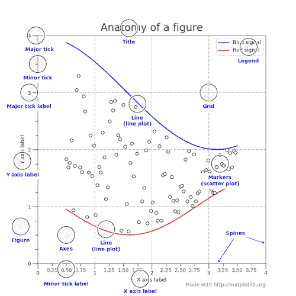
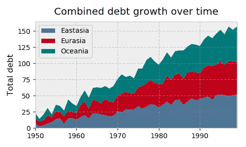
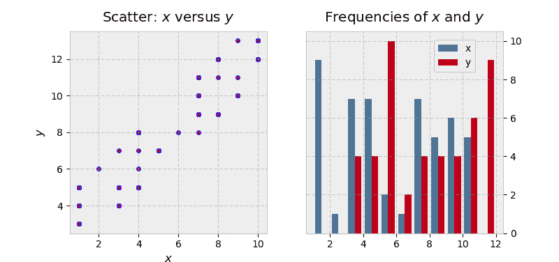
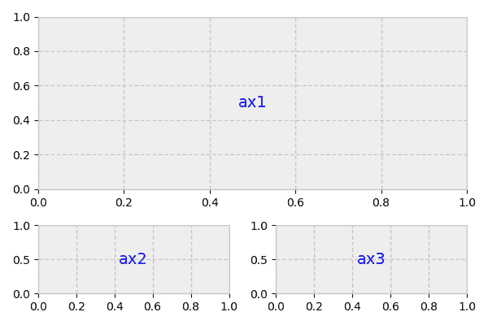
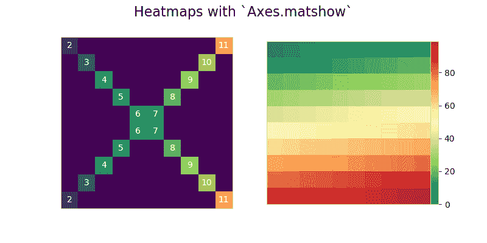
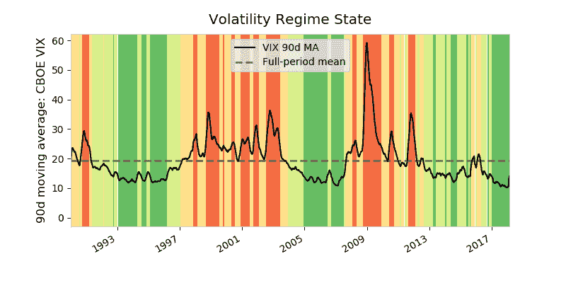
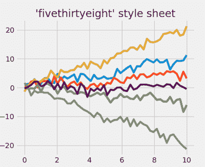

# 使用 Matplotlib 进行 Python 绘图(指南)

> 原文:# t0]https://realython . com/python-matplotlib 指南/

*立即观看**本教程有真实 Python 团队创建的相关视频课程。配合文字教程一起看，加深理解: [**Python 用 Matplotlib**](/courses/python-plotting-matplotlib/) 绘图*

 *一张图片胜过千言万语，幸运的是，使用 Python 的 **matplotlib** 库，创建一张生产质量的图形只需不到一千字的代码。

然而，matplotlib 也是一个大规模的库，通常通过反复试验才能获得看起来恰到好处的图形。在 matplotlib 中使用一行程序生成基本的绘图相当简单，但是熟练地控制库的其余 98%可能会令人望而生畏。

本文是关于 matplotlib 的初级到中级的演练，将理论与示例相结合。虽然通过实例学习非常有见地，但即使只是对图书馆的内部工作和布局有一个表面的了解也是有帮助的。

以下是我们将要介绍的内容:

*   Pylab 和 pyplot:哪个是哪个？
*   matplotlib 设计的关键概念
*   理解`plt.subplots()`
*   用 matplotlib 可视化数组
*   使用 pandas + matplotlib 组合绘图

**免费附赠:** ，你可以以此为基础制作自己的剧情和图形。

本文假设用户知道一点点 NumPy。我们将主要使用 [`numpy.random`](https://docs.scipy.org/doc/numpy/reference/routines.random.html) 模块生成“玩具”数据，从不同的[统计分布](https://realpython.com/python-statistics/)中抽取样本。

如果您还没有安装 matplotlib，请在继续之前查看[这里的](https://matplotlib.org/users/installing.html)。

## 为什么 Matplotlib 可以混淆？

学习 matplotlib 有时会是一个令人沮丧的过程。问题不在于 matplotlib 的文档缺乏:文档实际上是广泛的。但是以下问题可能会带来一些挑战:

*   这个库本身非常庞大，大约有 70，000 行代码。
*   Matplotlib 有几个不同的接口(构建图形的方式),能够与一些不同的后端交互。(后端处理图表实际呈现的过程，而不仅仅是内部结构化。)
*   虽然它很全面，但 matplotlib 自己的一些公开文档严重过时。该库仍在不断发展，网上流传的许多旧示例在现代版本中可能会减少 70%的代码行。

因此，在我们开始任何令人眼花缭乱的例子之前，掌握 matplotlib 设计的核心概念是有用的。

[*Remove ads*](/account/join/)

## *Pylab:这是什么，我应该使用它吗？*

 *让我们从一点历史开始:神经生物学家 John D. Hunter 在 2003 年左右开始开发 matplotlib，最初的灵感来自于 Mathworks 的 [MATLAB](https://realpython.com/matlab-vs-python/) 软件。2012 年，44 岁的约翰不幸英年早逝，matplotlib 现在是一个成熟的社区项目，由许多其他人开发和维护。(约翰在 2012 年 SciPy 会议上做了一个关于 matplotlib 发展的[演讲](https://www.youtube.com/watch?v=e3lTby5RI54)，值得一看。)

MATLAB 的一个相关特征是它的全局风格。导入的 Python 概念在 MATLAB 中并没有被大量使用，MATLAB 的大多数[函数](https://www.mathworks.com/help/matlab/functionlist.html)在顶层对用户来说都是现成的。

知道 matplotlib 源于 MATLAB 有助于解释 pylab 存在的原因。pylab 是 matplotlib 库中的一个模块，用于模仿 MATLAB 的全局风格。它的存在只是为了将 NumPy 和 matplotlib 中的一些函数和类引入到[名称空间](https://docs.python.org/3/tutorial/classes.html#python-scopes-and-namespaces)中，为以前不习惯使用`import`语句的 MATLAB 用户提供一个简单的过渡。

前 MATLAB 皈依者(他们都是好人，我保证！)喜欢这个功能，因为有了`from pylab import *`，他们可以简单地直接调用`plot()`或`array()`，就像在 MATLAB 中一样。

这里的问题对一些 Python 用户来说可能是显而易见的:在会话或脚本中使用`from pylab import *`通常是不好的做法。Matplotlib 现在在其自己的教程中直接反对这样做:

> “[pylab]由于历史原因仍然存在，但强烈建议不要使用。它用会隐藏 Python 内置函数的函数污染名称空间，并可能导致难以跟踪的错误。要在没有导入的情况下集成 IPython，最好使用`%matplotlib`魔法。来源

在内部，有大量潜在冲突的进口被掩盖在短皮拉布[来源](https://github.com/matplotlib/matplotlib/blob/master/lib/matplotlib/pylab.py)。事实上，使用`ipython --pylab`(从终端/命令行)或`%pylab`(从 IPython/Jupyter tools)只是简单地调用幕后的`from pylab import *`。

底线是 **matplotlib 已经放弃了这个方便的模块，现在明确建议不要使用 pylab，**使事情更符合 Python 的一个关键概念:显式比隐式好。

如果不需要 pylab，我们通常只需要一个规范的导入就可以了:

>>>

```
>>> import matplotlib.pyplot as plt
```

现在，让我们也导入 NumPy，稍后我们将使用它来生成数据，并调用`np.random.seed()`来使用(伪)随机数据生成可重复的示例:

>>>

```
>>> import numpy as np
>>> np.random.seed(444)
```

## Matplotlib 对象层次结构

matplotlib 的一个重要概念是它的对象层次结构。

如果你读过任何介绍 matplotlib 的教程，你可能会调用类似于`plt.plot([1, 2, 3])`的东西。这个一行程序隐藏了一个事实，即绘图实际上是嵌套 Python 对象的层次结构。这里的“层次结构”是指每个图下面都有一个 matplotlib 对象的树状结构。

一个`Figure`对象是 matplotlib 图形的最外层容器，它可以包含多个`Axes`对象。混淆的一个来源是名称:一个`Axes`实际上被翻译成我们所认为的一个单独的情节或图形(而不是我们可能预期的“轴”的复数)。

您可以将`Figure`对象想象成一个类似盒子的容器，其中包含一个或多个`Axes`(实际的绘图)。在层次结构中的`Axes`下面是较小的对象，如刻度线、单独的线条、图例和文本框。几乎图表的每个“元素”都有自己可操作的 Python 对象，一直到刻度和标签:

[](https://files.realpython.com/media/fig_map.bc8c7cabd823.png)

下面是这种层次结构的一个实例。如果您不完全熟悉这种符号，也不要担心，我们将在后面介绍:

>>>

```
>>> fig, _ = plt.subplots()
>>> type(fig)
<class 'matplotlib.figure.Figure'>
```

上面，我们用`plt.subplots()`创建了两个[变量](https://realpython.com/python-variables/)。第一个是顶级的`Figure`对象。第二个是“一次性”变量，我们现在还不需要，用下划线表示。使用属性符号，很容易遍历图形层次结构，并查看第一个轴对象的 y 轴的第一个刻度:

>>>

```
>>> one_tick = fig.axes[0].yaxis.get_major_ticks()[0]
>>> type(one_tick)
<class 'matplotlib.axis.YTick'>
```

上面，`fig`(一个`Figure`类实例)有多个`Axes`(一个列表，我们取第一个元素)。每个`Axes`都有一个`yaxis`和`xaxis`，每个都有一个“主要分笔成交点”的集合，我们抓取第一个。

Matplotlib 将此呈现为图形剖析，而不是明确的层次结构:

[](https://files.realpython.com/media/anatomy.7d033ebbfbc8.png)

(在真正的 matplotlib 风格中，上图是在 matplotlib 文档[这里](https://matplotlib.org/examples/showcase/anatomy.html)中创建的。)

[*Remove ads*](/account/join/)

## *有状态与无状态方法*

 *好吧，在我们开始这个闪亮的可视化之前，我们还需要一个理论:有状态(基于状态，状态机)和无状态([面向对象](https://realpython.com/python3-object-oriented-programming/)，OO)接口之间的区别。

上面我们用`import matplotlib.pyplot as plt`从 matplotlib 导入 pyplot 模块，命名为`plt`。

pyplot 中的几乎所有函数，比如`plt.plot()`，要么隐式地引用一个现有的当前图形和当前轴，要么在不存在的情况下重新创建它们。隐藏在 matplotlib 文档中的是这个有用的片段:

> [使用 pyplot]，简单的函数用于添加绘图元素(线条、图像、文本等)。)**到当前图**中的当前轴[着重号后加]

铁杆前 MATLAB 用户可能会选择这样的措辞:“`plt.plot()`是一个状态机接口，它隐式地跟踪当前数字！”在英语中，这意味着:

*   有状态接口使用`plt.plot()`和其他顶级 pyplot 函数进行调用。在给定的时间里，你只能操纵一个图形或轴，你不需要明确地引用它。
*   直接修改底层对象是面向对象的方法。我们通常通过调用一个`Axes`对象的方法来做到这一点，这个对象代表一个绘图本身。

这个过程的流程在较高的层次上看起来是这样的:

[](https://files.realpython.com/media/flow.a210eb81a42b.jpg)

将这些联系在一起，pyplot 中的大多数函数也作为`matplotlib.axes.Axes`类的方法存在。

从引擎盖下偷看更容易看到这一点。`plt.plot()`可以归结为五行左右的代码:

>>>

```
# matplotlib/pyplot.py
>>> def plot(*args, **kwargs):
...     """An abridged version of plt.plot()."""
...     ax = plt.gca()
...     return ax.plot(*args, **kwargs)

>>> def gca(**kwargs):
...     """Get the current Axes of the current Figure."""
...     return plt.gcf().gca(**kwargs)
```

调用`plt.plot()`只是获取当前图形的当前轴，然后调用其`plot()`方法的一种便捷方式。这就是断言有状态接口总是“隐式跟踪”它想要引用的图的含义。

pyplot 是一批[函数](https://matplotlib.org/api/pyplot_summary.html#the-pyplot-api)的所在地，这些函数实际上只是 matplotlib 面向对象接口的包装器。例如，`plt.title()`在 OO 方法中有相应的 setter 和 getter 方法，`ax.set_title()`和`ax.get_title()`。(getters 和 setters 的使用在诸如 [Java](https://realpython.com/oop-in-python-vs-java/) 之类的语言中更受欢迎，但这是 matplotlib 面向对象方法的一个关键特性。)

调用`plt.title()`被翻译成这一行:`gca().set_title(s, *args, **kwargs)`。这就是它的作用:

*   `gca()`抓取当前轴并返回。
*   `set_title()`是一个 setter 方法，为 Axes 对象设置标题。这里的“方便”是我们不需要用`plt.title()`显式指定任何 Axes 对象。

同样，如果你花点时间看看顶级函数的源代码，比如[`plt.grid()`](https://github.com/matplotlib/matplotlib/blob/master/lib/matplotlib/pyplot.py#L3708)[`plt.legend()`](https://github.com/matplotlib/matplotlib/blob/master/lib/matplotlib/pyplot.py#L3714)和 [`plt.ylabels()`](https://github.com/matplotlib/matplotlib/blob/master/lib/matplotlib/pyplot.py#L1521) ，你会注意到它们都遵循相同的结构，用`gca()`委托给当前轴，然后调用当前轴的一些方法。(这是底层的面向对象方法！)

## 理解`plt.subplots()`符号

好了，理论到此为止。现在，我们准备好把所有的东西联系在一起，并做一些绘图。从现在开始，我们将主要依赖无状态(面向对象)方法，这种方法更加可定制，并且随着图形变得更加复杂而变得方便。

在面向对象方法下，用单轴创建图形的规定方法是(不太直观地)用`plt.subplots()`。这确实是 OO 方法唯一一次使用`pyplot`来创建图形和轴:

>>>

```
>>> fig, ax = plt.subplots()
```

上面，我们利用 iterable 解包为`plt.subplots()`的两个结果中的每一个分配了一个单独的变量。注意，这里我们没有将参数传递给`subplots()`。默认呼叫是`subplots(nrows=1, ncols=1)`。因此，`ax`是一个单独的`AxesSubplot`对象:

>>>

```
>>> type(ax)
<class 'matplotlib.axes._subplots.AxesSubplot'>
```

我们可以像调用 pyplots 函数一样调用它的实例方法来操纵绘图。让我们用三个时间序列的堆积面积图来说明:

>>>

```
>>> rng = np.arange(50)
>>> rnd = np.random.randint(0, 10, size=(3, rng.size))
>>> yrs = 1950 + rng

>>> fig, ax = plt.subplots(figsize=(5, 3))
>>> ax.stackplot(yrs, rng + rnd, labels=['Eastasia', 'Eurasia', 'Oceania'])
>>> ax.set_title('Combined debt growth over time')
>>> ax.legend(loc='upper left')
>>> ax.set_ylabel('Total debt')
>>> ax.set_xlim(xmin=yrs[0], xmax=yrs[-1])
>>> fig.tight_layout()
```

上面是怎么回事:

*   在创建了三个随机时间序列之后，我们定义了一个包含一个轴的图形(`fig`)(一个图，`ax`)。

*   我们直接调用`ax`的方法来创建堆积面积图，并添加图例、标题和 y 轴标签。在面向对象的方法下，很明显所有这些都是`ax`的属性。

*   `tight_layout()`整体应用于图形对象以清除空白填充。

[](https://files.realpython.com/media/debt.a738254921bc.png)

让我们看一个在一个图中有多个子图(轴)的例子，绘制两个从[离散均匀分布](https://en.wikipedia.org/wiki/Discrete_uniform_distribution)中提取的相关数组:

>>>

```
>>> x = np.random.randint(low=1, high=11, size=50)
>>> y = x + np.random.randint(1, 5, size=x.size)
>>> data = np.column_stack((x, y))

>>> fig, (ax1, ax2) = plt.subplots(nrows=1, ncols=2,
...                                figsize=(8, 4))

>>> ax1.scatter(x=x, y=y, marker='o', c='r', edgecolor='b')
>>> ax1.set_title('Scatter: $x$ versus $y$')
>>> ax1.set_xlabel('$x$')
>>> ax1.set_ylabel('$y$')

>>> ax2.hist(data, bins=np.arange(data.min(), data.max()),
...          label=('x', 'y'))
>>> ax2.legend(loc=(0.65, 0.8))
>>> ax2.set_title('Frequencies of $x$ and $y$')
>>> ax2.yaxis.tick_right()
```

[](https://files.realpython.com/media/twosubplot.e76bf825d7a2.png)

在这个例子中还有一点更多的内容:

*   因为我们正在创建一个“1x2”图形，`plt.subplots(1, 2)`的返回结果现在是一个图形对象和一个轴对象的 NumPy 数组。(你可以用`fig, axs = plt.subplots(1, 2)`检查这个，看一看`axs`。)

*   我们分别处理`ax1`和`ax2`，用有状态的方法很难做到这一点。最后一行很好地展示了对象的层次结构，我们正在修改属于第二个轴的`yaxis`，将它的记号和标签放在右边。

*   美元符号内的文本利用 [TeX 标记](https://en.wikipedia.org/wiki/TeX)将变量以斜体显示。

请记住，多个轴可以包含在或“属于”一个给定的图形中。在上面的例子中，`fig.axes`获得了所有轴对象的列表:

>>>

```
>>> (fig.axes[0] is ax1, fig.axes[1] is ax2)
(True, True)
```

(`fig.axes`是小写，不是大写。不可否认，术语有点混乱。)

更进一步，我们可以创建一个图形，包含一个由`Axes`对象组成的 2x2 网格:

>>>

```
>>> fig, ax = plt.subplots(nrows=2, ncols=2, figsize=(7, 7))
```

现在，什么是`ax`？它不再是单个的`Axes`，而是它们的二维 NumPy 数组:

>>>

```
>>> type(ax)
numpy.ndarray

>>> ax
array([[<matplotlib.axes._subplots.AxesSubplot object at 0x1106daf98>,
 <matplotlib.axes._subplots.AxesSubplot object at 0x113045c88>],
 [<matplotlib.axes._subplots.AxesSubplot object at 0x11d573cf8>,
 <matplotlib.axes._subplots.AxesSubplot object at 0x1130117f0>]],
 dtype=object)

>>> ax.shape
(2, 2)
```

docstring 重申了这一点:

> "`ax`可以是一个单独的`matplotlib.axes.Axes`对象，如果创建了一个以上的子剧情，也可以是一个`Axes`对象的数组。"

我们现在需要对每个`Axes`调用绘图方法(但不是 NumPy 数组，在本例中它只是一个容器)。解决这一问题的常见方法是在将数组展平为一维后使用可迭代解包:

>>>

```
>>> fig, ax = plt.subplots(nrows=2, ncols=2, figsize=(7, 7))
>>> ax1, ax2, ax3, ax4 = ax.flatten()  # flatten a 2d NumPy array to 1d
```

我们也可以用`((ax1, ax2), (ax3, ax4)) = ax`来做这件事，但是第一种方法更灵活。

为了说明一些更高级的子情节特性，让我们使用 Python 标准库中的`io`、`tarfile`和`urllib`从压缩的 tar 档案中提取一些宏观经济加州住房数据。

>>>

```
>>> from io import BytesIO
>>> import tarfile
>>> from urllib.request import urlopen

>>> url = 'http://www.dcc.fc.up.pt/~ltorgo/Regression/cal_housing.tgz'
>>> b = BytesIO(urlopen(url).read())
>>> fpath = 'CaliforniaHousing/cal_housing.data'

>>> with tarfile.open(mode='r', fileobj=b) as archive:
...     housing = np.loadtxt(archive.extractfile(fpath), delimiter=',')
```

下面的“响应”变量`y`，用统计学术语来说，是一个地区的平均房价。`pop`和`age`分别是该地区的人口和平均房龄:

>>>

```
>>> y = housing[:, -1]
>>> pop, age = housing[:, [4, 7]].T
```

接下来，让我们定义一个“辅助函数”，它将一个文本框放在一个图中，并充当“图内标题”:

>>>

```
>>> def add_titlebox(ax, text):
...     ax.text(.55, .8, text,
...         horizontalalignment='center',
...         transform=ax.transAxes,
...         bbox=dict(facecolor='white', alpha=0.6),
...         fontsize=12.5)
...     return ax
```

我们准备好做一些策划了。Matplotlib 的 [`gridspec`](https://matplotlib.org/api/gridspec_api.html) 模块允许更多的支线剧情定制。pyplot 的`subplot2grid()`与这个模块很好地交互。假设我们想要创建一个这样的布局:

[](https://files.realpython.com/media/empty_gridspec.d4fc1c219152.png)

上面，我们实际拥有的是一个 3x2 的网格。`ax1`的高度和宽度是`ax2` / `ax3`的两倍，意味着它占据了两列两行。

[](https://files.realpython.com/media/empty_gridspec_annot.782349dc90a1.png)

`subplot2grid()`的第二个参数是轴在网格中的(行，列)位置:

>>>

```
>>> gridsize = (3, 2)
>>> fig = plt.figure(figsize=(12, 8))
>>> ax1 = plt.subplot2grid(gridsize, (0, 0), colspan=2, rowspan=2)
>>> ax2 = plt.subplot2grid(gridsize, (2, 0))
>>> ax3 = plt.subplot2grid(gridsize, (2, 1))
```

现在，我们可以正常进行，分别修改每个轴:

>>>

```
>>> ax1.set_title('Home value as a function of home age & area population',
...               fontsize=14)
>>> sctr = ax1.scatter(x=age, y=pop, c=y, cmap='RdYlGn')
>>> plt.colorbar(sctr, ax=ax1, format='$%d')
>>> ax1.set_yscale('log')
>>> ax2.hist(age, bins='auto')
>>> ax3.hist(pop, bins='auto', log=True)

>>> add_titlebox(ax2, 'Histogram: home age')
>>> add_titlebox(ax3, 'Histogram: area population (log scl.)')
```

[](https://files.realpython.com/media/gridspec_ex.9bce5a0726e9.png)

在上面，`colorbar()`(不同于之前的 ColorMap)直接在图形上调用，而不是在轴上调用。它的第一个参数使用 Matplotlib 的`.scatter()`，并且是`ax1.scatter()`的结果，后者的功能是将 y 值映射到色彩映射表。

从视觉上看，当我们沿着 y 轴上下移动时，颜色(y 变量)没有太大的差异，这表明房屋年龄似乎是房屋价值的一个更强的决定因素。

[*Remove ads*](/account/join/)

## *幕后的“人物”*

 *每次您调用`plt.subplots()`或不常用的`plt.figure()`(它创建一个图形，没有轴)，您都在创建一个新的图形对象，matplotlib 悄悄地将它保存在内存中。前面，我们提到了电流图和电流轴的概念。默认情况下，这些是最近创建的图形和轴，我们可以用内置函数`id()`来显示对象在内存中的地址:

>>>

```
>>> fig1, ax1 = plt.subplots()

>>> id(fig1)
4525567840

>>> id(plt.gcf())  # `fig1` is the current figure.
4525567840

>>> fig2, ax2 = plt.subplots()
>>> id(fig2) == id(plt.gcf())  # The current figure has changed to `fig2`.
True
```

(我们也可以在这里使用内置的 [`is`操作符](https://realpython.com/python-is-identity-vs-equality/)。)

在上述例程之后，当前图形是最近创建的图形`fig2`。然而，这两个数字仍然存在于内存中，每个数字都有一个相应的 ID 号(1-indexed，在 MATLAB 风格中):

>>>

```
>>> plt.get_fignums()
[1, 2]
```

获得所有数字本身的一个有用方法是将`plt.figure()`映射到这些整数中的每一个:

>>>

```
>>> def get_all_figures():
...    return [plt.figure(i) for i in plt.get_fignums()]

>>> get_all_figures()
[<matplotlib.figure.Figure at 0x10dbeaf60>,
 <matplotlib.figure.Figure at 0x1234cb6d8>]
```

如果运行一个创建一组图形的脚本，请认识到这一点。为了避免出现`MemoryError`，您需要在使用后显式地关闭它们。单独，`plt.close()`关闭当前图形，`plt.close(num)`关闭图形编号`num`，`plt.close('all')`关闭所有图形窗口:

>>>

```
>>> plt.close('all')
>>> get_all_figures()
[]
```

## 一阵变色:`imshow()`和`matshow()`

虽然`ax.plot()`是坐标轴上最常见的绘图方法之一，但还有许多其他方法。(上面我们用了`ax.stackplot()`。你可以在这里找到[的完整名单](https://matplotlib.org/api/axes_api.html?highlight=axes%20class#plotting)。)

大量使用的方法是`imshow()`和`matshow()`，后者是前者的包装。当原始数字数组可以被可视化为彩色网格时，这些都是有用的。

首先，让我们用一些奇特的数字索引创建两个不同的网格:

>>>

```
>>> x = np.diag(np.arange(2, 12))[::-1]
>>> x[np.diag_indices_from(x[::-1])] = np.arange(2, 12)
>>> x2 = np.arange(x.size).reshape(x.shape)
```

接下来，我们可以将这些映射到它们的图像表示。在这个具体的例子中，我们通过使用字典理解并将结果传递给`ax.tick_params()`来“关闭”所有轴标签和刻度:

>>>

```
>>> sides = ('left', 'right', 'top', 'bottom')
>>> nolabels = {s: False for s in sides}
>>> nolabels.update({'label%s' % s: False for s in sides})
>>> print(nolabels)
{'left': False, 'right': False, 'top': False, 'bottom': False, 'labelleft': False,
 'labelright': False, 'labeltop': False, 'labelbottom': False}
```

然后，我们可以使用[上下文管理器](https://docs.python.org/3/reference/datamodel.html#context-managers)来禁用网格，并在每个轴上调用`matshow()`。最后，我们需要将 colorbar 放入`fig`中的一个新轴中。为此，我们可以使用 matplotlib 内部的一个深奥的函数:

>>>

```
>>> from mpl_toolkits.axes_grid1.axes_divider import make_axes_locatable

>>> with plt.rc_context(rc={'axes.grid': False}):
...     fig, (ax1, ax2) = plt.subplots(1, 2, figsize=(8, 4))
...     ax1.matshow(x)
...     img2 = ax2.matshow(x2, cmap='RdYlGn_r')
...     for ax in (ax1, ax2):
...         ax.tick_params(axis='both', which='both', **nolabels)
...     for i, j in zip(*x.nonzero()):
...         ax1.text(j, i, x[i, j], color='white', ha='center', va='center')
...
...     divider = make_axes_locatable(ax2)
...     cax = divider.append_axes("right", size='5%', pad=0)
...     plt.colorbar(img2, cax=cax, ax=[ax1, ax2])
...     fig.suptitle('Heatmaps with `Axes.matshow`', fontsize=16)
```

[](https://files.realpython.com/media/heatmaps.4b2fb807d2da.png)[*Remove ads*](/account/join/)

## *熊猫图*

 *熊猫图书馆变得流行，不仅仅是因为它支持强大的数据分析，还因为它方便的预设绘图方法。有趣的是，[熊猫绘图方法](https://realpython.com/pandas-plot-python/)实际上只是现有 matplotlib 调用的方便包装器。

也就是说，pandas 系列的`plot()`方法和[数据帧](https://realpython.com/pandas-dataframe/)是`plt.plot()`的包装器。例如，提供的一个便利是，如果 DataFrame 的索引由日期组成，那么 pandas 会在内部调用`gcf().autofmt_xdate()`来获取当前的数字，并很好地自动格式化 x 轴。

反过来，记住`plt.plot()`(基于状态的方法)隐含地知道当前图形和当前轴，所以 pandas 通过扩展遵循基于状态的方法。

我们可以通过一点内省来证明这个函数调用“链”。首先，让我们构建一个普通的熊猫系列，假设我们正在开始一个新的解释器会话:

>>>

```
>>> import pandas as pd

>>> s = pd.Series(np.arange(5), index=list('abcde'))
>>> ax = s.plot()

>>> type(ax)
<matplotlib.axes._subplots.AxesSubplot at 0x121083eb8>

>>> id(plt.gca()) == id(ax)
True
```

当您将 pandas 绘图方法与传统的 matplotlib 调用混合使用时，这种内部架构有助于了解，这是在下面绘制一个广受关注的金融时间序列的移动平均值时完成的。`ma`是一个 pandas 系列，我们可以为其调用`ma.plot()`(pandas 方法)，然后通过检索由该调用(`plt.gca()`)创建的轴进行定制，以供 matplotlib 引用:

>>>

```
>>> import pandas as pd
>>> import matplotlib.transforms as mtransforms

>>> url = 'https://fred.stlouisfed.org/graph/fredgraph.csv?id=VIXCLS'
>>> vix = pd.read_csv(url, index_col=0, parse_dates=True, na_values='.',
...                   infer_datetime_format=True,
...                   squeeze=True).dropna()
>>> ma = vix.rolling('90d').mean()
>>> state = pd.cut(ma, bins=[-np.inf, 14, 18, 24, np.inf],
...                labels=range(4))

>>> cmap = plt.get_cmap('RdYlGn_r')
>>> ma.plot(color='black', linewidth=1.5, marker='', figsize=(8, 4),
...         label='VIX 90d MA')
>>> ax = plt.gca()  # Get the current Axes that ma.plot() references
>>> ax.set_xlabel('')
>>> ax.set_ylabel('90d moving average: CBOE VIX')
>>> ax.set_title('Volatility Regime State')
>>> ax.grid(False)
>>> ax.legend(loc='upper center')
>>> ax.set_xlim(xmin=ma.index[0], xmax=ma.index[-1])

>>> trans = mtransforms.blended_transform_factory(ax.transData, ax.transAxes)
>>> for i, color in enumerate(cmap([0.2, 0.4, 0.6, 0.8])):
...     ax.fill_between(ma.index, 0, 1, where=state==i,
...                     facecolor=color, transform=trans)
>>> ax.axhline(vix.mean(), linestyle='dashed', color='xkcd:dark grey',
...            alpha=0.6, label='Full-period mean', marker='')
```

[](https://files.realpython.com/media/vix.9265fdca0c18.png)

上面发生了很多事情:

*   `ma`是 VIX 指数的 90 天移动平均线，衡量市场对近期股票波动的预期。`state`是移动平均线进入不同政权状态的宁滨。高 VIX 被视为市场恐惧程度加剧的信号。

*   是一个 ColorMap——一个 matplotlib 对象，本质上是浮点到 RGBA 颜色的映射。任何色图都可以通过添加`'_r'`来反转，所以`'RdYlGn_r'`就是反转的红-黄-绿色图。Matplotlib 在它的文档中维护了一个方便的[视觉参考指南](https://matplotlib.org/examples/color/colormaps_reference.html)的彩色地图。

*   我们这里唯一真正的熊猫叫声是`ma.plot()`。这在内部调用了`plt.plot()`，所以为了集成面向对象的方法，我们需要用`ax = plt.gca()`获得对当前轴的显式引用。

*   第二段代码创建对应于每个`state`库的颜色填充块。`cmap([0.2, 0.4, 0.6, 0.8])`说，“给我们一个彩色图谱中第 20、40、60 和 80 个‘百分点’的颜色的 RGBA 序列。” [`enumerate()`](https://dbader.org/blog/python-enumerate) 之所以被使用是因为我们要将每个 RGBA 颜色映射回一个州。

《熊猫》还增加了少量更高级的剧情(它们自己就可以占据整个教程)。然而，所有这些都像它们更简单的对应物一样，在内部依赖于 matplotlib 机制。

## 总结

正如上面的一些例子所示，matplotlib 可能是一个技术性的、语法密集型的库，这是不可回避的事实。创建一个生产就绪的图表有时需要半个小时的谷歌搜索和组合大杂烩的线条，以微调一个情节。

然而，理解 matplotlib 的接口如何交互是一项投资，将来会有回报的。正如 Real Python 自己的 Dan Bader 所建议的，花时间剖析代码，而不是求助于堆栈溢出的“复制意大利面”解决方案，往往是更聪明的长期解决方案。当你想把一个简单的情节变成一件艺术作品时，坚持面向对象的方法可以节省几个小时的挫败感。

## 更多资源

来自 matplotlib 文档:

*   matplotlib 的索引[示例](https://matplotlib.org/examples/index.html)
*   用法[常见问题](https://matplotlib.org/faq/usage_faq.html)
*   [教程](https://matplotlib.org/tutorials/index.html)页面，分为初级、中级和高级部分
*   一个图的生命周期，涉及面向对象和有状态方法

**免费附赠:** ，你可以以此为基础制作自己的剧情和图形。

第三方资源:

*   DataCamp 的 matplotlib [备忘单](https://s3.amazonaws.com/assets.datacamp.com/blog_assets/Python_Matplotlib_Cheat_Sheet.pdf)
*   PLOS 计算生物学:[更好形象的十个简单规则](http://journals.plos.org/ploscompbiol/article/file?id=10.1371/journal.pcbi.1003833&type=printable)
*   Wes McKinney 的用于数据分析的 [*Python 的第 9 章(绘图和可视化)，第 2 版。*T3】](http://a.co/icUQo3Z)
*   Ted Petrou 的 [*熊猫食谱*](http://a.co/9YzpuRP) 的第 11 章(Matplotlib、熊猫和 Seaborn 的可视化)
*   [SciPy 讲义](http://www.scipy-lectures.org/_downloads/ScipyLectures-simple.pdf)的第 1.4 节(Matplotlib:绘图)
*   [xkcd](https://xkcd.com/color/rgb/) 调色板
*   matplotlib [外部资源](https://matplotlib.org/resources/index.html)页面
*   [Matplotlib，Pylab，Pyplot 等:这些有什么区别，各自什么时候用？](http://queirozf.com/entries/matplotlib-pylab-pyplot-etc-what-s-the-different-between-these)来自 queirozf.com
*   熊猫文档中的[可视化](https://pandas.pydata.org/pandas-docs/stable/visualization.html)页面

其他绘图库:

*   建立在 matplotlib 之上，为高级统计图形设计的 seaborn 库，它本身就可以占据整个教程
*   Datashader ，一个专门面向大型数据集的图形库
*   matplotlib 文档中的其他第三方包列表

[*Remove ads*](/account/join/)

## *附录 A:配置和样式*

 *如果你一直遵循这个教程，很可能你屏幕上弹出的情节看起来与这里显示的风格不同。

Matplotlib 提供了两种跨不同地块统一配置样式的方法:

1.  通过定制一个 [matplotlibrc](https://matplotlib.org/users/customizing.html) 文件
2.  通过交互方式或从*改变配置参数。py* 脚本。

matplotlibrc 文件(上面的选项#1)基本上是一个文本文件，它指定了在 Python 会话之间记忆的用户自定义设置。在 Mac OS X 上，它通常位于 *~/。matplotlib/matplotlibrc* 。

**快速提示:** GitHub 是保存配置文件的好地方。我把我的[放在这里](https://github.com/bsolomon1124/config/blob/master/matplotlib/matplotlibrc)。只要确保它们不包含个人身份或私人信息，如密码或 SSH 私人密钥！

或者，您可以交互地更改您的配置参数(上面的选项 2)。当您`import matplotlib.pyplot as plt`时，您可以访问一个类似于 Python 设置字典的`rcParams`对象。所有以“rc”开头的模块对象都是与打印样式和设置进行交互的一种方式:

>>>

```
>>> [attr for attr in dir(plt) if attr.startswith('rc')]
['rc', 'rcParams', 'rcParamsDefault', 'rc_context', 'rcdefaults']
```

其中:

*   `plt.rcdefaults()`从 matplotlib 的内部默认值中恢复 rc 参数，列于`plt.rcParamsDefault`。这将恢复(覆盖)您已经在 matplotlibrc 文件中定制的任何内容。
*   `plt.rc()`用于交互设置参数。
*   `plt.rcParams`是一个(可变的)类似字典的对象，可以让你直接操作设置。如果您在 matplotlibrc 文件中有自定义设置，这些设置将反映在本词典中。

对于`plt.rc()`和`plt.rcParams`，这两种语法对于调整设置是等效的:

>>>

```
>>> plt.rc('lines', linewidth=2, color='r')  # Syntax 1

>>> plt.rcParams['lines.linewidth'] = 2  # Syntax 2
>>> plt.rcParams['lines.color'] = 'r'
```

值得注意的是，Figure 类 then [使用这些](https://github.com/matplotlib/matplotlib/blob/master/lib/matplotlib/pyplot.py#L498)中的一些作为它的默认参数。

与之相关的是，样式只是一组预定义的自定义设置。要查看可用的样式，请使用:

>>>

```
>>> plt.style.available
['seaborn-dark', 'seaborn-darkgrid', 'seaborn-ticks', 'fivethirtyeight',
 'seaborn-whitegrid', 'classic', '_classic_test', 'fast', 'seaborn-talk',
 'seaborn-dark-palette', 'seaborn-bright', 'seaborn-pastel', 'grayscale',
 'seaborn-notebook', 'ggplot', 'seaborn-colorblind', 'seaborn-muted',
 'seaborn', 'Solarize_Light2', 'seaborn-paper', 'bmh', 'seaborn-white',
 'dark_background', 'seaborn-poster', 'seaborn-deep']
```

要设置样式，请进行以下调用:

>>>

```
>>> plt.style.use('fivethirtyeight')
```

您的地块现在将呈现新的外观:

[](https://files.realpython.com/media/plot_fivethirtyeight.789763447ddc.png)

此完整示例可在[此处](https://matplotlib.org/examples/style_sheets/plot_fivethirtyeight.html)获得。

出于灵感，matplotlib 保留了一些[样式表显示](https://matplotlib.org/gallery.html#style_sheets)作为参考。

[*Remove ads*](/account/join/)

## *附录 B:互动模式*

 *在幕后，matplotlib 还与不同的后端进行交互。后端是实际呈现图表的主要部分。(例如，在流行的 Anaconda 发行版上，默认的后端是 Qt5Agg。)有些后端是交互式的，这意味着它们会动态更新，并在发生变化时“弹出”给用户。

默认情况下，交互模式是关闭的，您可以使用`plt.rcParams['interactive']`或`plt.isinteractive()`来检查其状态，并分别使用`plt.ion()`和`plt.ioff()`来打开和关闭:

>>>

```
>>> plt.rcParams['interactive']  # or: plt.isinteractive()
True
```

>>>

```
>>> plt.ioff()
>>> plt.rcParams['interactive']
False
```

在一些代码示例中，您可能会注意到在一段代码的末尾出现了`plt.show()`。顾名思义，`plt.show()`的主要目的是在关闭交互模式的情况下跑步时实际“显示”(打开)身材。换句话说:

*   如果开启了交互模式，就不需要`plt.show()`，图片会自动弹出，并在你引用时更新。
*   如果交互模式关闭，您将需要`plt.show()`来显示一个图形，需要`plt.draw()`来更新一个图形。

下面，我们确保交互模式是关闭的，这要求我们在构建情节本身之后调用`plt.show()`:

>>>

```
>>> plt.ioff()
>>> x = np.arange(-4, 5)
>>> y1 = x ** 2
>>> y2 = 10 / (x ** 2 + 1)
>>> fig, ax = plt.subplots()
>>> ax.plot(x, y1, 'rx', x, y2, 'b+', linestyle='solid')
>>> ax.fill_between(x, y1, y2, where=y2>y1, interpolate=True,
...                 color='green', alpha=0.3)
>>> lgnd = ax.legend(['y1', 'y2'], loc='upper center', shadow=True)
>>> lgnd.get_frame().set_facecolor('#ffb19a')
>>> plt.show()
```

值得注意的是，交互模式与您使用的 IDE 无关，也与您是否启用了类似于`jupyter notebook --matplotlib inline`或`%matplotlib`的内嵌绘图无关。

*立即观看**本教程有真实 Python 团队创建的相关视频课程。配合文字教程一起看，加深理解: [**Python 用 Matplotlib**](/courses/python-plotting-matplotlib/) 绘图********