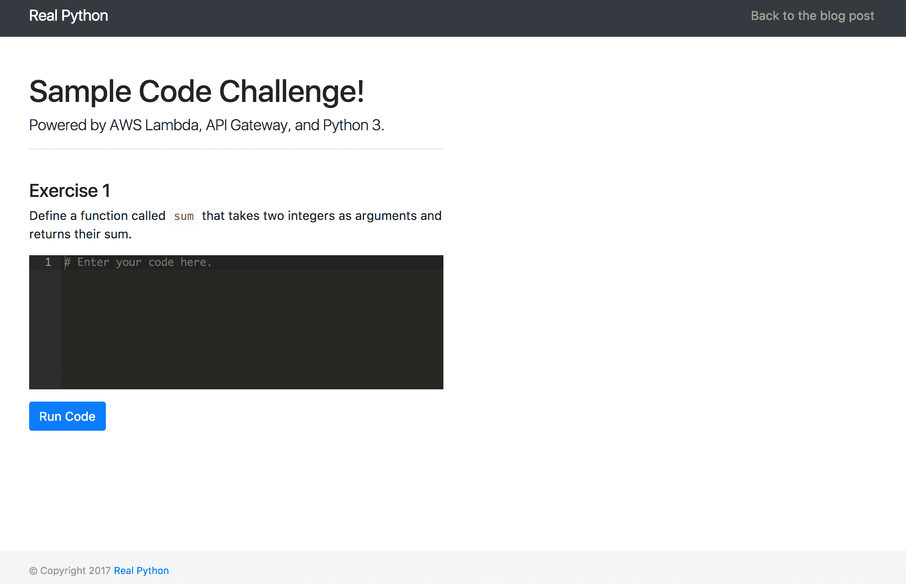
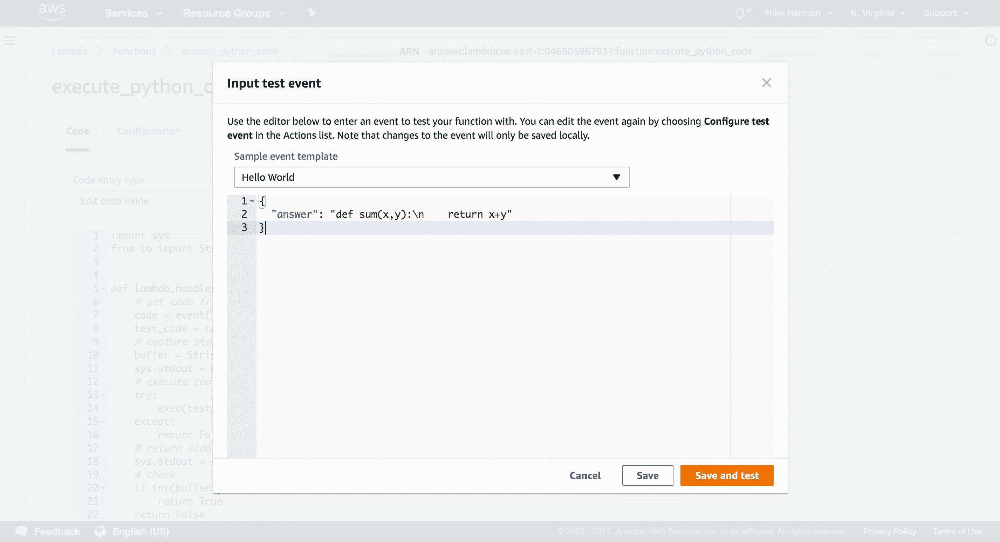
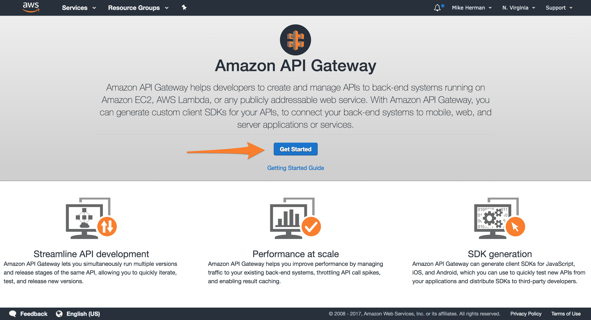
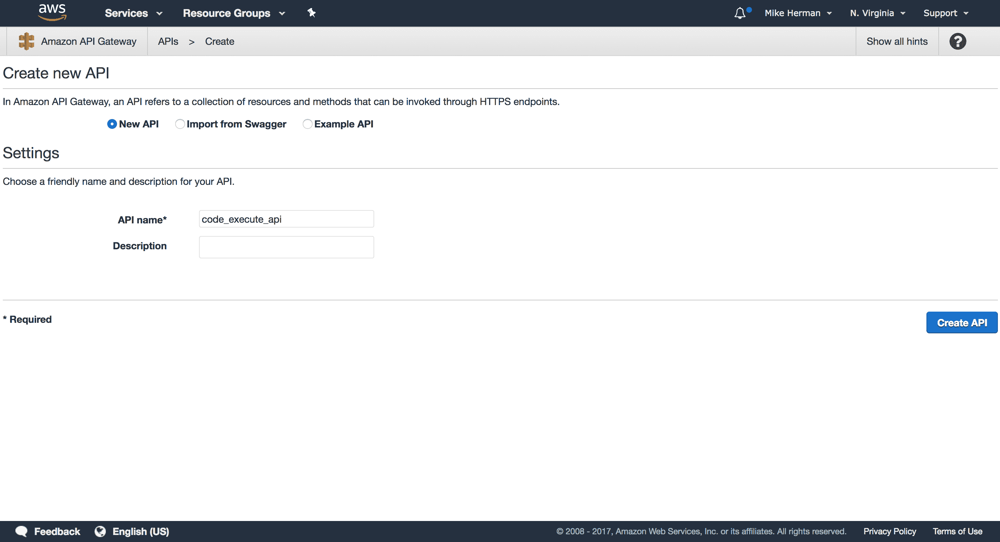
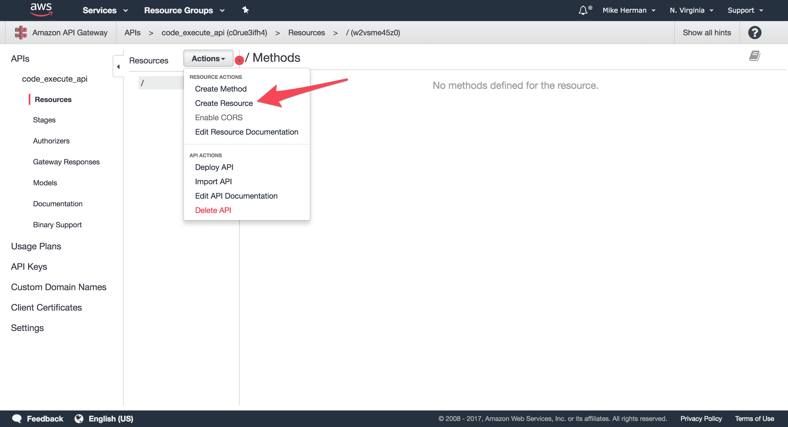
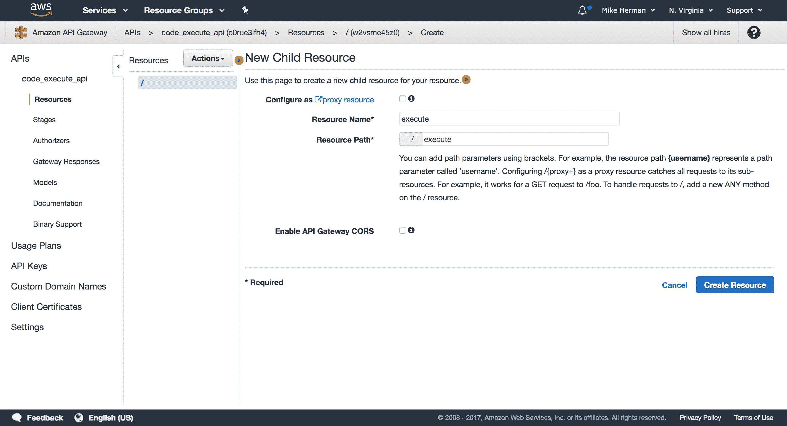
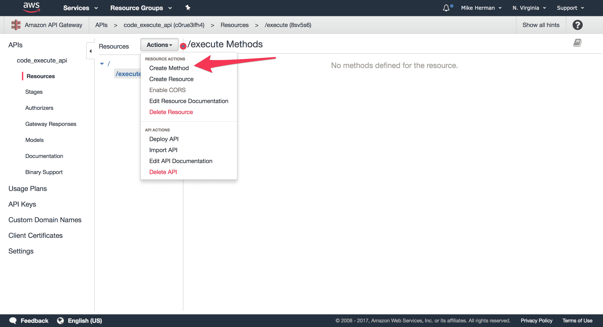
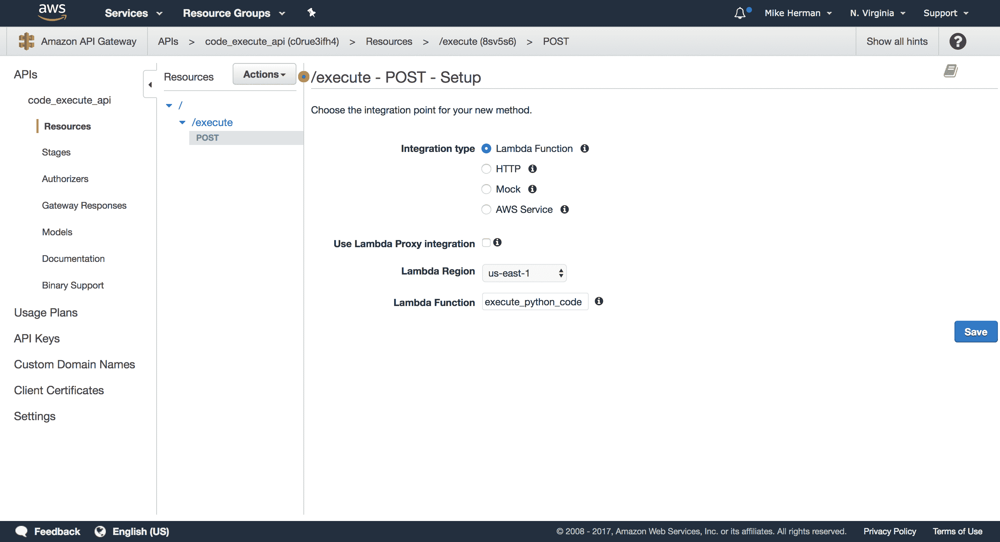
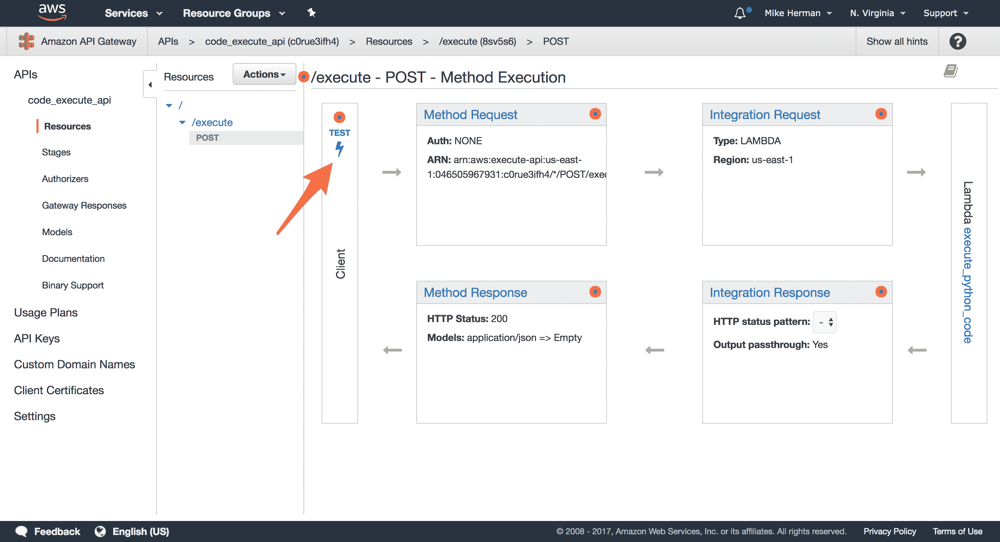

# 使用 AWS Lambda 和 API 网关进行代码评估

> 原文:[https://real python . com/code-evaluation-with-AWS-lambda-and-API-gateway/](https://realpython.com/code-evaluation-with-aws-lambda-and-api-gateway/)

**本教程详细介绍了如何使用 [AWS Lambda](https://aws.amazon.com/lambda/) 和 [API Gateway](https://aws.amazon.com/api-gateway/) 开发一个简单的代码评估 API，最终用户通过 AJAX 表单提交代码，然后由 Lambda 函数安全执行。**

点击查看您将要构建的内容的现场演示[。](https://realpython.github.io/aws-lambda-code-execute/)

> **警告:**本教程中的代码用于构建一个玩具应用程序，作为概念验证的原型，而不是用于生产。

本教程假设你已经在 [AWS](https://aws.amazon.com/) 设置了一个账户。同样，我们将使用`US East (N. Virginia)` / `us-east-1`区域。请随意使用您选择的地区。有关更多信息，请查看[地区和可用区域](http://docs.aws.amazon.com/AWSEC2/latest/UserGuide/using-regions-availability-zones.html)指南。

## 目标

本教程结束时，您将能够…

1.  解释什么是 AWS Lambda 和 API Gateway，以及为什么要使用它们
2.  讨论使用 AWS Lambda 函数的好处
3.  用 Python 创建一个 AWS Lambda 函数
4.  用 API 网关开发一个 RESTful API 端点
5.  从 API 网关触发 AWS Lambda 函数

[*Remove ads*](/account/join/)

## *什么是 AWS Lambda？*

 *Amazon Web Services (AWS) Lambda 是一种按需计算服务，允许您运行代码来响应事件或 HTTP 请求。

使用案例:

| 事件 | 行动 |
| --- | --- |
| 图像已添加到 S3 | 图像已处理 |
| 通过 API 网关的 HTTP 请求 | HTTP 响应 |
| 添加到 Cloudwatch 的日志文件 | 分析日志 |
| 预定事件 | 备份文件 |
| 预定事件 | 文件同步 |

有关更多示例，请查看来自 AWS 的如何使用 AWS Lambda 指南的[示例。](http://docs.aws.amazon.com/lambda/latest/dg/use-cases.html)

在一个看似无限可扩展的环境中，您可以运行脚本和应用程序，而不必配置或管理服务器，您只需为使用付费。这就是坚果壳中的“[无服务器](https://martinfowler.com/articles/serverless.html)”计算。出于我们的目的，AWS Lambda 是快速、安全、廉价地运行用户提供的代码的完美解决方案。

截至发稿，Lambda [支持用 JavaScript (Node.js)、Python、Java 和 C#编写的](https://aws.amazon.com/lambda/faqs/)代码。

## 项目设置

从克隆基础项目开始:

```
$ git clone https://github.com/realpython/aws-lambda-code-execute \
  --branch v1 --single-branch
$ cd aws-lambda-code-execute` 
```

然后，检查主分支的 [v1](https://github.com/realpython/aws-lambda-code-execute/releases/tag/v1) 标签:

```
$ git checkout tags/v1 -b master` 
```

在您选择的浏览器中打开*index.html*文件:

[](https://files.realpython.com/media/aws-lambda-code-execute-v1.c82ffa438204.png)

然后，在您最喜欢的代码编辑器中打开项目:

```
├── README.md
├── assets
│   ├── main.css
│   ├── main.js
│   └── vendor
│       ├── bootstrap
│       │   ├── css
│       │   │   ├── bootstrap-grid.css
│       │   │   ├── bootstrap-grid.min.css
│       │   │   ├── bootstrap-reboot.css
│       │   │   ├── bootstrap-reboot.min.css
│       │   │   ├── bootstrap.css
│       │   │   └── bootstrap.min.css
│       │   └── js
│       │       ├── bootstrap.js
│       │       └── bootstrap.min.js
│       ├── jquery
│       │   ├── jquery.js
│       │   └── jquery.min.js
│       └── popper
│           ├── popper.js
│           └── popper.min.js
└── index.html` 
```

让我们快速回顾一下代码。本质上，我们只有一个简单的 HTML 表单，样式为 [Bootstrap](http://getbootstrap.com/) 。输入字段被替换为 [Ace](https://ace.c9.io/) ，一个可嵌入的代码编辑器，它提供了基本的语法高亮显示。最后，在 *assets/main.js* 中，连接了一个 jQuery 事件处理程序，以便在提交表单时从 Ace 编辑器中获取代码，并通过 AJAX 请求将数据发送到某个地方(最终发送到 API 网关)。

## λ设置

在 [AWS 控制台](https://console.aws.amazon.com)中，导航到主 [Lambda 页面](https://console.aws.amazon.com/lambda)并点击“创建功能”:

[](https://files.realpython.com/media/aws-lambda-console.4df4b77f9748.png)[*Remove ads*](/account/join/)

### *创建功能*

 *步骤…

1.  *选择蓝图*:点击“从头开始创作”开始一个空白功能:

    [](https://files.realpython.com/media/aws-lambda-console-select-blueprint.7059a0e2040f.png)T4】

2.  *配置触发器*:我们稍后将设置 API 网关集成，因此只需单击“下一步”跳过这一部分。

3.  *配置功能*:命名功能`execute_python_code`，增加一个基本描述- `Execute user-supplied Python code`。在“运行时”下拉列表中选择“Python 3.6”。

    [](https://files.realpython.com/media/aws-lambda-console-configure-function-part1.e4bd36510cfc.png)T4】

4.  在内联代码编辑器中，用以下内容更新`lambda_handler`函数定义:

    ```
    `import sys
    from io import StringIO

    def lambda_handler(event, context):
        # Get code from payload
        code = event['answer']
        test_code = code + '\nprint(sum(1,1))'
        # Capture stdout
        buffer = StringIO()
        sys.stdout = buffer
        # Execute code
        try:
            exec(test_code)
        except:
            return False
        # Return stdout
        sys.stdout = sys.stdout
        # Check
        if int(buffer.getvalue()) == 2:
            return True
        return False` 
    ```

    这里，在 Lambda 的默认入口点`lambda_handler`中，我们解析 JSON 请求体，将提供的代码和一些[测试代码](https://realpython.com/python-testing/) - `sum(1,1)` -传递给 [exec](https://docs.python.org/3/library/functions.html#exec) 函数-该函数将字符串作为 Python 代码执行。然后，我们只需确保实际结果与预期结果相同——例如，2——并返回适当的响应。

    [](https://files.realpython.com/media/aws-lambda-console-configure-function-part2.4d6ad22133dc.png)T4】

    在“Lambda 函数处理程序和角色”下，保留默认处理程序，然后从下拉列表中选择“从模板创建新角色”。输入一个“角色名”，如`api_gateway_access`，并为“策略模板”选择“简单微服务权限”，它提供对 API 网关的访问。

    [](https://files.realpython.com/media/aws-lambda-console-configure-function-part3.96af9293e919.png)T4】

    点击“下一步”。

5.  *回顾*:快速回顾后创建函数。

### 测试

接下来，单击“Test”按钮执行新创建的 Lambda:

[](https://files.realpython.com/media/aws-lambda-console-function.170935a4d02d.png)

使用“Hello World”事件模板，将示例替换为:

```
{ "answer":  "def sum(x,y):\n    return x+y" }` 
```

[](https://files.realpython.com/media/aws-lambda-console-function-test.22454f18ebfc.png)

单击模式底部的“保存并测试”按钮运行测试。完成后，您应该会看到类似如下的内容:

[](https://files.realpython.com/media/aws-lambda-console-function-test-results.0adbfda9a0ff.png)

这样，我们可以继续配置 API 网关，从用户提交的 POST 请求中触发 Lambda

## API 网关设置

[API 网关](https://aws.amazon.com/api-gateway/)用于定义和托管 API。在我们的例子中，我们将创建一个 HTTP POST 端点，当接收到一个 HTTP 请求时触发 Lambda 函数，然后用 Lambda 函数的结果`true`或`false`进行响应。

步骤:

1.  创建 API
2.  手动测试
3.  启用 CORS
4.  部署 API
5.  通过卷曲测试

### 创建 API

1.  首先，从 [API 网关页面](https://console.aws.amazon.com/apigateway)，点击“开始”按钮创建一个新的 API:

    [](https://files.realpython.com/media/api-gateway-console.b62426547d78.png)T4】

2.  选择“新 API”，然后提供一个描述性名称，如`code_execute_api`:

    [](https://files.realpython.com/media/api-gateway-create-new-api.3e852a1f408b.png)T4】

    然后，创建 API。

3.  从“操作”下拉列表中选择“创建资源”。

    [](https://files.realpython.com/media/api-gateway-create-resource.3f0424ec3d21.png)T4】

4.  将资源命名为`execute`，然后点击“创建资源”。

    [](https://files.realpython.com/media/api-gateway-create-resource-new.5869b08ff592.png)T4】

5.  突出显示资源后，从“操作”下拉列表中选择“创建方法”。

    [](https://files.realpython.com/media/api-gateway-create-method.382b36585b45.png)T4】

6.  从方法下拉列表中选择“过帐”。单击它旁边的复选标记。

    [](https://files.realpython.com/media/api-gateway-create-method-new.ff7cba3ec2c3.png)T4】

7.  在“Setup”步骤中，选择“Lambda Function”作为“Integration type”，在下拉列表中选择“us-east-1”地区，并输入您刚刚创建的 Lambda 函数的名称。

    [](https://files.realpython.com/media/api-gateway-create-method-new-setup.2d00ed07b510.png)T4】

8.  单击“保存”，然后单击“确定”授予 API 网关运行 Lambda 函数的权限。

### 手动测试

要进行测试，请点击显示“测试”的闪电图标。

[](https://files.realpython.com/media/api-gateway-method-test.ec444a703979.png)

向下滚动到“请求体”输入，添加我们在 Lambda 函数中使用的相同 JSON 代码:

```
{ "answer":  "def sum(x,y):\n    return x+y" }` 
```

点击“测试”。您应该会看到类似如下的内容:

[](https://files.realpython.com/media/api-gateway-method-test-results.beab163d5608.png)[*Remove ads*](/account/join/)

### *启用 CORS*

 *接下来，我们需要启用 [CORS](https://developer.mozilla.org/en-US/docs/Web/HTTP/Access_control_CORS) ，这样我们就可以从另一个域发布到 API 端点。

突出显示资源后，从“操作”下拉列表中选择“启用 CORS ”:

[](https://files.realpython.com/media/api-gateway-enable-cors.f38320a550da.png)

因为我们还在测试 API，所以现在保持默认值。单击“启用 CORS 并替换现有的 CORS 标题”按钮。

### 部署 API

最后，要进行部署，请从“操作”下拉列表中选择“部署 API ”:

[](https://files.realpython.com/media/api-gateway-deploy-api.07b76f2e342a.png)

创建一个名为“v1”的新“部署阶段”:

[](https://files.realpython.com/media/api-gateway-deploy-api-stage.6ebd857cd7a9.png)

API gateway 将为 API 端点 URL 生成一个随机子域，并将阶段名添加到 URL 的末尾。现在，您应该能够向类似的 URL 发出发布请求:

```
https://c0rue3ifh4.execute-api.us-east-1.amazonaws.com/v1/execute` 
```

[](https://files.realpython.com/media/api-gateway-deploy-api-url.27ecdd2cbd58.png)

### 通过卷曲测试

```
$ curl -H "Content-Type: application/json" -X POST \
  -d '{"answer":"def sum(x,y):\n    return x+y"}' \
  https://c0rue3ifh4.execute-api.us-east-1.amazonaws.com/v1/execute` 
```

## 更新表格

现在，为了更新表单，使其将 POST 请求发送到 API 网关端点，首先将 URL 添加到 *assets/main.js* 中的`grade`函数:

```
function  grade(payload)  { $.ajax({ method:  'POST', url:  'https://c0rue3ifh4.execute-api.us-east-1.amazonaws.com/v1/execute', dataType:  'json', contentType:  'application/json', data:  JSON.stringify(payload) }) .done((res)  =>  {  console.log(res);  }) .catch((err)  =>  {  console.log(err);  }); }` 
```

然后，更新`.done`和`.catch()`函数，如下所示:

```
function  grade(payload)  { $.ajax({ method:  'POST', url:  'https://c0rue3ifh4.execute-api.us-east-1.amazonaws.com/v1/execute', dataType:  'json', contentType:  'application/json', data:  JSON.stringify(payload) }) .done((res)  =>  { let  message  =  'Incorrect. Please try again.'; if  (res)  { message  =  'Correct!'; } $('.answer').html(message); console.log(res); console.log(message); }) .catch((err)  =>  { $('.answer').html('Something went terribly wrong!'); console.log(err); }); }` 
```

现在，如果请求成功，适当的消息将通过 jQuery [html](http://api.jquery.com/html/) 方法添加到一个具有类`answer`的 html 元素中。添加这个元素，就在 HTML 表单的下面，在*index.html*内:

```
<h5 class="answer"></h5>` 
```

让我们给 *assets/main.css* 文件添加一些样式:

```
.answer  { padding-top:  30px; color:  #dc3545; font-style:  italic; }` 
```

测试一下！

[](https://files.realpython.com/media/aws-lambda-code-execute-success.42b77b864919.png) [](https://files.realpython.com/media/aws-lambda-code-execute-failure.75c0543a23c9.png)[*Remove ads*](/account/join/)

## *接下来的步骤*

 *1.  *生产*:想想一个更健壮的、生产就绪的应用程序需要什么——HTTPS、身份验证，可能还有数据存储。你将如何在 AWS 中实现这些？您可以/会使用哪些 AWS 服务？
2.  *动态*:目前 Lambda 函数只能用来测试`sum`函数。你如何使这(更)动态，以便它可以被用来测试任何代码挑战(甚至可能在*任何*语言中)？尝试向 DOM 添加一个[数据属性](https://developer.mozilla.org/en-US/docs/Learn/HTML/Howto/Use_data_attributes)，这样当用户提交一个练习时，测试代码和解决方案会随 POST 请求一起发送——即`<some-html-element data-test="\nprint(sum(1,1))" data-results"2" </some-html-element>`。
3.  *堆栈跟踪*:当答案不正确时，不只是用`true`或`false`响应，而是发送回整个堆栈跟踪，并将其添加到 DOM 中。

感谢阅读。在下面添加问题和/或评论。从[AWS-lambda-code-execute](https://github.com/realpython/aws-lambda-code-execute)repo 中抓取最终代码。干杯！****