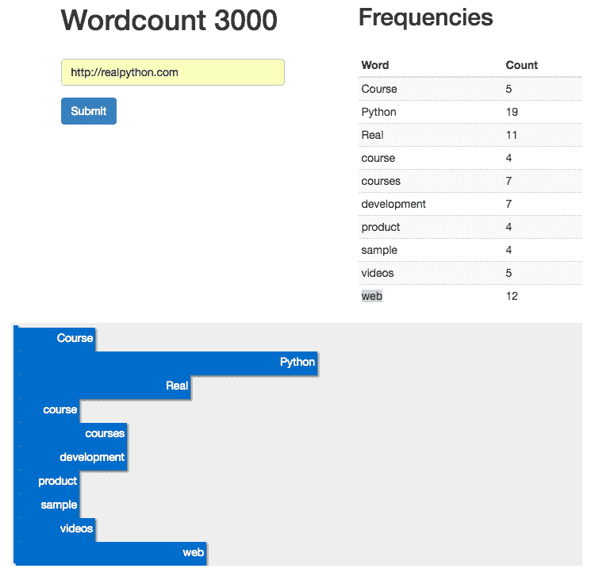

# 烧瓶示例–带有 D3 的自定义角度指示

> 原文:[https://real python . com/flask-by-example-custom-angular-directive-with-D3/](https://realpython.com/flask-by-example-custom-angular-directive-with-d3/)

欢迎回来。随着 Angular 设置以及加载微调器和我们重构的角度控制器，让我们继续到最后一部分，创建一个自定义角度指令，用 JavaScript 和 [D3](https://d3js.org/) 库显示频率分布图。

记住:这是我们正在构建的——一个 Flask 应用程序，它根据来自给定 URL 的文本计算词频对。

*更新:*

*   03/02/2020:更新代码以匹配新的响应对象。

* * *

1.  第一部分:建立一个本地开发环境，然后在 Heroku 上部署一个试运行环境和一个生产环境。
2.  第二部分:使用 SQLAlchemy 和 Alembic 建立一个 PostgreSQL 数据库来处理迁移。
3.  [第三部分](/flask-by-example-part-3-text-processing-with-requests-beautifulsoup-nltk/):添加后端逻辑，使用 requests、BeautifulSoup 和 Natural Language Toolkit (NLTK)库从网页中抓取并处理字数。
4.  第四部分:实现一个 Redis 任务队列来处理文本处理。
5.  [第五部分](/flask-by-example-integrating-flask-and-angularjs/):在前端设置 Angular，持续轮询后端，看请求是否处理完毕。
6.  第六部分:推送到 Heroku 上的临时服务器——建立 Redis 并详细说明如何在一个 Dyno 上运行两个进程(web 和 worker)。
7.  [第七部分](/flask-by-example-updating-the-ui/):更新前端，使其更加人性化。
8.  第八部分:使用 JavaScript 和 D3 创建一个自定义的角度指令来显示频率分布图。(*当前* )

<mark>需要代码吗？从[回购](https://github.com/realpython/flask-by-example/releases)中抢过来。</mark>

让我们看看我们目前拥有什么…

## 当前用户界面

在终端窗口中启动 Redis:

```py
$ redis-server
```

然后让您的流程工人进入另一个窗口:

```py
$ cd flask-by-example
$ python worker.py
17:11:39 RQ worker started, version 0.4.6
17:11:39
17:11:39 *** Listening on default...
```

最后，在第三个窗口中，启动应用程序:

```py
$ cd flask-by-example
$ python manage.py runserver
```

你应该看到你的单词计数器在工作。现在我们可以添加一个自定义的角度指令来在 D3 图表中显示结果。

[*Remove ads*](/account/join/)

## *角度指令*

 *首先将 D3 库( [v3](https://github.com/d3/d3-3.x-api-reference/blob/master/API-Reference.md) )添加到【index.html】文件*中:*

```py
<!-- scripts -->
<script src="//d3js.org/d3.v3.min.js" charset="utf-8"></script>
<script src="//code.jquery.com/jquery-2.2.1.min.js"></script>
<script src="//netdna.bootstrapcdn.com/bootstrap/3.3.6/js/bootstrap.min.js"></script>
<script src="//ajax.googleapis.com/ajax/libs/angularjs/1.4.5/angular.min.js"></script>
<script src="{{ url_for('static', filename='main.js') }}"></script>
```

现在让我们建立一个新的自定义指令。

角度指令是 DOM 元素上的标记，它允许我们插入带有特定事件和属性的 HTML 部分。让我们通过在 *main.js* 中的控制器下方添加以下代码来构建我们指令的第一部分:

```py
.directive('wordCountChart',  ['$parse',  function  ($parse)  { return  { restrict:  'E', replace:  true, template:  '<div id="chart"></div>', link:  function  (scope)  {} }; }]);
```

创建一个只限于 HTML 元素的指令。`replace: true`简单地用`template`中的 HTML 替换 HTML 指令。`link`函数让我们可以访问控制器中定义的范围内的变量。

接下来，添加一个`watch`函数来“观察”变量的任何变化，并做出适当的响应。将它添加到`link`函数中，如下所示:

```py
link:  function  (scope)  { scope.$watch('wordcounts',  function()  { // add code here },  true); }
```

最后，将结束分隔符正下方的指令添加到`<div class="row">`:

```py
<br>
<word-count-chart data="wordcounts"></word-count-chart>
```

随着指令的建立，让我们把注意力转向 D3 库…

## D3 条形图

D3 是一个强大的库，它利用 HTML、CSS 和 SVG 在 DOM 和 JavaScript 上显示数据，使之具有交互性。我们将使用它来创建一个基本的条形图。

### 第一步:功能逻辑

将以下内容添加到角度指令内的`watch`功能中:

```py
scope.$watch('wordcounts',  function()  { var  data  =  scope.wordcounts; for  (var  word  in  data)  { d3.select('#chart') .append('div') .selectAll('div') .data(word[0]) .enter() .append('div'); } },  true);
```

现在，每当`scope.wordcounts`改变时，这个函数就会被触发，从而更新 DOM。因为 AJAX 请求返回了一个对象，所以我们遍历它，将特定的数据添加到图表中。本质上，每个单词都通过一个[数据连接](https://bost.ocks.org/mike/join/)附加到一个新的`div`上。

尝试运行代码。

会发生什么？什么都没出现，对吧？提交新网站后，在 Chrome 的开发者工具中查看 DOM。您应该会看到许多嵌套的`divs`。我们只需要添加样式…

[*Remove ads*](/account/join/)

### *步骤 2:设计条形图的样式*

 *从一些简单的 CSS 开始:

```py
#chart  { overflow-y:  scroll; } #chart  { background:  #eee; padding:  3px; } #chart  div  { width:  0; transition:  all  1s  ease-out; -moz-transition:  all  1s  ease-out; -webkit-transition:  all  1s  ease-out; } #chart  div  { height:  30px; font:  15px; background-color:  #006dcc; text-align:  right; padding:  3px; color:  white; box-shadow:  2px  2px  2px  gray; }
```

确保在 HTML 页面的顶部，在引导样式表之后包含以下内容:

```py
<link rel="stylesheet" type="text/css" href="../static/main.css">
```

在我们的浏览器中启动应用程序。现在发生了什么？

当你搜索一个网站时，你现在应该会看到一个灰色区域，在左边有一些细的蓝色条。因此，您可以看到，我们为获得的每个数据元素生成了一个条形，总共 10 个。然而，我们需要修改我们的 D3 代码，以便增加每个条形的宽度，使它们可读。

### 第三步:让条形图更具互动性

我们可以将它链接到我们现有的代码上，并使用 D3 [风格的](https://github.com/d3/d3-3.x-api-reference/blob/master/Selections.md#style)函数:

```py
scope.$watch('wordcounts',  function()  { var  data  =  scope.wordcounts; for  (var  word  in  data)  { var  key  =  data[word][0]; var  value  =  data[word][1]; d3.select('#chart') .append('div') .selectAll('div') .data(word) .enter() .append('div') .style('width',  function()  { return  (value  *  3)  +  'px'; }) .text(function(d){ return  key; }); } },  true);
```

现在，我们根据一个单词在网页上出现的频率来动态创建一个宽度:

```py
.style('width',  function()  { return  (value  *  3)  +  'px'; }) .text(function(d){ return  key; });
```

样式的计算方法是返回与每个单词相关联的值，将该数字乘以 3，然后将其转换为像素。我们还可以通过插入单词的字符串值以及它在页面上出现的频率来为每个 bar 元素添加文本。

试试这个。您应该会看到类似这样的内容:

[](https://files.realpython.com/media/d3-chart.77ce16ad231f.png)

但是还缺少一样东西。当你搜索一个新网站时会发生什么？试试看。新图表附加在前一个图表的下面。我们需要在创建新的图表 div 之前清空它。

### 第四步:为下一次 URL 搜索做准备

更新指令中的`link`函数:

```py
link:  function  (scope)  { scope.$watch('wordcounts',  function()  { d3.select('#chart').selectAll('*').remove(); var  data  =  scope.wordcounts; for  (var  word  in  data)  { var  key  =  data[word][0]; var  value  =  data[word][1]; d3.select('#chart') .append('div') .selectAll('div') .data(word) .enter() .append('div') .style('width',  function()  { return  (value  *  3)  +  'px'; }) .text(function(d){ return  key; }); } },  true); }
```

每次触发`$scope.watch`函数时，`d3.select('#chart').selectAll('*').remove();`简单地清除图表。现在我们有了一个在每次新的使用之前被清除的图表，并且我们有了一个全功能的字数统计应用程序！！

测试一下！

[*Remove ads*](/account/join/)

## *结论和后续步骤*

 *就是这样。将您的更改推送到临时服务器和生产服务器。让我们回顾一下我们解决的问题:

1.  我们从配置和工作流开始，设置试运行和生产服务器
2.  从那里，我们添加了基本的功能——web 抓取、数据分析——并用 Redis 建立了一个任务队列
3.  随着后端功能的建立，注意力转向了前端，我们添加了 Angular，构建了一个自定义指令，并在组合中添加了 D3

我们有一个 MVP，但仍有许多工作要做:

1.  [重构](https://realpython.com/python-refactoring/)，重构，重构！
2.  [编写测试](https://realpython.com/python-testing/)
3.  处理错误和异常
4.  将 Angular 应用程序中的状态抽象为服务
5.  处理用户界面和 UX

想帮忙吗？增加一个功能，写第 9 部分，获得[付费](https://realpython.com/write/)，成为互联网名人！

链接:

*   [回购](https://github.com/realpython/flask-by-example/releases)
*   [分期](http://wordcount-stage.herokuapp.com/)
*   [生产](http://wordcount-pro.herokuapp.com/)***