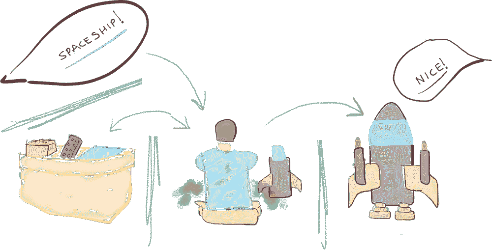
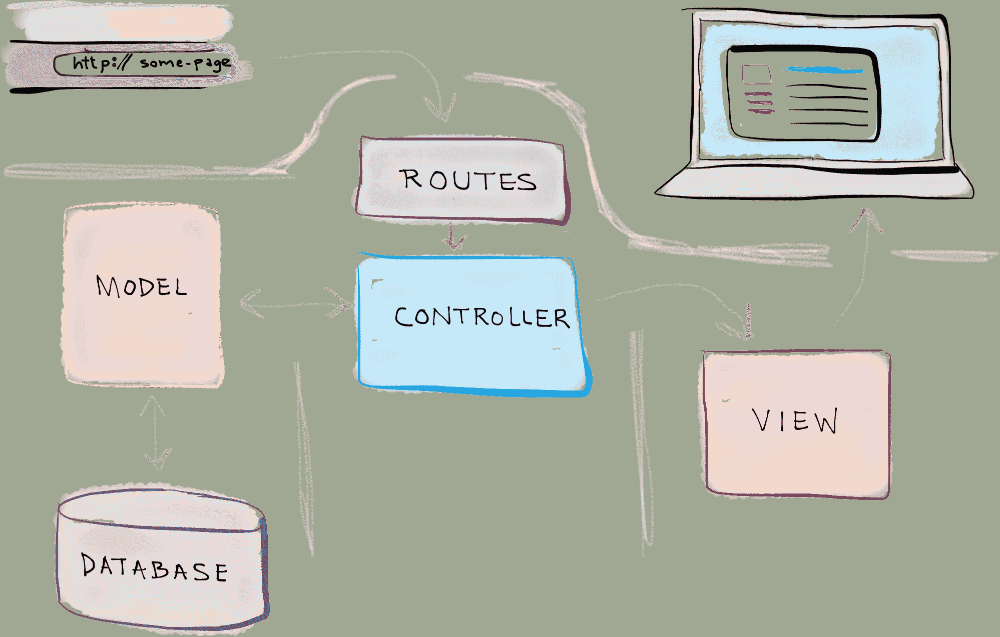

# 模型-视图-控制器(MVC)解释-用乐高

> 原文:[https://real python . com/the-model-view-controller-MVC-paradigm-summarized-with-Legos/](https://realpython.com/the-model-view-controller-mvc-paradigm-summarized-with-legos/)

为了演示使用 **[模型-视图-控制器](http://en.wikipedia.org/wiki/Model%E2%80%93view%E2%80%93controller)** 模式(或 **MVC** )构建的 web 应用程序在实践中是如何工作的，让我们沿着记忆之路走一趟…

**免费奖励:** [点击此处获取免费的 Python OOP 备忘单](https://realpython.com/bonus/python-oop/)，它会为你指出最好的教程、视频和书籍，让你了解更多关于 Python 面向对象编程的知识。

## 乐高积木！

你十岁了，坐在你家客厅的地板上，你面前是一大桶乐高积木。有各种不同形状和大小的乐高玩具。一些蓝色的，高的，长的。就像拖拉机拖车。有些是红色的，几乎是立方体形状。有些是黄色的-大而宽的平面，像玻璃片。有了这些不同类型的乐高玩具，很难说你能建造出什么。

但是惊喜，惊喜，已经有**请求**了。你哥哥跑过来说，“嘿！给我造一艘飞船！”

“好吧，”你想，“这可能真的很酷！”它是一艘宇宙飞船。

所以你开始工作。你开始拿出你认为你会需要的乐高玩具。有些大，有些小。宇宙飞船的外部用不同的颜色，引擎用不同的颜色。哦，还有不同颜色的爆能枪。(你必须有爆破枪！)

现在你已经把所有的**积木**都准备好了，是时候组装飞船了。经过几个小时的艰苦工作，现在你面前有一艘宇宙飞船！

你跑去找你哥给他看成品。“哇，干得好！”他说。“哼，”他想，“我几个小时前就要求过了，什么也没做，现在就有了。我希望每件事都那么简单。”

* * *

如果我告诉你构建一个 web 应用程序就像用乐高积木搭建一样，会怎么样？

[*Remove ads*](/account/join/)

### *这一切都始于一个*请求*……*

 *在乐高玩具的例子中，是你的哥哥让你去做一些东西。在 web 应用程序的情况下，用户输入一个 URL，请求查看某个页面。

所以你哥哥就是用户。

### 请求到达*控制器* …

有了乐高，你就是控制器。

控制器负责抓取所有必要的**构建模块**并根据需要组织它们。

### 这些积木被称为*模型*……

不同类型的乐高是模型。你有各种不同的尺寸和形状，你抓住你需要的来建造飞船。在 web 应用程序中，模型帮助控制器从数据库中检索它需要的所有信息。

### 所以请求进来了…

控制器(您)接收请求。

它去模型(乐高)取回必要的物品。

现在生产最终产品的一切准备就绪。

### 最终产品被称为*视图*……

宇宙飞船是风景。它是最终产品，最终显示给提出请求的人(你的兄弟)。

在 web 应用程序中，视图是用户在浏览器中看到的最终页面。

## 总结…

**用乐高积木搭建时:**

1.  你哥哥请求你建造一艘宇宙飞船。
2.  你收到请求。
3.  你取回并组织所有你需要建造宇宙飞船的乐高玩具。
4.  你用乐高建造宇宙飞船，然后把完成的宇宙飞船还给你的兄弟。

[](https://files.realpython.com/media/building-legos-like-mvc-web-application.caf15452d37d.png)

**在网络应用中:**

1.  用户通过输入 URL 请求查看页面。
2.  **控制器**接收该请求。
3.  它使用**模型**来检索所有必要的数据，对其进行组织，并将其发送给…
4.  **查看**，然后使用该数据来渲染最终的网页，并在用户的浏览器中呈现给用户。

[](https://files.realpython.com/media/mvc_diagram_with_routes.e12c5b982ac8.png)[*Remove ads*](/account/join/)

## *从更技术性的角度来看*

 *总结了 MVC 的功能之后，让我们更深入一点，看看在更高的技术层面上一切是如何运作的。

当您在浏览器中键入 URL 以访问 web 应用程序时，您正在请求查看应用程序中的某个页面。但是应用程序如何知道显示/呈现哪个页面呢？

当构建一个 web 应用程序时，你定义了所谓的**路线**。路由本质上是与不同页面相关联的 URL 模式。因此，当有人输入一个 URL 时，在后台，应用程序会尝试将该 URL 与这些预定义的路由之一进行匹配。

所以，其实真的有*四个*主要部件在发挥作用:**路线**、**车型**、**视图**、**控制器**。

### 路线

每条路线都与一个控制器相关联——更具体地说，是控制器内的某个功能*，称为**控制器动作**。因此，当您输入一个 URL 时，应用程序会尝试查找匹配的路由，如果成功，它会调用该路由的相关控制器操作。*

让我们看一个基本的[烧瓶](https://realpython.com/python-web-applications-with-flask-part-i/)路线作为例子:

```
@app.route('/')
def main_page():
    pass
```

这里我们建立与`main_page()`视图功能相关的`/`路线。

### 型号和控制器

在控制器动作中，通常会发生两件主要的事情:模型用于从数据库中检索所有必要的数据；并且该数据被传递给呈现所请求页面的视图。通过模型检索的数据通常被添加到一个数据结构中(比如一个列表或字典)，该结构就是发送给视图的内容。

回到我们的烧瓶例子:

```
@app.route('/')
def main_page():
    """Searches the database for entries, then displays them."""
    db = get_db()
    cur = db.execute('select * from entries order by id desc')
    entries = cur.fetchall()
    return render_template('index.html', entries=entries)
```

现在，在视图函数中，我们从数据库中获取数据并执行一些基本逻辑。这将返回一个列表，我们将它赋给变量`entries`，该变量可以在*index.html*模板中访问。

### 视图

最后，在视图中，数据结构被访问，其中包含的信息被用来呈现用户最终在浏览器中看到的页面的 HTML 内容。

同样，回到我们的 Flask 应用程序，我们可以循环通过`entries`，使用 Jinja 语法显示每一个:

```

  <li>
    <h2>{{ entry.title }}</h2>
    <div>{{ entry.text|safe }}</div>
  </li>

  <li><em>No entries yet. Add some!</em></li>

```

### 总结

因此，MVC 请求过程的更详细的技术总结如下:

1.  用户通过输入 URL 请求查看页面。
2.  应用程序将 URL 与预定义的**路线**进行匹配。
3.  调用与路线相关的**控制器动作**。
4.  控制器动作使用**模型**从数据库中检索所有必要的数据，将数据放在一个数组中，并加载一个**视图**，沿着数据结构传递。
5.  **视图**访问数据结构并使用它来呈现请求的页面，然后在用户的浏览器中呈现给用户。

这是亚历克斯·科尔曼(Alex Coleman)的一篇客座博文，他是一名编码教师和咨询网站开发人员。**