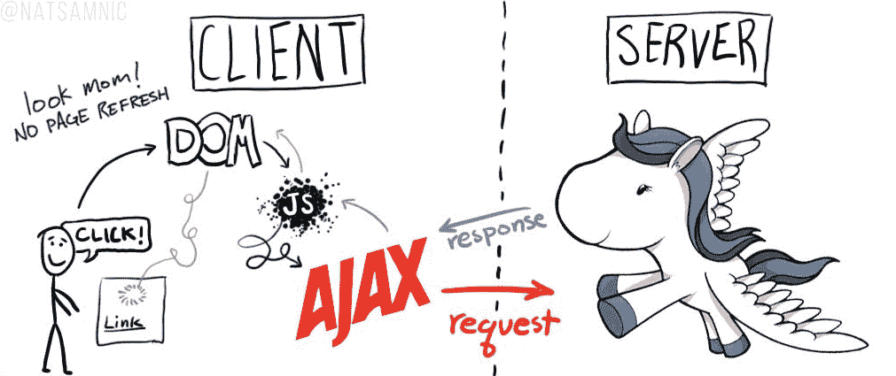

# Django 和 AJAX 表单提交——更多实践

> 原文:[https://real python . com/django-and-Ajax-form-submissions-more-practice/](https://realpython.com/django-and-ajax-form-submissions-more-practice/)

这是 Real Python 和 Nathan Nichols 先生的合作作品。

**于 2014 年 9 月 5 日更新，使应用程序更加宁静。**

* * *

欢迎光临。[上次](https://realpython.com/django-and-ajax-form-submissions/)我们在基本的 Django 通信应用中添加了 AJAX，以改善用户体验。最终结果是，由于我们消除了页面刷新，应用程序对最终用户的响应更快，功能更强。

[](https://files.realpython.com/media/django-ajax-comic.4f51a79d40cf.png)

如果你还记得的话，我们在教程的最后有一个小小的家庭作业:轮到你了。我们需要处理更多的事件。有了新发现的 jQuery 和 AJAX 知识，您就可以将它们放在适当的位置。我在最终的应用程序中添加了代码——你可以在这里下载——其中包括一个删除链接。您只需要添加一个事件来处理点击，然后该事件调用一个函数，该函数使用 AJAX 向后端发送 POST 请求，以从数据库中删除帖子。按照我在本教程中的工作流程。我们下次会公布这个问题的答案。

因此，就 CRUD 而言，我们需要添加删除功能。我们将使用以下工作流程:

1.  设置事件处理程序
2.  创建 AJAX 请求
3.  更新 Django 视图
4.  处理回电
5.  更新 DOM

## 设置事件处理程序

当用户单击删除链接时，这个“事件”需要在 JavaScript 文件中“处理”:

```py
// Delete post on click $("#talk").on('click',  'a[id^=delete-post-]',  function(){ var  post_primary_key  =  $(this).attr('id').split('-')[2]; console.log(post_primary_key)  // sanity check delete_post(post_primary_key); });
```

点击时，我们获取 post 主键，我们将它添加到一个`id`中，同时一个新的 post 被添加到 DOM 中:

```py
$("#talk").prepend("<li><strong>"+json.text+"</strong> - <em> "+json.author+"</em> - <span> "+json.created+ "</span> - <a id='delete-post-"+json.postpk+"'>delete me</a></li>");
```

我们还将主键作为参数传递给`delete_post()`函数，我们需要添加…

[*Remove ads*](/account/join/)

## *创建 AJAX 请求*

 *正如您可能猜到的那样，`delete_post()`函数处理 AJAX 请求:

```py
function  delete_post(post_primary_key){ if  (confirm('are you sure you want to remove this post?')==true){ $.ajax({ url  :  "delete_post/",  // the endpoint type  :  "DELETE",  // http method data  :  {  postpk  :  post_primary_key  },  // data sent with the delete request success  :  function(json)  { // hide the post $('#post-'+post_primary_key).hide();  // hide the post on success console.log("post deletion successful"); }, error  :  function(xhr,errmsg,err)  { // Show an error $('#results').html("<div class='alert-box alert radius' data-alert>"+ "Oops! We have encountered an error. <a href='#' class='close'>&times;</a></div>");  // add error to the dom console.log(xhr.status  +  ": "  +  xhr.responseText);  // provide a bit more info about the error to the console } }); }  else  { return  false; } };
```

将这段代码与`create_post()`函数进行比较。有什么不同？

1.  注意条件句。`confirm()`方法显示一个对话框，用户必须点击“确定”或“取消”。因为这个过程实际上会从数据库中删除文章，所以我们只想确保用户没有意外地点击删除。这只是给他们一个机会在请求发送之前取消。

    这些对话框不是处理这种情况的最优雅的方式，但它是实用的。测试一下。

2.  此外，因为我们要删除一篇文章，所以我们对 HTTP 方法使用“DELETE”。

> 请记住，一些较旧的浏览器只支持 GET 和 POST 请求。如果你知道你的应用将在一些旧版本的 ie 浏览器上使用，你可以利用 [POST tunneling](https://gist.github.com/mjhea0/43d7b4285c59c2083123) 作为一个解决方法。

## 更新 Django 视图

现在，让我们转向服务器端，更新 Django 的 URL 和视图。请求被发送到服务器端，首先由 *urls.py* 处理:

```py
# Talk urls
from django.conf.urls import patterns, url

urlpatterns = patterns(
    'talk.views',
    url(r'^$', 'home'),
    url(r'^create_post/$', 'create_post'),
    url(r'^delete_post/$', 'delete_post'),
)
```

设置好 URL 后，请求将被路由到适当的 Django 视图:

```py
def delete_post(request):
    if request.method == 'DELETE':

        post = Post.objects.get(
            pk=int(QueryDict(request.body).get('postpk')))

        post.delete()

        response_data = {}
        response_data['msg'] = 'Post was deleted.'

        return HttpResponse(
            json.dumps(response_data),
            content_type="application/json"
        )
    else:
        return HttpResponse(
            json.dumps({"nothing to see": "this isn't happening"}),
            content_type="application/json"
        )
```

如果请求方法是“删除”,那么我们从数据库中删除帖子。如果那个主键不存在会怎么样？这将导致意想不到的副作用。换句话说，我们会得到一个没有被正确处理的错误。看看您是否能找出如何捕捉错误，然后使用 try/except 语句正确处理它。

一旦帖子被删除，我们就创建一个响应 dict，将其序列化为 JSON，然后作为响应发送回客户端。

将代码与`create_post()`函数进行比较。为什么不能做`request.DELETE.get`？因为 Django 不像 GET 和 POST 请求那样为 DELETE(或 PUT)请求构造字典。因此，我们使用来自 [QueryDict](https://docs.djangoproject.com/en/1.6/ref/request-response/#django.http.QueryDict) 类的`get`方法构建了自己的字典。

> **注意**:如果我们基于 HTTP 方法(GET、POST、PUT、DELETE)使用单个视图来处理不同的场景，这个应用程序会更加 RESTful(并且代码会更加简洁)。现在，我们对 GET、POST 和 DELETE 方法有不同的看法。这可以很容易地重构为一个单一的视图:
> 
> ```py
> `def index(request):
>    if request.method == 'GET':
>        # do something
>    elif request.method == "POST":
>        # do something
>    elif request.method == "DELETE":
>        # do something
>    else:
>        # do something` 
> ```
> 
> 下次我们将 Django Rest 框架添加到项目中时，我们将深入讨论这个问题。

## 处理回调

回到 *main.js* 中的`delete_post()`函数，我们如何处理一个成功的回调呢？

```py
success  :  function(json)  { // hide the post $('#post-'+post_primary_key).hide();  // hide the post on success console.log("post deletion successful"); },
```

这里我们隐藏了一个带有特定 id 的标记，然后将一条成功消息记录到控制台。例如，如果我们删除 id 为`20`的文章，那么与 id 为`post-20`的文章相关联的标签将被隐藏。这有用吗？测试一下。不应该。让我们来解决这个问题…

## 更新 DOM

打开*index.html*模板。你看到那个身份证了吗？没有。让我们将它添加到开始的`<li>`标签中:

```py
<li id='post-{{post.pk}}'>
```

现在测试一下。应该能行。

不过，在我们结束今天的工作之前，我们还需要在另一个地方做出改变。如果你添加了一个帖子，然后立即试图删除它，会发生什么？它不应该工作，因为我们没有正确地更新 DOM。返回到`create_post()`函数，更新用于向 DOM 添加新文章的代码:

```py
$("#talk").prepend("<li id='post-"+json.postpk+"'><strong>"+json.text+ "</strong> - <em> "+json.author+"</em> - <span> "+json.created+ "</span> - <a id='delete-post-"+json.postpk+"'>delete me</a></li>");
```

注意到区别了吗？测试一下。一切都好。

[*Remove ads*](/account/join/)

## *下一步是什么？*

 *Django Rest 框架。

在此之前，如果您有任何问题，请发表评论，并查看代码的[回购](https://github.com/realpython/django-form-fun)。**