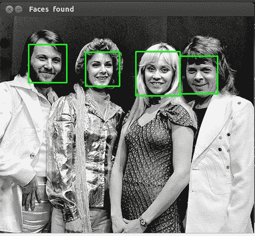
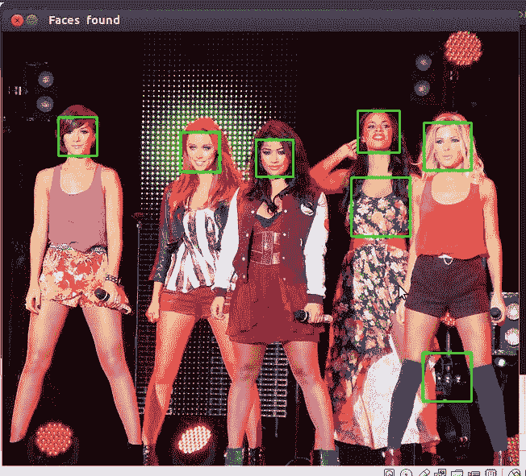

# 用 Python 实现人脸识别，不到 25 行代码

> 原文:[https://realpython.com/face-recognition-with-python/](https://realpython.com/face-recognition-with-python/)

**在这篇文章中，我们将看看一种令人惊讶的简单方法，使用 Python 和开源库 [OpenCV](http://opencv.org/) 开始面部识别。**

> 在评论区提问之前:
> 
> 1.  不要跳过这篇文章，只尝试运行代码。您必须了解代码的作用，不仅要正确运行它，还要对它进行故障排除。
> 2.  确保使用 OpenCV v2。
> 3.  有一个工作的网络摄像头，使这个脚本可以正常工作。
> 4.  回顾其他的评论和问题，因为你的问题可能已经被解决了。
> 
> 谢谢你。

**免费奖励:** ，向您展示真实世界 Python 计算机视觉技术的实用代码示例。

**注意:**也可以查看我们的[更新教程，使用 Python 进行人脸检测](https://realpython.com/traditional-face-detection-python/)。

## OpenCV

OpenCV 是最流行的计算机视觉库。最初用 C/C++编写，现在为 Python 提供绑定。

OpenCV 使用机器学习算法来搜索图片中的人脸。因为人脸是如此复杂，没有一个简单的测试可以告诉你它是否找到了人脸。相反，有成千上万的小图案和特征必须匹配。这些算法将识别人脸的任务分解成数千个更小的任务，每个任务都很容易解决。这些任务也被称为分类器。

对于像人脸这样的东西，你可能有 6000 个或更多的分类器，所有这些分类器都必须匹配才能检测到人脸(当然是在误差范围内)。但问题就在这里:对于人脸检测，算法从图片的左上角开始，向下移动穿过小块数据，查看每个块，不断地问:“这是一张脸吗？…这是脸吗？……这是脸吗？”由于每个程序块有 6000 次或更多的测试，你可能有数百万次的计算要做，这将使你的计算机陷入停顿。

为了解决这个问题，OpenCV 使用了[级联](http://docs.opencv.org/modules/objdetect/doc/cascade_classification.html)。什么是级联？最佳答案可以在[词典](http://dictionary.reference.com/browse/cascade)中找到:“一个瀑布或一系列瀑布。”

像一系列瀑布一样，OpenCV cascade 将检测人脸的问题分成多个阶段。对于每一块，它都做一个非常粗略和快速的测试。如果通过，它会做一个稍微详细一点的测试，以此类推。该算法可能有 30 到 50 个这样的阶段或级联，如果所有阶段都通过，它将只检测一个面部。

优势在于，图片的大部分在最初几个阶段将返回否定的结果，这意味着该算法不会浪费时间测试它的所有 6000 个特征。人脸检测现在可以实时完成，而不是几个小时。

[*Remove ads*](/account/join/)

### *实践中的级联*

 *虽然这个理论听起来很复杂，但实际上很容易。级联本身只是一堆包含用于检测对象的 OpenCV 数据的 XML 文件。你用你想要的级联初始化你的代码，然后它为你工作。

由于人脸检测是如此常见的情况，OpenCV 带有许多内置级联，用于检测从人脸到眼睛到手到腿的一切。甚至还有针对非人类事物的级联。例如，如果你开了一家香蕉店，想要追踪偷香蕉的人，[这个家伙](http://coding-robin.de/2013/07/22/train-your-own-opencv-haar-classifier.html)已经为此建了一个！

## 安装 OpenCV

首先，你需要为你的操作系统找到正确的安装文件。

我发现安装 OpenCV 是这项任务中最难的部分。如果您得到奇怪的无法解释的错误，这可能是由于库冲突、32/64 位差异等等。我发现最简单的方法就是使用 Linux 虚拟机，从头开始安装 OpenCV。

完成安装后，您可以通过启动 Python 会话并键入以下命令来测试它是否工作:

>>>

```py
>>> import cv2
>>>
```

如果你没有得到任何错误，你可以进入下一部分。

## 理解代码

让我们分解实际的代码，您可以从 [repo](https://github.com/shantnu/FaceDetect/) 下载。抓取 **face_detect.py** 脚本、**abba.png**pic、**Haar scade _ frontal face _ default . XML**。

```py
# Get user supplied values
imagePath = sys.argv[1]
cascPath = sys.argv[2]
```

首先将图像和层叠名称作为命令行参数传入。我们将使用 ABBA 图像以及 OpenCV 提供的默认级联来检测人脸。

```py
# Create the haar cascade
faceCascade = cv2.CascadeClassifier(cascPath)
```

现在我们创建层叠，并用我们的面部层叠初始化它。这会将面层叠加载到内存中，以便随时使用。请记住，级联只是一个 XML 文件，其中包含用于检测人脸的数据。

```py
# Read the image
image = cv2.imread(imagePath)
gray = cv2.cvtColor(image, cv2.COLOR_BGR2GRAY)
```

在这里，我们读取图像并将其转换为灰度。OpenCV 中的很多操作都是在灰度中完成的。

```py
# Detect faces in the image
faces = faceCascade.detectMultiScale(
    gray,
    scaleFactor=1.1,
    minNeighbors=5,
    minSize=(30, 30),
    flags = cv2.cv.CV_HAAR_SCALE_IMAGE
)
```

这个函数检测实际的人脸，并且是我们代码的关键部分，所以让我们来看一下选项:

1.  [`detectMultiScale`函数](http://docs.opencv.org/modules/objdetect/doc/cascade_classification.html#cascadeclassifier-detectmultiscale)是检测物体的通用函数。因为我们在 face cascade 上调用它，所以它检测的就是这个。

2.  第一个选项是灰度图像。

3.  第二个是`scaleFactor`。因为有些脸可能离镜头更近，所以看起来会比后面的脸大。比例因子对此进行了补偿。

4.  检测算法使用移动窗口来检测对象。`minNeighbors`定义在当前物体附近检测到多少个物体后，它才宣布找到人脸。同时，`minSize`给出了每个窗口的大小。

**注:**我取了这些字段的常用值。在现实生活中，您可以尝试不同的窗口大小、比例因子等值，直到找到最适合您的值。

该函数返回它认为找到人脸的矩形列表。接下来，我们将在它认为找到了什么的地方循环。

```py
print "Found {0} faces!".format(len(faces))

# Draw a rectangle around the faces
for (x, y, w, h) in faces:
    cv2.rectangle(image, (x, y), (x+w, y+h), (0, 255, 0), 2)
```

该函数返回 4 个值:矩形的`x`和`y`位置，以及矩形的宽度和高度(`w`、`h`)。

我们使用这些值通过内置的`rectangle()`函数绘制一个矩形。

```py
cv2.imshow("Faces found", image)
cv2.waitKey(0)
```

最后，我们显示图像并等待用户按键。

[*Remove ads*](/account/join/)

## *检查结果*

 *让我们对照 ABBA 照片进行测试:

```py
$ python face_detect.py abba.png haarcascade_frontalface_default.xml
```

[](https://files.realpython.com/media/face-detection-abba.ea2dcc6d3bda.jpg)

奏效了。另一张照片怎么样:

[](https://files.realpython.com/media/face-detection-example-2-wrong.874b05d5c1c3.jpg)

那…不是一张脸。让我们再试一次。我改变了参数，发现设置`scaleFactor`为 1.2 去掉了错误的脸。

[](https://files.realpython.com/media/face-detection-example-2-right.413ecb338dc3.jpg)

### 发生了什么事？

嗯，第一张照片是用高质量相机近距离拍摄的。第二张似乎是从远处拍的，可能是用手机拍的。这就是为什么`scaleFactor`必须被修改的原因。正如我所说的，你必须根据具体情况设置算法，以避免误报。

不过要注意的是，由于这是基于机器学习的，结果永远不会 100%准确。在大多数情况下，您会获得足够好的结果，但偶尔该算法会将不正确的对象识别为面部。

最终代码可以在[这里](https://github.com/shantnu/FaceDetect)找到。

## 扩展到网络摄像头

如果你想使用网络摄像头呢？OpenCV 从网络摄像头抓取每一帧，然后您可以通过处理每一帧来检测人脸。你需要一台功能强大的电脑，但我这台用了五年的笔记本电脑似乎也能应付自如，只要我不跳来跳去。

**更新:**下篇直播。使用网络摄像头查看 Python 中的[人脸检测](https://realpython.com/face-detection-in-python-using-a-webcam/)！

## 想了解更多？

**免费奖励:** ，向您展示真实世界 Python 计算机视觉技术的实用代码示例。

我将在我即将出版的《科学与工程的 Python》一书中涉及这一点以及更多，这本书目前正在 [Kickstarter](https://www.kickstarter.com/projects/513736598/python-for-science-and-engineering) 上。对于那些对机器学习感兴趣的人，我还会介绍机器学习。

谢谢！**